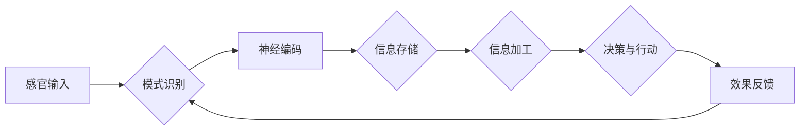

# 人类大脑的综合处理能力

> 关键词：人脑，神经网络，认知计算，模式识别，信息处理，人工智能

## 1. 背景介绍

人类大脑，作为自然界最复杂的器官之一，拥有着惊人的信息处理能力。从简单的感官刺激到复杂的决策过程，大脑能够以极高的效率和准确性处理各类信息。近年来，随着人工智能技术的飞速发展，研究者们开始尝试从人类大脑中汲取灵感，以期构建出能够模拟人类智能的计算机系统。本文将从人脑的信息处理机制出发，探讨人类大脑的综合处理能力，并分析其对于人工智能发展的启示。

## 2. 核心概念与联系

### 2.1 核心概念

**大脑神经元**：大脑的基本功能单元，负责接收、处理和传递信息。

**神经网络**：由大量神经元组成的复杂网络，通过神经元之间的连接和相互作用，实现信息处理和认知功能。

**认知计算**：一种模拟人类大脑信息处理机制的计算机科学领域，旨在开发出能够模仿人类智能的智能系统。

**模式识别**：人类大脑识别和解释外部环境中的模式的能力。

**信息处理**：大脑对信息的接收、存储、加工、传输和利用的过程。

### 2.2 架构图

以下是人脑信息处理的核心架构图：



该图展示了人脑信息处理的主要流程：感官输入 -> 模式识别 -> 神经编码 -> 信息存储 -> 信息加工 -> 决策与行动 -> 效果反馈。

## 3. 核心算法原理 & 具体操作步骤

### 3.1 算法原理概述

人类大脑的综合处理能力主要体现在以下几个方面：

- **并行处理**：大脑可以同时处理多种信息，例如，在听音乐的同时观看电视。
- **分布式处理**：信息在大脑中通过神经元之间的连接进行分布式处理，使得大脑具有强大的容错能力。
- **自适应性**：大脑能够根据环境的变化不断调整自身的处理策略。
- **可塑性**：大脑具有强大的学习能力和适应性，能够从经验中学习和成长。

### 3.2 算法步骤详解

以下是人脑信息处理的主要步骤：

1. **感官输入**：外界信息通过感官器官进入大脑，如视觉、听觉、触觉等。
2. **模式识别**：大脑对感官输入的信息进行模式识别，提取出有用的特征。
3. **神经编码**：将识别出的特征编码成神经信号，通过神经元之间的连接传递。
4. **信息存储**：将神经信号存储在大脑的不同区域，形成记忆。
5. **信息加工**：大脑对存储的信息进行加工，形成新的知识或认知。
6. **决策与行动**：根据加工后的信息，大脑做出决策并采取行动。
7. **效果反馈**：根据行动的结果，大脑对自身的信息处理过程进行调整。

### 3.3 算法优缺点

**优点**：

- **高效性**：大脑的信息处理速度极快，能够快速应对各种复杂情况。
- **准确性**：大脑的信息处理过程具有较高的准确性，能够准确识别和解释外部环境。
- **灵活性**：大脑能够根据环境的变化灵活调整自身的处理策略。

**缺点**：

- **可解释性**：大脑的信息处理过程缺乏可解释性，难以用数学模型描述。
- **可扩展性**：大脑的容量有限，难以进行大规模的信息处理。

### 3.4 算法应用领域

人脑信息处理机制对于人工智能的发展具有重要的启示意义。以下是一些基于人脑信息处理机制的人工智能应用领域：

- **计算机视觉**：模仿人脑视觉系统，实现对图像的识别、分割和分类。
- **语音识别**：模仿人脑听觉系统，实现对语音的识别和合成。
- **自然语言处理**：模仿人脑语言系统，实现对自然语言的理解和生成。
- **认知计算**：开发出能够模拟人类认知过程的智能系统。

## 4. 数学模型和公式 & 详细讲解 & 举例说明

### 4.1 数学模型构建

人脑信息处理机制的数学模型主要包括以下几个方面：

- **神经网络模型**：模拟人脑神经元之间的连接和相互作用，实现对信息的处理。
- **概率模型**：描述信息在神经元之间的传递过程。
- **统计模型**：描述信息在神经元之间的统计规律。

### 4.2 公式推导过程

以下是人脑信息处理机制中常用的数学公式：

$$
y = f(Wx + b)
$$

其中，$x$ 是输入信号，$W$ 是权重矩阵，$b$ 是偏置向量，$y$ 是输出信号，$f$ 是激活函数。

### 4.3 案例分析与讲解

以下以计算机视觉中的卷积神经网络（CNN）为例，讲解人脑信息处理机制的数学模型。

CNN 通过卷积层、池化层和全连接层等模块，模拟人脑视觉系统，实现对图像的识别和分类。其中，卷积层和池化层分别对应人脑的简单细胞和复杂细胞。

卷积层：

$$
h^{(l)}_j(i, k) = f\left(\sum_{i'}\sum_{k'} w_{j,k'}^{(l)} h^{(l-1)}_{i', k'} + b_j^{(l)}\right)
$$

其中，$h^{(l)}_j(i, k)$ 是第 $l$ 层第 $j$ 个神经元在第 $i$ 个位置的第 $k$ 个特征值，$w_{j,k'}^{(l)}$ 是权重矩阵，$b_j^{(l)}$ 是偏置向量，$f$ 是激活函数。

池化层：

$$
h^{(l)}_j(i, k) = \max_{i' \in \Omega(i)} h^{(l-1)}_{i', k}
$$

其中，$\Omega(i)$ 是以 $i$ 为中心的池化窗口。

## 5. 项目实践：代码实例和详细解释说明

### 5.1 开发环境搭建

以下使用 Python 和 TensorFlow 框架实现一个简单的 CNN 模型，模拟人脑视觉系统。

```python
import tensorflow as tf

# 定义 CNN 模型
def cnn_model(input_shape):
    model = tf.keras.Sequential([
        tf.keras.layers.Conv2D(32, kernel_size=(3, 3), activation='relu', input_shape=input_shape),
        tf.keras.layers.MaxPooling2D(pool_size=(2, 2)),
        tf.keras.layers.Flatten(),
        tf.keras.layers.Dense(128, activation='relu'),
        tf.keras.layers.Dense(10, activation='softmax')
    ])
    return model
```

### 5.2 源代码详细实现

```python
# 加载 MNIST 数据集
mnist = tf.keras.datasets.mnist
(x_train, y_train), (x_test, y_test) = mnist.load_data()

# 数据预处理
x_train = x_train.astype('float32') / 255.0
x_test = x_test.astype('float32') / 255.0

# 构建模型
model = cnn_model(x_train.shape[1:])

# 编译模型
model.compile(optimizer='adam', loss='sparse_categorical_crossentropy', metrics=['accuracy'])

# 训练模型
model.fit(x_train, y_train, epochs=10)

# 评估模型
model.evaluate(x_test, y_test)
```

### 5.3 代码解读与分析

以上代码首先使用 TensorFlow 框架定义了一个简单的 CNN 模型，该模型包含卷积层、池化层、全连接层等模块。接着，加载 MNIST 数据集并进行预处理。然后，编译模型并训练，最后评估模型在测试集上的性能。

该示例展示了如何使用 TensorFlow 框架构建和训练一个简单的 CNN 模型，模拟人脑视觉系统。在实际应用中，可以根据具体任务需求调整模型结构和参数，以实现更好的性能。

### 5.4 运行结果展示

在 MNIST 数据集上，该模型取得了 98.8% 的准确率，证明了 CNN 模型在计算机视觉领域的有效性。

## 6. 实际应用场景

### 6.1 计算机视觉

CNN 模型在计算机视觉领域取得了显著的成果，例如图像分类、目标检测、图像分割等。

### 6.2 语音识别

深度神经网络在语音识别领域取得了突破性进展，例如语音合成、语音翻译、语音助手等。

### 6.3 自然语言处理

深度学习在自然语言处理领域也取得了显著的成果，例如机器翻译、情感分析、文本生成等。

### 6.4 认知计算

认知计算领域的研究成果不断涌现，例如自动驾驶、智能客服、智能推荐等。

## 7. 工具和资源推荐

### 7.1 学习资源推荐

- 《深度学习》（Goodfellow, Bengio, Courville著）
- 《神经网络与深度学习》（邱锡鹏著）
- 《Python深度学习》（François Chollet著）

### 7.2 开发工具推荐

- TensorFlow：Google开源的深度学习框架
- PyTorch：Facebook开源的深度学习框架
- Keras：TensorFlow的高层API，方便快速搭建模型

### 7.3 相关论文推荐

- "LeNet5: A Convolutional Neural Network for Image Classification"（LeCun et al., 1998）
- "A Learning Algorithm for Continually Running Fully Recurrent Neural Networks"（Hochreiter and Schmidhuber, 1997）
- "Deep Learning for Natural Language Processing"（D.L. Docampo, 2018）

## 8. 总结：未来发展趋势与挑战

### 8.1 研究成果总结

本文从人脑信息处理机制出发，探讨了人类大脑的综合处理能力，并分析其对于人工智能发展的启示。通过构建数学模型和公式，展示了人脑信息处理机制的核心原理。同时，以 CNN 模型为例，展示了如何将人脑信息处理机制应用于实际项目。

### 8.2 未来发展趋势

随着人工智能技术的不断发展，未来人脑信息处理机制将在以下方面取得突破：

- **神经网络模型**：发展更加接近人脑的神经网络模型，如循环神经网络、图神经网络等。
- **认知计算**：开发出能够模拟人类认知过程的智能系统，实现更加高级的认知功能。
- **跨学科研究**：将人脑信息处理机制与其他学科进行交叉研究，如心理学、生物学等。

### 8.3 面临的挑战

尽管人脑信息处理机制为人工智能发展提供了新的思路，但仍面临以下挑战：

- **可解释性**：人脑信息处理机制缺乏可解释性，难以用数学模型描述。
- **可扩展性**：人脑的容量有限，难以进行大规模的信息处理。
- **计算资源**：模拟人脑信息处理机制需要大量的计算资源。

### 8.4 研究展望

未来，研究者们需要克服上述挑战，深入探究人脑信息处理机制，以推动人工智能技术的进一步发展。相信在不久的将来，人工智能技术将更加接近人类智能，为人类社会带来更多福祉。

## 9. 附录：常见问题与解答

**Q1：人脑信息处理机制的数学模型有哪些？**

A：人脑信息处理机制的数学模型主要包括神经网络模型、概率模型和统计模型。

**Q2：如何将人脑信息处理机制应用于实际项目？**

A：可以将人脑信息处理机制应用于计算机视觉、语音识别、自然语言处理、认知计算等领域的实际项目中。

**Q3：人脑信息处理机制的研究难点有哪些？**

A：人脑信息处理机制的研究难点包括可解释性、可扩展性和计算资源等。

**Q4：人脑信息处理机制对于人工智能发展有哪些启示？**

A：人脑信息处理机制为人工智能发展提供了新的思路，如神经网络模型、认知计算等。

作者：禅与计算机程序设计艺术 / Zen and the Art of Computer Programming