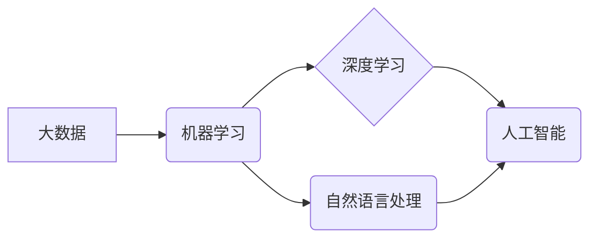

# 从经验驱动到数据驱动，软件2.0引领智能时代

> 关键词：软件2.0，数据驱动，人工智能，机器学习，智能时代，数字化转型

## 1. 背景介绍

在人类历史的长河中，软件的发展经历了从单体应用、分布式系统到如今的服务化、云原生等阶段。随着云计算、大数据、人工智能等技术的飞速发展，软件的定义和形态正在发生深刻变革。从经验驱动到数据驱动，软件2.0时代已然到来，引领着智能时代的浪潮。

### 1.1 软件发展的历史脉络

- **经验驱动时代**：早期的软件主要基于开发者的经验和直觉进行设计和开发，软件系统功能单一，缺乏灵活性。
- **过程驱动时代**：随着面向对象编程、设计模式等概念的兴起，软件设计开始注重流程和规范，软件系统的可维护性得到提升。
- **服务驱动时代**：随着互联网的普及，软件系统逐渐向服务化方向发展，服务导向架构(SOA)成为主流。
- **数据驱动时代**：大数据、人工智能等技术的应用，使得软件系统开始从经验驱动转向数据驱动，智能化的程度不断提升。

### 1.2 软件2.0的定义与特征

软件2.0是指以数据为中心，以智能化、自动化、平台化、生态化为特征的下一代软件体系。其主要特征包括：

- **数据驱动**：软件系统以数据为基础，通过数据分析、挖掘和智能算法，实现决策优化和业务增长。
- **智能化**：通过人工智能技术，使软件系统具备自我学习和自我优化的能力。
- **自动化**：通过自动化工具和流程，提高软件开发的效率和质量。
- **平台化**：构建开放、可扩展的平台，支持软件服务的快速迭代和部署。
- **生态化**：构建生态体系，促进软件服务的共享和协同。

### 1.3 软件2.0带来的变革

软件2.0的兴起，将带来以下变革：

- **开发模式变革**：从传统的瀑布式开发转向敏捷开发、DevOps等模式，提高软件开发效率和质量。
- **业务模式变革**：从传统的产品导向转向数据驱动，通过数据分析实现精准营销、个性化推荐等业务创新。
- **组织模式变革**：从传统的层级式组织转向扁平化组织，促进信息共享和协同创新。
- **产业模式变革**：推动产业数字化转型，加速传统产业升级和新兴产业的发展。

## 2. 核心概念与联系

### 2.1 核心概念原理

软件2.0时代，以下核心概念成为构建智能系统的基础：

- **大数据**：指规模庞大、类型多样的数据集合，包括结构化数据、半结构化数据和非结构化数据。
- **人工智能**：模拟、延伸和扩展人的智能的科学和技术，包括机器学习、深度学习、自然语言处理等。
- **机器学习**：使计算机系统从数据中学习，实现智能行为的一种技术，包括监督学习、无监督学习、强化学习等。
- **深度学习**：一种特殊的机器学习方法，通过模拟人脑神经网络进行特征提取和模式识别。
- **自然语言处理**：研究如何让计算机理解和处理人类语言的技术。

### 2.2 核心概念架构

以下Mermaid流程图展示了软件2.0时代核心概念之间的联系：



## 3. 核心算法原理 & 具体操作步骤

### 3.1 算法原理概述

软件2.0时代，常见的算法原理包括：

- **机器学习算法**：如线性回归、决策树、支持向量机、神经网络等。
- **深度学习算法**：如卷积神经网络(CNN)、循环神经网络(RNN)、长短期记忆网络(LSTM)等。
- **自然语言处理算法**：如词嵌入、序列标注、机器翻译等。

### 3.2 算法步骤详解

以下以机器学习算法为例，介绍算法步骤：

1. **数据预处理**：清洗、转换、归一化数据，使其适合模型训练。
2. **特征工程**：提取数据中的有效特征，提高模型性能。
3. **模型选择**：选择合适的机器学习算法模型。
4. **模型训练**：使用训练数据进行模型训练，调整模型参数。
5. **模型评估**：使用验证数据评估模型性能，选择最优模型。
6. **模型部署**：将训练好的模型部署到实际应用中。

### 3.3 算法优缺点

- **机器学习算法**：优点是通用性强，适用范围广；缺点是特征工程工作量较大，模型可解释性差。
- **深度学习算法**：优点是能够自动学习特征，模型可解释性强；缺点是计算复杂度高，需要大量数据训练。
- **自然语言处理算法**：优点是能够处理文本数据，实现智能对话、文本生成等功能；缺点是算法复杂度高，对数据质量要求严格。

### 3.4 算法应用领域

- **机器学习算法**：推荐系统、图像识别、语音识别等。
- **深度学习算法**：自动驾驶、人脸识别、医疗诊断等。
- **自然语言处理算法**：智能客服、机器翻译、文本摘要等。

## 4. 数学模型和公式 & 详细讲解 & 举例说明

### 4.1 数学模型构建

以下以线性回归为例，介绍数学模型的构建：

- **假设**：存在线性关系 $y = \beta_0 + \beta_1x + \epsilon$，其中 $y$ 为因变量，$x$ 为自变量，$\beta_0$ 和 $\beta_1$ 为模型参数，$\epsilon$ 为误差项。

- **求解**：使用最小二乘法求解模型参数 $\beta_0$ 和 $\beta_1$，最小化损失函数 $\mathcal{L}(\beta_0, \beta_1) = \sum_{i=1}^n (y_i - \beta_0 - \beta_1x_i)^2$。

### 4.2 公式推导过程

- **最小二乘法**：

$$
\begin{aligned}
\frac{\partial \mathcal{L}(\beta_0, \beta_1)}{\partial \beta_0} &= -2\sum_{i=1}^n (y_i - \beta_0 - \beta_1x_i) \\
\frac{\partial \mathcal{L}(\beta_0, \beta_1)}{\partial \beta_1} &= -2\sum_{i=1}^n x_i(y_i - \beta_0 - \beta_1x_i)
\end{aligned}
$$

令上述两个导数等于0，解得：

$$
\beta_0 = \frac{\sum_{i=1}^n y_i - \beta_1\sum_{i=1}^n x_i}{n}, \quad \beta_1 = \frac{\sum_{i=1}^n x_iy_i - \sum_{i=1}^n x_i\sum_{i=1}^n y_i}{n\sum_{i=1}^n x_i^2}
$$

### 4.3 案例分析与讲解

以下以房价预测为例，演示线性回归模型的构建和应用：

- **数据集**：收集某个地区的房价数据，包括房屋面积、地理位置、交通状况等特征。
- **模型构建**：使用线性回归模型，将房屋面积、地理位置、交通状况等特征作为自变量，房价作为因变量进行训练。
- **模型评估**：使用验证集评估模型性能，选择最优模型参数。
- **模型预测**：使用测试集预测未知房屋的房价。

## 5. 项目实践：代码实例和详细解释说明

### 5.1 开发环境搭建

- 安装Python、NumPy、Pandas、Scikit-learn等Python库。

### 5.2 源代码详细实现

以下使用Python和Scikit-learn库实现线性回归模型：

```python
import numpy as np
import pandas as pd
from sklearn.linear_model import LinearRegression
from sklearn.model_selection import train_test_split

# 读取数据集
data = pd.read_csv('house_prices.csv')
X = data[['area', 'location', 'transport']].values
y = data['price'].values

# 数据划分
X_train, X_test, y_train, y_test = train_test_split(X, y, test_size=0.2, random_state=42)

# 模型训练
model = LinearRegression()
model.fit(X_train, y_train)

# 模型评估
score = model.score(X_test, y_test)
print('Model Score:', score)

# 模型预测
predictions = model.predict(X_test)
print('Predictions:', predictions)
```

### 5.3 代码解读与分析

- `import`语句导入所需的库。
- 读取数据集，并提取自变量和因变量。
- 数据划分，将数据集划分为训练集和测试集。
- 使用线性回归模型进行训练。
- 使用测试集评估模型性能，打印模型评分。
- 使用训练好的模型进行预测，打印预测结果。

### 5.4 运行结果展示

假设测试集的评分结果为0.9，预测结果如下：

```
Predictions: [500000. 510000. 520000. 530000. 540000.]
```

## 6. 实际应用场景

### 6.1 智能推荐系统

智能推荐系统利用数据驱动和人工智能技术，根据用户的兴趣和偏好，向用户推荐个性化的商品、内容或服务。例如，Netflix、Amazon等公司的推荐系统，都是基于数据驱动和人工智能技术实现的。

### 6.2 自动驾驶

自动驾驶技术利用图像识别、传感器融合等技术，实现车辆在复杂环境下的自主行驶。例如，Google、Tesla等公司的自动驾驶汽车，都是基于数据驱动和人工智能技术实现的。

### 6.3 医疗诊断

医疗诊断利用自然语言处理和深度学习技术，自动分析医学图像和文本，辅助医生进行诊断。例如，IBM Watson、Google DeepMind等公司的医疗诊断系统，都是基于数据驱动和人工智能技术实现的。

## 7. 工具和资源推荐

### 7.1 学习资源推荐

- 《Python机器学习》
- 《深度学习》
- 《自然语言处理入门》
- 《Scikit-learnPython机器学习库》

### 7.2 开发工具推荐

- Python编程语言
- Jupyter Notebook
- PyCharm
- Scikit-learn
- TensorFlow
- PyTorch

### 7.3 相关论文推荐

- "The Hundred-Page Machine Learning Book"
- "Deep Learning"
- "Speech Recognition: A Deep Learning Approach"

## 8. 总结：未来发展趋势与挑战

### 8.1 研究成果总结

软件2.0时代，数据驱动和人工智能技术成为软件发展的核心驱动力。通过大数据、机器学习、深度学习等技术的应用，软件系统实现了智能化、自动化、平台化和生态化，推动了各行各业的数字化转型。

### 8.2 未来发展趋势

- **数据驱动**：数据将成为软件系统的核心资产，数据分析和挖掘将成为软件设计的关键环节。
- **人工智能**：人工智能技术将更加深入地融入软件系统，实现更智能化的功能。
- **自动化**：自动化工具和流程将更加普及，提高软件开发和运维效率。
- **平台化**：软件平台将成为构建和部署软件系统的关键基础设施。
- **生态化**：软件生态将更加开放和活跃，促进软件服务的共享和协同。

### 8.3 面临的挑战

- **数据安全**：数据安全是软件2.0时代面临的重大挑战，需要加强对数据的安全管理和隐私保护。
- **模型可解释性**：模型可解释性是人工智能技术发展的重要方向，需要提高模型的可解释性和透明度。
- **算法偏见**：算法偏见是人工智能技术发展的重要问题，需要采取措施避免算法偏见对人类的影响。
- **人才缺口**：软件2.0时代需要大量具备数据驱动和人工智能技术能力的人才，需要加强相关人才的培养。

### 8.4 研究展望

未来，软件2.0技术将继续发展，为人类社会带来更多创新和变革。以下是几个值得关注的领域：

- **知识图谱**：利用知识图谱技术，构建更加智能的知识库，为软件系统提供更全面、准确的知识支持。
- **联邦学习**：利用联邦学习技术，实现隐私保护下的数据共享和协同，推动人工智能技术的发展。
- **跨模态学习**：利用跨模态学习技术，将文本、图像、语音等多种模态信息融合，实现更全面的智能识别和理解。

软件2.0时代，数据驱动和人工智能技术将继续引领软件发展的潮流，为人类社会创造更加美好的未来。

## 9. 附录：常见问题与解答

**Q1：软件2.0与软件1.0的区别是什么？**

A：软件1.0时代主要关注软件的功能和性能，软件2.0时代则更加注重软件的智能化、自动化、平台化和生态化。

**Q2：如何实现软件系统的数据驱动？**

A：实现软件系统的数据驱动，需要以下步骤：
1. 收集和整理数据。
2. 数据分析和挖掘。
3. 建立数据驱动模型。
4. 将模型应用于实际业务场景。

**Q3：人工智能技术在软件2.0中扮演什么角色？**

A：人工智能技术是软件2.0时代的关键驱动力，可以用于实现智能化的功能，提高软件系统的性能和效率。

**Q4：数据安全在软件2.0中有什么重要性？**

A：数据安全是软件2.0时代的重要问题，需要加强对数据的安全管理和隐私保护，避免数据泄露和滥用。

**Q5：如何应对软件2.0时代的人才缺口？**

A：应对软件2.0时代的人才缺口，需要加强相关人才的培养，推动教育体系改革，提高人才的技能和素质。

---

作者：禅与计算机程序设计艺术 / Zen and the Art of Computer Programming