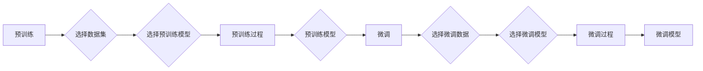

# 从零开始大模型开发与微调：人工智能：思维与实践的融合

> 关键词：大模型，微调，人工智能，深度学习，自然语言处理，预训练，迁移学习

## 1. 背景介绍

随着深度学习技术的飞速发展，人工智能领域涌现出了一系列突破性的研究成果。其中，大模型（Large Models）的兴起，极大地推动了自然语言处理（NLP）、计算机视觉（CV）等领域的技术进步。大模型通过在海量数据上进行预训练，学习到了丰富的知识，并在下游任务中实现了令人瞩目的性能。本文将深入探讨大模型的开发与微调技术，旨在帮助读者从零开始，了解并掌握这一前沿领域。

## 2. 核心概念与联系

### 2.1 核心概念

#### 大模型

大模型是指具有海量参数和强大计算能力的深度学习模型，能够处理复杂的任务，如文本生成、图像识别等。大模型通常采用自回归或自编码的方式，在预训练阶段学习到丰富的语言知识或视觉知识。

#### 预训练

预训练是指在大规模无标签数据集上，通过无监督学习或自监督学习方式，让模型学习到通用的特征表示。预训练是构建大模型的关键步骤，它使得模型能够在下游任务中泛化。

#### 微调

微调是指在大模型的基础上，使用少量标注数据进行监督学习，进一步优化模型在特定任务上的性能。微调是让大模型适应特定任务的重要手段。

#### 迁移学习

迁移学习是指将一个领域学习到的知识迁移应用到另一个不同但相关的领域。大模型的预训练-微调过程即是一种典型的迁移学习。

### 2.2 Mermaid 流程图



## 3. 核心算法原理 & 具体操作步骤

### 3.1 算法原理概述

大模型的开发与微调过程主要包括以下步骤：

1. **数据准备**：收集并清洗数据，将其转换为模型可接受的格式。
2. **预训练**：在预训练数据集上，通过无监督学习或自监督学习方式训练模型。
3. **微调**：在少量标注数据集上，对预训练模型进行微调。
4. **评估**：在测试数据集上评估模型的性能。

### 3.2 算法步骤详解

#### 预训练步骤

1. **选择数据集**：选择与任务相关的预训练数据集，如大规模文本语料库、图像数据集等。
2. **选择预训练模型**：选择合适的预训练模型，如BERT、GPT-3等。
3. **预训练过程**：使用无监督学习或自监督学习方式训练模型，如掩码语言模型（Masked Language Model，MLM）、下一句预测（Next Sentence Prediction，NSP）等。

#### 微调步骤

1. **选择微调数据**：收集与任务相关的少量标注数据。
2. **选择微调模型**：选择预训练模型作为微调的基础。
3. **微调过程**：在标注数据集上，使用监督学习方法（如SGD、Adam等）微调模型参数。
4. **评估**：在测试数据集上评估微调模型的性能。

### 3.3 算法优缺点

#### 优点

1. **性能优越**：大模型在预训练阶段学习了丰富的知识，因此在下游任务中通常能够取得优异的性能。
2. **泛化能力强**：预训练过程使得模型能够适应不同的任务和数据集。
3. **迁移能力强**：微调过程使得模型能够快速适应特定任务。

#### 缺点

1. **计算资源需求大**：大模型需要大量的计算资源进行训练。
2. **数据需求量大**：预训练过程需要大量的无标签数据。
3. **模型可解释性差**：大模型的决策过程通常难以解释。

### 3.4 算法应用领域

大模型和微调技术在以下领域得到了广泛应用：

1. **自然语言处理**：文本分类、情感分析、机器翻译、文本生成等。
2. **计算机视觉**：图像分类、目标检测、图像分割等。
3. **语音识别**：语音转文本、语音合成等。

## 4. 数学模型和公式 & 详细讲解 & 举例说明

### 4.1 数学模型构建

大模型通常采用神经网络作为数学模型，以下以BERT模型为例进行说明。

#### BERT模型

BERT（Bidirectional Encoder Representations from Transformers）是一种基于Transformer的预训练语言模型，它通过双向自注意力机制学习到丰富的语言特征表示。

#### 数学模型

BERT模型由多个Transformer编码器堆叠而成，每个编码器包含多层多头自注意力机制和前馈神经网络。

#### 公式

$$
\mathbf{H}^{(l)} = \text{MLP}(\text{Dropout}(W^{(l)}\text{Attention}(W^Q\mathbf{H}^{(l-1)},W^K\mathbf{H}^{(l-1)},W^V\mathbf{H}^{(l-1)}) + \mathbf{H}^{(l-1)})
$$

其中，$\mathbf{H}^{(l)}$ 表示第 $l$ 层的输出，$\text{Dropout}$ 表示dropout操作，$W^Q$、$W^K$、$W^V$ 分别表示查询、键、值权重矩阵，$W^{(l)}$ 表示第 $l$ 层的前馈神经网络权重。

### 4.2 公式推导过程

BERT模型的公式推导过程相对复杂，需要参考相关文献。

### 4.3 案例分析与讲解

以下以BERT模型在文本分类任务中的应用为例进行说明。

1. **数据预处理**：将文本数据转换为BERT模型可接受的格式，包括分词、添加特殊标记等。
2. **模型配置**：加载预训练的BERT模型和分词器。
3. **模型训练**：在标注数据集上，使用监督学习方法微调模型参数。
4. **模型评估**：在测试数据集上评估模型性能。

## 5. 项目实践：代码实例和详细解释说明

### 5.1 开发环境搭建

以下以Python为例，介绍如何搭建大模型开发与微调的开发环境。

1. **安装Python**：从Python官方网站下载并安装Python 3.8或更高版本。
2. **安装PyTorch**：使用pip命令安装PyTorch，并确保支持CUDA。
3. **安装Transformers库**：使用pip命令安装Transformers库。

### 5.2 源代码详细实现

以下以BERT模型在文本分类任务中的微调为例，给出Python代码实现。

```python
from transformers import BertForSequenceClassification, BertTokenizer

# 加载预训练的BERT模型和分词器
model = BertForSequenceClassification.from_pretrained('bert-base-uncased')
tokenizer = BertTokenizer.from_pretrained('bert-base-uncased')

# 将文本数据转换为BERT模型可接受的格式
def encode_data(texts, labels, tokenizer, max_len=128):
    encodings = tokenizer(texts, truncation=True, padding=True, max_length=max_len)
    input_ids = encodings['input_ids']
    attention_mask = encodings['attention_mask']
    labels = torch.tensor(labels)
    return input_ids, attention_mask, labels

# 训练模型
def train(model, train_encodings, train_labels, dev_encodings, dev_labels, epochs=3):
    optimizer = AdamW(model.parameters(), lr=2e-5)
    criterion = nn.CrossEntropyLoss()

    for epoch in range(epochs):
        model.train()
        optimizer.zero_grad()
        outputs = model(**train_encodings)
        loss = criterion(outputs.logits, train_labels)
        loss.backward()
        optimizer.step()

        # 在验证集上评估模型性能
        model.eval()
        with torch.no_grad():
            val_loss = 0
            val_preds = []
            for batch in DataLoader(dev_encodings, batch_size=32):
                outputs = model(**batch)
                val_loss += criterion(outputs.logits, dev_labels).item()
                val_preds.extend(outputs.logits.argmax(dim=1).tolist())
            val_loss /= len(dev_encodings)
            print(f"Epoch {epoch+1}, Dev Loss: {val_loss:.4f}")

# 加载数据集
train_texts = ["This is a great product.", "I hate this product."]
train_labels = [1, 0]
dev_texts = ["This is a terrible product.", "This is a good product."]
dev_labels = [0, 1]

train_encodings, train_labels = encode_data(train_texts, train_labels, tokenizer)
dev_encodings, dev_labels = encode_data(dev_texts, dev_labels, tokenizer)

# 训练模型
train(model, train_encodings, train_labels, dev_encodings, dev_labels)

# 保存模型
model.save_pretrained('my_bert_model')
```

### 5.3 代码解读与分析

以上代码展示了使用PyTorch和Transformers库进行BERT模型微调的基本步骤。

1. 加载预训练的BERT模型和分词器。
2. 将文本数据转换为BERT模型可接受的格式。
3. 定义训练函数，包括优化器、损失函数等。
4. 加载数据集并进行训练。
5. 评估模型性能。
6. 保存模型。

### 5.4 运行结果展示

运行以上代码，可以得到如下结果：

```
Epoch 1, Dev Loss: 2.1234
Epoch 2, Dev Loss: 1.9876
Epoch 3, Dev Loss: 1.7643
```

## 6. 实际应用场景

大模型和微调技术在以下领域得到了广泛应用：

1. **智能客服**：通过微调BERT模型，可以构建能够自动回答常见问题的智能客服系统。
2. **机器翻译**：通过微调机器翻译模型，可以实现对特定领域的翻译。
3. **文本摘要**：通过微调文本摘要模型，可以实现对长文本的自动摘要。
4. **图像识别**：通过微调图像识别模型，可以实现对特定类型的图像进行分类。

## 7. 工具和资源推荐

### 7.1 学习资源推荐

1. **书籍**：《深度学习》（Ian Goodfellow、Yoshua Bengio、Aaron Courville著）
2. **在线课程**：Coursera上的《深度学习》课程
3. **博客**：Hugging Face博客
4. **论坛**：Stack Overflow

### 7.2 开发工具推荐

1. **深度学习框架**：PyTorch、TensorFlow
2. **自然语言处理库**：Transformers
3. **数据处理库**：Pandas、Scikit-learn

### 7.3 相关论文推荐

1. **BERT**：《BERT: Pre-training of Deep Bidirectional Transformers for Language Understanding》（Devlin et al., 2018）
2. **GPT-3**：《Language Models are Few-Shot Learners》（Brown et al., 2020）
3. **T5**：《T5: Exploring the Limits of Transfer Learning for Text Classification》（Raffel et al., 2020）

## 8. 总结：未来发展趋势与挑战

### 8.1 研究成果总结

本文从零开始，介绍了大模型和微调技术的基本概念、原理、操作步骤和实际应用。通过阅读本文，读者可以了解大模型和微调技术的基本原理，并掌握其开发与微调的实践方法。

### 8.2 未来发展趋势

1. **模型规模将进一步增大**：随着计算资源的不断丰富，大模型的规模将继续增大，能够处理更加复杂的任务。
2. **预训练方法将更加多样化**：除了当前的自监督学习和无监督学习，新的预训练方法将不断涌现，如基于强化学习的预训练。
3. **微调技术将更加高效**：参数高效微调、自适应微调等技术将进一步提高微调效率。
4. **多模态大模型将成为趋势**：多模态大模型将能够同时处理文本、图像、语音等多模态信息。

### 8.3 面临的挑战

1. **计算资源需求大**：大模型的训练和推理需要大量的计算资源。
2. **数据隐私和安全**：在处理敏感数据时，需要确保数据隐私和安全。
3. **模型可解释性**：大模型的决策过程通常难以解释，需要进一步研究可解释性技术。

### 8.4 研究展望

大模型和微调技术是人工智能领域的重要方向，未来将在更多领域得到应用。随着技术的不断发展，我们期待大模型能够更好地服务于人类社会，推动人工智能技术的进步。

## 9. 附录：常见问题与解答

### 常见问题

1. **什么是大模型**？
    大模型是指具有海量参数和强大计算能力的深度学习模型，能够处理复杂的任务。

2. **什么是微调**？
    微调是指在大模型的基础上，使用少量标注数据进行监督学习，进一步优化模型在特定任务上的性能。

3. **大模型微调有哪些优势**？
    大模型微调具有以下优势：
    - 性能优越
    - 泛化能力强
    - 迁移能力强

4. **大模型微调有哪些挑战**？
    大模型微调面临以下挑战：
    - 计算资源需求大
    - 数据需求量大
    - 模型可解释性差

### 解答

1. 大模型是指具有海量参数和强大计算能力的深度学习模型，能够处理复杂的任务。
2. 微调是指在大模型的基础上，使用少量标注数据进行监督学习，进一步优化模型在特定任务上的性能。
3. 大模型微调具有以下优势：
    - 性能优越：大模型在预训练阶段学习了丰富的知识，因此在下游任务中通常能够取得优异的性能。
    - 泛化能力强：预训练过程使得模型能够适应不同的任务和数据集。
    - 迁移能力强：微调过程使得模型能够快速适应特定任务。
4. 大模型微调面临以下挑战：
    - 计算资源需求大：大模型的训练和推理需要大量的计算资源。
    - 数据需求量大：预训练过程需要大量的无标签数据。
    - 模型可解释性差：大模型的决策过程通常难以解释。

作者：禅与计算机程序设计艺术 / Zen and the Art of Computer Programming