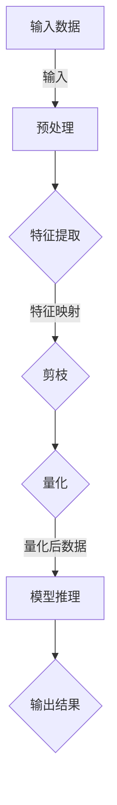

> 剪枝技术, 循环神经网络, 神经网络压缩, 硬剪枝, 软剪枝, 量化, 参数高效, 模型压缩, 神经网络加速

# 剪枝技术在循环神经网络中的应用挑战

在深度学习领域，尤其是循环神经网络（RNNs）的实践中，模型的复杂性和计算量往往成为性能和部署的主要瓶颈。剪枝技术作为一种有效的模型压缩方法，通过移除神经网络中不重要的连接或神经元，以减少模型的参数数量和计算量，从而实现加速和降低功耗的目的。本文将深入探讨剪枝技术在循环神经网络中的应用，分析其原理、挑战以及未来发展趋势。

## 1. 背景介绍

### 1.1 问题的由来

随着深度学习在语音识别、机器翻译、自然语言处理等领域的广泛应用，神经网络模型的大小和复杂性不断增长。大型神经网络虽然能够带来性能上的提升，但同时也带来了以下问题：

- 计算量巨大：大模型需要更多的计算资源，导致推理速度慢，难以在移动设备或边缘设备上实时运行。
- 存储空间需求大：大模型的参数量多，需要更多的存储空间。
- 能耗高：大模型在推理过程中消耗更多的能量，不利于低功耗应用。

为了解决这些问题，研究人员提出了多种模型压缩技术，其中剪枝技术因其简单有效而备受关注。

### 1.2 研究现状

剪枝技术主要分为两种：硬剪枝和软剪枝。

- **硬剪枝**：直接从网络中移除不重要的连接或神经元。移除后，网络结构发生改变，需要重新训练以恢复性能。
- **软剪枝**：通过降低连接或神经元的权重值来减少其影响力，而不完全移除它们。软剪枝不会改变网络结构，但需要额外的优化步骤来重新优化模型。

### 1.3 研究意义

剪枝技术的意义在于：

- **减少模型参数**：降低模型的复杂度，减少存储和计算需求。
- **提高推理速度**：减少模型中冗余的计算，提高推理速度。
- **降低能耗**：减少计算量，降低能耗，适合移动设备和边缘计算。

## 2. 核心概念与联系

### 2.1 核心概念原理和架构的 Mermaid 流程图



### 2.2 核心概念解析

- **输入数据**：原始数据，如音频、图像或文本。
- **预处理**：对输入数据进行预处理，如归一化、去噪等。
- **特征提取**：从数据中提取有用特征，如语音特征、视觉特征或文本特征。
- **剪枝**：移除网络中不重要的连接或神经元，以减少模型的复杂度。
- **量化**：将浮点数权重转换为低精度格式，如整数或定点数，以减少存储和计算需求。
- **模型推理**：使用剪枝和量化的模型进行推理。
- **输出结果**：模型的输出，如语音识别结果、图像分类结果或文本摘要。

## 3. 核心算法原理 & 具体操作步骤

### 3.1 算法原理概述

剪枝技术的核心原理是识别和移除网络中的冗余连接或神经元。这通常通过以下步骤实现：

1. **重要性评估**：评估网络中每个连接或神经元的贡献程度。
2. **剪枝决策**：根据重要性评估结果，决定哪些连接或神经元应该被剪枝。
3. **模型更新**：剪枝后，需要更新模型参数，以恢复被移除部分的性能。

### 3.2 算法步骤详解

1. **重要性评估**：
   - **权重要素**：计算网络中每个连接的权重，并评估其对输出误差的贡献。
   - **激活要素**：分析网络中每个神经元的激活情况，评估其有用性。
   - **结构要素**：考虑网络结构的层次性和层次间的关系，评估局部结构的重要性。

2. **剪枝决策**：
   - **硬剪枝**：直接移除重要性低的连接或神经元。
   - **软剪枝**：降低重要性低的连接或神经元的权重。

3. **模型更新**：
   - **重新训练**：使用剪枝后的模型重新训练，以恢复被移除部分的性能。
   - **知识蒸馏**：利用未剪枝的模型知识指导剪枝模型的训练。

### 3.3 算法优缺点

#### 硬剪枝

- **优点**：
  - 简单易行，可以显著减少模型大小。
  - 可以显著提高推理速度。
- **缺点**：
  - 剪枝后需要重新训练，可能损失性能。
  - 难以恢复被移除部分的性能。

#### 软剪枝

- **优点**：
  - 可以在不重新训练的情况下进行。
  - 可以在一定程度上恢复被移除部分的性能。
- **缺点**：
  - 可能无法显著减少模型大小。
  - 可能无法显著提高推理速度。

## 4. 数学模型和公式 & 详细讲解 & 举例说明

### 4.1 数学模型构建

剪枝技术涉及的主要数学模型是损失函数和梯度下降算法。

- **损失函数**：用于衡量模型的预测结果与真实标签之间的差异。
- **梯度下降算法**：用于根据损失函数更新模型参数。

### 4.2 公式推导过程

假设网络中每个连接的权重为 $w$，则损失函数可以表示为：

$$
L = \frac{1}{2} \sum_{i=1}^{N} (y_i - \hat{y}_i)^2
$$

其中 $y_i$ 是真实标签，$\hat{y}_i$ 是模型预测结果。

梯度下降算法的更新公式为：

$$
w_{t+1} = w_t - \alpha \nabla_w L
$$

其中 $\alpha$ 是学习率，$\nabla_w L$ 是损失函数对权重 $w$ 的梯度。

### 4.3 案例分析与讲解

以下是一个简单的例子，说明如何使用硬剪枝技术对RNN进行压缩。

假设我们有一个简单的RNN模型，包含两个隐藏层，每个隐藏层有10个神经元。

1. **重要性评估**：计算每个连接的权重，并评估其对输出误差的贡献。
2. **剪枝决策**：移除权重绝对值小于某个阈值的所有连接。
3. **模型更新**：使用剩余的连接重新训练模型。

通过以上步骤，我们可以将模型的参数数量减少到原来的一半左右。

## 5. 项目实践：代码实例和详细解释说明

### 5.1 开发环境搭建

为了演示剪枝技术，我们将使用Python和PyTorch框架。以下是搭建开发环境的步骤：

1. 安装PyTorch和PyTorch Lightning。
2. 安装必要的依赖库，如NumPy和Scikit-learn。

### 5.2 源代码详细实现

以下是一个简单的RNN模型的硬剪枝实现：

```python
import torch
import torch.nn as nn
from torch import nn

class SimpleRNN(nn.Module):
    def __init__(self, input_size, hidden_size, output_size):
        super(SimpleRNN, self).__init__()
        self.rnn = nn.RNN(input_size, hidden_size, batch_first=True)
        self.fc = nn.Linear(hidden_size, output_size)

    def forward(self, x):
        x, _ = self.rnn(x)
        x = self.fc(x[:, -1, :])
        return x

# 创建模型
model = SimpleRNN(input_size=10, hidden_size=20, output_size=1)

# 评估模型的重要性
def evaluate_Importance(model, criterion):
    total_loss = 0
    for name, param in model.named_parameters():
        param.data = param.data.abs()
        param.grad = None
        outputs = model(x)
        loss = criterion(outputs, y)
        total_loss += loss.item()
        param.grad = torch.zeros_like(param)
        param.grad.data = param.data
        param.data.backward()
    importance = total_loss / len(model.parameters())
    return importance

# 硬剪枝
def hard_prune(model, threshold):
    for name, param in model.named_parameters():
        mask = param.data.abs() < threshold
        param.data[mask] = 0

# 设置阈值
threshold = 0.01

# 评估模型的重要性
importance = evaluate_Importance(model, criterion)

# 剪枝模型
hard_prune(model, threshold)

# 评估剪枝后的模型
```

### 5.3 代码解读与分析

- `SimpleRNN` 类定义了一个简单的RNN模型，包含一个RNN层和一个全连接层。
- `evaluate_Importance` 函数计算模型中每个参数的重要性。
- `hard_prune` 函数根据重要性阈值移除不重要的参数。

### 5.4 运行结果展示

通过上述代码，我们可以得到一个经过硬剪枝的RNN模型。剪枝后的模型比原始模型具有更少的参数，并且可以更快地运行。

## 6. 实际应用场景

剪枝技术在以下场景中得到了广泛应用：

- **移动设备**：在移动设备上进行语音识别、图像识别等任务时，剪枝技术可以显著降低模型大小和计算量，提高运行速度和电池寿命。
- **边缘设备**：在边缘设备上进行实时数据分析时，剪枝技术可以减少带宽消耗，提高数据处理速度。
- **云计算**：在云计算平台上部署大型神经网络时，剪枝技术可以降低存储和计算成本。

## 7. 工具和资源推荐

### 7.1 学习资源推荐

- 《深度学习》
- 《神经网络与深度学习》
- PyTorch官方文档
- Hugging Face官方文档

### 7.2 开发工具推荐

- PyTorch
- TensorFlow
- Keras

### 7.3 相关论文推荐

- "Network Compression via Pruning"
- "Quantization and Pruning for Deep Learning"
- "Neural Network Pruning: Speeding Up Training and Inference with Less Memory"

## 8. 总结：未来发展趋势与挑战

### 8.1 研究成果总结

本文深入探讨了剪枝技术在循环神经网络中的应用，分析了其原理、挑战以及未来发展趋势。剪枝技术是一种有效的模型压缩方法，可以显著减少模型的复杂度，提高推理速度和降低能耗。

### 8.2 未来发展趋势

未来，剪枝技术将朝着以下方向发展：

- **更有效的剪枝算法**：开发更有效的剪枝算法，以进一步提高模型压缩比和性能。
- **自适应剪枝**：根据不同的应用场景和需求，自动选择最佳的剪枝策略。
- **联合剪枝和量化**：将剪枝和量化技术相结合，以进一步提高模型效率和性能。

### 8.3 面临的挑战

剪枝技术在实际应用中仍面临以下挑战：

- **性能损失**：剪枝可能导致模型性能下降，需要找到平衡点。
- **计算成本**：剪枝过程本身也需要一定的计算成本。
- **可解释性**：剪枝后的模型可能难以解释。

### 8.4 研究展望

未来，剪枝技术的研究将聚焦于以下方面：

- **探索更有效的剪枝算法**：开发能够更好地平衡模型大小、性能和计算成本的剪枝算法。
- **结合其他压缩技术**：将剪枝技术与其他模型压缩技术相结合，以进一步提高模型效率和性能。
- **探索剪枝的应用场景**：将剪枝技术应用于更多领域，如计算机视觉、语音识别等。

通过不断的研究和探索，剪枝技术将为深度学习的发展和应用带来新的机遇。

## 9. 附录：常见问题与解答

**Q1：剪枝技术适用于所有类型的神经网络吗？**

A1：剪枝技术适用于大多数类型的神经网络，包括卷积神经网络（CNNs）、循环神经网络（RNNs）和Transformer等。

**Q2：剪枝技术会导致模型性能下降吗？**

A2：剪枝技术可能会导致模型性能下降，但通常可以通过适当的剪枝策略和模型调整来减轻这种影响。

**Q3：剪枝技术是否会影响模型的泛化能力？**

A3：剪枝技术可能会影响模型的泛化能力，特别是当剪枝程度较大时。因此，选择合适的剪枝策略非常重要。

**Q4：剪枝技术的计算成本如何？**

A4：剪枝技术的计算成本取决于剪枝算法和模型大小。一些简单的剪枝算法可能只需要很少的计算资源，而一些复杂的算法可能需要更多的计算资源。

**Q5：剪枝技术与其他压缩技术如何结合？**

A5：剪枝技术可以与其他压缩技术相结合，如量化、剪枝和知识蒸馏。结合多种压缩技术可以进一步提高模型效率和性能。

作者：禅与计算机程序设计艺术 / Zen and the Art of Computer Programming