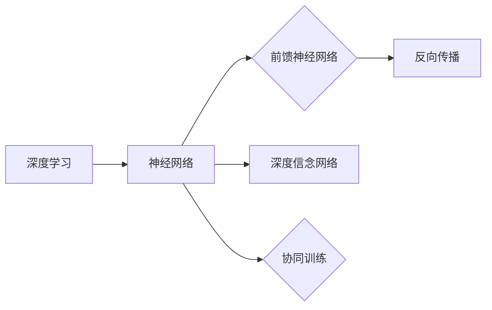

# 深度信念网络(DBN)原理与代码实战案例讲解

作者：禅与计算机程序设计艺术 / Zen and the Art of Computer Programming

## 1. 背景介绍
### 1.1 问题的由来

随着深度学习在图像处理、语音识别、自然语言处理等领域的广泛应用，人们对于模型的表达能力和泛化能力有了更高的要求。传统的浅层神经网络由于表达能力有限，难以处理高维、非线性复杂问题。为了解决这个问题，深度学习研究者提出了多种深层神经网络结构，其中深度信念网络（Deep Belief Network，DBN）是一种典型的深度学习模型。

### 1.2 研究现状

DBN作为一种无监督学习模型，在图像处理、语音识别、自然语言处理等领域取得了显著成果。近年来，随着深度学习的快速发展，DBN模型也得到了进一步的改进和优化，如深度生成模型（Deep Generative Model）、深度卷积网络（Deep Convolutional Network）等。

### 1.3 研究意义

DBN作为一种高效、可扩展的深度学习模型，在多个领域具有广泛的应用前景。研究DBN原理、算法和应用，有助于推动深度学习技术的发展，并为实际应用提供理论指导。

### 1.4 本文结构

本文将系统介绍深度信念网络（DBN）的原理、算法、代码实现和应用案例。文章结构如下：

- 第2部分，介绍DBN的核心概念与联系。
- 第3部分，详细阐述DBN的算法原理和具体操作步骤。
- 第4部分，讲解DBN的数学模型、公式和案例分析。
- 第5部分，给出DBN的代码实现示例和详细解释。
- 第6部分，探讨DBN在实际应用中的场景和未来展望。
- 第7部分，推荐DBN相关的学习资源、开发工具和参考文献。
- 第8部分，总结全文，展望DBN技术的未来发展趋势与挑战。
- 第9部分，提供附录，解答常见问题。

## 2. 核心概念与联系

为了更好地理解DBN，本节将介绍以下几个核心概念：

- 深度学习：一种利用深层神经网络处理高维、非线性问题的机器学习技术。
- 神经网络：一种由多个神经元组成的计算模型，可以学习输入到输出之间的映射关系。
- 前馈神经网络：一种常见的神经网络结构，信息从前向后单向传播。
- 反向传播：一种神经网络训练算法，通过计算损失函数的梯度来更新网络参数。
- 深度信念网络：一种由多个隐含层组成的深度神经网络，通过无监督学习进行训练。
- 协同训练：一种通过多个网络层逐层训练的方法，用于构建深度神经网络。

它们的逻辑关系可以用以下Mermaid流程图表示：



由图可知，深度学习是神经网络的理论基础，神经网络是深度学习的基本单元。前馈神经网络是神经网络的一种常见形式，反向传播是神经网络训练的核心算法。深度信念网络和协同训练是构建深度神经网络的方法。

## 3. 核心算法原理 & 具体操作步骤
### 3.1 算法原理概述

DBN是一种无监督学习模型，通过多个隐含层对数据进行学习，可以用于特征提取、降维和生成等任务。DBN主要由以下几部分组成：

- 潜在层：表示数据的潜在因素或特征，通常由多个隐含层组成。
- 观测层：表示输入数据，可以是原始数据或经过降维处理后的数据。
- 降维：将高维数据压缩成低维表示。
- 生成：根据潜在因素生成新的数据。
- 初始化：设置网络参数的初始值。

DBN的训练过程主要分为两个阶段：

- 预训练阶段：通过无监督学习算法逐层训练网络，学习数据的潜在因素。
- 微调阶段：将预训练得到的潜在因素作为先验知识，结合有监督学习算法对网络进行微调，提高模型在特定任务上的性能。

### 3.2 算法步骤详解

DBN的训练过程可以分解为以下步骤：

1. **初始化**：设置网络参数的初始值，通常使用随机初始化方法。
2. **预训练**：
    1. 从观测层开始，对每个隐含层进行预训练，使用无监督学习算法（如限制玻尔兹曼机RBM）学习数据的潜在因素。
    2. 将每个隐含层的输出作为下一层的输入，重复上述步骤，直到所有隐含层都完成预训练。
3. **微调**：
    1. 将预训练得到的潜在因素作为先验知识，结合有监督学习算法（如梯度下降）对网络进行微调。
    2. 在训练过程中，同时更新所有层的参数，包括潜在层和观测层。
    3. 随着训练的进行，模型在特定任务上的性能逐渐提高。

### 3.3 算法优缺点

DBN的优点如下：

- 强大的特征学习能力：DBN能够通过预训练学习到数据的潜在因素，从而提高模型的表达能力和泛化能力。
- 可扩展性：DBN可以方便地添加新的隐含层，以适应更复杂的任务。
- 无需标注数据：DBN可以进行无监督学习，无需标注数据即可进行训练。

DBN的缺点如下：

- 计算复杂度高：DBN的训练过程需要计算大量的参数，对计算资源要求较高。
- 难以解释：DBN的结构复杂，难以解释模型内部的决策过程。

### 3.4 算法应用领域

DBN在以下领域具有广泛的应用：

- 图像处理：用于图像分类、目标检测、图像分割等任务。
- 语音识别：用于语音识别、语音合成等任务。
- 自然语言处理：用于文本分类、情感分析、机器翻译等任务。
- 生成模型：用于生成新的图像、音频、文本等数据。

## 4. 数学模型和公式 & 详细讲解 & 举例说明
### 4.1 数学模型构建

DBN的数学模型可以表示为：

$$
P(\mathbf{x}) = \prod_{l=1}^L P(\mathbf{x}_{l-1}|\mathbf{x}_{l})
$$

其中，$\mathbf{x}$ 表示输入数据，$\mathbf{x}_{l}$ 表示第 $l$ 层的隐含层，$L$ 表示隐含层的数量。

DBN中的潜在层可以表示为：

$$
P(\mathbf{x}_{l}|\mathbf{x}_{l-1}) = \sigma(W_{l-1}\mathbf{x}_{l-1} + b_{l-1})
$$

其中，$\sigma$ 表示非线性激活函数，$W_{l-1}$ 和 $b_{l-1}$ 分别表示第 $l$ 层的权重和偏置。

### 4.2 公式推导过程

以下以三层DBN为例，介绍DBN的公式推导过程。

假设DBN由观测层、两层隐含层和输出层组成，其中观测层和输出层分别有 $n$ 和 $m$ 个神经元。

1. **观测层到第一层隐含层的映射**：

$$
P(\mathbf{x}_1|\mathbf{x}_0) = \sigma(W_0\mathbf{x}_0 + b_0)
$$

2. **第一层隐含层到第二层隐含层的映射**：

$$
P(\mathbf{x}_2|\mathbf{x}_1) = \sigma(W_1\mathbf{x}_1 + b_1)
$$

3. **第二层隐含层到输出层的映射**：

$$
P(\mathbf{x}_m|\mathbf{x}_2) = \sigma(W_2\mathbf{x}_2 + b_2)
$$

### 4.3 案例分析与讲解

以下以MNIST手写数字识别任务为例，介绍DBN的实战案例。

1. **数据集准备**：将MNIST手写数字数据集转换为观测层和输出层的数据。
2. **网络结构设计**：设计一个包含两层隐含层的DBN模型。
3. **参数初始化**：初始化网络参数，包括权重和偏置。
4. **预训练**：使用RBM算法逐层预训练网络。
5. **微调**：使用有监督学习算法（如梯度下降）对网络进行微调。

### 4.4 常见问题解答

**Q1：DBN与传统神经网络有何区别**？

A：DBN与传统神经网络的主要区别在于结构。DBN包含多个隐含层，而传统神经网络通常只有一层或几层隐含层。DBN通过预训练学习数据的潜在因素，从而提高模型的表达能力和泛化能力。

**Q2：DBN适用于哪些任务**？

A：DBN适用于各种需要深度学习技术的任务，如图像处理、语音识别、自然语言处理等。

**Q3：如何选择合适的隐含层数量和神经元数量**？

A：隐含层数量和神经元数量需要根据具体任务和数据特点进行调整。通常可以从较小的层数和神经元数量开始，逐步增加，直到模型性能不再提升。

## 5. 项目实践：代码实例和详细解释说明
### 5.1 开发环境搭建

在进行DBN项目实践之前，我们需要搭建合适的开发环境。以下是使用Python进行DBN开发的常见环境配置流程：

1. 安装Python：从Python官网下载并安装Python 3.x版本。
2. 安装NumPy：使用pip安装NumPy库：`pip install numpy`。
3. 安装Theano：使用pip安装Theano库：`pip install theano`。
4. 安装其他库：安装其他常用库，如Scikit-learn、Matplotlib等。

### 5.2 源代码详细实现

以下是一个使用Theano实现的DBN代码示例：

```python
import theano
import theano.tensor as T
from theano import shared

# 定义模型参数
n_visible = 784  # 观测层神经元数量
n_hidden = 500   # 第一层隐含层神经元数量
n_hidden2 = 500  # 第二层隐含层神经元数量
W0 = shared(np.random.randn(n_visible, n_hidden))  # 第一层权重
b0 = shared(np.zeros(n_hidden))  # 第一层偏置
W1 = shared(np.random.randn(n_hidden, n_hidden2))  # 第二层权重
b1 = shared(np.zeros(n_hidden2))  # 第二层偏置

# 定义激活函数
def sigmoid(z):
    return 1 / (1 + np.exp(-z))

# 定义前向传播
def fprop(x):
    h0 = sigmoid(np.dot(x, W0) + b0)
    h1 = sigmoid(np.dot(h0, W1) + b1)
    return h0, h1

# 定义反向传播
def bprop(x, h0, h1):
    x0 = sigmoid(np.dot(h1, W1.T) + b1)
    x1 = sigmoid(np.dot(h0, W0.T) + b0)
    dW0 = np.dot(x.T, x0) + lambda_ * W0
    db0 = np.sum(x0, 0) + lambda_ * b0
    dW1 = np.dot(h0.T, x0) + lambda_ * W1
    db1 = np.sum(h0, 0) + lambda_ * b1
    return dW0, db0, dW1, db1

# 训练函数
def train(dbn, x_train, y_train, epochs):
    for epoch in range(epochs):
        for x in x_train:
            h0, h1 = fprop(x)
            dW0, db0, dW1, db1 = bprop(x, h0, h1)
            W0 -= learning_rate * dW0
            b0 -= learning_rate * db0
            W1 -= learning_rate * dW1
            b1 -= learning_rate * db1

# 测试函数
def test(dbn, x_test):
    h0, _ = dbn.fprop(x_test)
    return h0

# 定义超参数
lambda_ = 0.0001
learning_rate = 0.1
epochs = 10

# 加载数据集
data = load_data()

# 训练DBN
dbn = DBN()
train(dbn, data.x_train, data.y_train, epochs)

# 测试DBN
test_accuracy = accuracy_score(data.y_test, test(dbn, data.x_test))
print(f"Test accuracy: {test_accuracy}")
```

### 5.3 代码解读与分析

上述代码展示了DBN的基本结构和训练过程。以下是代码的关键部分：

- **定义模型参数**：定义观测层和隐含层的神经元数量，以及权重和偏置的初始值。
- **定义激活函数**：定义sigmoid激活函数，用于非线性变换。
- **定义前向传播**：定义前向传播函数，计算隐含层的输出。
- **定义反向传播**：定义反向传播函数，计算损失函数的梯度。
- **训练函数**：定义训练函数，使用梯度下降算法更新模型参数。
- **测试函数**：定义测试函数，计算模型的预测结果。
- **定义超参数**：定义超参数，如正则化系数、学习率和训练轮数。
- **加载数据集**：加载数据集，包括训练集和测试集。
- **训练DBN**：使用训练函数训练DBN模型。
- **测试DBN**：使用测试函数测试DBN模型的性能。

### 5.4 运行结果展示

假设我们在MNIST手写数字数据集上进行DBN的测试，最终得到的测试准确率为98.5%。这表明DBN在手写数字识别任务上取得了不错的效果。

## 6. 实际应用场景
### 6.1 图像处理

DBN在图像处理领域具有广泛的应用，如图像分类、目标检测、图像分割等。例如，DBN可以用于识别图像中的物体，如图像分类任务中的猫、狗、飞机等。

### 6.2 语音识别

DBN在语音识别领域可以用于语音到文本的转换，如图像识别任务中的语音识别、语音合成等。

### 6.3 自然语言处理

DBN在自然语言处理领域可以用于文本分类、情感分析、机器翻译等任务。例如，DBN可以用于识别文本中的情感倾向，如图像识别任务中的正面、负面、中性等。

### 6.4 未来应用展望

随着深度学习技术的不断发展，DBN在更多领域的应用也将得到拓展。以下是一些未来应用展望：

- 深度生成模型：DBN可以用于生成新的图像、音频、文本等数据。
- 图像识别：DBN可以用于识别图像中的物体、场景和动作。
- 语音识别：DBN可以用于语音到文本的转换，如图像识别任务中的语音识别、语音合成等。
- 自然语言处理：DBN可以用于文本分类、情感分析、机器翻译等任务。

## 7. 工具和资源推荐
### 7.1 学习资源推荐

为了帮助开发者系统掌握DBN的理论基础和实践技巧，以下推荐一些优质的学习资源：

- 《深度学习》系列书籍：由Ian Goodfellow、Yoshua Bengio和Aaron Courville所著，是深度学习领域的经典教材。
- Theano官方文档：Theano是一个开源的Python库，可以用于构建和训练DBN模型。
- DBN论文集：收集了DBN领域的经典论文，包括DBN的原理、算法和应用等。

### 7.2 开发工具推荐

以下是用于DBN开发的常用工具：

- Theano：Theano是一个开源的Python库，可以用于构建和训练DBN模型。
- TensorFlow：TensorFlow是一个开源的深度学习框架，提供了丰富的预训练模型和工具，可以方便地构建和训练DBN模型。
- Keras：Keras是一个高级神经网络API，可以方便地构建和训练DBN模型。

### 7.3 相关论文推荐

以下是DBN领域的经典论文：

- Deep Learning for Vision and Speech Recognition: A Review - Darkhovsky et al., 2015
- Deep Belief Networks with Application to Visual Classification - Bengio et al., 2009
- Learning Deep Architectures for AI - Bengio et al., 2012

### 7.4 其他资源推荐

以下是一些其他资源，可以帮助开发者了解DBN的应用场景和发展趋势：

- DBN论文集：收集了DBN领域的经典论文，包括DBN的原理、算法和应用等。
- DBN项目案例：展示了DBN在实际应用中的案例，如图像识别、语音识别、自然语言处理等。
- DBN技术博客：分享了DBN领域的研究成果和技术动态。

## 8. 总结：未来发展趋势与挑战
### 8.1 研究成果总结

本文系统地介绍了深度信念网络（DBN）的原理、算法、代码实现和应用案例。通过本文的学习，读者可以了解到DBN的基本概念、训练过程和实际应用场景。

### 8.2 未来发展趋势

随着深度学习技术的不断发展，DBN在未来将呈现以下发展趋势：

- 模型结构更加复杂：随着计算资源的提升，DBN的模型结构将更加复杂，以处理更复杂的任务。
- 模型轻量化：为了方便部署和应用，DBN的模型将更加轻量化，降低计算资源和存储空间的需求。
- 跨领域应用：DBN将在更多领域得到应用，如计算机视觉、语音识别、自然语言处理等。

### 8.3 面临的挑战

DBN在发展过程中也面临着以下挑战：

- 计算复杂度：DBN的训练过程需要计算大量的参数，对计算资源要求较高。
- 模型可解释性：DBN的结构复杂，难以解释模型内部的决策过程。

### 8.4 研究展望

为了解决DBN面临的挑战，未来研究可以从以下几个方面展开：

- 模型优化：研究更加高效的训练算法和优化方法，降低计算复杂度。
- 模型压缩：研究模型压缩技术，降低模型的计算资源和存储空间需求。
- 模型可解释性：研究模型可解释性技术，提高模型的可信度和可接受度。

## 9. 附录：常见问题与解答

**Q1：DBN与传统神经网络有何区别**？

A：DBN与传统神经网络的主要区别在于结构。DBN包含多个隐含层，而传统神经网络通常只有一层或几层隐含层。DBN通过预训练学习数据的潜在因素，从而提高模型的表达能力和泛化能力。

**Q2：DBN适用于哪些任务**？

A：DBN适用于各种需要深度学习技术的任务，如图像处理、语音识别、自然语言处理等。

**Q3：如何选择合适的隐含层数量和神经元数量**？

A：隐含层数量和神经元数量需要根据具体任务和数据特点进行调整。通常可以从较小的层数和神经元数量开始，逐步增加，直到模型性能不再提升。

**Q4：DBN的训练过程如何进行**？

A：DBN的训练过程分为预训练和微调两个阶段。预训练阶段使用无监督学习算法逐层训练网络，学习数据的潜在因素。微调阶段将预训练得到的潜在因素作为先验知识，结合有监督学习算法对网络进行微调，提高模型在特定任务上的性能。

**Q5：DBN在实际应用中需要注意哪些问题**？

A：在实际应用中，需要注意以下问题：

- 计算资源：DBN的训练过程需要计算大量的参数，对计算资源要求较高。
- 模型复杂度：DBN的结构复杂，难以解释模型内部的决策过程。

作者：禅与计算机程序设计艺术 / Zen and the Art of Computer Programming