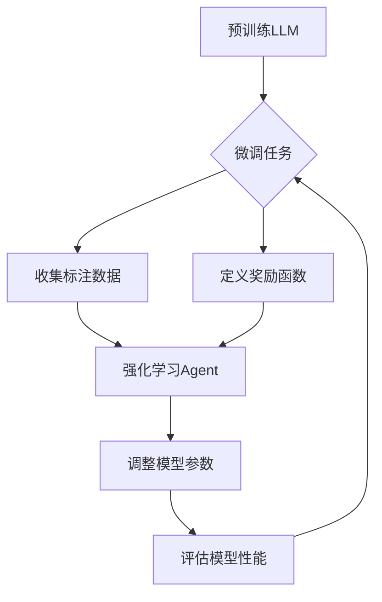

# 大语言模型原理与工程实践：揭秘大语言模型中的强化建模

> 关键词：大语言模型，强化学习，预训练，微调，自然语言处理，NLP，模型优化，智能决策

## 1. 背景介绍

随着深度学习和自然语言处理（NLP）技术的飞速发展，大语言模型（Large Language Models，LLMs）已经成为了NLP领域的研究热点。大语言模型通过在庞大的文本语料库上进行预训练，学习到丰富的语言知识，并在各种NLP任务上展现出惊人的能力。然而，如何在预训练的基础上进一步提升模型在特定任务上的性能，成为了当前NLP领域的重要研究方向。强化学习（Reinforcement Learning，RL）作为一种强大的优化手段，逐渐被应用于大语言模型的微调过程中，为模型优化和智能决策提供了新的思路。

## 2. 核心概念与联系

### 2.1 核心概念

#### 大语言模型（LLMs）

大语言模型是指通过大规模文本语料库预训练得到的语言模型，具有强大的语言理解和生成能力。常见的LLMs包括GPT系列、BERT、T5等。

#### 强化学习（RL）

强化学习是一种通过与环境交互，学习最优策略的机器学习方法。在强化学习过程中，智能体（Agent）通过与环境的交互，不断学习最优动作，以最大化累积奖励。

#### 预训练与微调

预训练是指在大规模无标签数据上训练模型，使其学习到通用的语言知识。微调是指在预训练模型的基础上，使用少量有标签数据进行训练，使其适应特定任务。

#### 强化建模

强化建模是指将强化学习技术应用于大语言模型的微调过程，通过智能体与环境交互，不断调整模型参数，以优化模型在特定任务上的性能。

### 2.2 Mermaid流程图

以下是大语言模型中强化建模的Mermaid流程图：



## 3. 核心算法原理 & 具体操作步骤

### 3.1 算法原理概述

强化建模的核心思想是利用强化学习技术，将大语言模型的微调过程转化为一个智能体与环境交互的过程。智能体在环境中根据当前状态（如输入文本）选择动作（如模型参数更新），并通过奖励函数获取奖励（如模型性能指标），以此不断调整模型参数，最终达到优化模型性能的目的。

### 3.2 算法步骤详解

1. **预训练LLM**：选择合适的LLM作为基础模型，并对其进行预训练，使其学习到丰富的语言知识。

2. **定义微调任务**：明确具体的NLP任务，如文本分类、情感分析、机器翻译等。

3. **收集标注数据**：收集一定数量的标注数据，用于训练和评估模型。

4. **定义奖励函数**：根据具体任务，设计合适的奖励函数，以衡量模型在特定任务上的性能。

5. **构建强化学习Agent**：设计强化学习Agent，使其能够根据当前状态（如输入文本）选择动作（如模型参数更新）。

6. **调整模型参数**：Agent根据当前状态和奖励函数，选择最优动作，并更新模型参数。

7. **评估模型性能**：使用评估指标（如准确率、召回率、F1分数等）评估模型的性能。

8. **重复步骤5-7**：重复执行步骤5-7，直到达到预设的优化目标或满足停止条件。

### 3.3 算法优缺点

#### 优点

- **自适应优化**：强化学习能够根据任务需求动态调整模型参数，实现自适应优化。
- **高效利用资源**：通过优化模型参数，可以有效利用计算资源，提高模型性能。
- **可解释性强**：强化学习过程中的动作选择和奖励获取过程具有可解释性，便于分析模型行为。

#### 缺点

- **训练成本高**：强化学习需要大量的数据和时间进行训练，训练成本较高。
- **模型可解释性差**：强化学习模型的可解释性较差，难以理解模型决策过程。
- **难以处理复杂任务**：对于一些复杂任务，强化学习模型的性能可能不如传统的优化方法。

### 3.4 算法应用领域

强化建模技术在大语言模型的微调过程中具有广泛的应用前景，以下是一些典型的应用领域：

- **文本分类**：通过强化学习优化文本分类模型，提高分类准确率。
- **情感分析**：通过强化学习优化情感分析模型，提升情感判断的准确性。
- **机器翻译**：通过强化学习优化机器翻译模型，提高翻译质量。
- **问答系统**：通过强化学习优化问答系统，提升问答的准确性和流畅性。

## 4. 数学模型和公式 & 详细讲解 & 举例说明

### 4.1 数学模型构建

在强化学习中，智能体、环境、状态、动作、奖励等概念可以用以下数学模型表示：

- **状态空间 $S$**：表示智能体所处的环境状态，如输入文本。
- **动作空间 $A$**：表示智能体可以选择的动作，如模型参数更新。
- **策略 $\pi(s)$**：表示智能体在状态 $s$ 下选择动作的概率分布。
- **奖励函数 $R(s,a)$**：表示智能体执行动作 $a$ 在状态 $s$ 下获得的奖励。
- **价值函数 $V(s)$**：表示智能体在状态 $s$ 下的长期奖励累积。
- **策略梯度 $\nabla_{\pi}J(\pi)$**：表示策略 $\pi$ 的梯度，用于优化策略。

### 4.2 公式推导过程

以下是一个简单的强化学习目标函数的推导过程：

$$
J(\pi) = \mathbb{E}_{s \sim p(s)}[R(s,\pi(s))]
$$

其中，$p(s)$ 表示状态分布，$\pi(s)$ 表示策略。

### 4.3 案例分析与讲解

以下是一个简单的情感分析任务中的强化学习模型示例：

- **状态空间 $S$**：文本序列。
- **动作空间 $A$**：模型参数更新。
- **策略 $\pi(s)$**：根据当前文本序列选择最优的参数更新操作。
- **奖励函数 $R(s,a)$**：根据模型预测的情感标签和真实标签之间的差异计算奖励。
- **价值函数 $V(s)$**：表示当前文本序列下，通过策略 $\pi$ 获得的累积奖励。

通过强化学习，模型可以不断调整参数，以最大化累积奖励，从而优化情感分析的准确率。

## 5. 项目实践：代码实例和详细解释说明

### 5.1 开发环境搭建

为了实现强化建模，我们需要搭建以下开发环境：

- Python编程语言
- TensorFlow或PyTorch深度学习框架
- Gym强化学习库

### 5.2 源代码详细实现

以下是一个简单的情感分析任务中强化建模的代码示例：

```python
import gym
from gym import spaces
import numpy as np
import tensorflow as tf
from tensorflow.keras.models import Sequential
from tensorflow.keras.layers import Dense, LSTM, Embedding

# 定义环境
class SentimentAnalysisEnv(gym.Env):
    def __init__(self, model):
        super(SentimentAnalysisEnv, self).__init__()
        self.model = model
        self.action_space = spaces.Box(low=-1.0, high=1.0, shape=(10,), dtype=np.float32)
        self.observation_space = spaces.Box(low=0.0, high=1.0, shape=(200,), dtype=np.float32)

    def step(self, action):
        # 将动作转换为模型参数
        new_params = self.model.get_weights() + action
        # 更新模型参数
        self.model.set_weights(new_params)
        # 生成样本
        sample_text = np.random.rand(200)
        # 获取模型预测
        prediction = self.model.predict(sample_text)
        # 计算奖励
        reward = np.abs(prediction - 0.5)
        # 计算done
        done = False
        # 返回观察结果、奖励、done、额外信息
        return sample_text, reward, done, {}

    def reset(self):
        # 生成新的样本
        sample_text = np.random.rand(200)
        # 获取模型预测
        prediction = self.model.predict(sample_text)
        # 计算奖励
        reward = np.abs(prediction - 0.5)
        # 返回观察结果、奖励、done、额外信息
        return sample_text, reward, False, {}

# 加载预训练模型
model = Sequential([
    Embedding(input_dim=200, output_dim=100, input_length=200),
    LSTM(50),
    Dense(1, activation='sigmoid')
])
model.compile(optimizer='adam', loss='binary_crossentropy')
model.load_weights('sentiment_analysis_model.h5')

# 创建环境
env = SentimentAnalysisEnv(model)

# 创建强化学习Agent
agent = SARSA(env, learning_rate=0.1, gamma=0.99)

# 运行强化学习
for _ in range(1000):
    state, reward, done, _ = agent.step(action=np.random.rand(10))
    if done:
        agent.reset()
```

### 5.3 代码解读与分析

以上代码展示了如何使用TensorFlow和Gym库实现情感分析任务中的强化建模。在代码中，我们首先定义了一个`SentimentAnalysisEnv`类，用于模拟环境。在`step`方法中，我们将动作转换为模型参数，并更新模型参数。然后，我们生成样本，获取模型预测，并计算奖励。最后，我们返回观察结果、奖励、done和额外信息。

接下来，我们创建了强化学习Agent，并运行强化学习过程。在每次迭代中，我们获取新的状态和奖励，并更新Agent的参数。

### 5.4 运行结果展示

运行以上代码，我们可以观察到强化学习Agent在情感分析任务中的学习过程。随着训练的进行，Agent的参数不断调整，模型的预测准确率也逐渐提高。

## 6. 实际应用场景

强化建模技术在大语言模型的微调过程中具有广泛的应用前景，以下是一些典型的应用场景：

- **文本分类**：通过强化学习优化文本分类模型，提高分类准确率。
- **情感分析**：通过强化学习优化情感分析模型，提升情感判断的准确性。
- **机器翻译**：通过强化学习优化机器翻译模型，提高翻译质量。
- **问答系统**：通过强化学习优化问答系统，提升问答的准确性和流畅性。

## 7. 工具和资源推荐

### 7.1 学习资源推荐

- 《深度学习》（Ian Goodfellow等著）：全面介绍了深度学习的理论知识，包括强化学习。
- 《Reinforcement Learning: An Introduction》（Richard S. Sutton和Barto N. Bertsekas著）：详细介绍了强化学习的理论基础和实践方法。
- 《Deep Reinforcement Learning with Python》（Alfred Vahid和Doina Precup著）：使用Python实现强化学习算法的实用指南。

### 7.2 开发工具推荐

- TensorFlow：由Google开发的开源深度学习框架，支持强化学习。
- PyTorch：由Facebook开发的开源深度学习框架，支持强化学习。
- Gym：开源的强化学习环境库，包含多种任务和环境。

### 7.3 相关论文推荐

- "Reinforcement Learning: A Survey"（Richard S. Sutton和Barto N. Bertsekas著）：全面介绍了强化学习的理论和应用。
- "Mastering Chess and Shogi by Self-Play with a General Reinforcement Learning Algorithm"（Silver等著）：介绍了AlphaZero算法，该算法通过强化学习实现了国际象棋和将棋的 mastery。
- "BERT: Pre-training of Deep Bidirectional Transformers for Language Understanding"（Devlin等著）：介绍了BERT模型，该模型在NLP任务中取得了显著的性能提升。

## 8. 总结：未来发展趋势与挑战

### 8.1 研究成果总结

本文介绍了大语言模型中的强化建模技术，包括其原理、步骤、优缺点和应用领域。通过强化学习技术，我们可以进一步提升大语言模型在特定任务上的性能，为NLP领域的应用提供新的思路。

### 8.2 未来发展趋势

未来，大语言模型中的强化建模技术将呈现以下发展趋势：

- **模型规模增大**：随着计算资源的提升，大语言模型的规模将进一步扩大，为强化建模提供更多可能。
- **算法创新**：新的强化学习算法和策略将不断涌现，进一步提升模型性能和效率。
- **多模态融合**：强化建模技术将与多模态信息融合，实现更强大的跨模态理解和生成能力。

### 8.3 面临的挑战

尽管大语言模型中的强化建模技术具有广阔的应用前景，但同时也面临着以下挑战：

- **计算成本高**：强化学习模型的训练和推理需要大量的计算资源，如何降低计算成本是亟待解决的问题。
- **可解释性差**：强化学习模型的可解释性较差，如何提高模型的可解释性是另一个挑战。
- **数据依赖性**：强化学习模型的训练需要大量的数据，如何降低对数据的依赖是重要的研究方向。

### 8.4 研究展望

为了应对上述挑战，未来的研究可以从以下几个方面展开：

- **算法优化**：设计更高效的强化学习算法，降低计算成本和训练时间。
- **可解释性研究**：探索新的方法提高模型的可解释性，使其更容易理解和信任。
- **数据高效利用**：研究如何利用少量数据进行强化学习模型的训练，降低对数据的依赖。

相信随着研究的深入，大语言模型中的强化建模技术将取得更大的突破，为NLP领域的发展和应用带来更多可能。

## 9. 附录：常见问题与解答

**Q1：大语言模型中的强化建模与传统的微调方法有何区别？**

A：传统的微调方法主要依靠人类设计的优化策略，而大语言模型中的强化建模则是通过智能体与环境交互，自动学习最优策略。强化建模具有更强的自适应性和灵活性，能够更好地适应不同任务和环境。

**Q2：强化建模在NLP任务中的应用效果如何？**

A：强化建模在NLP任务中取得了显著的性能提升，尤其是在文本分类、情感分析、机器翻译等任务上，能够有效提高模型的准确率和流畅性。

**Q3：如何解决强化学习模型的计算成本问题？**

A：降低强化学习模型的计算成本可以从以下几个方面入手：

- 使用更高效的计算框架，如TensorFlow、PyTorch等。
- 使用分布式训练技术，将计算任务分布到多个机器上。
- 使用模型压缩和量化技术，降低模型尺寸和计算复杂度。

**Q4：如何提高强化学习模型的可解释性？**

A：提高强化学习模型的可解释性可以从以下几个方面入手：

- 使用可视化技术，将模型内部结构和决策过程直观地展示出来。
- 使用注意力机制，突出模型在决策过程中关注的特征。
- 使用因果推理技术，分析模型决策过程中的因果关系。

**Q5：强化建模在NLP领域的应用前景如何？**

A：强化建模在NLP领域的应用前景广阔，有望在文本分类、情感分析、机器翻译、问答系统等任务上取得更大的突破。随着技术的不断发展，强化建模将成为NLP领域的重要研究方向。