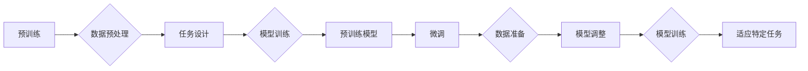

# 大语言模型原理基础与前沿 按空格分割

> 关键词：大语言模型，深度学习，预训练，微调，自然语言处理，Transformer，BERT，GPT

## 1. 背景介绍

随着深度学习技术的飞速发展，自然语言处理（NLP）领域迎来了前所未有的突破。大语言模型（Large Language Models，LLMs）作为一种新兴的研究方向，凭借其强大的语言理解和生成能力，在众多NLP任务上取得了显著的成果。本文将深入探讨大语言模型的原理、基础与前沿技术，旨在帮助读者全面了解这一领域的发展现状和未来趋势。

## 2. 核心概念与联系

### 2.1 大语言模型

大语言模型是指通过海量数据预训练的、具有强大语言理解能力的深度学习模型。它们通常包含数亿甚至数千亿个参数，能够理解复杂的语言结构和语义。

### 2.2 预训练

预训练是指在大规模无标签数据上训练模型，使其能够学习到通用的语言知识。预训练过程通常包括以下几个步骤：

1. 数据预处理：对原始文本数据进行清洗、分词等操作，将其转换为模型可处理的格式。
2. 任务设计：设计合适的自监督或无监督学习任务，如语言建模、文本分类等。
3. 模型训练：在大量无标签数据上进行训练，学习通用的语言知识。

### 2.3 微调

微调是指在大语言模型的基础上，使用少量有标签数据对模型进行细粒度调整，使其能够适应特定任务。微调过程通常包括以下几个步骤：

1. 数据准备：收集特定任务的有标签数据，并将其转换为模型可处理的格式。
2. 模型调整：调整预训练模型的输入层和输出层，以适应特定任务。
3. 模型训练：在少量有标签数据上训练模型，优化模型参数。

### 2.4 Mermaid 流程图

以下是大语言模型预训练和微调的Mermaid流程图：



## 3. 核心算法原理 & 具体操作步骤

### 3.1 算法原理概述

大语言模型的核心算法通常基于深度神经网络，特别是Transformer模型。Transformer模型是一种基于自注意力机制的序列到序列模型，具有以下几个特点：

1. 自注意力机制：通过计算输入序列中每个元素与其他元素之间的注意力权重，实现全局信息的捕捉。
2. 堆叠编码器-解码器结构：通过堆叠多个编码器-解码器层，逐步提取和传递语义信息。
3. 位置编码：引入位置编码，使模型能够理解序列中元素的顺序信息。

### 3.2 算法步骤详解

1. 数据预处理：对原始文本数据进行清洗、分词等操作，将其转换为模型可处理的格式，如BERT的token id表示。
2. 模型构建：构建Transformer模型，包括编码器、解码器和位置编码等组件。
3. 预训练：在大量无标签数据上训练模型，学习通用的语言知识。
4. 微调：在少量有标签数据上调整模型参数，使其能够适应特定任务。
5. 模型评估：在测试集上评估模型性能，如准确率、召回率、F1值等。

### 3.3 算法优缺点

**优点**：

* 强大的语言理解能力
* 适用于各种NLP任务
* 预训练模型可以迁移到其他任务

**缺点**：

* 计算量大
* 对数据质量要求高
* 难以解释

### 3.4 算法应用领域

大语言模型在以下NLP任务上取得了显著成果：

* 文本分类
* 机器翻译
* 问答系统
* 机器阅读理解
* 语音识别

## 4. 数学模型和公式 & 详细讲解 & 举例说明

### 4.1 数学模型构建

大语言模型通常基于以下数学模型：

1. **注意力机制**：

   $$A(Q, K, V) = \frac{(QK^T)}{\sqrt{d_k}} \times V$$

   其中，$Q$、$K$ 和 $V$ 分别代表查询、键和值向量，$d_k$ 代表注意力头的大小。

2. **位置编码**：

   $$P_i = [\sin(\frac{pos_i}{10000^{2i/d_k}}), \cos(\frac{pos_i}{10000^{2i/d_k}})]$$

   其中，$pos_i$ 代表位置索引，$d_k$ 代表位置编码的维度。

### 4.2 公式推导过程

以注意力机制为例，推导过程如下：

1. 计算查询向量 $Q$ 和键向量 $K$ 的点积：
   $$QK^T$$
2. 对点积进行缩放，以防止梯度消失问题：
   $$\frac{(QK^T)}{\sqrt{d_k}}$$
3. 根据缩放后的点积计算注意力权重：
   $$\frac{(QK^T)}{\sqrt{d_k}} \times V$$

### 4.3 案例分析与讲解

以BERT模型为例，分析其数学模型和公式：

1. **输入表示**：

   $$[CLS, x_1, x_2, ..., x_n, CLS]$$

   其中，$[CLS]$ 代表分类任务中的分类标记，$x_1, x_2, ..., x_n$ 代表文本中的token。

2. **位置编码**：

   $$P_i = [\sin(\frac{pos_i}{10000^{2i/d_k}}), \cos(\frac{pos_i}{10000^{2i/d_k}})]$$

3. **Transformer编码器**：

   $$H = \text{Transformer}(P, [CLS])$$

   其中，$P$ 代表编码器的输入，$[CLS]$ 代表分类标记，$H$ 代表编码器的输出。

4. **分类器层**：

   $$[CLS] = H_{[CLS]}$$

   其中，$H_{[CLS]}$ 代表分类标记的输出。

## 5. 项目实践：代码实例和详细解释说明

### 5.1 开发环境搭建

1. 安装Python环境和必要的库：
   ```bash
   pip install torch transformers
   ```

2. 下载预训练模型和分词器：
   ```python
   from transformers import BertForSequenceClassification, BertTokenizer
   model = BertForSequenceClassification.from_pretrained('bert-base-uncased')
   tokenizer = BertTokenizer.from_pretrained('bert-base-uncased')
   ```

### 5.2 源代码详细实现

以下是一个简单的BERT文本分类模型的实现示例：

```python
import torch
from torch.utils.data import DataLoader
from transformers import AdamW, get_linear_schedule_with_warmup

# 加载数据集
train_dataset = ...
dev_dataset = ...
test_dataset = ...

# 定义模型
model = BertForSequenceClassification.from_pretrained('bert-base-uncased')

# 定义优化器和学习率调度器
optimizer = AdamW(model.parameters(), lr=5e-5)
scheduler = get_linear_schedule_with_warmup(optimizer, num_warmup_steps=0, num_training_steps=len(train_dataset) * 3)

# 训练模型
def train_epoch(model, train_dataset, batch_size, optimizer, scheduler, device):
    # ...

# 评估模型
def evaluate(model, dataset, batch_size, device):
    # ...

# 训练和评估
train_epoch(model, train_dataset, batch_size, optimizer, scheduler, device)
evaluate(model, dev_dataset, batch_size, device)
evaluate(model, test_dataset, batch_size, device)
```

### 5.3 代码解读与分析

以上代码展示了如何使用PyTorch和Transformers库搭建一个简单的BERT文本分类模型。代码主要分为以下几个部分：

1. **数据加载**：加载数据集、定义分词器。
2. **模型定义**：加载预训练模型和分词器。
3. **优化器和学习率调度器**：定义优化器和学习率调度器。
4. **训练函数**：定义训练函数，包括数据加载、模型训练和损失计算。
5. **评估函数**：定义评估函数，计算模型在测试集上的性能指标。
6. **训练和评估**：启动训练和评估过程。

## 6. 实际应用场景

大语言模型在以下实际应用场景中取得了显著成效：

### 6.1 机器翻译

大语言模型可以用于机器翻译任务，如将英语翻译成中文、将法语翻译成德语等。BERT、GPT等模型在机器翻译任务上取得了显著的成果，使得机器翻译更加准确、流畅。

### 6.2 问答系统

大语言模型可以用于构建问答系统，如智能客服、知识图谱问答等。通过微调模型，可以使模型更好地理解用户的问题，并给出准确的答案。

### 6.3 文本摘要

大语言模型可以用于文本摘要任务，如自动生成新闻摘要、论文摘要等。通过微调模型，可以使模型更好地提取文本中的关键信息，并生成简洁、准确的摘要。

### 6.4 未来应用展望

大语言模型在未来的应用场景将更加广泛，如：

* 智能写作：自动生成新闻报道、小说、诗歌等。
* 代码生成：自动生成代码、测试用例等。
* 医疗诊断：辅助医生进行疾病诊断。
* 智能客服：提供更加智能、个性化的服务。

## 7. 工具和资源推荐

### 7.1 学习资源推荐

* 《BERT：原理、应用与实践》
* 《深度学习自然语言处理》
* Hugging Face官方网站（https://huggingface.co/）
* arXiv论文预印本（https://arxiv.org/）

### 7.2 开发工具推荐

* PyTorch
* TensorFlow
* Transformers库
* Jupyter Notebook

### 7.3 相关论文推荐

* Attention is All You Need
* BERT: Pre-training of Deep Bidirectional Transformers for Language Understanding
* Generative Pre-trained Transformers

## 8. 总结：未来发展趋势与挑战

### 8.1 研究成果总结

大语言模型在NLP领域取得了显著的成果，为众多NLP任务提供了强大的工具和解决方案。

### 8.2 未来发展趋势

* 模型规模将持续扩大
* 微调方法将更加多样
* 持续学习将成为常态
* 多模态微调崛起
* 模型通用性增强

### 8.3 面临的挑战

* 标注成本瓶颈
* 模型鲁棒性不足
* 推理效率有待提高
* 可解释性亟需加强
* 安全性有待保障
* 知识整合能力不足

### 8.4 研究展望

未来，大语言模型微调技术将朝着更加智能化、普适化、可解释、可控制的方向发展，为构建人机协同的智能时代贡献力量。

## 9. 附录：常见问题与解答

**Q1：什么是预训练？**

A：预训练是指在大规模无标签数据上训练模型，使其能够学习到通用的语言知识。

**Q2：什么是微调？**

A：微调是指在大语言模型的基础上，使用少量有标签数据对模型进行细粒度调整，使其能够适应特定任务。

**Q3：大语言模型在哪些NLP任务上取得了显著成果？**

A：大语言模型在文本分类、机器翻译、问答系统、机器阅读理解、语音识别等NLP任务上取得了显著成果。

**Q4：如何降低大语言模型的计算量？**

A：可以通过模型裁剪、量化加速、模型并行等技术降低大语言模型的计算量。

**Q5：如何提高大语言模型的可解释性？**

A：可以通过注意力机制可视化、特征重要性分析等方法提高大语言模型的可解释性。

作者：禅与计算机程序设计艺术 / Zen and the Art of Computer Programming