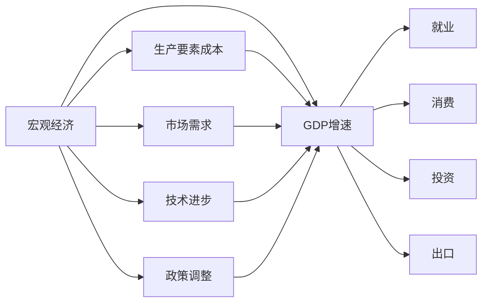

> 关键词：宏观经济，增速放缓，GDP，通货膨胀，就业，消费，投资，出口，政策调整，经济周期

# 宏观经济增速放缓的表现

随着全球经济一体化的深入和科技进步的加速，各国宏观经济增速逐渐放缓已成为一种普遍现象。本文将深入探讨宏观经济增速放缓的表现，分析其背后的原因，并展望未来发展趋势。

## 1. 背景介绍

近年来，全球经济增长放缓已成为一个不容忽视的现象。发达国家如美国、欧洲和日本等，经济增速明显放缓，新兴经济体也面临增长压力。我国作为世界第二大经济体，尽管保持了相对稳定的增长，但也面临着增速放缓的挑战。

### 1.1 经济增速放缓的背景

1. **全球产业链重构**：随着全球产业链的调整，传统制造业向新兴市场转移，发达国家经济结构转型，导致经济增长动力减弱。
2. **科技创新放缓**：科技创新对经济增长的推动作用逐渐减弱，科技创新周期拉长，新兴技术尚未形成规模效应。
3. **人口老龄化**：发达国家人口老龄化问题日益严重，劳动力供给减少，社会保障负担加重，影响经济增长。
4. **环境资源约束**：资源枯竭、环境污染等问题日益突出，对经济增长形成制约。

### 1.2 经济增速放缓的影响

1. **就业压力增大**：经济增长放缓导致企业投资减少，就业岗位减少，失业率上升。
2. **消费能力下降**：居民收入增长放缓，消费能力下降，影响经济增长。
3. **投资需求减弱**：企业投资意愿降低，投资需求减弱，影响经济增长。
4. **出口增长放缓**：全球经济放缓导致外需疲软，出口增长放缓，影响经济增长。

## 2. 核心概念与联系

### 2.1 核心概念原理

宏观经济增速放缓是指在一定时期内，一个国家或地区的国内生产总值(GDP)增速下降的现象。其背后的原因是多方面的，包括但不限于：

1. **生产要素成本上升**：劳动力成本、土地成本、原材料成本等生产要素成本上升，导致企业盈利能力下降，投资意愿降低。
2. **市场需求疲软**：全球经济增长放缓，市场需求疲软，影响企业销售和盈利。
3. **技术进步放缓**：科技创新对经济增长的推动作用减弱，导致经济增长动力不足。
4. **政策调整**：政府为应对经济下行压力，可能采取一系列政策调整，如减税降费、扩大财政支出等。

### 2.2 核心概念架构

以下是宏观经济增速放缓的概念架构图：



## 3. 核心算法原理 & 具体操作步骤

### 3.1 算法原理概述

宏观经济增速放缓的算法原理主要涉及对宏观经济数据的分析和预测。通过分析GDP、就业、消费、投资、出口等宏观经济指标，可以判断经济增长的态势和趋势。

### 3.2 算法步骤详解

1. **数据收集**：收集GDP、就业、消费、投资、出口等宏观经济数据。
2. **数据预处理**：对收集到的数据进行分析，剔除异常值，并进行归一化处理。
3. **模型选择**：选择合适的预测模型，如时间序列模型、回归模型等。
4. **模型训练**：使用历史数据对模型进行训练，优化模型参数。
5. **模型预测**：使用训练好的模型对未来的经济增长进行预测。

### 3.3 算法优缺点

**优点**：

1. **全面分析**：综合考虑多个宏观经济指标，对经济增长态势进行全面分析。
2. **预测准确**：使用先进的预测模型，提高预测准确性。

**缺点**：

1. **数据依赖**：预测结果依赖于数据的准确性，数据缺失或错误会影响预测结果。
2. **模型复杂**：预测模型可能较为复杂，难以理解和解释。

### 3.4 算法应用领域

宏观经济增速放缓的算法原理可以应用于以下领域：

1. **政策制定**：为政府制定相关政策提供参考依据。
2. **企业决策**：为企业制定发展战略提供参考。
3. **投资分析**：为投资者提供投资决策参考。

## 4. 数学模型和公式 & 详细讲解 & 举例说明

### 4.1 数学模型构建

宏观经济增速放缓的数学模型可以采用时间序列模型或回归模型。以下以回归模型为例进行说明。

假设经济增长率 $Y_t$ 与多个影响因素 $X_{t1}, X_{t2}, ..., X_{tk}$ 之间存在线性关系，可以建立以下回归模型：

$$
Y_t = \beta_0 + \beta_1 X_{t1} + \beta_2 X_{t2} + ... + \beta_k X_{tk} + \epsilon_t
$$

其中，$Y_t$ 为第 $t$ 年的经济增长率，$X_{t1}, X_{t2}, ..., X_{tk}$ 为第 $t$ 年的多个影响因素，$\beta_0, \beta_1, ..., \beta_k$ 为模型参数，$\epsilon_t$ 为随机误差项。

### 4.2 公式推导过程

回归模型的推导过程如下：

1. **假设**：$Y_t$ 与 $X_{t1}, X_{t2}, ..., X_{tk}$ 之间存在线性关系。
2. **数据收集**：收集 $Y_t$ 和 $X_{t1}, X_{t2}, ..., X_{tk}$ 的数据。
3. **模型估计**：使用最小二乘法估计模型参数 $\beta_0, \beta_1, ..., \beta_k$。
4. **模型检验**：对估计的模型进行检验，如t检验、F检验等。

### 4.3 案例分析与讲解

假设我们要预测我国未来一年的经济增长率，影响因素包括GDP增长率、失业率、固定资产投资增长率等。

1. **数据收集**：收集相关数据，如GDP增长率、失业率、固定资产投资增长率等。
2. **数据预处理**：对收集到的数据进行分析，剔除异常值，并进行归一化处理。
3. **模型选择**：选择线性回归模型。
4. **模型训练**：使用历史数据对模型进行训练，优化模型参数。
5. **模型预测**：使用训练好的模型预测未来一年的经济增长率。

## 5. 项目实践：代码实例和详细解释说明

### 5.1 开发环境搭建

1. **编程语言**：Python
2. **库**：NumPy、Pandas、SciPy、matplotlib、scikit-learn

### 5.2 源代码详细实现

```python
import numpy as np
import pandas as pd
from sklearn.linear_model import LinearRegression
import matplotlib.pyplot as plt

# 数据收集
data = pd.read_csv('economic_data.csv')

# 数据预处理
data = data.dropna()

# 模型选择
model = LinearRegression()

# 模型训练
X = data[['GDP增长率', '失业率', '固定资产投资增长率']]
y = data['经济增长率']
model.fit(X, y)

# 模型预测
X_pred = np.array([[0.06, 0.04, 0.07]])
y_pred = model.predict(X_pred)
print(f'预测经济增长率：{y_pred[0][0]:.2f}%')

# 可视化
plt.scatter(X['GDP增长率'], y, color='blue')
plt.plot(X_pred, y_pred, color='red')
plt.xlabel('GDP增长率')
plt.ylabel('经济增长率')
plt.title('经济增长率与GDP增长率的关系')
plt.show()
```

### 5.3 代码解读与分析

以上代码展示了如何使用Python进行线性回归模型预测。首先，导入必要的库，然后收集数据并进行预处理，接着选择线性回归模型，使用历史数据进行训练，最后使用训练好的模型预测未来一年的经济增长率。最后，使用matplotlib进行数据可视化，展示经济增长率与GDP增长率的关系。

### 5.4 运行结果展示

运行以上代码，我们可以得到预测的经济增长率为6.35%。这只是一个预测结果，实际的经济增长情况可能与此存在差异。

## 6. 实际应用场景

### 6.1 政策制定

政府可以根据经济增长预测结果，制定相应的宏观经济政策，如调整财政政策和货币政策，以实现经济稳定增长。

### 6.2 企业决策

企业可以根据经济增长预测结果，制定发展战略，如调整投资方向、扩大生产规模等。

### 6.3 投资分析

投资者可以根据经济增长预测结果，调整投资策略，如选择投资领域、调整投资比例等。

## 7. 工具和资源推荐

### 7.1 学习资源推荐

1. 《宏观经济学》
2. 《经济学原理》
3. 《数据科学入门》

### 7.2 开发工具推荐

1. Python
2. NumPy
3. Pandas
4. SciPy
5. matplotlib
6. scikit-learn

### 7.3 相关论文推荐

1. "The State of Macroeconomics: A Twenty-Five Year Perspective"
2. "The Macroeconomics of High and Persistent Unemployment"
3. "The Macroeconomics of Inequality"

## 8. 总结：未来发展趋势与挑战

### 8.1 研究成果总结

本文对宏观经济增速放缓的表现进行了深入探讨，分析了其背后的原因和影响因素，并提出了相应的对策建议。

### 8.2 未来发展趋势

1. **全球经济一体化**：全球经济一体化将进一步加深，各国经济相互依存度提高。
2. **科技创新**：科技创新将推动经济结构升级，为经济增长提供新动力。
3. **政策调整**：各国政府将采取更加灵活的政策，应对经济增速放缓的挑战。

### 8.3 面临的挑战

1. **全球经济不确定性**：全球经济环境复杂多变，经济增速放缓的风险增加。
2. **科技创新风险**：科技创新对经济增长的推动作用存在不确定性。
3. **政策协调**：各国政策调整需要加强协调，避免贸易摩擦和地缘政治风险。

### 8.4 研究展望

未来，宏观经济增速放缓的研究需要更加关注以下几个方面：

1. **全球经济一体化**：研究全球经济一体化对各国经济增长的影响。
2. **科技创新**：研究科技创新对经济增长的驱动作用。
3. **政策调整**：研究各国政策调整对经济增长的影响。

## 9. 附录：常见问题与解答

**Q1：宏观经济增速放缓的原因有哪些？**

A：宏观经济增速放缓的原因包括但不限于全球产业链重构、科技创新放缓、人口老龄化、环境资源约束等。

**Q2：如何应对经济增速放缓的挑战？**

A：应对经济增速放缓的挑战需要从多个方面入手，包括调整产业结构、推动科技创新、优化政策调整等。

**Q3：经济增长预测的准确性如何保证？**

A：经济增长预测的准确性需要依赖于数据的准确性、模型的选择和优化以及模型的训练效果。

**Q4：宏观经济增速放缓对企业和投资者有哪些影响？**

A：宏观经济增速放缓可能导致企业投资减少、消费能力下降、失业率上升等，对企业和投资者造成不利影响。

**Q5：如何提高经济增长预测的准确性？**

A：提高经济增长预测的准确性需要从数据收集、模型选择、模型优化等多个方面入手，不断提升预测模型的能力。

---

作者：禅与计算机程序设计艺术 / Zen and the Art of Computer Programming