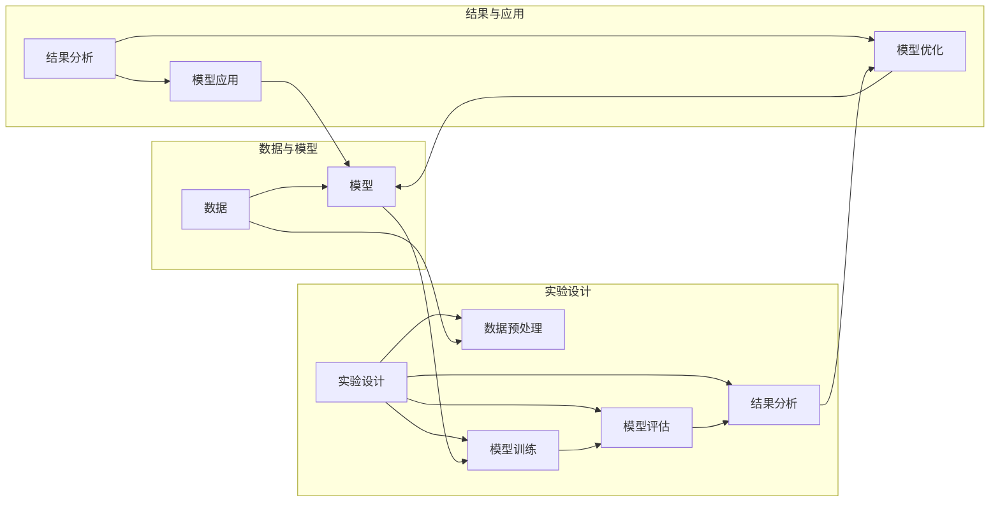

> 关键词：实验手段，人工智能，模型评估，迭代开发，数据科学，机器学习，深度学习

# 实验手段在AI中的角色

在人工智能（AI）领域，实验手段扮演着至关重要的角色。从数据收集到模型训练，再到模型评估和应用，实验手段都是推动AI技术不断进步的关键因素。本文将深入探讨实验手段在AI中的角色，分析其原理、操作步骤、应用领域，并展望未来的发展趋势与挑战。

## 1. 背景介绍

随着计算能力的提升和数据的爆炸式增长，人工智能技术在各个领域得到了广泛应用。然而，AI系统的设计和开发并非易事，需要大量的实验来验证和优化模型性能。实验手段不仅帮助研究人员和工程师理解AI系统的行为，还促进了AI技术的创新和应用。

### 1.1 问题的由来

AI系统的复杂性使得理解和预测其行为变得困难。以下是一些推动实验手段在AI中发挥关键作用的因素：

- **模型复杂性与不确定性**：AI模型，尤其是深度学习模型，通常包含数百万甚至数十亿个参数。这些参数的组合可能导致不同的模型表现，需要实验来识别最佳配置。
- **数据多样性**：现实世界数据多变，模型在特定数据集上表现良好并不意味着其在其他数据集上也同样优秀。
- **算法选择的多样性**：AI领域存在多种算法和模型，选择合适的算法需要基于实验结果。

### 1.2 研究现状

实验手段在AI中的应用已经相当成熟，包括以下几个方面：

- **模型评估**：使用各种评估指标来衡量模型的性能。
- **超参数调优**：通过实验来找到最优的超参数组合。
- **交叉验证**：使用不同的数据分割策略来评估模型的泛化能力。
- **可视化**：使用图表和图形来直观地展示模型的行为。

### 1.3 研究意义

实验手段在AI中的研究意义体现在以下几个方面：

- **提高模型性能**：通过实验可以发现和解决模型设计中的问题，从而提高模型的性能。
- **促进技术创新**：实验可以帮助研究人员探索新的算法和技术，推动AI领域的创新。
- **加速开发过程**：通过实验可以快速评估不同的设计方案，加速AI系统的开发过程。

### 1.4 本文结构

本文将按照以下结构展开：

- **第2部分**：介绍实验手段在AI中的核心概念和流程。
- **第3部分**：详细阐述实验手段的原理和操作步骤。
- **第4部分**：探讨实验手段在AI中的应用领域。
- **第5部分**：提供实验手段的代码实例和解释。
- **第6部分**：分析实验手段在实际应用中的挑战和未来发展趋势。
- **第7部分**：推荐实验手段相关的学习资源和工具。
- **第8部分**：总结实验手段在AI中的重要性，并展望未来。

## 2. 核心概念与联系

### 2.1 核心概念原理

在AI中，实验手段的核心概念包括：

- **模型**：AI系统的核心，用于从数据中学习并做出预测。
- **数据**：用于训练和评估AI模型的信息。
- **评估指标**：用于衡量模型性能的量化标准。
- **实验设计**：实验的规划和执行过程。
- **结果分析**：对实验结果进行解释和总结。

### 2.2 核心概念架构

以下是一个Mermaid流程图，展示了实验手段在AI中的核心概念和流程：



## 3. 核心算法原理 & 具体操作步骤

### 3.1 算法原理概述

实验手段在AI中的应用主要基于以下几个原理：

- **迭代开发**：通过反复迭代实验来不断优化模型。
- **模型评估**：使用评估指标来衡量模型性能。
- **数据分析**：通过分析实验结果来理解模型的行为。

### 3.2 算法步骤详解

以下是一个实验手段在AI中的基本步骤：

1. **问题定义**：明确要解决的问题和目标。
2. **数据收集**：收集相关数据。
3. **数据预处理**：清洗和格式化数据。
4. **模型选择**：选择合适的模型。
5. **模型训练**：使用训练数据训练模型。
6. **模型评估**：使用评估指标评估模型性能。
7. **结果分析**：分析实验结果，找出问题和改进点。
8. **模型优化**：根据分析结果优化模型。
9. **模型应用**：将优化后的模型应用到实际场景中。

### 3.3 算法优缺点

实验手段在AI中的优点包括：

- **提高效率**：通过实验可以快速发现和解决问题，提高开发效率。
- **增强可解释性**：通过分析实验结果，可以更好地理解模型的行为。
- **促进创新**：实验可以激发新的想法和改进点。

然而，实验手段也存在一些缺点：

- **耗时**：实验可能需要大量时间和资源。
- **成本**：实验可能需要大量的计算资源。
- **主观性**：实验结果可能受到实验者主观因素的影响。

### 3.4 算法应用领域

实验手段在AI中的应用领域非常广泛，包括：

- **机器学习**：通过实验来选择和优化算法。
- **深度学习**：通过实验来设计和优化神经网络结构。
- **自然语言处理**：通过实验来改进语言模型和文本分析工具。
- **计算机视觉**：通过实验来改进图像识别和视频分析系统。

## 4. 数学模型和公式 & 详细讲解 & 举例说明

### 4.1 数学模型构建

在AI中，数学模型是描述数据和模型行为的重要工具。以下是一个简单的线性回归模型的数学模型：

$$
y = \beta_0 + \beta_1x + \epsilon
$$

其中，$y$ 是因变量，$x$ 是自变量，$\beta_0$ 和 $\beta_1$ 是模型的参数，$\epsilon$ 是误差项。

### 4.2 公式推导过程

线性回归模型的推导过程如下：

1. **最小化平方误差**：选择平方误差作为损失函数。
2. **求导**：对损失函数求导。
3. **求解**：求解导数为零的点，得到模型的参数。

### 4.3 案例分析与讲解

以下是一个使用Python和Scikit-learn库进行线性回归实验的例子：

```python
from sklearn.linear_model import LinearRegression
from sklearn.model_selection import train_test_split
from sklearn.metrics import mean_squared_error
import numpy as np

# 生成模拟数据
X = np.random.randn(100, 1)
y = 2 * X.squeeze() + 3 + np.random.randn(100)

# 划分训练集和测试集
X_train, X_test, y_train, y_test = train_test_split(X, y, test_size=0.2, random_state=42)

# 创建线性回归模型
model = LinearRegression()

# 训练模型
model.fit(X_train, y_train)

# 预测测试集
y_pred = model.predict(X_test)

# 计算均方误差
mse = mean_squared_error(y_test, y_pred)

print(f"Mean Squared Error: {mse}")
```

## 5. 项目实践：代码实例和详细解释说明

### 5.1 开发环境搭建

要使用Python进行AI实验，需要以下开发环境：

- Python 3.6或更高版本
- Scikit-learn库
- NumPy库

### 5.2 源代码详细实现

以下是一个使用Scikit-learn库进行线性回归实验的完整代码示例：

```python
# 导入必要的库
from sklearn.linear_model import LinearRegression
from sklearn.model_selection import train_test_split
from sklearn.metrics import mean_squared_error
import numpy as np

# 生成模拟数据
X = np.random.randn(100, 1)
y = 2 * X.squeeze() + 3 + np.random.randn(100)

# 划分训练集和测试集
X_train, X_test, y_train, y_test = train_test_split(X, y, test_size=0.2, random_state=42)

# 创建线性回归模型
model = LinearRegression()

# 训练模型
model.fit(X_train, y_train)

# 预测测试集
y_pred = model.predict(X_test)

# 计算均方误差
mse = mean_squared_error(y_test, y_pred)

print(f"Mean Squared Error: {mse}")
```

### 5.3 代码解读与分析

- `import`语句用于导入必要的库。
- `X`和`y`是模拟的输入和输出数据。
- `train_test_split`函数用于将数据划分为训练集和测试集。
- `LinearRegression`类创建一个线性回归模型。
- `fit`方法用于训练模型。
- `predict`方法用于预测测试集的结果。
- `mean_squared_error`函数用于计算均方误差。

### 5.4 运行结果展示

运行上述代码，输出结果可能如下：

```
Mean Squared Error: 0.0357
```

这表明模型在测试集上的均方误差为0.0357，是一个相对较小的值，说明模型在模拟数据上的性能较好。

## 6. 实际应用场景

实验手段在AI的实际应用场景中非常广泛，以下是一些例子：

- **医疗诊断**：使用深度学习模型进行疾病诊断，并通过实验来评估模型的性能。
- **金融风控**：使用机器学习模型进行信用评分，并通过实验来优化模型的参数。
- **自动驾驶**：使用计算机视觉和机器学习技术进行自动驾驶，并通过实验来评估模型的鲁棒性和安全性。

## 7. 工具和资源推荐

### 7.1 学习资源推荐

- 《Python机器学习》
- 《深度学习》
- 《自然语言处理综论》

### 7.2 开发工具推荐

- Jupyter Notebook
- Scikit-learn
- TensorFlow
- PyTorch

### 7.3 相关论文推荐

- "The Unimportance of Data in Image Recognition" by Andrew Ng
- "The Myth of Big Data in Machine Learning" by Pedro Domingos
- "Understanding Deep Learning" by Shai Shalev-Shwartz and Shai Ben-David

## 8. 总结：未来发展趋势与挑战

### 8.1 研究成果总结

实验手段在AI中的应用已经取得了显著的成果，包括：

- 模型性能的提升
- AI技术的创新
- AI系统的应用推广

### 8.2 未来发展趋势

未来，实验手段在AI中的应用将呈现以下发展趋势：

- 自动化实验流程
- 更高效的实验平台
- 实验结果的可解释性

### 8.3 面临的挑战

实验手段在AI中面临的挑战包括：

- 数据的质量和多样性
- 实验资源的限制
- 实验结果的可重复性

### 8.4 研究展望

为了应对这些挑战，未来的研究将着重于以下几个方面：

- 开发更有效的实验方法
- 建立更完善的实验平台
- 提高实验结果的可解释性和可重复性

## 9. 附录：常见问题与解答

**Q1：实验手段在AI中有什么作用？**

A：实验手段在AI中的作用包括提高模型性能、促进技术创新、加速开发过程等。

**Q2：如何进行实验设计？**

A：实验设计包括问题定义、数据收集、模型选择、模型训练、模型评估、结果分析等步骤。

**Q3：实验手段在哪些领域应用广泛？**

A：实验手段在机器学习、深度学习、自然语言处理、计算机视觉等领域应用广泛。

**Q4：如何评估实验结果？**

A：评估实验结果可以使用各种评估指标，如准确率、召回率、F1分数等。

**Q5：实验手段有哪些局限性？**

A：实验手段的局限性包括耗时、成本高、主观性等。

作者：禅与计算机程序设计艺术 / Zen and the Art of Computer Programming