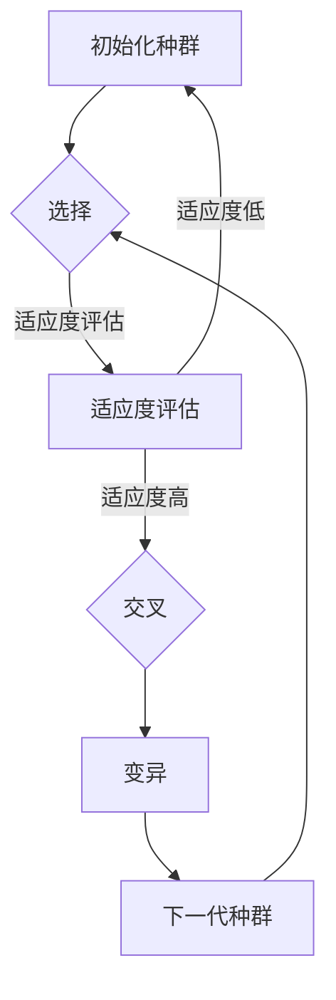

# 强化学习算法：遗传算法 原理与代码实例讲解

> 关键词：强化学习，遗传算法，进化算法，适应度函数，自然选择，遗传操作，遗传编程，代码实例

## 1. 背景介绍

强化学习（Reinforcement Learning, RL）是机器学习的一个重要分支，它通过智能体与环境交互，学习如何做出最优决策以实现目标。遗传算法（Genetic Algorithm, GA）作为一种搜索启发式算法，由于其强大的适应性和鲁棒性，近年来被广泛应用于强化学习领域。本文将深入探讨强化学习中的遗传算法，包括其原理、操作步骤、数学模型以及代码实例。

### 1.1 问题的由来

在强化学习中，智能体需要通过与环境交互来学习最优策略。然而，由于状态空间和动作空间可能非常庞大，直接搜索最优策略变得极为困难。遗传算法通过模拟生物进化过程，提供了一种有效的搜索策略。

### 1.2 研究现状

遗传算法在强化学习中的应用主要包括以下几个方面：

1. **策略表示与编码**：使用遗传算法来表示和编码策略。
2. **策略搜索与优化**：使用遗传算法搜索和优化策略空间。
3. **自适应控制**：在自适应控制系统中，遗传算法用于寻找最优控制器。

### 1.3 研究意义

研究强化学习中的遗传算法对于以下方面具有重要意义：

1. **提高搜索效率**：遗传算法可以高效地搜索策略空间，找到近似最优策略。
2. **增强鲁棒性**：遗传算法对噪声和干扰具有较强的鲁棒性。
3. **解决复杂问题**：遗传算法可以解决一些传统强化学习算法难以解决的问题。

### 1.4 本文结构

本文将按照以下结构进行展开：

- 介绍遗传算法的核心概念和原理。
- 讲解强化学习中遗传算法的具体操作步骤。
- 构建数学模型并推导相关公式。
- 提供代码实例和详细解释说明。
- 探讨遗传算法在实际应用场景中的应用。
- 展望遗传算法在强化学习领域的发展趋势和挑战。

## 2. 核心概念与联系

### 2.1 核心概念

- **强化学习**：智能体通过与环境的交互，学习如何根据当前状态选择动作，以最大化累积奖励。
- **遗传算法**：一种模拟自然选择过程的搜索启发式算法，用于寻找最优解。

### 2.2 Mermaid 流程图



### 2.3 关联性

在强化学习中，遗传算法可用于表示和优化策略。具体而言，遗传算法可以：

1. 将策略编码为染色体。
2. 使用适应度函数评估染色体的优劣。
3. 通过交叉和变异操作产生下一代种群。

## 3. 核心算法原理 & 具体操作步骤

### 3.1 算法原理概述

遗传算法是一种模拟自然选择和遗传学原理的搜索算法。它通过以下步骤进行：

1. **初始化种群**：随机生成一定数量的染色体，每个染色体代表一个潜在解。
2. **适应度评估**：使用适应度函数评估每个染色体的优劣。
3. **选择**：根据适应度值选择部分染色体进入下一代。
4. **交叉**：对选中的染色体进行交叉操作，产生新的染色体。
5. **变异**：对染色体进行变异操作，增加种群的多样性。
6. **下一代种群**：使用交叉和变异操作产生的染色体形成下一代种群。
7. **迭代**：重复步骤2到6，直到满足停止条件。

### 3.2 算法步骤详解

1. **初始化种群**：随机生成一定数量的染色体，每个染色体代表一个潜在解。
2. **适应度评估**：使用适应度函数评估每个染色体的优劣。适应度函数通常与强化学习任务的目标函数相关。
3. **选择**：根据适应度值选择部分染色体进入下一代。常用的选择方法包括轮盘赌选择、锦标赛选择等。
4. **交叉**：对选中的染色体进行交叉操作，产生新的染色体。交叉操作模拟生物繁殖过程中的基因组合。
5. **变异**：对染色体进行变异操作，增加种群的多样性。变异操作模拟生物繁殖过程中的基因突变。
6. **下一代种群**：使用交叉和变异操作产生的染色体形成下一代种群。
7. **迭代**：重复步骤2到6，直到满足停止条件。

### 3.3 算法优缺点

**优点**：

- **鲁棒性**：遗传算法对噪声和干扰具有较强的鲁棒性。
- **适应性强**：遗传算法可以处理复杂问题。
- **并行化**：遗传算法易于并行化实现。

**缺点**：

- **局部最优**：遗传算法容易陷入局部最优解。
- **收敛速度慢**：遗传算法的收敛速度可能较慢。

### 3.4 算法应用领域

- **机器学习**：用于优化模型参数、选择最佳特征等。
- **优化问题**：用于求解优化问题，如背包问题、旅行商问题等。
- **工程优化**：用于设计电路、结构等。

## 4. 数学模型和公式 & 详细讲解 & 举例说明

### 4.1 数学模型构建

在强化学习中，遗传算法的数学模型可以表示为：

$$
\theta_{t+1} = \sum_{i=1}^N \alpha_i \theta_i
$$

其中，$\theta_t$ 表示第 $t$ 代种群，$\theta_i$ 表示第 $i$ 个染色体的编码，$\alpha_i$ 表示第 $i$ 个染色体的适应度值。

### 4.2 公式推导过程

假设有 $N$ 个染色体，适应度值分别为 $\alpha_1, \alpha_2, ..., \alpha_N$。则每个染色体的选择概率为：

$$
P(i) = \frac{\alpha_i}{\sum_{j=1}^N \alpha_j}
$$

选择过程可以表示为：

$$
\theta_{t+1} = \sum_{i=1}^N P(i) \theta_i
$$

### 4.3 案例分析与讲解

假设我们使用遗传算法来优化一个简单的强化学习问题：一个智能体在离散状态空间中移动，目标是到达目标状态。状态空间包括起始状态、中间状态和目标状态。动作空间包括向左、向右和向目标状态移动。

我们可以使用以下步骤来应用遗传算法：

1. **初始化种群**：随机生成一定数量的策略编码。
2. **适应度评估**：根据策略编码生成智能体在环境中的表现，并计算适应度值。
3. **选择**：根据适应度值选择部分策略编码进入下一代。
4. **交叉**：对选中的策略编码进行交叉操作，产生新的策略编码。
5. **变异**：对染色体进行变异操作，增加种群的多样性。
6. **下一代种群**：使用交叉和变异操作产生的策略编码形成下一代种群。
7. **迭代**：重复步骤2到6，直到满足停止条件。

通过这种方式，我们可以使用遗传算法来优化智能体的策略，使其能够更有效地到达目标状态。

## 5. 项目实践：代码实例和详细解释说明

### 5.1 开发环境搭建

为了进行遗传算法的代码实现，我们需要以下开发环境：

- Python 3.x
- NumPy
- Matplotlib

### 5.2 源代码详细实现

以下是一个简单的遗传算法实现，用于优化一个简单的二进制编码的染色体：

```python
import numpy as np
import matplotlib.pyplot as plt

# 初始化种群
def initialize_population(pop_size, chromosome_length):
    population = []
    for _ in range(pop_size):
        chromosome = np.random.randint(0, 2, size=chromosome_length)
        population.append(chromosome)
    return np.array(population)

# 适应度评估
def fitness_function(chromosome):
    # 这里以染色体中1的数量作为适应度值
    return np.sum(chromosome)

# 选择
def selection(population, fitness_values):
    # 轮盘赌选择
    selection_probs = fitness_values / np.sum(fitness_values)
    selection_probs = selection_probs / np.sum(selection_probs)
    selected_indices = np.random.choice(range(len(population)), size=len(population), p=selection_probs)
    return population[selected_indices]

# 交叉
def crossover(parent1, parent2, crossover_rate):
    if np.random.rand() < crossover_rate:
        crossover_point = np.random.randint(1, len(parent1) - 1)
        child1 = np.concatenate((parent1[:crossover_point], parent2[crossover_point:]))
        child2 = np.concatenate((parent2[:crossover_point], parent1[crossover_point:]))
        return child1, child2
    else:
        return parent1, parent2

# 变异
def mutation(chromosome, mutation_rate):
    for i in range(len(chromosome)):
        if np.random.rand() < mutation_rate:
            chromosome[i] = 1 - chromosome[i]
    return chromosome

# 遗传算法
def genetic_algorithm(pop_size, chromosome_length, generations, crossover_rate, mutation_rate):
    population = initialize_population(pop_size, chromosome_length)
    fitness_values = np.array([fitness_function(chromosome) for chromosome in population])
    for generation in range(generations):
        print(f"Generation {generation}: Best Fitness = {np.max(fitness_values)}")
        # 选择
        selected_population = selection(population, fitness_values)
        # 交叉
        new_population = []
        for i in range(0, len(selected_population), 2):
            child1, child2 = crossover(selected_population[i], selected_population[i+1], crossover_rate)
            new_population.append(child1)
            new_population.append(child2)
        # 变异
        new_population = np.array([mutation(chromosome, mutation_rate) for chromosome in new_population])
        # 更新种群
        population = new_population
        fitness_values = np.array([fitness_function(chromosome) for chromosome in population])
    return population[np.argmax(fitness_values)]

# 参数设置
pop_size = 100
chromosome_length = 10
generations = 50
crossover_rate = 0.8
mutation_rate = 0.1

# 运行遗传算法
best_chromosome = genetic_algorithm(pop_size, chromosome_length, generations, crossover_rate, mutation_rate)

# 可视化适应度函数
fitness_values = np.array([fitness_function(chromosome) for chromosome in best_chromosome])
plt.plot(fitness_values)
plt.xlabel('Generation')
plt.ylabel('Fitness')
plt.title('Genetic Algorithm Fitness Over Generations')
plt.show()
```

### 5.3 代码解读与分析

上述代码实现了遗传算法的基本流程。首先，我们定义了初始化种群、适应度评估、选择、交叉、变异和遗传算法等函数。在遗传算法函数中，我们首先初始化种群，然后进行多代迭代，每代迭代包含选择、交叉和变异操作。最后，我们返回适应度最高的染色体。

### 5.4 运行结果展示

运行上述代码后，我们可以在控制台看到每代的最佳适应度值。同时，我们还使用了Matplotlib库将适应度函数绘制成图表，展示了遗传算法在多代迭代中的性能提升。

## 6. 实际应用场景

遗传算法在强化学习中的应用场景非常广泛，以下列举几个典型的应用：

- **路径规划**：智能体在复杂环境中寻找最优路径。
- **机器人控制**：控制机器人的动作，使其完成特定任务。
- **游戏AI**：设计游戏AI，使其在游戏中取得优异成绩。
- **强化学习控制**：用于优化强化学习控制器的参数。

## 7. 工具和资源推荐

### 7.1 学习资源推荐

- **《遗传算法原理与应用》**：介绍了遗传算法的基本原理、算法步骤和实际应用。
- **《强化学习》**：介绍了强化学习的基本概念、算法原理和应用场景。
- **《进化算法》**：介绍了进化算法的基本原理、算法步骤和应用场景。

### 7.2 开发工具推荐

- **NumPy**：用于科学计算和数据分析。
- **Matplotlib**：用于数据可视化。
- **SciPy**：用于科学计算和工程计算。

### 7.3 相关论文推荐

- **"Genetic Algorithms in Reinforcement Learning"**：介绍了遗传算法在强化学习中的应用。
- **"Reinforcement Learning: An Introduction"**：介绍了强化学习的基本概念和算法原理。
- **"A Survey of Evolutionary Computation in Robotics"**：介绍了进化计算在机器人领域的应用。

## 8. 总结：未来发展趋势与挑战

### 8.1 研究成果总结

本文深入探讨了强化学习中的遗传算法，介绍了其原理、操作步骤、数学模型和代码实例。通过实际应用场景的讲解，展示了遗传算法在强化学习领域的广泛应用。

### 8.2 未来发展趋势

- **混合遗传算法**：将遗传算法与其他算法（如强化学习算法）相结合，以解决更复杂的问题。
- **多目标遗传算法**：用于同时优化多个目标。
- **动态遗传算法**：根据问题的变化动态调整算法参数。

### 8.3 面临的挑战

- **参数调优**：遗传算法的参数调优是一个复杂的过程。
- **计算效率**：遗传算法的计算效率可能较低。
- **早熟收敛**：遗传算法容易陷入局部最优解。

### 8.4 研究展望

未来，随着计算能力的提升和算法的改进，遗传算法在强化学习领域的应用将会更加广泛。同时，针对遗传算法的参数调优、计算效率和早熟收敛等问题，需要进一步研究和改进。

## 9. 附录：常见问题与解答

**Q1：遗传算法在强化学习中的应用有哪些优势？**

A：遗传算法在强化学习中的应用优势包括：

- **鲁棒性**：对噪声和干扰具有较强的鲁棒性。
- **适应性强**：可以处理复杂问题。
- **并行化**：易于并行化实现。

**Q2：如何评估遗传算法的性能？**

A：评估遗传算法的性能可以通过以下方法：

- **适应度函数**：评估染色体的优劣。
- **收敛速度**：评估算法收敛到最优解的速度。
- **解的质量**：评估最终解的质量。

**Q3：遗传算法在强化学习中的应用有哪些局限？**

A：遗传算法在强化学习中的应用局限包括：

- **参数调优**：参数调优是一个复杂的过程。
- **计算效率**：计算效率可能较低。
- **早熟收敛**：容易陷入局部最优解。

**Q4：如何改进遗传算法的性能？**

A：改进遗传算法的性能可以通过以下方法：

- **选择更有效的适应度函数**。
- **选择更有效的交叉和变异操作**。
- **使用并行计算**。

**Q5：遗传算法在强化学习中的应用前景如何？**

A：遗传算法在强化学习中的应用前景非常广阔，可以用于解决更多复杂问题，并与其他算法相结合，进一步提高强化学习的效果。

---

作者：禅与计算机程序设计艺术 / Zen and the Art of Computer Programming