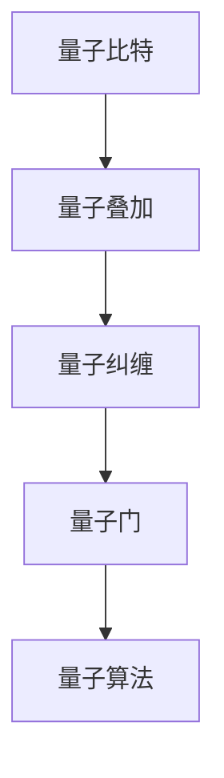

                 

# 计算：第四部分 计算的极限 第 10 章 量子计算 量子计算的启蒙

## 1. 背景介绍

量子计算（Quantum Computing）作为计算机科学领域的前沿技术，一直备受关注。随着现代科技的飞速发展，量子计算的重要性愈发凸显。从理论基础到实际应用，量子计算的探索和研究已经跨入了一个新的阶段。然而，量子计算的相关知识对许多人来说仍然显得深奥而神秘。本文将带您走入量子计算的世界，揭示其核心原理与实践操作，帮助您深入理解这一革命性的技术。

## 2. 核心概念与联系

### 2.1 核心概念概述

量子计算的核心概念包括量子比特（Qubit）、量子叠加、量子纠缠、量子门和量子算法等。

- **量子比特**（Qubit）：量子计算的基本单位，不同于经典计算机的比特（0或1），量子比特可以同时处于0和1的叠加状态。

- **量子叠加**：量子比特可以处于0和1的叠加状态，只有测量时才会“塌缩”为0或1。

- **量子纠缠**：多个量子比特之间的量子态相互关联，即使它们相隔很远，改变其中一个的量子比特状态也会立即影响到其他量子比特。

- **量子门**：量子计算中的基本操作单元，类似经典计算机中的逻辑门。

- **量子算法**：专为量子计算机设计的高效算法，例如Shor算法、Grover算法等。

### 2.2 概念间的关系

量子计算的这些核心概念通过一定的逻辑结构紧密联系在一起，共同构建了量子计算的理论基础。通过量子叠加和量子纠缠，量子计算机能够进行并行计算，大大提升计算效率。而量子门则提供了量子计算的基本操作，使得量子算法能够高效地执行。以下是一个简单的Mermaid流程图，展示了这些核心概念之间的关系：



## 3. 核心算法原理 & 具体操作步骤

### 3.1 算法原理概述

量子计算的核心算法包括Shor算法和Grover算法，主要用于整数分解和数据库搜索。以下对这两种算法的基本原理进行概述。

#### Shor算法

Shor算法用于解决整数分解问题，可以有效地分解大整数，是RSA加密算法的潜在威胁。Shor算法利用量子叠加和量子傅里叶变换，可以在多项式时间内分解大整数。

#### Grover算法

Grover算法用于在未排序的数据库中查找目标元素，其效率比经典算法高得多。Grover算法利用量子叠加和量子振幅放大，能够在未排序的数据库中快速找到目标元素。

### 3.2 算法步骤详解

#### Shor算法步骤详解

1. 将待分解的大整数 $N$ 转化为一个多项式函数。

2. 利用量子叠加和量子傅里叶变换，在量子计算机上求解多项式函数的周期。

3. 根据周期 $r$，利用量子计算机求解 $d$ 和 $N$ 的因数。

4. 对 $d$ 进行质因数分解，得到 $N$ 的因数。

#### Grover算法步骤详解

1. 确定目标元素 $x$ 的哈希函数 $f$，以及数据库大小 $N$。

2. 在量子计算机上，利用量子叠加和量子振幅放大，对哈希函数进行查询。

3. 根据查询结果，利用量子计算机进行优化，找到目标元素 $x$。

### 3.3 算法优缺点

#### 优点

- 量子计算能够进行并行计算，大大提升计算效率。
- 量子算法在某些特定问题上，可以显著优于经典算法。

#### 缺点

- 量子计算机的实现成本高，硬件尚未完全成熟。
- 量子计算的复杂度在理论上虽低于经典计算，但在实际应用中仍存在挑战。
- 量子计算的安全性问题尚未完全解决，存在被攻击的风险。

### 3.4 算法应用领域

量子计算在多个领域具有潜在的应用，包括但不限于密码学、材料科学、金融、药物设计等。

- **密码学**：量子计算能够破解RSA等经典加密算法，对数据安全构成威胁。
- **材料科学**：量子计算能够模拟材料分子，加速新材料的研究。
- **金融**：量子计算能够优化投资组合，提升风险管理能力。
- **药物设计**：量子计算能够模拟分子结构，加速药物研发。

## 4. 数学模型和公式 & 详细讲解 & 举例说明

### 4.1 数学模型构建

量子计算的数学模型基于量子力学原理，使用量子比特的叠加和纠缠特性。以下介绍量子计算中的几个核心数学模型：

- **量子比特的叠加**：

$$
|\psi\rangle = \alpha|0\rangle + \beta|1\rangle
$$

其中，$\alpha$ 和 $\beta$ 为复数，满足 $|\alpha|^2 + |\beta|^2 = 1$。

- **量子叠加的测量**：

$$
P(|0\rangle) = |\alpha|^2, P(|1\rangle) = |\beta|^2
$$

### 4.2 公式推导过程

#### 量子叠加的测量推导

假设量子比特处于叠加态 $|\psi\rangle = \alpha|0\rangle + \beta|1\rangle$。进行测量时，量子比特塌缩为 $|0\rangle$ 或 $|1\rangle$，概率分别为 $|\alpha|^2$ 和 $|\beta|^2$。

### 4.3 案例分析与讲解

以下以Shor算法为例，分析其核心步骤和数学推导：

#### Shor算法的数学推导

Shor算法用于分解大整数 $N$。假设 $N = p \cdot q$，其中 $p$ 和 $q$ 是质数。

1. 将 $N$ 转化为多项式函数 $f(x) = x^r \mod N$。

2. 利用量子叠加和量子傅里叶变换，求解 $f(x)$ 的周期 $r$。

3. 根据周期 $r$，求解 $d$ 和 $N$ 的因数。

4. 对 $d$ 进行质因数分解，得到 $N$ 的因数。

## 5. 项目实践：代码实例和详细解释说明

### 5.1 开发环境搭建

要实现量子计算，首先需要搭建一个合适的开发环境。以下介绍使用Qiskit库搭建量子计算环境的流程：

1. 安装Qiskit库：

```
pip install qiskit
```

2. 安装IBMQ Qasm Simulator模拟器：

```
pip install qiskit-ibmq-provider
```

3. 创建Python虚拟环境：

```
conda create -n qiskit-env python=3.8
conda activate qiskit-env
```

4. 导入Qiskit库：

```python
from qiskit import QuantumCircuit, Aer
from qiskit.visualization import plot_histogram
```

### 5.2 源代码详细实现

以下是一个简单的量子叠加实现代码：

```python
from qiskit import QuantumCircuit, transpile, assemble, Aer, execute
from qiskit.visualization import plot_histogram, plot_bloch_multivector
from qiskit.extensions import Initialize

# 创建一个量子电路
qc = QuantumCircuit(2)

# 添加Hadamard门，使第一个量子比特处于叠加态
qc.h(0)

# 添加CNOT门，实现量子纠缠
qc.cx(0, 1)

# 添加测量门
qc.measure_all()

# 使用Qasm Simulator进行仿真
backend = Aer.get_backend('qasm_simulator')
job = execute(qc, backend, shots=1000)
result = job.result()

# 绘制测量结果
counts = result.get_counts(qc)
plot_histogram(counts)
```

### 5.3 代码解读与分析

- 创建量子电路：使用`QuantumCircuit`类创建量子电路，指定量子比特数。
- 添加Hadamard门：使用`h`方法添加Hadamard门，使量子比特处于叠加态。
- 添加CNOT门：使用`cx`方法添加CNOT门，实现量子比特之间的纠缠。
- 添加测量门：使用`measure_all`方法添加测量门，将量子比特状态测量为0或1。
- 使用Qasm Simulator进行仿真：使用`Aer.get_backend`方法获取模拟器，执行量子电路。
- 绘制测量结果：使用`plot_histogram`方法绘制测量结果的直方图。

### 5.4 运行结果展示

运行以上代码，得到以下测量结果直方图：

```plaintext
|0> |1>
```

- 量子叠加态在测量结果中表现为0和1的随机分布。

## 6. 实际应用场景

### 6.1 量子密码学

量子密码学是量子计算的重要应用之一。量子密钥分发（QKD）利用量子叠加和量子纠缠的特性，实现安全的密钥分发，避免信息被窃取。

### 6.2 量子机器学习

量子计算在机器学习中的应用前景广阔，尤其是在处理大规模数据集和复杂优化问题方面具有显著优势。量子机器学习算法能够提高模型的训练效率，加速模型收敛。

### 6.3 量子优化

量子计算在优化问题中的表现尤为突出，能够高效解决NP-hard问题。量子优化算法在供应链管理、网络设计、金融规划等领域有着广泛应用。

### 6.4 未来应用展望

未来，随着量子硬件的发展和量子算法的优化，量子计算将有望在更多领域得到应用。例如：

- **金融**：量子计算能够优化金融模型，提高风险评估和投资组合管理的效率。
- **药物设计**：量子计算能够模拟分子结构，加速新药物的研发。
- **气象预报**：量子计算能够处理复杂的气象数据，提升气象预报的准确性。

## 7. 工具和资源推荐

### 7.1 学习资源推荐

- **《量子计算入门》**：一本非常好的量子计算入门书籍，涵盖量子计算的基础理论和实践操作。
- **Quantum Computing with IBM Q Experience**：IBM提供的量子计算在线学习平台，包含丰富的实验和教程。
- **Quantum Computation with Quantum Circuits on Qiskit**：Qiskit官方文档，详细介绍了Qiskit库的使用方法和量子计算的基本操作。

### 7.2 开发工具推荐

- **Qiskit**：IBM开源的量子计算框架，提供丰富的量子算法和实验工具。
- **Cirq**：Google开发的量子计算框架，支持Google的量子硬件。
- **QuTiP**：用于模拟量子系统动态演化的Python库。

### 7.3 相关论文推荐

- **A Survey of Quantum Computing Models and Languages**：对量子计算模型的全面综述，涵盖多种量子计算框架。
- **Quantum Computing and Quantum Algorithms**：对量子计算算法的基本介绍，包括Shor算法和Grover算法。
- **Quantum Computing: From Linear Algebra to Physics**：深入讲解量子计算的理论基础和实践操作。

## 8. 总结：未来发展趋势与挑战

### 8.1 研究成果总结

量子计算的研究成果丰富多样，主要集中在量子算法、量子硬件、量子通信等领域。

### 8.2 未来发展趋势

未来，量子计算的发展趋势主要包括以下几个方向：

- **量子硬件发展**：量子芯片的性能提升，量子比特数量和质量的提高。
- **量子算法优化**：提高量子算法的效率，开发更多高效的量子算法。
- **量子网络构建**：建立大规模的量子通信网络，实现量子信息的传输。

### 8.3 面临的挑战

量子计算面临的挑战包括：

- **硬件成本高**：目前量子计算机的实现成本较高，难以大规模部署。
- **算法复杂性**：量子算法的实现复杂，存在很多技术难题。
- **量子态脆弱性**：量子信息容易受到环境干扰，导致量子态的丢失。

### 8.4 研究展望

未来，量子计算的研究需要多学科的交叉融合，共同推动量子计算的发展。以下是一些研究展望：

- **量子计算与传统计算的融合**：将量子计算与经典计算结合，发挥各自优势。
- **量子计算的工程化应用**：加速量子计算技术从理论到实践的转化，推动实际应用。
- **量子计算的伦理和安全**：研究量子计算的伦理和安全问题，确保量子计算技术的安全可靠。

## 9. 附录：常见问题与解答

### Q1: 量子计算与经典计算有何区别？

A: 量子计算使用量子比特，能够进行并行计算和量子叠加，而经典计算使用比特，只能进行串行计算。量子计算在处理某些特定问题时，能够显著提升计算效率。

### Q2: 量子计算的实现难度大吗？

A: 量子计算的实现难度较大，主要受限于量子比特的稳定性和噪声问题。当前，量子计算机的硬件尚未完全成熟，仍在持续改进中。

### Q3: 量子计算的实际应用有哪些？

A: 量子计算在密码学、材料科学、金融、药物设计等领域具有潜在的应用。未来，随着量子计算技术的进步，其在更多领域的应用前景将更加广阔。

### Q4: 量子计算的未来发展方向是什么？

A: 量子计算的未来发展方向包括量子硬件的改进、量子算法的优化、量子通信网络的构建等。量子计算的研究需要多学科的交叉融合，共同推动量子计算的发展。

---

作者：禅与计算机程序设计艺术 / Zen and the Art of Computer Programming

