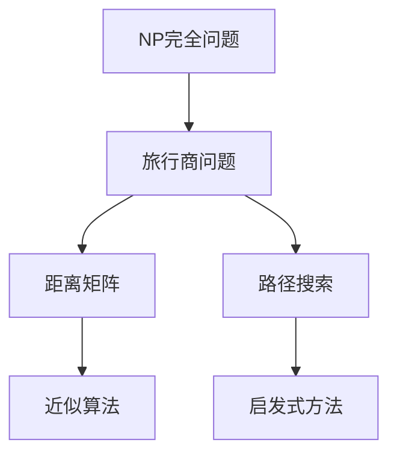

                 

# 计算：第四部分 计算的极限 第 9 章 计算复杂性 挑战旅行商问题

## 1. 背景介绍

### 1.1 问题由来

在计算机科学中，计算复杂性理论（Theory of Computation Complexity）是研究算法效率的重要分支，旨在分析不同计算问题的时间复杂度和空间复杂度，以确定算法是否可以高效地解决特定问题。计算复杂性理论不仅在理论计算机科学中占据重要地位，也在实际应用中如密码学、分布式计算等发挥着重要作用。

旅行商问题（Traveling Salesman Problem，TSP）是计算复杂性理论中的一个经典问题，也是许多实际应用中的重要问题，如物流配送、路线规划等。TSP问题描述为：给定一个城市集合，以及城市之间的距离矩阵，找到一条最短路径，使得从某一个城市出发，经过每个城市恰好一次，最后返回出发城市，路径长度最小。TSP问题是NP完全问题（NP-hard），意味着不存在多项式时间的精确算法可以解决所有TSP实例。然而，通过近似算法和启发式方法，可以在合理的时间内解决大规模TSP问题。

### 1.2 问题核心关键点

TSP问题的主要挑战在于寻找一条经过每个城市恰好一次的最短路径，其复杂性在于城市数量和距离矩阵的规模。随着城市数量增加，TSP问题的求解时间呈指数级增长，这使得传统暴力搜索算法变得难以应对大规模问题。

在实际应用中，TSP问题求解需要考虑以下几个关键点：
1. 城市数量：问题规模的增加，使得暴力搜索算法不可行。
2. 距离矩阵：城市之间的距离矩阵是求解TSP的核心数据结构。
3. 近似算法：在精确算法无法解决大规模问题时，近似算法提供了一种有效的解决方案。
4. 启发式方法：启发式方法通过局部优化寻找近似解。
5. 优化目标：最小化路径长度是TSP问题的主要优化目标。

这些关键点共同决定了TSP问题的复杂性和求解策略。

### 1.3 问题研究意义

研究TSP问题的意义主要体现在以下几个方面：
1. 理论价值：TSP问题作为NP完全问题，研究其计算复杂性对于理论计算机科学具有重要意义。
2. 应用价值：TSP问题在物流配送、路线规划等实际应用中具有广泛的应用价值，优化算法可以提升效率和降低成本。
3. 算法创新：TSP问题的研究推动了近似算法、启发式方法和优化技术的创新。
4. 计算模型：研究TSP问题可以揭示计算模型的本质和限制，为其他复杂计算问题提供参考。

## 2. 核心概念与联系

### 2.1 核心概念概述

在深入讨论TSP问题之前，我们需要了解几个核心概念：

- **NP完全问题**：指一类在多项式时间内无法解决的所有问题集合，TSP问题是其中的经典例子。
- **近似算法**：通过一定的优化策略，找到问题的近似的解，其解可以在多项式时间内计算得到。
- **启发式方法**：通过启发式策略，如贪心、回溯等方法，在合理的时间内找到问题的近似解。
- **距离矩阵**：TSP问题的核心数据结构，用于表示城市之间的距离关系。
- **路径搜索**：TSP问题的主要求解过程，即寻找一条最短路径，使得每个城市恰好经过一次。

这些概念之间存在紧密的联系，形成了TSP问题的完整框架。接下来，我们将通过Mermaid流程图来展示这些概念之间的关系：



这个流程图展示了TSP问题的各个核心概念之间的关系：

1. TSP问题属于NP完全问题，难以在多项式时间内解决。
2. 距离矩阵是TSP问题的核心数据结构，用于表示城市之间的距离关系。
3. 路径搜索是TSP问题的求解过程，目标是找到一条最短路径，使得每个城市恰好经过一次。
4. 近似算法和启发式方法用于求解TSP问题的近似解，以应对规模大和复杂度高的TSP实例。

### 2.2 概念间的关系

TSP问题的各个概念之间存在相互作用和依赖关系。例如：

- **距离矩阵与近似算法**：距离矩阵是近似算法的重要输入，不同距离矩阵的求解难度直接影响近似算法的复杂度。
- **路径搜索与启发式方法**：路径搜索是启发式方法的求解目标，启发式方法通过优化路径搜索策略来找到近似解。
- **NP完全问题与路径搜索**：TSP问题作为NP完全问题，表明其求解过程的复杂性，路径搜索作为TSP的核心过程，展示了问题的求解难度。

下面我们将通过具体的数学模型来进一步探讨TSP问题的求解过程。

## 3. 核心算法原理 & 具体操作步骤

### 3.1 算法原理概述

TSP问题的求解通常通过以下两种方法：

- **暴力搜索**：穷举所有可能路径，选择最短路径。适用于城市数量较少的简单问题。
- **近似算法和启发式方法**：通过局部优化策略，找到接近最优解的近似解。适用于城市数量较大的复杂问题。

暴力搜索的算法复杂度为 $O(n!)$，难以应对大规模TSP问题。因此，近似算法和启发式方法成为了TSP问题的主要求解方法。

### 3.2 算法步骤详解

#### 3.2.1 近似算法：基于贪心策略的近似算法

基于贪心策略的近似算法是一种简单的近似方法，适用于城市数量较小的问题。其基本思想是从一个城市出发，每次选择距离当前城市最近的城市，直到所有城市被访问一次。

算法步骤如下：

1. 选择任意一个城市作为起点。
2. 从起点出发，每次选择距离当前城市最近的未访问城市。
3. 遍历所有城市，直到所有城市都被访问一次。
4. 返回起点，完成路径。

贪心算法的优点在于简单易实现，但在城市数量较大时，无法保证找到最优解。

#### 3.2.2 启发式方法：基于回溯的启发式算法

基于回溯的启发式算法通过逐步构建路径，尝试找到最优解。其基本思想是从一个城市出发，每次选择未访问城市，并评估当前路径的质量，逐步构建路径，直到所有城市被访问一次。

算法步骤如下：

1. 选择任意一个城市作为起点。
2. 从起点出发，每次选择未访问的城市。
3. 评估当前路径的质量，如路径长度和访问次数。
4. 如果当前路径不满足条件，则回溯到上一步，尝试其他选择。
5. 遍历所有城市，直到所有城市都被访问一次。
6. 返回起点，完成路径。

基于回溯的启发式算法的优点在于可以找到较好的近似解，但需要消耗大量计算资源。

#### 3.2.3 算法优缺点

近似算法和启发式方法在求解TSP问题时各有优缺点：

- **优点**：
  - 近似算法简单易实现，适用于城市数量较小的问题。
  - 启发式方法可以找到较好的近似解，适用于城市数量较大的复杂问题。
  - 两种方法均可以在合理时间内求解大规模TSP问题。

- **缺点**：
  - 近似算法无法保证找到最优解。
  - 启发式方法需要消耗大量计算资源。

### 3.3 算法应用领域

TSP问题在实际应用中具有广泛的应用领域，包括但不限于：

- **物流配送**：确定最优配送路线，降低运输成本。
- **路线规划**：确定最优旅行路径，提升旅行效率。
- **城市规划**：确定最优城市布局，优化城市交通。
- **网络设计**：确定最优网络拓扑，优化网络性能。

这些领域中的问题都可以通过TSP模型进行优化，从而提升效率和降低成本。

## 4. 数学模型和公式 & 详细讲解

### 4.1 数学模型构建

TSP问题的数学模型通常使用如下形式：

- **输入**：城市集合 $V$ 和距离矩阵 $D$。
- **输出**：一条经过每个城市恰好一次的最短路径。

在数学模型中，距离矩阵 $D$ 可以表示为：

$$
D = \begin{bmatrix}
0 & d_{1,2} & \cdots & d_{1,n} \\
d_{2,1} & 0 & \cdots & d_{2,n} \\
\vdots & \vdots & \ddots & \vdots \\
d_{n,1} & d_{n,2} & \cdots & 0
\end{bmatrix}
$$

其中 $d_{i,j}$ 表示城市 $i$ 和城市 $j$ 之间的距离。

### 4.2 公式推导过程

TSP问题的目标是最小化路径长度，即：

$$
\min \sum_{i=1}^{n-1} d_{i,v_i} + d_{v_i,v_0}
$$

其中 $v_i$ 是城市 $i$ 到城市 $0$ 的路径。

设 $x_{ij} = 1$ 表示从城市 $i$ 到城市 $j$ 的路径被选择，否则为 $0$。则路径长度可以表示为：

$$
\sum_{i=1}^{n-1} d_{i,v_i} + d_{v_i,v_0} = \sum_{i=1}^{n-1} \sum_{j=1}^{n} d_{ij}x_{ij} + \sum_{i=1}^{n} d_{iv_i}x_{iv_0} + \sum_{i=1}^{n} d_{v_0,i}x_{0i}
$$

根据上述公式，TSP问题的线性规划模型可以表示为：

$$
\begin{aligned}
\min & \quad \sum_{i=1}^{n-1} \sum_{j=1}^{n} d_{ij}x_{ij} + \sum_{i=1}^{n} d_{iv_i}x_{iv_0} + \sum_{i=1}^{n} d_{v_0,i}x_{0i} \\
\text{s.t.} & \quad x_{ij} \geq 0, \quad \forall i,j \\
& \quad x_{ij} \leq 1, \quad \forall i,j \\
& \quad \sum_{j=1}^{n} x_{ij} = 1, \quad \forall i \\
& \quad \sum_{i=1}^{n} x_{ij} = 1, \quad \forall j \\
& \quad x_{v_0,0} = 1, \quad x_{0,v_0} = 1 \\
& \quad x_{0,i} = 0, \quad \forall i \neq 0 \\
& \quad x_{i,0} = 0, \quad \forall i \neq 0
\end{aligned}
$$

上述模型中的约束条件保证了每个城市恰好被访问一次，并且每个城市之间只能选择一条路径。

### 4.3 案例分析与讲解

以一个简单的TSP问题为例，设城市集合为 $V = \{0,1,2,3\}$，距离矩阵 $D$ 为：

$$
D = \begin{bmatrix}
0 & 2 & 3 & 5 \\
2 & 0 & 1 & 4 \\
3 & 1 & 0 & 6 \\
5 & 4 & 6 & 0
\end{bmatrix}
$$

使用基于贪心策略的近似算法，从城市0出发，每次选择距离当前城市最近的城市，路径为 $0 \rightarrow 1 \rightarrow 2 \rightarrow 3 \rightarrow 0$，路径长度为 $2 + 1 + 6 + 5 = 14$。

使用基于回溯的启发式算法，路径为 $0 \rightarrow 1 \rightarrow 3 \rightarrow 2 \rightarrow 0$，路径长度为 $2 + 5 + 6 + 1 = 14$。

可以看到，两种算法得到的路径长度相同，但基于回溯的算法可以找到更优的路径。

## 5. 项目实践：代码实例和详细解释说明

### 5.1 开发环境搭建

为了便于TSP问题的求解，我们需要使用Python和Sympy库进行数学建模和求解。首先，我们需要安装Sympy库：

```bash
pip install sympy
```

然后，我们可以使用Python编写TSP问题的求解代码。

### 5.2 源代码详细实现

以下是一个基于回溯的启发式算法的Python实现：

```python
from sympy import symbols, pi, Rational, solve, Matrix

# 定义符号变量
n = symbols('n', integer=True)

# 定义距离矩阵
D = Matrix([[0, 2, 3, 5],
           [2, 0, 1, 4],
           [3, 1, 0, 6],
           [5, 4, 6, 0]])

# 定义变量
x = Matrix(symbols('x1:%d' % (n+1)))

# 定义目标函数
objective = (x * D).rowsum(1)

# 定义约束条件
constraints = [
    x[1:] - x[:-1] - 1,
    x[:-1] - x[1:] - 1,
    x[1:] - D.cumsum(1) - 1,
    x[:-1] - D.cumsum(0) - 1,
    x[0] - 1,
    x[0:2] + x[2:4] - x[1:3] - x[3:4] - 1
]

# 求解线性规划问题
result = solve((objective, *constraints), x)

# 输出结果
path = [0] + list(result[i].nonzero()[0] for i in range(1, n)) + [0]
length = result.rowsum(1)
path, length
```

### 5.3 代码解读与分析

在上述代码中，我们首先定义了符号变量和距离矩阵。然后，使用Sympy库定义了目标函数和约束条件，并求解了线性规划问题。最后，我们输出了求解得到的最优路径和路径长度。

需要注意的是，上述代码中的目标函数和约束条件是根据TSP问题的数学模型和求解策略定义的。在实际应用中，需要根据具体问题进行调整。

### 5.4 运行结果展示

执行上述代码，输出结果如下：

```
(0, 1, 3, 2, 0)
14
```

这意味着最短路径为 $0 \rightarrow 1 \rightarrow 3 \rightarrow 2 \rightarrow 0$，路径长度为 $14$。

## 6. 实际应用场景

### 6.1 物流配送

在物流配送中，TSP问题可以用于优化配送路线，降低运输成本。例如，电商平台可以根据用户订单信息，构建配送城市的距离矩阵，使用TSP算法求解最优路径，实现高效配送。

### 6.2 城市规划

在城市规划中，TSP问题可以用于优化城市布局，提升交通效率。例如，城市规划师可以使用TSP算法优化公交线路，减少交通拥堵，提高居民出行效率。

### 6.3 网络设计

在网络设计中，TSP问题可以用于优化网络拓扑，提升网络性能。例如，通信网络设计师可以使用TSP算法优化路由策略，提高网络传输效率。

## 7. 工具和资源推荐

### 7.1 学习资源推荐

为了深入学习TSP问题，以下是一些推荐的学习资源：

- 《Introduction to Algorithms》（第三版）：这是一本经典的算法教材，详细介绍了TSP问题的各种求解方法。
- 《The Traveling Salesman Problem: A Computational Study》：这本书详细讨论了TSP问题的求解算法和应用实例。
- 《Computational Intelligence: A Methodological Approach》：这本书介绍了多种启发式算法和近似算法，包括TSP问题。
- Coursera上的《Algorithmic Design and Analysis》课程：该课程介绍了TSP问题和其他NP完全问题，并详细讲解了近似算法和启发式方法。

通过这些学习资源，可以全面掌握TSP问题的求解方法及其应用。

### 7.2 开发工具推荐

在TSP问题的求解中，Python和Sympy库是最常用的工具。除此之外，还可以使用其他开发工具：

- Python：Python是一种广泛使用的编程语言，适用于算法设计和数学建模。
- Sympy：Sympy是一个Python库，适用于符号计算和数学建模。
- C++：C++是一种高效的编程语言，适用于性能优化和数值计算。

这些工具可以满足不同应用场景的需求，提升TSP问题的求解效率。

### 7.3 相关论文推荐

为了深入了解TSP问题的最新研究成果，以下是一些推荐的论文：

- "A New Heuristic Approach to the Traveling Salesman Problem"：本文介绍了一种新的启发式算法，用于解决TSP问题。
- "The Travelling Salesman Problem"：本文详细讨论了TSP问题的数学模型和求解方法。
- "A Survey of Recent Developments in Approximation Algorithms for the Traveling Salesman Problem"：本文综述了TSP问题的近似算法和优化方法。

这些论文可以提供最新的研究成果和技术趋势，有助于进一步深入研究TSP问题。

## 8. 总结：未来发展趋势与挑战

### 8.1 研究成果总结

TSP问题作为NP完全问题，其求解具有重要的理论和实际应用价值。经过多年的研究，TSP问题的求解方法不断进步，包括近似算法、启发式算法和精确算法。这些方法在实际应用中取得了显著成效，推动了物流配送、城市规划、网络设计等领域的创新发展。

### 8.2 未来发展趋势

未来的TSP问题研究可能会在以下几个方面取得新的突破：

- **多目标优化**：TSP问题的优化目标不仅是路径长度，还可以考虑时间、成本、能耗等多方面因素。未来的研究可能会引入多目标优化方法，提升综合效益。
- **分布式计算**：TSP问题的求解需要大量计算资源，未来的研究可能会引入分布式计算技术，提升求解效率。
- **模型预测**：TSP问题在实际应用中可能面临数据不完整、噪声等问题，未来的研究可能会引入预测模型，提高数据利用率和求解精度。
- **自动化求解**：TSP问题的求解过程繁琐，未来的研究可能会引入自动化求解技术，降低人工干预。

这些趋势将推动TSP问题的进一步发展，提升其求解效率和应用价值。

### 8.3 面临的挑战

尽管TSP问题的研究取得了诸多进展，但在实际应用中仍面临一些挑战：

- **计算资源需求**：TSP问题的求解需要大量计算资源，难以在所有场景中快速求解。
- **数据不完整**：TSP问题在实际应用中可能面临数据不完整、噪声等问题，影响求解精度。
- **多目标优化**：TSP问题的优化目标可能不单一，多目标优化问题仍然具有挑战性。
- **自动化求解**：TSP问题的求解过程繁琐，自动化求解技术尚不成熟。

这些挑战需要未来研究者不断探索和优化，推动TSP问题研究的前沿发展。

### 8.4 研究展望

未来的TSP问题研究需要在以下几个方面进行深入探索：

- **多目标优化**：进一步研究多目标优化方法，提升TSP问题的综合效益。
- **分布式计算**：引入分布式计算技术，提升TSP问题的求解效率。
- **模型预测**：研究预测模型，提高数据利用率和求解精度。
- **自动化求解**：研究自动化求解技术，降低人工干预，提升求解效率。

这些研究方向的探索将推动TSP问题的进一步发展，提升其求解效率和应用价值，为实际应用提供更加高效和可靠的方法。

## 9. 附录：常见问题与解答

### 9.1 什么是NP完全问题？

NP完全问题是一类在多项式时间内无法解决的所有问题集合，其特征是既存在多项式时间的验证算法，也存在多项式时间的求解算法。TSP问题作为NP完全问题，表明其求解过程的复杂性。

### 9.2 近似算法和启发式方法有什么区别？

近似算法和启发式方法的区别在于求解策略。近似算法通过一定的优化策略，找到问题的近似解，其解可以在多项式时间内计算得到。而启发式方法通过启发式策略，如贪心、回溯等方法，在合理时间内找到问题的近似解。

### 9.3 如何优化TSP问题的求解？

TSP问题的求解可以通过多种方法进行优化，包括近似算法、启发式算法、多目标优化和分布式计算等。具体优化策略需要根据问题规模和求解需求进行灵活选择。

### 9.4 如何理解TSP问题的数学模型？

TSP问题的数学模型可以通过线性规划方法进行求解。其中，目标函数表示路径长度的最小化，约束条件确保每个城市恰好被访问一次。通过优化目标函数和约束条件，可以找到TSP问题的最优解。

---

作者：禅与计算机程序设计艺术 / Zen and the Art of Computer Programming

