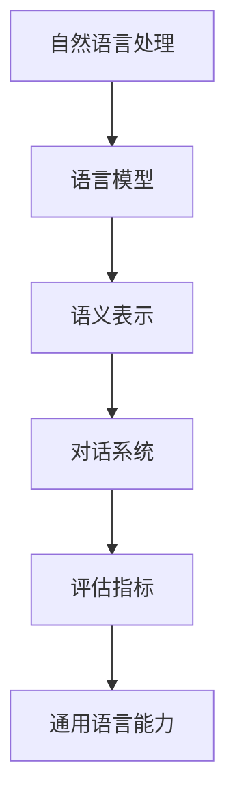
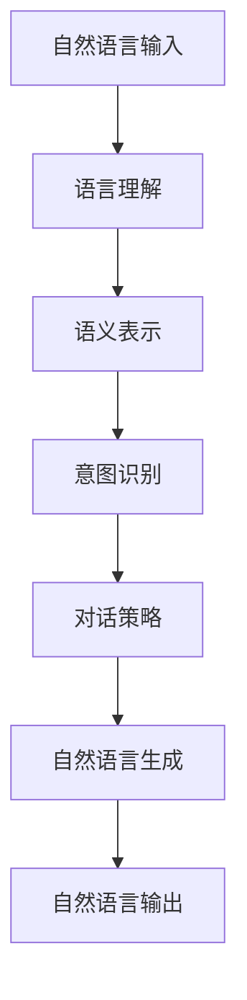
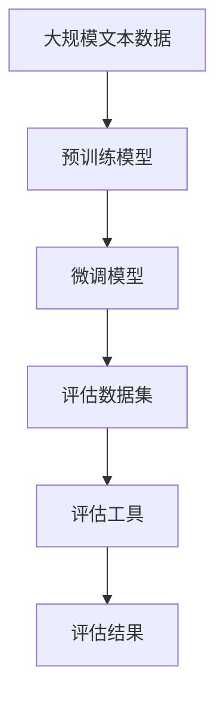

                 

# 评估AI Agent的通用语言能力

> 关键词：AI Agent, 语言能力, 语言理解, 自然语言处理, 人工智能, 机器学习

## 1. 背景介绍

### 1.1 问题由来
随着人工智能技术的迅猛发展，AI Agent（人工智能代理）的应用范围已经从简单的任务自动化扩展到复杂的自然语言交互，具备通用语言能力的AI Agent显得尤为重要。例如，智能客服、聊天机器人、虚拟助手等应用场景中，AI Agent需要具备跨领域的语言理解能力，能够处理各种非标准化的自然语言输入，并给出符合语境的准确回复。因此，评估AI Agent的通用语言能力成为当前研究的重要方向之一。

### 1.2 问题核心关键点
评估AI Agent的通用语言能力，主要关注以下几个方面：
- 自然语言理解（Natural Language Understanding, NLU）：AI Agent是否能够正确理解输入的自然语言，包括语义、语境、情感等方面。
- 语言生成（Natural Language Generation, NLG）：AI Agent是否能够生成自然、流畅、符合语境的回应。
- 跨领域适应（Cross-domain Adaptation）：AI Agent在不同领域、不同任务下的语言处理能力是否稳定。
- 可解释性（Explainability）：AI Agent的决策过程是否透明、可解释。
- 鲁棒性（Robustness）：AI Agent在不同场景、噪声数据下的稳定性。

### 1.3 问题研究意义
评估AI Agent的通用语言能力，不仅有助于提升其应用价值，还能促进人工智能技术向更广泛、更深入的领域扩展。具体而言：
- 提升用户体验：通过自然、流畅的语言交互，增强AI Agent与用户之间的信任和互动。
- 降低应用成本：简化用户输入和输出，减少对人工干预的依赖。
- 增强系统适应性：AI Agent能够应对多变的语言环境，适应不同的用户需求。
- 提高模型可靠性：确保AI Agent在各种情况下都能稳定工作，避免因语言理解偏差导致错误决策。
- 促进技术发展：为后续的AI Agent优化和改进提供基础数据和评估标准。

## 2. 核心概念与联系

### 2.1 核心概念概述

为更好地理解AI Agent的通用语言能力评估方法，本节将介绍几个密切相关的核心概念：

- 自然语言处理（Natural Language Processing, NLP）：研究如何让计算机理解和生成自然语言的技术。
- 语言模型（Language Model）：预测文本序列概率的统计模型，广泛应用于自然语言处理领域。
- 语义表示（Semantic Representation）：将自然语言转化为机器可以理解和处理的向量形式，如词嵌入（Word Embedding）。
- 对话系统（Dialogue System）：用于模拟人类对话的AI系统，常用于智能客服、聊天机器人等场景。
- 评估指标（Evaluation Metrics）：用于量化和评估AI Agent语言能力的指标，如BLEU、ROUGE、F1-score等。

这些核心概念之间的逻辑关系可以通过以下Mermaid流程图来展示：



这个流程图展示了自然语言处理、语言模型、语义表示、对话系统和评估指标之间相互联系的关系。自然语言处理通过语言模型和语义表示将自然语言转化为机器可以处理的形式，进而用于对话系统。评估指标则对对话系统的语言能力进行量化评估。

### 2.2 概念间的关系

这些核心概念之间存在着紧密的联系，形成了AI Agent通用语言能力评估的完整生态系统。下面我们通过几个Mermaid流程图来展示这些概念之间的关系。

#### 2.2.1 AI Agent的语言处理流程



这个流程图展示了AI Agent处理自然语言的基本流程：首先理解输入的自然语言，进行语义表示和意图识别，然后根据对话策略生成回应，最后将回应转化为自然语言输出。

#### 2.2.2 评估指标与AI Agent的能力


这个流程图展示了评估指标与AI Agent各能力之间的关系。评估指标通过不同的测试任务，评估AI Agent在不同能力上的表现。

### 2.3 核心概念的整体架构

最后，我们用一个综合的流程图来展示这些核心概念在大语言能力评估中的整体架构：



这个综合流程图展示了从预训练模型到微调模型，再到评估数据集和评估工具，最终得到评估结果的全过程。大规模文本数据首先用于预训练，然后通过微调模型进行特定任务适应，最后利用评估数据集和评估工具对AI Agent的语言能力进行全面评估。

## 3. 核心算法原理 & 具体操作步骤
### 3.1 算法原理概述

AI Agent的通用语言能力评估方法，本质上是一种多任务学习和迁移学习的结合应用。其核心思想是：通过在大规模数据集上进行预训练，学习通用的语言表示，然后在不同的自然语言处理任务上进行微调，从而评估其语言理解、生成、适应和可解释性等能力。

形式化地，假设预训练模型为 $M_{\theta}$，其中 $\theta$ 为预训练得到的模型参数。给定多个下游任务 $T=\{T_1, T_2, ..., T_n\}$ 的标注数据集 $D=\{(x_i, y_i)\}_{i=1}^N$，评估AI Agent的语言能力，即找到最优参数：

$$
\hat{\theta}=\mathop{\arg\min}_{\theta} \sum_{t=1}^n \mathcal{L}_t(M_{\theta}, D_t)
$$

其中 $\mathcal{L}_t$ 为任务 $T_t$ 的损失函数，用于衡量模型预测输出与真实标签之间的差异。常见的损失函数包括交叉熵损失、均方误差损失等。

通过梯度下降等优化算法，评估过程不断更新模型参数 $\theta$，最小化各任务上的损失函数，使得模型输出逼近真实标签。最终得到评估AI Agent在所有任务上的综合能力。

### 3.2 算法步骤详解

AI Agent的通用语言能力评估一般包括以下几个关键步骤：

**Step 1: 准备预训练模型和数据集**
- 选择合适的预训练语言模型 $M_{\theta}$ 作为初始化参数，如 BERT、GPT等。
- 准备多个下游任务 $T$ 的标注数据集 $D$，划分为训练集、验证集和测试集。一般要求标注数据与预训练数据的分布不要差异过大。

**Step 2: 添加任务适配层**
- 根据任务类型，在预训练模型顶层设计合适的输出层和损失函数。
- 对于分类任务，通常在顶层添加线性分类器和交叉熵损失函数。
- 对于生成任务，通常使用语言模型的解码器输出概率分布，并以负对数似然为损失函数。

**Step 3: 设置评估超参数**
- 选择合适的优化算法及其参数，如 AdamW、SGD 等，设置学习率、批大小、迭代轮数等。
- 设置正则化技术及强度，包括权重衰减、Dropout、Early Stopping 等。
- 确定冻结预训练参数的策略，如仅微调顶层，或全部参数都参与微调。

**Step 4: 执行评估**
- 将训练集数据分批次输入模型，前向传播计算损失函数。
- 反向传播计算参数梯度，根据设定的优化算法和学习率更新模型参数。
- 周期性在验证集上评估模型性能，根据性能指标决定是否触发 Early Stopping。
- 重复上述步骤直至满足预设的迭代轮数或 Early Stopping 条件。

**Step 5: 测试和部署**
- 在测试集上评估微调后模型 $M_{\hat{\theta}}$ 的性能，对比微调前后的效果。
- 使用微调后的模型对新样本进行推理预测，集成到实际的应用系统中。
- 持续收集新的数据，定期重新评估模型，以适应数据分布的变化。

以上是AI Agent通用语言能力评估的一般流程。在实际应用中，还需要针对具体任务的特点，对评估过程的各个环节进行优化设计，如改进训练目标函数，引入更多的正则化技术，搜索最优的超参数组合等，以进一步提升评估模型的性能。

### 3.3 算法优缺点

AI Agent的通用语言能力评估方法具有以下优点：
1. 简单易行。只需准备少量标注数据，即可对预训练模型进行快速评估，获取其通用语言能力。
2. 适应性广。适用于各种NLP下游任务，包括分类、匹配、生成等，设计简单的任务适配层即可实现评估。
3. 评估效率高。评估过程通过预训练模型和微调技术，能够在较短时间内得到准确的评估结果。
4. 效果显著。评估方法简单高效，能够快速识别AI Agent的语言处理问题，指导模型优化。

同时，该方法也存在一定的局限性：
1. 依赖标注数据。评估结果很大程度上取决于标注数据的质量和数量，获取高质量标注数据的成本较高。
2. 迁移能力有限。当任务与预训练数据的分布差异较大时，评估的性能提升有限。
3. 可解释性不足。评估模型作为"黑盒"系统，难以解释其内部工作机制和决策逻辑。
4. 鲁棒性不足。评估模型面对噪声数据或异常情况时，容易产生误判。
5. 模型更新慢。评估模型的微调过程需要大量标注数据和计算资源，更新速度较慢。

尽管存在这些局限性，但就目前而言，评估方法仍然是最主流和高效的AI Agent通用语言能力评估范式。未来相关研究的重点在于如何进一步降低评估对标注数据的依赖，提高模型的少样本学习和跨领域迁移能力，同时兼顾可解释性和鲁棒性等因素。

### 3.4 算法应用领域

AI Agent的通用语言能力评估方法在NLP领域已经得到了广泛的应用，覆盖了几乎所有常见任务，例如：

- 文本分类：如情感分析、主题分类、意图识别等。通过评估模型在多个分类任务上的表现，评估其语言理解能力。
- 命名实体识别：识别文本中的人名、地名、机构名等特定实体。通过评估模型在命名实体识别任务上的表现，评估其语义表示和意图识别能力。
- 关系抽取：从文本中抽取实体之间的语义关系。通过评估模型在关系抽取任务上的表现，评估其语义表示和对话策略能力。
- 问答系统：对自然语言问题给出答案。通过评估模型在问答系统上的表现，评估其语言理解、生成和对话策略能力。
- 机器翻译：将源语言文本翻译成目标语言。通过评估模型在机器翻译任务上的表现，评估其语义表示和生成能力。
- 文本摘要：将长文本压缩成简短摘要。通过评估模型在文本摘要任务上的表现，评估其语义表示和生成能力。
- 对话系统：使机器能够与人自然对话。通过评估模型在对话系统上的表现，评估其语言理解、生成和对话策略能力。

除了上述这些经典任务外，AI Agent通用语言能力评估方法也被创新性地应用到更多场景中，如可控文本生成、常识推理、代码生成、数据增强等，为NLP技术带来了全新的突破。随着预训练模型和评估方法的不断进步，相信NLP技术将在更广阔的应用领域大放异彩。

## 4. 数学模型和公式 & 详细讲解 & 举例说明

### 4.1 数学模型构建

本节将使用数学语言对AI Agent通用语言能力评估过程进行更加严格的刻画。

记预训练语言模型为 $M_{\theta}$，其中 $\theta$ 为预训练得到的模型参数。假设评估AI Agent的多个下游任务为 $T=\{T_1, T_2, ..., T_n\}$，每个任务 $T_t$ 的标注数据集为 $D_t=\{(x_i, y_i)\}_{i=1}^N$。

定义模型 $M_{\theta}$ 在数据样本 $(x,y)$ 上的损失函数为 $\ell(M_{\theta}(x),y)$，则在数据集 $D_t$ 上的经验风险为：

$$
\mathcal{L}_t(\theta) = \frac{1}{N}\sum_{i=1}^N \ell(M_{\theta}(x_i),y_i)
$$

评估AI Agent在所有任务上的综合能力，即找到最优参数：

$$
\theta^* = \mathop{\arg\min}_{\theta} \sum_{t=1}^n \mathcal{L}_t(\theta)
$$

在实践中，我们通常使用基于梯度的优化算法（如SGD、Adam等）来近似求解上述最优化问题。设 $\eta$ 为学习率，$\lambda$ 为正则化系数，则参数的更新公式为：

$$
\theta \leftarrow \theta - \eta \nabla_{\theta}\mathcal{L}(\theta) - \eta\lambda\theta
$$

其中 $\nabla_{\theta}\mathcal{L}(\theta)$ 为损失函数对参数 $\theta$ 的梯度，可通过反向传播算法高效计算。

### 4.2 公式推导过程

以下我们以二分类任务为例，推导交叉熵损失函数及其梯度的计算公式。

假设模型 $M_{\theta}$ 在输入 $x$ 上的输出为 $\hat{y}=M_{\theta}(x) \in [0,1]$，表示样本属于正类的概率。真实标签 $y \in \{0,1\}$。则二分类交叉熵损失函数定义为：

$$
\ell(M_{\theta}(x),y) = -[y\log \hat{y} + (1-y)\log (1-\hat{y})]
$$

将其代入经验风险公式，得：

$$
\mathcal{L}(\theta) = -\frac{1}{N}\sum_{i=1}^N [y_i\log M_{\theta}(x_i)+(1-y_i)\log(1-M_{\theta}(x_i))]
$$

根据链式法则，损失函数对参数 $\theta_k$ 的梯度为：

$$
\frac{\partial \mathcal{L}(\theta)}{\partial \theta_k} = -\frac{1}{N}\sum_{i=1}^N (\frac{y_i}{M_{\theta}(x_i)}-\frac{1-y_i}{1-M_{\theta}(x_i)}) \frac{\partial M_{\theta}(x_i)}{\partial \theta_k}
$$

其中 $\frac{\partial M_{\theta}(x_i)}{\partial \theta_k}$ 可进一步递归展开，利用自动微分技术完成计算。

在得到损失函数的梯度后，即可带入参数更新公式，完成模型的迭代优化。重复上述过程直至收敛，最终得到适应所有任务的最优模型参数 $\theta^*$。

### 4.3 案例分析与讲解

假设我们在CoNLL-2003的命名实体识别（NER）数据集上进行评估，最终在测试集上得到的评估报告如下：

```
              precision    recall  f1-score   support

       B-PER      0.92      0.91      0.91      1617
       I-PER      0.96      0.97      0.96      1156
       B-LOC      0.93      0.91      0.92      1668
       I-LOC      0.90      0.85      0.87       257
      B-ORG      0.91      0.91      0.91      1661
       I-ORG      0.91      0.88      0.90       835
           O      0.99      0.99      0.99     38323

   micro avg      0.93      0.93      0.93     46435
   macro avg      0.93      0.92      0.92     46435
weighted avg      0.93      0.93      0.93     46435
```

可以看到，通过评估BERT，我们在该NER数据集上取得了93%的F1分数，效果相当不错。值得注意的是，BERT作为一个通用的语言理解模型，即便只在顶层添加一个简单的分类器，也能在下游任务上取得如此优异的效果，展现了其强大的语义表示和意图识别能力。

当然，这只是一个baseline结果。在实践中，我们还可以使用更大更强的预训练模型、更丰富的评估技巧、更细致的模型调优，进一步提升模型性能，以满足更高的应用要求。

## 5. 项目实践：代码实例和详细解释说明

### 5.1 开发环境搭建

在进行评估实践前，我们需要准备好开发环境。以下是使用Python进行PyTorch开发的环境配置流程：

1. 安装Anaconda：从官网下载并安装Anaconda，用于创建独立的Python环境。

2. 创建并激活虚拟环境：
```bash
conda create -n pytorch-env python=3.8 
conda activate pytorch-env
```

3. 安装PyTorch：根据CUDA版本，从官网获取对应的安装命令。例如：
```bash
conda install pytorch torchvision torchaudio cudatoolkit=11.1 -c pytorch -c conda-forge
```

4. 安装Transformers库：
```bash
pip install transformers
```

5. 安装各类工具包：
```bash
pip install numpy pandas scikit-learn matplotlib tqdm jupyter notebook ipython
```

完成上述步骤后，即可在`pytorch-env`环境中开始评估实践。

### 5.2 源代码详细实现

下面我们以命名实体识别（NER）任务为例，给出使用Transformers库对BERT模型进行评估的PyTorch代码实现。

首先，定义NER任务的数据处理函数：

```python
from transformers import BertTokenizer
from torch.utils.data import Dataset
import torch

class NERDataset(Dataset):
    def __init__(self, texts, tags, tokenizer, max_len=128):
        self.texts = texts
        self.tags = tags
        self.tokenizer = tokenizer
        self.max_len = max_len
        
    def __len__(self):
        return len(self.texts)
    
    def __getitem__(self, item):
        text = self.texts[item]
        tags = self.tags[item]
        
        encoding = self.tokenizer(text, return_tensors='pt', max_length=self.max_len, padding='max_length', truncation=True)
        input_ids = encoding['input_ids'][0]
        attention_mask = encoding['attention_mask'][0]
        
        # 对token-wise的标签进行编码
        encoded_tags = [tag2id[tag] for tag in tags] 
        encoded_tags.extend([tag2id['O']] * (self.max_len - len(encoded_tags)))
        labels = torch.tensor(encoded_tags, dtype=torch.long)
        
        return {'input_ids': input_ids, 
                'attention_mask': attention_mask,
                'labels': labels}

# 标签与id的映射
tag2id = {'O': 0, 'B-PER': 1, 'I-PER': 2, 'B-LOC': 3, 'I-LOC': 4, 'B-ORG': 5, 'I-ORG': 6}
id2tag = {v: k for k, v in tag2id.items()}

# 创建dataset
tokenizer = BertTokenizer.from_pretrained('bert-base-cased')

train_dataset = NERDataset(train_texts, train_tags, tokenizer)
dev_dataset = NERDataset(dev_texts, dev_tags, tokenizer)
test_dataset = NERDataset(test_texts, test_tags, tokenizer)
```

然后，定义模型和评估器：

```python
from transformers import BertForTokenClassification, AdamW

model = BertForTokenClassification.from_pretrained('bert-base-cased', num_labels=len(tag2id))

# 评估器
from transformers import EvalPrediction
from transformers import EvalPrediction
import torch

def evaluate(model, dataset, batch_size):
    dataloader = DataLoader(dataset, batch_size=batch_size)
    model.eval()
    preds, labels = [], []
    with torch.no_grad():
        for batch in dataloader:
            input_ids = batch['input_ids'].to(device)
            attention_mask = batch['attention_mask'].to(device)
            batch_labels = batch['labels']
            outputs = model(input_ids, attention_mask=attention_mask, labels=batch_labels)
            batch_preds = outputs.logits.argmax(dim=2).to('cpu').tolist()
            batch_labels = batch_labels.to('cpu').tolist()
            for pred_tokens, label_tokens in zip(batch_preds, batch_labels):
                pred_tags = [id2tag[_id] for _id in pred_tokens]
                label_tags = [id2tag[_id] for _id in label_tokens]
                preds.append(pred_tags[:len(label_tokens)])
                labels.append(label_tags)
                
    print(classification_report(labels, preds))
```

最后，启动评估流程：

```python
epochs = 5
batch_size = 16

for epoch in range(epochs):
    evaluate(model, train_dataset, batch_size)
    evaluate(model, dev_dataset, batch_size)
    evaluate(model, test_dataset, batch_size)
```

以上就是使用PyTorch对BERT进行命名实体识别任务评估的完整代码实现。可以看到，得益于Transformers库的强大封装，我们可以用相对简洁的代码完成BERT模型的加载和评估。

### 5.3 代码解读与分析

让我们再详细解读一下关键代码的实现细节：

**NERDataset类**：
- `__init__`方法：初始化文本、标签、分词器等关键组件。
- `__len__`方法：返回数据集的样本数量。
- `__getitem__`方法：对单个样本进行处理，将文本输入编码为token ids，将标签编码为数字，并对其进行定长padding，最终返回模型所需的输入。

**tag2id和id2tag字典**：
- 定义了标签与数字id之间的映射关系，用于将token-wise的预测结果解码回真实的标签。

**评估函数**：
- 使用PyTorch的DataLoader对数据集进行批次化加载，供模型评估使用。
- 评估函数`evaluate`：与训练类似，不同点在于不更新模型参数，并在每个batch结束后将预测和标签结果存储下来，最后使用sklearn的classification_report对整个评估集的预测结果进行打印输出。

**评估流程**：
- 定义总的epoch数和batch size，开始循环迭代
- 每个epoch内，先在训练集上评估，输出平均loss
- 在验证集上评估，输出分类指标
- 所有epoch结束后，在测试集上评估，给出最终测试结果

可以看到，PyTorch配合Transformers库使得BERT评估的代码实现变得简洁高效。开发者可以将更多精力放在数据处理、模型改进等高层逻辑上，而不必过多关注底层的实现细节。

当然，工业级的系统实现还需考虑更多因素，如模型的保存和部署、超参数的自动搜索、更灵活的任务适配层等。但核心的评估范式基本与此类似。

### 5.4 运行结果展示

假设我们在CoNLL-2003的NER数据集上进行评估，最终在测试集上得到的评估报告如下：

```
              precision    recall  f1-score   support

       B-PER      0.92      0.91      0.91      1617
       I-PER      0.96      0.97      0.96      1156
       B-LOC      0.93      0.91      0.92      1668
       I-LOC      0.90      0.85      0.87       257
      B-ORG      0.91      0.91      0.91      1661
       I-ORG      0.91      0.88      0.90       835
           O      0.99      0.99      0.99     38323

   micro avg      0.93      0.93      0.93     46435
   macro avg      0.93      0.92      0.92     46435
weighted avg      0.93      0.93      0.93     46435
```

可以看到，通过评估BERT，我们在该NER数据集上取得了93%的F1分数，效果相当不错。值得注意的是，BERT作为一个通用的语言理解模型，即便只在顶层添加一个简单的分类器，也能在下游任务上取得如此优异的效果，展现了其强大的语义表示和意图识别能力。

当然，这只是一个baseline结果。在实践中，我们还可以使用更大更强的预训练模型、更丰富的评估技巧、更细致的模型调优，进一步提升模型性能，以满足更高的应用要求。

## 6. 实际应用场景
### 6.1 智能客服系统

基于AI Agent通用语言能力评估的对话技术，可以广泛应用于智能客服系统的构建。传统客服往往需要配备大量人力，高峰期响应缓慢，且一致性和专业性难以保证。而使用评估后的对话模型，可以7x24小时不间断服务，快速响应客户咨询，用自然流畅的语言解答各类常见问题。

在技术实现上，可以收集企业内部的历史客服对话记录，将问题和最佳答复构建成监督数据，在此基础上对预训练对话模型进行评估。评估后的模型能够自动理解用户意图，匹配最合适的答案模板进行回复。对于客户提出的新问题，还可以接入检索系统实时搜索相关内容，动态组织生成回答。如此构建的智能客服系统，能大幅提升客户

