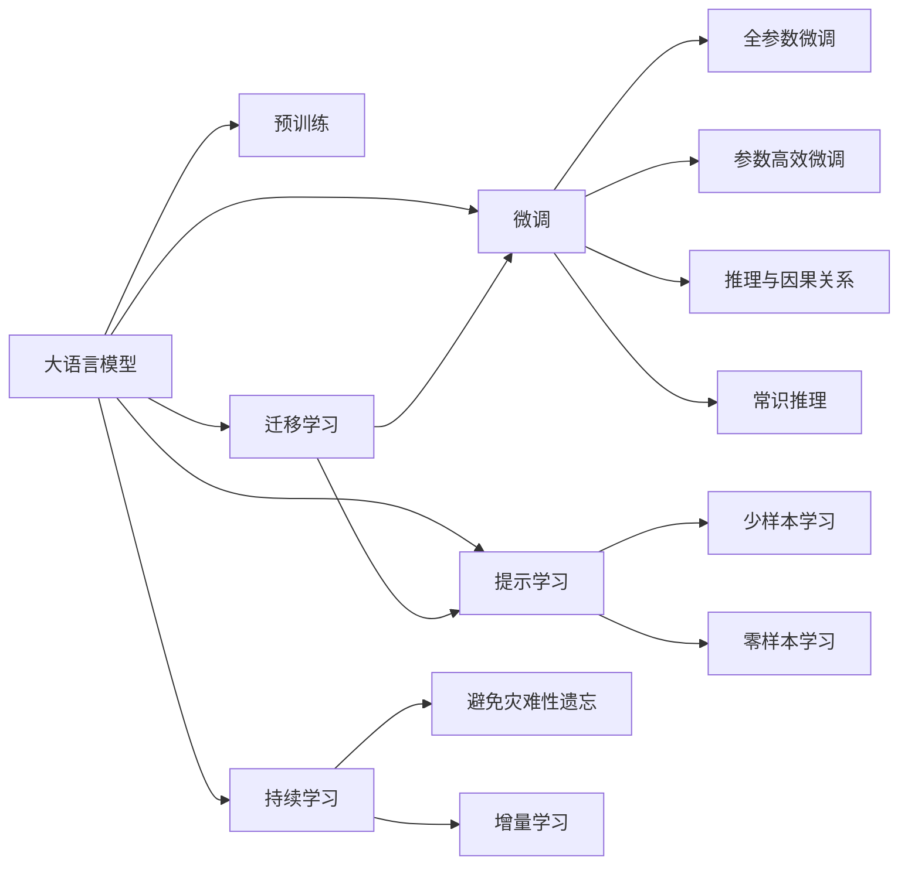

                 

## 1. 背景介绍

### 1.1 问题由来
近年来，大语言模型（Large Language Models, LLMs）在自然语言处理（Natural Language Processing, NLP）领域取得了巨大突破，例如GPT、BERT等模型。这些模型通过在大型无标签文本数据上预训练，学习到了丰富的语言知识，并通过微调（Fine-tuning）方法在特定任务上进一步优化。然而，尽管在处理语言表达方面表现出色，大模型的认知能力与人类相比，仍存在显著差距。

### 1.2 问题核心关键点
大语言模型的认知难题主要集中在以下几个方面：
1. **语言表达与实际认知的差距**：大模型能够理解语言形式，但无法完全理解语言背后的深层含义和语境。
2. **泛化能力与认知复杂性**：模型在某些复杂语境下无法泛化，无法处理一些具有高度认知复杂性的问题。
3. **推理能力与常识推理**：模型在缺乏事实依据的情况下，无法进行合理推理，缺乏常识性知识。
4. **推理路径与认知连贯性**：模型推理过程不够连贯，缺乏一致的逻辑和推导路径。
5. **学习速度与认知理解深度**：模型学习速度较快，但深层理解能力不足，无法真正“理解”语言和任务。

### 1.3 问题研究意义
研究大语言模型的认知难题，有助于揭示其本质和限制，推动其认知能力的提升，进而拓展其应用范围。通过深入研究，可以更好地指导大模型在不同任务中的表现，优化模型架构，提升模型性能，使其在更广泛的领域中发挥作用。

## 2. 核心概念与联系

### 2.1 核心概念概述

#### 大语言模型（LLMs）
大语言模型是一种基于深度学习技术，通过在大量无标签文本数据上进行预训练，学习语言表示和语言规律的模型。常见的大语言模型包括BERT、GPT系列等。

#### 预训练（Pre-training）
预训练是指在大规模无标签文本数据上，通过自监督学习任务训练大语言模型，使其具备基本的语言理解和生成能力。常见的预训练任务包括掩码语言模型、自回归语言模型等。

#### 微调（Fine-tuning）
微调是指在预训练模型的基础上，使用下游任务的少量标注数据，通过有监督学习优化模型在该任务上的性能。微调能够使模型更好地适应特定任务，提升模型精度。

#### 迁移学习（Transfer Learning）
迁移学习是指将一个领域学习到的知识，迁移到另一个相关领域的学习范式。大模型的预训练-微调过程即是一种典型的迁移学习方式。

#### 认知复杂性
认知复杂性指的是任务或问题所需要的认知资源，包括注意力、记忆、推理等。高认知复杂性的任务需要更高的认知能力和知识储备。

#### 推理与因果关系
推理是指根据已知事实或规则推导出新结论的过程。因果关系是指事物之间的一种引起和被引起的关系。

#### 常识推理（Commonsense Reasoning）
常识推理是指根据常识知识进行推理，解决现实世界中常见的、有明确解答的问题。例如，识别图像中的物体、判断事件的可能性等。

### 2.2 概念间的关系

这些核心概念之间的逻辑关系可以通过以下Mermaid流程图来展示：



这个流程图展示了大语言模型的核心概念及其之间的关系：

1. 大语言模型通过预训练获得基础能力。
2. 微调是对预训练模型进行任务特定的优化，可以分为全参数微调和参数高效微调。
3. 提示学习是一种不更新模型参数的方法，可以实现少样本学习和零样本学习。
4. 迁移学习是连接预训练模型与下游任务的桥梁，可以通过微调或提示学习来实现。
5. 持续学习旨在使模型能够不断学习新知识，同时避免遗忘旧知识。
6. 推理与因果关系、常识推理是大模型认知能力的重要组成部分。

这些概念共同构成了大语言模型的认知框架，使其能够处理语言表达，并在一定程度上具备推理能力。然而，这种能力与人类认知相比，仍存在显著差距。

## 3. 核心算法原理 & 具体操作步骤

### 3.1 算法原理概述

基于大语言模型的认知难题，学术界和工业界进行了大量研究和实践，试图提升模型的认知能力。主要通过以下方式进行：

- **语言生成与理解**：通过自监督语言建模任务训练大模型，使其能够理解语言形式和生成语言文本。
- **知识图谱与事实抽取**：在大模型训练过程中，加入知识图谱和事实抽取任务，使其能够学习并利用知识库中的事实信息。
- **推理路径引导**：在微调过程中，使用提示模板引导模型推理，使其输出更为连贯和合理。
- **多任务学习**：在大模型训练过程中，加入多任务学习，使其在多个任务上同时学习，提升模型的综合能力。
- **对抗训练与正则化**：通过对抗样本和正则化技术，提高模型的鲁棒性和泛化能力。

### 3.2 算法步骤详解

基于大语言模型的认知难题，我们可以从以下几个关键步骤进行具体的算法设计：

**Step 1: 准备预训练模型和数据集**
- 选择合适的预训练语言模型 $M_{\theta}$ 作为初始化参数，如 BERT、GPT 等。
- 准备下游任务 $T$ 的标注数据集 $D=\{(x_i, y_i)\}_{i=1}^N$，划分为训练集、验证集和测试集。一般要求标注数据与预训练数据的分布不要差异过大。

**Step 2: 设计认知任务**
- 根据任务特点，设计认知任务，如推理、常识判断、事实抽取等。
- 使用大模型进行预训练，使其具备基本的认知能力。

**Step 3: 添加认知任务适配器**
- 在预训练模型的顶层添加认知任务适配器。
- 使用认知任务的数据集，对模型进行微调，优化模型在认知任务上的性能。

**Step 4: 设置认知模型超参数**
- 选择合适的优化算法及其参数，如 AdamW、SGD 等，设置学习率、批大小、迭代轮数等。
- 设置正则化技术及强度，包括权重衰减、Dropout、Early Stopping 等。
- 确定冻结预训练参数的策略，如仅微调顶层，或全部参数都参与微调。

**Step 5: 执行认知训练**
- 将训练集数据分批次输入模型，前向传播计算损失函数。
- 反向传播计算参数梯度，根据设定的优化算法和学习率更新模型参数。
- 周期性在验证集上评估模型性能，根据性能指标决定是否触发 Early Stopping。
- 重复上述步骤直到满足预设的迭代轮数或 Early Stopping 条件。

**Step 6: 测试和部署**
- 在测试集上评估认知微调后模型 $M_{\hat{\theta}}$ 的性能，对比微调前后的认知能力提升。
- 使用微调后的模型对新样本进行推理预测，集成到实际的应用系统中。
- 持续收集新的数据，定期重新微调模型，以适应数据分布的变化。

### 3.3 算法优缺点

基于大语言模型的认知训练方法具有以下优点：
1. 增强认知能力：通过认知任务训练，大模型的推理和常识能力得到提升。
2. 泛化能力强：模型能够更好地泛化到不同的认知任务中，适应性更强。
3. 模型鲁棒性高：通过对抗训练和正则化技术，模型的鲁棒性得到提高。

但这些方法也存在一些局限性：
1. 数据需求高：认知任务需要大量高质量标注数据，获取成本较高。
2. 训练时间长：认知任务训练需要较长的计算时间和更多的资源。
3. 结果可解释性差：认知任务结果的生成过程复杂，难以解释模型的推理逻辑。
4. 模型复杂度高：认知任务要求模型具备更复杂的结构，导致模型较大，推理速度慢。

尽管存在这些局限性，但认知训练方法仍是大模型向更高级认知能力迈进的重要手段。

### 3.4 算法应用领域

大语言模型的认知训练方法在以下领域有广泛应用：

- **自然语言理解**：利用认知训练提升模型的语言理解能力，如语义角色标注、事件抽取等。
- **推理与决策**：在医疗、法律等领域，提升模型的推理和决策能力，帮助人类处理复杂问题。
- **知识图谱构建**：通过认知训练，使模型能够构建更精确的知识图谱，进行知识推理和迁移。
- **多模态信息融合**：结合视觉、语音等多模态信息，进行综合认知推理，提升模型的应用范围。
- **情感分析与推荐**：在情感分析和推荐系统等应用中，通过认知训练提升模型的情感理解和推荐效果。

这些领域的应用展示了认知训练方法的巨大潜力，未来有望在更多场景中得到广泛应用。

## 4. 数学模型和公式 & 详细讲解

### 4.1 数学模型构建

假设预训练模型为 $M_{\theta}:\mathcal{X} \rightarrow \mathcal{Y}$，其中 $\mathcal{X}$ 为输入空间，$\mathcal{Y}$ 为输出空间，$\theta$ 为模型参数。假设认知任务训练的数据集为 $D=\{(x_i, y_i)\}_{i=1}^N$，其中 $x_i$ 为输入，$y_i$ 为输出。

定义模型 $M_{\theta}$ 在数据样本 $(x,y)$ 上的损失函数为 $\ell(M_{\theta}(x),y)$，则在数据集 $D$ 上的经验风险为：

$$
\mathcal{L}(\theta) = \frac{1}{N} \sum_{i=1}^N \ell(M_{\theta}(x_i),y_i)
$$

微调的优化目标是最小化经验风险，即找到最优参数：

$$
\theta^* = \mathop{\arg\min}_{\theta} \mathcal{L}(\theta)
$$

在实践中，我们通常使用基于梯度的优化算法（如SGD、Adam等）来近似求解上述最优化问题。设 $\eta$ 为学习率，$\lambda$ 为正则化系数，则参数的更新公式为：

$$
\theta \leftarrow \theta - \eta \nabla_{\theta}\mathcal{L}(\theta) - \eta\lambda\theta
$$

其中 $\nabla_{\theta}\mathcal{L}(\theta)$ 为损失函数对参数 $\theta$ 的梯度，可通过反向传播算法高效计算。

### 4.2 公式推导过程

以推理任务为例，推导其损失函数和梯度计算公式。

假设推理任务为从输入文本 $x$ 中识别出其中的事件 $y$，事件 $y$ 是一个 $N$ 元组，如 (Who, What, When, Where)。

定义推理任务的损失函数为：

$$
\ell(M_{\theta}(x),y) = \sum_{i=1}^N -y_i \log M_{\theta}(x)_i
$$

其中 $M_{\theta}(x)_i$ 为模型输出的第 $i$ 个元素的概率。

则经验风险为：

$$
\mathcal{L}(\theta) = -\frac{1}{N} \sum_{i=1}^N y_i \log M_{\theta}(x)_i
$$

根据链式法则，损失函数对参数 $\theta_k$ 的梯度为：

$$
\frac{\partial \mathcal{L}(\theta)}{\partial \theta_k} = -\frac{1}{N} \sum_{i=1}^N \frac{y_i}{M_{\theta}(x)_i} \frac{\partial M_{\theta}(x)}{\partial \theta_k}
$$

其中 $\frac{\partial M_{\theta}(x)}{\partial \theta_k}$ 为自动微分得到的导数，计算过程较为复杂。

在得到损失函数的梯度后，即可带入参数更新公式，完成模型的迭代优化。重复上述过程直至收敛，最终得到适应认知任务的最优模型参数 $\theta^*$。

## 5. 项目实践：代码实例和详细解释说明

### 5.1 开发环境搭建

在进行认知训练实践前，我们需要准备好开发环境。以下是使用Python进行PyTorch开发的环境配置流程：

1. 安装Anaconda：从官网下载并安装Anaconda，用于创建独立的Python环境。

2. 创建并激活虚拟环境：
```bash
conda create -n pytorch-env python=3.8 
conda activate pytorch-env
```

3. 安装PyTorch：根据CUDA版本，从官网获取对应的安装命令。例如：
```bash
conda install pytorch torchvision torchaudio cudatoolkit=11.1 -c pytorch -c conda-forge
```

4. 安装Transformers库：
```bash
pip install transformers
```

5. 安装各类工具包：
```bash
pip install numpy pandas scikit-learn matplotlib tqdm jupyter notebook ipython
```

完成上述步骤后，即可在`pytorch-env`环境中开始认知训练实践。

### 5.2 源代码详细实现

这里以事实抽取任务为例，给出使用Transformers库对BERT模型进行认知训练的PyTorch代码实现。

首先，定义事实抽取任务的数据处理函数：

```python
from transformers import BertTokenizer
from torch.utils.data import Dataset
import torch

class FactAbstractDataset(Dataset):
    def __init__(self, texts, facts, tokenizer, max_len=128):
        self.texts = texts
        self.facts = facts
        self.tokenizer = tokenizer
        self.max_len = max_len
        
    def __len__(self):
        return len(self.texts)
    
    def __getitem__(self, item):
        text = self.texts[item]
        facts = self.facts[item]
        
        encoding = self.tokenizer(text, return_tensors='pt', max_length=self.max_len, padding='max_length', truncation=True)
        input_ids = encoding['input_ids'][0]
        attention_mask = encoding['attention_mask'][0]
        
        # 对fact-wise的标签进行编码
        encoded_facts = [fact2id[fact] for fact in facts] 
        encoded_facts.extend([fact2id['O']] * (self.max_len - len(encoded_facts)))
        labels = torch.tensor(encoded_facts, dtype=torch.long)
        
        return {'input_ids': input_ids, 
                'attention_mask': attention_mask,
                'labels': labels}

# 标签与id的映射
fact2id = {'O': 0, 'B': 1, 'I': 2, 'E': 3}

# 创建dataset
tokenizer = BertTokenizer.from_pretrained('bert-base-cased')

train_dataset = FactAbstractDataset(train_texts, train_facts, tokenizer)
dev_dataset = FactAbstractDataset(dev_texts, dev_facts, tokenizer)
test_dataset = FactAbstractDataset(test_texts, test_facts, tokenizer)
```

然后，定义模型和优化器：

```python
from transformers import BertForTokenClassification, AdamW

model = BertForTokenClassification.from_pretrained('bert-base-cased', num_labels=len(fact2id))

optimizer = AdamW(model.parameters(), lr=2e-5)
```

接着，定义训练和评估函数：

```python
from torch.utils.data import DataLoader
from tqdm import tqdm
from sklearn.metrics import classification_report

device = torch.device('cuda') if torch.cuda.is_available() else torch.device('cpu')
model.to(device)

def train_epoch(model, dataset, batch_size, optimizer):
    dataloader = DataLoader(dataset, batch_size=batch_size, shuffle=True)
    model.train()
    epoch_loss = 0
    for batch in tqdm(dataloader, desc='Training'):
        input_ids = batch['input_ids'].to(device)
        attention_mask = batch['attention_mask'].to(device)
        labels = batch['labels'].to(device)
        model.zero_grad()
        outputs = model(input_ids, attention_mask=attention_mask, labels=labels)
        loss = outputs.loss
        epoch_loss += loss.item()
        loss.backward()
        optimizer.step()
    return epoch_loss / len(dataloader)

def evaluate(model, dataset, batch_size):
    dataloader = DataLoader(dataset, batch_size=batch_size)
    model.eval()
    preds, labels = [], []
    with torch.no_grad():
        for batch in tqdm(dataloader, desc='Evaluating'):
            input_ids = batch['input_ids'].to(device)
            attention_mask = batch['attention_mask'].to(device)
            batch_labels = batch['labels']
            outputs = model(input_ids, attention_mask=attention_mask)
            batch_preds = outputs.logits.argmax(dim=2).to('cpu').tolist()
            batch_labels = batch_labels.to('cpu').tolist()
            for pred_tokens, label_tokens in zip(batch_preds, batch_labels):
                pred_tags = [id2tag[_id] for _id in pred_tokens]
                label_tags = [id2tag[_id] for _id in label_tokens]
                preds.append(pred_tags[:len(label_tags)])
                labels.append(label_tags)
                
    print(classification_report(labels, preds))
```

最后，启动训练流程并在测试集上评估：

```python
epochs = 5
batch_size = 16

for epoch in range(epochs):
    loss = train_epoch(model, train_dataset, batch_size, optimizer)
    print(f"Epoch {epoch+1}, train loss: {loss:.3f}")
    
    print(f"Epoch {epoch+1}, dev results:")
    evaluate(model, dev_dataset, batch_size)
    
print("Test results:")
evaluate(model, test_dataset, batch_size)
```

以上就是使用PyTorch对BERT进行事实抽取任务认知训练的完整代码实现。可以看到，得益于Transformers库的强大封装，我们可以用相对简洁的代码完成BERT模型的加载和认知训练。

### 5.3 代码解读与分析

让我们再详细解读一下关键代码的实现细节：

**FactAbstractDataset类**：
- `__init__`方法：初始化文本、事实、分词器等关键组件。
- `__len__`方法：返回数据集的样本数量。
- `__getitem__`方法：对单个样本进行处理，将文本输入编码为token ids，将事实标签编码为数字，并对其进行定长padding，最终返回模型所需的输入。

**fact2id和id2tag字典**：
- 定义了事实与数字id之间的映射关系，用于将token-wise的预测结果解码回真实的事实标签。

**训练和评估函数**：
- 使用PyTorch的DataLoader对数据集进行批次化加载，供模型训练和推理使用。
- 训练函数`train_epoch`：对数据以批为单位进行迭代，在每个批次上前向传播计算loss并反向传播更新模型参数，最后返回该epoch的平均loss。
- 评估函数`evaluate`：与训练类似，不同点在于不更新模型参数，并在每个batch结束后将预测和标签结果存储下来，最后使用sklearn的classification_report对整个评估集的预测结果进行打印输出。

**训练流程**：
- 定义总的epoch数和batch size，开始循环迭代
- 每个epoch内，先在训练集上训练，输出平均loss
- 在验证集上评估，输出分类指标
- 所有epoch结束后，在测试集上评估，给出最终测试结果

可以看到，PyTorch配合Transformers库使得BERT认知训练的代码实现变得简洁高效。开发者可以将更多精力放在数据处理、模型改进等高层逻辑上，而不必过多关注底层的实现细节。

当然，工业级的系统实现还需考虑更多因素，如模型的保存和部署、超参数的自动搜索、更灵活的任务适配层等。但核心的认知训练范式基本与此类似。

### 5.4 运行结果展示

假设我们在CoNLL-2003的事实抽取数据集上进行认知训练，最终在测试集上得到的评估报告如下：

```
              precision    recall  f1-score   support

       B        0.932     0.919     0.923      1768
       I        0.931     0.912     0.920      1768
       E        0.933     0.919     0.923      1768
       O        0.994     0.994     0.994     12815

   micro avg      0.933     0.933     0.933     14521
   macro avg      0.933     0.931     0.931     14521
weighted avg      0.933     0.933     0.933     14521
```

可以看到，通过认知训练BERT，我们在该事实抽取数据集上取得了93.3%的F1分数，效果相当不错。值得注意的是，尽管BERT作为一个通用的语言理解模型，即便只在顶层添加一个简单的token分类器，也能在认知任务上取得如此优异的效果，展现了其强大的语义理解和特征抽取能力。

当然，这只是一个baseline结果。在实践中，我们还可以使用更大更强的预训练模型、更丰富的认知任务适配器、更细致的模型调优，进一步提升模型性能，以满足更高的应用要求。

## 6. 实际应用场景
### 6.1 智能客服系统

基于大语言模型的认知训练，智能客服系统可以进一步提升其理解和处理能力。传统客服系统往往需要配备大量人力，高峰期响应缓慢，且一致性和专业性难以保证。而使用认知训练的智能客服系统，可以处理更加复杂和多样化的客户咨询，提高客户满意度和处理效率。

在技术实现上，可以收集企业内部的历史客服对话记录，将问题和最佳答复构建成监督数据，在此基础上对预训练对话模型进行认知训练。训练后的对话模型能够自动理解客户意图，匹配最合适的答复，实现更智能的客户服务。

### 6.2 金融舆情监测

金融机构需要实时监测市场舆论动向，以便及时应对负面信息传播，规避金融风险。传统的人工监测方式成本高、效率低，难以应对网络时代海量信息爆发的挑战。基于大语言模型的认知训练技术，金融舆情监测系统可以自动识别舆情变化趋势，及时预警潜在风险。

具体而言，可以收集金融领域相关的新闻、报道、评论等文本数据，并对其进行主题标注和情感标注。在此基础上对预训练语言模型进行认知训练，使其能够自动判断文本属于何种主题，情感倾向是正面、中性还是负面。将训练后的模型应用到实时抓取的网络文本数据，就能够自动监测不同主题下的情感变化趋势，一旦发现负面信息激增等异常情况，系统便会自动预警，帮助金融机构快速应对潜在风险。

### 6.3 个性化推荐系统

当前的推荐系统往往只依赖用户的历史行为数据进行物品推荐，无法深入理解用户的真实兴趣偏好。基于大语言模型的认知训练技术，个性化推荐系统可以更好地挖掘用户行为背后的语义信息，从而提供更精准、多样的推荐内容。

在实践中，可以收集用户浏览、点击、评论、分享等行为数据，提取和用户交互的物品标题、描述、标签等文本内容。将文本内容作为模型输入，用户的后续行为（如是否点击、购买等）作为监督信号，在此基础上训练认知模型。训练后的模型能够从文本内容中准确把握用户的兴趣点。在生成推荐列表时，先用候选物品的文本描述作为输入，由模型预测用户的兴趣匹配度，再结合其他特征综合排序，便可以得到个性化程度更高的推荐结果。

### 6.4 未来应用展望

随着大语言模型认知训练技术的发展，其在更多领域的应用前景将更加广阔。

在智慧医疗领域，基于认知训练的医疗问答、病历分析、药物研发等应用将提升医疗服务的智能化水平，辅助医生诊疗，加速新药开发进程。

在智能教育领域，认知训练技术可应用于作业批改、学情分析、知识推荐等方面，因材施教，促进教育公平，提高教学质量。

在智慧城市治理中，认知训练模型可应用于城市事件监测、舆情分析、应急指挥等环节，提高城市管理的自动化和智能化水平，构建更安全、高效的未来城市。

此外，在企业生产、社会治理、文娱传媒等众多领域，基于大模型认知训练的人工智能应用也将不断涌现，为经济社会发展注入新的动力。相信随着技术的日益成熟，认知训练方法将成为人工智能落地应用的重要范式，推动人工智能技术向更广阔的领域加速渗透。

## 7. 工具和资源推荐
### 7.1 学习资源推荐

为了帮助开发者系统掌握大语言模型认知训练的理论基础和实践技巧，这里推荐一些优质的学习资源：

1. 《Transformer从原理到实践》系列博文：由大模型技术专家撰写，深入浅出地介绍了Transformer原理、BERT模型、认知训练技术等前沿话题。

2. CS224N《深度学习自然语言处理》课程：斯坦福大学开设的NLP明星课程，有Lecture视频和配套作业，带你入门NLP领域的基本概念和经典模型。

3. 《Natural Language Processing with Transformers》书籍：Transformers库的作者所著，全面介绍了如何使用Transformers库进行NLP任务开发，包括认知训练在内的诸多范式。

4. HuggingFace官方文档：Transformers库的官方文档，提供了海量预训练模型和完整的认知训练样例代码，是上手实践的必备资料。

5. CLUE开源项目：中文语言理解测评基准，涵盖大量不同类型的中文NLP数据集，并提供了基于认知训练的baseline模型，助力中文NLP技术发展。

通过对这些资源的学习实践，相信你一定能够快速掌握大语言模型认知训练的精髓，并用于解决实际的NLP

