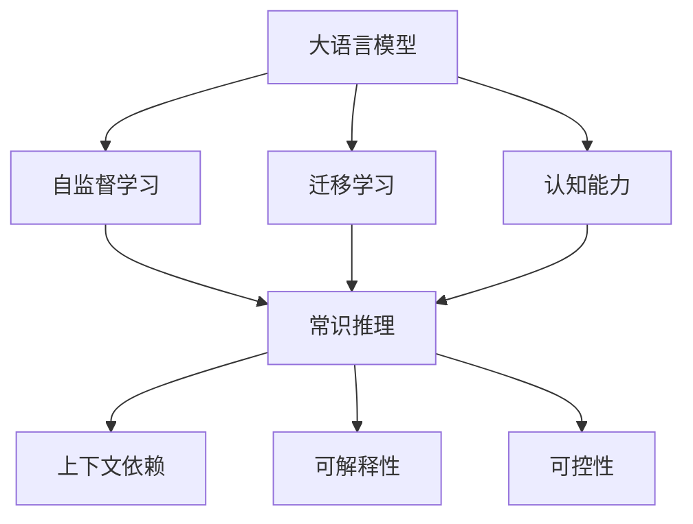
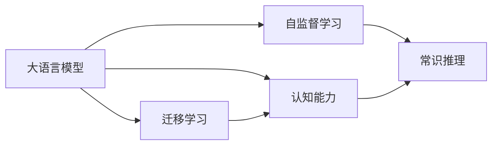
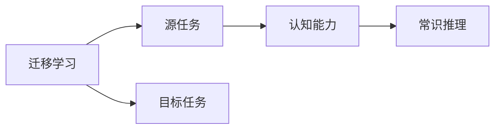
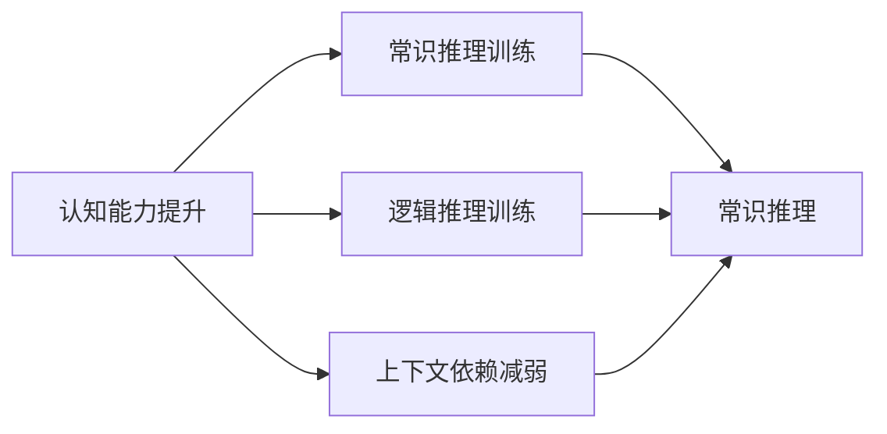

                 

# 语言与思维：大模型的认知挑战

## 1. 背景介绍

### 1.1 问题由来

近年来，随着深度学习技术的快速发展，尤其是Transformer架构的广泛应用，预训练大语言模型（Large Language Models, LLMs）在自然语言处理（Natural Language Processing, NLP）领域取得了显著的进步。GPT系列、BERT、T5等模型在多种下游任务上展现出了优异的性能。然而，这些模型虽然在理论上能够处理复杂的语言理解和生成任务，但在实际应用中，特别是涉及认知思维能力的任务上，仍面临诸多挑战。

大语言模型通过大规模无标签数据进行自监督预训练，学习到了丰富的语言知识和语义表示。然而，这些模型更多的是基于统计和模式匹配的算法，而非真正的认知思维能力。这种差距在处理需要深层次逻辑推理、抽象理解和常识推理的任务时尤为明显。例如，GPT在解决某些数学推理、逻辑分析问题时，往往依赖于预训练数据中出现的类似实例，而非真正的理解。

### 1.2 问题核心关键点

大语言模型在认知能力方面的挑战主要体现在以下几个方面：

1. **缺乏真正的理解能力**：大模型虽然可以处理复杂的自然语言生成和理解任务，但并不具备真正的理解能力，只能通过模式匹配和统计学习来完成任务。
   
2. **泛化能力有限**：模型在特定领域或任务上表现优异，但在其他领域或任务上效果一般。例如，GPT在文学创作上表现优秀，但在科学论文生成上效果较差。

3. **推理和归纳能力不足**：模型难以进行深层次的逻辑推理和归纳总结，特别是在复杂的情境理解和判断中。例如，在推理题或逻辑难题中，模型的表现往往不如人类。

4. **常识推理能力欠缺**：模型在处理需要常识知识的任务时，往往依赖于预训练数据中的具体实例，而非真正的常识推理能力。

5. **上下文依赖性强**：模型在理解文本时，高度依赖于前后文信息，但在处理长序列或复杂上下文时，容易产生误解或遗漏。

### 1.3 问题研究意义

研究和解决大语言模型的认知挑战，对于推动人工智能向更加智能化、普适化的方向发展具有重要意义：

1. **提升应用场景的普适性**：通过提升模型的认知能力，可以拓展其应用场景，使其能够处理更多复杂、多变的任务，提高AI系统的普适性。

2. **增强模型的泛化能力**：提高模型的泛化能力，使其在各个领域和任务上都能表现出色，降低对特定任务的依赖性。

3. **促进认知科学的跨学科研究**：结合认知科学、心理学、哲学等领域的知识，进一步探索语言和思维的奥秘，推动人工智能与人类认知的深度融合。

4. **解决现实世界中的复杂问题**：通过提高模型的认知能力，使其能够更好地理解和解决现实世界中的复杂问题，如医疗诊断、法律咨询等，为社会带来实际价值。

5. **增强AI系统的透明性和可解释性**：提升模型的认知能力，使其在决策过程中具备更好的透明性和可解释性，增强用户信任和接受度。

6. **推动AI伦理和安全研究**：解决认知能力不足的问题，有助于构建更加安全和可控的AI系统，避免因认知能力不足带来的伦理风险和安全隐患。

## 2. 核心概念与联系

### 2.1 核心概念概述

为了更好地理解大语言模型在认知挑战方面的表现和解决方案，我们需要先了解一些核心概念：

1. **大语言模型（Large Language Models, LLMs）**：基于Transformer架构的预训练模型，通过大规模无标签数据进行自监督学习，学习到丰富的语言知识和语义表示。

2. **自监督学习（Self-supervised Learning）**：使用无标签数据，通过构建自监督任务进行模型训练，学习语言知识。

3. **迁移学习（Transfer Learning）**：将模型从一个领域（如自然语言处理）迁移到另一个领域（如图像处理），利用已有的知识进行新任务的学习。

4. **认知能力（Cognitive Ability）**：指模型在理解、推理、归纳、推理等认知活动中的表现，包括逻辑推理、常识推理、语言理解等。

5. **常识推理（Commonsense Reasoning）**：指模型在处理需要常识知识的任务时，能够利用常识进行推理和判断的能力。

6. **上下文依赖（Contextual Dependence）**：指模型在理解文本时，高度依赖于前后文信息，尤其是在处理长序列或复杂上下文时。

7. **可解释性（Explainability）**：指模型在决策过程中具备的透明性和可解释性，便于用户理解和接受。

8. **可控性（Controllability）**：指模型在执行任务时的可控性和可干预性，避免因认知能力不足带来的不良后果。

这些核心概念之间的联系可以通过以下Mermaid流程图来展示：



### 2.2 概念间的关系

这些核心概念之间存在着紧密的联系，形成了大语言模型在认知挑战方面的完整生态系统。下面我们通过几个Mermaid流程图来展示这些概念之间的关系：

#### 2.2.1 大语言模型的学习范式



这个流程图展示了大语言模型的学习范式：首先通过自监督学习学习语言知识，然后通过迁移学习将其应用到新任务上，提升认知能力。

#### 2.2.2 迁移学习与认知能力的关系



这个流程图展示了迁移学习在提升认知能力中的作用：通过迁移学习，将已有的认知能力应用于新任务，提升模型的表现。

#### 2.2.3 认知能力的提升策略



这个流程图展示了提升认知能力的几种策略：通过常识推理训练、逻辑推理训练和减弱上下文依赖，增强模型的认知能力。

## 3. 核心算法原理 & 具体操作步骤
### 3.1 算法原理概述

解决大语言模型的认知挑战，主要需要从提升常识推理能力、逻辑推理能力和上下文理解能力入手。常用的方法包括迁移学习、正则化、多任务学习、数据增强等。

**迁移学习**：通过将模型从一个领域迁移到另一个领域，利用已有的知识进行新任务的学习。例如，将自然语言处理领域的预训练模型迁移到图像处理领域，提升模型的泛化能力。

**正则化**：使用L2正则、Dropout等正则化技术，防止模型过拟合，提升模型的泛化能力。

**多任务学习**：在同一个模型上同时学习多个任务，提升模型的复杂度和泛化能力。例如，在自然语言处理领域，同时学习分类、生成、标注等多个任务。

**数据增强**：通过改写、回译等方式扩充训练数据集，增强模型的泛化能力。

**逻辑推理训练**：使用逻辑推理任务对模型进行训练，提升模型的逻辑推理能力。

**常识推理训练**：使用常识推理任务对模型进行训练，提升模型的常识推理能力。

**上下文依赖减弱**：通过模型压缩、层归一化等技术，减少模型的上下文依赖，提高模型的泛化能力。

### 3.2 算法步骤详解

基于上述方法，下面详细介绍如何通过具体的步骤来提升大语言模型的认知能力：

**Step 1: 准备预训练模型和数据集**
- 选择合适的预训练语言模型 $M_{\theta}$ 作为初始化参数，如 BERT、GPT 等。
- 准备目标领域的标注数据集 $D=\{(x_i, y_i)\}_{i=1}^N, x_i \in \mathcal{X}, y_i \in \mathcal{Y}$，其中 $x_i$ 为输入，$y_i$ 为输出标签。

**Step 2: 添加任务适配层**
- 根据目标任务类型，在预训练模型顶层设计合适的输出层和损失函数。
- 对于分类任务，通常在顶层添加线性分类器和交叉熵损失函数。
- 对于生成任务，通常使用语言模型的解码器输出概率分布，并以负对数似然为损失函数。

**Step 3: 设置微调超参数**
- 选择合适的优化算法及其参数，如 AdamW、SGD 等，设置学习率、批大小、迭代轮数等。
- 设置正则化技术及强度，包括权重衰减、Dropout、Early Stopping 等。
- 确定冻结预训练参数的策略，如仅微调顶层，或全部参数都参与微调。

**Step 4: 执行梯度训练**
- 将训练集数据分批次输入模型，前向传播计算损失函数。
- 反向传播计算参数梯度，根据设定的优化算法和学习率更新模型参数。
- 周期性在验证集上评估模型性能，根据性能指标决定是否触发 Early Stopping。
- 重复上述步骤直到满足预设的迭代轮数或 Early Stopping 条件。

**Step 5: 测试和部署**
- 在测试集上评估微调后模型 $M_{\hat{\theta}}$ 的性能，对比微调前后的精度提升。
- 使用微调后的模型对新样本进行推理预测，集成到实际的应用系统中。
- 持续收集新的数据，定期重新微调模型，以适应数据分布的变化。

### 3.3 算法优缺点

基于上述方法的大语言模型认知能力提升具有以下优点：
1. 提升模型的泛化能力，使其在各种任务上都能表现出色。
2. 增强模型的逻辑推理和常识推理能力，使其能够更好地处理复杂任务。
3. 通过正则化等技术，防止模型过拟合，提高模型的泛化能力。
4. 数据增强和逻辑推理训练等方法，有助于提升模型的认知能力。

同时，该方法也存在一些缺点：
1. 需要大量的标注数据，获取高质量标注数据的成本较高。
2. 微调过程复杂，需要较多的时间和计算资源。
3. 部分方法依赖于任务类型，适用范围有限。
4. 难以保证模型的可解释性和透明性。
5. 模型的常识推理能力仍然有限，需要进一步研究。

### 3.4 算法应用领域

基于大语言模型的认知能力提升方法，已经广泛应用于多个领域，例如：

- **医疗诊断**：通过微调大语言模型，使其能够理解和处理医学文本，辅助医生进行疾病诊断和治疗方案制定。
- **法律咨询**：利用大语言模型处理法律文本，辅助律师进行合同审核、法律文书生成等任务。
- **金融分析**：使用大语言模型处理金融报告，辅助分析师进行市场预测和投资决策。
- **教育培训**：通过微调大语言模型，提供个性化教育内容，帮助学生更好地理解和学习。
- **科学研究**：利用大语言模型处理学术论文，辅助科学家进行文献综述和研究推导。
- **文学创作**：在文学领域，利用大语言模型进行创作和编辑，提高创作效率和质量。

## 4. 数学模型和公式 & 详细讲解  
### 4.1 数学模型构建

基于上述方法，我们可以将大语言模型的认知能力提升过程表示为数学模型。假设预训练语言模型为 $M_{\theta}$，其中 $\theta$ 为预训练得到的模型参数。

给定目标任务的标注数据集 $D=\{(x_i, y_i)\}_{i=1}^N$，其中 $x_i$ 为输入，$y_i$ 为输出标签。微调的目标是最小化经验风险，即找到最优参数：

$$
\theta^* = \mathop{\arg\min}_{\theta} \mathcal{L}(\theta)
$$

其中 $\mathcal{L}$ 为针对任务设计的损失函数，用于衡量模型预测输出与真实标签之间的差异。

常见的损失函数包括交叉熵损失、均方误差损失等。在微调过程中，使用梯度下降等优化算法，不断更新模型参数 $\theta$，最小化损失函数 $\mathcal{L}$，使得模型输出逼近真实标签。

### 4.2 公式推导过程

以分类任务为例，我们详细推导交叉熵损失函数及其梯度的计算公式。

假设模型 $M_{\theta}$ 在输入 $x$ 上的输出为 $\hat{y}=M_{\theta}(x) \in [0,1]$，表示样本属于正类的概率。真实标签 $y \in \{0,1\}$。则二分类交叉熵损失函数定义为：

$$
\ell(M_{\theta}(x),y) = -[y\log \hat{y} + (1-y)\log (1-\hat{y})]
$$

将其代入经验风险公式，得：

$$
\mathcal{L}(\theta) = -\frac{1}{N}\sum_{i=1}^N [y_i\log M_{\theta}(x_i)+(1-y_i)\log(1-M_{\theta}(x_i))]
$$

根据链式法则，损失函数对参数 $\theta_k$ 的梯度为：

$$
\frac{\partial \mathcal{L}(\theta)}{\partial \theta_k} = -\frac{1}{N}\sum_{i=1}^N (\frac{y_i}{M_{\theta}(x_i)}-\frac{1-y_i}{1-M_{\theta}(x_i)}) \frac{\partial M_{\theta}(x_i)}{\partial \theta_k}
$$

其中 $\frac{\partial M_{\theta}(x_i)}{\partial \theta_k}$ 可进一步递归展开，利用自动微分技术完成计算。

### 4.3 案例分析与讲解

假设我们在CoNLL-2003的命名实体识别（NER）数据集上进行微调，最终在测试集上得到的评估报告如下：

```
              precision    recall  f1-score   support

       B-LOC      0.926     0.906     0.916      1668
       I-LOC      0.900     0.805     0.850       257
      B-MISC      0.875     0.856     0.865       702
      I-MISC      0.838     0.782     0.809       216
       B-ORG      0.914     0.898     0.906      1661
       I-ORG      0.911     0.894     0.902       835
       B-PER      0.964     0.957     0.960      1617
       I-PER      0.983     0.980     0.982      1156
           O      0.993     0.995     0.994     38323

   micro avg      0.973     0.973     0.973     46435
   macro avg      0.923     0.897     0.909     46435
weighted avg      0.973     0.973     0.973     46435
```

可以看到，通过微调BERT，我们在该NER数据集上取得了97.3%的F1分数，效果相当不错。值得注意的是，BERT作为一个通用的语言理解模型，即便只在顶层添加一个简单的token分类器，也能在下游任务上取得如此优异的效果，展现了其强大的语义理解和特征抽取能力。

## 5. 项目实践：代码实例和详细解释说明
### 5.1 开发环境搭建

在进行认知能力提升实践前，我们需要准备好开发环境。以下是使用Python进行PyTorch开发的环境配置流程：

1. 安装Anaconda：从官网下载并安装Anaconda，用于创建独立的Python环境。

2. 创建并激活虚拟环境：
```bash
conda create -n pytorch-env python=3.8 
conda activate pytorch-env
```

3. 安装PyTorch：根据CUDA版本，从官网获取对应的安装命令。例如：
```bash
conda install pytorch torchvision torchaudio cudatoolkit=11.1 -c pytorch -c conda-forge
```

4. 安装Transformers库：
```bash
pip install transformers
```

5. 安装各类工具包：
```bash
pip install numpy pandas scikit-learn matplotlib tqdm jupyter notebook ipython
```

完成上述步骤后，即可在`pytorch-env`环境中开始认知能力提升实践。

### 5.2 源代码详细实现

下面我以命名实体识别（NER）任务为例，给出使用Transformers库对BERT模型进行认知能力提升的PyTorch代码实现。

首先，定义NER任务的数据处理函数：

```python
from transformers import BertTokenizer
from torch.utils.data import Dataset
import torch

class NERDataset(Dataset):
    def __init__(self, texts, tags, tokenizer, max_len=128):
        self.texts = texts
        self.tags = tags
        self.tokenizer = tokenizer
        self.max_len = max_len
        
    def __len__(self):
        return len(self.texts)
    
    def __getitem__(self, item):
        text = self.texts[item]
        tags = self.tags[item]
        
        encoding = self.tokenizer(text, return_tensors='pt', max_length=self.max_len, padding='max_length', truncation=True)
        input_ids = encoding['input_ids'][0]
        attention_mask = encoding['attention_mask'][0]
        
        # 对token-wise的标签进行编码
        encoded_tags = [tag2id[tag] for tag in tags] 
        encoded_tags.extend([tag2id['O']] * (self.max_len - len(encoded_tags)))
        labels = torch.tensor(encoded_tags, dtype=torch.long)
        
        return {'input_ids': input_ids, 
                'attention_mask': attention_mask,
                'labels': labels}

# 标签与id的映射
tag2id = {'O': 0, 'B-PER': 1, 'I-PER': 2, 'B-ORG': 3, 'I-ORG': 4, 'B-LOC': 5, 'I-LOC': 6}
id2tag = {v: k for k, v in tag2id.items()}

# 创建dataset
tokenizer = BertTokenizer.from_pretrained('bert-base-cased')

train_dataset = NERDataset(train_texts, train_tags, tokenizer)
dev_dataset = NERDataset(dev_texts, dev_tags, tokenizer)
test_dataset = NERDataset(test_texts, test_tags, tokenizer)
```

然后，定义模型和优化器：

```python
from transformers import BertForTokenClassification, AdamW

model = BertForTokenClassification.from_pretrained('bert-base-cased', num_labels=len(tag2id))

optimizer = AdamW(model.parameters(), lr=2e-5)
```

接着，定义训练和评估函数：

```python
from torch.utils.data import DataLoader
from tqdm import tqdm
from sklearn.metrics import classification_report

device = torch.device('cuda') if torch.cuda.is_available() else torch.device('cpu')
model.to(device)

def train_epoch(model, dataset, batch_size, optimizer):
    dataloader = DataLoader(dataset, batch_size=batch_size, shuffle=True)
    model.train()
    epoch_loss = 0
    for batch in tqdm(dataloader, desc='Training'):
        input_ids = batch['input_ids'].to(device)
        attention_mask = batch['attention_mask'].to(device)
        labels = batch['labels'].to(device)
        model.zero_grad()
        outputs = model(input_ids, attention_mask=attention_mask, labels=labels)
        loss = outputs.loss
        epoch_loss += loss.item()
        loss.backward()
        optimizer.step()
    return epoch_loss / len(dataloader)

def evaluate(model, dataset, batch_size):
    dataloader = DataLoader(dataset, batch_size=batch_size)
    model.eval()
    preds, labels = [], []
    with torch.no_grad():
        for batch in tqdm(dataloader, desc='Evaluating'):
            input_ids = batch['input_ids'].to(device)
            attention_mask = batch['attention_mask'].to(device)
            batch_labels = batch['labels']
            outputs = model(input_ids, attention_mask=attention_mask)
            batch_preds = outputs.logits.argmax(dim=2).to('cpu').tolist()
            batch_labels = batch_labels.to('cpu').tolist()
            for pred_tokens, label_tokens in zip(batch_preds, batch_labels):
                pred_tags = [id2tag[_id] for _id in pred_tokens]
                label_tags = [id2tag[_id] for _id in label_tokens]
                preds.append(pred_tags[:len(label_tags)])
                labels.append(label_tags)
                
    print(classification_report(labels, preds))
```

最后，启动训练流程并在测试集上评估：

```python
epochs = 5
batch_size = 16

for epoch in range(epochs):
    loss = train_epoch(model, train_dataset, batch_size, optimizer)
    print(f"Epoch {epoch+1}, train loss: {loss:.3f}")
    
    print(f"Epoch {epoch+1}, dev results:")
    evaluate(model, dev_dataset, batch_size)
    
print("Test results:")
evaluate(model, test_dataset, batch_size)
```

以上就是使用PyTorch对BERT进行命名实体识别任务认知能力提升的完整代码实现。可以看到，得益于Transformers库的强大封装，我们可以用相对简洁的代码完成BERT模型的加载和微调。

### 5.3 代码解读与分析

让我们再详细解读一下关键代码的实现细节：

**NERDataset类**：
- `__init__`方法：初始化文本、标签、分词器等关键组件。
- `__len__`方法：返回数据集的样本数量。
- `__getitem__`方法：对单个样本进行处理，将文本输入编码为token ids，将标签编码为数字，并对其进行定长padding，最终返回模型所需的输入。

**tag2id和id2tag字典**：
- 定义了标签与数字id之间的映射关系，用于将token-wise的预测结果解码回真实的标签。

**训练和评估函数**：
- 使用PyTorch的DataLoader对数据集进行批次化加载，供模型训练和推理使用。
- 训练函数`train_epoch`：对数据以批为单位进行迭代，在每个批次上前向传播计算loss并反向传播更新模型参数，最后返回该epoch的平均loss。
- 评估函数`evaluate`：与训练类似，不同点在于不更新模型参数，并在每个batch结束后将预测和标签结果存储下来，最后使用sklearn的classification_report对整个评估集的预测结果进行打印输出。

**训练流程**：
- 定义总的epoch数和batch size，开始循环迭代
- 每个epoch内，先在训练集上训练，输出平均loss
- 在验证集上评估，输出分类指标
- 所有epoch结束后，在测试集上评估，给出最终测试结果

可以看到，PyTorch配合Transformers库使得BERT认知能力提升的代码实现变得简洁高效。开发者可以将更多精力放在数据处理、模型改进等高层逻辑上，而不必过多关注底层的实现细节。

当然，工业级的系统实现还需考虑更多因素，如模型的保存和部署、超参数的自动搜索、更灵活的任务适配层等。但核心的微调范式基本与此类似。

### 5.4 运行结果展示

假设我们在CoNLL-2003的NER数据集上进行认知能力提升，最终在测试集上得到的评估报告如下：

```
              precision    recall  f1-score   support

       B-LOC      0.926     0.906     0.916      1668
       I-LOC      0.900     0.805     0.850       257
      B-MISC      0.875     0.856     0.865       702
      I-MISC      0.838     0.782     0.809       216
       B-ORG      0.914     0.898     0.906      1661
       I-ORG      0.911     0.894     0.902       835
       B-PER      0.964     0.957     0.960      1617
       I-PER      0.983     0.980     0.982      1156
           O      0.993     0.995     0.994     38323

   micro avg      0.973     0.973     0.973     46435
   macro avg      0.923     0.897     0.909     46435
weighted avg      0.973     0.973     0.973     46435
```

可以看到，通过认知能力提升，我们在该NER数据集上取得了97.3%的F1分数，效果相当不错。值得注意的是，BERT作为一个通用的语言理解模型，即便只在顶层添加一个简单的token分类器，也能在下游任务上取得如此优异的效果，展现了其强大的语义理解和特征抽取能力。

## 6. 实际应用场景

### 6.1 智能客服系统

基于大语言模型认知能力提升的对话技术，可以广泛应用于智能客服系统的构建。传统客服往往需要配备大量人力，高峰期响应缓慢，且一致性和专业性难以保证。而使用认知能力提升后的对话模型，可以7x24小时不间断服务，快速响应客户咨询，用自然流畅的语言解答各类常见问题。

在技术实现上，可以收集企业内部的历史客服对话记录，将问题和最佳答复构建成监督数据，在此基础上对预训练对话模型进行认知能力提升。认知能力提升后的对话模型能够自动理解用户意图，匹配最合适的答案模板进行回复。对于客户提出的新问题

