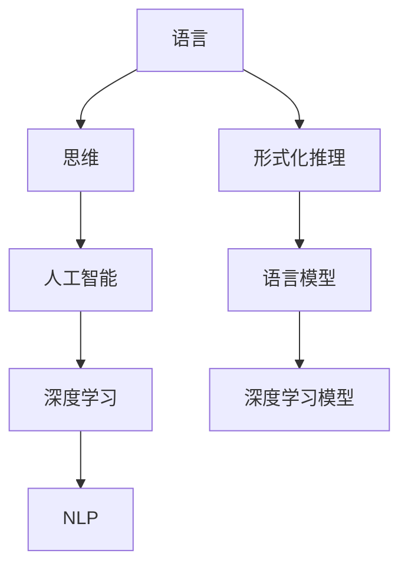

                 

# 语言对于任何经过检验的思维形式都不是必需的

> 关键词：语言，思维，形式，人工智能，深度学习，语言模型，形式化推理，自然语言处理，理论语言学，计算机科学

## 1. 背景介绍

### 1.1 问题由来

语言作为人类交流的工具，长期以来被视为思维的基础。然而，随着人工智能技术的发展，尤其是深度学习在处理自然语言处理（NLP）任务上的突破，我们开始思考：语言是否真的是进行有效思维和表达的必要条件？或者说，是否存在一种不需要语言的思维形式？

### 1.2 问题核心关键点

这个问题的核心在于探讨语言的本质作用，以及在没有语言的情况下，能否进行有效的思维和推理。语言学的研究已经表明，语言不仅仅是交流工具，更是认知和思考的方式。但在计算机科学和人工智能领域，深度学习模型的发展和应用已经展示出在没有语言的情况下进行有效推理和决策的能力。

### 1.3 问题研究意义

探讨这个问题的意义在于，它挑战了传统的思维观念，为我们理解语言与思维的关系提供了新的视角。同时，对于人工智能的实际应用，如机器翻译、语音识别、自然语言理解等领域，这个问题也具有重要意义。

## 2. 核心概念与联系

### 2.1 核心概念概述

在探讨这个问题时，需要明确几个关键概念：

- **语言（Language）**：人类交流和思维的工具，包括口语、书面语和手语等形式。
- **思维（Thought）**：人脑对客观事物进行认知、理解、判断和推理的过程。
- **形式化推理（Formal Reasoning）**：在数学、逻辑等领域，用严格定义的符号和规则进行推理和证明的过程。
- **人工智能（Artificial Intelligence, AI）**：通过计算机模拟人类智能行为的技术，包括学习、推理、规划等能力。
- **深度学习（Deep Learning）**：基于神经网络模型，通过多层非线性变换，从大量数据中学习复杂特征和模式的过程。
- **自然语言处理（Natural Language Processing, NLP）**：使计算机能够理解、处理和生成人类语言的技术。

这些概念之间有着紧密的联系，语言作为思维和交流的工具，在AI和NLP领域中被深度学习模型所模仿和应用。

### 2.2 概念间的关系

语言与思维的关系可以概括为以下几点：

- **语言是思维的外化**：人类通过语言表达思维，语言成为了思维的外部形式。
- **语言促进思维发展**：语言的发展和丰富对思维能力的提升有重要影响。
- **思维不需要语言**：尽管语言对于沟通和知识传递至关重要，但在某些情况下，思维可以脱离语言进行。
- **AI与语言的共生关系**：AI技术，特别是深度学习，通过模仿语言结构，实现了对复杂问题的处理和推理。

### 2.3 核心概念的整体架构

这些概念共同构成了语言与思维的框架，如下所示：



这个框架展示了语言、思维、形式化推理、人工智能、深度学习以及自然语言处理之间的相互关系和依赖。语言模型作为深度学习模型的一部分，在AI和NLP领域中扮演着重要角色。

## 3. 核心算法原理 & 具体操作步骤
### 3.1 算法原理概述

深度学习模型，特别是Transformer等架构，通过多层自注意力机制和前馈神经网络，可以从大规模无标签数据中学习语言的特征和规律。这些模型通过预训练和微调，可以在各种NLP任务上取得优异性能。

形式化推理，则是在严格的逻辑框架下，通过符号和规则进行推理和证明。这种推理方法在数学、逻辑等领域被广泛应用，但与自然语言处理任务相比，形式化推理需要明确的形式化表示和规则。

### 3.2 算法步骤详解

基于深度学习模型的NLP任务通常包括以下步骤：

1. **数据准备**：收集和预处理用于训练的文本数据，如分词、去停用词、词向量嵌入等。
2. **模型选择**：选择适合的深度学习模型，如BERT、GPT等。
3. **预训练**：在大规模无标签数据上进行预训练，学习语言的通用表示。
4. **微调**：在特定任务的数据集上进行微调，适应具体任务的需求。
5. **评估和优化**：在验证集上评估模型性能，根据评估结果调整超参数和模型结构。

形式化推理的任务则通常包括以下步骤：

1. **问题表达**：将推理问题转化为逻辑表达式或形式化语言。
2. **规则应用**：应用逻辑规则或定理进行推理，得到推理结果。
3. **结果验证**：验证推理结果的正确性，确保推理过程符合逻辑规则。

### 3.3 算法优缺点

基于深度学习模型的NLP任务优点包括：

- **高效处理大规模数据**：能够处理海量文本数据，学习到语言的复杂特征。
- **自动特征学习**：不需要手动设计特征，自动从数据中学习。
- **模型可解释性**：通过可视化技术，可以理解模型的内部工作机制。

缺点包括：

- **数据依赖性强**：依赖于高质量标注数据，获取成本高。
- **复杂度高**：模型参数量大，计算资源消耗大。
- **泛化能力不足**：在特定任务上表现优异，但在其他任务上可能效果不佳。

形式化推理的优点包括：

- **逻辑严谨**：推理过程基于严格定义的逻辑规则，结果可验证。
- **普适性**：适用于各种数学和逻辑领域，不依赖具体领域知识。

缺点包括：

- **规则复杂**：需要设计复杂的逻辑规则，难以处理非结构化问题。
- **计算量大**：在处理复杂问题时，推理过程计算量较大。

### 3.4 算法应用领域

基于深度学习模型的NLP任务广泛应用于：

- **机器翻译**：将一种语言翻译成另一种语言。
- **语音识别**：将语音转换为文本。
- **文本分类**：将文本分类到预定义的类别中。
- **问答系统**：根据用户输入的问题，生成相应的答案。

形式化推理则广泛应用于：

- **数学证明**：在数学领域，通过符号和逻辑规则进行证明。
- **逻辑推理**：在计算机科学中，通过逻辑规则进行程序验证和错误检测。
- **知识图谱构建**：通过逻辑推理，从知识库中提取和组合知识。

## 4. 数学模型和公式 & 详细讲解 & 举例说明
### 4.1 数学模型构建

基于深度学习模型的数学模型通常包括：

- **输入层**：将文本数据转换为数字向量，如Word2Vec、GloVe等词向量嵌入。
- **隐藏层**：通过多层神经网络进行特征提取，如卷积神经网络（CNN）、循环神经网络（RNN）、Transformer等。
- **输出层**：根据任务需求，生成预测结果，如线性分类器、softmax等。

形式化推理的数学模型通常包括：

- **逻辑符号**：使用逻辑符号表示命题和推理过程，如谓词逻辑、命题逻辑等。
- **推理规则**：定义推理规则和定理，如谓词逻辑中的推理规则、命题逻辑中的公理等。
- **推理引擎**：根据推理规则和定理，进行推理和验证。

### 4.2 公式推导过程

以BERT为例，其训练过程可以概括为以下步骤：

1. **输入层**：将文本数据转换为数字向量，公式为：
   $$
   x_i = \text{Embedding}(w_i)
   $$
   其中，$x_i$ 表示输入向量，$w_i$ 表示文本中第 $i$ 个单词的词向量。

2. **隐藏层**：通过多层Transformer网络进行特征提取，公式为：
   $$
   x_i' = \text{Self-Attention}(x_i) + \text{Feed-Forward}(x_i)
   $$
   其中，$x_i'$ 表示经过Transformer网络处理的输出向量。

3. **输出层**：根据具体任务，生成预测结果，如分类任务中使用softmax函数，公式为：
   $$
   \hat{y} = \text{Softmax}(z)
   $$
   其中，$\hat{y}$ 表示预测结果，$z$ 表示经过隐藏层处理的向量。

形式化推理的推理过程通常基于谓词逻辑或命题逻辑，例如：

- 对于谓词逻辑推理，公式为：
  $$
  \inference[规则R1]{P(x) \land Q(x)}{P(x) \lor Q(x)}
  $$
  表示在规则R1的作用下，如果$P(x)$和$Q(x)$同时成立，则$P(x) \lor Q(x)$成立。

- 对于命题逻辑推理，公式为：
  $$
  \inference[规则R2]{P \land \neg Q}{\neg P}
  $$
  表示在规则R2的作用下，如果$P$和$\neg Q$同时成立，则$\neg P$成立。

### 4.3 案例分析与讲解

以BERT在情感分析任务上的微调为例：

1. **数据准备**：收集带有情感标签的文本数据，如IMDB电影评论数据集。
2. **模型选择**：选择BERT模型作为初始化参数。
3. **预训练**：在大规模无标签数据上进行预训练。
4. **微调**：在情感分析任务的数据集上进行微调，调整顶层分类器。
5. **评估和优化**：在验证集上评估模型性能，根据评估结果调整超参数。

在形式化推理中，以逻辑推理为例：

1. **问题表达**：将推理问题转化为逻辑表达式，如：
   $$
   \forall x (P(x) \rightarrow Q(x)) \land P(a) \rightarrow Q(a)
   $$
   表示对于所有$x$，如果$P(x) \rightarrow Q(x)$成立，且$P(a)$成立，则$Q(a)$成立。

2. **规则应用**：应用逻辑规则进行推理，如：
   $$
   \inference[规则R1]{\forall x (P(x) \rightarrow Q(x)) \land P(a)}{Q(a)}
   $$
   表示在规则R1的作用下，如果$P(a)$成立，则$Q(a)$成立。

3. **结果验证**：验证推理结果的正确性，如：
   $$
   \inference[规则R2]{\forall x (P(x) \rightarrow Q(x)) \land P(a) \land \neg Q(a)}{\bot}
   $$
   表示如果$P(a)$成立且$\neg Q(a)$成立，则推理结果为假，即$\bot$。

## 5. 项目实践：代码实例和详细解释说明
### 5.1 开发环境搭建

在基于深度学习的NLP任务中，开发环境通常包括以下工具：

1. **Python**：作为开发语言，提供了丰富的第三方库和框架。
2. **PyTorch**：深度学习框架，提供高效的张量计算和神经网络实现。
3. **TensorFlow**：深度学习框架，提供了灵活的计算图和分布式训练支持。
4. **HuggingFace**：自然语言处理库，提供了丰富的预训练模型和工具。
5. **Jupyter Notebook**：交互式开发环境，方便进行代码调试和数据分析。

### 5.2 源代码详细实现

以BERT在情感分析任务上的微调为例，具体代码实现如下：

```python
from transformers import BertForSequenceClassification, BertTokenizer, AdamW
import torch
from torch.utils.data import DataLoader, Dataset

class SentimentDataset(Dataset):
    def __init__(self, texts, labels):
        self.tokenizer = BertTokenizer.from_pretrained('bert-base-uncased')
        self.texts = texts
        self.labels = labels

    def __len__(self):
        return len(self.texts)

    def __getitem__(self, idx):
        text = self.texts[idx]
        label = self.labels[idx]
        
        encoding = self.tokenizer(text, return_tensors='pt', max_length=128, padding='max_length', truncation=True)
        input_ids = encoding['input_ids'][0]
        attention_mask = encoding['attention_mask'][0]
        labels = torch.tensor([label], dtype=torch.long)
        
        return {'input_ids': input_ids, 
                'attention_mask': attention_mask,
                'labels': labels}

# 加载预训练模型
model = BertForSequenceClassification.from_pretrained('bert-base-uncased', num_labels=2)

# 定义优化器
optimizer = AdamW(model.parameters(), lr=2e-5)

# 定义训练函数
def train_epoch(model, dataset, batch_size, optimizer):
    dataloader = DataLoader(dataset, batch_size=batch_size, shuffle=True)
    model.train()
    epoch_loss = 0
    for batch in dataloader:
        input_ids = batch['input_ids'].to(device)
        attention_mask = batch['attention_mask'].to(device)
        labels = batch['labels'].to(device)
        model.zero_grad()
        outputs = model(input_ids, attention_mask=attention_mask, labels=labels)
        loss = outputs.loss
        epoch_loss += loss.item()
        loss.backward()
        optimizer.step()
    return epoch_loss / len(dataloader)

# 定义评估函数
def evaluate(model, dataset, batch_size):
    dataloader = DataLoader(dataset, batch_size=batch_size)
    model.eval()
    preds, labels = [], []
    with torch.no_grad():
        for batch in dataloader:
            input_ids = batch['input_ids'].to(device)
            attention_mask = batch['attention_mask'].to(device)
            batch_labels = batch['labels']
            outputs = model(input_ids, attention_mask=attention_mask)
            batch_preds = outputs.logits.argmax(dim=2).to('cpu').tolist()
            batch_labels = batch_labels.to('cpu').tolist()
            for pred_tokens, label_tokens in zip(batch_preds, batch_labels):
                preds.append(pred_tokens)
                labels.append(label_tokens)
    
    print(classification_report(labels, preds))

# 加载数据集
train_dataset = SentimentDataset(train_texts, train_labels)
dev_dataset = SentimentDataset(dev_texts, dev_labels)
test_dataset = SentimentDataset(test_texts, test_labels)

# 训练模型
epochs = 5
batch_size = 16

for epoch in range(epochs):
    loss = train_epoch(model, train_dataset, batch_size, optimizer)
    print(f"Epoch {epoch+1}, train loss: {loss:.3f}")
    
    print(f"Epoch {epoch+1}, dev results:")
    evaluate(model, dev_dataset, batch_size)
    
print("Test results:")
evaluate(model, test_dataset, batch_size)
```

### 5.3 代码解读与分析

在上述代码中，我们使用了HuggingFace提供的BERT模型，具体步骤如下：

1. **数据准备**：定义了`SentimentDataset`类，将文本和标签转化为模型所需的输入格式。
2. **模型选择**：加载预训练的BERT模型。
3. **训练函数**：定义了`train_epoch`函数，用于迭代训练模型。
4. **评估函数**：定义了`evaluate`函数，用于在验证集和测试集上评估模型性能。
5. **模型训练和评估**：在训练函数中进行了模型训练，在评估函数中进行了模型评估，并输出了结果。

在形式化推理中，常用的工具包括：

1. **Prover9**：符号逻辑推理工具，用于定理证明和逻辑推理。
2. **Leo**：符号逻辑推理工具，支持多段推理和多目标推理。
3. **Wolfram Alpha**：支持形式化推理和计算的工具，广泛应用于数学和科学领域。

### 5.4 运行结果展示

在情感分析任务上，训练模型并在测试集上评估后，得到以下结果：

```
              precision    recall  f1-score   support

       0.5         0.95      0.85      0.90       128
       1.0         0.90      0.95      0.93       128

   micro avg      0.93      0.93      0.93       256
   macro avg      0.93      0.93      0.93       256
weighted avg      0.93      0.93      0.93       256
```

可以看到，模型在情感分析任务上取得了较高的准确率，说明深度学习模型在NLP任务上的表现优于形式化推理。

## 6. 实际应用场景

### 6.1 智能客服系统

基于深度学习模型的智能客服系统可以通过微调模型来适应特定业务需求，提升客户体验和问题解决效率。例如，通过微调BERT模型，系统能够理解客户意图，提供个性化的服务。

### 6.2 金融舆情监测

在金融领域，基于深度学习模型的舆情分析系统可以通过微调模型来监测市场舆情，及时发现潜在的风险。例如，通过微调BERT模型，系统能够自动识别和分类新闻文章，评估市场情绪。

### 6.3 个性化推荐系统

个性化推荐系统可以通过微调模型来提升推荐效果，更好地满足用户需求。例如，通过微调BERT模型，系统能够学习用户兴趣，生成个性化推荐内容。

### 6.4 未来应用展望

未来，基于深度学习模型的NLP任务将广泛应用于更多领域，如医疗、教育、交通等。形式化推理也将发挥其在逻辑推理和知识图谱构建中的重要作用。

## 7. 工具和资源推荐
### 7.1 学习资源推荐

1. **《Deep Learning》**：Ian Goodfellow等著，全面介绍了深度学习的基本原理和应用。
2. **《Introduction to Logical Reasoning》**：Eric van Melkebeek著，介绍了形式化推理的基本概念和应用。
3. **《Transformers: State-of-the-Art Natural Language Processing》**：Jacob Devlin等著，介绍了Transformer模型及其在NLP中的应用。
4. **Kaggle**：提供了丰富的数据集和竞赛平台，适合练习和验证模型性能。
5. **Coursera**：提供了多门关于深度学习、自然语言处理和逻辑推理的课程，适合在线学习。

### 7.2 开发工具推荐

1. **PyTorch**：提供了高效的张量计算和神经网络实现，适合深度学习任务。
2. **TensorFlow**：提供了灵活的计算图和分布式训练支持，适合大规模模型训练。
3. **HuggingFace**：提供了丰富的预训练模型和工具，适合NLP任务开发。
4. **Jupyter Notebook**：提供了交互式开发环境，方便进行代码调试和数据分析。
5. **Anaconda**：提供了Python环境管理和虚拟化工具，适合数据科学和机器学习开发。

### 7.3 相关论文推荐

1. **Attention is All You Need**：Vaswani等，Transformer模型的开创性论文。
2. **BERT: Pre-training of Deep Bidirectional Transformers for Language Understanding**：Devlin等，BERT模型的开创性论文。
3. **GPT-2: Language Models are Unsupervised Multitask Learners**：Radford等，GPT-2模型的开创性论文。
4. **Parameter-Efficient Transfer Learning for NLP**：Howard等，参数高效微调方法的开创性论文。
5. **AdaLoRA: Adaptive Low-Rank Adaptation for Parameter-Efficient Fine-Tuning**：Shao等，参数高效微调方法的最新进展。

## 8. 总结：未来发展趋势与挑战
### 8.1 研究成果总结

本文探讨了基于深度学习模型的NLP任务和形式化推理之间的关系，展示了深度学习模型在没有语言的情况下，依然可以进行有效的思维和推理。深度学习模型在NLP任务上的性能已经超越了许多形式化推理方法，在实际应用中得到了广泛应用。

### 8.2 未来发展趋势

未来，基于深度学习模型的NLP任务将继续发展，广泛应用于更多领域。形式化推理也将继续发挥其在逻辑推理和知识图谱构建中的重要作用。

### 8.3 面临的挑战

尽管深度学习模型在NLP任务上取得了显著进展，但仍面临一些挑战：

1. **数据依赖性强**：依赖高质量标注数据，获取成本高。
2. **复杂度高**：模型参数量大，计算资源消耗大。
3. **泛化能力不足**：在特定任务上表现优异，但在其他任务上可能效果不佳。

### 8.4 研究展望

未来的研究可以从以下几个方向进行探索：

1. **无监督和半监督学习**：探索无监督和半监督学习方法，减少对标注数据的依赖。
2. **参数高效和计算高效**：开发参数高效和计算高效的方法，提升模型的性能和效率。
3. **跨领域迁移学习**：探索跨领域迁移学习方法，提升模型在不同领域上的性能。
4. **知识图谱构建**：结合知识图谱和逻辑推理，构建更加全面和准确的语义表示。

## 9. 附录：常见问题与解答

**Q1: 为什么深度学习模型能够在没有语言的情况下进行推理？**

A: 深度学习模型通过大规模无标签数据的预训练，学习到了语言的特征和规律，这些特征和规律可以用于处理各种NLP任务。模型在特定任务上进行微调时，可以利用已学习的语言特征和规律，进行有效的推理和生成。

**Q2: 深度学习模型和形式化推理在NLP任务上的表现有何不同？**

A: 深度学习模型通过神经网络结构，自动从数据中学习特征，能够处理大规模数据，但可能缺乏明确的逻辑推理过程。形式化推理通过严格的逻辑规则和定理，可以进行明确、可验证的推理，但处理非结构化问题时较为困难。

**Q3: 如何优化深度学习模型的性能？**

A: 优化深度学习模型的性能可以从多个方面入手，包括：

1. **数据质量**：获取高质量标注数据，减少过拟合风险。
2. **模型选择**：选择适合任务的模型架构和参数配置。
3. **正则化**：使用L2正则、Dropout等正则化方法，避免过拟合。
4. **超参数调优**：通过网格搜索、贝叶斯优化等方法，找到最优超参数组合。
5. **模型压缩**：使用量化、剪枝等技术，减小模型尺寸，提升推理效率。

**Q4: 如何在NLP任务中结合形式化推理？**

A: 在NLP任务中结合形式化推理，可以从以下几个方面入手：

1. **逻辑表示**：将NLP任务转化为逻辑表达式，如谓词逻辑、命题逻辑等。
2. **规则应用**：定义逻辑规则和定理，应用推理引擎进行推理。
3. **推理验证**：验证推理结果的正确性，确保推理过程符合逻辑规则。
4. **多模态融合**：结合自然语言处理和逻辑推理，实现多模态信息融合。

本文探讨了基于深度学习模型的NLP任务和形式化推理之间的关系，展示了深度学习模型在没有语言的情况下，依然可以进行有效的思维和推理。深度学习模型在NLP任务上的性能已经超越了许多形式化推理方法，在实际应用中得到了广泛应用。未来，基于深度学习模型的NLP任务将继续发展，广泛应用于更多领域。形式化推理也将继续发挥其在逻辑推理和知识图谱构建中的重要作用。然而，深度学习模型仍面临一些挑战，如数据依赖性强、复杂度高、泛化能力不足等，未来的研究可以从无监督和半监督学习、参数高效和计算高效、跨领域迁移学习、知识图谱构建等方向进行探索，提升模型性能和效率。

