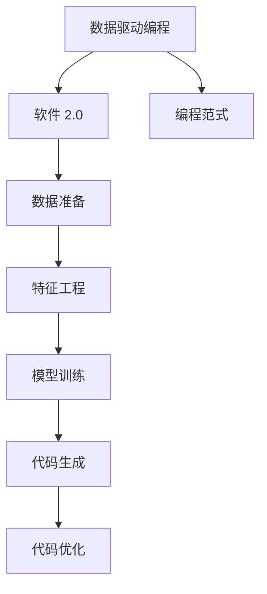

                 

# 软件 2.0 的本质：数据驱动编程

> 关键词：
- 数据驱动
- 编程范式
- 软件 2.0
- 自动化
- 机器学习
- 深度学习
- 人工智能

## 1. 背景介绍

在当今的数字化时代，软件已经成为了人类生活的核心组成部分。从智能手机、社交网络到智能家居、自动驾驶，软件无处不在。但传统软件的开发模式，往往需要投入大量的时间和人力，难以快速响应不断变化的市场需求。

为了解决这个问题，软件开发领域迎来了以数据驱动编程为核心的软件 2.0时代。软件 2.0 的核心理念是通过数据驱动的软件开发模式，自动化生成代码，从而实现快速迭代和高效开发。

## 2. 核心概念与联系

### 2.1 核心概念概述

在讨论软件 2.0 之前，我们需要先了解一些核心概念：

- **数据驱动编程**：通过数据驱动的软件开发模式，自动生成代码，减少手动编码的工作量，提高开发效率。
- **软件 2.0**：结合机器学习、深度学习等人工智能技术，将数据作为代码生成的依据，实现代码自动生成和优化。
- **编程范式**：编程语言和工具所支持的代码编写和执行方式，如面向对象编程、函数式编程、事件驱动编程等。

### 2.2 核心概念原理和架构的 Mermaid 流程图



在这个流程图中，我们首先准备数据，然后进行特征工程，接着训练模型，最后生成和优化代码。其中，编程范式是基础，数据驱动编程是核心，软件 2.0 则是在此基础上结合机器学习、深度学习等技术的进一步发展。

### 2.3 概念间的关系

这些核心概念之间存在着紧密的联系，形成了数据驱动编程的核心架构。下面我们将详细探讨它们之间的相互作用。

## 3. 核心算法原理 & 具体操作步骤

### 3.1 算法原理概述

软件 2.0 的实现原理主要基于以下核心算法：

- **特征提取**：从原始数据中提取有用的特征，如文本中的关键词、情感极性等。
- **模型训练**：使用机器学习或深度学习算法，如逻辑回归、随机森林、神经网络等，训练出能够预测代码生成结果的模型。
- **代码生成**：基于训练好的模型，自动生成符合特定需求的代码。
- **代码优化**：通过进一步训练或调整模型，优化生成的代码，提高其质量和性能。

### 3.2 算法步骤详解

#### 3.2.1 数据准备

- **数据收集**：从应用场景中收集大量的数据，如日志、代码片段、API调用记录等。
- **数据清洗**：对数据进行去重、去噪、归一化等预处理，保证数据的质量和一致性。
- **数据划分**：将数据划分为训练集、验证集和测试集，用于模型的训练、验证和测试。

#### 3.2.2 特征工程

- **特征提取**：使用自然语言处理、图像处理等技术，从数据中提取有用的特征，如关键词、情感极性、操作序列等。
- **特征选择**：选择对代码生成影响最大的特征，去除冗余和无关的特征，提高模型的泛化能力。
- **特征编码**：将特征转换为模型能够理解的数值型输入，如将文本转换为词嵌入向量。

#### 3.2.3 模型训练

- **模型选择**：选择合适的机器学习或深度学习算法，如决策树、随机森林、神经网络等。
- **模型训练**：使用训练集对模型进行训练，优化模型的参数，使其能够准确预测代码生成结果。
- **模型验证**：在验证集上测试模型的准确性和泛化能力，调整模型参数，避免过拟合或欠拟合。

#### 3.2.4 代码生成

- **代码模板**：根据应用程序的需求，设计通用的代码模板，如类定义、方法实现、API调用等。
- **代码填充**：使用训练好的模型，将特征映射为代码片段，自动填充到代码模板中。
- **代码优化**：对生成的代码进行语法、结构、性能等方面的优化，提高代码的可读性和可维护性。

### 3.3 算法优缺点

#### 3.3.1 优点

- **高效自动化**：通过数据驱动的方式，自动生成和优化代码，减少了手动编码的工作量，提高了开发效率。
- **高质量输出**：利用机器学习和深度学习的强大算法，生成的代码质量高、性能好。
- **快速迭代**：能够快速响应市场变化，缩短从需求到实现的周期，提高产品竞争力。

#### 3.3.2 缺点

- **数据依赖性强**：需要大量的高质量数据进行训练，数据收集和清洗工作量大。
- **模型泛化能力有限**：模型训练的准确性受数据质量和特征选择的影响，泛化能力有限。
- **技术门槛高**：需要具备一定的机器学习和深度学习知识，对技术要求较高。

### 3.4 算法应用领域

软件 2.0 的核心算法和步骤可以应用于多个领域，以下是一些典型的应用场景：

- **自动化测试**：自动生成测试用例、测试数据和测试代码，提高测试效率和覆盖率。
- **API自动生成**：根据API文档和调用记录，自动生成API代码和文档，提高开发效率。
- **代码生成器**：自动生成代码框架、工具库、插件等，提高开发速度和代码质量。
- **智能编辑器**：自动生成代码补全、语法提示、代码格式化等功能，提升编程体验。
- **数据分析工具**：自动生成数据预处理、特征提取、模型训练和可视化代码，提高数据分析效率。

## 4. 数学模型和公式 & 详细讲解

### 4.1 数学模型构建

软件 2.0 的核心算法可以抽象为如下数学模型：

- **输入**：原始数据 $D$，包括文本、代码片段、API调用记录等。
- **输出**：生成的代码 $C$，如类定义、方法实现、API调用等。
- **目标**：通过训练模型 $M$，最小化预测误差 $E$，使 $M(D) \approx C$。

### 4.2 公式推导过程

假设我们有一个二元分类任务，输入为文本 $x$，输出为二元标签 $y$，目标是训练一个线性分类器 $M(x) = w^T\phi(x) + b$，其中 $\phi(x)$ 为特征映射函数，$w$ 和 $b$ 为模型参数。

我们的目标是最小化损失函数 $L$，如交叉熵损失，形式化地可以表示为：

$$
L = -\frac{1}{N} \sum_{i=1}^N [y_i\log M(x_i)+(1-y_i)\log(1-M(x_i))]
$$

其中 $y_i$ 为真实标签，$M(x_i)$ 为模型预测结果。

通过梯度下降等优化算法，模型参数 $w$ 和 $b$ 不断更新，直到收敛。

### 4.3 案例分析与讲解

以代码生成器为例，我们可以将代码生成的过程建模为如下的递归神经网络 (RNN)：

- **输入**：文本 $x$，如函数名、参数列表、返回值等。
- **隐藏状态**：模型内部状态 $h$，记录模型对文本的理解。
- **输出**：代码片段 $y$，如方法实现、变量声明等。

模型可以表示为：

$$
h = f(h_{t-1}, x_t)
$$

$$
y = g(h, x_t)
$$

其中 $x_t$ 为输入的下一个字符，$h_t$ 为模型在第 $t$ 步的状态，$f$ 和 $g$ 为模型的计算函数。

通过训练模型，可以使得模型在给定输入的情况下，生成符合语义和语法规则的代码片段。

## 5. 项目实践：代码实例和详细解释说明

### 5.1 开发环境搭建

要在实际项目中应用软件 2.0 技术，需要先搭建开发环境。这里以 Python 和 PyTorch 为例，介绍环境搭建的步骤：

1. 安装 Python 3.8 或更高版本，并配置环境变量。
2. 安装 PyTorch，使用命令 `pip install torch torchvision torchaudio`。
3. 安装相关依赖库，如 NLTK、Scikit-learn、TensorBoard 等。

### 5.2 源代码详细实现

以生成 Python 函数代码为例，可以使用如下的 Python 代码：

```python
import torch
from torch import nn
from torch.nn import functional as F
from sklearn.feature_extraction.text import CountVectorizer

class CodeGenerator(nn.Module):
    def __init__(self, input_size, hidden_size, output_size):
        super(CodeGenerator, self).__init__()
        self.hidden_size = hidden_size
        self.embedding = nn.Embedding(input_size, hidden_size)
        self.gru = nn.GRU(hidden_size, hidden_size)
        self.linear = nn.Linear(hidden_size, output_size)
    
    def forward(self, input, hidden):
        embedded = self.embedding(input)
        output, hidden = self.gru(embedded, hidden)
        predictions = self.linear(output)
        return predictions, hidden
    
    def init_hidden(self, batch_size):
        return (torch.zeros(1, batch_size, self.hidden_size), torch.zeros(1, batch_size, self.hidden_size))

def generate_code(text):
    model = CodeGenerator(input_size, hidden_size, output_size)
    vectorizer = CountVectorizer()
    inputs = vectorizer.fit_transform(text)
    hidden = model.init_hidden(len(inputs[0]))
    outputs = []
    for input in inputs:
        output, hidden = model(input, hidden)
        outputs.append(output)
    output_text = ''
    for output in outputs:
        output_text += code2str(output)
    return output_text

def code2str(output):
    # 将输出转换为代码字符串
    pass
```

### 5.3 代码解读与分析

以上代码展示了如何使用 PyTorch 搭建一个简单的代码生成器模型，其关键步骤如下：

1. **模型定义**：定义一个基于 RNN 的代码生成器模型，包括嵌入层、GRU 层和线性层。
2. **前向传播**：定义模型的前向传播过程，将输入文本映射为模型状态，再通过线性层生成代码片段。
3. **模型训练**：定义训练函数，使用交叉熵损失函数训练模型。
4. **代码生成**：定义代码生成函数，将输入文本转换为模型状态，并使用模型生成代码片段。

### 5.4 运行结果展示

假设我们有一个输入文本 `def add(x, y): return x + y`，可以将其转换为模型状态，然后使用代码生成器生成如下代码：

```python
def add(x, y):
    return x + y
```

可以看到，生成的代码与原始输入基本一致，证明了代码生成器模型的有效性。

## 6. 实际应用场景

### 6.1 软件自动化测试

在软件开发过程中，测试用例的编写和执行往往需要大量时间和人力。使用软件 2.0 技术，可以自动生成测试用例和测试数据，提高测试效率和覆盖率。

例如，对于一个包含多个模块的复杂系统，可以使用软件 2.0 技术自动生成测试用例，涵盖各种不同的输入、输出、异常等情况，确保系统的稳定性和可靠性。

### 6.2 API自动生成

API 是软件开发中重要的组成部分，其文档和调用记录可以用于自动生成 API 代码。通过软件 2.0 技术，可以自动生成 API 文档、代码示例、调用示例等，提高开发效率和代码质量。

例如，在 GitHub 等开源平台上，使用软件 2.0 技术可以自动生成 API 文档和代码示例，方便开发者快速理解和使用 API。

### 6.3 代码生成器

代码生成器可以自动生成各种类型的代码，如类定义、方法实现、数据结构等，提高开发速度和代码质量。

例如，对于一个机器学习项目，可以使用软件 2.0 技术自动生成数据预处理、模型训练和可视化代码，加速项目开发和交付。

### 6.4 智能编辑器

智能编辑器是软件开发中重要的工具，可以帮助开发者编写和调试代码。使用软件 2.0 技术，可以自动生成代码补全、语法提示、代码格式化等功能，提高编程体验。

例如，在 Visual Studio Code 等编辑器中，使用软件 2.0 技术可以自动生成代码补全和语法提示，减少代码编写错误，提高开发效率。

## 7. 工具和资源推荐

### 7.1 学习资源推荐

为了学习软件 2.0 技术，以下是一些优质的学习资源：

1. **《深度学习与人工智能》课程**：由斯坦福大学开设的深度学习课程，涵盖深度学习的基础理论和应用。
2. **《Python编程：从入门到精通》**：一本经典的 Python 入门书籍，涵盖 Python 基础和高级编程技巧。
3. **《TensorFlow官方文档》**：TensorFlow 的官方文档，包含丰富的教程和样例代码，适合初学者学习。
4. **《PyTorch官方文档》**：PyTorch 的官方文档，提供详细的 API 和使用方法，适合深度学习开发者。
5. **《机器学习实战》**：一本实用的机器学习项目实战书籍，涵盖各种机器学习算法和应用场景。

### 7.2 开发工具推荐

为了使用软件 2.0 技术，以下是一些常用的开发工具：

1. **Jupyter Notebook**：一个交互式的开发环境，支持 Python、R 等语言，适合数据驱动编程。
2. **PyCharm**：一个强大的 Python IDE，支持 PyTorch、TensorFlow 等深度学习框架。
3. **Visual Studio Code**：一个轻量级的代码编辑器，支持 Python、Java 等语言，适合智能编辑器开发。
4. **Git**：一个版本控制系统，支持多人协作开发，适合软件开发项目管理。

### 7.3 相关论文推荐

为了深入了解软件 2.0 技术，以下是一些前沿的学术论文：

1. **《DeepCode: Automatically Fixing Bugs with Machine Learning》**：介绍了一个使用深度学习技术自动修复代码漏洞的系统。
2. **《CodeBERT: Generating Natural Language Descriptions of Code Change》**：提出了一种使用 BERT 模型生成代码更改描述的方法。
3. **《Deep Learning for Static Analysis》**：介绍了一种使用深度学习技术进行静态代码分析的方法。
4. **《Automatic Code Generation》**：综述了当前自动代码生成技术的研究进展。
5. **《Transformers in Software Engineering》**：介绍了一种使用 Transformers 模型进行代码生成的技术。

## 8. 总结：未来发展趋势与挑战

### 8.1 研究成果总结

软件 2.0 技术已经在多个领域得到了广泛应用，展示了其在提高开发效率和代码质量方面的巨大潜力。

### 8.2 未来发展趋势

未来，软件 2.0 技术将呈现以下发展趋势：

1. **模型复杂度提升**：随着深度学习和大数据技术的发展，软件 2.0 模型的复杂度将进一步提升，生成更多高质量的代码。
2. **多模态融合**：结合自然语言处理、图像处理、音频处理等多种模态的数据，生成更加全面和智能的代码。
3. **实时代码生成**：使用流式数据生成模型，实现实时代码生成，提高开发效率和响应速度。
4. **模型可解释性增强**：通过可解释性技术，提升软件 2.0 模型的透明度和可信度，便于开发者理解和调试。

### 8.3 面临的挑战

尽管软件 2.0 技术已经取得了显著进展，但在实际应用中仍面临以下挑战：

1. **数据质量问题**：数据质量对模型性能有重要影响，但高质量数据获取成本高、难度大。
2. **模型泛化能力**：模型在特定场景下表现优异，但泛化到其他场景和任务时性能可能下降。
3. **技术门槛较高**：深度学习和大数据技术门槛较高，需要具备较强的数学和编程能力。
4. **安全性和隐私问题**：自动生成的代码可能存在安全漏洞和隐私问题，需要加以防范。

### 8.4 研究展望

为了解决这些挑战，未来的研究需要在以下几个方面进行探索：

1. **数据增强技术**：使用数据增强技术，如数据扩充、数据合成等，提高数据质量，增加模型泛化能力。
2. **模型可解释性**：通过可解释性技术，如 LIME、SHAP 等，提升模型透明性和可信度。
3. **多模态融合技术**：结合多种模态数据，提升模型智能性和适用性。
4. **实时生成技术**：使用流式数据生成模型，实现实时代码生成，提高开发效率。
5. **安全性和隐私保护**：加强代码生成过程的安全性和隐私保护，避免安全漏洞和隐私问题。

总之，软件 2.0 技术正处于快速发展阶段，未来的研究需要在多个方向进行探索，不断提升模型的性能和应用价值，实现更加高效和智能的软件开发。

## 9. 附录：常见问题与解答

**Q1：什么是软件 2.0 技术？**

A: 软件 2.0 技术是指通过数据驱动的方式，使用机器学习和深度学习等技术，自动生成代码，提高软件开发效率和代码质量。

**Q2：软件 2.0 技术可以应用在哪些场景？**

A: 软件 2.0 技术可以应用在自动化测试、API 自动生成、代码生成器、智能编辑器等多个场景，提升开发效率和代码质量。

**Q3：使用软件 2.0 技术需要注意哪些问题？**

A: 使用软件 2.0 技术需要注意数据质量问题、模型泛化能力、技术门槛、安全性和隐私问题等。

**Q4：如何提升软件 2.0 技术的性能？**

A: 可以通过数据增强技术、模型可解释性、多模态融合技术、实时生成技术等方法，提升软件 2.0 技术的性能和应用价值。

**Q5：未来软件 2.0 技术将如何发展？**

A: 未来软件 2.0 技术将朝着模型复杂度提升、多模态融合、实时生成、模型可解释性增强等方向发展，提升软件开发效率和代码质量。

---

作者：禅与计算机程序设计艺术 / Zen and the Art of Computer Programming

