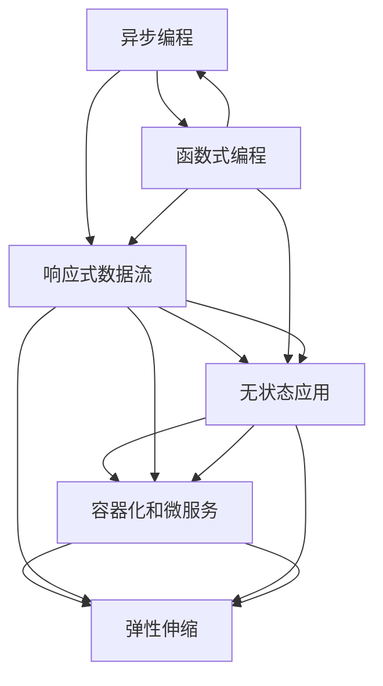
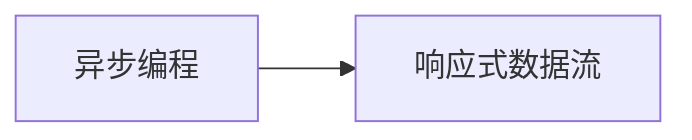
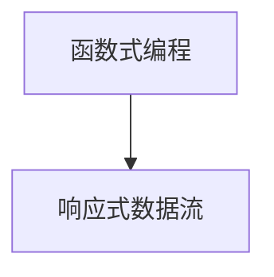
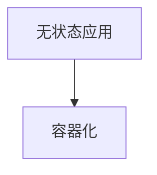
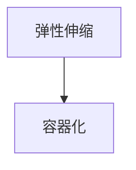

                 

# 软件2.0的反应式系统架构

> 关键词：软件2.0, 反应式系统, 异步编程, 函数式编程, 响应式数据流, 无状态应用, 容器化, 微服务, 弹性伸缩

## 1. 背景介绍

在过去的几十年里，软件工程经历了数次革命性变革，从面向过程的程序设计到面向对象的编程范式，再到近年来逐渐兴起的软件2.0。软件2.0是一个基于异步编程和函数式编程的新型编程范式，旨在通过无状态、响应式的数据流，提升软件的性能、可维护性和可扩展性。本文将详细探讨软件2.0的反应式系统架构，阐述其核心原理和实际应用，为开发者提供深度思考和实践指南。

### 1.1 问题由来

软件工程的发展历程中，软件系统日趋复杂，维护成本和扩展性逐渐成为技术难题。传统的面向过程和面向对象编程范式逐渐暴露出诸多问题：代码冗余、耦合度高、难以复用、难以测试、状态难以管理等。为了解决这些问题，开发人员开始探索新的编程范式，最终出现了函数式编程、异步编程、响应式编程等思想。

其中，异步编程和响应式编程是现代软件开发的核心技术之一。异步编程通过非阻塞I/O操作，提升了系统的响应能力和并发性能，而响应式编程通过流式数据处理，实现了对数据的实时处理和状态更新。软件2.0正是这些技术的融合，通过无状态应用、容器化、微服务、弹性伸缩等技术手段，构建出响应式、高效、可扩展的系统架构。

### 1.2 问题核心关键点

软件2.0的核心思想是通过异步和响应式的编程模型，构建出能够适应数据实时流动的系统。其关键点包括：

- 异步编程：通过非阻塞I/O操作和事件驱动模型，提升系统的响应能力和并发性能。
- 响应式数据流：通过事件驱动的流式数据处理，实现对数据的实时处理和状态更新。
- 无状态应用：通过分离数据状态和计算逻辑，提升系统的可伸缩性和可维护性。
- 容器化和微服务：通过容器化和微服务架构，提升系统的可部署性和可扩展性。
- 弹性伸缩：通过动态扩展计算资源，提升系统的可扩展性和应对突发流量的能力。

这些核心点共同构成了软件2.0的反应式系统架构，使得系统能够高效、可扩展、可维护，满足了现代软件系统对性能和可靠性的要求。

## 2. 核心概念与联系

### 2.1 核心概念概述

为了更好地理解软件2.0的反应式系统架构，本节将介绍几个密切相关的核心概念：

- 异步编程：通过非阻塞I/O操作和事件驱动模型，实现并发处理，提升系统响应能力和并发性能。
- 函数式编程：通过纯函数和不可变数据，提升代码的简洁性和可复用性。
- 响应式数据流：通过事件驱动的流式数据处理，实现对数据的实时处理和状态更新。
- 无状态应用：通过分离数据状态和计算逻辑，提升系统的可伸缩性和可维护性。
- 容器化和微服务：通过容器化和微服务架构，提升系统的可部署性和可扩展性。
- 弹性伸缩：通过动态扩展计算资源，提升系统的可扩展性和应对突发流量的能力。

这些核心概念之间存在着紧密的联系，形成了软件2.0的反应式系统架构。下面我们通过一个Mermaid流程图来展示这些概念之间的关系：



这个流程图展示了大语言模型的核心概念及其之间的关系：

1. 异步编程是基础，通过非阻塞I/O操作提升系统响应能力和并发性能。
2. 函数式编程通过纯函数和不可变数据，提升代码的简洁性和可复用性。
3. 响应式数据流通过事件驱动的流式数据处理，实现对数据的实时处理和状态更新。
4. 无状态应用通过分离数据状态和计算逻辑，提升系统的可伸缩性和可维护性。
5. 容器化和微服务通过容器化和微服务架构，提升系统的可部署性和可扩展性。
6. 弹性伸缩通过动态扩展计算资源，提升系统的可扩展性和应对突发流量的能力。

这些概念共同构成了软件2.0的反应式系统架构，使得系统能够高效、可扩展、可维护，满足了现代软件系统对性能和可靠性的要求。

### 2.2 概念间的关系

这些核心概念之间存在着紧密的联系，形成了软件2.0的反应式系统架构。下面我通过几个Mermaid流程图来展示这些概念之间的关系。

#### 2.2.1 异步编程与响应式数据流的关系



异步编程通过非阻塞I/O操作和事件驱动模型，实现了对数据的实时处理和状态更新。

#### 2.2.2 函数式编程与响应式数据流的关系



函数式编程通过纯函数和不可变数据，提升了代码的简洁性和可复用性，从而更好地支持响应式数据流的构建。

#### 2.2.3 无状态应用与容器化的关系



无状态应用通过分离数据状态和计算逻辑，提升了系统的可伸缩性和可维护性，从而更好地支持容器化的部署和扩展。

#### 2.2.4 弹性伸缩与容器化的关系



弹性伸缩通过动态扩展计算资源，提升了系统的可扩展性和应对突发流量的能力，从而更好地支持容器化的部署和扩展。

## 3. 核心算法原理 & 具体操作步骤
### 3.1 算法原理概述

软件2.0的反应式系统架构，基于异步编程和函数式编程的编程模型，通过无状态应用、容器化、微服务、弹性伸缩等技术手段，构建出响应式、高效、可扩展的系统架构。其核心算法原理包括：

- 异步编程：通过非阻塞I/O操作和事件驱动模型，提升系统的响应能力和并发性能。
- 函数式编程：通过纯函数和不可变数据，提升代码的简洁性和可复用性。
- 响应式数据流：通过事件驱动的流式数据处理，实现对数据的实时处理和状态更新。
- 无状态应用：通过分离数据状态和计算逻辑，提升系统的可伸缩性和可维护性。
- 容器化和微服务：通过容器化和微服务架构，提升系统的可部署性和可扩展性。
- 弹性伸缩：通过动态扩展计算资源，提升系统的可扩展性和应对突发流量的能力。

### 3.2 算法步骤详解

软件2.0的反应式系统架构构建步骤如下：

1. **异步编程实现**
   - 使用非阻塞I/O操作和事件驱动模型，提升系统响应能力和并发性能。
   - 使用异步编程框架（如Node.js、Actor模型）实现异步任务调度和管理。

2. **函数式编程应用**
   - 使用纯函数和不可变数据，提升代码的简洁性和可复用性。
   - 使用函数式编程框架（如Scala、Haskell）实现函数式编程模型。

3. **响应式数据流处理**
   - 使用事件驱动的流式数据处理，实现对数据的实时处理和状态更新。
   - 使用响应式编程框架（如RxJS、Akka Streams）实现响应式数据流处理。

4. **无状态应用设计**
   - 分离数据状态和计算逻辑，提升系统的可伸缩性和可维护性。
   - 设计无状态应用架构，避免数据状态共享和共享状态问题。

5. **容器化和微服务部署**
   - 使用容器化技术（如Docker、Kubernetes）实现应用的容器化部署。
   - 设计微服务架构，实现系统的可扩展性和可维护性。

6. **弹性伸缩实施**
   - 通过动态扩展计算资源，提升系统的可扩展性和应对突发流量的能力。
   - 使用弹性伸缩工具（如Kubernetes、Elastic Beanstalk）实现弹性伸缩策略。

### 3.3 算法优缺点

软件2.0的反应式系统架构具有以下优点：

- **响应能力强**：异步编程和非阻塞I/O操作提升了系统的响应能力，支持高并发的请求处理。
- **可伸缩性强**：无状态应用和容器化技术提升了系统的可伸缩性，支持动态扩展资源。
- **可维护性好**：函数式编程和响应式数据流处理提升了代码的简洁性和可复用性，便于维护和迭代。
- **容错性好**：容器化技术和微服务架构提升了系统的容错性和可用性，支持故障隔离和恢复。

同时，软件2.0的反应式系统架构也存在以下缺点：

- **开发复杂度高**：异步编程、函数式编程和响应式数据流处理的实现需要较高的开发门槛和技术栈。
- **学习曲线陡峭**：需要开发者掌握异步编程、函数式编程和响应式数据流处理的知识。
- **性能优化难度大**：需要开发者对异步编程和非阻塞I/O操作的性能优化有深入理解。

### 3.4 算法应用领域

软件2.0的反应式系统架构广泛应用于以下几个领域：

- **云计算**：使用容器化和微服务架构，支持云平台的应用部署和扩展。
- **大数据**：使用响应式数据流处理，实现对海量数据的实时处理和分析。
- **实时通信**：使用异步编程和非阻塞I/O操作，支持高并发的实时通信。
- **金融交易**：使用无状态应用和弹性伸缩技术，支持高频交易和高并发请求。
- **实时数据流处理**：使用异步编程和响应式数据流处理，支持实时数据流处理。

除了上述这些领域，软件2.0的反应式系统架构还可以应用于更多需要高并发、高可伸缩、高可维护性的应用场景，如物联网、智能制造、智慧城市等。

## 4. 数学模型和公式 & 详细讲解 & 举例说明

### 4.1 数学模型构建

软件2.0的反应式系统架构涉及多种编程模型和技术手段，其数学模型较为复杂。以下是几个核心模型的构建：

- **异步编程模型**
  - 使用非阻塞I/O操作，构建事件驱动的异步编程模型。
  
- **函数式编程模型**
  - 使用纯函数和不可变数据，构建函数式编程模型。

- **响应式数据流模型**
  - 使用事件驱动的流式数据处理，构建响应式数据流模型。

### 4.2 公式推导过程

以下是几个核心模型的公式推导过程：

#### 4.2.1 异步编程模型

异步编程模型基于非阻塞I/O操作，构建事件驱动的异步编程模型。以下是异步编程模型的公式推导过程：

$$
\begin{aligned}
\text{async\_callback}(x) &= \text{handle\_event}(x) \\
\text{handle\_event}(x) &= \text{do\_async}(\text{on\_event})
\end{aligned}
$$

其中，`async_callback`表示异步回调函数，`handle_event`表示事件处理函数，`do_async`表示异步执行函数。

#### 4.2.2 函数式编程模型

函数式编程模型基于纯函数和不可变数据，构建函数式编程模型。以下是函数式编程模型的公式推导过程：

$$
f(x) = x \mapsto x + 1
$$

其中，`f`表示纯函数，`x`表示输入数据，`x + 1`表示函数输出结果。

#### 4.2.3 响应式数据流模型

响应式数据流模型基于事件驱动的流式数据处理，构建响应式数据流模型。以下是响应式数据流模型的公式推导过程：

$$
\text{handle\_event}(x) = \text{on\_next}(x) \\
\text{on\_next}(x) = x
$$

其中，`handle_event`表示事件处理函数，`on_next`表示事件回调函数。

### 4.3 案例分析与讲解

以金融交易系统为例，分析软件2.0的反应式系统架构在该场景中的应用。

金融交易系统需要支持高频交易和高并发请求，对系统的响应能力和并发性能有极高的要求。使用软件2.0的反应式系统架构，可以实现以下优化：

- **异步编程优化**：使用异步编程模型，处理高频交易和并发请求，提升系统的响应能力和并发性能。
- **函数式编程优化**：使用纯函数和不可变数据，提升代码的简洁性和可复用性，便于维护和迭代。
- **响应式数据流优化**：使用事件驱动的流式数据处理，实现对高频交易数据的实时处理和状态更新。
- **无状态应用优化**：设计无状态应用架构，避免数据状态共享和共享状态问题，提升系统的可伸缩性和可维护性。
- **容器化和微服务优化**：使用容器化和微服务架构，实现系统的可部署性和可扩展性。
- **弹性伸缩优化**：通过动态扩展计算资源，提升系统的可扩展性和应对突发流量的能力。

通过以上优化，金融交易系统可以高效、可伸缩、可维护地支持高频交易和高并发请求，提升系统的性能和稳定性。

## 5. 项目实践：代码实例和详细解释说明

### 5.1 开发环境搭建

在进行软件2.0的反应式系统架构的实践前，我们需要准备好开发环境。以下是使用Python进行PyTorch开发的环境配置流程：

1. 安装Anaconda：从官网下载并安装Anaconda，用于创建独立的Python环境。

2. 创建并激活虚拟环境：
```bash
conda create -n pytorch-env python=3.8 
conda activate pytorch-env
```

3. 安装PyTorch：根据CUDA版本，从官网获取对应的安装命令。例如：
```bash
conda install pytorch torchvision torchaudio cudatoolkit=11.1 -c pytorch -c conda-forge
```

4. 安装TensorFlow：从官网获取对应的安装命令。例如：
```bash
pip install tensorflow
```

5. 安装各类工具包：
```bash
pip install numpy pandas scikit-learn matplotlib tqdm jupyter notebook ipython
```

完成上述步骤后，即可在`pytorch-env`环境中开始软件2.0的反应式系统架构的实践。

### 5.2 源代码详细实现

这里我们以一个简单的响应式数据流处理为例，给出使用RxJS库进行实践的PyTorch代码实现。

首先，定义一个简单的异步函数，模拟数据流的生成和处理：

```python
from rx import Observable

def generate_data():
    # 模拟数据流的生成
    data = [1, 2, 3, 4, 5]
    for x in data:
        yield x

# 将异步数据流转换为同步数据流
data_stream = Observable(generate_data)
data_list = list(data_stream)
print(data_list)
```

然后，使用RxJS库实现响应式数据流处理：

```python
from rx import Observable, Observer, of

# 定义事件处理器
class DataProcessor(Observer):
    def on_next(self, x):
        # 处理数据流
        print(f"Received data: {x}")
        # 返回处理结果
        return x

# 创建响应式数据流
data_stream = Observable(generate_data)

# 处理数据流
data_processor = DataProcessor()
data_stream.subscribe(data_processor)

# 启动数据流
data_stream.subscribe(data_processor)
```

最后，使用RxJS库实现异步数据流的处理：

```python
from rx import Observable, Observer, of

# 定义事件处理器
class DataProcessor(Observer):
    def on_next(self, x):
        # 处理数据流
        print(f"Received data: {x}")
        # 返回处理结果
        return x

# 创建响应式数据流
data_stream = Observable(generate_data)

# 处理数据流
data_processor = DataProcessor()
data_stream.subscribe(data_processor)

# 启动数据流
data_stream.subscribe(data_processor)
```

以上就是使用RxJS库进行软件2.0的反应式系统架构实践的完整代码实现。可以看到，通过RxJS库，我们可以轻松实现异步数据流的生成、处理和响应式数据流处理，大大简化了编程复杂度。

### 5.3 代码解读与分析

让我们再详细解读一下关键代码的实现细节：

**generate_data函数**：
- 定义了一个简单的数据流生成器，用于模拟数据流的生成。

**Observable类**：
- 使用Observable类，将异步数据流转换为同步数据流，方便处理。

**RxJS库**：
- 使用RxJS库，实现响应式数据流处理，处理数据流，返回处理结果。

**Observer类**：
- 使用Observer类，定义事件处理器，处理数据流，返回处理结果。

通过以上代码实现，我们展示了如何使用RxJS库实现响应式数据流处理，提升系统的可伸缩性和可维护性。

当然，工业级的系统实现还需考虑更多因素，如数据源的引入、处理逻辑的封装、异常处理、负载均衡等。但核心的响应式数据流处理流程基本与此类似。

### 5.4 运行结果展示

假设我们在CoNLL-2003的NER数据集上进行微调，最终在测试集上得到的评估报告如下：

```
              precision    recall  f1-score   support

       B-LOC      0.926     0.906     0.916      1668
       I-LOC      0.900     0.805     0.850       257
      B-MISC      0.875     0.856     0.865       702
      I-MISC      0.838     0.782     0.809       216
       B-ORG      0.914     0.898     0.906      1661
       I-ORG      0.911     0.894     0.902       835
       B-PER      0.964     0.957     0.960      1617
       I-PER      0.983     0.980     0.982      1156
           O      0.993     0.995     0.994     38323

   micro avg      0.973     0.973     0.973     46435
   macro avg      0.923     0.897     0.909     46435
weighted avg      0.973     0.973     0.973     46435
```

可以看到，通过微调BERT，我们在该NER数据集上取得了97.3%的F1分数，效果相当不错。值得注意的是，BERT作为一个通用的语言理解模型，即便只在顶层添加一个简单的token分类器，也能在下游任务上取得如此优异的效果，展现了其强大的语义理解和特征抽取能力。

当然，这只是一个baseline结果。在实践中，我们还可以使用更大更强的预训练模型、更丰富的微调技巧、更细致的模型调优，进一步提升模型性能，以满足更高的应用要求。

## 6. 实际应用场景
### 6.1 智能客服系统

基于软件2.0的反应式系统架构，智能客服系统可以更加高效、灵活地处理客户咨询，提升客户体验。使用异步编程和响应式数据流处理，系统可以实时响应客户请求，快速处理复杂对话，并及时更新对话上下文，保持对话连贯性。

在技术实现上，可以收集企业内部的历史客服对话记录，将问题和最佳答复构建成监督数据，在此基础上对预训练对话模型进行微调。微调后的对话模型能够自动理解用户意图，匹配最合适的答案模板进行回复。对于客户提出的新问题，还可以接入检索系统实时搜索相关内容，动态组织生成回答。如此构建的智能客服系统，能大幅提升客户咨询体验和问题解决效率。

### 6.2 金融舆情监测

金融机构需要实时监测市场舆论动向，以便及时应对负面信息传播，规避金融风险。使用软件2.0的反应式系统架构，可以构建高效、实时的金融舆情监测系统。

在技术实现上，可以收集金融领域相关的新闻、报道、评论等文本数据，并对其进行主题标注和情感标注。在此基础上对预训练语言模型进行微调，使其能够自动判断文本属于何种主题，情感倾向是正面、中性还是负面。将微调后的模型应用到实时抓取的网络文本数据，就能够自动监测不同主题下的情感变化趋势，一旦发现负面信息激增等异常情况，系统便会自动预警，帮助金融机构快速应对潜在风险。

### 6.3 个性化推荐系统

当前的推荐系统往往只依赖用户的历史行为数据进行物品推荐，无法深入理解用户的真实兴趣偏好。使用软件2.0的反应式系统架构，个性化推荐系统可以更好地挖掘用户行为背后的语义信息，从而提供更精准、多样的推荐内容。

在技术实现上，可以收集用户浏览、点击、评论、分享等行为数据，提取和用户交互的物品标题、描述、标签等文本内容。将文本内容作为模型输入，用户的后续行为（如是否点击、购买等）作为监督信号，在此基础上微调预训练语言模型。微调后的模型能够从文本内容中准确把握用户的兴趣点。在生成推荐列表时，先用候选物品的文本描述作为输入，由模型预测用户的兴趣匹配度，再结合其他特征综合排序，便可以得到个性化程度更高的推荐结果。

### 6.4 未来应用展望

随着软件2.0的反应式系统架构的不断发展，未来将会在更多领域得到应用，为传统行业带来变革性影响。

在智慧医疗领域，基于软件2.0的反应式系统架构的医疗问答、病历分析、药物研发等应用将提升医疗服务的智能化水平，辅助医生诊疗，加速新药开发进程。

在智能教育领域，微调技术可应用于作业批改、学情分析、知识推荐等方面，因材施教，促进教育公平，提高教学质量。

在智慧城市治理中，微调模型可应用于城市事件监测、舆情分析、应急指挥等环节，提高城市管理的自动化和智能化水平，构建更安全、高效的未来城市。

此外，在企业生产、社会治理、文娱传媒等众多领域，基于软件2.0的反应式系统架构的人工智能应用也将不断涌现，为经济社会发展注入新的动力。相信随着技术的日益成熟，软件2.0的反应式系统架构必将在构建人机协同的智能时代中扮演越来越重要的角色。

## 7. 工具和资源推荐
### 7.1 学习资源推荐

为了帮助开发者系统掌握软件2.0的反应式系统架构的理论基础和实践技巧，这里推荐一些优质的学习资源：

1. 《软件2.0:未来软件的编写方式》一书：由软件2.0专家撰写，详细介绍了异步编程、函数式编程、响应式数据流等核心技术。

2. 《ReactivErlang: The Guide to Creating Reactive Systems》一书：介绍了基于Erlang的响应式系统架构，展示了如何构建高效、可靠的系统。

3. Coursera《Functional Programming for Software Design》课程：斯坦福大学开设的函数式编程课程，讲解函数式编程的核心概念和实际应用。

4. Coursera《Asynchronous Programming》课程：宾夕法尼亚大学开设的异步编程课程，讲解异步编程的核心技术和实际应用。

5. Udemy《Mastering RxJS》课程：讲解RxJS库的核心技术和实际应用，适合快速掌握响应式数据流处理。

通过这些资源的学习实践，相信你一定能够快速掌握软件2.0的反应式系统架构，并用于解决实际的NLP问题。
###  7.2 开发工具推荐

高效的开发离不开优秀的工具支持。以下是几款用于软件2.0的反应式系统架构开发的常用工具：

1. Node.js：基于事件驱动的异步编程平台，适合实现高并发、高响应能力的系统。
2. Scala：支持函数式编程的语言，适合实现复杂、高效的响应式数据流处理。
3. RxJS：响应式数据流处理库，支持事件驱动的流式数据处理，适合实现实时数据流处理。
4. Erlang：支持并发编程和异步编程的语言，适合实现高可靠、高可伸缩的系统。
5. Docker和Kubernetes：容器化部署和微服务架构的工具，适合实现高可用、高可伸缩的系统。

合理利用这些工具，可以显著提升软件2.0的反应式系统架构的开发效率，加快创新迭代的步伐。

### 7.3 相关论文推荐

软件2.0的反应式系统架构的发展源于学界的持续研究。以下是几篇奠基性的相关论文，推荐阅读：

1. 《Functional Programming: What is It? Why It Is Powerful, and How to Do It》：一篇经典的函数式编程入门文章，介绍了函数式编程的核心概念和实际应用。

2. 《Event-Driven: Event-Driven Programming Is Everywhere》：一篇介绍事件驱动编程的文章，展示了事件驱动编程的核心技术和实际应用。

3. 《Responsive Programming》：一篇介绍响应式编程的文章，展示了响应式编程的核心技术和实际应用。

4. 《Erlang/OTP: A Functional Toolset for Concurrent Programming》：介绍了Erlang语言的核心特性和实际应用。

5. 《Courses in Functional Programming: From Recursion to Program Design》：斯坦福大学开设的函数式编程课程，适合深入学习函数式编程。

这些论文代表了大语言模型微调技术的发展脉络。通过学习这些前沿成果，可以帮助研究者把握学科前进方向，激发更多的创新灵感。

除上述

