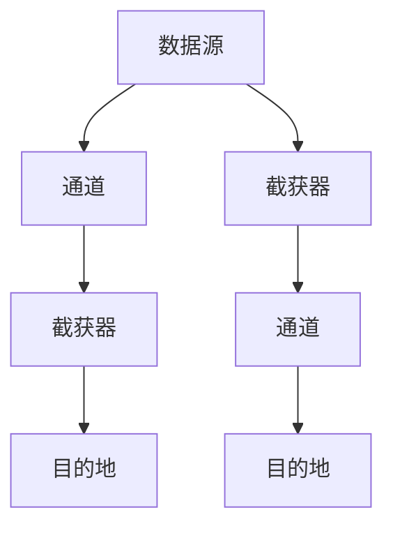
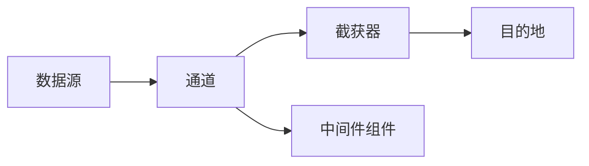
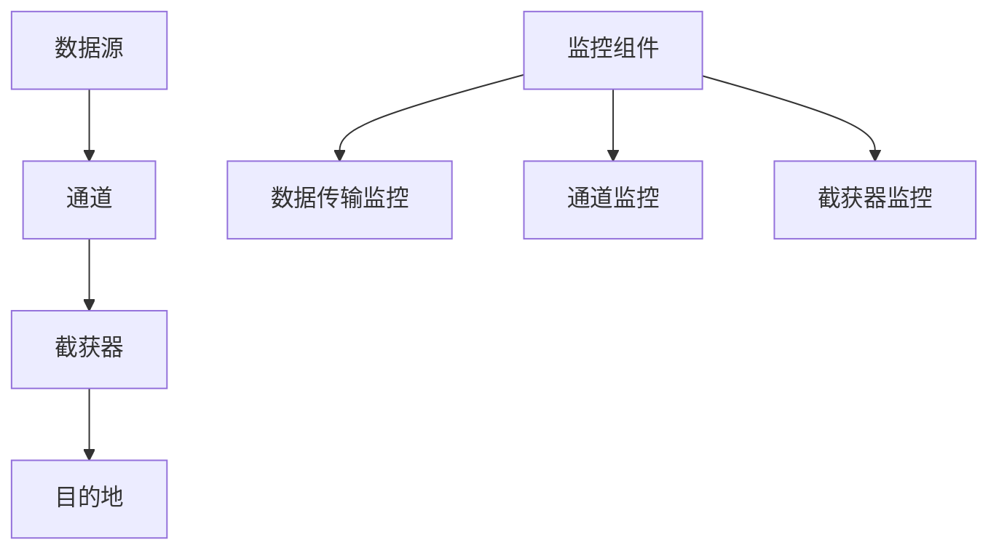

                 

# Flume原理与代码实例讲解

> 关键词：Apache Flume,分布式数据收集系统,日志数据处理,高性能,高可靠性

## 1. 背景介绍

在现代社会，日志数据是系统运维和故障排查的重要依据。海量且分散的日志数据，如果没有有效的收集、处理和分析，不仅难以排查问题，还可能成为信息孤岛，影响决策效率。为此，需要一种高效、可靠、分布式的数据收集系统，以应对复杂多变的日志数据处理需求。

Apache Flume正是一种分布式的数据收集系统，由Apache软件基金会于2009年开源，能够实现海量日志数据的收集和传输。它支持从多种数据源收集数据，将数据流传输到指定的目的地（如HDFS、ElasticSearch等），并在数据传输过程中进行监控和统计，确保数据的完整性和可靠性。

Flume系统具有高性能、高可靠性、高扩展性等特点，能够满足大规模日志数据处理的实时需求，广泛应用于企业运维、大数据分析、云计算等场景。

## 2. 核心概念与联系

### 2.1 核心概念概述

为更好地理解Apache Flume的工作原理，本节将介绍几个关键概念：

- **数据源(Source)**：Flume系统收集日志数据的起点，可以是日志文件、网络、JMS、数据库等数据源。
- **通道(Channel)**：Flume系统中数据传输的中转站，负责暂存从数据源收集到的数据。
- **截获器(Sink)**：数据经过通道处理后，最终被输送到目标目的地（如HDFS、ElasticSearch、Hive等）。
- **中间件组件(Interceptors)**：包括数据压缩、数据解析、数据过滤、数据补全等操作，可以根据需求灵活配置。
- **监控和统计**：Flume系统内置了监控组件，实时统计数据传输情况，确保系统的可靠性和效率。

这些核心概念之间的逻辑关系可以通过以下Mermaid流程图来展示：



这个流程图展示了Flume系统的基本架构，各个组件之间的数据流向和处理逻辑。通过深入了解这些核心概念，我们可以更好地理解Flume的工作机制和应用场景。

### 2.2 概念间的关系

这些核心概念之间存在着紧密的联系，构成了Flume系统的完整架构。下面我通过几个Mermaid流程图来展示这些概念之间的关系。

#### 2.2.1 Flume的系统架构


这个流程图展示了Flume系统的基本架构，各个组件之间的数据流向和处理逻辑。数据源收集数据，通道暂存数据，截获器将数据转发到目的地，中间件组件则进行灵活的数据处理。

#### 2.2.2 Flume的工作流程



这个流程图展示了Flume系统的工作流程，数据从数据源进入通道，中间件组件对数据进行处理，处理后的数据进入截获器，最终到达目的地。

#### 2.2.3 Flume的监控机制



这个流程图展示了Flume系统的监控机制，监控组件实时监控数据传输情况，并对数据源、通道、截获器等组件进行监控，确保数据传输的完整性和可靠性。

## 3. 核心算法原理 & 具体操作步骤
### 3.1 算法原理概述

Apache Flume的核心算法原理主要包括数据流管理和分布式传输。Flume系统通过事件流模型来实现数据流的集中管理和分布式传输。事件流模型将日志数据抽象为事件（Event），每个事件包含了数据的元信息和具体内容。Flume系统通过事件流的生成、传输、存储和统计，实现数据的实时处理和分布式传输。

具体而言，Flume系统支持事件流的生成和采集，由数据源生成事件流，并将其发送到通道。通道负责暂存和转发事件流，通过截获器将事件流传输到目的地。中间件组件可以对事件流进行灵活处理，包括数据解析、数据过滤、数据补全等。监控组件则对数据传输过程进行实时监控和统计，确保数据的完整性和可靠性。

### 3.2 算法步骤详解

Flume系统的主要操作流程如下：

1. **配置文件编写**：编写Flume系统的配置文件，包括数据源、通道、截获器和目的地等组件的配置信息。配置文件以文本形式存在，包含详细的组件定义和数据流配置。

2. **启动Flume系统**：通过命令行或脚本启动Flume系统，并根据配置文件加载相应的组件和数据流。

3. **数据采集**：数据源生成事件流，并将其发送到通道。通道暂存事件流，并根据配置进行数据处理和传输。

4. **数据传输**：通道将事件流转发到截获器，截获器将事件流传输到目的地，如HDFS、ElasticSearch、Hive等。

5. **数据存储**：目的地接收事件流，并存储日志数据。

6. **监控统计**：监控组件实时统计数据传输情况，并对数据源、通道、截获器等组件进行监控，确保数据传输的完整性和可靠性。

### 3.3 算法优缺点

Apache Flume具有以下优点：

1. **高性能**：支持多线程并发处理，能够处理海量日志数据。
2. **高可靠性**：数据传输过程中进行事务处理，确保数据的完整性和可靠性。
3. **高扩展性**：通过配置文件灵活配置数据流和组件，支持水平扩展。
4. **灵活性**：支持多种数据源和目的地，支持中间件组件的灵活配置。
5. **监控统计**：内置监控组件，实时统计数据传输情况，确保系统的可靠性和效率。

同时，该算法也存在一定的局限性：

1. **配置复杂**：配置文件较为复杂，需要详细的配置信息，且配置错误的概率较高。
2. **资源消耗**：通道和截获器需要占用一定的内存和CPU资源，且数据传输过程中需要占用网络带宽。
3. **数据格式限制**：支持的数据格式有限，对于一些特殊的日志格式可能需要自定义中间件组件。

尽管存在这些局限性，但就目前而言，Apache Flume仍是一种主流的日志数据收集系统，具有高性能、高可靠性和高扩展性，适用于大规模日志数据的实时处理。

### 3.4 算法应用领域

Apache Flume主要应用于以下几个领域：

1. **企业运维**：实时监控系统日志和应用日志，快速定位和解决故障。
2. **大数据分析**：收集和存储海量日志数据，为大数据分析和挖掘提供数据基础。
3. **云计算**：实时监控云服务日志，确保云服务的稳定性和可靠性。
4. **安全监控**：收集和分析网络日志，进行入侵检测和安全分析。
5. **网络监测**：实时监测网络流量和日志数据，进行网络故障分析和优化。

## 4. 数学模型和公式 & 详细讲解 & 举例说明

### 4.1 数学模型构建

Flume系统的核心数学模型主要涉及数据流管理和分布式传输。以下我们将使用数学语言对Flume系统的工作机制进行更加严格的刻画。

假设日志数据为 $D=\{d_i\}_{i=1}^N$，其中 $d_i$ 表示第 $i$ 条日志数据。Flume系统将日志数据抽象为事件流 $E=\{e_i\}_{i=1}^N$，其中 $e_i$ 表示第 $i$ 条事件流数据。事件流 $E$ 通过通道 $C$ 进行暂存和传输，最终到达目的地 $D$。

Flume系统的工作机制可以用以下数学模型来描述：

$$
E_i = F(d_i, s_i, c_i)
$$

其中 $F$ 表示数据源生成事件流的函数，$s_i$ 表示数据源的配置信息，$c_i$ 表示通道的配置信息。

$$
e_i = T(e_i, t_i, s_i)
$$

其中 $T$ 表示通道对事件流进行处理和传输的函数，$t_i$ 表示通道的传输配置信息。

$$
e_i = G(e_i, s_i, d_i)
$$

其中 $G$ 表示截获器对事件流进行传输和统计的函数，$s_i$ 表示截获器的配置信息。

$$
D_i = S(e_i, d_i, r_i)
$$

其中 $S$ 表示目的地对事件流进行存储和统计的函数，$r_i$ 表示目的地的存储配置信息。

### 4.2 公式推导过程

以下我们以Flume系统的事件流处理为例，推导事件流生成和传输的公式。

假设数据源的配置信息为 $s_i = (f_i, l_i)$，其中 $f_i$ 表示数据源的类型（如日志文件、网络、JMS等），$l_i$ 表示数据源的日志格式。通道的配置信息为 $c_i = (p_i, t_i)$，其中 $p_i$ 表示通道的类型（如mem、spill等），$t_i$ 表示通道的传输配置信息。截获器的配置信息为 $s_i = (g_i, r_i)$，其中 $g_i$ 表示截获器的类型（如hdfs、elasticsearch等），$r_i$ 表示截获器的存储配置信息。

事件流生成和传输的公式如下：

$$
e_i = F(d_i, s_i, c_i) = (d_i, l_i, f_i, p_i, t_i, g_i, r_i)
$$

其中 $d_i$ 表示日志数据，$l_i$ 表示日志格式，$f_i$ 表示数据源类型，$p_i$ 表示通道类型，$t_i$ 表示通道传输配置，$g_i$ 表示截获器类型，$r_i$ 表示截获器存储配置。

事件流的传输公式为：

$$
e_{i+1} = T(e_i, t_i, s_i) = (e_i, p_i, t_i, g_i, r_i)
$$

其中 $t_i$ 表示通道传输配置，$g_i$ 表示截获器类型，$r_i$ 表示截获器存储配置。

事件流的存储公式为：

$$
D_i = S(e_i, d_i, r_i) = (e_i, d_i, r_i)
$$

其中 $d_i$ 表示日志数据，$r_i$ 表示截获器存储配置。

### 4.3 案例分析与讲解

假设Flume系统通过日志文件数据源生成事件流，将事件流传输到HDFS存储。具体的配置信息如下：

```
agent1.sources = source0
agent1.sources.source0.type = log4j
agent1.sources.source0.channels = channel0
agent1.sources.source0.log4j.appender = appender0
agent1.sources.source0.log4j.logPath = /var/log/applogs/app.log
agent1.sources.source0.log4j.logName = app.log
agent1.sources.source0.log4j.appender.ref = appender0
agent1.sources.source0.encoding = log4j
agent1.sources.source0.interceptorRef = interceptor0
agent1.channels = channel0
agent1.channels.channel0.type = memory
agent1.channels.channel0.capacity = 1000
agent1.channels.channel0.sinkRef = sink0
agent1.sinks = sink0
agent1.sinks.sink0.type = hdfs
agent1.sinks.sink0.hdfs.path = /user/app/logs
agent1.sinks.sink0.hdfs._antenna=agent1
agent1.sinks.sink0.interceptorRef = interceptor0
```

根据上述配置信息，事件流的生成和传输过程如下：

1. **数据源生成事件流**：Flume系统从日志文件生成事件流，并将事件流发送到通道。

2. **通道暂存事件流**：通道对事件流进行暂存和处理，根据配置信息进行缓存和传输。

3. **截获器传输事件流**：截获器将事件流传输到HDFS存储。

4. **数据存储**：HDFS接收事件流，并存储日志数据。

Flume系统的实时监控和统计，可以通过内置的监控组件实现。监控组件实时统计数据传输情况，并对数据源、通道、截获器等组件进行监控，确保数据传输的完整性和可靠性。具体的监控信息包括事件流的生成、传输、存储和统计数据，以及数据源、通道、截获器等组件的状态和性能指标。

## 5. 项目实践：代码实例和详细解释说明

### 5.1 开发环境搭建

在进行Flume项目实践前，我们需要准备好开发环境。以下是使用Linux系统进行Flume开发的环境配置流程：

1. **安装Java环境**：从Oracle官网下载JDK 8或更高版本，解压并配置环境变量。

2. **安装Flume**：从Apache官网下载Flume 1.6.0版本，解压后进入Flume目录。

3. **安装依赖库**：安装Apache Commons、Apache Avro等依赖库。

4. **配置Flume**：根据实际需求编写配置文件。

5. **启动Flume**：通过脚本启动Flume系统，并设置监控配置。

完成上述步骤后，即可在本地环境中运行Flume系统，进行项目实践。

### 5.2 源代码详细实现

以下是一个简单的Flume项目示例，用于收集和传输日志数据。

首先，编写配置文件 `flume-app.conf`：

```
agent1.sources = source0
agent1.sources.source0.type = log4j
agent1.sources.source0.channels = channel0
agent1.sources.source0.log4j.appender = appender0
agent1.sources.source0.log4j.logPath = /var/log/applogs/app.log
agent1.sources.source0.log4j.logName = app.log
agent1.sources.source0.log4j.appender.ref = appender0
agent1.sources.source0.encoding = log4j
agent1.sources.source0.interceptorRef = interceptor0
agent1.channels = channel0
agent1.channels.channel0.type = memory
agent1.channels.channel0.capacity = 1000
agent1.channels.channel0.sinkRef = sink0
agent1.sinks = sink0
agent1.sinks.sink0.type = hdfs
agent1.sinks.sink0.hdfs.path = /user/app/logs
agent1.sinks.sink0.hdfs._antenna=agent1
agent1.sinks.sink0.interceptorRef = interceptor0
```

然后，启动Flume系统：

```
bin/flume-ng agent --conf flume-app.conf --name agent1
```

运行脚本后，Flume系统将启动并开始收集日志数据，将数据传输到HDFS存储。

### 5.3 代码解读与分析

让我们再详细解读一下关键代码的实现细节：

**flume-app.conf配置文件**：
- `agent1.sources`：配置数据源，包括类型、路径、编码等信息。
- `agent1.channels`：配置通道，包括类型、容量、传输信息等。
- `agent1.sinks`：配置截获器，包括类型、存储路径等信息。
- `agent1.interceptors`：配置中间件组件，包括类型、配置信息等。

**启动脚本**：
- `bin/flume-ng agent`：启动Flume agent进程，指定配置文件路径。
- `--name agent1`：指定agent名称。

**运行结果展示**：
- 在HDFS路径 `/user/app/logs` 下，可以看到收集的日志文件。

可以看到，通过Flume系统，我们能够简单高效地收集和传输日志数据，实现实时监控和数据存储。在实际应用中，Flume系统还可以配置更多的中间件组件和数据源，支持更复杂的数据处理需求。

## 6. 实际应用场景

### 6.1 企业运维

在企业运维中，日志数据是监控系统、应用运行状态、异常处理等的重要依据。通过Flume系统，企业可以实现实时监控和存储日志数据，快速定位和解决故障。

例如，企业可以在关键应用节点部署Flume agent，实时监控应用日志，并将日志数据传输到集中存储系统。通过分析日志数据，运维人员可以及时发现应用故障和异常情况，快速响应和解决问题。

### 6.2 大数据分析

在大数据分析中，日志数据是数据来源之一，记录了系统运行过程的重要信息。通过Flume系统，企业可以实现海量日志数据的实时收集和存储，为大数据分析和挖掘提供数据基础。

例如，企业可以将各部门的日志数据通过Flume系统收集到集中存储系统，然后利用Hadoop、Spark等大数据处理工具对日志数据进行分析和挖掘，发现潜在的问题和改进点，优化系统性能。

### 6.3 云计算

在云计算中，日志数据是监控云服务性能、故障排查的重要依据。通过Flume系统，企业可以实现云服务日志的实时收集和存储，快速定位和解决云服务故障。

例如，企业可以在云服务器上部署Flume agent，实时监控云服务日志，并将日志数据传输到集中存储系统。通过分析日志数据，运维人员可以及时发现云服务异常情况，快速响应和解决问题。

### 6.4 未来应用展望

随着Flume系统的不断发展，其在日志数据处理中的应用前景将更加广阔。未来，Flume系统将在以下几个方向进一步发展：

1. **实时处理**：进一步提升数据处理速度，支持更多的数据源和目的地。
2. **分布式部署**：支持大规模分布式部署，提高系统的可扩展性和可用性。
3. **数据清洗**：增加数据清洗和格式化功能，提高数据质量。
4. **数据可视化**：支持数据可视化工具，帮助用户快速分析和理解日志数据。
5. **智能化**：结合机器学习、人工智能技术，实现智能化的日志分析和故障预测。

Flume系统作为日志数据处理的重要工具，将继续在企业运维、大数据分析、云计算等领域发挥重要作用，为系统的稳定性和可靠性提供有力保障。

## 7. 工具和资源推荐
### 7.1 学习资源推荐

为了帮助开发者系统掌握Apache Flume的工作原理和实践技巧，这里推荐一些优质的学习资源：

1. **Apache Flume官方文档**：Apache Flume官方文档详细介绍了Flume系统的各个组件和工作机制，是学习Flume系统的重要参考。

2. **Flume入坑指南**：这篇博客介绍了Flume系统的基本概念和配置方法，适合初学者入门。

3. **Flume高级配置指南**：这篇博客介绍了Flume系统的高级配置技巧，适合有经验的开发者参考。

4. **Flume项目实战**：这篇博客介绍了Flume系统的实战项目开发流程，适合动手实践的开发者参考。

5. **Flume监控配置**：这篇博客介绍了Flume系统的监控配置方法和最佳实践，适合关注系统稳定性的开发者参考。

通过这些学习资源，相信你一定能够全面掌握Apache Flume的各个方面，并应用于实际项目开发中。

### 7.2 开发工具推荐

Flume系统的开发和部署需要依赖多个工具，以下是几款推荐的开发工具：

1. **JDK**：Flume系统基于Java语言开发，JDK是Java开发的基础环境。

2. **Eclipse**：一款优秀的Java开发工具，支持Flume系统配置和调试。

3. **Git**：版本控制系统，用于Flume系统配置和代码管理。

4. **Maven**：项目管理工具，支持Flume系统的依赖管理和自动化构建。

5. **JIRA**：项目管理工具，支持Flume系统的任务分配和进度跟踪。

6. **Kafka**：分布式消息系统，支持Flume系统的数据传输和缓存。

7. **Hadoop**：大数据处理框架，支持Flume系统的数据存储和分析。

合理利用这些工具，可以显著提升Flume系统的开发和部署效率，缩短项目周期。

### 7.3 相关论文推荐

Flume系统的研究和应用涉及多个领域，以下是几篇相关的学术论文，推荐阅读：

1. **MapReduce and Flume: A Concatenation of Ideas**：该论文介绍了Flume系统的设计理念和实现机制，是了解Flume系统的重要文献。

2. **Building a Reliable Distributed System with Apache Flume**：该论文介绍了Flume系统的可靠性设计和实现方法，是Flume系统实践的重要参考。

3. **Scaling Apache Flume: From System to Cloud**：该论文介绍了Flume系统在云环境下的应用实践，是Flume系统扩展性的重要参考。

4. **Apache Flume: A Distributed, Reliable, and Scalable Log Collection System**：该论文介绍了Flume系统的架构设计和应用场景，是Flume系统经典文献之一。

5. **Efficient Data Transport in Apache Flume**：该论文介绍了Flume系统中的数据传输机制和优化方法，是Flume系统性能优化的重要参考。

这些论文代表了Flume系统的最新研究进展，通过学习这些前沿成果，可以帮助开发者掌握Flume系统的精髓，为系统开发和优化提供理论支持。

除上述资源外，还有一些值得关注的前沿资源，帮助开发者紧跟Flume系统的最新进展，例如：

1. **Flume官方博客**：Apache Flume官方博客，分享Flume系统的最新动态和最佳实践。

2. **Flume开源社区**：Apache Flume开源社区，提供Flume系统的技术支持和社区讨论。

3. **Flume技术会议**：Apache Flume技术会议，分享Flume系统的最新研究成果和应用案例。

4. **Flume相关论文**：Google Scholar、IEEE Xplore等学术平台，查找Flume系统的最新研究论文。

5. **Flume技术报告**：Apache软件基金会的技术报告，介绍Flume系统的最新进展和应用案例。

总之，对于Apache Flume的学习和实践，需要开发者保持开放的心态和持续学习的意愿。多关注前沿资讯，多动手实践，多思考总结，必将收获满满的成长收益。

## 8. 总结：未来发展趋势与挑战

### 8.1 总结

本文对Apache Flume的工作原理和实践技巧进行了全面系统的介绍。首先阐述了Flume系统的基本概念和架构，明确了其在日志数据处理中的独特价值。其次，从原理到实践，详细讲解了Flume系统的各个组件和工作机制，给出了Flume系统配置和部署的完整代码实例。同时，本文还广泛探讨了Flume系统在企业运维、大数据分析、云计算等场景中的应用前景，展示了其广泛的应用潜力。

通过本文的系统梳理，可以看到，Apache Flume作为一种高性能、高可靠性的日志数据收集系统，能够满足复杂多变的日志数据处理需求。它的高效、稳定和可扩展性，使其在各种应用场景中发挥了重要作用。未来，随着Flume系统的不断发展和优化，其在数据处理和系统监控中的应用前景将更加广阔。

### 8.2 未来发展趋势

展望未来，Apache Flume将呈现以下几个发展趋势：

1. **实时处理能力提升**：进一步提升数据处理速度，支持更多的数据源和目的地。
2. **分布式部署优化**：支持大规模分布式部署，提高系统的可扩展性和可用性。
3. **数据清洗和格式化**：增加数据清洗和格式化功能，提高数据质量。
4. **数据可视化**：支持数据可视化工具，帮助用户快速分析和理解日志数据。
5. **智能化**：结合机器学习、人工智能技术，实现智能化的日志分析和故障预测。

这些趋势凸显了Apache Flume作为日志数据处理工具的强大潜力和应用前景，未来必将在企业运维、大数据分析、云计算等领域继续发挥重要作用。

### 8.3 面临的挑战

尽管Apache Flume已经取得了显著的进展，但在迈向更加智能化、普适化应用的过程中，它仍面临着诸多挑战：

1. **配置复杂**：配置文件较为复杂，需要详细的配置信息，且配置错误的概率较高。
2. **资源消耗**：通道和截获器需要占用一定的内存和CPU资源，且数据传输过程中需要占用网络带宽。
3. **数据格式限制**：支持的数据格式有限，对于一些特殊的日志格式可能需要自定义中间件组件。
4. **可扩展性**：大规模部署时，系统的可扩展性和可用性需要进一步优化。
5. **性能瓶颈**：在高负载情况下，系统的性能瓶颈问题仍需解决。

尽管存在这些挑战，但通过不断的技术改进和优化，Apache Flume必将在未来的应用中克服这些挑战，进一步拓展其应用范围和深度。

### 8.4 研究展望

未来的研究需要在以下几个方向寻求新的突破：

1. **分布式处理**：探索分布式数据处理技术，提高系统的并行处理能力。
2. **数据压缩和存储**：结合数据压缩和分布式存储技术，提升系统的存储效率和扩展性。
3. **实时监控**：引入实时监控和告警机制，提高系统的可靠性和性能。
4. **智能化分析**：结合机器学习、人工智能技术，提升系统的智能化分析能力。
5. **跨平台支持**：支持更多的数据源和目的地，提高系统的通用性和适应性。

这些研究方向的探索，必将引领Apache Flume技术迈向更高的台阶，为构建高效、可靠、智能的日志数据处理系统铺平道路。面向未来，Apache Flume还需要与其他人工智能技术进行更深入的融合，多路径协同发力，共同推动日志数据处理技术的发展。只有勇于创新、敢于突破，才能不断拓展

