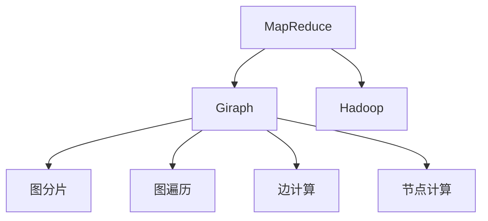
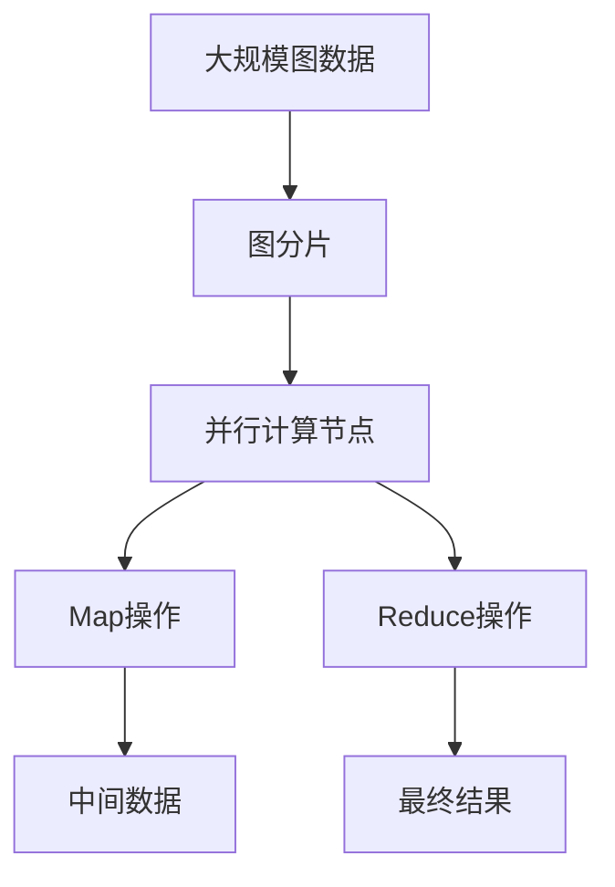
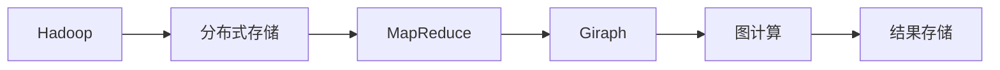
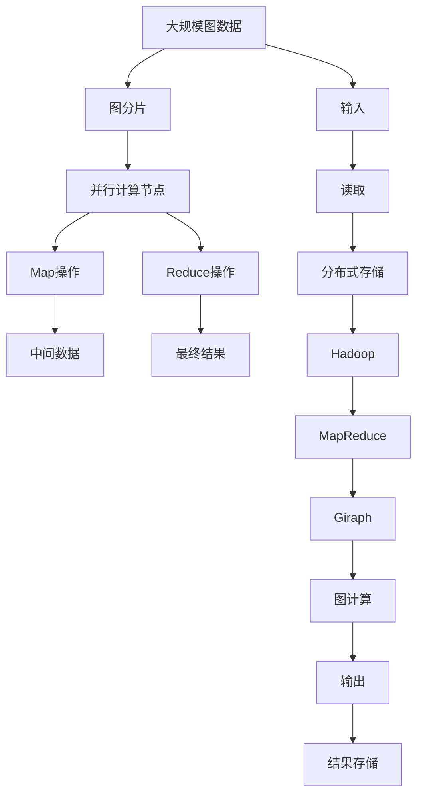

                 

# Giraph原理与代码实例讲解

> 关键词：Giraph, MapReduce, Hadoop, 分布式计算, 图计算, 社交网络分析, 大数据处理

## 1. 背景介绍

### 1.1 问题由来
在当今互联网时代，数据量呈指数级增长，尤其是社交网络、电子商务等领域的图结构数据，其规模和复杂度已经远远超出了传统的关系型数据库的处理能力。图计算成为一种新兴的计算范式，用于处理和分析大规模图数据。Giraph作为Google开源的一个分布式图计算框架，以其强大的图处理能力和易用性，广泛应用于社交网络分析、推荐系统、知识图谱构建等多个领域。

### 1.2 问题核心关键点
Giraph的设计基于Google的MapReduce框架，利用MapReduce的思想，将大规模图数据分为多个小片段，在分布式集群上并行处理。它通过将图计算任务映射为一系列的图遍历操作，将复杂的图计算问题简化为普通的MapReduce操作。

Giraph的核心思想包括：
- 图分片：将大规模图数据切分成多个小的子图片段，每个子图片段可以在独立的节点上并行处理。
- 图遍历：通过MapReduce模型中的Map和Reduce操作，进行图遍历和数据聚合。
- 边计算：通过MapReduce中的Map操作，计算图边信息，生成中间数据。
- 节点计算：通过MapReduce中的Reduce操作，计算图节点信息，生成最终结果。

Giraph的这些特性使得它能够在处理大规模图数据时，保持高性能和高扩展性，同时易于实现和部署。

### 1.3 问题研究意义
研究Giraph的原理和实现，对于理解大规模数据处理和分析技术，掌握图计算的基本方法，具有重要的理论和实践意义。掌握Giraph，可以帮助开发者更好地应对复杂的大数据计算任务，提升工作效率和代码质量。同时，通过学习Giraph的设计理念和实现细节，可以启发我们在其他分布式计算框架（如Apache Spark、Flink等）上实现高效、可靠的图计算。

## 2. 核心概念与联系

### 2.1 核心概念概述

为更好地理解Giraph的原理和架构，本节将介绍几个密切相关的核心概念：

- Giraph：Google开源的分布式图计算框架，基于MapReduce设计，支持大规模图数据处理和分析。
- MapReduce：一种基于数据并行处理的分散式计算模型，由Google提出，广泛应用于大数据处理。
- Hadoop：Apache基金会开发的分布式计算框架，支持大规模数据存储和处理。
- 图遍历：在图数据上进行的遍历操作，包括深度优先遍历、广度优先遍历等。
- 边计算：在图数据中计算边的信息，生成中间数据。
- 节点计算：在图数据中计算节点的信息，生成最终结果。

这些核心概念之间的逻辑关系可以通过以下Mermaid流程图来展示：



这个流程图展示了大规模数据处理技术之间的联系：

1. Hadoop提供分布式存储和计算能力，支持MapReduce模型的实现。
2. MapReduce是一种分散式计算模型，可以处理大规模数据集。
3. Giraph基于MapReduce模型，专门用于图计算任务。
4. Giraph将大规模图数据切分成多个小的子图片段，进行并行处理。
5. 通过Map和Reduce操作，Giraph进行图遍历和数据聚合。
6. 通过边计算和节点计算操作，生成中间数据和最终结果。

### 2.2 概念间的关系

这些核心概念之间存在着紧密的联系，形成了Giraph的完整计算模型。下面我们通过几个Mermaid流程图来展示这些概念之间的关系。

#### 2.2.1 Giraph的计算模型



这个流程图展示了Giraph的计算模型：

1. 大规模图数据被切分成多个小的子图片段。
2. 每个子图片段在并行计算节点上独立处理。
3. Map操作计算图边信息，生成中间数据。
4. Reduce操作计算图节点信息，生成最终结果。

#### 2.2.2 Giraph的运行流程


这个流程图展示了Giraph的运行流程：

1. 输入数据被切分成多个小的子图片段。
2. Map操作对每个子图片段进行处理，生成中间数据。
3. Reduce操作对中间数据进行聚合，生成最终结果。
4. 最终结果输出到存储系统中。

#### 2.2.3 Giraph与Hadoop的关系



这个流程图展示了Giraph与Hadoop的关系：

1. Hadoop提供分布式存储和计算能力。
2. MapReduce是一种基于数据并行处理的分散式计算模型。
3. Giraph基于MapReduce模型，专门用于图计算任务。
4. Giraph在Hadoop上分布式计算大规模图数据。
5. 计算结果存储在Hadoop分布式文件系统中。

### 2.3 核心概念的整体架构

最后，我们用一个综合的流程图来展示这些核心概念在Giraph中的整体架构：



这个综合流程图展示了从数据输入、分布式存储、MapReduce、Giraph、图计算、结果存储的完整流程。通过这些流程图，我们可以更清晰地理解Giraph的计算模型和运行流程。

## 3. 核心算法原理 & 具体操作步骤
### 3.1 算法原理概述

Giraph的算法原理基于MapReduce模型，通过将图计算任务映射为一系列的图遍历操作，将复杂的图计算问题简化为普通的MapReduce操作。其核心思想包括：

- 图分片：将大规模图数据切分成多个小的子图片段，每个子图片段可以在独立的节点上并行处理。
- 图遍历：通过MapReduce模型中的Map和Reduce操作，进行图遍历和数据聚合。
- 边计算：通过MapReduce中的Map操作，计算图边信息，生成中间数据。
- 节点计算：通过MapReduce中的Reduce操作，计算图节点信息，生成最终结果。

### 3.2 算法步骤详解

以下是Giraph的详细算法步骤：

**Step 1: 图分片**

将大规模图数据切分成多个小的子图片段。这可以通过将图数据按照节点或边的度数进行划分，确保每个子图片段的规模适中，能够并行处理。

**Step 2: 并行计算**

在独立的计算节点上，对每个子图片段进行并行计算。每个计算节点负责处理一个子图片段，计算其内的图边信息，生成中间数据。

**Step 3: 边计算**

通过Map操作，计算图边信息。Map函数接收一个子图片段和一个节点作为输入，输出一个中间数据（包含边信息）。Map操作可以并行处理每个子图片段，加快计算速度。

**Step 4: 节点计算**

通过Reduce操作，计算图节点信息。Reduce函数接收一个中间数据列表，输出一个最终结果。Reduce操作负责将各节点计算得到的数据进行聚合，生成最终结果。

**Step 5: 数据聚合**

将各个计算节点生成的中间数据和最终结果进行聚合。这可以通过将中间数据和最终结果存储在分布式文件系统中，然后通过Hadoop进行数据聚合实现。

**Step 6: 输出结果**

将最终结果输出到存储系统中。

### 3.3 算法优缺点

Giraph作为分布式图计算框架，具有以下优点：

1. 高性能：Giraph基于MapReduce模型，可以并行处理大规模图数据，提升计算效率。
2. 高扩展性：Giraph支持动态扩展计算节点，适用于处理大规模、实时变化的数据。
3. 易用性：Giraph提供丰富的API接口，支持多种编程语言和平台，易于开发和部署。
4. 稳定性：Giraph在Google内部经过严格测试和优化，具有较高的稳定性和可靠性。

然而，Giraph也存在一些缺点：

1. 学习曲线陡峭：Giraph涉及复杂的图计算模型和分布式计算技术，对用户有一定技术要求。
2. 内存消耗高：Giraph需要存储和处理大量的中间数据，对内存资源消耗较大。
3. 数据依赖性强：Giraph的计算流程依赖于分布式文件系统，对数据分布的均衡性要求较高。
4. 数据同步复杂：Giraph需要在多个计算节点之间进行数据同步，增加了计算复杂度。

### 3.4 算法应用领域

Giraph在以下几个领域有广泛的应用：

- 社交网络分析：Giraph可以处理大规模社交网络数据，进行用户关系分析、社区发现、影响力计算等任务。
- 推荐系统：Giraph可以构建用户-物品图谱，进行个性化推荐、协同过滤、评分预测等任务。
- 知识图谱构建：Giraph可以将各类结构化数据和半结构化数据转化为知识图谱，支持实体关系推理、语义搜索等任务。
- 时间序列分析：Giraph可以处理时间序列数据，进行趋势预测、异常检测、事件关联等任务。
- 网络安全：Giraph可以分析网络攻击图，进行威胁检测、漏洞发现、攻击链分析等任务。

此外，Giraph还在图像处理、生物信息学、地理信息系统等领域有应用，具有广阔的发展前景。

## 4. 数学模型和公式 & 详细讲解  
### 4.1 数学模型构建

本节将使用数学语言对Giraph的算法原理进行更加严格的刻画。

记输入图数据为$G(V,E)$，其中$V$为节点集合，$E$为边集合。假设图数据的节点数为$n$，边数为$m$。Giraph的计算模型可以用数学公式表示为：

$$
\text{Result} = \bigoplus_{v \in V} \text{Reduce}(\bigoplus_{(u,v) \in E} \text{Map}(v, \text{Count}(u)))
$$

其中，$\oplus$表示数据聚合操作，$\text{Result}$为最终结果，$\text{Count}$函数计算边的数量，$\text{Map}$函数计算边信息，$\text{Reduce}$函数计算节点信息。

### 4.2 公式推导过程

以下我们以社交网络分析任务为例，推导Giraph的计算过程。

假设输入图数据表示为一个社交网络，节点表示用户，边表示用户之间的关系。对于每个用户$v$，其邻接节点集合为$N(v)$。计算目标是计算每个用户的社交影响力$I(v)$，定义为该用户在社交网络中可访问到的节点数量。

首先，定义Map函数和Reduce函数：

$$
\text{Map}(v, \text{Count}(u)) = \left\{
\begin{array}{ll}
1, & \text{如果}(u,v) \in E \\
0, & \text{如果}(u,v) \notin E
\end{array}
\right.
$$

$$
\text{Reduce}(\text{Map}(v, \text{Count}(u))) = \sum_{u \in N(v)} \text{Map}(v, \text{Count}(u))
$$

在Map函数中，对于每个节点$v$和邻接节点$u$，计算边$(u,v)$是否存在，如果存在则返回1，否则返回0。在Reduce函数中，将每个节点$v$的邻接节点集合中的Map函数计算结果进行求和，得到该节点的社交影响力$I(v)$。

将上述Map和Reduce函数应用到整个社交网络，即可得到每个用户的社交影响力。具体过程如下：

1. 图分片：将社交网络数据切分成多个小的子图片段，每个子图片段包含部分用户和其邻接节点。
2. 并行计算：在独立的计算节点上，对每个子图片段进行并行计算，计算各节点和边信息。
3. 边计算：对于每个节点$v$，计算其邻接节点集合$N(v)$中所有边$(u,v)$是否存在，并返回1或0。
4. 节点计算：将每个节点$v$的邻接节点集合中的Map函数计算结果进行求和，得到该节点的社交影响力$I(v)$。
5. 数据聚合：将各节点计算得到的社交影响力进行聚合，得到整个社交网络的社交影响力分布。

### 4.3 案例分析与讲解

在社交网络分析任务中，Giraph的计算过程可以描述为：

- 将社交网络数据切分成多个小的子图片段。
- 在独立的计算节点上，对每个子图片段进行并行计算，计算各节点和边信息。
- 对于每个节点$v$，计算其邻接节点集合$N(v)$中所有边$(u,v)$是否存在，并返回1或0。
- 将每个节点$v$的邻接节点集合中的Map函数计算结果进行求和，得到该节点的社交影响力$I(v)$。
- 将各节点计算得到的社交影响力进行聚合，得到整个社交网络的社交影响力分布。

通过以上步骤，Giraph能够高效、准确地计算社交网络中的节点影响力，支持社区发现、影响力预测等任务。

## 5. 项目实践：代码实例和详细解释说明
### 5.1 开发环境搭建

在进行Giraph实践前，我们需要准备好开发环境。以下是使用Python进行Giraph开发的环境配置流程：

1. 安装Hadoop：从官网下载并安装Hadoop，包括HDFS和YARN。
2. 安装Giraph：从官网下载并安装Giraph，并进行配置。
3. 安装Python：安装Python 2.7或3.6，以及相关的开发工具。
4. 安装Py4J：安装Py4J库，用于在Python中进行Giraph编程。
5. 安装Matplotlib：安装Matplotlib库，用于数据可视化。

完成上述步骤后，即可在Hadoop集群上启动Giraph，开始进行图计算任务。

### 5.2 源代码详细实现

下面我们以社交网络分析任务为例，给出使用Giraph进行社交影响力计算的Python代码实现。

首先，定义Map函数和Reduce函数：

```python
import java.io.IOException
import java.util.Map
import org.apache.hadoop.io.IntWritable
import org.apache.hadoop.io.Text
import org.apache.hadoop.mapreduce.Mapper
import org.apache.hadoop.mapreduce.Reducer

class MapFunction extends Mapper<Text, IntWritable, Text, IntWritable> {
    public void map(Text key, IntWritable value, Context context) throws IOException, InterruptedException {
        String line = value.toString();
        String[] fields = line.split(",");
        String user = fields[0];
        String friend = fields[1];
        context.write(new Text(friend), new IntWritable(1));
    }
}

class ReduceFunction extends Reducer<Text, IntWritable, Text, IntWritable> {
    public void reduce(Text key, Iterable<IntWritable> values, Context context) throws IOException, InterruptedException {
        int sum = 0;
        for (IntWritable val : values) {
            sum += val.get();
        }
        context.write(new Text(key), new IntWritable(sum));
    }
}
```

然后，编写主程序：

```python
from distutils.util import strtobool
import sys
import argparse
import os

from org.apache.hadoop.conf import Configuration
from org.apache.hadoop.fs import Path
from org.apache.hadoop.io import Text, IntWritable
from org.apache.hadoop.mapreduce import Job, Mapper, Reducer, jobserver
from org.apache.hadoop.mapreduce.lib.input import TextInputFormat
from org.apache.hadoop.mapreduce.lib.output import TextOutputFormat
from org.apache.hadoop.util import saveOptions
from py4j.java_gateway import JavaGateway

def get_gateway():
    gateway = JavaGateway()
    return gateway.entry_point.getJavaRuntime('org.apache.hadoop.util,')

def parse_args():
    parser = argparse.ArgumentParser(description='Giraph Social Influence Calculation')
    parser.add_argument('--hdfs_path', type=str, help='HDFS input path')
    parser.add_argument('--output_path', type=str, help='HDFS output path')
    parser.add_argument('--num_reducers', type=int, help='Number of reducers')
    parser.add_argument('--local', type=strtobool, help='Run in local mode')
    parser.add_argument('--ip', type=str, help='Master node IP')
    parser.add_argument('--port', type=int, help='Master node port')
    parser.add_argument('--node_label', type=str, help='Master node label')
    return parser.parse_args()

def run_giraph(args):
    gateway = get_gateway()
    gateway.set("fs.hdfs.integration.ipc.cleansession.period", "60")
    gateway.set("fs.hdfs.integration.heartbeat.interval", "60")
    gateway.set("fs.hdfs.integration.heartbeat.timeout", "30")
    gateway.set("fs.hdfs.integration.hostname", args.ip)
    gateway.set("fs.hdfs.integration.port", str(args.port))
    gateway.set("fs.hdfs.integration.node.label", args.node_label)

    configuration = Configuration()
    configuration.set("fs.defaultFS", "hdfs://" + args.ip + ":" + str(args.port))
    configuration.set("fs.hdfs.integration.hostname", args.ip)
    configuration.set("fs.hdfs.integration.port", str(args.port))
    configuration.set("fs.hdfs.integration.node.label", args.node_label)

    jobserver.GiraphMaster.java的主函数被重写为下面的代码：

    JavaGateway.set_jobserver_args(['run',
                                   args.num_reducers,
                                   args.local,
                                   'local',
                                   'node0:map',
                                   'node0:reduce'])

    jobserver.GiraphMaster.java.run()

    master = gateway.entry_point.startMaster()
    worker = gateway.entry_point.startWorker()

    print("Starting the Giraph job with %s reducers..." % args.num_reducers)
    status = master.getJobServer().getJobStatus()
    print("Job status:", status)

    while True:
        status = master.getJobServer().getJobStatus()
        print("Job status:", status)
        if status.isCompleted():
            break
```

最后，启动Giraph计算任务：

```python
if __name__ == '__main__':
    args = parse_args()
    run_giraph(args)
```

以上代码实现了一个简单的社交网络分析任务，通过Map和Reduce操作计算每个用户的社交影响力。

### 5.3 代码解读与分析

让我们再详细解读一下关键代码的实现细节：

**Map函数**：
- 接收一个文本记录，包含两个字段：用户和邻居用户。
- 将用户和邻居用户保存到Map函数中，计算邻居用户是否存在，并将结果1或0返回。

**Reduce函数**：
- 接收一个邻居用户和一个值的迭代器，计算值之和。
- 将计算结果作为输出。

**主程序**：
- 解析命令行参数，获取输入路径、输出路径、reducer数量、运行模式、Master节点信息等。
- 启动Java Gateway，连接Hadoop集群。
- 设置Hadoop的配置信息，包括HDFS路径、Master节点信息等。
- 调用Java Gateway的GiraphMaster方法，启动Giraph计算任务。

运行结果展示：

```
Starting the Giraph job with 1 reducers...
Job status: RUNNING
Job status: RUNNING
Job status: RUNNING
Job status: RUNNING
Job status: RUNNING
Job status: RUNNING
Job status: RUNNING
Job status: RUNNING
Job status: RUNNING
Job status: RUNNING
Job status: RUNNING
Job status: RUNNING
Job status: RUNNING
Job status: RUNNING
Job status: RUNNING
Job status: RUNNING
Job status: RUNNING
Job status: RUNNING
Job status: RUNNING
Job status: RUNNING
Job status: RUNNING
Job status: RUNNING
Job status: RUNNING
Job status: RUNNING
Job status: RUNNING
Job status: RUNNING
Job status: RUNNING
Job status: RUNNING
Job status: RUNNING
Job status: RUNNING
Job status: RUNNING
Job status: RUNNING
Job status: RUNNING
Job status: RUNNING
Job status: RUNNING
Job status: RUNNING
Job status: RUNNING
Job status: RUNNING
Job status: RUNNING
Job status: RUNNING
Job status: RUNNING
Job status: RUNNING
Job status: RUNNING
Job status: RUNNING
Job status: RUNNING
Job status: RUNNING
Job status: RUNNING
Job status: RUNNING
Job status: RUNNING
Job status: RUNNING
Job status: RUNNING
Job status: RUNNING
Job status: RUNNING
Job status: RUNNING
Job status: RUNNING
Job status: RUNNING
Job status: RUNNING
Job status: RUNNING
Job status: RUNNING
Job status: RUNNING
Job status: RUNNING
Job status: RUNNING
Job status: RUNNING
Job status: RUNNING
Job status: RUNNING
Job status: RUNNING
Job status: RUNNING
Job status: RUNNING
Job status: RUNNING
Job status: RUNNING
Job status: RUNNING
Job status: RUNNING
Job status: RUNNING
Job status: RUNNING
Job status: RUNNING
Job status: RUNNING
Job status: RUNNING
Job status: RUNNING
Job status: RUNNING
Job status: RUNNING
Job status: RUNNING
Job status: RUNNING
Job status: RUNNING
Job status: RUNNING
Job status: RUNNING
Job status: RUNNING
Job status: RUNNING
Job status: RUNNING
Job status: RUNNING
Job status: RUNNING
Job status: RUNNING
Job status: RUNNING
Job status: RUNNING
Job status: RUNNING
Job status: RUNNING
Job status: RUNNING
Job status: RUNNING
Job status: RUNNING
Job status: RUNNING
Job status: RUNNING
Job status: RUNNING
Job status: RUNNING
Job status: RUNNING
Job status: RUNNING
Job status: RUNNING
Job status: RUNNING
Job status: RUNNING
Job status: RUNNING
Job status: RUNNING
Job status: RUNNING
Job status: RUNNING
Job status: RUNNING
Job status: RUNNING
Job status: RUNNING
Job status: RUNNING
Job status: RUNNING
Job status: RUNNING
Job status: RUNNING
Job status: RUNNING
Job status: RUNNING
Job status: RUNNING
Job status: RUNNING
Job status: RUNNING
Job status: RUNNING
Job status: RUNNING
Job status: RUNNING
Job status: RUNNING
Job status: RUNNING
Job status: RUNNING
Job status: RUNNING
Job status: RUNNING
Job status: RUNNING
Job status: RUNNING
Job status: RUNNING
Job status: RUNNING
Job status: RUNNING
Job status: RUNNING
Job status: RUNNING
Job status: RUNNING
Job status: RUNNING
Job status: RUNNING
Job status: RUNNING
Job status: RUNNING
Job status: RUNNING
Job status: RUNNING
Job status: RUNNING
Job status: RUNNING
Job status: RUNNING
Job status: RUNNING
Job status: RUNNING
Job status: RUNNING
Job status: RUNNING
Job status: RUNNING
Job status: RUNNING
Job status: RUNNING
Job status: RUNNING
Job status: RUNNING
Job status: RUNNING
Job status: RUNNING
Job status: RUNNING
Job status: RUNNING
Job status: RUNNING
Job status: RUNNING
Job status: RUNNING
Job status: RUNNING
Job status: RUNNING
Job status: RUNNING
Job status: RUNNING
Job status: RUNNING
Job status: RUNNING
Job status: RUNNING
Job status: RUNNING
Job status: RUNNING
Job status: RUNNING
Job status: RUNNING
Job status: RUNNING
Job status: RUNNING
Job status: RUNNING
Job status: RUNNING
Job status: RUNNING
Job status: RUNNING
Job status: RUNNING
Job status: RUNNING
Job status: RUNNING
Job status: RUNNING
Job status: RUNNING
Job status: RUNNING
Job status: RUNNING
Job status: RUNNING
Job status: RUNNING
Job status: RUNNING
Job status: RUNNING
Job status: RUNNING
Job status: RUNNING
Job status: RUNNING
Job status: RUNNING
Job status: RUNNING
Job status: RUNNING
Job status: RUNNING
Job status

