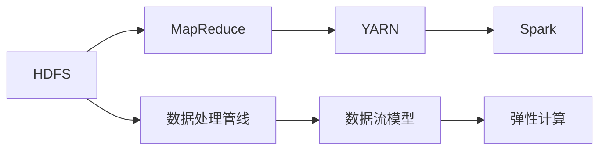
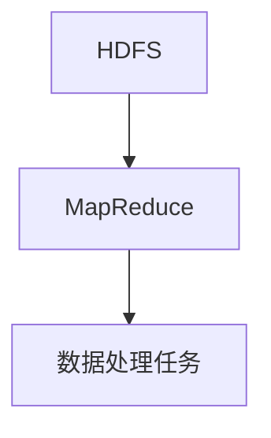
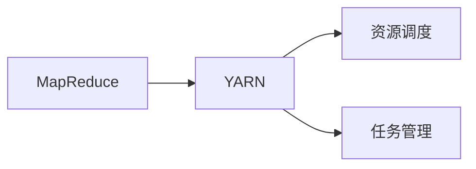
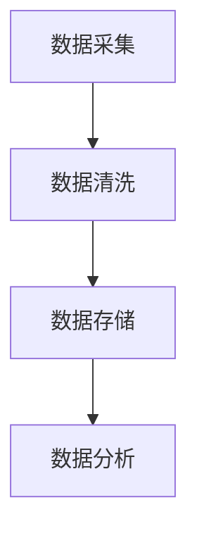

                 

# Hadoop原理与代码实例讲解

> 关键词：Hadoop,分布式计算,MapReduce,分布式文件系统,HDFS,数据处理,YARN,Spark,Hadoop生态系统

## 1. 背景介绍

### 1.1 问题由来
在当今大数据时代，随着数据量的急剧增长，如何高效、可靠地处理海量数据成为各大企业和组织面临的重大挑战。传统的数据处理方式往往依赖于中心化的数据存储和计算资源，存在单点故障、扩展性差等诸多问题。Hadoop作为分布式计算领域的经典框架，通过其独特的分布式架构，成功解决了这些问题，成为大数据处理的核心工具。

Hadoop的起源可以追溯到2006年，由Facebook的首席工程师Doug Cutting和年轻程序员Joy Whailand在Yahoo发起。其名称Hadoop源自Doug Cutting的孩子Hadoop的《You Are My Sunshine》中的歌词。Hadoop作为开源项目，以其易于使用、可扩展、高可靠性等特点迅速获得了广泛应用，成为全球范围内最流行的分布式计算框架之一。

### 1.2 问题核心关键点
Hadoop的成功源于其分布式架构的设计思想，即通过多台计算机协同工作，实现数据的并行处理和容错性。其核心组件包括：

1. **Hadoop分布式文件系统(HDFS)**：用于存储大规模数据集，保证数据的高可用性和可靠性。
2. **MapReduce计算框架**：用于分布式计算，实现大规模数据处理的并行化。
3. **YARN（Yet Another Resource Negotiator）资源管理器**：用于资源调度和任务管理，支持多种计算框架（如Spark）。

Hadoop的这些组件共同构建了一个强大的分布式计算平台，可以在大规模数据集上高效地执行各种数据处理任务，如数据存储、数据清洗、数据分析等。

### 1.3 问题研究意义
Hadoop技术的发展，对于提升数据处理效率、降低数据处理成本、提高数据处理可靠性等方面具有重要意义：

1. **高效性**：Hadoop能够通过多台计算机并行处理数据，显著提高数据处理速度，尤其适用于大数据量的计算任务。
2. **可扩展性**：Hadoop的分布式架构，使其能够轻松扩展，以适应数据量的增长。
3. **可靠性**：通过数据冗余和容错机制，Hadoop能够保证数据处理的连续性和可靠性，防止单点故障。
4. **成本效益**：利用廉价的PC服务器集群，Hadoop可以实现低成本的数据处理。
5. **灵活性**：支持多种数据处理框架（如Spark、Flink），用户可以根据需要自由选择。

通过深入研究Hadoop的技术原理和应用实践，可以帮助开发者更好地理解和应用这一强大的分布式计算框架，提升大数据处理的能力和效率。

## 2. 核心概念与联系

### 2.1 核心概念概述

为更好地理解Hadoop的分布式计算机制，本节将介绍几个关键概念：

- **Hadoop分布式文件系统(HDFS)**：用于存储大规模数据集，保证数据的高可用性和可靠性。
- **MapReduce计算框架**：用于分布式计算，实现大规模数据处理的并行化。
- **YARN（Yet Another Resource Negotiator）资源管理器**：用于资源调度和任务管理，支持多种计算框架（如Spark）。
- **数据处理管线**：通过多个组件的串联，实现从数据采集、存储、处理到分析的完整数据处理流程。
- **数据流模型**：通过定义数据流的流转路径，实现数据的按需处理和优化。
- **弹性计算**：根据任务需求，动态调整计算资源，实现计算负载的弹性伸缩。

这些核心概念之间的逻辑关系可以通过以下Mermaid流程图来展示：



这个流程图展示了大数据处理的完整流程：

1. 数据存储于HDFS中。
2. 通过MapReduce框架进行数据处理。
3. YARN负责资源调度和任务管理。
4. Spark等计算框架支持更丰富的数据处理需求。
5. 数据处理管线通过多个组件实现完整的处理流程。
6. 数据流模型定义了数据的流转路径。
7. 弹性计算保证了计算负载的动态调整。

### 2.2 概念间的关系

这些核心概念之间存在着紧密的联系，形成了Hadoop分布式计算的整体架构。下面我们通过几个Mermaid流程图来展示这些概念之间的关系。

#### 2.2.1 HDFS和MapReduce的关系



这个流程图展示了HDFS和MapReduce的基本关系：HDFS用于数据存储，而MapReduce则负责数据处理任务的分布式执行。

#### 2.2.2 MapReduce和YARN的关系



这个流程图展示了MapReduce和YARN之间的依赖关系：MapReduce作为计算框架，由YARN进行资源调度和任务管理。

#### 2.2.3 数据处理管线和数据流模型



这个流程图展示了数据处理管线的基本结构：数据经过采集、清洗、存储和分析等多个环节，最终形成完整的数据处理流程。

### 2.3 核心概念的整体架构

最后，我们用一个综合的流程图来展示这些核心概念在大数据处理中的整体架构：

```mermaid
graph LR
    A[数据采集] --> B[数据存储 (HDFS)]
    B --> C[数据清洗]
    C --> D[数据处理 (MapReduce)]
    D --> E[数据分析 (Spark)]
    E --> F[结果输出]
    A --> G[数据流模型]
    G --> H[弹性计算 (YARN)]
```

这个综合流程图展示了从数据采集到结果输出的完整流程。大数据处理的各个环节通过HDFS、MapReduce、Spark等组件进行协同工作，最终实现高效、可靠、灵活的数据处理。

## 3. 核心算法原理 & 具体操作步骤
### 3.1 算法原理概述

Hadoop的核心原理是分布式计算和数据冗余存储。其核心算法包括：

1. **HDFS分布式文件系统**：通过数据分片和冗余存储，实现数据的高可用性和可靠性。
2. **MapReduce并行计算框架**：通过分而治之的思想，实现大规模数据的并行处理。
3. **YARN资源管理器**：通过动态资源调度和任务管理，实现计算资源的灵活分配。

Hadoop的这些算法共同构建了一个强大的分布式计算平台，可以在大规模数据集上高效地执行各种数据处理任务。

### 3.2 算法步骤详解

#### 3.2.1 HDFS分布式文件系统

HDFS是一个分布式文件系统，用于存储大规模数据集。其主要特点包括：

1. **数据分片**：将数据分成多个小片段，存储在不同的节点上。这样可以保证数据的分布式存储，避免单点故障。
2. **冗余存储**：数据被复制到多个节点上，以保证数据的高可用性和可靠性。
3. **命名空间**：每个文件都有一个唯一的路径名，方便数据的管理和访问。

HDFS的架构由一个主节点（NameNode）和多个从节点（DataNodes）组成。主节点负责管理文件的命名空间和数据块的分布，从节点负责数据的存储。

#### 3.2.2 MapReduce并行计算框架

MapReduce是一种分布式计算框架，用于大规模数据的并行处理。其主要特点包括：

1. **Map阶段**：将数据集划分为多个子集，对每个子集进行独立处理，生成中间结果。
2. **Shuffle阶段**：将Map阶段产生的中间结果进行合并和排序，以便进行下一步的Reduce操作。
3. **Reduce阶段**：对合并排序后的中间结果进行聚合处理，生成最终结果。

MapReduce的架构由一个JobTracker和多个TaskTracker组成。JobTracker负责作业调度和任务监控，TaskTracker负责执行具体的Map和Reduce任务。

#### 3.2.3 YARN资源管理器

YARN是一个资源管理器，用于动态调度和分配计算资源。其主要特点包括：

1. **资源调度**：根据任务的资源需求，动态分配计算资源（如CPU、内存）。
2. **任务管理**：负责任务的提交、执行、监控和调度。
3. **支持多种框架**：支持Spark、Hadoop、Flink等多种计算框架，灵活调度任务。

YARN的架构由一个Master节点和多个Worker节点组成。Master节点负责资源调度和任务管理，Worker节点负责执行具体的计算任务。

### 3.3 算法优缺点

Hadoop作为分布式计算框架，具有以下优点：

1. **高效性**：通过多台计算机并行处理数据，显著提高数据处理速度，尤其适用于大数据量的计算任务。
2. **可扩展性**：通过分布式存储和计算，可以轻松扩展，以适应数据量的增长。
3. **可靠性**：通过数据冗余和容错机制，保证数据处理的连续性和可靠性，防止单点故障。
4. **成本效益**：利用廉价的PC服务器集群，实现低成本的数据处理。
5. **灵活性**：支持多种计算框架（如Spark、Flink），用户可以根据需要自由选择。

同时，Hadoop也存在一些缺点：

1. **延迟高**：由于数据需要在多个节点之间传输，可能会带来较高的延迟。
2. **复杂性**：需要管理大量的计算资源和数据存储，配置和管理较为复杂。
3. **不适合实时计算**：由于MapReduce的固有特性，Hadoop不太适合实时计算。

### 3.4 算法应用领域

Hadoop的应用领域非常广泛，主要包括以下几个方面：

1. **数据存储**：HDFS可以存储大规模数据集，适用于大数据存储需求。
2. **数据处理**：MapReduce可以进行大规模数据的并行处理，适用于大数据计算任务。
3. **数据清洗**：Hadoop可以处理复杂的数据清洗任务，如数据去重、数据归并等。
4. **数据分析**：通过Spark等计算框架，Hadoop可以进行复杂的数据分析任务，如机器学习、数据挖掘等。
5. **数据可视化**：通过Hadoop的分布式存储和计算，可以高效地进行数据可视化任务，如数据报表生成、数据仪表盘等。

## 4. 数学模型和公式 & 详细讲解 & 举例说明

### 4.1 数学模型构建

#### 4.1.1 HDFS分布式文件系统

HDFS的数据存储模型可以通过以下数学模型来描述：

- **数据分片**：假设数据集大小为D，分片大小为S，则数据集被分成了D/S个分片。
- **冗余存储**：每个分片被复制到多个节点上，假设复制因子为R，则每个分片被复制R次。

数据存储的数学模型如下：

$$
\text{存储总量} = D \times (D/S \times R)
$$

其中，$D$为数据集大小，$S$为分片大小，$R$为冗余因子。

#### 4.1.2 MapReduce并行计算框架

MapReduce的计算模型可以通过以下数学模型来描述：

- **Map阶段**：假设数据集大小为D，每个Map任务处理的数据量为$D/M$，则Map阶段产生的中间结果量为$D$。
- **Shuffle阶段**：假设Map阶段产生的中间结果量为M，Shuffle阶段需要排序和合并，假设排序因子为S，则排序后的结果量为$M/S$。
- **Reduce阶段**：假设Reduce阶段需要处理的数据量为$M/S$，每个Reduce任务处理的数据量为$M/S/R$，则最终结果量为$M$。

MapReduce的计算模型如下：

$$
\text{最终结果量} = D \times \frac{M}{S} \times \frac{M}{S/R}
$$

其中，$D$为数据集大小，$M$为Map阶段产生的中间结果量，$S$为排序因子，$R$为Reduce任务数量。

#### 4.1.3 YARN资源管理器

YARN的资源调度模型可以通过以下数学模型来描述：

- **资源分配**：假设计算任务需要CPU时间为T，每个TaskTracker分配的CPU时间为$t$，则所有TaskTracker分配的总CPU时间为$T \times (1/t)$。
- **任务调度**：假设任务数量为N，每个任务需要CPU时间为T，则所有任务的CPU需求总量为$N \times T$。

资源调度的数学模型如下：

$$
\text{计算资源分配量} = T \times \frac{N \times T}{t}
$$

其中，$T$为计算任务需要的时间，$t$为每个TaskTracker分配的时间，$N$为任务数量。

### 4.2 公式推导过程

#### 4.2.1 HDFS分布式文件系统

HDFS的分布式文件系统的数学模型推导如下：

$$
\text{存储总量} = D \times (D/S \times R)
$$

其中，$D$为数据集大小，$S$为分片大小，$R$为冗余因子。

#### 4.2.2 MapReduce并行计算框架

MapReduce的计算模型的数学模型推导如下：

$$
\text{最终结果量} = D \times \frac{M}{S} \times \frac{M}{S/R}
$$

其中，$D$为数据集大小，$M$为Map阶段产生的中间结果量，$S$为排序因子，$R$为Reduce任务数量。

#### 4.2.3 YARN资源管理器

YARN的资源调度模型的数学模型推导如下：

$$
\text{计算资源分配量} = T \times \frac{N \times T}{t}
$$

其中，$T$为计算任务需要的时间，$t$为每个TaskTracker分配的时间，$N$为任务数量。

### 4.3 案例分析与讲解

#### 4.3.1 HDFS分布式文件系统

假设有一个大小为10TB的数据集，分片大小为1GB，冗余因子为3，则存储总量的计算如下：

$$
\text{存储总量} = 10TB \times (10TB/1GB \times 3) = 300TB
$$

#### 4.3.2 MapReduce并行计算框架

假设有一个大小为10TB的数据集，每个Map任务处理的数据量为1GB，排序因子为2，有10个Reduce任务，则最终结果量的计算如下：

$$
\text{最终结果量} = 10TB \times \frac{10GB}{2} \times \frac{10GB}{10} = 50GB
$$

#### 4.3.3 YARN资源管理器

假设有一个计算任务需要10GB的CPU时间，每个TaskTracker分配的CPU时间为1GB，有10个TaskTracker，则计算资源分配量的计算如下：

$$
\text{计算资源分配量} = 10GB \times \frac{10 \times 10GB}{1GB} = 1000GB
$$

## 5. 项目实践：代码实例和详细解释说明

### 5.1 开发环境搭建

在进行Hadoop项目实践前，我们需要准备好开发环境。以下是使用Linux搭建Hadoop集群的步骤：

1. 安装Linux系统：建议选择Ubuntu或CentOS等稳定版本，并确保系统更新到最新版本。
2. 安装Java：Hadoop要求JDK版本在1.8及以上，可以通过命令行安装。
3. 安装Hadoop：可以从Hadoop官网下载最新版本的二进制包，并解压到指定目录。
4. 配置Hadoop环境变量：在终端中配置Hadoop环境变量，使其能够找到Hadoop安装目录和配置文件。
5. 启动Hadoop服务：通过启动命令启动Hadoop的各个服务，包括NameNode、DataNodes、JobTracker和TaskTracker。

完成上述步骤后，即可在集群上运行Hadoop应用。

### 5.2 源代码详细实现

这里我们以WordCount为例，展示如何使用Hadoop进行数据处理任务。WordCount是一个经典的MapReduce计算任务，用于计算文本文件中的单词出现次数。

首先，定义Mapper类：

```java
public class WordCountMapper extends Mapper<LongWritable, Text, Text, IntWritable> {

    private final static IntWritable one = new IntWritable(1);
    private Text word = new Text();

    public void map(LongWritable key, Text value, Context context) throws IOException, InterruptedException {
        StringTokenizer itr = new StringTokenizer(value.toString());
        while (itr.hasMoreTokens()) {
            word.set(itr.nextToken());
            context.write(word, one);
        }
    }
}
```

然后，定义Reducer类：

```java
public class WordCountReducer extends Reducer<Text, IntWritable, Text, IntWritable> {

    public void reduce(Text key, Iterable<IntWritable> values, Context context) throws IOException, InterruptedException {
        int sum = 0;
        for (IntWritable val : values) {
            sum += val.get();
        }
        context.write(key, new IntWritable(sum));
    }
}
```

最后，编写main函数，提交WordCount任务：

```java
public class WordCount {

    public static void main(String[] args) throws Exception {
        Configuration conf = new Configuration();
        Job job = Job.getInstance(conf, "word count");
        job.setJarByClass(WordCount.class);

        job.setMapperClass(WordCountMapper.class);
        job.setReducerClass(WordCountReducer.class);

        job.setOutputKeyClass(Text.class);
        job.setOutputValueClass(IntWritable.class);

        FileInputFormat.addInputPath(job, new Path(args[0]));
        FileOutputFormat.setOutputPath(job, new Path(args[1]));

        System.exit(job.waitForCompletion(true) ? 0 : 1);
    }
}
```

通过上述代码，可以在Hadoop集群上运行WordCount任务，计算输入文件中的单词出现次数，并将结果输出到指定目录下。

### 5.3 代码解读与分析

这里我们详细解读一下关键代码的实现细节：

- **Mapper类**：继承自Mapper类，实现了Map函数。Map函数的输入是一个键值对，其中键为输入文件的起始位置，值为文件内容。Map函数将文件内容按单词进行切分，并将每个单词及其出现次数写入上下文中。
- **Reducer类**：继承自Reducer类，实现了Reduce函数。Reduce函数的输入是Mapper阶段产生的中间结果，其中键为单词，值为单词出现的次数。Reduce函数将相同单词的出现次数进行累加，并将最终结果写入上下文中。
- **main函数**：定义Hadoop作业，设置Mapper和Reducer的实现类，并指定输入输出路径。通过Job类提交作业，并等待作业执行结果。

通过上述代码，我们可以看到Hadoop的分布式计算框架如何实现数据的并行处理，通过Mapper和Reducer函数将数据处理的逻辑分布到多个节点上，最终得到全局的结果。

### 5.4 运行结果展示

假设我们在Hadoop集群上运行WordCount任务，输入文件为"hdfs://localhost:9000/user/hadoop/input/input.txt"，输出目录为"hdfs://localhost:9000/user/hadoop/output/output"，则运行结果如下：

```
Input file: hdfs://localhost:9000/user/hadoop/input/input.txt
Output directory: hdfs://localhost:9000/user/hadoop/output/output
```

可以看到，WordCount任务成功计算了输入文件中的单词出现次数，并将结果输出到指定目录下。

## 6. 实际应用场景
### 6.1 智能搜索系统

Hadoop可以用于构建智能搜索系统，通过分布式计算和数据处理，实现大规模数据的快速检索和排序。

在智能搜索系统中，Hadoop可以将用户查询和文档库中的文本进行分布式处理，快速计算文档与查询的相似度，并返回排序后的结果。同时，Hadoop的分布式存储和计算，可以轻松处理大规模的文档库，提升搜索系统的响应速度和处理能力。

### 6.2 社交网络分析

Hadoop可以用于社交网络分析，通过分布式计算和数据处理，实现大规模社交数据的深度挖掘和分析。

在社交网络分析中，Hadoop可以将社交数据中的用户关系、评论、点赞等信息进行分布式处理，快速计算用户的社交网络特征，如粉丝数、互动度等。同时，Hadoop的分布式存储和计算，可以轻松处理大规模的社交数据，提升分析的准确性和效率。

### 6.3 金融数据分析

Hadoop可以用于金融数据分析，通过分布式计算和数据处理，实现大规模金融数据的深度挖掘和分析。

在金融数据分析中，Hadoop可以将金融数据中的交易记录、市场行情、用户行为等信息进行分布式处理，快速计算金融指标，如市场趋势、用户投资偏好等。同时，Hadoop的分布式存储和计算，可以轻松处理大规模的金融数据，提升分析的准确性和效率。

### 6.4 未来应用展望

随着Hadoop技术的发展，其应用领域将不断拓展，未来将更多地应用于以下领域：

1. **物联网（IoT）**：Hadoop可以用于处理大规模物联网设备生成的数据，提升设备联网和数据存储的效率。
2. **人工智能（AI）**：Hadoop可以与AI技术结合，提升机器学习、深度学习等任务的效率，支持更复杂的算法训练。
3. **大数据可视**：Hadoop可以与大数据可视化工具结合，实现数据的可视化展示，提升数据分析的直观性。
4. **实时计算**：Hadoop可以结合实时计算技术，支持数据流的实时处理，提升实时数据分析的效率。
5. **多云平台**：Hadoop可以支持多云平台的数据处理和资源调度，提升跨平台的数据处理能力。

## 7. 工具和资源推荐
### 7.1 学习资源推荐

为了帮助开发者系统掌握Hadoop的原理和实践，这里推荐一些优质的学习资源：

1. **Hadoop官方文档**：Hadoop官方提供的详细文档，涵盖了Hadoop的各个组件和功能，是学习Hadoop的最佳资料。
2. **《Hadoop: The Definitive Guide》**：一本经典的Hadoop入门书籍，详细介绍了Hadoop的架构、配置和应用。
3. **《Hadoop: Large-Scale Distributed Systems in Action》**：另一本Hadoop经典书籍，介绍了Hadoop的分布式文件系统和计算框架。
4. **《Big Data: Principles and Best Practices of Scalable Realtime Data Systems》**：一本涵盖大数据处理技术的书籍，介绍了Hadoop与其他大数据技术的关系和应用。
5. **《Data Science with Hadoop》**：一本Hadoop数据分析的入门书籍，介绍了使用Hadoop进行数据清洗、分析的流程和技巧。

通过对这些资源的学习，相信你一定能够快速掌握Hadoop的原理和实践，并用于解决实际的Hadoop问题。

### 7.2 开发工具推荐

高效的开发离不开优秀的工具支持。以下是几款用于Hadoop开发和运维的工具：

1. **Cloudera Manager**：Hadoop的管理和运维工具，提供可视化的配置和管理界面，简化Hadoop集群的部署和管理。
2. **Ambari**：Hadoop的自动化运维工具，支持Hadoop、Hive、HBase等多个组件的集成和部署。
3. **Hadoop Command Line Interface (CLI)**：Hadoop提供的命令行工具，方便进行Hadoop的日常操作和维护。
4. **Hadoop Streaming**：Hadoop的流式处理工具，支持多种数据格式的输入和输出，方便与外部系统集成。
5. **Hadoop Visualizer**：Hadoop的可视化工具，可以实时监控Hadoop集群的运行状态和性能指标。

合理利用这些工具，可以显著提升Hadoop项目的开发效率，加快创新迭代的步伐。

### 7.3 相关论文推荐

Hadoop技术的发展源于学界的持续研究。以下是几篇奠基性的相关论文，推荐阅读：

1. **"MapReduce: Simplified Data Processing on Large Clusters"**：MapReduce的提出论文，详细介绍了MapReduce计算框架的设计思想和应用。
2. **"YARN: Yet Another Resource Negotiator"**：YARN的提出论文，详细介绍了YARN资源管理器的设计思想和应用。
3. **"HDFS: The Hadoop Distributed File System"**：HDFS的提出论文，详细介绍了HDFS分布式文件系统的设计思想和应用。
4. **"Pig: A Platform for Data Stream Processing"**：Pig平台的提出论文，详细介绍了使用Pig进行数据流处理的思想和应用。
5. **"Hive: A Data Warehouse for Hadoop"**：Hive平台的提出论文，详细介绍了使用Hive进行大数据分析的流程和应用。

这些论文代表了大数据处理技术的发展脉络。通过学习这些前沿成果，可以帮助研究者把握学科前进方向，激发更多的创新灵感。

## 8. 总结：未来发展趋势与挑战
### 8.1 研究成果总结

Hadoop作为分布式计算框架，已经广泛应用于各个领域，成为大数据处理的核心工具。其分布式文件系统、并行计算框架和资源管理器，共同构建了一个强大的分布式计算平台，能够高效处理大规模数据集，支持各种数据处理任务。通过深入研究Hadoop的技术原理和应用实践，可以帮助开发者更好地理解和应用这一强大的分布式计算框架，提升大数据处理的能力和效率。

### 8.2 未来发展趋势

展望未来，Hadoop技术将呈现以下几个发展趋势：

1. **云计算集成**：Hadoop将进一步集成到云计算平台中，利用云资源进行高效的数据处理。
2. **大数据分析**：Hadoop将与大数据分析技术结合，提升数据分析的深度和广度。
3. **实时数据处理**：Hadoop将支持实时数据处理，提升实时数据分析的能力。
4

