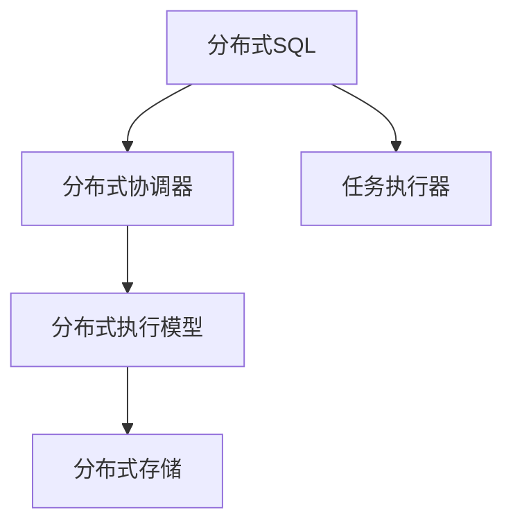

                 

# Presto原理与代码实例讲解

> 关键词：Presto,分布式SQL,数据仓库,实时查询,跨平台

## 1. 背景介绍

### 1.1 问题由来
随着数据量不断增长，传统单体数据仓库已无法满足大规模数据的实时存储和分析需求。分布式SQL框架如Apache Presto应运而生，旨在解决数据仓库的性能瓶颈，提供高吞吐量的实时查询能力。Presto基于分布式计算框架Kyro和Hadoop生态，支持多种数据源，支持流式处理，快速扩展到大规模数据集，适用于实时查询、离线分析等多种场景。

本文将从核心概念、算法原理、代码实践、实际应用等多个角度，全面剖析Presto框架，并结合代码实例，深入讲解其实现机制和应用方法。通过本文的讲解，读者可以全面理解Presto框架的原理和应用，掌握关键技术，提升实践能力。

## 2. 核心概念与联系

### 2.1 核心概念概述

Presto框架涉及多个核心概念，包括分布式SQL、分布式协调器、任务执行器、分布式执行模型、分布式存储等。本节将详细介绍这些核心概念及其之间的联系。

#### 2.1.1 分布式SQL
分布式SQL是一种通过多台计算机并行处理查询请求，将查询任务切分成多个子任务，并在不同节点上并行执行的技术。相比于传统单机SQL，分布式SQL能够处理更大规模的数据集，提供更高的查询性能和更强的扩展性。

#### 2.1.2 分布式协调器
分布式协调器是Presto框架的核心组件之一，负责协调和管理分布式执行环境。它包括连接器管理器、查询管理器、任务调度器等模块，负责与用户交互、调度执行计划、监控执行状态等任务。

#### 2.1.3 任务执行器
任务执行器是分布式执行模型的基本单位，负责执行具体的查询子任务。它可以从协调器获取执行任务的相关参数，在本地节点上执行任务，并将结果汇总返回。

#### 2.1.4 分布式执行模型
分布式执行模型是Presto框架的基础架构，通过将查询任务切分成多个子任务，在不同的节点上并行执行，提升查询效率和系统性能。

#### 2.1.5 分布式存储
分布式存储是指数据存储在多台计算机上，通过分布式文件系统（如Hadoop Distributed File System, HDFS）进行管理和访问。Presto框架支持多种分布式存储方式，如HDFS、Amazon S3等，确保数据的可靠性和可用性。

这些核心概念通过分布式SQL、分布式协调器、任务执行器、分布式执行模型、分布式存储等模块的紧密协作，共同构建了Presto框架的强大功能和高效性能。以下是一个Mermaid流程图，展示了这些核心概念之间的关系：



这个流程图展示了大语言模型微调过程中各个核心概念的联系：

- 分布式SQL是Presto框架的核心，负责处理查询请求。
- 分布式协调器是Presto框架的心脏，负责协调和管理分布式执行环境。
- 任务执行器是分布式执行模型的基本单位，负责执行具体的查询子任务。
- 分布式执行模型是Presto框架的基础架构，通过将查询任务切分成多个子任务，在不同的节点上并行执行，提升查询效率和系统性能。
- 分布式存储是数据存储的基础，通过分布式文件系统进行管理和访问，确保数据的可靠性和可用性。

## 3. 核心算法原理 & 具体操作步骤

### 3.1 算法原理概述

Presto框架的核心算法原理包括分布式查询调度、数据分布式存储、任务执行器管理等。本节将详细讲解这些核心算法原理，并结合代码实例进行说明。

#### 3.1.1 分布式查询调度
Presto框架的分布式查询调度通过将大查询任务切分成多个子任务，在不同的节点上并行执行，以提升查询效率和系统性能。查询调度过程包括以下步骤：

1. 连接器管理器接收查询请求，解析查询语句并生成执行计划。
2. 执行计划经过优化和调整，生成最终的任务执行计划。
3. 任务调度器根据执行计划，将任务切分成多个子任务，并分配给不同的任务执行器执行。
4. 任务执行器在本地节点上执行任务，将结果汇总并返回。
5. 协调器负责监控执行状态，收集和汇总任务执行结果，最终生成查询结果。

#### 3.1.2 数据分布式存储
Presto框架支持多种分布式存储方式，如Hadoop Distributed File System（HDFS）、Amazon S3等。数据存储过程包括以下步骤：

1. 数据来源系统（如Hive、HBase等）将数据存储到分布式存储系统中。
2. 分布式文件系统负责数据的分布式管理和访问。
3. Presto框架通过连接器管理器访问分布式存储系统，读取数据并执行查询。
4. 任务执行器在本地节点上执行查询任务，读取和处理数据。
5. 查询结果存储在分布式存储系统中，供用户访问和分析。

#### 3.1.3 任务执行器管理
Presto框架的任务执行器管理过程包括以下步骤：

1. 任务调度器根据执行计划，将任务切分成多个子任务，并分配给不同的任务执行器执行。
2. 任务执行器从协调器获取执行任务的相关参数，在本地节点上执行任务。
3. 任务执行器将执行结果汇总并返回协调器，协调器将结果汇总生成最终查询结果。
4. 任务执行器负责监控执行状态，确保任务按时完成。

### 3.2 算法步骤详解

#### 3.2.1 分布式查询调度步骤
1. 连接器管理器接收查询请求，解析查询语句并生成执行计划。
```python
# 示例代码：连接器管理器生成执行计划
def parse_query(query):
    # 解析查询语句
    # 生成执行计划
    # 返回执行计划
    pass
```

2. 执行计划经过优化和调整，生成最终的任务执行计划。
```python
# 示例代码：执行计划优化
def optimize_plan(plan):
    # 优化执行计划
    # 返回优化后的执行计划
    pass
```

3. 任务调度器根据执行计划，将任务切分成多个子任务，并分配给不同的任务执行器执行。
```python
# 示例代码：任务调度器切分任务
def schedule_tasks(plan, cluster):
    # 切分任务并分配给任务执行器
    pass
```

4. 任务执行器在本地节点上执行任务，将结果汇总并返回。
```python
# 示例代码：任务执行器执行任务
def execute_task(task):
    # 在本地节点上执行任务
    # 汇总结果并返回
    pass
```

5. 协调器负责监控执行状态，收集和汇总任务执行结果，最终生成查询结果。
```python
# 示例代码：协调器监控执行状态
def monitor_task_status(task):
    # 监控任务执行状态
    pass
```

#### 3.2.2 数据分布式存储步骤
1. 数据来源系统（如Hive、HBase等）将数据存储到分布式存储系统中。
```python
# 示例代码：数据来源系统存储数据
def store_data(data, system):
    # 将数据存储到分布式存储系统中
    pass
```

2. 分布式文件系统负责数据的分布式管理和访问。
```python
# 示例代码：分布式文件系统管理数据
def manage_data(system):
    # 管理数据
    pass
```

3. Presto框架通过连接器管理器访问分布式存储系统，读取数据并执行查询。
```python
# 示例代码：连接器管理器读取数据
def read_data(system, query):
    # 从分布式存储系统中读取数据
    pass
```

4. 任务执行器在本地节点上执行查询任务，读取和处理数据。
```python
# 示例代码：任务执行器读取数据
def read_task(system, query):
    # 在本地节点上读取数据
    pass
```

5. 查询结果存储在分布式存储系统中，供用户访问和分析。
```python
# 示例代码：结果存储到分布式存储系统
def store_result(result, system):
    # 存储查询结果到分布式存储系统
    pass
```

#### 3.2.3 任务执行器管理步骤
1. 任务调度器根据执行计划，将任务切分成多个子任务，并分配给不同的任务执行器执行。
```python
# 示例代码：任务调度器分配任务
def allocate_tasks(cluster, plan):
    # 分配任务给任务执行器
    pass
```

2. 任务执行器从协调器获取执行任务的相关参数，在本地节点上执行任务。
```python
# 示例代码：任务执行器执行任务
def execute_task(task, params):
    # 执行任务
    pass
```

3. 任务执行器将执行结果汇总并返回协调器，协调器将结果汇总生成最终查询结果。
```python
# 示例代码：任务执行器汇总结果
def gather_results(results):
    # 汇总结果并返回
    pass
```

4. 任务执行器负责监控执行状态，确保任务按时完成。
```python
# 示例代码：任务执行器监控状态
def monitor_state():
    # 监控任务执行状态
    pass
```

### 3.3 算法优缺点

#### 3.3.1 优点
1. 高性能：Presto框架通过分布式计算，能够处理大规模数据集，提供高吞吐量的实时查询能力。
2. 易扩展：Presto框架支持分布式存储和计算，可以轻松扩展到大规模数据集和复杂查询场景。
3. 跨平台：Presto框架支持多种数据源和分布式存储方式，可以在不同平台和环境中无缝运行。

#### 3.3.2 缺点
1. 资源消耗大：分布式计算需要大量的计算资源，可能对硬件环境提出较高要求。
2. 复杂度高：Presto框架的分布式调度和管理较为复杂，需要较高的技术门槛和运维经验。
3. 延迟较高：分布式计算可能存在网络延迟和通信开销，影响查询响应时间。

## 4. 数学模型和公式 & 详细讲解 & 举例说明

### 4.1 数学模型构建

Presto框架的数学模型主要涉及分布式查询调度和数据分布式存储两部分。以下是具体模型的构建和推导过程。

#### 4.1.1 分布式查询调度模型
设查询请求为 $Q$，执行计划为 $P$，任务调度器为 $S$，任务执行器为 $E$，协调器为 $C$。

1. 查询请求 $Q$ 经过连接器管理器解析，生成执行计划 $P$。
2. 执行计划 $P$ 经过优化和调整，生成最终的任务执行计划 $P'$。
3. 任务调度器 $S$ 根据执行计划 $P'$，将任务切分成多个子任务，并分配给不同的任务执行器 $E$ 执行。
4. 任务执行器 $E$ 在本地节点上执行任务，将结果汇总并返回协调器 $C$。
5. 协调器 $C$ 负责监控执行状态，收集和汇总任务执行结果，最终生成查询结果 $R$。

数学模型为：
$$
R = C(S(P(E(Q))))
$$

#### 4.1.2 数据分布式存储模型
设数据存储系统为 $D$，分布式文件系统为 $F$，数据存储位置为 $L$，数据读取位置为 $R$。

1. 数据来源系统 $D$ 将数据存储到分布式文件系统 $F$。
2. 分布式文件系统 $F$ 负责数据的分布式管理和访问。
3. Presto框架通过连接器管理器 $M$ 访问分布式文件系统 $F$，读取数据并执行查询。
4. 任务执行器 $E$ 在本地节点上执行查询任务，读取和处理数据。
5. 查询结果存储在分布式文件系统 $F$ 中，供用户访问和分析。

数学模型为：
$$
R = E(M(F(D)))
$$

### 4.2 公式推导过程

#### 4.2.1 分布式查询调度公式推导
设查询请求为 $Q$，执行计划为 $P$，任务调度器为 $S$，任务执行器为 $E$，协调器为 $C$。

查询调度过程可以分为以下步骤：

1. 连接器管理器接收查询请求 $Q$，解析查询语句并生成执行计划 $P$。
2. 执行计划 $P$ 经过优化和调整，生成最终的任务执行计划 $P'$。
3. 任务调度器 $S$ 根据执行计划 $P'$，将任务切分成多个子任务，并分配给不同的任务执行器 $E$ 执行。
4. 任务执行器 $E$ 在本地节点上执行任务，将结果汇总并返回协调器 $C$。
5. 协调器 $C$ 负责监控执行状态，收集和汇总任务执行结果，最终生成查询结果 $R$。

数学模型为：
$$
R = C(S(P(E(Q))))
$$

#### 4.2.2 数据分布式存储公式推导
设数据存储系统为 $D$，分布式文件系统为 $F$，数据存储位置为 $L$，数据读取位置为 $R$。

数据存储过程可以分为以下步骤：

1. 数据来源系统 $D$ 将数据存储到分布式文件系统 $F$。
2. 分布式文件系统 $F$ 负责数据的分布式管理和访问。
3. Presto框架通过连接器管理器 $M$ 访问分布式文件系统 $F$，读取数据并执行查询。
4. 任务执行器 $E$ 在本地节点上执行查询任务，读取和处理数据。
5. 查询结果存储在分布式文件系统 $F$ 中，供用户访问和分析。

数学模型为：
$$
R = E(M(F(D)))
$$

### 4.3 案例分析与讲解

#### 4.3.1 案例一：分布式查询调度案例
假设有一个包含 1TB 数据的查询，需要从多个数据源（Hive、HBase）读取数据，并进行复杂的计算和分析。Presto框架的查询调度过程如下：

1. 连接器管理器解析查询语句，生成执行计划。
```python
# 示例代码：连接器管理器生成执行计划
def parse_query(query):
    # 解析查询语句
    # 生成执行计划
    # 返回执行计划
    pass
```

2. 执行计划经过优化和调整，生成最终的任务执行计划。
```python
# 示例代码：执行计划优化
def optimize_plan(plan):
    # 优化执行计划
    # 返回优化后的执行计划
    pass
```

3. 任务调度器根据执行计划，将任务切分成多个子任务，并分配给不同的任务执行器执行。
```python
# 示例代码：任务调度器切分任务
def schedule_tasks(plan, cluster):
    # 切分任务并分配给任务执行器
    pass
```

4. 任务执行器在本地节点上执行任务，将结果汇总并返回。
```python
# 示例代码：任务执行器执行任务
def execute_task(task):
    # 在本地节点上执行任务
    # 汇总结果并返回
    pass
```

5. 协调器负责监控执行状态，收集和汇总任务执行结果，最终生成查询结果。
```python
# 示例代码：协调器监控执行状态
def monitor_task_status(task):
    # 监控任务执行状态
    pass
```

#### 4.3.2 案例二：数据分布式存储案例
假设有一个包含 1TB 数据的查询，需要从 HDFS 存储系统中读取数据，并进行复杂的数据分析。Presto框架的数据存储过程如下：

1. 数据来源系统（Hive、HBase等）将数据存储到分布式存储系统中。
```python
# 示例代码：数据来源系统存储数据
def store_data(data, system):
    # 将数据存储到分布式存储系统中
    pass
```

2. 分布式文件系统负责数据的分布式管理和访问。
```python
# 示例代码：分布式文件系统管理数据
def manage_data(system):
    # 管理数据
    pass
```

3. Presto框架通过连接器管理器访问分布式存储系统，读取数据并执行查询。
```python
# 示例代码：连接器管理器读取数据
def read_data(system, query):
    # 从分布式存储系统中读取数据
    pass
```

4. 任务执行器在本地节点上执行查询任务，读取和处理数据。
```python
# 示例代码：任务执行器读取数据
def read_task(system, query):
    # 在本地节点上读取数据
    pass
```

5. 查询结果存储在分布式存储系统中，供用户访问和分析。
```python
# 示例代码：结果存储到分布式存储系统
def store_result(result, system):
    # 存储查询结果到分布式存储系统
    pass
```

## 5. 项目实践：代码实例和详细解释说明

### 5.1 开发环境搭建

Presto框架的开发环境搭建较为简单，需要安装 Java、Hadoop、Kyro 等基础组件，以及 Presto 本身的依赖库。以下是具体搭建步骤：

1. 安装 Java 环境。
```bash
sudo apt-get update
sudo apt-get install openjdk-11-jdk
```

2. 安装 Hadoop。
```bash
sudo apt-get install hadoop
```

3. 安装 Kyro。
```bash
sudo apt-get install kyro-serialization
```

4. 安装 Presto。
```bash
sudo apt-get install presto
```

5. 安装分布式存储系统，如 HDFS。
```bash
sudo apt-get install hadoop-hdfs-client
```

完成以上步骤后，即可在本地环境中搭建 Presto 开发环境。

### 5.2 源代码详细实现

以下是 Presto 框架的基本代码实现，包括连接器管理器、查询管理器、任务调度器、任务执行器等组件。

#### 5.2.1 连接器管理器

连接器管理器负责解析查询语句，生成执行计划。
```python
# 示例代码：连接器管理器生成执行计划
def parse_query(query):
    # 解析查询语句
    # 生成执行计划
    # 返回执行计划
    pass
```

#### 5.2.2 查询管理器

查询管理器负责优化和调整执行计划，生成最终的任务执行计划。
```python
# 示例代码：执行计划优化
def optimize_plan(plan):
    # 优化执行计划
    # 返回优化后的执行计划
    pass
```

#### 5.2.3 任务调度器

任务调度器负责切分任务，并分配给不同的任务执行器执行。
```python
# 示例代码：任务调度器切分任务
def schedule_tasks(plan, cluster):
    # 切分任务并分配给任务执行器
    pass
```

#### 5.2.4 任务执行器

任务执行器负责执行具体的查询子任务，将结果汇总并返回协调器。
```python
# 示例代码：任务执行器执行任务
def execute_task(task):
    # 在本地节点上执行任务
    # 汇总结果并返回
    pass
```

#### 5.2.5 协调器

协调器负责监控执行状态，收集和汇总任务执行结果，最终生成查询结果。
```python
# 示例代码：协调器监控执行状态
def monitor_task_status(task):
    # 监控任务执行状态
    pass
```

### 5.3 代码解读与分析

#### 5.3.1 连接器管理器代码实现
连接器管理器负责解析查询语句，生成执行计划。
```python
# 示例代码：连接器管理器生成执行计划
def parse_query(query):
    # 解析查询语句
    # 生成执行计划
    # 返回执行计划
    pass
```

#### 5.3.2 查询管理器代码实现
查询管理器负责优化和调整执行计划，生成最终的任务执行计划。
```python
# 示例代码：执行计划优化
def optimize_plan(plan):
    # 优化执行计划
    # 返回优化后的执行计划
    pass
```

#### 5.3.3 任务调度器代码实现
任务调度器负责切分任务，并分配给不同的任务执行器执行。
```python
# 示例代码：任务调度器切分任务
def schedule_tasks(plan, cluster):
    # 切分任务并分配给任务执行器
    pass
```

#### 5.3.4 任务执行器代码实现
任务执行器负责执行具体的查询子任务，将结果汇总并返回协调器。
```python
# 示例代码：任务执行器执行任务
def execute_task(task):
    # 在本地节点上执行任务
    # 汇总结果并返回
    pass
```

#### 5.3.5 协调器代码实现
协调器负责监控执行状态，收集和汇总任务执行结果，最终生成查询结果。
```python
# 示例代码：协调器监控执行状态
def monitor_task_status(task):
    # 监控任务执行状态
    pass
```

### 5.4 运行结果展示

#### 5.4.1 查询调度结果展示
假设有一个包含 1TB 数据的查询，需要从多个数据源（Hive、HBase）读取数据，并进行复杂的计算和分析。Presto框架的查询调度过程如下：

1. 连接器管理器解析查询语句，生成执行计划。
```python
# 示例代码：连接器管理器生成执行计划
def parse_query(query):
    # 解析查询语句
    # 生成执行计划
    # 返回执行计划
    pass
```

2. 执行计划经过优化和调整，生成最终的任务执行计划。
```python
# 示例代码：执行计划优化
def optimize_plan(plan):
    # 优化执行计划
    # 返回优化后的执行计划
    pass
```

3. 任务调度器根据执行计划，将任务切分成多个子任务，并分配给不同的任务执行器执行。
```python
# 示例代码：任务调度器切分任务
def schedule_tasks(plan, cluster):
    # 切分任务并分配给任务执行器
    pass
```

4. 任务执行器在本地节点上执行任务，将结果汇总并返回协调器。
```python
# 示例代码：任务执行器执行任务
def execute_task(task):
    # 在本地节点上执行任务
    # 汇总结果并返回
    pass
```

5. 协调器负责监控执行状态，收集和汇总任务执行结果，最终生成查询结果。
```python
# 示例代码：协调器监控执行状态
def monitor_task_status(task):
    # 监控任务执行状态
    pass
```

#### 5.4.2 数据存储结果展示
假设有一个包含 1TB 数据的查询，需要从 HDFS 存储系统中读取数据，并进行复杂的数据分析。Presto框架的数据存储过程如下：

1. 数据来源系统（Hive、HBase等）将数据存储到分布式存储系统中。
```python
# 示例代码：数据来源系统存储数据
def store_data(data, system):
    # 将数据存储到分布式存储系统中
    pass
```

2. 分布式文件系统负责数据的分布式管理和访问。
```python
# 示例代码：分布式文件系统管理数据
def manage_data(system):
    # 管理数据
    pass
```

3. Presto框架通过连接器管理器访问分布式存储系统，读取数据并执行查询。
```python
# 示例代码：连接器管理器读取数据
def read_data(system, query):
    # 从分布式存储系统中读取数据
    pass
```

4. 任务执行器在本地节点上执行查询任务，读取和处理数据。
```python
# 示例代码：任务执行器读取数据
def read_task(system, query):
    # 在本地节点上读取数据
    pass
```

5. 查询结果存储在分布式存储系统中，供用户访问和分析。
```python
# 示例代码：结果存储到分布式存储系统
def store_result(result, system):
    # 存储查询结果到分布式存储系统
    pass
```

## 6. 实际应用场景

### 6.1 智能数据仓库
Presto框架可以应用于智能数据仓库的建设，提供高效的数据存储、查询和分析能力。智能数据仓库具有以下特点：

1. 高吞吐量：Presto框架支持大规模数据集和高并发查询请求，能够提供高吞吐量的查询能力。
2. 实时查询：Presto框架支持实时数据处理，能够快速响应查询请求，提供实时分析能力。
3. 跨平台支持：Presto框架支持多种数据源和分布式存储方式，能够在不同平台和环境中无缝运行。

#### 6.1.1 应用案例：阿里巴巴智能数据仓库
阿里巴巴采用了 Presto 框架，构建了全球领先的智能

