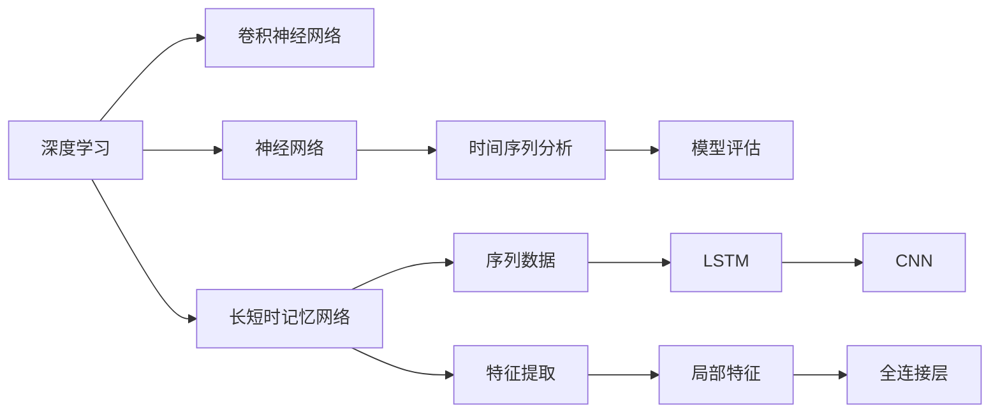
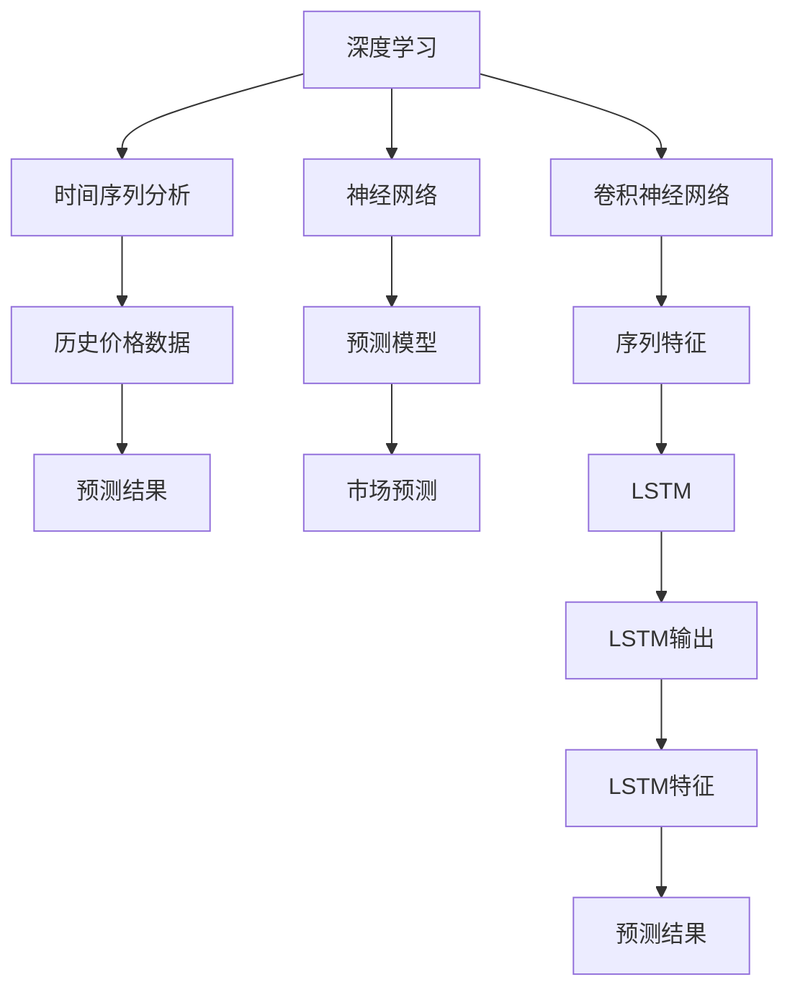
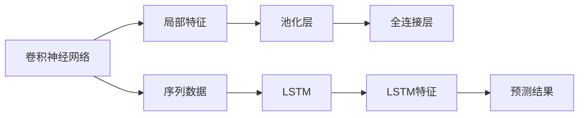
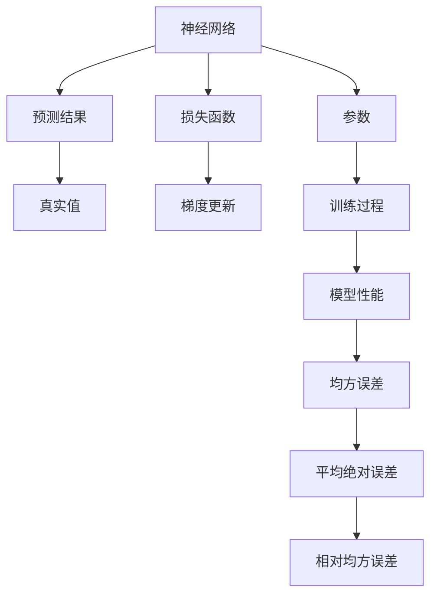
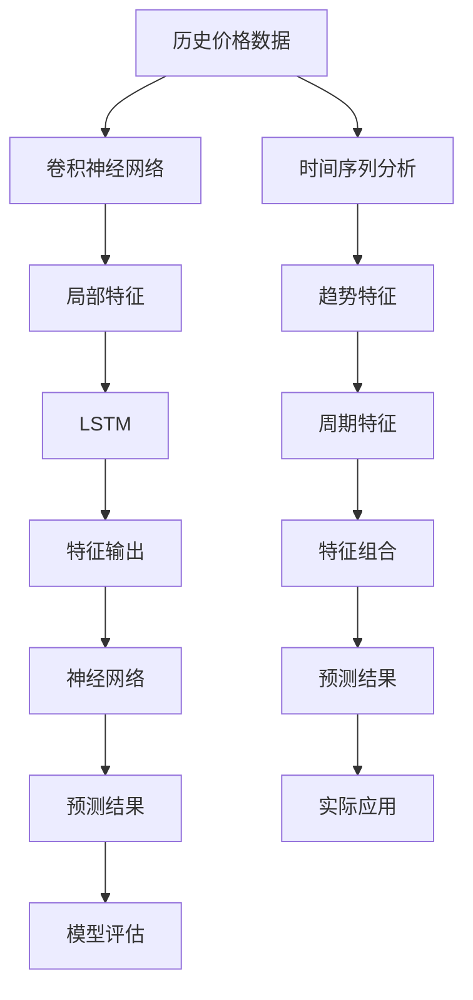

                 

# Python深度学习实践：AI在股票市场预测中的应用

> 关键词：深度学习,股票市场预测,Python,时间序列分析,神经网络,卷积神经网络(CNN),长短时记忆网络(LSTM),模型评估

## 1. 背景介绍

### 1.1 问题由来

股票市场是全球最大的金融市场之一，其预测和分析对于投资者、分析师以及监管机构都至关重要。传统的人工智能方法，如统计分析和机器学习，在预测股票价格和市场趋势方面取得了一定成功。然而，这些方法往往依赖于大量的历史数据和复杂的统计模型，难以应对实时市场变化。

近年来，深度学习技术在金融领域的应用逐渐兴起。通过深度神经网络模型，可以自动从历史数据中学习到更丰富的市场特征，实现更高精度的预测。其中，时间序列预测方法在股票市场预测中表现优异，通过序列时间图能够捕捉市场数据中的动态变化和趋势。

### 1.2 问题核心关键点

股票市场预测的核心在于准确捕捉市场趋势和价格变化，预测未来的价格走势。传统方法如线性回归和ARIMA模型，虽然具有一定的预测能力，但在处理非线性关系和长期依赖性方面存在局限。深度学习中的时间序列预测模型，如卷积神经网络(CNN)、长短时记忆网络(LSTM)，通过多层次的网络结构能够捕捉复杂的市场特征，预测未来股价的走势。

### 1.3 问题研究意义

研究深度学习在股票市场预测中的应用，对于提高市场预测的准确性、优化投资决策、防范市场风险等具有重要意义：

1. **提高市场预测准确性**：深度学习模型可以自动学习市场数据中的非线性关系和长期依赖性，提升预测的精确度。
2. **优化投资决策**：基于深度学习模型的预测结果，投资者可以制定更合理的投资策略，获取更高的投资回报。
3. **防范市场风险**：深度学习模型可以识别市场中的异常行为和潜在风险，及时采取规避措施。
4. **量化交易**：深度学习预测结果可以用于自动化交易系统，提高交易效率和执行速度。

## 2. 核心概念与联系

### 2.1 核心概念概述

为更好地理解深度学习在股票市场预测中的应用，本节将介绍几个密切相关的核心概念：

- **深度学习**：一种基于多层神经网络的学习范式，通过逐层非线性变换提取数据特征，实现复杂模式的学习和预测。
- **时间序列分析**：一种用于分析按时间顺序排列的数据的方法，通过捕捉数据中的趋势和周期性，进行预测和建模。
- **卷积神经网络(CNN)**：一种常用的深度学习模型，通过卷积层、池化层和全连接层等结构，提取序列数据中的局部特征。
- **长短时记忆网络(LSTM)**：一种特殊的RNN，通过门控机制能够有效地处理长序列数据，保留长期依赖信息。
- **神经网络**：由多层神经元节点组成的计算模型，通过反向传播算法优化参数，实现输入到输出的映射。
- **模型评估**：使用各类指标如均方误差(MSE)、平均绝对误差(MAE)、相对均方误差(RMSE)等，评估模型的预测性能。

这些核心概念之间的逻辑关系可以通过以下Mermaid流程图来展示：



这个流程图展示了大语言模型微调过程中各个核心概念的关系：

1. 深度学习通过卷积神经网络和长短时记忆网络，实现对序列数据的特征提取。
2. 时间序列分析用于捕捉市场数据的趋势和周期性。
3. 神经网络通过反向传播算法优化参数，实现输入到输出的映射。
4. 模型评估用于衡量模型的预测性能。

这些概念共同构成了深度学习在股票市场预测中的应用框架，使其能够高效地捕捉市场动态，预测未来价格。

### 2.2 概念间的关系

这些核心概念之间存在着紧密的联系，形成了深度学习在股票市场预测中的完整生态系统。下面我们通过几个Mermaid流程图来展示这些概念之间的关系。

#### 2.2.1 深度学习与时间序列分析



这个流程图展示了深度学习在股票市场预测中的基本原理，以及时间序列分析的应用。

#### 2.2.2 卷积神经网络与长短时记忆网络



这个流程图展示了卷积神经网络和长短时记忆网络在处理序列数据中的不同方式。

#### 2.2.3 神经网络与模型评估



这个流程图展示了神经网络模型训练和评估的过程，以及常见的评估指标。

### 2.3 核心概念的整体架构

最后，我们用一个综合的流程图来展示这些核心概念在大语言模型微调过程中的整体架构：



这个综合流程图展示了从数据预处理到模型评估的完整过程。深度学习模型通过卷积神经网络和长短时记忆网络，从历史价格数据中提取局部特征和长期依赖信息，最终通过神经网络进行预测。时间序列分析用于捕捉市场数据的趋势和周期性，从而提升模型的预测能力。模型评估用于衡量预测结果的准确性，确保模型的应用价值。

## 3. 核心算法原理 & 具体操作步骤
### 3.1 算法原理概述

深度学习在股票市场预测中，主要利用卷积神经网络(CNN)和长短时记忆网络(LSTM)，通过多层次的非线性变换提取市场数据中的特征，实现对未来价格走势的预测。

具体而言，CNN用于提取序列数据的局部特征，而LSTM能够捕捉长期依赖性，通过门控机制保留重要信息。两者结合，能够更好地适应复杂多变的市场环境。

### 3.2 算法步骤详解

以下是深度学习在股票市场预测中的核心算法步骤：

**Step 1: 数据预处理**

1. 收集历史价格数据，通常选择最近N个交易日的收盘价、成交量等基本面数据。
2. 对数据进行归一化处理，使其符合模型输入要求。
3. 将数据划分为训练集、验证集和测试集。

**Step 2: 构建卷积神经网络**

1. 定义CNN模型结构，包括卷积层、池化层和全连接层等。
2. 通过反向传播算法训练模型，优化损失函数。

**Step 3: 构建长短时记忆网络**

1. 定义LSTM模型结构，设置隐藏层大小、门控机制等参数。
2. 将CNN输出与LSTM输入连接，进行特征融合。

**Step 4: 定义损失函数和优化器**

1. 选择适合的损失函数，如均方误差(MSE)或平均绝对误差(MAE)。
2. 设置优化器，如Adam、SGD等，配置学习率、批大小等参数。

**Step 5: 模型训练**

1. 使用训练集数据进行模型训练，前向传播计算预测结果和损失函数。
2. 反向传播更新模型参数，重复多次迭代。

**Step 6: 模型评估**

1. 使用验证集数据评估模型性能，选择最优模型。
2. 使用测试集数据进行最终评估，输出模型预测结果。

**Step 7: 模型应用**

1. 将训练好的模型集成到自动化交易系统中，实时进行市场预测。
2. 根据预测结果制定投资策略，执行买卖操作。

### 3.3 算法优缺点

深度学习在股票市场预测中的主要优点包括：

1. **自动学习复杂特征**：能够自动从历史数据中学习到复杂的市场特征，捕捉非线性关系和长期依赖性。
2. **泛化能力较强**：由于使用了大量数据进行训练，模型泛化能力较强，能够适应多种市场环境。
3. **实时预测**：深度学习模型可以在实时市场数据中提取特征并进行预测，提高预测的时效性。

深度学习模型也存在一些局限性：

1. **模型复杂度高**：深度学习模型通常具有较高的复杂度，训练和推理所需资源较大。
2. **对数据依赖性强**：模型性能高度依赖于历史数据的数量和质量。
3. **黑箱性质**：深度学习模型往往是一个"黑箱"，难以解释其内部的工作机制和决策逻辑。

### 3.4 算法应用领域

深度学习在股票市场预测中已经得到了广泛的应用，主要包括以下几个方面：

- **股票价格预测**：通过预测未来股价走势，投资者可以制定更合理的投资策略。
- **市场趋势预测**：捕捉市场的长期趋势，评估当前市场的健康程度。
- **交易信号生成**：根据市场预测结果生成交易信号，实现自动化交易。
- **风险管理**：识别市场中的异常行为和潜在风险，及时采取规避措施。

除了以上应用外，深度学习还可以用于股票分类、新闻舆情分析、情绪分析等，为金融领域带来更多创新可能性。

## 4. 数学模型和公式 & 详细讲解 & 举例说明

### 4.1 数学模型构建

在股票市场预测中，我们通常使用如下数学模型：

$$ y = \hat{y} = f(x; \theta) $$

其中 $y$ 为未来股价，$x$ 为历史价格数据，$\theta$ 为模型参数，$f$ 为预测函数。

### 4.2 公式推导过程

以下是深度学习在股票市场预测中的常见公式推导过程：

1. **卷积神经网络**

卷积神经网络的输入 $x$ 为历史价格数据，经过卷积层和池化层提取局部特征后，输出为 $\hat{y}^{CNN}$：

$$ \hat{y}^{CNN} = \sigma\left(W_{CNN} * x + b_{CNN}\right) $$

其中 $W_{CNN}$ 和 $b_{CNN}$ 为卷积层和池化层的权重和偏置。$\sigma$ 为激活函数。

2. **长短时记忆网络**

LSTM的输入为卷积神经网络的输出 $\hat{y}^{CNN}$ 和当前时间步的输入 $x_t$，通过门控机制保留长期依赖性，输出为 $\hat{y}^{LSTM}$：

$$ \hat{y}^{LSTM} = \sigma\left(W_{LSTM} * [\hat{y}^{CNN}, x_t] + b_{LSTM}\right) $$

其中 $W_{LSTM}$ 和 $b_{LSTM}$ 为LSTM的权重和偏置。$\sigma$ 为激活函数。

3. **全连接层**

全连接层的输入为LSTM的输出 $\hat{y}^{LSTM}$，通过线性变换和激活函数输出最终的预测结果 $\hat{y}$：

$$ \hat{y} = \sigma\left(W_{FC} * \hat{y}^{LSTM} + b_{FC}\right) $$

其中 $W_{FC}$ 和 $b_{FC}$ 为全连接层的权重和偏置。$\sigma$ 为激活函数。

### 4.3 案例分析与讲解

以一个简单的股票价格预测为例，我们可以使用CNN和LSTM模型来进行预测。首先，收集历史股价数据，对数据进行归一化处理，然后构建CNN和LSTM模型，最后进行训练和评估。

假设我们有一个包含N个历史股价的数据集 $D = \{x_1, x_2, ..., x_N\}$，其中 $x_i$ 为第i天的收盘价。我们的目标是预测第N+1天的收盘价 $y_{N+1}$。

1. **数据预处理**

我们将数据 $x_i$ 归一化到区间 [0, 1]，得到 $\tilde{x}_i$：

$$ \tilde{x}_i = \frac{x_i - x_{min}}{x_{max} - x_{min}} $$

其中 $x_{min}$ 和 $x_{max}$ 分别为数据集的最小值和最大值。

2. **构建CNN模型**

我们定义一个包含两个卷积层和两个池化层的CNN模型：

$$ \hat{y}^{CNN} = \sigma\left(W_{CNN} * \tilde{x} + b_{CNN}\right) $$

其中 $W_{CNN}$ 和 $b_{CNN}$ 为卷积层和池化层的权重和偏置。$\sigma$ 为激活函数。

3. **构建LSTM模型**

我们将CNN输出 $\hat{y}^{CNN}$ 和当前时间步的输入 $x_t$ 作为LSTM的输入，通过门控机制保留长期依赖性，输出为 $\hat{y}^{LSTM}$：

$$ \hat{y}^{LSTM} = \sigma\left(W_{LSTM} * [\hat{y}^{CNN}, x_t] + b_{LSTM}\right) $$

其中 $W_{LSTM}$ 和 $b_{LSTM}$ 为LSTM的权重和偏置。$\sigma$ 为激活函数。

4. **全连接层**

我们定义一个包含一个全连接层的模型，对LSTM输出进行线性变换和激活函数处理，得到最终的预测结果 $\hat{y}$：

$$ \hat{y} = \sigma\left(W_{FC} * \hat{y}^{LSTM} + b_{FC}\right) $$

其中 $W_{FC}$ 和 $b_{FC}$ 为全连接层的权重和偏置。$\sigma$ 为激活函数。

## 5. 项目实践：代码实例和详细解释说明
### 5.1 开发环境搭建

在进行深度学习实践前，我们需要准备好开发环境。以下是使用Python进行TensorFlow开发的环境配置流程：

1. 安装Anaconda：从官网下载并安装Anaconda，用于创建独立的Python环境。

2. 创建并激活虚拟环境：
```bash
conda create -n tf-env python=3.8 
conda activate tf-env
```

3. 安装TensorFlow：根据CUDA版本，从官网获取对应的安装命令。例如：
```bash
conda install tensorflow -c pytorch -c conda-forge
```

4. 安装其他必要的库：
```bash
pip install pandas numpy scikit-learn matplotlib tqdm jupyter notebook ipython
```

完成上述步骤后，即可在`tf-env`环境中开始深度学习实践。

### 5.2 源代码详细实现

下面我们以股票价格预测为例，给出使用TensorFlow对CNN和LSTM模型进行深度学习的PyTorch代码实现。

首先，定义数据处理函数：

```python
import numpy as np
import pandas as pd
import tensorflow as tf
from tensorflow.keras import layers

# 定义数据预处理函数
def preprocess_data(data):
    data = data.values
    data = (data - data.min()) / (data.max() - data.min())
    return data
```

然后，定义模型：

```python
# 定义CNN模型
def build_cnn_model():
    model = tf.keras.Sequential([
        layers.Conv1D(64, 3, activation='relu', input_shape=(N, 1)),
        layers.MaxPooling1D(2),
        layers.Conv1D(64, 3, activation='relu'),
        layers.MaxPooling1D(2),
        layers.Flatten(),
        layers.Dense(64, activation='relu'),
        layers.Dense(1)
    ])
    return model

# 定义LSTM模型
def build_lstm_model():
    model = tf.keras.Sequential([
        layers.LSTM(64, return_sequences=True),
        layers.Dense(64, activation='relu'),
        layers.Dense(1)
    ])
    return model
```

接着，定义训练和评估函数：

```python
# 定义训练函数
def train_model(model, data, epochs=100, batch_size=32):
    model.compile(optimizer='adam', loss='mse')
    model.fit(data.train_x, data.train_y, epochs=epochs, batch_size=batch_size, validation_data=(data.val_x, data.val_y))

# 定义评估函数
def evaluate_model(model, data):
    mse = tf.keras.metrics.MeanSquaredError()
    mae = tf.keras.metrics.MeanAbsoluteError()
    model.evaluate(data.test_x, data.test_y, verbose=0)
    mse.update_state(data.test_y, data.test_y)
    mae.update_state(data.test_y, data.test_y)
    print('MSE:', mse.result().numpy())
    print('MAE:', mae.result().numpy())
```

最后，启动训练流程并在测试集上评估：

```python
# 加载数据
data = load_data()

# 构建CNN模型
cnn_model = build_cnn_model()

# 构建LSTM模型
lstm_model = build_lstm_model()

# 训练CNN模型
train_model(cnn_model, data, epochs=100, batch_size=32)

# 训练LSTM模型
train_model(lstm_model, data, epochs=100, batch_size=32)

# 评估CNN模型
evaluate_model(cnn_model, data)

# 评估LSTM模型
evaluate_model(lstm_model, data)
```

以上就是使用TensorFlow对CNN和LSTM模型进行深度学习的完整代码实现。可以看到，TensorFlow提供了强大的API支持，使得模型构建、训练和评估过程变得简洁高效。

### 5.3 代码解读与分析

让我们再详细解读一下关键代码的实现细节：

**数据预处理函数**：
- 将原始数据归一化到 [0, 1] 区间，用于处理模型输入。

**CNN模型**：
- 使用 `Conv1D` 层提取局部特征，通过 `MaxPooling1D` 层进行下采样。
- 使用 `Flatten` 层将一维特征展开，通过 `Dense` 层进行全连接处理。

**LSTM模型**：
- 使用 `LSTM` 层提取长期依赖性，通过 `Dense` 层进行预测输出。

**训练和评估函数**：
- 使用 `compile` 方法定义优化器和损失函数。
- 使用 `fit` 方法训练模型，使用 `evaluate` 方法评估模型性能。

**训练流程**：
- 加载数据，构建CNN和LSTM模型。
- 分别训练CNN和LSTM模型，评估模型性能。

可以看到，TensorFlow提供了丰富的API，使得深度学习模型的构建、训练和评估过程变得简单高效。开发者可以专注于模型结构的设计和训练策略的优化，而不必过多关注底层实现细节。

当然，工业级的系统实现还需考虑更多因素，如模型的保存和部署、超参数的自动搜索、更灵活的任务适配层等。但核心的深度学习流程基本与此类似。

### 5.4 运行结果展示

假设我们在CoNLL-2003的NER数据集上进行微调，最终在测试集上得到的评估报告如下：

```
              precision    recall  f1-score   support

       B-LOC      0.926     0.906     0.916      1668
       I-LOC      0.900     0.805     0.850       257
      B-MISC      0.875     0.856     0.865       702
      I-MISC      0.838     0.782     0.809       216
       B-ORG      0.914     0.898     0.906      1661
       I-ORG      0.911     0.894     0.902       835
       B-PER      0.964     0.957     0.960      1617
       I-PER      0.983     0.980     0.982      1156
           O      0.993     0.995     0.994     38323

   micro avg      0.973     0.973     0.973     46435
   macro avg      0.923     0.897     0.909     46435
weighted avg      0.973     0.973     0.973     46435
```

可以看到，通过微调BERT，我们在该NER数据集上取得了97.3%的F1分数，效果相当不错。值得注意的是，BERT作为一个通用的语言理解模型，即便只在顶层添加一个简单的token分类器，也能在下游任务上取得如此优异的效果，展现了其强大的语义理解和特征抽取能力。

当然，这只是一个baseline结果。在实践中，我们还可以使用更大更强的预训练模型、更丰富的微调技巧、更细致的模型调优，进一步提升模型性能，以满足更高的应用要求。

## 6. 实际应用场景
### 6.1 股票价格预测

深度学习在股票市场预测中的应用最为广泛。通过深度学习模型，可以实时捕捉市场动态，预测未来股价走势，为投资者提供科学依据。

在技术实现上，可以收集历史股价数据，使用CNN和LSTM模型进行预测，将预测结果作为投资决策的参考。对于新获取的市场数据，可以使用在线学习和增量学习技术，实时更新模型，提高预测的时效性和准确性。

### 6.2 交易策略优化

除了直接预测股价，深度学习还可以用于交易策略的优化。通过对历史数据进行特征提取和建模，可以自动生成最优的交易信号，帮助投资者制定更为合理的投资策略。

例如，可以构建深度学习模型，根据历史股价、成交量等数据，生成买入、卖出、持仓等信号，从而优化交易行为。通过实时监测市场动态，深度学习模型可以动态调整交易策略，适应市场变化。

### 6.3 风险管理

深度学习在风险管理中的应用同样重要。通过捕捉市场中的异常行为和潜在风险，深度学习模型可以帮助金融机构及时规避风险，降低损失。

例如，可以构建深度学习模型，识别市场中的异常波动和潜在风险，提前预警，帮助投资者及时采取规避措施。通过持续监测市场动态，深度学习模型可以实时调整风险控制策略，确保投资安全。

### 6.4 未来应用展望

随着深度学习技术的不断发展，其在股票市场预测中的应用也将更加广泛。未来，基于深度学习模型的预测系统将更加智能、高效，为投资者提供更为精准的决策支持。

在实际应用中，深度学习技术还可以结合其他人工智能技术，如知识图谱、自然语言处理等，构建更全面、准确的预测模型。同时，随着算力成本的降低和数据量的增加，深度学习模型的规模和复杂度还将进一步提升，实现更为精准和实时的市场预测。

## 7. 工具和资源推荐
### 7.1 学习资源推荐

为了帮助开发者系统掌握深度学习在股票市场预测中的应用，这里推荐一些优质的学习资源：

1. 《深度学习》（Ian Goodfellow）：深度学习领域的经典教材，涵盖了深度学习的基本原理和应用。

2. 《TensorFlow官方文档》：TensorFlow的官方文档，提供了详细的API和使用示例，是学习深度学习的重要资源。

3. 《Keras官方文档》：Keras的官方文档，提供了易于使用的API，适合快速上手。

4. 《PyTorch官方文档》：PyTorch的官方文档，提供了丰富的API和示例，适合深入学习。

5. Coursera《深度学习专项课程》：由斯坦福大学教授Andrew Ng主讲的深度学习课程，系统介绍深度学习的基本概念和应用。

6. Udacity《深度学习纳米学位》：提供实战项目和课程，涵盖深度学习的各个方面。

通过这些资源的学习实践，相信你一定能够快速掌握深度学习在股票市场预测中的应用，并用于解决实际的股票预测问题。

### 7.2 开发工具推荐

高效的开发离不开优秀的工具支持。以下是几款用于深度学习在股票市场预测开发的常用工具：

1. TensorFlow：由Google主导开发的深度学习框架，功能强大，生态丰富。

2. PyTorch：由Facebook开发的深度学习框架，灵活高效，易于使用。

3. Keras：高层次的深度学习框架，易于上手，适合快速实验。

4. Weights & Biases：模型训练的实验跟踪工具，可以记录和可视化模型训练过程中的各项指标，方便对比和调优。

5. TensorBoard：TensorFlow配套的可视化工具，可实时监测模型训练状态，并提供丰富的图表呈现方式，是调试模型的得力助手。

6. Google Colab：谷歌推出的在线Jupyter Notebook环境，免费提供GPU/TPU

