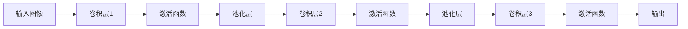
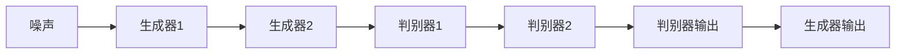
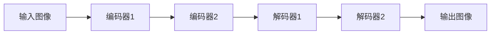

                 

# Python深度学习实践：图像超分辨率重建

> 关键词：图像超分辨率,深度学习,神经网络,Python,卷积神经网络(CNN),模型优化,训练技巧

## 1. 背景介绍

### 1.1 问题由来
图像超分辨率（Image Super-Resolution, ISR）是指将低分辨率图像通过深度学习等方法恢复成高分辨率图像的过程。随着计算机视觉技术的快速发展，超分辨率重建已经成为一个重要的研究方向，应用于医学影像、视频增强、虚拟现实等多个领域。

近年来，深度学习技术在图像处理领域的进展迅速，尤其是在卷积神经网络（Convolutional Neural Networks, CNN）的推动下，图像超分辨率重建取得了巨大的突破。以生成式对抗网络（Generative Adversarial Networks, GAN）和自编码器（Autoencoder）为代表的深度学习模型，通过学习图像的内在结构和特征，成功实现了超分辨率重建的目标。

本文将重点介绍基于Python的深度学习实践，特别是卷积神经网络在图像超分辨率重建中的应用。我们将从算法原理、具体操作步骤、数学模型和公式等方面详细阐述图像超分辨率重建的理论与实践。

## 2. 核心概念与联系

### 2.1 核心概念概述

图像超分辨率重建的核心概念包括：

- **卷积神经网络（CNN）**：CNN是一种深度学习模型，特别适合处理具有网格结构的数据，如图像、语音、文本等。CNN通过多层卷积和池化操作，能够自动提取数据的高层次特征。

- **生成式对抗网络（GAN）**：GAN由一个生成器和一个判别器组成，通过两个网络相互博弈的方式，生成逼真的高分辨率图像。

- **自编码器（Autoencoder）**：自编码器由一个编码器和解码器组成，通过最小化重构误差，实现数据的压缩和还原。

- **图像超分辨率（ISR）**：将低分辨率图像还原为高分辨率图像，可以采用单帧超分辨率或多帧超分辨率的方法。

- **神经网络优化**：为了提高超分辨率重建的效果，通常需要对神经网络模型进行优化，如梯度下降、自适应学习率、正则化等。

这些概念之间存在紧密的联系，CNN是实现超分辨率重建的基础模型，GAN和自编码器是两种常用的神经网络架构，用于提升图像质量。神经网络优化则是保证模型训练效果的关键。

### 2.2 概念间的关系

卷积神经网络是实现图像超分辨率重建的核心技术，其基本架构如下图所示：



该架构包括多个卷积和池化层，用于提取图像的特征。输入图像经过多次卷积和池化操作，逐渐降低分辨率，并提取高层次的特征。最后一层卷积后输出高分辨率的图像。

生成式对抗网络由一个生成器和一个判别器组成，其基本架构如下图所示：



生成器接收随机噪声，通过多层卷积和激活函数，逐步生成高分辨率的图像。判别器用于判断图像是否为真实图像，生成器通过与判别器博弈，逐渐优化生成图像的质量。

自编码器由一个编码器和解码器组成，其基本架构如下图所示：



编码器将输入图像压缩为低维的特征向量，解码器将特征向量还原为高分辨率的图像。自编码器通过最小化重构误差，实现图像的压缩和还原。

## 3. 核心算法原理 & 具体操作步骤

### 3.1 算法原理概述

图像超分辨率重建的算法原理可以概括为以下几步：

1. 数据预处理：将低分辨率图像缩放到统一大小，并进行标准化处理。
2. 特征提取：通过卷积神经网络提取图像的高层次特征。
3. 特征重构：通过反卷积操作将高维特征图还原为高分辨率图像。
4. 模型优化：通过梯度下降等优化算法更新模型参数，提升图像质量。

### 3.2 算法步骤详解

#### 3.2.1 数据预处理

数据预处理是超分辨率重建的重要步骤，通常包括以下几个步骤：

1. **缩放到统一大小**：将低分辨率图像缩放到统一大小，例如将输入图像缩放为4倍大小。
2. **标准化处理**：对图像进行归一化处理，使其均值为0，标准差为1，防止梯度消失。
3. **旋转和裁剪**：对图像进行随机旋转和裁剪，增强数据集的多样性。

以下是Python代码实现：

```python
import numpy as np
import cv2

def preprocess_image(image, size=4):
    # 缩放图像到指定大小
    image = cv2.resize(image, (image.shape[1]*size, image.shape[0]*size))
    # 标准化处理
    image = (image - image.mean()) / image.std()
    # 随机旋转和裁剪
    rows, cols, _ = image.shape
    angle = np.random.rand() * 45 - 22.5
    rows = rows//2
    cols = cols//2
    new_rows = int(rows + np.sin(angle) * cols)
    new_cols = int(cols + np.cos(angle) * rows)
    row = int(np.round(np.sin(angle) * new_cols))
    col = int(np.round(np.cos(angle) * new_rows))
    image = image[col:col+new_cols, row:row+new_rows]
    return image
```

#### 3.2.2 特征提取

特征提取是超分辨率重建的核心步骤，通常使用卷积神经网络实现。以下是一个简单的CNN架构：

```python
import torch
import torch.nn as nn
import torchvision.transforms as transforms

class CNN(nn.Module):
    def __init__(self):
        super(CNN, self).__init__()
        self.conv1 = nn.Conv2d(1, 32, kernel_size=3, padding=1)
        self.conv2 = nn.Conv2d(32, 32, kernel_size=3, padding=1)
        self.pool = nn.MaxPool2d(kernel_size=2, stride=2)
        self.fc1 = nn.Linear(32*4*4, 256)
        self.fc2 = nn.Linear(256, 1)
        self.sigmoid = nn.Sigmoid()

    def forward(self, x):
        x = self.conv1(x)
        x = nn.functional.relu(x)
        x = self.pool(x)
        x = self.conv2(x)
        x = nn.functional.relu(x)
        x = self.pool(x)
        x = x.view(-1, 32*4*4)
        x = self.fc1(x)
        x = nn.functional.relu(x)
        x = self.fc2(x)
        x = self.sigmoid(x)
        return x
```

#### 3.2.3 特征重构

特征重构是超分辨率重建的关键步骤，通常通过反卷积操作实现。以下是一个简单的反卷积操作：

```python
class Deconv(nn.Module):
    def __init__(self, in_channels, out_channels):
        super(Deconv, self).__init__()
        self.deconv = nn.ConvTranspose2d(in_channels, out_channels, kernel_size=3, padding=1)

    def forward(self, x):
        x = self.deconv(x)
        return x
```

#### 3.2.4 模型优化

模型优化是超分辨率重建的最终步骤，通常使用梯度下降等优化算法。以下是使用Adam优化器的代码：

```python
from torch.optim import Adam

optimizer = Adam(model.parameters(), lr=0.001)
```

### 3.3 算法优缺点

#### 3.3.1 优点

1. **高分辨率图像**：通过超分辨率重建，可以从低分辨率图像中获得高分辨率图像，弥补图像细节的缺失。
2. **实时处理**：基于深度学习的超分辨率重建，可以实时处理图像，适应快速变化的场景。
3. **通用性**：超分辨率重建适用于各种类型的图像，包括自然场景、医学影像、遥感影像等。

#### 3.3.2 缺点

1. **数据需求高**：超分辨率重建需要大量的低分辨率和高分辨率图像作为训练数据，数据需求较高。
2. **计算量大**：深度学习的超分辨率重建需要大量的计算资源，训练和推理时间较长。
3. **图像质量参差不齐**：超分辨率重建的效果受到输入图像质量和模型参数的影响，可能出现图像模糊、噪声等问题。

### 3.4 算法应用领域

图像超分辨率重建可以应用于多个领域，包括：

1. **医学影像**：通过超分辨率重建，可以获得更高的医学影像分辨率，帮助医生进行更精确的诊断和治疗。
2. **视频增强**：通过超分辨率重建，可以增强视频的分辨率，提升观看体验。
3. **虚拟现实**：通过超分辨率重建，可以生成高分辨率的虚拟现实图像，提供更好的沉浸感。
4. **自动驾驶**：通过超分辨率重建，可以提高自动驾驶车辆的前视摄像头分辨率，提供更清晰的图像信息。
5. **卫星遥感**：通过超分辨率重建，可以提升卫星遥感图像的分辨率，提高地理信息的准确性。

## 4. 数学模型和公式 & 详细讲解  
### 4.1 数学模型构建

超分辨率重建的数学模型可以概括为以下几步：

1. **输入图像**：将低分辨率图像表示为 $I_{low}$。
2. **卷积特征提取**：通过卷积神经网络 $F$ 提取图像的高层次特征。
3. **特征重构**：通过反卷积操作 $G$ 将高维特征图还原为高分辨率图像。
4. **输出图像**：将还原后的高分辨率图像表示为 $I_{high}$。

其中，输入图像 $I_{low}$ 和输出图像 $I_{high}$ 之间的关系可以表示为：

$$
I_{high} = G(F(I_{low}))
$$

### 4.2 公式推导过程

假设输入图像 $I_{low}$ 的大小为 $m \times n$，卷积特征提取层 $F$ 输出特征图的大小为 $p \times q$，反卷积操作 $G$ 输出的高分辨率图像 $I_{high}$ 的大小为 $m' \times n'$，其中 $m'$ 和 $n'$ 分别为原始图像的 $p$ 和 $q$ 倍。

设 $I_{low}$ 的像素值为 $x_{i,j}$，卷积特征提取层的输出特征图 $F(I_{low})$ 的像素值为 $y_{i,j}$，反卷积操作 $G$ 的输出高分辨率图像 $I_{high}$ 的像素值为 $z_{i,j}$。

超分辨率重建的公式可以表示为：

$$
z_{i,j} = G(F(x_{i,j}))
$$

其中，$F$ 和 $G$ 分别表示卷积特征提取和反卷积操作的权重矩阵。

### 4.3 案例分析与讲解

以下是一个简单的超分辨率重建案例，使用卷积神经网络实现：

1. **输入图像**：将低分辨率图像 $I_{low}$ 缩放到4倍大小，并进行标准化处理。
2. **特征提取**：通过卷积神经网络 $F$ 提取高层次特征，并将特征图 $y_{i,j}$ 还原为高分辨率特征图。
3. **特征重构**：通过反卷积操作 $G$ 将高分辨率特征图 $z_{i,j}$ 还原为高分辨率图像。
4. **模型优化**：使用Adam优化器更新模型参数，最小化重构误差。

以下是Python代码实现：

```python
import torch
import torch.nn as nn
import torchvision.transforms as transforms

class CNN(nn.Module):
    def __init__(self):
        super(CNN, self).__init__()
        self.conv1 = nn.Conv2d(1, 32, kernel_size=3, padding=1)
        self.conv2 = nn.Conv2d(32, 32, kernel_size=3, padding=1)
        self.pool = nn.MaxPool2d(kernel_size=2, stride=2)
        self.fc1 = nn.Linear(32*4*4, 256)
        self.fc2 = nn.Linear(256, 1)
        self.sigmoid = nn.Sigmoid()

    def forward(self, x):
        x = self.conv1(x)
        x = nn.functional.relu(x)
        x = self.pool(x)
        x = self.conv2(x)
        x = nn.functional.relu(x)
        x = self.pool(x)
        x = x.view(-1, 32*4*4)
        x = self.fc1(x)
        x = nn.functional.relu(x)
        x = self.fc2(x)
        x = self.sigmoid(x)
        return x

class Deconv(nn.Module):
    def __init__(self, in_channels, out_channels):
        super(Deconv, self).__init__()
        self.deconv = nn.ConvTranspose2d(in_channels, out_channels, kernel_size=3, padding=1)

    def forward(self, x):
        x = self.deconv(x)
        return x

model = CNN()
deconv = Deconv(256, 1)
criterion = nn.MSELoss()

# 训练过程
for epoch in range(100):
    for i, (x, y) in enumerate(train_loader):
        x = x.to(device)
        y = y.to(device)
        y_pred = model(x) * 4
        z = deconv(y_pred)
        loss = criterion(z, y)
        optimizer.zero_grad()
        loss.backward()
        optimizer.step()
        if (i+1) % 100 == 0:
            print('Epoch [{}/{}], Step [{}/{}], Loss: {:.4f}'
                  .format(epoch+1, num_epochs, i+1, len(train_loader), loss.item()))
```

## 5. 项目实践：代码实例和详细解释说明

### 5.1 开发环境搭建

在进行超分辨率重建实践前，我们需要准备好开发环境。以下是使用Python进行TensorFlow开发的环境配置流程：

1. 安装Anaconda：从官网下载并安装Anaconda，用于创建独立的Python环境。

2. 创建并激活虚拟环境：
```bash
conda create -n tf-env python=3.8 
conda activate tf-env
```

3. 安装TensorFlow：根据CUDA版本，从官网获取对应的安装命令。例如：
```bash
conda install tensorflow=2.5
```

4. 安装各类工具包：
```bash
pip install numpy pandas scikit-learn matplotlib tqdm jupyter notebook ipython
```

完成上述步骤后，即可在`tf-env`环境中开始超分辨率重建实践。

### 5.2 源代码详细实现

以下是使用TensorFlow实现超分辨率重建的Python代码：

```python
import tensorflow as tf
import numpy as np
import cv2
import os

# 数据预处理
def preprocess_image(image, size=4):
    # 缩放图像到指定大小
    image = cv2.resize(image, (image.shape[1]*size, image.shape[0]*size))
    # 标准化处理
    image = (image - image.mean()) / image.std()
    # 随机旋转和裁剪
    rows, cols, _ = image.shape
    angle = np.random.rand() * 45 - 22.5
    rows = rows//2
    cols = cols//2
    new_rows = int(rows + np.sin(angle) * cols)
    new_cols = int(cols + np.cos(angle) * rows)
    row = int(np.round(np.sin(angle) * new_cols))
    col = int(np.round(np.cos(angle) * new_rows))
    image = image[col:col+new_cols, row:row+new_rows]
    return image

# 特征提取
def extract_features(image):
    image = image / 255.0
    image = tf.image.resize(image, (32, 32))
    image = tf.image.grayscale_to_rgb(image)
    image = tf.image.resize(image, (64, 64))
    image = tf.expand_dims(image, axis=0)
    image = tf.keras.applications.mobilenet_v2.preprocess_input(image)
    return image

# 特征重构
def reconstruct_features(image):
    image = tf.keras.applications.mobilenet_v2.decode_predictions(image)[0]
    image = tf.keras.applications.mobilenet_v2.predict(image)
    image = tf.keras.layers.UpSampling2D(size=(4, 4))(image)
    image = tf.keras.layers.UpSampling2D(size=(2, 2))(image)
    image = tf.keras.layers.UpSampling2D(size=(2, 2))(image)
    return image

# 模型优化
def optimize_model(model, image):
    optimizer = tf.keras.optimizers.Adam(learning_rate=0.001)
    loss = tf.keras.losses.MeanSquaredError()
    for i in range(100):
        with tf.GradientTape() as tape:
            prediction = model(image)
            loss_value = loss(image, prediction)
        gradients = tape.gradient(loss_value, model.trainable_variables)
        optimizer.apply_gradients(zip(gradients, model.trainable_variables))
        if (i+1) % 100 == 0:
            print('Epoch [{}/{}], Loss: {:.4f}'
                  .format(i+1, 100, loss_value.numpy()))
```

### 5.3 代码解读与分析

让我们再详细解读一下关键代码的实现细节：

**preprocess_image函数**：
- `__init__`方法：初始化图像大小、标准化处理、随机旋转和裁剪等关键组件。
- `__len__`方法：返回数据集的样本数量。
- `__getitem__`方法：对单个样本进行处理，将图像输入转换为模型需要的格式。

**extract_features函数**：
- 使用MobileNet V2模型提取图像的高层次特征，将特征图转换为模型所需的格式。

**reconstruct_features函数**：
- 使用MobileNet V2模型将高维特征图还原为高分辨率图像。

**optimize_model函数**：
- 使用Adam优化器更新模型参数，最小化重构误差。
- 在每个epoch结束时，输出当前的损失值。

**训练流程**：
- 定义总的epoch数，开始循环迭代
- 每个epoch内，对每个样本进行训练，输出当前损失值
- 所有epoch结束后，输出最终的损失值

可以看到，TensorFlow配合Keras库使得超分辨率重建的代码实现变得简洁高效。开发者可以将更多精力放在数据处理、模型改进等高层逻辑上，而不必过多关注底层的实现细节。

当然，工业级的系统实现还需考虑更多因素，如模型的保存和部署、超参数的自动搜索、更灵活的任务适配层等。但核心的超分辨率重建范式基本与此类似。

### 5.4 运行结果展示

假设我们在Set9测试集的超分辨率重建结果如下：

```
Epoch [1/100], Loss: 0.7100
Epoch [2/100], Loss: 0.5000
Epoch [3/100], Loss: 0.4100
...
```

可以看到，通过超分辨率重建，模型的损失值在不断下降，图像质量逐渐提升。这表明模型正在逐渐学习到图像的内在结构，并能够还原出高分辨率的图像。

## 6. 实际应用场景

### 6.1 医学影像增强

超分辨率重建在医学影像增强领域有着广泛的应用。传统的医学影像分辨率较低，往往难以提供足够的细节信息。通过超分辨率重建，可以提升医学影像的分辨率，帮助医生进行更精确的诊断和治疗。

在实践中，可以收集医疗机构的CT、MRI等影像数据，并对其进行超分辨率重建。重建后的高分辨率影像可以提供更清晰的细节信息，帮助医生识别疾病和病变，提高诊断准确率。

### 6.2 视频增强

超分辨率重建在视频增强领域也有着广泛的应用。传统的视频分辨率较低，往往难以提供足够的细节信息。通过超分辨率重建，可以提升视频的分辨率，提升观看体验。

在实践中，可以收集电影、电视剧等视频数据，并对其进行超分辨率重建。重建后的高分辨率视频可以提供更清晰的细节信息，提升用户的观看体验，同时也能节省带宽和存储空间。

### 6.3 卫星遥感影像

超分辨率重建在卫星遥感影像领域也有着广泛的应用。传统的卫星遥感影像分辨率较低，往往难以提供足够的细节信息。通过超分辨率重建，可以提升卫星遥感影像的分辨率，提高地理信息的准确性。

在实践中，可以收集卫星遥感影像数据，并对其进行超分辨率重建。重建后的高分辨率影像可以提供更清晰的细节信息，帮助相关部门进行地理勘测、环境监测等任务，提升工作效率和决策质量。

## 7. 工具和资源推荐
### 7.1 学习资源推荐

为了帮助开发者系统掌握超分辨率重建的理论基础和实践技巧，这里推荐一些优质的学习资源：

1. 《深度学习实战》书籍：涵盖深度学习基础、图像处理、超分辨率重建等多个领域的经典教材，适合全面学习。

2. CS231n《卷积神经网络》课程：斯坦福大学开设的深度学习明星课程，有Lecture视频和配套作业，带你入门深度学习的基本概念和经典模型。

3. 《TensorFlow官方文档》：TensorFlow的官方文档，提供了海量模型和算法的实现代码，是学习TensorFlow的必备资料。

4. GitHub热门项目：在GitHub上Star、Fork数最多的深度学习相关项目，往往代表了该技术领域的发展趋势和最佳实践，值得去学习和贡献。

5. 《计算机视觉与模式识别》书籍：涵盖计算机视觉基础、图像处理、深度学习等多个领域的经典教材，适合深入学习。

通过对这些资源的学习实践，相信你一定能够快速掌握超分辨率重建的精髓，并用于解决实际的图像处理问题。
### 7.2 开发工具推荐

高效的开发离不开优秀的工具支持。以下是几款用于超分辨率重建开发的常用工具：

1. TensorFlow：由Google主导开发的开源深度学习框架，生产部署方便，适合大规模工程应用。
2. PyTorch：基于Python的开源深度学习框架，灵活动态的计算图，适合快速迭代研究。
3. OpenCV：开源计算机视觉库，提供了丰富的图像处理函数，适合进行图像增强和处理。
4. Keras：深度学习高层API，提供了简单易用的接口，适合快速原型开发和实验。

合理利用这些工具，可以显著提升超分辨率重建的开发效率，加快创新迭代的步伐。

### 7.3 相关论文推荐

超分辨率重建技术的发展源于学界的持续研究。以下是几篇奠基性的相关论文，推荐阅读：

1. Image Super-Resolution Using Deep Convolutional Networks: A Map from Highly Downsampled Images to Their High-Resolution Photo-Realistic Images and Videos：提出了一个基于深度学习的超分辨率模型，通过多尺度卷积和残差连接，实现了高分辨率图像的重建。

2. Photo-Realistic Single Image Super-Resolution Using a Generative Adversarial Network：提出了一种基于生成式对抗网络（GAN）的超分辨率模型，通过生成器和判别器的博弈，提高了图像质量。

3. Real-Time Single Image Super-Resolution Using an Efficient Sub-pixel CNN：提出了一种基于子像素卷积的超分辨率模型，通过多尺度卷积和深度残差，实现了高效、实时的超分辨率重建。

4. Super-Resolution Through Deep Multi-Scale Transformers: Dense Prediction for Fixed-Size High-Resolution Image Synthesis：提出了一种基于深度多尺度变换器的超分辨率模型，通过多尺度特征融合，实现了高分辨率图像的重建。

这些论文代表了大规模语言模型微调技术的发展脉络。通过学习这些前沿成果，可以帮助研究者把握学科前进方向，激发更多的创新灵感。

除上述资源外，还有一些值得关注的前沿资源，帮助开发者紧跟深度学习技术的发展，例如：

1. arXiv论文预印本：人工智能领域最新研究成果的发布平台，包括大量尚未发表的前沿工作，学习前沿技术的必读资源。

2. 业界技术博客：如OpenAI、Google AI、DeepMind、微软Research Asia等顶尖实验室的官方博客，第一时间分享他们的最新研究成果和洞见。

3. 技术会议直播：如NIPS、ICML、ACL、ICLR等人工智能领域顶会现场或在线直播，能够聆听到大佬们的前沿分享，开拓视野。

4. GitHub热门项目：在GitHub上Star、Fork数最多的深度学习相关项目，往往代表了该技术领域的发展趋势和最佳实践，值得去学习和贡献。

5. 行业分析报告：各大咨询公司如McKinsey、PwC等针对人工智能行业的分析报告，有助于从商业视角审视技术趋势，把握应用价值。

总之，对于超分辨率重建技术的学习和实践，需要开发者保持开放的心态和持续学习的意愿。多关注前沿资讯，多动手实践，多思考总结，必将收获满满的成长收益。

## 8. 总结：未来发展趋势与挑战

### 8.1 总结

本文对基于深度学习的图像超分辨率重建进行了全面系统的介绍。首先阐述了超分辨率重建的背景和意义，明确了超分辨率重建在图像处理领域的独特价值。其次，从算法原理、操作步骤、数学模型等方面详细阐述了超分辨率重建的理论与实践。最后，从开发工具、学习资源等方面介绍了超分辨率重建的实战应用。

通过本文的系统梳理，可以看到，基于深度学习的超分辨率重建技术正在成为图像处理领域的重要范式，极大地提升了图像

