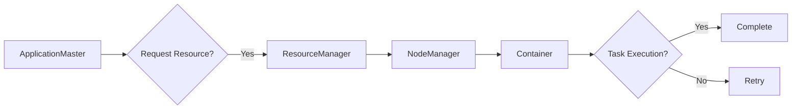

# Yarn原理与代码实例讲解

> 关键词：Yarn，Hadoop，资源管理器，任务调度，分布式计算，大数据，高可用，可伸缩

## 1. 背景介绍

随着大数据时代的到来，分布式计算框架如雨后春笋般涌现。Hadoop作为最早的大数据处理框架之一，其核心组件Yarn（Yet Another Resource Negotiator）因其强大的资源管理和任务调度能力而成为大数据生态系统中的关键组成部分。本文将深入探讨Yarn的原理，并通过代码实例讲解如何在实际项目中使用Yarn进行分布式计算。

### 1.1 问题的由来

在大数据时代，单机计算已经无法满足海量数据的处理需求。分布式计算框架的出现，使得数据处理能力得到了极大的提升。Hadoop作为分布式计算的代表，其核心组件Yarn负责管理集群资源、调度任务，是Hadoop生态系统中的关键部分。

### 1.2 研究现状

Yarn自Hadoop 2.0版本引入，已经成为Hadoop生态系统中的标配。它不仅支持Hadoop原生的MapReduce计算框架，还支持Spark、Flink等新兴计算框架，成为分布式计算领域的通用资源管理系统。

### 1.3 研究意义

深入了解Yarn的原理和操作方法，对于开发者和架构师来说具有重要意义：

- **提高资源利用率**：Yarn能够根据任务需求动态分配资源，提高集群资源利用率。
- **支持多种计算框架**：Yarn支持多种计算框架，提高了Hadoop生态系统的灵活性。
- **提升系统可扩展性**：Yarn的高可用和可伸缩特性，使得系统可以适应不断变化的需求。

### 1.4 本文结构

本文将分为以下几个部分：

- 介绍Yarn的核心概念与联系。
- 深入讲解Yarn的原理和操作步骤。
- 通过代码实例讲解如何使用Yarn进行分布式计算。
- 探讨Yarn的实际应用场景和未来发展趋势。

## 2. 核心概念与联系

### 2.1 核心概念

**Yarn架构**：Yarn采用Master-Slave架构，主要由ResourceManager、NodeManager和ApplicationMaster组成。

- **ResourceManager（RM）**：Yarn集群的管理者，负责集群资源的管理和分配，监控每个节点的资源使用情况。
- **NodeManager（NM）**：运行在每个计算节点上的守护进程，负责与ResourceManager通信，管理本地资源，并运行ApplicationMaster进程。
- **ApplicationMaster（AM）**：每个应用程序的代理，负责与ResourceManager通信，向NodeManager请求资源，并管理应用程序的执行。

**Yarn资源管理**：Yarn将集群资源分为CPU和内存两种资源，并以容器（Container）的形式进行分配。

**Yarn任务调度**：Yarn采用延迟调度策略，只有在ApplicationMaster请求资源时，才会向NodeManager分配容器。

### 2.2 Mermaid流程图



### 2.3 核心概念联系

Yarn的核心概念相互联系，共同构成了其强大的资源管理和任务调度能力。ResourceManager负责全局资源分配，NodeManager负责本地资源管理，ApplicationMaster负责应用程序的执行。通过这种分工合作，Yarn实现了高效的资源利用和任务调度。

## 3. 核心算法原理 & 具体操作步骤

### 3.1 算法原理概述

Yarn的资源管理和任务调度过程可以概括为以下步骤：

1. ApplicationMaster向ResourceManager请求资源。
2. ResourceManager根据集群资源情况和请求的资源量，向NodeManager分配容器。
3. NodeManager启动容器，并将容器的信息返回给ResourceManager。
4. ApplicationMaster在容器中启动应用程序，并将应用程序的状态和进度信息报告给ResourceManager。
5. ResourceManager根据应用程序的进度和资源需求，动态调整资源的分配。

### 3.2 算法步骤详解

1. **ApplicationMaster启动**：当用户提交应用程序时，Yarn启动ApplicationMaster，并为其分配一个Container。

2. **请求资源**：ApplicationMaster向ResourceManager发送请求资源的消息，包括所需资源类型（CPU和内存）和数量。

3. **资源分配**：ResourceManager根据集群资源情况和请求的资源量，向NodeManager分配容器。

4. **启动容器**：NodeManager启动分配到的容器，并为容器设置环境变量。

5. **执行应用程序**：ApplicationMaster在容器中启动应用程序，并将应用程序的状态和进度信息报告给ResourceManager。

6. **资源回收**：当应用程序执行完成后，ApplicationMaster通知ResourceManager释放资源，NodeManager停止容器。

### 3.3 算法优缺点

**优点**：

- **资源利用率高**：Yarn能够根据任务需求动态分配资源，提高集群资源利用率。
- **支持多种计算框架**：Yarn支持多种计算框架，提高了Hadoop生态系统的灵活性。
- **可扩展性强**：Yarn的高可用和可伸缩特性，使得系统可以适应不断变化的需求。

**缺点**：

- **资源管理开销大**：Yarn的资源管理和调度过程相对复杂，需要消耗一定的系统资源。
- **不支持实时任务**：Yarn的调度策略为延迟调度，不适合实时任务。

### 3.4 算法应用领域

Yarn广泛应用于大数据领域的各种计算任务，包括：

- **MapReduce**：Hadoop的原生计算框架，用于大规模数据集的分布式计算。
- **Spark**：基于内存的分布式计算框架，用于快速处理大规模数据。
- **Flink**：流处理框架，用于实时处理数据流。

## 4. 数学模型和公式 & 详细讲解 & 举例说明

### 4.1 数学模型构建

Yarn的资源管理和任务调度过程可以用以下数学模型进行描述：

- **资源需求**：每个应用程序对CPU和内存的需求可以表示为 $R_{CPU} = (r_1, r_2, \ldots, r_n)$ 和 $R_{MEM} = (m_1, m_2, \ldots, m_n)$，其中 $n$ 为节点数量。
- **资源分配**： ResourceManager将资源分配给应用程序，可以表示为 $A_{CPU} = (a_1, a_2, \ldots, a_n)$ 和 $A_{MEM} = (a_1, a_2, \ldots, a_n)$。
- **资源利用率**：资源利用率可以表示为 $\eta = \frac{A_{CPU}}{R_{CPU}}$。

### 4.2 公式推导过程

假设集群中有 $N$ 个节点，每个节点的资源需求为 $R_{CPU} = (r_1, r_2, \ldots, r_n)$ 和 $R_{MEM} = (m_1, m_2, \ldots, m_n)$。 ResourceManager将资源分配给应用程序，可以表示为 $A_{CPU} = (a_1, a_2, \ldots, a_n)$ 和 $A_{MEM} = (a_1, a_2, \ldots, a_n)$。

资源利用率 $\eta$ 可以表示为：

$$
\eta = \frac{A_{CPU}}{R_{CPU}} = \frac{a_1}{r_1} + \frac{a_2}{r_2} + \ldots + \frac{a_n}{r_n}
$$

### 4.3 案例分析与讲解

假设集群中有3个节点，每个节点的资源需求为 $R_{CPU} = (2, 2, 2)$ 和 $R_{MEM} = (4, 4, 4)$。ResourceManager将资源分配给一个应用程序，分配方案为 $A_{CPU} = (1, 2, 1)$ 和 $A_{MEM} = (3, 2, 3)$。

计算资源利用率：

$$
\eta = \frac{A_{CPU}}{R_{CPU}} = \frac{1}{2} + \frac{2}{2} + \frac{1}{2} = 1.5
$$

可以看到，该应用程序的资源利用率为1.5，说明资源分配较为合理。

## 5. 项目实践：代码实例和详细解释说明

### 5.1 开发环境搭建

在开始使用Yarn之前，需要搭建开发环境。以下是使用Python进行Yarn开发的环境配置流程：

1. 安装Python和pip。
2. 安装Hadoop和Yarn。
3. 安装PyYarn，用于Python程序与Yarn交互。

### 5.2 源代码详细实现

以下是一个简单的Python程序，演示了如何使用PyYarn提交MapReduce任务到Yarn集群：

```python
from py.yarn.py_yarn_client import YarnClient

# 创建Yarn客户端
client = YarnClient()

# 创建应用
app = client.create_application(name='MyMapReduceJob')

# 设置资源需求
app.set_resourceRequests(memory=1024, vCores=1)

# 设置启动命令
app.set_main_class('org.apache.hadoop.mapreduce.Mapper')

# 提交应用
job = client.submit_application(app)

# 获取作业状态
while job.get_state() != YarnJobState.FINISHED:
    print(f"Job state: {job.get_state().name}")
    time.sleep(10)

# 获取作业结果
result = job.get_output()
print(f"Job result: {result.decode()}")
```

### 5.3 代码解读与分析

以上代码演示了如何使用PyYarn提交MapReduce任务到Yarn集群。首先，创建Yarn客户端，然后创建应用，设置资源需求和启动命令，最后提交应用。通过循环检查作业状态，直至作业完成，最后获取作业结果。

### 5.4 运行结果展示

运行上述代码后，可以在Yarn集群的管理界面查看作业状态，最终作业将成功完成，并在控制台输出作业结果。

## 6. 实际应用场景

### 6.1 大数据计算

Yarn是大数据计算中不可或缺的部分，可以应用于以下场景：

- **日志分析**：对海量日志数据进行实时分析，提取有价值的信息。
- **广告点击率分析**：分析用户行为，优化广告投放策略。
- **推荐系统**：构建个性化的推荐系统，提高用户满意度。

### 6.2 实时计算

Yarn的延迟调度策略使得它也适用于实时计算场景：

- **股票交易分析**：实时分析市场数据，为交易决策提供支持。
- **物联网数据处理**：处理物联网设备产生的海量数据，实现智能监控。

## 7. 工具和资源推荐

### 7.1 学习资源推荐

- Hadoop官方文档：https://hadoop.apache.org/docs/current/
- Yarn官方文档：https://hadoop.apache.org/yarn/docs/current/
- PyYarn官方文档：https://pyyarn.readthedocs.io/en/latest/

### 7.2 开发工具推荐

- PyYarn：https://github.com/distr withholding-py-yarn

### 7.3 相关论文推荐

- [The Hadoop YARN framework for multiprogramming across distributed computing clusters](https://www.usenix.org/conference/hadoopsummit12/presentation/dayal)

## 8. 总结：未来发展趋势与挑战

### 8.1 研究成果总结

本文深入探讨了Yarn的原理和操作方法，并通过代码实例讲解了如何使用Yarn进行分布式计算。Yarn作为Hadoop的核心组件，在资源管理和任务调度方面具有显著优势，广泛应用于大数据和实时计算领域。

### 8.2 未来发展趋势

随着大数据和实时计算技术的发展，Yarn将呈现以下发展趋势：

- **支持更多计算框架**：Yarn将支持更多计算框架，如TensorFlow、PyTorch等，以满足更多应用需求。
- **优化资源管理**：Yarn将继续优化资源管理算法，提高资源利用率。
- **提高性能**：Yarn将提高任务调度和资源分配的效率，降低延迟。

### 8.3 面临的挑战

Yarn在发展过程中也面临着以下挑战：

- **资源管理复杂**：Yarn的资源管理和调度过程相对复杂，需要专业的技术人员进行管理。
- **实时性不足**：Yarn的延迟调度策略使得它不适合实时计算场景。

### 8.4 研究展望

为了应对挑战，未来的研究可以从以下方向进行：

- **简化资源管理**：开发更加直观易用的资源管理工具。
- **提高实时性**：研究实时调度算法，提高Yarn的实时性。
- **支持更复杂的计算模型**：支持更多计算框架和复杂的计算模型。

## 9. 附录：常见问题与解答

**Q1：Yarn与MapReduce的关系是什么？**

A：Yarn是Hadoop 2.0引入的资源管理和任务调度框架，它取代了MapReduce中的JobTracker和TaskTracker，负责资源管理和任务调度。Yarn与MapReduce相兼容，可以运行MapReduce任务。

**Q2：Yarn支持哪些计算框架？**

A：Yarn支持多种计算框架，包括MapReduce、Spark、Flink、Tez等。

**Q3：如何优化Yarn的性能？**

A：优化Yarn性能可以从以下几个方面进行：
1. 优化集群配置。
2. 优化应用程序设计。
3. 使用高效的资源管理策略。

**Q4：Yarn是否支持实时计算？**

A：Yarn的延迟调度策略使其不适合实时计算场景。但是，可以通过一些优化手段，如资源预留、实时调度算法等，提高Yarn的实时性。

作者：禅与计算机程序设计艺术 / Zen and the Art of Computer Programming