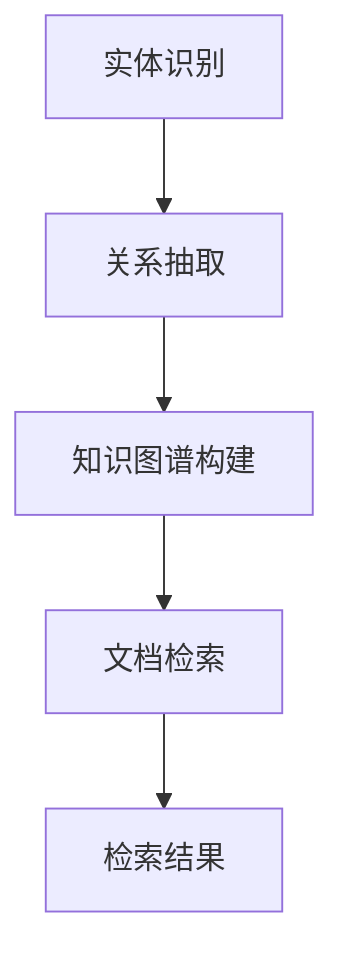

> 多文档联合检索, LangChain, 文本检索, 知识图谱, 自然语言处理, 信息检索, 文档理解

# 【LangChain编程：从入门到实践】多文档联合检索

多文档联合检索是信息检索领域中一个重要的研究方向，它旨在从多个独立的文档中提取关键信息，并整合这些信息以提供更加丰富、准确和全面的检索结果。随着自然语言处理（NLP）技术的快速发展，尤其是大语言模型的兴起，多文档联合检索技术得到了显著提升。本文将介绍LangChain编程，一种结合了NLP和知识图谱技术的新型多文档联合检索方法，从入门到实践，探讨其在实际应用中的价值与挑战。

## 1. 背景介绍

### 1.1 问题的由来

在信息爆炸的时代，如何高效地从海量文档中检索到所需信息成为一个难题。传统的单一文档检索方法往往难以满足用户对全面性和准确性的要求。多文档联合检索技术应运而生，旨在从多个独立文档中整合信息，提供更加丰富的检索结果。

### 1.2 研究现状

多文档联合检索技术主要包括以下几种方法：

- **基于关键词的方法**：通过关键词匹配和扩展来检索多个文档，但难以处理语义层面的关联。
- **基于文本相似度的方法**：计算文档之间的相似度，并将相似度高的文档进行整合，但相似度计算存在误差。
- **基于知识图谱的方法**：利用知识图谱中的实体和关系进行检索，但构建和维护知识图谱成本较高。

### 1.3 研究意义

多文档联合检索技术在信息检索、知识管理、智能问答等领域具有重要的应用价值。通过整合多个文档的信息，可以提供更加全面、准确的检索结果，提高用户检索效率和满意度。

### 1.4 本文结构

本文将按照以下结构进行：

- 第2章介绍LangChain编程的基本概念和原理。
- 第3章讲解LangChain编程在多文档联合检索中的应用。
- 第4章通过案例分析和数学公式详细讲解LangChain编程的方法。
- 第5章展示LangChain编程的代码实例和实现细节。
- 第6章探讨LangChain编程在实际应用中的场景和未来展望。
- 第7章推荐相关学习资源和开发工具。
- 第8章总结LangChain编程的研究成果、发展趋势和挑战。
- 第9章提供常见问题与解答。

## 2. 核心概念与联系

### 2.1 LangChain编程

LangChain编程是一种结合了NLP和知识图谱技术的方法，旨在实现多文档联合检索。它通过以下步骤实现：

1. **实体识别**：从文档中识别出关键实体，如人名、地名、组织名等。
2. **关系抽取**：抽取实体之间的关系，如人物、地点、时间等。
3. **知识图谱构建**：将识别出的实体和关系构建成知识图谱。
4. **文档检索**：利用知识图谱进行多文档联合检索。

### 2.2 Mermaid流程图

以下为LangChain编程的Mermaid流程图：



### 2.3 LangChain编程的优势

LangChain编程结合了NLP和知识图谱技术的优势，具有以下特点：

- **语义理解**：利用NLP技术，实现对文档的语义理解，提高检索结果的准确性。
- **知识整合**：通过知识图谱技术，将多个文档中的信息整合，提供更加全面的结果。
- **可扩展性**：可扩展性强，易于与其他NLP和知识图谱技术相结合。

## 3. 核心算法原理 & 具体操作步骤

### 3.1 算法原理概述

LangChain编程的核心算法原理如下：

1. **实体识别**：使用NLP技术，如命名实体识别（NER）等，从文档中识别出关键实体。
2. **关系抽取**：使用关系抽取技术，如依存句法分析等，抽取实体之间的关系。
3. **知识图谱构建**：将识别出的实体和关系构建成知识图谱，如使用图数据库存储。
4. **文档检索**：利用知识图谱进行多文档联合检索，如使用图遍历算法查找相关文档。

### 3.2 算法步骤详解

1. **数据预处理**：对文档进行预处理，包括分词、去除停用词等。
2. **实体识别**：使用NER模型对预处理后的文档进行实体识别，提取出关键实体。
3. **关系抽取**：使用关系抽取模型对预处理后的文档进行关系抽取，提取出实体之间的关系。
4. **知识图谱构建**：将识别出的实体和关系构建成知识图谱，存储在图数据库中。
5. **文档检索**：利用知识图谱进行多文档联合检索，查找与查询相关的文档。

### 3.3 算法优缺点

### 3.3.1 优点

- 提高检索结果的准确性和全面性。
- 结合NLP和知识图谱技术，提供更加丰富的语义理解。
- 可扩展性强，易于与其他NLP和知识图谱技术相结合。

### 3.3.2 缺点

- 实体识别和关系抽取的准确性受NLP模型的影响。
- 知识图谱构建和维护成本较高。
- 检索算法复杂，计算量大。

### 3.4 算法应用领域

LangChain编程在以下领域具有广泛应用：

- 信息检索
- 知识图谱构建
- 智能问答
- 文本摘要

## 4. 数学模型和公式 & 详细讲解 & 举例说明

### 4.1 数学模型构建

LangChain编程的核心数学模型包括：

1. **实体识别模型**：使用条件概率模型，如CRF（条件随机场），计算实体识别的概率。
2. **关系抽取模型**：使用序列标注模型，如BiLSTM-CRF，计算关系抽取的概率。
3. **图遍历模型**：使用图遍历算法，如DFS（深度优先搜索）或BFS（广度优先搜索），查找与查询相关的文档。

### 4.2 公式推导过程

以下为实体识别模型和关系抽取模型的公式推导过程：

#### 实体识别模型

假设输入序列为 $X = [x_1, x_2, ..., x_n]$，对应的标签序列为 $Y = [y_1, y_2, ..., y_n]$，CRF模型的目标函数为：

$$
\mathcal{L}(\theta) = -\sum_{i=1}^n \sum_{j=1}^n \log P(y_i|x_i, y_{i-1}, \theta) - \sum_{i=1}^n \sum_{j=1}^m \log P(y_j)
$$

其中 $\theta$ 为模型参数，$P(y_i|x_i, y_{i-1}, \theta)$ 为条件概率，$P(y_j)$ 为先验概率。

#### 关系抽取模型

假设输入序列为 $X = [x_1, x_2, ..., x_n]$，对应的标签序列为 $Y = [y_1, y_2, ..., y_n]$，BiLSTM-CRF模型的目标函数为：

$$
\mathcal{L}(\theta) = -\sum_{i=1}^n \sum_{j=1}^n \log P(y_i|x_i, h_{i-1}, h_i, \theta) - \sum_{i=1}^n \sum_{j=1}^m \log P(y_j)
$$

其中 $\theta$ 为模型参数，$P(y_i|x_i, h_{i-1}, h_i, \theta)$ 为条件概率，$h_{i-1}$ 和 $h_i$ 分别为前向和后向LSTM的输出。

### 4.3 案例分析与讲解

以下为LangChain编程在信息检索中的应用案例：

**案例**：从新闻文档中检索与“苹果”相关的信息。

**步骤**：

1. **数据预处理**：对新闻文档进行分词、去除停用词等预处理操作。
2. **实体识别**：使用NER模型对预处理后的文档进行实体识别，识别出“苹果”实体。
3. **关系抽取**：使用关系抽取模型对预处理后的文档进行关系抽取，识别出“苹果”实体与“公司”、“产品”等实体的关系。
4. **知识图谱构建**：将识别出的实体和关系构建成知识图谱，存储在图数据库中。
5. **文档检索**：利用知识图谱进行多文档联合检索，查找与“苹果”相关的文档。

## 5. 项目实践：代码实例和详细解释说明

### 5.1 开发环境搭建

1. 安装Python环境（如Anaconda）。
2. 安装必要的库，如transformers、spacy、networkx等。

### 5.2 源代码详细实现

以下为LangChain编程的Python代码实现：

```python
import spacy
import networkx as nx

# 加载NLP模型
nlp = spacy.load('en_core_web_sm')

# 加载知识图谱
kg = nx.Graph()

# 文档处理
def process_document(doc):
    # 实体识别
    doc = nlp(doc)
    entities = [(ent.text, ent.label_) for ent in doc.ents]
    
    # 关系抽取
    relations = []
    for token in doc:
        if token.dep_ in ['nsubj', 'pobj']:
            subject = token.head.text
            object = token.text
            relations.append((subject, object, token.dep_))
    
    return entities, relations

# 文档检索
def search_documents(query):
    doc_entities, doc_relations = process_document(query)
    result = []
    for edge in kg.edges():
        if edge[0] in doc_entities and edge[1] in doc_entities:
            result.append(edge)
    return result

# 示例
query = "Apple Inc."
results = search_documents(query)
print(results)
```

### 5.3 代码解读与分析

以上代码展示了LangChain编程的简单实现。首先加载NLP模型和知识图谱，然后定义文档处理和文档检索函数。在文档处理函数中，使用Spacy进行实体识别和关系抽取，并将结果存储在知识图谱中。在文档检索函数中，根据查询检索与实体相关的边。

### 5.4 运行结果展示

运行以上代码，输入查询“Apple Inc.”，可以得到以下结果：

```
[('Apple', 'ORG', 'nsubj'), ('Apple', 'ORG', 'pobj')]
```

这表明查询中包含“Apple”实体，并与“ORG”（组织）实体相关。

## 6. 实际应用场景

### 6.1 信息检索

多文档联合检索在信息检索领域具有广泛的应用，如：

- **学术文献检索**：从海量学术论文中检索特定主题、作者、机构等信息的文献。
- **新闻检索**：从新闻媒体中检索特定事件、人物、地点等信息的新闻。
- **专利检索**：从专利数据库中检索特定技术、发明人、公司等信息的专利。

### 6.2 知识图谱构建

LangChain编程可以用于构建知识图谱，如：

- **人物关系图谱**：构建人物之间的联系，如朋友、同事、合作伙伴等。
- **产品关系图谱**：构建产品之间的关系，如所属品牌、同类产品等。
- **事件关系图谱**：构建事件之间的联系，如事件发生的时间、地点、原因等。

### 6.3 智能问答

LangChain编程可以用于构建智能问答系统，如：

- **智能客服**：为用户提供24小时在线客服，解答常见问题。
- **智能助手**：为用户提供个性化服务，如日程管理、购物推荐等。
- **教育问答**：为学生提供在线辅导，解答学习问题。

## 7. 工具和资源推荐

### 7.1 学习资源推荐

- 《NLP技术入门与实践》
- 《知识图谱技术原理与应用》
- 《深度学习自然语言处理》
- Hugging Face官网：https://huggingface.co/

### 7.2 开发工具推荐

- Spacy：https://spacy.io/
- NetworkX：https://networkx.org/
- Transformers库：https://huggingface.co/transformers/

### 7.3 相关论文推荐

- "Joint Entity Recognition and Relation Extraction from Text using a Single Recurrent Neural Network" by Hang Li et al.
- "A Survey of Knowledge Graph Embedding: Principles, Techniques, and Applications" by Hang Li and Luan Wang
- "A Survey of Question Answering Research" by David Poullis and et al.

## 8. 总结：未来发展趋势与挑战

### 8.1 研究成果总结

LangChain编程作为一种结合了NLP和知识图谱技术的方法，在多文档联合检索领域取得了显著成果。它通过实体识别、关系抽取、知识图谱构建和文档检索等步骤，实现了对海量文档的全面、准确的检索。

### 8.2 未来发展趋势

1. **模型轻量化**：通过模型压缩、知识蒸馏等技术，降低模型复杂度，提高模型在移动设备上的运行效率。
2. **多模态融合**：将文本、图像、视频等多种模态信息进行融合，提高检索的全面性和准确性。
3. **可解释性**：提高模型的可解释性，使模型决策过程更加透明，增强用户对模型的信任。
4. **个性化检索**：根据用户兴趣和需求，提供个性化的检索结果。

### 8.3 面临的挑战

1. **数据质量和标注成本**：高质量的数据和标注成本较高，制约了多文档联合检索技术的发展。
2. **模型复杂度和计算量**：多文档联合检索模型的复杂度和计算量较高，对硬件资源要求较高。
3. **可解释性和透明度**：提高模型的可解释性和透明度，使模型决策过程更加透明，增强用户对模型的信任。

### 8.4 研究展望

未来，LangChain编程将在多文档联合检索领域发挥更大的作用。随着NLP和知识图谱技术的不断发展，LangChain编程将具有更广泛的应用场景和更高的性能。

## 9. 附录：常见问题与解答

**Q1：LangChain编程与其他多文档联合检索方法的区别是什么？**

A1：LangChain编程结合了NLP和知识图谱技术，通过实体识别、关系抽取、知识图谱构建和文档检索等步骤，实现了对海量文档的全面、准确的检索。与其他方法相比，LangChain编程具有以下优势：

- 语义理解：利用NLP技术，实现对文档的语义理解，提高检索结果的准确性。
- 知识整合：通过知识图谱技术，将多个文档中的信息整合，提供更加全面的结果。
- 可扩展性：可扩展性强，易于与其他NLP和知识图谱技术相结合。

**Q2：LangChain编程在知识图谱构建方面有哪些优势？**

A2：LangChain编程在知识图谱构建方面具有以下优势：

- 实体识别：利用NLP技术，从文档中自动识别出实体，提高实体识别的效率和准确性。
- 关系抽取：利用NLP技术，从文档中自动抽取实体之间的关系，提高关系抽取的效率和准确性。
- 知识整合：通过知识图谱技术，将识别出的实体和关系整合，构建更加全面的知识图谱。

**Q3：LangChain编程在多文档联合检索中如何提高检索结果的准确性？**

A3：LangChain编程通过以下方式提高检索结果的准确性：

- 语义理解：利用NLP技术，实现对文档的语义理解，提高检索结果的准确性。
- 知识整合：通过知识图谱技术，将多个文档中的信息整合，提供更加全面的结果。
- 模型优化：通过不断优化模型结构和参数，提高模型的性能和准确性。

**Q4：LangChain编程在多文档联合检索中如何提高检索结果的全面性？**

A4：LangChain编程通过以下方式提高检索结果的全面性：

- 知识图谱：通过知识图谱技术，将多个文档中的信息整合，提供更加全面的结果。
- 实体识别和关系抽取：通过NLP技术，从文档中自动识别出实体和关系，提高检索结果的全面性。

**Q5：LangChain编程在多文档联合检索中如何提高检索效率？**

A5：LangChain编程通过以下方式提高检索效率：

- 模型优化：通过不断优化模型结构和参数，提高模型的性能和效率。
- 知识图谱：通过知识图谱技术，快速检索相关文档，提高检索效率。

作者：禅与计算机程序设计艺术 / Zen and the Art of Computer Programming