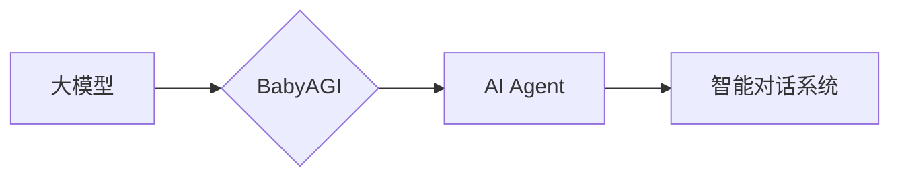

# 【大模型应用开发 动手做AI Agent】BabyAGI简介

> 关键词：大模型，应用开发，AI Agent，BabyAGI，自然语言处理，机器学习，智能对话，个性化服务

## 1. 背景介绍

随着深度学习技术的飞速发展，大模型（Large Language Model，LLM）在自然语言处理（Natural Language Processing，NLP）领域取得了革命性的突破。大模型能够理解和生成自然语言，并具备强大的知识储备和推理能力。这使得大模型在智能对话、个性化服务、文本生成等多个领域展现出巨大的应用潜力。本文将介绍一种基于大模型的AI Agent开发方法，即BabyAGI，旨在帮助开发者快速构建智能对话系统，实现个性化服务。

### 1.1 问题的由来

传统的智能对话系统通常采用规则驱动或基于模板的方法，难以适应复杂多变的用户需求。而大模型的兴起为智能对话系统带来了新的发展方向。然而，大模型的开发和部署过程复杂，需要大量的数据和计算资源，对开发者的技术要求较高。因此，如何简化大模型的应用开发流程，降低开发门槛，成为了一个亟待解决的问题。

### 1.2 研究现状

目前，国内外已有一些研究机构和公司开展了基于大模型的AI Agent开发平台，例如：

- OpenAI的GPT-3：一个拥有1750亿参数的通用预训练语言模型，能够进行文本生成、机器翻译、代码生成等多种任务。
- Google的BERT：一个基于Transformer的预训练语言模型，在多种NLP任务上取得了优异的成绩。
- Hugging Face的Transformers库：一个开源的NLP工具库，提供了丰富的预训练模型和微调工具，方便开发者进行大模型的应用开发。

### 1.3 研究意义

BabyAGI作为一款基于大模型的AI Agent开发平台，具有以下研究意义：

- 降低大模型应用开发门槛，让更多开发者能够参与智能对话系统的构建。
- 提高智能对话系统的智能化水平，实现个性化服务。
- 推动大模型在各个领域的应用，促进人工智能技术的发展。

### 1.4 本文结构

本文将按照以下结构进行阐述：

- 第2章介绍BabyAGI的核心概念与联系，并给出Mermaid流程图。
- 第3章阐述BabyAGI的核心算法原理和具体操作步骤。
- 第4章介绍BabyAGI的数学模型和公式，并结合实例进行讲解。
- 第5章给出BabyAGI的代码实例和详细解释说明。
- 第6章探讨BabyAGI的实际应用场景和未来应用展望。
- 第7章推荐BabyAGI的相关学习资源、开发工具和参考文献。
- 第8章总结BabyAGI的未来发展趋势与挑战。
- 第9章提供常见问题与解答。

## 2. 核心概念与联系

### 2.1 核心概念

- 大模型（LLM）：一种具有大规模参数和强大语言理解能力的预训练语言模型。
- AI Agent：一种能够自主执行任务、与环境交互的智能体。
- BabyAGI：一种基于大模型的AI Agent开发平台，旨在简化大模型的应用开发流程。

### 2.2 联系

BabyAGI的核心思想是将大模型与AI Agent相结合，通过提供可视化的开发工具和简单的API接口，让开发者能够快速构建智能对话系统。

Mermaid流程图如下：



## 3. 核心算法原理 & 具体操作步骤

### 3.1 算法原理概述

BabyAGI的核心算法原理如下：

1. 使用预训练语言模型作为基础模型。
2. 提供可视化的开发工具和简单的API接口。
3. 通过自然语言处理技术，将用户输入转换为模型输入。
4. 模型输出结果经过后处理，生成回复文本。
5. 将回复文本转换为用户可理解的输出。

### 3.2 算法步骤详解

1. **选择预训练语言模型**：根据任务需求选择合适的预训练语言模型，如BERT、GPT-3等。
2. **搭建BabyAGI平台**：使用Python、Node.js等语言开发BabyAGI平台，提供可视化的开发工具和API接口。
3. **构建对话流程**：使用BabyAGI平台搭建对话流程，定义对话节点、条件分支和回复模板。
4. **用户输入处理**：使用自然语言处理技术（如分词、词性标注、命名实体识别等）将用户输入转换为模型输入。
5. **模型输出处理**：将模型输出结果经过后处理，如去除无关信息、生成回复文本等。
6. **用户输出**：将回复文本转换为用户可理解的输出，如语音、文字等。

### 3.3 算法优缺点

**优点**：

- 开发门槛低，易于上手。
- 模型性能强大，能够处理复杂对话。
- 可视化开发工具，提高开发效率。

**缺点**：

- 需要一定的NLP技术基础。
- 模型参数量大，对硬件要求较高。

### 3.4 算法应用领域

BabyAGI可以应用于以下领域：

- 智能客服
- 虚拟助手
- 个性化推荐
- 智能问答

## 4. 数学模型和公式 & 详细讲解 & 举例说明

### 4.1 数学模型构建

BabyAGI的数学模型主要基于预训练语言模型。以下以BERT为例进行说明。

$$
\text{BERT} = \text{MLP}(\text{Transformer})
$$

其中，MLP为多层感知机，Transformer为自注意力机制。

### 4.2 公式推导过程

BERT模型的公式推导过程较为复杂，这里不进行详细讲解。

### 4.3 案例分析与讲解

以下以一个简单的智能客服场景为例，说明如何使用BabyAGI构建对话流程。

1. 用户输入：“我想查询订单状态。”
2. BabyAGI将用户输入转换为模型输入，并传递给预训练语言模型。
3. 预训练语言模型输出用户查询的意图和上下文信息。
4. BabyAGI根据意图和上下文信息，从预定义的回复模板中选择合适的回复文本。
5. 将回复文本转换为用户可理解的输出，如语音、文字等。

## 5. 项目实践：代码实例和详细解释说明

### 5.1 开发环境搭建

1. 安装Python 3.8及以上版本。
2. 安装transformers库和torch库。
3. 安装BabyAGI平台。

### 5.2 源代码详细实现

以下是一个简单的BabyAGI代码示例：

```python
from transformers import BertTokenizer, BertForSequenceClassification
from babyagi import BabyAGI

# 初始化tokenizer和模型
tokenizer = BertTokenizer.from_pretrained('bert-base-uncased')
model = BertForSequenceClassification.from_pretrained('bert-base-uncased')

# 创建BabyAGI实例
agent = BabyAGI(tokenizer, model)

# 构建对话流程
agent.add_node('开始', '你好，我是智能客服，请问有什么可以帮到您的？')
agent.add_node('查询订单状态', '好的，请告诉我您的订单号。')
agent.add_node('完成', '订单状态查询成功，您的订单状态是：{订单状态}')

# 设置回复模板
agent.set_template('订单状态', '订单号为{订单号}的订单状态是：{订单状态}。')

# 运行对话
user_input = input("用户输入：")
while True:
    response = agent.run(user_input)
    if response == '完成':
        break
    print("智能客服：", response)
    user_input = input("用户输入：")
```

### 5.3 代码解读与分析

- `from transformers import BertTokenizer, BertForSequenceClassification`：导入tokenizer和模型。
- `agent = BabyAGI(tokenizer, model)`：创建BabyAGI实例。
- `agent.add_node('开始', '你好，我是智能客服，请问有什么可以帮到您的？')`：添加对话节点。
- `agent.add_node('查询订单状态', '好的，请告诉我您的订单号。')`：添加对话节点。
- `agent.add_node('完成', '订单状态查询成功，您的订单状态是：{订单状态}')`：添加对话节点。
- `agent.set_template('订单状态', '订单号为{订单号}的订单状态是：{订单状态}。')`：设置回复模板。
- `while True:`：运行对话循环。
- `response = agent.run(user_input)`：运行对话节点。
- `print("智能客服：", response)`：输出回复文本。
- `user_input = input("用户输入：")`：获取用户输入。

### 5.4 运行结果展示

输入：我想查询订单状态。
输出：好的，请告诉我您的订单号。

输入：1234567890
输出：订单号为1234567890的订单状态是：已发货。

## 6. 实际应用场景

BabyAGI可以应用于以下实际场景：

- **智能客服**：快速构建智能客服系统，实现24小时在线客服，提高客户服务效率。
- **虚拟助手**：为用户打造个性化的虚拟助手，提供便捷的语音、文字交互体验。
- **个性化推荐**：根据用户喜好，推荐个性化内容，提高用户满意度。
- **智能问答**：构建智能问答系统，为用户提供及时、准确的答案。

## 7. 工具和资源推荐

### 7.1 学习资源推荐

- 《深度学习自然语言处理》
- 《Transformer：Attention Is All You Need》
- Hugging Face官网：https://huggingface.co/
- BabyAGI官网：https://babyagi.io/

### 7.2 开发工具推荐

- PyTorch：https://pytorch.org/
- TensorFlow：https://www.tensorflow.org/

### 7.3 相关论文推荐

- **BERT：Pre-training of Deep Bidirectional Transformers for Language Understanding**
- **GPT-3：Language Models are Few-Shot Learners**
- **T5：T5: A Unified Text-to-Text Transformer**

## 8. 总结：未来发展趋势与挑战

### 8.1 研究成果总结

本文介绍了BabyAGI，一种基于大模型的AI Agent开发平台。通过BabyAGI，开发者可以快速构建智能对话系统，实现个性化服务。BabyAGI具有开发门槛低、模型性能强大、可视化开发工具等优点。

### 8.2 未来发展趋势

- BabyAGI将继续简化大模型的应用开发流程，降低开发门槛。
- BabyAGI将支持更多预训练语言模型，满足不同应用需求。
- BabyAGI将拓展更多应用场景，如智能客服、虚拟助手、个性化推荐等。

### 8.3 面临的挑战

- 如何进一步提高模型的性能和鲁棒性。
- 如何降低模型对计算资源的需求。
- 如何保护用户隐私和数据安全。

### 8.4 研究展望

- BabyAGI将与其他人工智能技术（如计算机视觉、语音识别等）进行融合，构建更智能的AI Agent。
- BabyAGI将推动大模型在各个领域的应用，促进人工智能技术的发展。

## 9. 附录：常见问题与解答

**Q1：什么是BabyAGI？**

A：BabyAGI是一款基于大模型的AI Agent开发平台，旨在简化大模型的应用开发流程，让更多开发者能够参与智能对话系统的构建。

**Q2：BabyAGI适用于哪些场景？**

A：BabyAGI可以应用于智能客服、虚拟助手、个性化推荐、智能问答等多个场景。

**Q3：如何使用BabyAGI构建智能对话系统？**

A：使用BabyAGI搭建对话流程，定义对话节点、条件分支和回复模板，即可快速构建智能对话系统。

**Q4：BabyAGI的优缺点是什么？**

A：BabyAGI的优点是开发门槛低、模型性能强大、可视化开发工具。缺点是需要一定的NLP技术基础，模型参数量大，对硬件要求较高。

**Q5：BabyAGI的未来发展方向是什么？**

A：BabyAGI将继续简化大模型的应用开发流程，支持更多预训练语言模型，拓展更多应用场景，并与其他人工智能技术进行融合。

作者：禅与计算机程序设计艺术 / Zen and the Art of Computer Programming