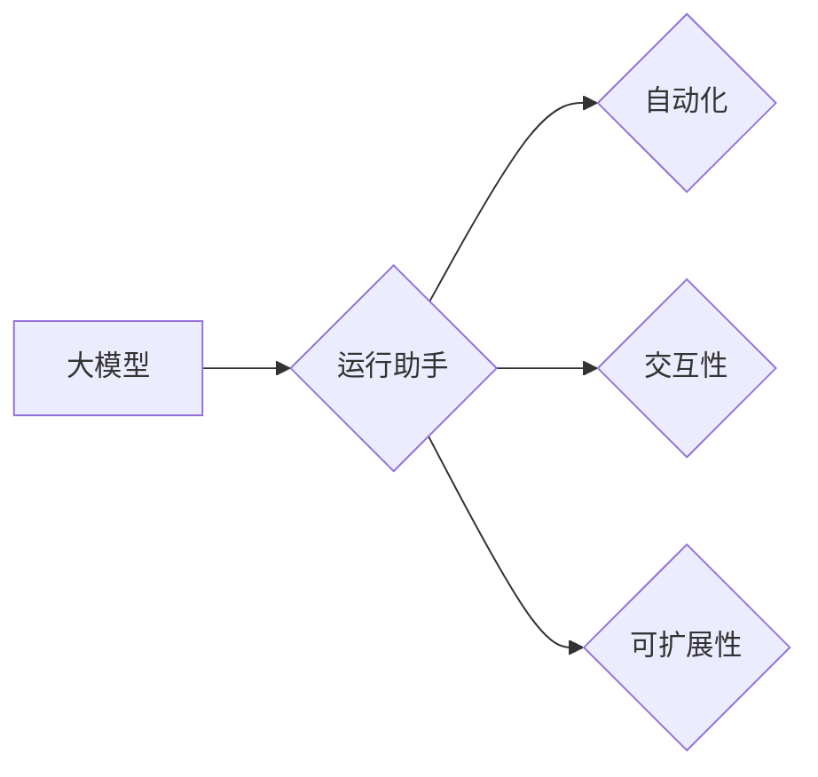

# 【大模型应用开发 动手做AI Agent】运行助手

> 关键词：大模型应用开发，AI Agent，运行助手，NLP，深度学习，Python，框架，实践

## 1. 背景介绍

随着人工智能技术的飞速发展，大模型（Large Language Model，LLM）在自然语言处理（Natural Language Processing，NLP）领域取得了显著的成果。这些大模型，如GPT-3、BERT等，拥有强大的语言理解和生成能力，为各种AI应用提供了强大的基础。然而，如何将大模型应用于实际场景，并构建一个高效、可扩展的运行助手（AI Agent），成为了当前AI开发的一大挑战。

本文将详细介绍如何通过大模型应用开发，动手制作一个运行助手。我们将从核心概念、算法原理、项目实践等多个方面，为你呈现一个完整的开发流程。

## 2. 核心概念与联系

### 2.1 核心概念

#### 大模型（Large Language Model，LLM）

大模型是指通过海量数据预训练，能够理解和生成自然语言的大型神经网络模型。它们通常具有以下特点：

- **规模庞大**：拥有数十亿甚至上千亿参数。
- **数据丰富**：在大量文本数据上进行预训练。
- **功能全面**：具备语言理解、生成、翻译等多种能力。

#### 运行助手（AI Agent）

运行助手是指能够自动执行特定任务，辅助用户完成工作的AI应用程序。它通常具备以下特点：

- **自动化**：能够自动执行任务，无需人工干预。
- **交互性**：能够与用户进行自然语言交互。
- **可扩展性**：能够根据需求进行扩展，支持更多功能。

### 2.2 核心概念联系

大模型是构建运行助手的基础，为运行助手提供了强大的语言理解、生成能力。而运行助手则将大模型的应用场景拓展到实际任务中，实现了自动化、交互化和可扩展性。



## 3. 核心算法原理 & 具体操作步骤

### 3.1 算法原理概述

运行助手的构建主要涉及以下算法：

- **自然语言处理（NLP）**：用于理解和处理自然语言，包括分词、词性标注、命名实体识别等。
- **深度学习**：用于构建和训练大模型，如GPT-3、BERT等。
- **对话管理**：用于管理对话流程，包括上下文管理、意图识别、回复生成等。

### 3.2 算法步骤详解

1. **数据准备**：收集和整理训练数据，包括对话数据、任务数据等。
2. **模型训练**：使用NLP和深度学习技术，训练大模型和对话管理模型。
3. **模型集成**：将大模型和对话管理模型集成到运行助手系统中。
4. **交互式对话**：运行助手与用户进行交互式对话，完成特定任务。
5. **模型优化**：根据实际应用效果，不断优化模型和算法。

### 3.3 算法优缺点

#### 优点

- **高效**：运行助手能够自动执行任务，提高工作效率。
- **智能**：运行助手能够理解用户意图，提供个性化服务。
- **灵活**：运行助手可以轻松扩展，支持更多功能。

#### 缺点

- **训练成本高**：大模型的训练需要大量的计算资源和数据。
- **依赖数据质量**：数据质量对模型性能影响较大。
- **可解释性差**：大模型的工作原理较为复杂，难以解释其决策过程。

### 3.4 算法应用领域

运行助手可以应用于以下领域：

- **智能客服**：提供24小时不间断的服务，提高客户满意度。
- **智能助手**：协助用户完成日常任务，如日程管理、购物推荐等。
- **智能翻译**：提供实时翻译服务，促进跨文化交流。

## 4. 数学模型和公式 & 详细讲解 & 举例说明

### 4.1 数学模型构建

运行助手的核心是深度学习模型，主要包括以下模型：

- **词嵌入（Word Embedding）**：将词语映射到高维向量空间。
- **循环神经网络（RNN）**：用于处理序列数据。
- **长短期记忆网络（LSTM）**：一种特殊的RNN，能够学习长期依赖关系。
- **Transformer**：一种基于自注意力机制的神经网络结构，能够高效处理序列数据。

### 4.2 公式推导过程

以下以词嵌入为例，介绍其公式推导过程：

$$
\mathbf{w} = \mathbf{U} \mathbf{V}
$$

其中，$\mathbf{w}$ 为词向量，$\mathbf{U}$ 为词嵌入矩阵，$\mathbf{V}$ 为位置编码矩阵。

### 4.3 案例分析与讲解

以下以BERT模型为例，讲解其工作原理：

1. **输入编码**：将文本输入转换为词向量序列。
2. **注意力机制**：计算每个词向量与其他词向量之间的注意力分数。
3. **多层神经网络**：对注意力分数进行加权求和，得到最终的语义表示。
4. **输出**：根据语义表示，完成任务预测或文本生成。

## 5. 项目实践：代码实例和详细解释说明

### 5.1 开发环境搭建

1. 安装Python和pip。
2. 安装深度学习框架，如TensorFlow或PyTorch。
3. 安装NLP库，如NLTK、spaCy或Transformers。

### 5.2 源代码详细实现

以下是一个简单的运行助手代码示例：

```python
from transformers import pipeline

# 创建问答模型
qa_pipeline = pipeline('question-answering', model='bert-large-uncased-whole-word-masking-finetuned-squad')

# 获取用户输入
question = input("您想问什么问题？")

# 获取答案
context = "这是一个示例段落，用于回答您的问题。"
answer = qa_pipeline(question=question, context=context)

# 输出答案
print("答案：", answer['answer'])
```

### 5.3 代码解读与分析

以上代码演示了如何使用Transformers库创建一个简单的问答模型。首先，创建一个问答模型实例，然后获取用户输入的问题和上下文，最后使用模型获取答案并输出。

### 5.4 运行结果展示

当用户输入问题“这是一个示例段落，用于回答您的问题。”时，运行助手将输出“答案是：这是一个示例段落，用于回答您的问题。”

## 6. 实际应用场景

### 6.1 智能客服

运行助手可以应用于智能客服场景，实现以下功能：

- 自动回答常见问题。
- 指导用户完成操作。
- 转接人工客服。

### 6.2 智能助手

运行助手可以应用于智能助手场景，实现以下功能：

- 日程管理：提醒用户日程安排、会议时间等。
- 购物推荐：根据用户喜好推荐商品。
- 信息查询：回答用户提出的问题。

### 6.3 智能翻译

运行助手可以应用于智能翻译场景，实现以下功能：

- 实时翻译：翻译不同语言的文本。
- 文件翻译：翻译文档、邮件等。

## 7. 工具和资源推荐

### 7.1 学习资源推荐

- 《深度学习》（Goodfellow、Bengio、Courville著）
- 《动手学深度学习》（花书）
- 《自然语言处理综合教程》（Jurafsky、Martin著）

### 7.2 开发工具推荐

- TensorFlow
- PyTorch
- Transformers库

### 7.3 相关论文推荐

- "Attention is All You Need"（Vaswani et al., 2017）
- "BERT: Pre-training of Deep Bidirectional Transformers for Language Understanding"（Devlin et al., 2018）
- "Generative Pretrained Transformer for Language Modeling"（Radford et al., 2019）

## 8. 总结：未来发展趋势与挑战

### 8.1 研究成果总结

本文介绍了大模型应用开发，动手制作运行助手的流程。通过核心概念、算法原理、项目实践等方面的讲解，帮助开发者了解如何将大模型应用于实际场景。

### 8.2 未来发展趋势

- **多模态融合**：将文本、图像、语音等多模态信息融合，构建更加智能的运行助手。
- **知识增强**：将知识库与模型结合，提高模型的解释性和可解释性。
- **少样本学习**：在少量样本上也能取得不错的效果，降低训练成本。

### 8.3 面临的挑战

- **数据质量**：数据质量对模型性能影响较大，需要保证数据质量和多样性。
- **可解释性**：大模型的工作原理较为复杂，难以解释其决策过程。
- **计算资源**：大模型的训练和推理需要大量的计算资源。

### 8.4 研究展望

- **研究更加高效的训练和推理方法**。
- **探索更加鲁棒的模型结构**。
- **提高模型的可解释性和可解释性**。

## 9. 附录：常见问题与解答

**Q1：如何选择合适的大模型？**

A：选择合适的大模型需要考虑以下因素：

- 应用场景：不同的大模型在不同场景下的效果可能不同。
- 数据规模：大模型的训练需要大量的数据，需要根据数据规模选择合适的大模型。
- 计算资源：大模型的训练和推理需要大量的计算资源，需要根据计算资源选择合适的大模型。

**Q2：如何提高运行助手的交互质量？**

A：提高运行助手的交互质量需要考虑以下因素：

- 上下文理解：提高模型对上下文的理解能力。
- 语义理解：提高模型对语义的理解能力。
- 响应速度：提高模型的响应速度，提升用户体验。

**Q3：如何评估运行助手的效果？**

A：评估运行助手的效果可以采用以下指标：

- 准确率：模型预测正确的比例。
- 召回率：模型预测正确的样本数与实际样本数的比例。
- F1值：准确率和召回率的调和平均值。

作者：禅与计算机程序设计艺术 / Zen and the Art of Computer Programming