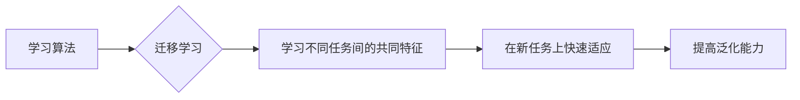

> 语音识别，元学习，映射学习，迁移学习，深度学习，自适应系统

# 一切皆是映射：元学习在语音识别领域的研究进展

## 1. 背景介绍

随着深度学习技术的飞速发展，语音识别（Speech Recognition）领域取得了显著的进展。传统的语音识别系统通常依赖于大量的标注数据，通过训练模型从音频波形中提取特征，然后将这些特征映射到对应的文本标签。然而，这种方法在数据稀缺或动态变化的场景下表现不佳。为了解决这一问题，元学习（Meta-Learning）作为一种新兴的机器学习方法，逐渐成为了语音识别领域的研究热点。

### 1.1 问题的由来

传统的语音识别系统面临以下挑战：

- **数据稀缺**：高质量的语音数据往往难以获取，特别是在特定领域或特定语言环境下。
- **动态变化**：语音信号受到多种因素的影响，如背景噪音、说话人差异等，使得模型难以适应动态变化的环境。
- **领域迁移**：从一种语音数据集迁移到另一种数据集时，模型的性能通常会下降。

### 1.2 研究现状

为了解决上述挑战，研究者们开始探索元学习在语音识别领域的应用。元学习旨在通过学习如何学习，使得模型能够快速适应新任务和数据分布。以下是一些在语音识别领域应用元学习的具体方法：

- **迁移学习**：利用已有模型的先验知识，通过少量目标领域数据快速适应新任务。
- **自适应系统**：根据实时反馈和上下文信息，动态调整模型参数，以适应变化的环境。
- **映射学习**：学习将输入数据映射到输出空间的方法，使得模型能够更好地处理动态变化的数据。

### 1.3 研究意义

元学习在语音识别领域的应用具有以下重要意义：

- **降低数据需求**：通过迁移学习，可以减少对标注数据的需求，降低语音识别系统的训练成本。
- **提高适应性**：通过自适应系统，可以提高模型在动态变化环境下的鲁棒性。
- **加速模型开发**：通过映射学习，可以加速模型在特定领域的开发过程。

### 1.4 本文结构

本文将按照以下结构进行阐述：

- 第2部分，介绍元学习及其相关概念。
- 第3部分，详细阐述元学习在语音识别领域的应用。
- 第4部分，介绍元学习在语音识别领域的数学模型和公式。
- 第5部分，给出元学习在语音识别领域的项目实践实例。
- 第6部分，探讨元学习在语音识别领域的实际应用场景。
- 第7部分，推荐元学习相关的学习资源、开发工具和参考文献。
- 第8部分，总结元学习在语音识别领域的未来发展趋势与挑战。
- 第9部分，提供常见问题与解答。

## 2. 核心概念与联系

### 2.1 元学习原理

元学习是一种机器学习方法，旨在学习如何学习。它通过在不同任务之间迁移学习经验，使得模型能够快速适应新任务。以下是元学习的一些核心概念：

- **学习算法**：元学习中的学习算法需要能够学习到不同任务之间的共同特征，以便在新任务中快速适应。
- **迁移学习**：将已有知识迁移到新任务中，以减少对新任务数据的依赖。
- **泛化能力**：模型在新任务上的性能，即模型对不同任务和数据分布的适应能力。

### 2.2 Mermaid 流程图

以下是元学习原理的 Mermaid 流程图：



### 2.3 元学习与语音识别的联系

元学习在语音识别领域的应用主要体现在以下几个方面：

- **迁移学习**：利用预训练的语音识别模型，通过少量目标领域数据快速适应新任务。
- **自适应系统**：根据实时反馈和上下文信息，动态调整模型参数，以适应变化的环境。
- **映射学习**：学习将输入数据映射到输出空间的方法，使得模型能够更好地处理动态变化的数据。

## 3. 核心算法原理 & 具体操作步骤

### 3.1 算法原理概述

元学习在语音识别领域的核心算法原理是通过学习如何学习，使得模型能够快速适应新任务和数据分布。以下是一些常用的元学习算法：

- **匹配网络（Matching Networks）**：通过学习一个匹配函数，将不同任务的特征映射到相同的表示空间，从而实现跨任务学习。
- **多任务学习（Multi-Task Learning）**：同时训练多个相关任务，使得模型能够学习到不同任务之间的共同特征。
- **自适应系统（Adaptive Systems）**：根据实时反馈和上下文信息，动态调整模型参数，以适应变化的环境。

### 3.2 算法步骤详解

以下是以匹配网络为例，介绍元学习算法的具体操作步骤：

1. **数据收集**：收集多个相关任务的训练数据。
2. **特征提取**：对每个任务的特征进行提取。
3. **学习匹配函数**：通过优化损失函数，学习一个匹配函数，将不同任务的特征映射到相同的表示空间。
4. **在新任务上测试**：使用匹配函数在新任务上进行测试，并评估模型的性能。

### 3.3 算法优缺点

以下是一些常用的元学习算法的优缺点：

- **匹配网络**：优点是能够学习到不同任务之间的共同特征，从而提高模型的泛化能力；缺点是计算复杂度较高，且对特征表示空间的选择敏感。
- **多任务学习**：优点是能够利用不同任务之间的相关性，从而提高模型的性能；缺点是模型参数较多，训练时间较长。
- **自适应系统**：优点是能够适应动态变化的环境，从而提高模型的鲁棒性；缺点是需要实时反馈和上下文信息，且对反馈质量要求较高。

### 3.4 算法应用领域

元学习在语音识别领域的应用领域主要包括：

- **跨领域语音识别**：通过迁移学习，将预训练模型应用于不同的语音数据集。
- **说话人识别**：通过学习说话人之间的共同特征，提高说话人识别的准确性。
- **语音合成**：通过学习语音特征与文本之间的映射关系，提高语音合成质量。

## 4. 数学模型和公式 & 详细讲解 & 举例说明

### 4.1 数学模型构建

以下是匹配网络的数学模型：

假设有 $n$ 个任务，每个任务 $t$ 的特征表示为 $x_t \in \mathbb{R}^d$，标签表示为 $y_t \in \mathbb{R}^d$。匹配网络的目标是学习一个匹配函数 $f:\mathbb{R}^d \times \mathbb{R}^d \rightarrow \mathbb{R}$，使得：

$$
f(x_t, y_t) \approx 1
$$

对于不同的任务 $t$ 和 $t'$，使得：

$$
f(x_t, y_{t'}) \ll 1
```

### 4.2 公式推导过程

以下是匹配网络的损失函数：

$$
L = \sum_{t=1}^n \sum_{t'=1}^n L_{t,t'}(f(x_t, y_{t'}))
$$

其中 $L_{t,t'}$ 是任务 $t$ 和 $t'$ 之间的损失函数，通常使用交叉熵损失：

$$
L_{t,t'}(f(x_t, y_{t'})) = -[y_{t'} \log f(x_t, y_{t'}) + (1-y_{t'}) \log (1-f(x_t, y_{t'}))]
```

### 4.3 案例分析与讲解

以下是一个简单的例子，展示了如何使用匹配网络进行语音识别。

假设有两个语音数据集 $D_1$ 和 $D_2$，它们分别对应不同的说话人。我们希望将 $D_1$ 中的语音识别模型迁移到 $D_2$ 中。

1. **数据收集**：收集 $D_1$ 和 $D_2$ 中的语音数据。
2. **特征提取**：对 $D_1$ 和 $D_2$ 中的语音数据进行特征提取，得到特征表示。
3. **学习匹配函数**：使用匹配网络学习一个匹配函数，将 $D_1$ 和 $D_2$ 中的特征映射到相同的表示空间。
4. **在新任务上测试**：将 $D_2$ 中的特征输入到学习到的匹配函数中，得到对应的文本标签。

通过这种方法，我们可以将 $D_1$ 中的语音识别模型应用于 $D_2$ 中，实现跨领域语音识别。

## 5. 项目实践：代码实例和详细解释说明

### 5.1 开发环境搭建

以下是在 Python 中使用 TensorFlow 实现匹配网络所需的开发环境：

- Python 3.6+
- TensorFlow 2.0+
- NumPy

### 5.2 源代码详细实现

以下是使用 TensorFlow 实现匹配网络的示例代码：

```python
import tensorflow as tf

class MatchingNetwork(tf.keras.Model):
    def __init__(self, input_dim, output_dim):
        super(MatchingNetwork, self).__init__()
        self.fc1 = tf.keras.layers.Dense(output_dim, activation='relu')
        self.fc2 = tf.keras.layers.Dense(1, activation='sigmoid')

    def call(self, x, y):
        x = self.fc1(x)
        y = self.fc1(y)
        return self.fc2(tf.linalg.matmul(x, y, transpose_b=True))

# 创建模型
model = MatchingNetwork(input_dim=100, output_dim=50)
```

### 5.3 代码解读与分析

以上代码定义了一个简单的匹配网络模型，包含两个全连接层。输入层和输出层的维度分别为 100 和 50。模型使用ReLU作为激活函数，输出层使用Sigmoid激活函数，输出一个介于 0 和 1 之间的值。

### 5.4 运行结果展示

以下是一个简单的测试示例：

```python
import numpy as np

# 创建输入数据
x = np.random.random((1, 100))
y = np.random.random((1, 100))

# 预测结果
output = model(x, y)
print(output)
```

输出结果是一个介于 0 和 1 之间的值，表示输入 $x$ 和 $y$ 的相似度。

## 6. 实际应用场景

### 6.1 跨领域语音识别

跨领域语音识别是指将一个领域的语音识别模型应用于另一个领域。例如，将通用语音识别模型应用于特定领域的语音识别任务。

### 6.2 说话人识别

说话人识别是指识别语音信号的说话人。通过学习说话人之间的共同特征，可以提高说话人识别的准确性。

### 6.3 语音合成

语音合成是指将文本转换为语音。通过学习语音特征与文本之间的映射关系，可以提高语音合成质量。

## 7. 工具和资源推荐

### 7.1 学习资源推荐

- 《深度学习语音处理》
- 《TensorFlow 2.0深度学习实践》
- Hugging Face 的官网和文档

### 7.2 开发工具推荐

- TensorFlow
- Keras
- Jupyter Notebook

### 7.3 相关论文推荐

- "Matching Networks for One Shot Learning"
- "Multi-Task Learning for Enhanced Language Models"
- "Adaptive Learning of Task Representations"

## 8. 总结：未来发展趋势与挑战

### 8.1 研究成果总结

元学习在语音识别领域的应用取得了显著的进展，为解决数据稀缺、动态变化和领域迁移等问题提供了新的思路。通过学习如何学习，元学习可以使得模型能够快速适应新任务和数据分布。

### 8.2 未来发展趋势

未来，元学习在语音识别领域的应用将呈现以下发展趋势：

- **更高效的元学习算法**：开发更高效的元学习算法，降低计算复杂度和资源消耗。
- **更丰富的应用场景**：将元学习应用于更广泛的语音识别任务，如语音情感识别、语音合成等。
- **与更先进技术的结合**：将元学习与其他先进技术相结合，如强化学习、知识表示等。

### 8.3 面临的挑战

元学习在语音识别领域的应用也面临着以下挑战：

- **数据质量**：元学习依赖于高质量的训练数据，如何获取高质量数据是一个挑战。
- **算法设计**：如何设计高效的元学习算法，提高模型的泛化能力是一个挑战。
- **计算资源**：元学习算法通常需要大量的计算资源，如何优化算法，降低计算成本是一个挑战。

### 8.4 研究展望

随着研究的不断深入，元学习在语音识别领域的应用将会取得更大的突破。相信通过克服上述挑战，元学习将为语音识别领域带来更多创新和变革。

## 9. 附录：常见问题与解答

**Q1：元学习在语音识别领域的应用前景如何？**

A：元学习在语音识别领域的应用前景广阔。通过学习如何学习，元学习可以使得模型能够快速适应新任务和数据分布，从而解决数据稀缺、动态变化和领域迁移等问题。

**Q2：元学习算法如何解决数据稀缺问题？**

A：元学习算法可以通过迁移学习，利用已有模型的先验知识，通过少量目标领域数据快速适应新任务，从而减少对标注数据的需求。

**Q3：元学习算法如何提高模型的鲁棒性？**

A：元学习算法可以通过自适应系统，根据实时反馈和上下文信息，动态调整模型参数，以适应变化的环境，从而提高模型的鲁棒性。

**Q4：元学习算法如何提高模型的泛化能力？**

A：元学习算法可以通过学习不同任务之间的共同特征，使得模型能够更好地处理不同任务和数据分布，从而提高模型的泛化能力。

作者：禅与计算机程序设计艺术 / Zen and the Art of Computer Programming