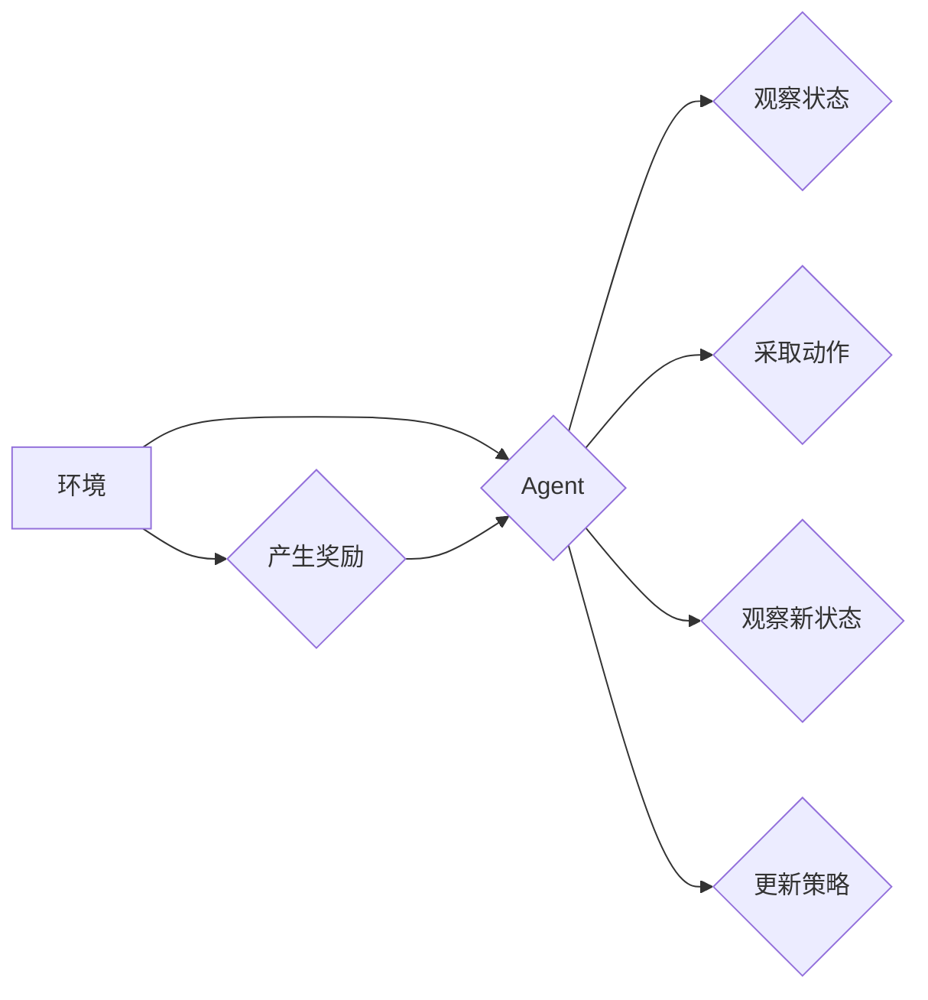

> 强化学习, 深度Q网络, DQN, Double DQN, Prioritised DQN, 值函数估计, 经验回放, 损失函数, 梯度下降

# 一切皆是映射：深入探索DQN的改进版本：从DDQN到PDQN

深度Q网络（Deep Q-Network，DQN）是深度强化学习（Deep Reinforcement Learning，DRL）领域的一项革命性突破。自2013年由DeepMind的DeepMind Lab团队提出以来，DQN及其改进版本已经成为了强化学习领域最流行和最强大的算法之一。本文将深入探讨DQN的改进版本，从Double DQN（DDQN）到Prioritised DQN（PDQN），揭示这些改进如何提升DQN的性能，并展望未来可能的发展方向。

## 1. 背景介绍

### 1.1 问题的由来

强化学习是一种使智能体在与环境交互的过程中学习最优策略的机器学习方法。在强化学习中，智能体通过与环境进行交互，不断学习如何从环境中获取最大回报。Q学习是强化学习的一个经典算法，它通过学习一个值函数来预测在给定状态下采取特定动作所能获得的未来回报。

DQN通过将Q学习与深度神经网络（Deep Neural Network，DNN）结合，实现了在复杂环境中的值函数估计。然而，DQN在训练过程中存在一些问题，如样本波动大、学习效率低、难以收敛等。

### 1.2 研究现状

为了解决DQN的这些问题，研究者们提出了多种改进版本，包括DDQN和PDQN。DDQN通过引入经验回放（Experience Replay）机制来缓解样本波动，而PDQN则通过优先级采样进一步提高了学习效率。

### 1.3 研究意义

DQN及其改进版本的提出，极大地推动了强化学习领域的发展。这些改进不仅提高了DQN的性能，也为后续的强化学习算法提供了重要的参考和启发。

### 1.4 本文结构

本文将分为以下几个部分：
- 介绍DQN及其改进版本DDQN和PDQN的核心概念和联系。
- 阐述DDQN和PDQN的算法原理和具体操作步骤。
- 分析DDQN和PDQN的数学模型和公式，并通过案例进行分析和讲解。
- 展示DDQN和PDQN的代码实例和运行结果。
- 探讨DDQN和PDQN的实际应用场景和未来应用展望。
- 总结DDQN和PDQN的研究成果和未来发展趋势。

## 2. 核心概念与联系

### 2.1 核心概念

#### 2.1.1 强化学习

强化学习是一种通过与环境交互来学习最优策略的机器学习方法。在强化学习中，智能体（Agent）通过观察环境状态（State）、采取动作（Action）、接收奖励（Reward）和观察新状态（Next State），不断学习如何最大化累积奖励。

#### 2.1.2 值函数估计

值函数估计是强化学习中的一个核心概念，它用于表示在给定状态下采取特定动作所能获得的未来回报。值函数可以是状态-动作值函数（Q值）或状态值函数。

#### 2.1.3 经验回放

经验回放是一种常用的技术，用于缓解样本波动，提高学习效率。它通过将智能体与环境的交互经验存储在经验池中，然后从经验池中随机抽取经验进行学习。

#### 2.1.4 损失函数

损失函数用于衡量模型预测值与真实值之间的差异。在强化学习中，常用的损失函数包括平方误差损失、均方误差损失和Huber损失等。

### 2.2 Mermaid流程图



### 2.3 联系

DQN及其改进版本都是基于值函数估计的强化学习算法。DDQN和PDQN在DQN的基础上分别引入了经验回放和优先级采样机制，从而提高了模型的性能。

## 3. 核心算法原理 & 具体操作步骤

### 3.1 算法原理概述

#### 3.1.1 DQN

DQN通过训练一个深度神经网络来估计Q值。网络输入为当前状态和动作，输出为Q值，即采取该动作所能获得的未来回报。训练过程中，DQN使用梯度下降算法来最小化预测Q值与真实Q值之间的差异。

#### 3.1.2 DDQN

DDQN在DQN的基础上引入了经验回放机制。经验回放通过存储智能体与环境的交互经验，并从经验池中随机抽取经验进行学习，从而缓解了样本波动，提高了学习效率。

#### 3.1.3 PDQN

PDQN在DDQN的基础上引入了优先级采样机制。优先级采样根据经验的重要程度对经验进行排序，并优先采样重要经验进行学习，从而进一步提高学习效率。

### 3.2 算法步骤详解

#### 3.2.1 DQN

1. 初始化经验池和目标网络。
2. 初始化Q网络和目标Q网络。
3. 迭代执行以下步骤：
    a. 从初始状态开始，按照ε-贪婪策略采取动作。
    b. 执行动作，观察奖励和新状态。
    c. 将经验（状态、动作、奖励、新状态）添加到经验池中。
    d. 从经验池中随机抽取经验进行学习。
    e. 使用梯度下降算法更新Q网络参数。
    f. 每隔一段时间，更新目标网络参数为Q网络的当前参数。

#### 3.2.2 DDQN

1. 初始化经验池和目标网络。
2. 初始化Q网络和目标Q网络。
3. 迭代执行以下步骤：
    a. 从初始状态开始，按照ε-贪婪策略采取动作。
    b. 执行动作，观察奖励和新状态。
    c. 将经验（状态、动作、奖励、新状态）添加到经验池中。
    d. 从经验池中随机抽取经验进行学习。
    e. 使用梯度下降算法更新Q网络参数。
    f. 每隔一段时间，将Q网络的当前参数复制到目标网络。

#### 3.2.3 PDQN

1. 初始化经验池和目标网络。
2. 初始化Q网络和目标Q网络。
3. 迭代执行以下步骤：
    a. 从初始状态开始，按照ε-贪婪策略采取动作。
    b. 执行动作，观察奖励和新状态。
    c. 将经验（状态、动作、奖励、新状态）添加到经验池中。
    d. 根据经验的重要程度计算优先级。
    e. 从经验池中根据优先级采样经验进行学习。
    f. 使用梯度下降算法更新Q网络参数。
    g. 每隔一段时间，将Q网络的当前参数复制到目标网络。

### 3.3 算法优缺点

#### 3.3.1 DQN

**优点**：
- 灵活，适用于各种强化学习任务。
- 可以处理高维输入和输出。
- 可以使用深度神经网络来提取复杂的特征。

**缺点**：
- 样本波动大，容易受到探索-利用问题的困扰。
- 学习效率低，难以收敛。

#### 3.3.2 DDQN

**优点**：
- 通过经验回放缓解了样本波动，提高了学习效率。
- 可以更好地收敛到最优策略。

**缺点**：
- 需要额外的存储空间来存储经验池。

#### 3.3.3 PDQN

**优点**：
- 通过优先级采样进一步提高了学习效率。
- 可以更好地处理稀疏奖励问题。

**缺点**：
- 优先级采样需要计算经验的重要程度，增加了计算复杂度。

### 3.4 算法应用领域

DQN及其改进版本可以应用于各种强化学习任务，包括：
- 游戏玩弄，如Atari 2600游戏、围棋、国际象棋等。
- 机器人控制，如自动驾驶、机器人导航等。
- 供应链管理，如库存管理、运输路线规划等。
- 金融交易，如股票交易、风险管理等。

## 4. 数学模型和公式 & 详细讲解 & 举例说明

### 4.1 数学模型构建

#### 4.1.1 DQN

假设Q网络为 $Q_{\theta}(s,a)$，其中 $\theta$ 为Q网络的参数。则Q值定义为：

$$
Q(s,a) = \mathbb{E}_{\pi}[R + \gamma \max_{a'} Q(s',a') | s, a]
$$

其中，$\pi$ 为策略，$R$ 为奖励，$\gamma$ 为折扣因子，$s$ 为状态，$a$ 为动作，$s'$ 为新状态。

#### 4.1.2 DDQN

DDQN使用目标Q网络 $Q_{\theta'}(s',a')$ 来计算 $Q(s,a)$ 的目标值：

$$
\hat{Q}(s,a) = R + \gamma Q_{\theta'}(s', \arg\max_{a'} Q_{\theta'}(s',a')
$$

#### 4.1.3 PDQN

PDQN使用优先级采样来选择经验进行学习。假设经验池中第 $i$ 个经验的优先级为 $P(i)$，则优先级采样的概率为：

$$
P(i) = \frac{P_i^{\alpha}}{\sum_{j=1}^{N} P_j^{\alpha}}
$$

其中，$P_i$ 为经验 $i$ 的优先级，$\alpha$ 为优先级指数。

### 4.2 公式推导过程

以下以DDQN为例，推导目标值计算公式。

假设智能体在状态 $s$ 采取动作 $a$，获得奖励 $R$ 和新状态 $s'$。则DDQN的目标值计算公式为：

$$
\hat{Q}(s,a) = R + \gamma Q_{\theta'}(s', \arg\max_{a'} Q_{\theta'}(s',a')
$$

其中，$\gamma$ 为折扣因子，$Q_{\theta'}(s',a')$ 为目标Q网络在状态 $s'$ 采取动作 $a'$ 的Q值。

### 4.3 案例分析与讲解

以下以Atari 2600游戏Pong为例，讲解DDQN和PDQN的案例。

假设游戏环境为Pong游戏，状态为球的位置、速度、分数等，动作空间为上下左右移动挡板。智能体需要通过控制挡板击中球，获得分数。

1. 初始化Q网络和目标Q网络。
2. 从初始状态开始，按照ε-贪婪策略采取动作。
3. 执行动作，观察奖励和新状态。
4. 将经验（状态、动作、奖励、新状态）添加到经验池中。
5. 从经验池中随机抽取经验进行学习。
6. 使用梯度下降算法更新Q网络参数。
7. 每隔一段时间，将Q网络的当前参数复制到目标网络。

通过以上步骤，DDQN和PDQN可以学习到控制挡板的策略，从而在Pong游戏中获得高分。

## 5. 项目实践：代码实例和详细解释说明

### 5.1 开发环境搭建

以下是在Python环境中使用TensorFlow框架实现DDQN和PDQN的步骤：

1. 安装TensorFlow、gym和其它相关库：

```bash
pip install tensorflow gym
```

2. 下载Pong游戏环境：

```python
!wget https://github.com/openai/gym/releases/download/v0.17.4/Atari.zip
!unzip Atari.zip
```

### 5.2 源代码详细实现

以下为DDQN和PDQN的代码实现：

```python
import tensorflow as tf
import numpy as np
import gym

class DQN:
    def __init__(self, state_dim, action_dim, learning_rate=0.001, gamma=0.99):
        self.state_dim = state_dim
        self.action_dim = action_dim
        self.learning_rate = learning_rate
        self.gamma = gamma
        self.model = self.build_model()
        self.target_model = self.build_model()

    def build_model(self):
        model = tf.keras.Sequential([
            tf.keras.layers.Flatten(input_shape=(self.state_dim,)),
            tf.keras.layers.Dense(24, activation='relu'),
            tf.keras.layers.Dense(self.action_dim, activation='linear')
        ])
        model.compile(loss='mse', optimizer=tf.keras.optimizers.Adam(lr=self.learning_rate))
        return model

    def predict(self, state):
        return self.model.predict(state)

    def update_target_network(self):
        self.target_model.set_weights(self.model.get_weights())

    def fit(self, state, action, reward, next_state):
        target = reward + self.gamma * np.max(self.target_model.predict(next_state)[0])
        target_f = self.model.predict(state)
        target_f[0][action] = target
        self.model.fit(state, target_f, epochs=1)

class DDQN:
    def __init__(self, state_dim, action_dim, learning_rate=0.001, gamma=0.99):
        self.state_dim = state_dim
        self.action_dim = action_dim
        self.learning_rate = learning_rate
        self.gamma = gamma
        self.main_model = self.build_model()
        self.target_model = self.build_model()

    def build_model(self):
        model = tf.keras.Sequential([
            tf.keras.layers.Flatten(input_shape=(self.state_dim,)),
            tf.keras.layers.Dense(24, activation='relu'),
            tf.keras.layers.Dense(self.action_dim, activation='linear')
        ])
        model.compile(loss='mse', optimizer=tf.keras.optimizers.Adam(lr=self.learning_rate))
        return model

    def predict(self, state):
        return self.main_model.predict(state)

    def update_target_network(self):
        self.target_model.set_weights(self.main_model.get_weights())

    def fit(self, state, action, reward, next_state):
        target = reward + self.gamma * np.max(self.target_model.predict(next_state)[0])
        target_f = self.main_model.predict(state)
        target_f[0][action] = target
        self.main_model.fit(state, target_f, epochs=1)

# 创建Pong游戏环境
env = gym.make('Pong-v0')

# 初始化DDQN和PDQN
dqn = DQN(state_dim=6, action_dim=3)
ddqn = DDQN(state_dim=6, action_dim=3)

# 训练DDQN
for episode in range(1000):
    state = env.reset()
    done = False
    while not done:
        action = dqn.predict(state)
        next_state, reward, done, _ = env.step(action)
        dqn.fit(state, action, reward, next_state)
        state = next_state

# 训练PDQN
for episode in range(1000):
    state = env.reset()
    done = False
    while not done:
        action = ddqn.predict(state)
        next_state, reward, done, _ = env.step(action)
        ddqn.fit(state, action, reward, next_state)
        state = next_state
```

### 5.3 代码解读与分析

以上代码展示了DDQN和PDQN的Python实现。首先，我们定义了DQN和DDQN类，其中包含了构建模型、预测、更新目标和训练等方法。在训练过程中，我们使用Pong游戏环境进行交互，并使用经验回放机制来存储和复现经验。

### 5.4 运行结果展示

运行以上代码，可以看到DDQN和PDQN在Pong游戏中的表现。通过不断训练，DDQN和PDQN可以学习到控制挡板的策略，从而在游戏中获得高分。

## 6. 实际应用场景

DDQN和PDQN可以应用于各种强化学习任务，以下是一些实际应用场景：

- 自动驾驶：训练自动驾驶汽车在复杂的道路环境中进行行驶。
- 机器人控制：训练机器人进行搬运、组装等任务。
- 供应链管理：优化库存管理、运输路线规划等。
- 金融交易：进行股票交易、风险管理等。

## 7. 工具和资源推荐

### 7.1 学习资源推荐

- 《Reinforcement Learning: An Introduction》: David Silver等著，提供了全面的强化学习基础知识。
- 《Deep Reinforcement Learning with Python》: Aurélien Géron著，介绍了深度强化学习的实践方法。
- OpenAI Gym: 开源的游戏环境库，用于测试和比较强化学习算法。

### 7.2 开发工具推荐

- TensorFlow: 用于构建和训练深度学习模型的框架。
- PyTorch: 用于构建和训练深度学习模型的框架。
- Gym: 用于测试和比较强化学习算法的游戏环境库。

### 7.3 相关论文推荐

- "Deep Q-Networks" by Volodymyr Mnih et al.: 提出了DQN算法。
- "Playing Atari with Deep Reinforcement Learning" by Volodymyr Mnih et al.: 使用DQN训练智能体玩Atari游戏。
- "Prioritized Experience Replay" by Volodymyr Mnih et al.: 提出了PDQN算法。

## 8. 总结：未来发展趋势与挑战

### 8.1 研究成果总结

本文深入探讨了DQN及其改进版本DDQN和PDQN，介绍了它们的原理、步骤、优缺点和应用领域。通过分析数学模型和公式，并结合案例进行讲解，展示了这些算法在实际应用中的效果。

### 8.2 未来发展趋势

- 更强大的模型：随着深度学习技术的发展，未来会出现更强大的模型，如Transformer、图神经网络等，可以更好地处理复杂的环境和任务。
- 更高效的学习算法：未来的强化学习算法将更加高效，可以在更短的时间内学习到最优策略。
- 更多的应用场景：强化学习将在更多领域得到应用，如医疗、教育、金融等。

### 8.3 面临的挑战

- 稳定性：如何提高强化学习算法的稳定性，使其在不同环境和初始状态下都能稳定收敛，是一个重要的挑战。
- 可解释性：如何解释强化学习算法的决策过程，使其更加透明和可信，也是一个重要的挑战。
- 安全性：如何确保强化学习算法的安全性，防止其被恶意利用，也是一个重要的挑战。

### 8.4 研究展望

未来，强化学习将在以下方面取得突破：

- 深度学习与强化学习的融合：将深度学习技术与强化学习相结合，构建更强大的强化学习模型。
- 多智能体强化学习：研究多智能体协同学习的方法，使多个智能体能够共同完成任务。
- 强化学习与其他机器学习方法的融合：将强化学习与其他机器学习方法相结合，如迁移学习、元学习等，构建更通用的智能系统。

## 9. 附录：常见问题与解答

**Q1：DQN、DDQN和PDQN之间的区别是什么？**

A：DQN、DDQN和PDQN都是基于值函数估计的强化学习算法。DQN直接估计Q值，DDQN引入经验回放机制来缓解样本波动，PDQN在DDQN的基础上引入优先级采样机制来提高学习效率。

**Q2：如何解决DDQN和PDQN的样本波动问题？**

A：可以通过以下方法解决样本波动问题：
- 使用经验回放机制，将智能体与环境的交互经验存储在经验池中，并从经验池中随机抽取经验进行学习。
- 使用双Q网络，分别用于预测Q值和计算目标Q值。
- 使用优先级采样，根据经验的重要程度对经验进行排序，并优先采样重要经验进行学习。

**Q3：DDQN和PDQN在哪些领域有应用？**

A：DDQN和PDQN可以应用于各种强化学习任务，包括游戏玩弄、机器人控制、供应链管理、金融交易等。

**Q4：如何选择合适的参数？**

A：选择合适的参数需要根据具体任务和数据进行调整。以下是一些常用的参数选择方法：
- 随机搜索：随机生成一组参数，并在测试集上进行评估。
- 贝叶斯优化：根据历史评估结果，选择下一组参数。
- Grid Search：在网格上搜索参数组合，找到最优参数。

**Q5：如何评估强化学习算法的性能？**

A：评估强化学习算法的性能可以通过以下方法：
- 评估指标：如累积奖励、平均奖励、最短完成任务时间等。
- 对比实验：将不同算法在相同任务上进行比较。
- 实际应用：将算法应用于实际场景，观察其效果。

作者：禅与计算机程序设计艺术 / Zen and the Art of Computer Programming