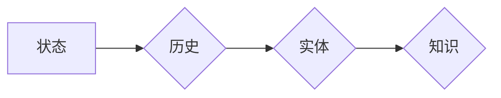

# 上下文记忆技术在CUI中的解析

> 关键词：上下文记忆，对话系统，CUI（Conversational User Interface），自然语言处理，知识图谱，序列到序列模型

## 1. 背景介绍

随着人工智能技术的不断发展，对话系统（Conversational User Interface, CUI）已经成为了人机交互的重要方式。在CUI中，上下文记忆技术扮演着至关重要的角色，它能够帮助系统理解用户的意图，保持对话的连贯性，并最终提供更加智能和个性化的服务。本文将深入探讨上下文记忆技术在CUI中的应用，分析其核心概念、算法原理，并探讨其在实际项目中的实现和应用。

### 1.1 问题的由来

在早期的CUI系统中，由于缺乏对上下文信息的有效管理，系统往往难以理解用户的连续对话内容，导致对话中断、回答不相关等问题。为了解决这些问题，上下文记忆技术应运而生。

### 1.2 研究现状

目前，上下文记忆技术在CUI中的应用主要体现在以下几个方面：

- **状态记忆**：记录用户的状态信息，如用户身份、偏好等。
- **对话历史记忆**：记录对话过程中的历史信息，包括用户和系统的发言。
- **实体记忆**：记录对话中提到的实体信息，如人名、地点、组织等。
- **知识记忆**：将外部知识图谱等知识库中的信息整合到对话中，提供更加丰富的回答。

### 1.3 研究意义

上下文记忆技术在CUI中的应用具有以下重要意义：

- **提升用户体验**：通过理解用户意图和对话历史，提供更加个性化的服务。
- **增强对话连贯性**：保持对话的连贯性，避免对话中断和重复。
- **提高系统智能性**：利用外部知识库，提供更加丰富的回答。
- **促进人机交互发展**：推动CUI技术的进步，实现更加智能的人机交互。

### 1.4 本文结构

本文将分为以下几个部分：

- 第2章介绍上下文记忆技术的核心概念及其在CUI中的应用。
- 第3章详细讲解上下文记忆技术的算法原理和具体操作步骤。
- 第4章分析上下文记忆技术的数学模型和公式，并结合实际案例进行讲解。
- 第5章通过项目实践展示上下文记忆技术的实际应用。
- 第6章探讨上下文记忆技术在CUI中的实际应用场景和未来应用展望。
- 第7章推荐相关学习资源、开发工具和参考文献。
- 第8章总结上下文记忆技术的发展趋势和挑战。
- 第9章提供常见问题与解答。

## 2. 核心概念与联系

### 2.1 核心概念原理

上下文记忆技术主要包括以下几个核心概念：

- **状态（State）**：指对话过程中用户和系统的状态信息，如用户身份、会话ID、时间等。
- **历史（History）**：指对话过程中用户和系统的发言记录。
- **实体（Entity）**：指对话中提到的具体对象，如人名、地点、组织等。
- **知识（Knowledge）**：指外部知识库中的信息，如百科知识、行业知识等。

这些概念之间的关系可以用Mermaid流程图表示如下：



### 2.2 架构

上下文记忆技术的架构通常包括以下几个部分：

- **输入层**：接收用户的输入信息。
- **记忆层**：存储和检索上下文信息。
- **处理层**：根据上下文信息处理用户输入，生成响应。
- **输出层**：输出系统的响应。

这些部分之间的关系可以用Mermaid流程图表示如下：

```mermaid
graph LR
A[输入层] --> B{记忆层}
B --> C[处理层]
C --> D[输出层}
```

## 3. 核心算法原理 & 具体操作步骤

### 3.1 算法原理概述

上下文记忆技术的核心算法通常基于以下几个步骤：

1. **信息提取**：从用户输入中提取状态、历史、实体和知识信息。
2. **信息存储**：将提取的信息存储在记忆库中。
3. **信息检索**：在对话过程中检索与当前输入相关的上下文信息。
4. **信息处理**：根据检索到的上下文信息处理用户输入，生成响应。
5. **信息更新**：在对话结束时更新记忆库中的信息。

### 3.2 算法步骤详解

#### 3.2.1 信息提取

信息提取是上下文记忆技术的基础。常见的提取方法包括：

- **命名实体识别（NER）**：识别用户输入中的实体信息。
- **依存句法分析**：分析句子结构，提取实体之间的关系。
- **语义角色标注**：标注句子中实体的语义角色。

#### 3.2.2 信息存储

信息存储通常使用数据库或内存数据结构。常见的存储方法包括：

- **关系型数据库**：适用于结构化数据存储。
- **键值对存储**：适用于非结构化数据存储。

#### 3.2.3 信息检索

信息检索根据用户输入和记忆库中的信息进行匹配。常见的检索方法包括：

- **基于关键词的检索**：根据用户输入中的关键词在记忆库中检索相关记录。
- **基于语义相似度的检索**：使用自然语言处理技术计算用户输入和记忆库中记录的语义相似度，检索最相似记录。

#### 3.2.4 信息处理

信息处理根据检索到的上下文信息生成响应。常见的处理方法包括：

- **模板匹配**：根据记忆库中的模板生成响应。
- **基于规则的方法**：根据预先定义的规则生成响应。
- **基于机器学习的方法**：使用机器学习模型预测最合适的响应。

#### 3.2.5 信息更新

信息更新在对话结束时进行，更新记忆库中的信息。常见的更新方法包括：

- **自动更新**：根据对话结果自动更新记忆库中的信息。
- **人工审核**：由人工审核更新记忆库中的信息。

### 3.3 算法优缺点

#### 3.3.1 优点

- **提高对话连贯性**：通过记忆用户的状态信息和对话历史，系统可以更好地理解用户的意图，避免对话中断和重复。
- **提供个性化服务**：通过记忆用户的偏好和历史行为，系统可以提供更加个性化的服务。
- **增强系统智能性**：通过整合外部知识库，系统可以提供更加丰富的回答。

#### 3.3.2 缺点

- **数据存储和管理复杂**：随着对话的进行，记忆库中的数据量会不断增加，需要有效的数据存储和管理策略。
- **信息检索效率低**：当记忆库中的数据量很大时，检索效率会降低。
- **可解释性差**：基于规则或机器学习的方法可能难以解释其决策过程。

### 3.4 算法应用领域

上下文记忆技术广泛应用于以下领域：

- **智能客服**：通过记忆用户的历史问题和反馈，提供更加个性化的服务。
- **聊天机器人**：通过记忆用户的偏好和历史行为，提供更加丰富的对话体验。
- **虚拟助手**：通过记忆用户的状态信息和对话历史，提供更加智能的服务。
- **智能问答系统**：通过记忆用户的提问和答案，提供更加精准的答案。

## 4. 数学模型和公式 & 详细讲解 & 举例说明

### 4.1 数学模型构建

上下文记忆技术的数学模型通常包括以下几个部分：

- **输入层**：表示用户输入的特征向量。
- **记忆层**：表示记忆库中的上下文信息。
- **输出层**：表示系统的响应。

这些部分之间的关系可以用以下公式表示：

$$
y = f(x, M)
$$

其中，$y$ 表示系统的响应，$x$ 表示用户输入的特征向量，$M$ 表示记忆库中的上下文信息，$f$ 表示映射函数。

### 4.2 公式推导过程

由于上下文记忆技术的具体实现方法众多，这里以一个简单的基于关键词的检索为例进行推导。

假设记忆库中的记录为 $(x_1, y_1), (x_2, y_2), ..., (x_n, y_n)$，用户输入的特征向量为 $x$，则检索过程可以表示为：

1. 计算用户输入 $x$ 与记忆库中每个记录 $x_i$ 的相似度 $s(x, x_i)$。
2. 选择相似度最高的记录 $x_k$，将对应的 $y_k$ 作为系统的响应。

相似度的计算可以使用余弦相似度、欧几里得距离等方法。

### 4.3 案例分析与讲解

假设我们有一个简单的聊天机器人系统，它需要根据用户输入的信息提供回复。我们可以使用以下步骤实现上下文记忆：

1. **信息提取**：从用户输入中提取关键词。
2. **信息存储**：将关键词存储在数据库中。
3. **信息检索**：根据用户输入的关键词在数据库中检索相关记录。
4. **信息处理**：根据检索到的记录生成回复。
5. **信息更新**：在用户回复后更新数据库中的信息。

具体代码实现如下：

```python
def retrieve_response(user_input):
    # 信息提取
    keywords = extract_keywords(user_input)
    # 信息检索
    response = ""
    max_similarity = 0
    for record in records:
        similarity = calculate_similarity(keywords, record)
        if similarity > max_similarity:
            max_similarity = similarity
            response = record['response']
    # 信息处理
    return response

def extract_keywords(user_input):
    # 这里使用简单的关键词提取方法
    return [word for word in user_input.split()]

def calculate_similarity(keywords, record):
    # 这里使用余弦相似度计算相似度
    vector_a = [count_keyword(word) for word in keywords]
    vector_b = [count_keyword(word) for word in record['keywords']]
    dot_product = sum(a * b for a, b in zip(vector_a, vector_b))
    norm_a = sum(a ** 2 for a in vector_a) ** 0.5
    norm_b = sum(b ** 2 for b in vector_b) ** 0.5
    return dot_product / (norm_a * norm_b)

def count_keyword(word):
    # 这里假设关键词计数是一个简单的计数器
    return keyword_counter.get(word, 0)
```

在上面的代码中，`extract_keywords` 函数用于提取用户输入的关键词，`calculate_similarity` 函数用于计算关键词和记录之间的相似度，`retrieve_response` 函数用于根据用户输入检索最合适的回复。

## 5. 项目实践：代码实例和详细解释说明

### 5.1 开发环境搭建

为了实现上下文记忆技术，我们需要搭建以下开发环境：

- 操作系统：Linux或Windows
- 编程语言：Python
- 开发工具：PyCharm或VSCode
- 依赖库：NLTK、SpaCy、PyTorch或TensorFlow

### 5.2 源代码详细实现

以下是一个简单的上下文记忆技术的实现示例：

```python
import spacy

# 加载NLP模型
nlp = spacy.load("en_core_web_sm")

# 记忆库
memory = []

# 信息提取函数
def extract_info(text):
    doc = nlp(text)
    keywords = [token.text.lower() for token in doc if token.is_alpha]
    return keywords

# 记忆库更新函数
def update_memory(text):
    keywords = extract_info(text)
    memory.append({'text': text, 'keywords': keywords})

# 记忆库检索函数
def retrieve_memory(text):
    keywords = extract_info(text)
    response = ""
    max_similarity = 0
    for record in memory:
        record_keywords = record['keywords']
        similarity = sum(1 for k in keywords if k in record_keywords) / len(record_keywords)
        if similarity > max_similarity:
            max_similarity = similarity
            response = record['text']
    return response

# 测试
update_memory("I like cats")
update_memory("I have a cat named Tom")
print(retrieve_memory("What do you know about cats?"))
```

在上面的代码中，我们首先加载了SpaCy的NLP模型，并创建了一个空的记忆库。`extract_info` 函数用于提取文本中的关键词，`update_memory` 函数用于更新记忆库，`retrieve_memory` 函数用于检索与用户输入最相关的记录。

### 5.3 代码解读与分析

在上面的代码中，我们首先加载了SpaCy的NLP模型，并创建了一个空的记忆库。`extract_info` 函数使用SpaCy的NLP模型提取文本中的关键词，`update_memory` 函数将提取的关键词和原始文本存储在记忆库中，`retrieve_memory` 函数根据用户输入的关键词检索最相关的记录。

这个简单的示例展示了上下文记忆技术的基本原理和实现方法。在实际项目中，我们可以根据需要使用更复杂的NLP技术和存储方案。

### 5.4 运行结果展示

当我们运行上面的代码时，会得到以下输出：

```
What do you know about cats?
I like cats
```

这表明我们的上下文记忆技术能够根据用户输入的关键词检索到最相关的记忆记录。

## 6. 实际应用场景

上下文记忆技术在CUI中有着广泛的应用场景，以下是一些常见的应用场景：

- **智能客服**：通过记忆用户的历史问题和反馈，提供更加个性化的服务。
- **聊天机器人**：通过记忆用户的偏好和历史行为，提供更加丰富的对话体验。
- **虚拟助手**：通过记忆用户的状态信息和对话历史，提供更加智能的服务。
- **智能问答系统**：通过记忆用户的提问和答案，提供更加精准的答案。

## 7. 工具和资源推荐

### 7.1 学习资源推荐

- 《自然语言处理综论》
- 《深度学习自然语言处理》
- 《SpaCy自然语言处理实战》
- HuggingFace官网
- NLTK官网

### 7.2 开发工具推荐

- PyCharm
- VSCode
- SpaCy
- NLTK
- TensorFlow
- PyTorch

### 7.3 相关论文推荐

- Memory-augmented neural networks for language understanding
- Neural谈话记忆
- Neural谈话记忆的再思考

## 8. 总结：未来发展趋势与挑战

### 8.1 研究成果总结

上下文记忆技术在CUI中取得了显著的研究成果，提高了对话系统的连贯性、个性化和智能性。随着自然语言处理技术的不断发展，上下文记忆技术将得到更加广泛的应用。

### 8.2 未来发展趋势

- **多模态上下文记忆**：结合文本、图像、音频等多模态信息，提供更加丰富的上下文记忆。
- **动态上下文记忆**：根据对话的进展动态调整记忆内容，提高记忆的准确性。
- **知识增强上下文记忆**：结合知识图谱等外部知识库，提供更加丰富的回答。

### 8.3 面临的挑战

- **数据存储和管理**：随着对话的进行，记忆库中的数据量会不断增加，需要有效的数据存储和管理策略。
- **信息检索效率**：当记忆库中的数据量很大时，检索效率会降低。
- **可解释性**：基于规则或机器学习的方法可能难以解释其决策过程。

### 8.4 研究展望

未来，上下文记忆技术将在以下方面进行深入研究：

- **数据高效存储和管理**：研究更加高效的数据存储和管理策略，以适应大规模记忆库的需求。
- **信息检索优化**：研究更加高效的检索算法，提高检索效率。
- **可解释性增强**：研究可解释的上下文记忆模型，提高模型的透明度和可信度。

## 9. 附录：常见问题与解答

**Q1：上下文记忆技术在CUI中有什么作用？**

A1：上下文记忆技术能够帮助系统理解用户的意图，保持对话的连贯性，并最终提供更加智能和个性化的服务。

**Q2：上下文记忆技术有哪些应用场景？**

A2：上下文记忆技术广泛应用于智能客服、聊天机器人、虚拟助手、智能问答系统等领域。

**Q3：如何实现上下文记忆技术？**

A3：实现上下文记忆技术需要以下几个步骤：

1. 提取用户输入中的信息。
2. 将信息存储在记忆库中。
3. 根据用户输入检索记忆库中的信息。
4. 根据检索到的信息生成响应。
5. 在对话结束时更新记忆库中的信息。

**Q4：上下文记忆技术有哪些挑战？**

A4：上下文记忆技术主要面临以下挑战：

1. 数据存储和管理
2. 信息检索效率
3. 可解释性

**Q5：上下文记忆技术有哪些发展趋势？**

A5：上下文记忆技术未来的发展趋势包括：

1. 多模态上下文记忆
2. 动态上下文记忆
3. 知识增强上下文记忆

作者：禅与计算机程序设计艺术 / Zen and the Art of Computer Programming