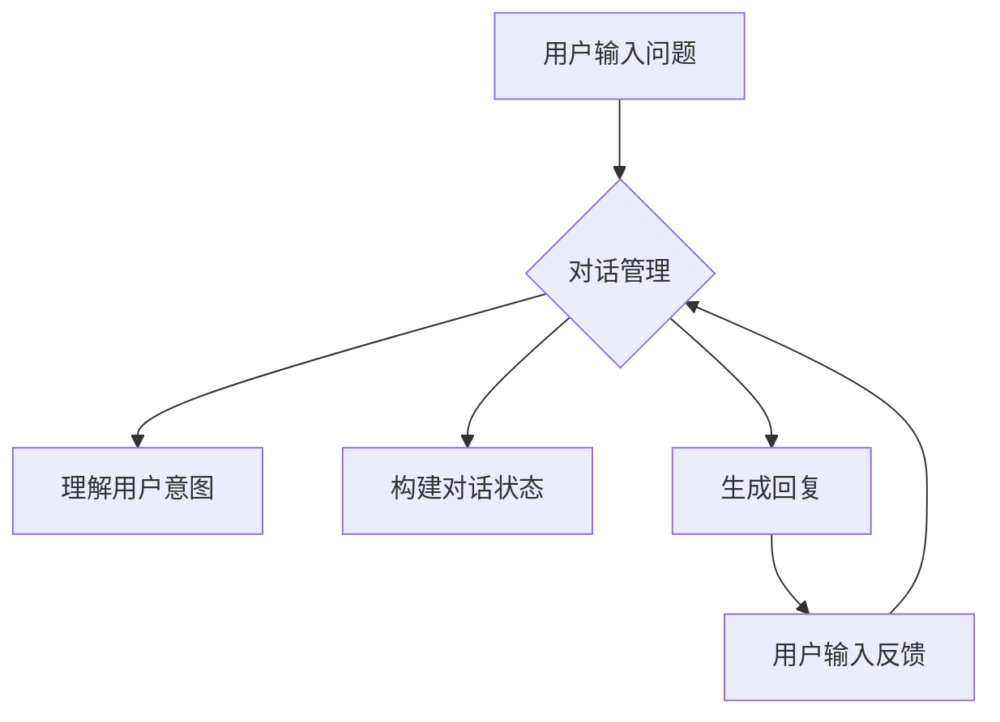

> 问答系统, 大模型, 对话机器人, 预训练语言模型, 微调, NLP, Transformer, BERT, 多轮对话

# 大模型问答机器人如何进行对话

> 关键词：
问答系统, 大模型, 对话机器人, 预训练语言模型, 微调, NLP, Transformer, BERT, 多轮对话

## 1. 背景介绍

随着人工智能技术的飞速发展，问答系统（Question Answering, QA）在自然语言处理（Natural Language Processing, NLP）领域取得了显著的进展。问答系统旨在让计算机能够理解自然语言问题，并从中提取关键信息，给出准确的答案。而大模型问答机器人，则是将大语言模型（Large Language Model, LLM）与问答系统相结合，实现了更加智能、流畅的对话交互。本文将深入探讨大模型问答机器人的对话原理、实现方法以及未来发展趋势。

### 1.1 问答系统的演变

问答系统的发展经历了三个主要阶段：

1. **基于事实的问答系统**：这类系统依赖固定的知识库，通过匹配问题和知识库中的事实进行回答，如早期的事实型问答系统。
2. **基于统计的问答系统**：这类系统利用机器学习技术，通过训练模型学习问题和答案之间的统计规律，如基于隐马尔可夫模型（Hidden Markov Model, HMM）的问答系统。
3. **基于深度学习的问答系统**：随着深度学习技术的兴起，基于深度学习的问答系统逐渐成为主流，它们能够更好地理解和生成自然语言，如基于循环神经网络（Recurrent Neural Network, RNN）和Transformer的问答系统。

### 1.2 大模型问答机器人的优势

大模型问答机器人融合了预训练语言模型和问答系统，具有以下优势：

- **强大的语言理解能力**：大模型能够理解和生成自然语言，使得问答机器人的回答更加自然流畅。
- **丰富的知识储备**：大模型在预训练过程中学习到了海量的知识，使得问答机器人能够回答更多领域的问题。
- **多轮对话能力**：大模型能够进行多轮对话，更好地理解用户意图，并给出更加准确的答案。

## 2. 核心概念与联系

### 2.1 核心概念原理

大模型问答机器人的核心概念包括：

- **预训练语言模型**：如BERT、GPT-3等，通过在大量文本语料上进行预训练，学习到丰富的语言知识和上下文理解能力。
- **问答系统**：旨在让计算机能够理解自然语言问题，并从中提取关键信息，给出准确的答案。
- **对话管理**：对话管理模块负责控制对话流程，包括理解用户意图、构建对话状态、生成回复等。

### 2.2 架构的 Mermaid 流程图



### 2.3 核心概念联系

大模型问答机器人的核心概念之间存在着紧密的联系。预训练语言模型为问答系统提供了强大的语言理解能力，对话管理模块则负责控制对话流程，使问答系统能够与用户进行多轮对话。

## 3. 核心算法原理 & 具体操作步骤

### 3.1 算法原理概述

大模型问答机器人的核心算法包括：

- **预训练语言模型**：使用如BERT、GPT-3等预训练语言模型。
- **问答系统**：使用如RNN、Transformer等深度学习模型，从问题中提取关键信息，生成答案。
- **对话管理**：使用强化学习、深度学习等方法，控制对话流程。

### 3.2 算法步骤详解

1. **用户输入问题**：用户通过语音或文本输入问题。
2. **对话管理**：接收用户输入，理解用户意图，构建对话状态，并生成回复。
3. **预训练语言模型**：使用预训练语言模型对用户输入和对话状态进行编码，提取关键信息。
4. **问答系统**：使用问答系统模型从编码后的输入中提取关键信息，生成答案。
5. **生成回复**：将问答系统生成的答案编码成自然语言，发送给用户。
6. **用户输入反馈**：用户输入反馈，如确认、否定、追问等。
7. **更新对话状态**：根据用户反馈更新对话状态。
8. **重复步骤2-7**：继续进行对话。

### 3.3 算法优缺点

#### 优点：

- **强大的语言理解能力**：预训练语言模型能够理解和生成自然语言，使得问答机器人的回答更加自然流畅。
- **丰富的知识储备**：大模型在预训练过程中学习到了海量的知识，使得问答机器人能够回答更多领域的问题。
- **多轮对话能力**：大模型能够进行多轮对话，更好地理解用户意图，并给出更加准确的答案。

#### 缺点：

- **依赖高质量的数据集**：预训练语言模型的性能很大程度上取决于数据集的质量，需要大量高质量的文本语料进行预训练。
- **计算资源消耗大**：大模型的训练和推理需要大量的计算资源。
- **可解释性差**：大模型的决策过程缺乏可解释性，难以理解其推理逻辑。

### 3.4 算法应用领域

大模型问答机器人可以应用于以下领域：

- **智能客服**：为用户提供7x24小时的在线客服服务。
- **智能助手**：帮助用户完成日常任务，如日程管理、信息查询等。
- **教育领域**：辅助教师进行教学，如自动批改作业、生成个性化学习方案等。
- **医疗领域**：辅助医生进行诊断，如辅助诊断疾病、提供治疗方案等。

## 4. 数学模型和公式 & 详细讲解 & 举例说明

### 4.1 数学模型构建

大模型问答机器人的数学模型主要包括：

- **预训练语言模型**：如BERT、GPT-3等。
- **问答系统**：如基于Transformer的问答模型。
- **对话管理**：如基于强化学习的对话管理模型。

### 4.2 公式推导过程

#### 预训练语言模型

以BERT为例，其公式推导过程如下：

$$
\text{BERT}(\text{x}, \text{y}) = \text{Transformer}(\text{Embedding}(x) \times \text{Positional Encoding})
$$

其中，$\text{Embedding}(x)$ 为词嵌入层，$\text{Positional Encoding}$ 为位置编码层，$\text{Transformer}$ 为Transformer模型。

#### 问答系统

以基于Transformer的问答模型为例，其公式推导过程如下：

$$
\text{Answer} = \text{Transformer}(\text{Query}, \text{Document}, \text{Answer})
$$

其中，$\text{Query}$ 为问题，$\text{Document}$ 为文档，$\text{Answer}$ 为答案。

#### 对话管理

以基于强化学习的对话管理模型为例，其公式推导过程如下：

$$
Q(s, a) = \sum_{s'} \pi(s', a') \times Q(s', a')
$$

其中，$Q(s, a)$ 为在状态 $s$ 下执行动作 $a$ 的价值函数，$\pi(s', a')$ 为在状态 $s'$ 下执行动作 $a'$ 的策略。

### 4.3 案例分析与讲解

以BERT问答系统为例，其工作流程如下：

1. 用户输入问题。
2. 对话管理模块理解用户意图，构建对话状态。
3. 预训练语言模型对用户输入和对话状态进行编码。
4. 问答系统模型从编码后的输入中提取关键信息，生成答案。
5. 对话管理模块将答案编码成自然语言，发送给用户。

## 5. 项目实践：代码实例和详细解释说明

### 5.1 开发环境搭建

1. 安装Python和PyTorch环境。
2. 安装Transformers库。
3. 准备数据集。

### 5.2 源代码详细实现

以下是一个基于BERT问答系统的简单示例：

```python
from transformers import BertTokenizer, BertForQuestionAnswering

# 加载预训练的BERT问答模型和分词器
tokenizer = BertTokenizer.from_pretrained('bert-base-uncased-whole-word-masking-finetuned-squad')
model = BertForQuestionAnswering.from_pretrained('bert-base-uncased-whole-word-masking-finetuned-squad')

# 用户输入问题
question = "What is the capital of France?"

# 将问题编码成BERT的输入格式
input_ids = tokenizer(question, return_tensors='pt', max_length=512, truncation=True)

# 进行问答
outputs = model(input_ids)

# 提取答案
start_logits = outputs.start_logits
end_logits = outputs.end_logits
start = torch.argmax(start_logits).item()
end = torch.argmax(end_logits).item()

# 解码答案
answer = tokenizer.decode(input_ids[0, start:end+1], skip_special_tokens=True)

print(answer)
```

### 5.3 代码解读与分析

以上代码展示了如何使用Transformers库加载预训练的BERT问答模型，并对用户输入的问题进行问答。首先，加载预训练的BERT问答模型和分词器。然后，将用户输入的问题编码成BERT的输入格式。最后，使用预训练模型进行问答，并提取答案。

### 5.4 运行结果展示

运行以上代码，假设用户输入的问题为"What is the capital of France?"，模型将输出答案："Paris"。

## 6. 实际应用场景

大模型问答机器人在以下场景中具有广泛的应用：

- **智能客服**：为用户提供7x24小时的在线客服服务。
- **智能助手**：帮助用户完成日常任务，如日程管理、信息查询等。
- **教育领域**：辅助教师进行教学，如自动批改作业、生成个性化学习方案等。
- **医疗领域**：辅助医生进行诊断，如辅助诊断疾病、提供治疗方案等。

## 7. 工具和资源推荐

### 7.1 学习资源推荐

- **《深度学习自然语言处理》**：吴恩达的NLP课程，涵盖了NLP领域的各种基础知识和最新技术。
- **《BERT实战》**：全面介绍了BERT模型的理论和实战应用。
- **《自然语言处理中的注意力机制》**：深入讲解了注意力机制在NLP领域的应用。

### 7.2 开发工具推荐

- **Transformers库**：Hugging Face提供的预训练语言模型库，包含大量预训练模型和工具。
- **TensorFlow**：Google开发的深度学习框架，提供了丰富的NLP模型和工具。
- **PyTorch**：Facebook开发的深度学习框架，具有灵活性和易用性。

### 7.3 相关论文推荐

- **BERT: Pre-training of Deep Bidirectional Transformers for Language Understanding**：BERT模型的原论文，介绍了BERT模型的原理和实现方法。
- **Generative Pre-trained Transformers**：GPT-3模型的原论文，介绍了GPT-3模型的原理和实现方法。
- **Reinforcement Learning for Dialogue Systems**：探讨了强化学习在对话系统中的应用。

## 8. 总结：未来发展趋势与挑战

### 8.1 研究成果总结

大模型问答机器人结合了预训练语言模型和问答系统的优势，能够实现更加智能、流畅的对话交互。通过预训练语言模型的学习，问答机器人能够理解和生成自然语言，并从海量知识库中提取答案。对话管理模块则负责控制对话流程，使问答机器人能够与用户进行多轮对话。

### 8.2 未来发展趋势

- **多模态融合**：将文本、图像、语音等多种模态信息融合到问答系统中，提高问答系统的理解能力和回答质量。
- **少样本学习**：减少对标注数据的依赖，实现少样本或无样本问答。
- **可解释性**：提高问答系统的可解释性，让用户理解问答机器人的决策过程。

### 8.3 面临的挑战

- **数据质量**：高质量的数据集对于问答系统的性能至关重要，但数据标注成本高，且难以获取。
- **计算资源**：大模型的训练和推理需要大量的计算资源。
- **可解释性**：大模型的决策过程缺乏可解释性，难以理解其推理逻辑。

### 8.4 研究展望

随着人工智能技术的不断发展，大模型问答机器人将在问答系统领域发挥越来越重要的作用。未来，我们需要关注以下研究方向：

- **数据增强**：通过数据增强技术，提高数据集的质量和多样性。
- **模型压缩**：通过模型压缩技术，降低模型的计算复杂度和存储空间。
- **可解释性**：提高问答系统的可解释性，让用户理解问答机器人的决策过程。

## 9. 附录：常见问题与解答

**Q1：大模型问答机器人是否能够理解自然语言？**

A：大模型问答机器人基于预训练语言模型，能够理解和生成自然语言，但理解能力受限于预训练语料和模型架构。

**Q2：大模型问答机器人能否回答所有问题？**

A：大模型问答机器人能够回答很多领域的问题，但对于某些专业领域或新出现的问题，可能无法给出准确的答案。

**Q3：大模型问答机器人的可解释性如何？**

A：大模型问答机器人的决策过程缺乏可解释性，难以理解其推理逻辑。未来需要关注可解释性研究，提高问答系统的透明度和可信度。

**Q4：大模型问答机器人的性能如何？**

A：大模型问答机器人的性能取决于预训练语料、模型架构和训练数据。通过不断优化和改进，大模型问答机器人的性能将不断提升。

**Q5：如何评估大模型问答机器人的性能？**

A：评估大模型问答机器人的性能可以从多个维度进行，如准确性、流畅性、回答质量等。常用的评估指标包括准确率、召回率、F1值等。

---

作者：禅与计算机程序设计艺术 / Zen and the Art of Computer Programming