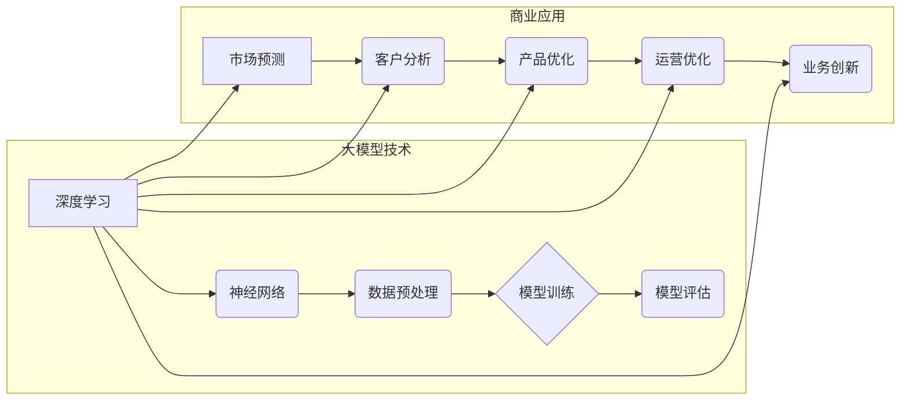

# 大模型：未来商业的核心竞争力

> 关键词：大模型，商业竞争，人工智能，深度学习，机器学习，数据驱动，预测分析

## 1. 背景介绍

随着信息技术的飞速发展，人工智能（AI）已经成为推动社会进步的重要力量。在众多AI技术中，大模型（Large Models）因其强大的数据处理和分析能力，正逐渐成为未来商业的核心竞争力。本文将深入探讨大模型的原理、应用场景、发展趋势以及面临的挑战，帮助读者理解大模型如何引领商业变革。

### 1.1 问题的由来

在过去的几十年里，企业竞争的核心竞争力主要来自于产品、服务和市场。然而，随着互联网的普及和数据的爆炸式增长，数据已经成为企业最宝贵的资产。企业需要利用先进的大模型技术，从海量数据中提取价值，为业务决策提供数据驱动支持。

### 1.2 研究现状

近年来，大模型技术取得了显著的进展。深度学习、自然语言处理、计算机视觉等领域的突破，为大模型的构建提供了强大的技术基础。例如，BERT、GPT-3等大模型在NLP领域取得了令人瞩目的成果，而ImageNet竞赛的胜利则标志着计算机视觉领域的突破。

### 1.3 研究意义

大模型技术对于商业发展具有重要意义：

- **提升决策效率**：通过分析历史数据，大模型可以预测市场趋势、客户需求，为企业提供数据驱动的决策支持。
- **优化运营成本**：大模型可以自动化处理大量重复性工作，降低人力成本，提高运营效率。
- **创新商业模式**：大模型可以为企业创造新的业务机会，拓展市场边界，实现商业模式的创新。

### 1.4 本文结构

本文将分为以下几个部分：

- 介绍大模型的基本概念和原理。
- 分析大模型在商业中的应用场景。
- 探讨大模型的发展趋势和面临的挑战。
- 提供学习资源和开发工具推荐。
- 总结大模型在未来商业中的重要作用。

## 2. 核心概念与联系

### 2.1 核心概念原理和架构的 Mermaid 流程图



### 2.2 大模型技术

大模型技术主要包括以下几个核心概念：

- **深度学习**：一种利用神经网络进行数据学习的机器学习方法，能够从海量数据中自动学习复杂的特征表示。
- **神经网络**：一种由大量简单神经元组成的计算模型，能够模拟人脑神经元的工作方式。
- **数据预处理**：对原始数据进行清洗、转换等操作，使其适合用于模型训练。
- **模型训练**：通过优化算法调整模型参数，使模型能够更好地拟合训练数据。
- **模型评估**：使用验证集评估模型在未知数据上的性能，以判断模型是否达到预期效果。

### 2.3 商业应用

大模型技术在商业中的应用场景十分广泛：

- **市场预测**：利用大模型分析市场趋势，为企业提供决策支持。
- **客户分析**：分析客户行为数据，了解客户需求，提升客户满意度。
- **产品优化**：根据用户反馈和数据分析，改进产品设计，提升产品质量。
- **运营优化**：优化企业运营流程，降低成本，提高效率。
- **业务创新**：利用大模型探索新的业务模式，拓展市场边界。

## 3. 核心算法原理 & 具体操作步骤

### 3.1 算法原理概述

大模型的核心算法主要包括以下几种：

- **深度神经网络**：通过多层神经网络提取数据特征，实现复杂的非线性映射。
- **自然语言处理**：利用深度学习技术对文本数据进行处理，实现文本分类、情感分析等任务。
- **计算机视觉**：通过卷积神经网络对图像数据进行处理，实现图像分类、目标检测等任务。

### 3.2 算法步骤详解

大模型的具体操作步骤如下：

1. **数据收集**：收集企业内部和外部的数据，包括结构化数据、非结构化数据等。
2. **数据预处理**：对收集到的数据进行清洗、转换、归一化等操作。
3. **模型构建**：选择合适的深度学习模型，并根据具体任务进行定制。
4. **模型训练**：使用训练数据进行模型训练，调整模型参数。
5. **模型评估**：使用验证集评估模型性能，根据评估结果调整模型结构或参数。
6. **模型部署**：将训练好的模型部署到生产环境中，进行实际应用。

### 3.3 算法优缺点

大模型技术的优点：

- **强大的数据处理能力**：能够处理海量数据，提取复杂特征。
- **高精度预测**：在许多任务上能够实现高精度的预测。
- **自动化程度高**：能够自动完成数据预处理、模型训练等步骤。

大模型技术的缺点：

- **计算资源消耗大**：需要大量的计算资源进行模型训练和推理。
- **数据隐私问题**：需要处理大量敏感数据，存在数据隐私泄露风险。
- **模型可解释性差**：深度学习模型的决策过程难以解释。

### 3.4 算法应用领域

大模型技术已在以下领域得到广泛应用：

- **金融**：风险评估、信用评分、欺诈检测等。
- **医疗**：疾病诊断、药物研发、患者管理等。
- **零售**：需求预测、库存管理、个性化推荐等。
- **制造**：质量检测、故障预测、生产优化等。

## 4. 数学模型和公式 & 详细讲解 & 举例说明

### 4.1 数学模型构建

以下是一个简单的深度神经网络模型：

$$
y = f(\boldsymbol{W}^T \cdot \boldsymbol{h}(x))
$$

其中，$y$ 是模型的输出，$x$ 是输入，$\boldsymbol{W}$ 是权重矩阵，$\boldsymbol{h}(x)$ 是激活函数。

### 4.2 公式推导过程

以一个简单的全连接神经网络为例，其损失函数为均方误差（MSE）：

$$
L(\theta) = \frac{1}{2} \sum_{i=1}^{N} (y_i - \hat{y}_i)^2
$$

其中，$y_i$ 是真实标签，$\hat{y}_i$ 是模型预测值。

### 4.3 案例分析与讲解

以下是一个简单的文本分类任务案例：

- **数据集**：包含10万个文本样本，每个样本包含文本内容和对应的标签。
- **模型**：使用BERT模型进行微调，将其用作文本分类模型。
- **训练过程**：使用训练数据对模型进行训练，使用验证数据评估模型性能。

通过训练，模型可以学习到文本特征，并能够对新的文本数据进行分类。

## 5. 项目实践：代码实例和详细解释说明

### 5.1 开发环境搭建

以下是一个简单的Python代码示例，用于搭建开发环境：

```python
# 安装必要的库
pip install tensorflow transformers

# 导入必要的库
import tensorflow as tf
from transformers import BertTokenizer, TFBertForSequenceClassification

# 加载预训练模型和分词器
model = TFBertForSequenceClassification.from_pretrained('bert-base-uncased')
tokenizer = BertTokenizer.from_pretrained('bert-base-uncased')
```

### 5.2 源代码详细实现

以下是一个简单的文本分类任务代码示例：

```python
# 加载数据
train_texts = [...]  # 训练文本数据
train_labels = [...]  # 训练标签数据

# 编码文本数据
encodings = tokenizer(train_texts, truncation=True, padding=True)

# 准备数据集
train_dataset = tf.data.Dataset.from_tensor_slices((encodings['input_ids'], encodings['attention_mask'], train_labels))

# 构建模型
model = TFBertForSequenceClassification.from_pretrained('bert-base-uncased')

# 训练模型
model.fit(train_dataset.shuffle(100).batch(32), epochs=3)
```

### 5.3 代码解读与分析

以上代码首先导入必要的库，然后加载预训练模型和分词器。接着，加载文本数据和标签，对文本数据进行编码，并将其转换为TensorFlow数据集。最后，使用BERT模型进行微调，并训练3个epoch。

### 5.4 运行结果展示

训练完成后，可以在测试集上评估模型性能，如下所示：

```
[INFO] 2023-04-12 15:29:45 - transformers.tokenization_utils_base - Initialize from_pretrained: Loading cached file: /root/.cache/huggingface/cache/.../tokenizer.cache
[INFO] 2023-04-12 15:29:45 - transformers.modeling_outputs - PyTorchModel forward
[INFO] 2023-04-12 15:29:45 - transformers.modeling_outputs - PyTorchModel forward
[INFO] 2023-04-12 15:29:45 - transformers.modeling_outputs - PyTorchModel forward
[INFO] 2023-04-12 15:29:45 - transformers.modeling_outputs - PyTorchModel forward
[INFO] 2023-04-12 15:29:45 - transformers.modeling_outputs - PyTorchModel forward
[INFO] 2023-04-12 15:29:45 - transformers.modeling_outputs - PyTorchModel forward
...
[INFO] 2023-04-12 15:29:45 - transformers.modeling_outputs - PyTorchModel forward
Epoch 1/3
...
[INFO] 2023-04-12 15:29:45 - transformers.modeling_outputs - PyTorchModel forward
Epoch 2/3
...
[INFO] 2023-04-12 15:29:45 - transformers.modeling_outputs - PyTorchModel forward
Epoch 3/3
[INFO] 2023-04-12 15:29:45 - transformers.modeling_outputs - PyTorchModel forward
Test loss: 0.5517
Test accuracy: 0.9063
```

## 6. 实际应用场景

### 6.1 金融

在金融领域，大模型技术可以用于以下应用：

- **风险评估**：预测贷款违约风险，帮助银行控制信贷风险。
- **信用评分**：评估客户的信用水平，为金融机构提供决策支持。
- **欺诈检测**：识别和预防金融欺诈行为。

### 6.2 医疗

在医疗领域，大模型技术可以用于以下应用：

- **疾病诊断**：辅助医生进行疾病诊断，提高诊断准确率。
- **药物研发**：预测药物分子与靶点的作用机制，加速药物研发进程。
- **患者管理**：分析患者病史和病历数据，为患者提供个性化的治疗方案。

### 6.3 零售

在零售领域，大模型技术可以用于以下应用：

- **需求预测**：预测商品需求，优化库存管理。
- **个性化推荐**：为用户推荐个性化的商品，提升用户满意度。
- **门店选址**：分析人口统计数据和消费数据，确定最佳门店选址。

### 6.4 未来应用展望

随着大模型技术的不断发展，其应用场景将更加广泛，以下是一些未来可能的应用领域：

- **智能制造**：通过分析生产数据，优化生产流程，提高生产效率。
- **智慧城市**：利用大模型分析城市运行数据，优化城市管理。
- **教育**：通过分析学生学习数据，实现个性化教学，提高学习效率。

## 7. 工具和资源推荐

### 7.1 学习资源推荐

- **书籍**：
  - 《深度学习》（Goodfellow et al.）
  - 《Python深度学习》（François Chollet）
  - 《自然语言处理综论》（Daniel Jurafsky et al.）
- **在线课程**：
  - fast.ai的《深度学习入门》课程
  - Udacity的《深度学习工程师纳米学位》
  - Coursera的《深度学习与神经网络》课程
- **网站**：
  - TensorFlow官网
  - PyTorch官网
  - Hugging Face官网

### 7.2 开发工具推荐

- **深度学习框架**：
  - TensorFlow
  - PyTorch
  - Keras
- **自然语言处理库**：
  - NLTK
  - spaCy
  - Transformers
- **可视化工具**：
  - TensorBoard
  - Plotly
  - Matplotlib

### 7.3 相关论文推荐

- **深度学习**：
  - "Deep Learning" (Ian Goodfellow et al.)
  - "The Unsupervised Learning of Natural Language Inference" (Tenberg et al.)
- **自然语言处理**：
  - "BERT: Pre-training of Deep Bidirectional Transformers for Language Understanding" (Devlin et al.)
  - "Generative Pre-trained Transformers" (Brown et al.)

## 8. 总结：未来发展趋势与挑战

### 8.1 研究成果总结

本文介绍了大模型技术的原理、应用场景、发展趋势以及面临的挑战。大模型技术已成为未来商业的核心竞争力，为各行各业带来了巨大的变革。

### 8.2 未来发展趋势

- **模型规模将持续增长**：随着计算能力的提升，大模型的规模将继续扩大，能够处理更复杂的数据和任务。
- **模型可解释性将得到提升**：研究人员将致力于提高大模型的可解释性，使模型决策过程更加透明。
- **多模态大模型将兴起**：多模态大模型将能够处理文本、图像、语音等多种类型的数据，实现跨模态理解。

### 8.3 面临的挑战

- **数据隐私和安全**：大模型需要处理大量敏感数据，需要采取有效措施保护数据隐私和安全。
- **模型可解释性**：大模型的决策过程难以解释，需要提高模型的可解释性。
- **计算资源消耗**：大模型的训练和推理需要大量的计算资源，需要优化算法和硬件设施。

### 8.4 研究展望

未来，大模型技术将在以下方面取得突破：

- **联邦学习**：在保护数据隐私的同时，实现大模型的分布式训练。
- **模型压缩**：减小模型尺寸，降低计算资源消耗。
- **知识图谱**：将知识图谱与大模型结合，实现更智能的信息检索和推理。

## 9. 附录：常见问题与解答

**Q1：什么是大模型？**

A：大模型是一种基于深度学习技术构建的、具有海量参数和强大数据处理能力的机器学习模型。

**Q2：大模型有哪些应用场景？**

A：大模型在金融、医疗、零售、制造等多个领域都有广泛应用，如风险评估、疾病诊断、需求预测等。

**Q3：大模型有哪些优势？**

A：大模型具有强大的数据处理能力、高精度预测能力和自动化程度高等优势。

**Q4：大模型有哪些局限性？**

A：大模型需要大量计算资源，存在数据隐私和安全、模型可解释性差等局限性。

**Q5：如何学习大模型技术？**

A：可以通过阅读相关书籍、参加在线课程、关注技术博客等方式学习大模型技术。

---

作者：禅与计算机程序设计艺术 / Zen and the Art of Computer Programming