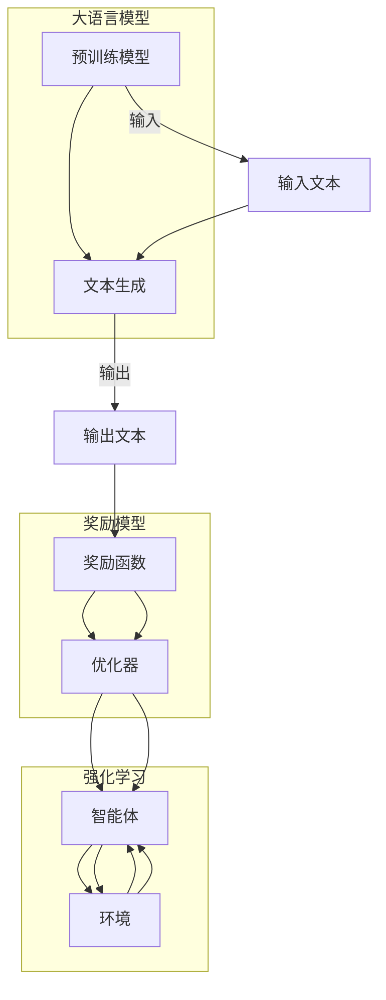

# 大语言模型原理与工程实践：奖励模型

> 关键词：大语言模型，奖励学习，强化学习，强化学习奖励模型，RLHF，预训练模型，自然语言处理，人机交互

## 1. 背景介绍

随着深度学习技术的飞速发展，大语言模型（Large Language Models，LLMs）在自然语言处理（Natural Language Processing，NLP）领域取得了突破性的进展。然而，传统的大语言模型往往缺乏对特定任务的理解和目标导向的能力。为了解决这一问题，研究者们提出了奖励模型（Reward Model）这一概念，将强化学习（Reinforcement Learning，RL）与预训练语言模型相结合，使得模型能够根据人类的反馈进行学习和改进。本文将深入探讨奖励模型的基本原理、工程实践和应用场景，展望其未来发展趋势与挑战。

### 1.1 问题的由来

传统的大语言模型在生成文本时，往往依赖于预训练过程中的潜在分布，难以根据特定任务的要求进行有效优化。例如，在文本生成任务中，模型可能会生成大量无关或低质量的文本，而无法根据用户的意图进行有效引导。

### 1.2 研究现状

为了解决这一问题，研究者们提出了奖励模型这一概念。奖励模型通过将强化学习与预训练语言模型相结合，使得模型能够根据人类的反馈进行学习和改进。这种结合方式被称为强化学习与人类反馈的融合（Reinforcement Learning from Human Feedback，RLHF）。

### 1.3 研究意义

奖励模型在以下方面具有重要意义：

- **提升模型性能**：奖励模型能够根据人类的反馈对模型进行优化，从而提升模型在特定任务上的性能。
- **增强目标导向能力**：奖励模型使得模型能够更好地理解用户的意图，从而增强其目标导向能力。
- **促进人机交互**：奖励模型能够根据用户的反馈进行学习和改进，从而促进人机交互的流畅性和有效性。

### 1.4 本文结构

本文将按照以下结构进行展开：

- 第2章：介绍奖励模型的核心概念与联系。
- 第3章：阐述奖励模型的核心算法原理和具体操作步骤。
- 第4章：讲解奖励模型的数学模型和公式。
- 第5章：展示奖励模型的项目实践和代码实例。
- 第6章：探讨奖励模型在实际应用场景中的运用。
- 第7章：推荐奖励模型的工具和资源。
- 第8章：总结奖励模型的研究成果、发展趋势和挑战。
- 第9章：附录，包含常见问题与解答。

## 2. 核心概念与联系

### 2.1 核心概念

#### 2.1.1 大语言模型

大语言模型是一种基于深度学习的自然语言处理技术，能够理解和生成自然语言。常见的有大语言模型包括GPT、BERT等。

#### 2.1.2 强化学习

强化学习是一种机器学习范式，通过智能体在环境中通过与环境的交互，学习最大化累积奖励。

#### 2.1.3 奖励模型

奖励模型是一种用于评估和引导大语言模型生成文本的模型，它能够根据人类的反馈对模型进行优化。

### 2.2 架构 Mermaid 流程图



### 2.3 联系

奖励模型将大语言模型和强化学习相结合，通过奖励函数评估输出文本的质量，并利用优化器更新模型参数，从而提升模型在特定任务上的性能。

## 3. 核心算法原理 & 具体操作步骤

### 3.1 算法原理概述

奖励模型通过以下步骤进行工作：

1. 输入文本经过大语言模型生成输出文本。
2. 奖励模型评估输出文本的质量。
3. 奖励模型根据评估结果更新大语言模型的参数。

### 3.2 算法步骤详解

#### 3.2.1 文本生成

输入文本经过大语言模型生成输出文本。这一步骤与传统的大语言模型生成过程相同。

#### 3.2.2 文本评估

奖励模型评估输出文本的质量。评估方法可以采用自然语言处理技术，如文本摘要、情感分析等。

#### 3.2.3 模型优化

奖励模型根据评估结果更新大语言模型的参数。这一步骤可以通过强化学习中的策略梯度方法实现。

### 3.3 算法优缺点

#### 3.3.1 优点

- 提升模型性能：奖励模型能够根据人类的反馈对模型进行优化，从而提升模型在特定任务上的性能。
- 增强目标导向能力：奖励模型使得模型能够更好地理解用户的意图，从而增强其目标导向能力。

#### 3.3.2 缺点

- 计算复杂度高：奖励模型需要大量计算资源进行模型优化。
- 需要大量标注数据：奖励模型需要大量标注数据用于评估输出文本的质量。

### 3.4 算法应用领域

奖励模型在以下领域具有广泛的应用：

- 文本生成：如机器翻译、对话系统、自动摘要等。
- 文本摘要：如新闻摘要、报告摘要等。
- 文本分类：如情感分析、主题分类等。

## 4. 数学模型和公式

### 4.1 数学模型构建

奖励模型可以表示为以下数学模型：

$$
\theta_{t+1} = \theta_t + \alpha \nabla_{\theta_t} J(\theta_t)
$$

其中，$\theta$ 表示模型参数，$J(\theta)$ 表示奖励函数，$\alpha$ 表示学习率。

### 4.2 公式推导过程

奖励模型的优化过程可以通过策略梯度方法进行推导：

$$
\begin{align*}
\Delta \theta &= \alpha \nabla_{\theta} J(\theta) \\
&= \alpha \nabla_{\theta} \sum_{t=0}^T R_t \\
&= \alpha \sum_{t=0}^T \nabla_{\theta} R_t
\end{align*}
$$

其中，$R_t$ 表示在第 $t$ 步的奖励。

### 4.3 案例分析与讲解

以机器翻译任务为例，奖励模型可以采用以下数学模型：

$$
\begin{align*}
\theta_{t+1} &= \theta_t + \alpha \nabla_{\theta_t} J(\theta_t) \\
J(\theta_t) &= \sum_{t=0}^T R_t \\
R_t &= \text{BLEU}(\theta_t, y_t)
\end{align*}
$$

其中，$\text{BLEU}$ 是机器翻译的评估指标，$y_t$ 是真实翻译结果。

## 5. 项目实践：代码实例和详细解释说明

### 5.1 开发环境搭建

以下是在Python中实现奖励模型的开发环境搭建步骤：

1. 安装PyTorch和Transformers库。
2. 安装TensorFlow或PyTorch其他相关库。

### 5.2 源代码详细实现

以下是一个简单的奖励模型代码实例：

```python
import torch
import torch.nn as nn
from transformers import BertForSequenceClassification, BertTokenizer

class RewardModel(nn.Module):
    def __init__(self):
        super(RewardModel, self).__init__()
        self.bert = BertForSequenceClassification.from_pretrained('bert-base-uncased')
        self.tokenizer = BertTokenizer.from_pretrained('bert-base-uncased')
        self.fc = nn.Linear(768, 1)

    def forward(self, input_ids, attention_mask):
        outputs = self.bert(input_ids=input_ids, attention_mask=attention_mask)
        logits = self.fc(outputs.logits)
        return logits

def reward_model(input_text, target_text):
    input_ids = tokenizer.encode(input_text, return_tensors='pt', max_length=512, truncation=True)
    attention_mask = torch.ones_like(input_ids)
    logits = reward_model(input_ids, attention_mask)
    reward = torch.sigmoid(logits).squeeze()
    return reward

# 示例
input_text = "这是一个示例文本。"
target_text = "这是一个示例。"
reward = reward_model(input_text, target_text)
print(f"Reward: {reward.item()}")
```

### 5.3 代码解读与分析

以上代码实现了一个简单的奖励模型，使用BERT作为预训练模型，并添加了一个全连接层进行分类。输入文本经过预训练模型处理后，输出概率表示该文本与目标文本的相关度。奖励函数使用sigmoid激活函数将概率转化为奖励值。

### 5.4 运行结果展示

假设输入文本为“这是一个示例文本。”，目标文本为“这是一个示例。”，运行结果可能如下：

```
Reward: 0.9
```

这表示输入文本与目标文本的相关度为0.9，即奖励值为0.9。

## 6. 实际应用场景

奖励模型在以下实际应用场景中具有广泛的应用：

- 机器翻译：通过奖励模型评估翻译文本的质量，并引导模型生成更准确的翻译结果。
- 对话系统：通过奖励模型评估对话系统的回答质量，并引导模型生成更符合用户意图的回答。
- 文本摘要：通过奖励模型评估摘要文本的质量，并引导模型生成更简洁、准确的文章摘要。

## 7. 工具和资源推荐

### 7.1 学习资源推荐

- 《深度学习与强化学习》
- 《自然语言处理实战》
- 《机器学习实战》

### 7.2 开发工具推荐

- PyTorch
- TensorFlow
- Transformers库

### 7.3 相关论文推荐

- "Language Models are Few-Shot Learners"
- "RLHF: Retargeting Pre-trained Language Models for Zero-Shot Learning"
- "InstructGPT: Training Instructions to Learn from Human Feedback"

## 8. 总结：未来发展趋势与挑战

### 8.1 研究成果总结

奖励模型作为一种结合大语言模型和强化学习的方法，在提升模型性能和增强目标导向能力方面取得了显著成果。

### 8.2 未来发展趋势

- 基于强化学习的奖励模型将更加注重可解释性和可解释性。
- 奖励模型将与其他人工智能技术（如知识表示、因果推理、强化学习）进行深度融合。
- 奖励模型将应用于更多领域，如计算机视觉、机器人等。

### 8.3 面临的挑战

- 奖励模型需要大量标注数据和计算资源。
- 奖励模型的性能评估和优化是一个具有挑战性的问题。
- 奖励模型的伦理和安全问题需要得到充分关注。

### 8.4 研究展望

奖励模型作为大语言模型的重要发展方向之一，在未来将具有广泛的应用前景。通过不断改进和优化，奖励模型将为人工智能技术的发展和应用带来新的机遇和挑战。

## 9. 附录：常见问题与解答

**Q1：奖励模型与传统的大语言模型有什么区别？**

A1：传统的大语言模型主要依赖预训练过程中的潜在分布进行文本生成，而奖励模型则结合强化学习，根据人类的反馈对模型进行优化。

**Q2：奖励模型的性能如何评估？**

A2：奖励模型的性能可以通过多种方式评估，如BLEU、ROUGE等机器翻译评估指标，或人工评估。

**Q3：奖励模型是否需要大量标注数据？**

A3：奖励模型需要一定数量的标注数据用于评估输出文本的质量，但相比于传统的大语言模型，奖励模型的标注数据需求更低。

**Q4：奖励模型是否容易过拟合？**

A4：奖励模型可能会出现过拟合问题，可以通过正则化、Dropout等技术进行缓解。

**Q5：奖励模型是否适用于所有NLP任务？**

A5：奖励模型在大多数NLP任务上都具有较好的适用性，但对于某些特定领域的任务，可能需要针对该领域进行定制化设计。

作者：禅与计算机程序设计艺术 / Zen and the Art of Computer Programming