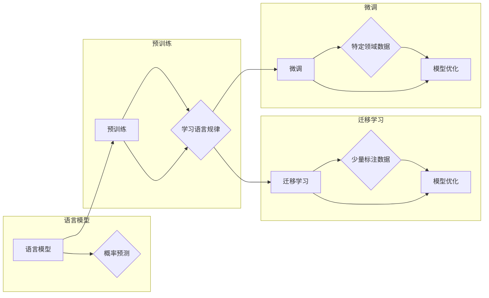

> 大语言模型，思考能力，自然语言理解，迁移学习，预训练，Transformer，BERT，生成式模型

# 大语言模型应用指南：关于大语言模型的思考能力

在人工智能的快速发展中，大语言模型（Large Language Models，LLMs）无疑是最引人注目的技术之一。这些模型在自然语言处理（NLP）领域展现了惊人的思考能力，能够理解和生成自然语言，甚至进行复杂的推理和创作。本文将深入探讨大语言模型的应用，分析其思考能力的原理和应用场景，并展望其未来发展趋势与挑战。

## 1. 背景介绍

### 1.1 问题的由来

自然语言是人类沟通的主要方式，而理解自然语言是人工智能领域的一个重要挑战。传统的NLP技术，如基于规则的方法和统计模型，在处理复杂任务时往往力不从心。随着深度学习技术的兴起，基于神经网络的模型在NLP任务中取得了显著成果。然而，这些模型往往需要大量的标注数据，且难以处理长文本和理解上下文。

大语言模型的出现，如GPT、BERT等，通过在海量文本数据上进行预训练，学习了丰富的语言知识和上下文信息，使得它们在NLP任务中展现出强大的思考能力。

### 1.2 研究现状

大语言模型的研究主要集中在以下几个方面：

- **预训练**：在大量无标注数据上进行预训练，学习语言的一般规律和知识。
- **迁移学习**：将预训练模型迁移到具体任务，通过少量标注数据进一步优化。
- **微调**：针对特定任务，在预训练模型的基础上进行微调，以适应不同领域的需求。

### 1.3 研究意义

大语言模型的应用具有以下重要意义：

- **推动NLP技术发展**：大语言模型为NLP技术提供了新的发展方向，推动了相关技术的创新。
- **提升NLP应用性能**：大语言模型在NLP任务中取得了显著成果，提升了应用性能。
- **拓展应用领域**：大语言模型的应用可以拓展到更多领域，如智能客服、机器翻译、文本摘要等。

## 2. 核心概念与联系

### 2.1 核心概念原理

大语言模型的核心概念包括：

- **语言模型**：用于预测下一个词或句子概率的模型，如n-gram模型、神经网络语言模型等。
- **预训练**：在大量无标注数据上训练模型，以学习语言的一般规律和知识。
- **迁移学习**：将预训练模型迁移到具体任务，通过少量标注数据进一步优化。
- **微调**：在预训练模型的基础上进行微调，以适应不同领域的需求。

### 2.2 核心概念架构图



## 3. 核心算法原理 & 具体操作步骤

### 3.1 算法原理概述

大语言模型的算法原理主要包括：

- **Transformer模型**：一种基于自注意力机制的深度神经网络模型，用于处理序列数据。
- **BERT模型**：一种基于Transformer的预训练语言表示模型，能够学习到丰富的语言知识。
- **预训练任务**：如掩码语言模型、下一句预测等，用于训练语言模型。
- **微调任务**：针对特定任务设计的训练任务，如文本分类、问答系统等。

### 3.2 算法步骤详解

大语言模型的算法步骤主要包括：

1. **预训练阶段**：在大量无标注数据上进行预训练，学习语言的一般规律和知识。
2. **迁移学习阶段**：将预训练模型迁移到具体任务，通过少量标注数据进一步优化。
3. **微调阶段**：在预训练模型的基础上进行微调，以适应不同领域的需求。

### 3.3 算法优缺点

大语言模型的优点包括：

- **强大的语言理解能力**：能够理解复杂的自然语言，包括词汇、语法、语义等。
- **丰富的知识储备**：通过预训练学习到丰富的语言知识和常识。
- **灵活的应用场景**：可以应用于各种NLP任务，如文本分类、问答系统、机器翻译等。

大语言模型的缺点包括：

- **计算资源消耗大**：需要大量的计算资源进行训练和推理。
- **数据依赖性强**：需要大量高质量的标注数据。
- **可解释性差**：模型的决策过程难以解释。

### 3.4 算法应用领域

大语言模型的应用领域包括：

- **文本分类**：如新闻分类、情感分析、垃圾邮件检测等。
- **问答系统**：如搜索引擎、聊天机器人等。
- **机器翻译**：如机器翻译、多语言信息检索等。
- **文本摘要**：如新闻摘要、会议纪要摘要等。

## 4. 数学模型和公式 & 详细讲解 & 举例说明

### 4.1 数学模型构建

大语言模型的数学模型主要包括：

- **Transformer模型**：基于自注意力机制的深度神经网络模型，其数学模型如下：

$$
\text{Attention}(Q, K, V) = \text{softmax}\left(\frac{QK^T}{\sqrt{d_k}}\right)V
$$

- **BERT模型**：基于Transformer的预训练语言表示模型，其数学模型如下：

$$
\text{BERT}(X) = \text{Transformer}(X, \text{Positional Encoding})
$$

### 4.2 公式推导过程

Transformer模型和BERT模型的公式推导过程较为复杂，需要参考相关论文和教材。

### 4.3 案例分析与讲解

以BERT模型为例，其预训练任务之一是掩码语言模型（Masked Language Model，MLM）。在MLM中，模型需要预测被掩码的词。

例如，给定句子 "The [MASK] is black"，其中"[MASK]"被掩码，模型需要预测被掩码的词。

通过预训练，BERT模型学习到丰富的语言知识，能够更好地预测被掩码的词。

## 5. 项目实践：代码实例和详细解释说明

### 5.1 开发环境搭建

为了进行大语言模型的实践，需要搭建以下开发环境：

- Python 3.6及以上版本
- PyTorch 1.0及以上版本
- Transformers库

### 5.2 源代码详细实现

以下是一个使用PyTorch和Transformers库实现BERT模型微调的简单示例：

```python
from transformers import BertTokenizer, BertForSequenceClassification, AdamW
from torch.utils.data import DataLoader, TensorDataset

# 加载预训练的BERT模型和分词器
tokenizer = BertTokenizer.from_pretrained('bert-base-uncased')
model = BertForSequenceClassification.from_pretrained('bert-base-uncased')

# 创建数据集
texts = ["Hello, world!", "Hello, AI!"]
labels = [0, 1]

encoded_input = tokenizer(texts, padding=True, truncation=True, return_tensors='pt')
input_ids = encoded_input['input_ids']
attention_mask = encoded_input['attention_mask']
labels = torch.tensor(labels)

# 创建数据加载器
dataset = TensorDataset(input_ids, attention_mask, labels)
dataloader = DataLoader(dataset, batch_size=1)

# 定义优化器
optimizer = AdamW(model.parameters(), lr=1e-5)

# 训练模型
model.train()
for epoch in range(2):
    for batch in dataloader:
        optimizer.zero_grad()
        outputs = model(input_ids=batch[0], attention_mask=batch[1])
        loss = outputs.loss
        loss.backward()
        optimizer.step()
    print(f"Epoch {epoch+1}, Loss: {loss.item()}")
```

### 5.3 代码解读与分析

上述代码展示了使用PyTorch和Transformers库实现BERT模型微调的基本步骤：

1. 加载预训练的BERT模型和分词器。
2. 创建数据集，包括文本和标签。
3. 创建数据加载器，用于批量加载数据。
4. 定义优化器，用于更新模型参数。
5. 训练模型，迭代更新模型参数。

### 5.4 运行结果展示

运行上述代码后，模型将在训练数据上进行迭代训练，并在每个epoch结束时输出loss。

## 6. 实际应用场景

大语言模型的应用场景非常广泛，以下是一些典型的应用场景：

- **智能客服**：通过大语言模型构建智能客服系统，能够自动回答用户问题，提高客户服务效率。
- **机器翻译**：大语言模型可以用于构建高质量的机器翻译系统，支持多种语言之间的翻译。
- **文本摘要**：大语言模型可以用于提取长文本的摘要，帮助用户快速了解文章内容。
- **问答系统**：大语言模型可以用于构建问答系统，回答用户提出的问题。
- **对话系统**：大语言模型可以用于构建对话系统，与用户进行自然对话。

## 7. 工具和资源推荐

### 7.1 学习资源推荐

- 《BERT: Pre-training of Deep Bidirectional Transformers for Language Understanding》
- 《Natural Language Processing with Transformers》
- 《The Annotated Transformer》

### 7.2 开发工具推荐

- PyTorch
- Transformers库
- Hugging Face CoLab

### 7.3 相关论文推荐

-《Attention is All You Need》
-《BERT: Pre-training of Deep Bidirectional Transformers for Language Understanding》
-《Generative Pretrained Transformer for Natural Language Understanding and Generation》

## 8. 总结：未来发展趋势与挑战

### 8.1 研究成果总结

大语言模型在NLP领域取得了显著成果，推动了NLP技术的发展和应用。然而，大语言模型仍然面临着诸多挑战，需要进一步研究和改进。

### 8.2 未来发展趋势

大语言模型未来的发展趋势包括：

- **模型规模持续增长**：随着计算资源的提升，大语言模型的规模将进一步扩大。
- **多模态融合**：大语言模型将与其他模态信息进行融合，如图像、视频等。
- **可解释性和可信赖性**：大语言模型的可解释性和可信赖性将成为研究重点。

### 8.3 面临的挑战

大语言模型面临的挑战包括：

- **计算资源消耗**：大语言模型的训练和推理需要大量的计算资源。
- **数据依赖**：大语言模型依赖于大量高质量的标注数据。
- **可解释性和可信赖性**：大语言模型的决策过程难以解释，且可能存在偏见和歧视。

### 8.4 研究展望

大语言模型的研究展望包括：

- **探索更高效的训练方法**：如参数高效微调、知识蒸馏等。
- **研究可解释性和可信赖性**：提高大语言模型的可解释性和可信赖性。
- **拓展应用领域**：将大语言模型应用于更多领域，如医疗、教育等。

## 9. 附录：常见问题与解答

**Q1：大语言模型是如何工作的？**

A：大语言模型通过在大量无标注数据上进行预训练，学习语言的一般规律和知识。然后，通过迁移学习将预训练模型迁移到具体任务，并通过微调进一步优化模型性能。

**Q2：大语言模型在哪些任务中表现出色？**

A：大语言模型在多种NLP任务中表现出色，如文本分类、问答系统、机器翻译、文本摘要等。

**Q3：大语言模型如何处理长文本？**

A：大语言模型通常使用分段技术处理长文本。即将长文本分割成多个短文本片段，然后分别进行编码和推理。

**Q4：大语言模型是否具有可解释性？**

A：大语言模型的可解释性较差。目前，研究者正在探索可解释性方法，以提高模型的可解释性和可信赖性。

**Q5：大语言模型如何防止偏见和歧视？**

A：大语言模型的偏见和歧视主要源于训练数据。为了防止偏见和歧视，需要使用无偏见的数据进行训练，并对模型进行评估和监控。

作者：禅与计算机程序设计艺术 / Zen and the Art of Computer Programming