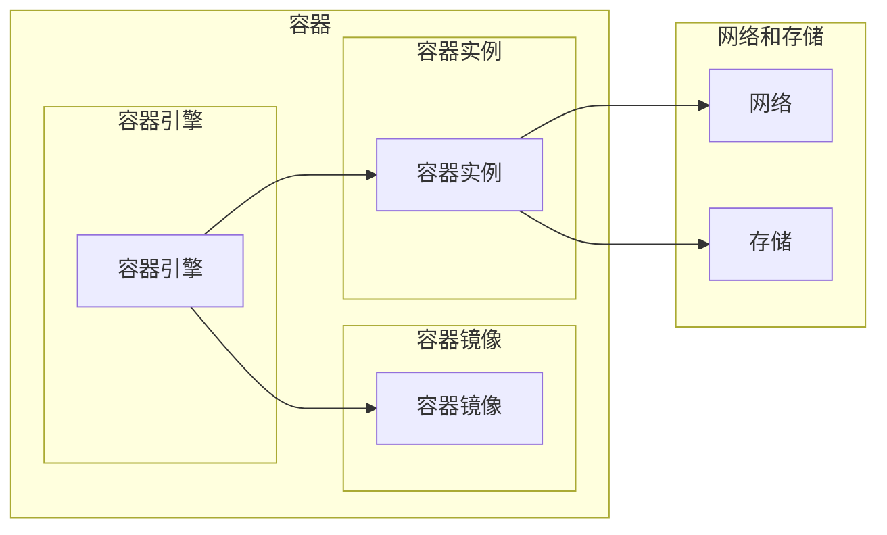

# 容器 原理与代码实例讲解

> 关键词：容器技术，Docker，Kubernetes，微服务，容器化，容器编排，DevOps，轻量级虚拟化

## 1. 背景介绍

随着云计算和分布式系统的兴起，传统的物理服务器和虚拟机部署方式逐渐无法满足现代应用的快速迭代和高效运维需求。容器技术应运而生，为软件的打包、部署和运维提供了全新的解决方案。本文将深入解析容器的原理，并通过代码实例讲解如何使用Docker和Kubernetes进行容器化部署和编排。

### 1.1 容器技术诞生的背景

在传统的IT基础设施中，软件的部署通常依赖于操作系统的安装和配置，这种部署方式存在着以下问题：

- 隔离性差：不同的应用可能依赖不同的操作系统版本或配置，导致部署难度和成本增加。
- 可移植性差：软件在不同的环境中运行可能会遇到兼容性问题。
- 可维护性差：当软件需要升级或更新时，需要重新配置操作系统环境。

为了解决这些问题，容器技术应运而生。容器技术通过轻量级的虚拟化，为应用程序提供了一个独立的运行环境，实现了软件与基础设施的解耦。

### 1.2 容器技术的优势

容器技术具有以下优势：

- 隔离性：容器可以提供与宿主机和其他容器隔离的运行环境，确保应用程序之间的互不影响。
- 可移植性：容器可以在任何支持容器技术的平台上运行，提高了软件的可移植性。
- 可维护性：容器的标准化和轻量级特性，使得软件的更新和维护更加容易。
- 性能：容器虚拟化技术比传统的虚拟机虚拟化技术更加轻量级，性能更优。

## 2. 核心概念与联系

### 2.1 容器核心概念

以下是容器技术中的核心概念：

- 容器：一种轻量级的、可执行的软件包，包含应用程序及其依赖项。
- 镜像：容器的静态版本，包含应用程序的可执行文件、库文件和配置文件。
- 容器引擎：负责创建、运行和管理容器的软件，如Docker。
- 容器编排：指自动化容器的部署、扩展和生命周期管理，如Kubernetes。

### 2.2 容器架构图

以下是一个简单的容器架构图：



### 2.3 容器与虚拟机的比较

以下是容器与虚拟机的主要区别：

| 特性 | 容器 | 虚拟机 |
| :--- | :--- | :--- |
| 虚拟化程度 | 轻量级虚拟化 | 全虚拟化 |
| 资源隔离 | 隔离应用程序的运行环境 | 隔离操作系统和硬件 |
| 性能 | 高 | 较低 |
| 可移植性 | 高 | 较低 |
| 隔离性 | 高 | 高 |
| 可维护性 | 高 | 高 |

## 3. 核心算法原理 & 具体操作步骤

### 3.1 算法原理概述

容器技术的核心是容器引擎，它负责创建、运行和管理容器。容器引擎通常使用以下算法原理：

- 虚拟文件系统：容器引擎使用虚拟文件系统来隔离容器的文件系统，使得容器内部的文件系统与宿主机隔离。
- 虚拟网络设备：容器引擎使用虚拟网络设备来隔离容器的网络，使得容器之间的网络互不影响。
- 虚拟CPU和内存管理：容器引擎使用虚拟CPU和内存管理器来隔离容器的资源，使得容器之间的资源互不影响。

### 3.2 算法步骤详解

以下是使用Docker进行容器化的基本步骤：

1. 编写Dockerfile：Dockerfile定义了容器的构建过程，包括基础镜像、安装依赖、配置环境等。
2. 构建镜像：使用Dockerfile构建容器镜像。
3. 运行容器：使用Docker run命令运行容器。

### 3.3 算法优缺点

### 3.3.1 优点

- 轻量级：容器不需要单独的操作系统，资源占用小。
- 快速：容器启动速度比虚拟机快。
- 可移植性：容器可以在任何支持Docker的平台运行。

### 3.3.2 缺点

- 系统调用限制：容器中的进程可能无法访问所有的系统调用。
- 网络和存储限制：容器网络和存储可能受到限制。

### 3.4 算法应用领域

容器技术可以应用于以下领域：

- Web应用部署
- 微服务架构
- DevOps实践
- 云计算平台

## 4. 数学模型和公式 & 详细讲解 & 举例说明

### 4.1 数学模型构建

容器技术的数学模型主要涉及以下方面：

- 容器资源分配：根据应用程序的需求，分配CPU、内存、存储等资源。
- 容器调度：根据资源需求和优先级，调度容器在宿主机上的运行。
- 容器网络模型：描述容器之间的网络连接和通信。

### 4.2 公式推导过程

以下是一个简单的容器资源分配公式：

$$
R_c = f(R_{total}, \alpha)
$$

其中，$R_c$ 表示容器 $c$ 的资源需求，$R_{total}$ 表示宿主机的总资源，$\alpha$ 表示分配因子。

### 4.3 案例分析与讲解

以下是一个使用Docker进行容器化的示例：

```Dockerfile
# 使用官方Python镜像作为基础镜像
FROM python:3.8-slim

# 设置工作目录
WORKDIR /app

# 将应用程序代码复制到容器中
COPY . /app

# 安装依赖
RUN pip install Flask

# 运行应用程序
CMD ["python", "app.py"]
```

```bash
# 构建镜像
docker build -t myapp .

# 运行容器
docker run -d -p 5000:5000 myapp
```

在这个例子中，我们使用Dockerfile定义了一个包含Flask应用程序的容器镜像，并使用`docker run`命令启动了一个容器，将容器的5000端口映射到宿主机的5000端口，使得可以通过Web访问应用程序。

## 5. 项目实践：代码实例和详细解释说明

### 5.1 开发环境搭建

以下是搭建Docker开发环境的步骤：

1. 安装Docker：从Docker官网下载并安装Docker。
2. 安装Docker Compose：Docker Compose是一个用于定义和运行多容器Docker应用程序的工具。
3. 安装Python和Flask：使用Python的pip包管理器安装Flask。

### 5.2 源代码详细实现

以下是一个使用Flask编写的简单Web应用程序：

```python
from flask import Flask, request, jsonify

app = Flask(__name__)

@app.route('/add', methods=['POST'])
def add():
    a = request.json['a']
    b = request.json['b']
    result = a + b
    return jsonify({'result': result})

if __name__ == '__main__':
    app.run(host='0.0.0.0', port=5000)
```

### 5.3 代码解读与分析

以上代码定义了一个简单的Web应用程序，用于计算两个数字的和。使用`Flask`框架构建应用程序，通过`POST`请求接收两个数字，计算它们的和，并将结果返回给客户端。

### 5.4 运行结果展示

在终端中运行以下命令，启动Docker容器：

```bash
docker run -d -p 5000:5000 myapp
```

然后，在浏览器中访问`http://localhost:5000/add`，输入两个数字，即可看到计算结果。

## 6. 实际应用场景

### 6.1 微服务架构

容器技术是实现微服务架构的关键技术之一。通过容器化，可以将微服务打包成独立的容器，实现服务的独立部署和扩展。

### 6.2 DevOps实践

容器技术可以帮助DevOps团队实现自动化部署和运维。使用Docker Compose和Kubernetes等工具，可以自动化容器的创建、启动、停止和扩展。

### 6.3 云计算平台

容器技术已经成为云计算平台的重要组成部分。如Amazon EC2 Container Service (ECS)、Google Kubernetes Engine (GKE) 和Azure Kubernetes Service (AKS) 等平台，都支持容器化部署。

## 7. 工具和资源推荐

### 7.1 学习资源推荐

- Docker官方文档：https://docs.docker.com/
- Kubernetes官方文档：https://kubernetes.io/docs/
- 容器技术实战：https://www\.geekbang\.org/course/200

### 7.2 开发工具推荐

- Docker：https://www\.docker\.com/
- Kubernetes：https://kubernetes\.io/
- Docker Compose：https://docs\.docker\.com/compose/

### 7.3 相关论文推荐

- Docker: Lightweight containers for software delivery and development: https://www\.usenix\.org/conference/systech14/technical-sessions/presentation/yan
- Kubernetes: System Design Overview: https://kubernetes\.io/docs/concepts/overview/
- Microservices: A容器化的服务架构：https://martinfowler.com/articles/microservices.html

## 8. 总结：未来发展趋势与挑战

### 8.1 研究成果总结

容器技术作为一种轻量级的虚拟化技术，在云计算和微服务架构中发挥着重要作用。通过容器化，可以简化软件的部署和运维，提高资源利用率和开发效率。

### 8.2 未来发展趋势

- 容器技术将进一步融合云计算、大数据和人工智能等技术，推动数字化转型。
- 容器编排和管理工具将更加智能化和自动化。
- 容器技术将应用于更多领域，如物联网、边缘计算等。

### 8.3 面临的挑战

- 容器安全：容器安全问题日益突出，需要加强容器安全防护。
- 容器标准化：容器技术的标准化工作任重道远，需要各方共同努力。
- 容器性能：容器性能优化是持续关注的问题，需要不断提升容器技术。

### 8.4 研究展望

- 探索容器技术在更多领域的应用。
- 加强容器安全和性能优化。
- 推动容器技术的标准化进程。

## 9. 附录：常见问题与解答

**Q1：什么是容器？**

A：容器是一种轻量级的、可执行的软件包，包含应用程序及其依赖项。

**Q2：容器与虚拟机的区别是什么？**

A：容器使用轻量级虚拟化，资源占用小，启动速度快；虚拟机使用全虚拟化，资源占用大，启动速度慢。

**Q3：如何使用Docker进行容器化？**

A：使用Dockerfile定义容器的构建过程，构建容器镜像，然后使用`docker run`命令运行容器。

**Q4：如何使用Kubernetes进行容器编排？**

A：使用Kubernetes的YAML文件定义容器的部署、扩展和生命周期管理，然后使用kubectl命令进行管理。

**Q5：容器技术有哪些优势？**

A：容器技术具有隔离性、可移植性、可维护性和高性能等优势。

作者：禅与计算机程序设计艺术 / Zen and the Art of Computer Programming