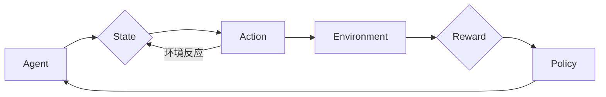

# 强化学习RL原理与代码实例讲解

> 关键词：强化学习，Q学习，SARSA，策略梯度，深度Q网络，DQN，强化学习应用

## 1. 背景介绍

强化学习（Reinforcement Learning，RL）是机器学习的一个分支，它使机器能够通过与环境的交互来学习。与监督学习和无监督学习不同，强化学习中的学习主体（Agent）通过与环境的互动，不断地从经验中学习，以实现某种目标或最大化某种累积奖励。

强化学习广泛应用于游戏、机器人、推荐系统、自动驾驶、金融等领域。本篇文章将深入讲解强化学习的基本原理、算法、实践实例以及未来发展趋势。

## 2. 核心概念与联系

### 2.1 强化学习核心概念

- **Agent（学习主体）**：进行学习和决策的主体，如机器人、软件程序等。
- **Environment（环境）**：Agent所在的周围世界，能够根据Agent的决策做出反应，并向Agent提供状态和奖励。
- **State（状态）**：Agent在环境中的当前位置或状态。
- **Action（动作）**：Agent可以采取的行为或决策。
- **Reward（奖励）**：环境对Agent动作的反馈，通常用来衡量Agent动作的好坏。
- **Policy（策略）**：Agent决定采取哪个动作的规则或方法。

### 2.2 核心概念原理和架构的 Mermaid 流程图



### 2.3 核心概念联系

强化学习的核心在于通过与环境交互，学习出一个策略（Policy），使Agent能够在不同状态下做出最优的动作（Action），从而获得最大的累积奖励（Reward）。策略是由Agent根据其学习到的经验来决定的。

## 3. 核心算法原理 & 具体操作步骤

### 3.1 算法原理概述

强化学习算法主要分为以下几类：

- **基于值的方法**：通过学习值函数来评估不同状态的价值，从而选择最优动作。
- **基于策略的方法**：直接学习策略，使Agent在任意状态下都能选择最优动作。
- **模型学习方法**：同时学习环境模型和策略。

### 3.2 算法步骤详解

1. **初始化**：初始化Agent的参数，包括状态空间、动作空间、策略、值函数等。
2. **选择动作**：根据当前状态，按照策略选择一个动作。
3. **与环境交互**：Agent执行选定的动作，环境根据动作提供新的状态和奖励。
4. **更新策略/值函数**：根据新的状态和奖励，更新策略或值函数。
5. **重复步骤2-4**：重复上述步骤，直到满足停止条件。

### 3.3 算法优缺点

- **Q学习**：优点是简单易实现，缺点是需要大量的探索来收集足够的数据。
- **SARSA**：优点是无需预测环境模型，缺点是收敛速度较慢。
- **策略梯度**：优点是直接学习策略，缺点是需要对策略函数进行梯度计算。
- **深度Q网络（DQN）**：优点是结合了深度学习和强化学习，缺点是训练不稳定，需要技巧来提高性能。

### 3.4 算法应用领域

强化学习在以下领域有广泛的应用：

- **游戏**：如Atari游戏、围棋、电子竞技等。
- **机器人**：如自主导航、机械臂操作、自动驾驶等。
- **推荐系统**：如新闻推荐、商品推荐等。
- **金融**：如股票交易、风险管理等。

## 4. 数学模型和公式 & 详细讲解 & 举例说明

### 4.1 数学模型构建

强化学习的基本数学模型可以表示为：

$$
\begin{align*}
R_t &= R(s_t, a_t) \\
Q(s_t, a_t) &= \sum_{s_{t+1}} \gamma R(s_{t+1}, a_{t+1}) \sum_{a_{t+1}} \pi(a_{t+1}|s_{t+1}) Q(s_{t+1}, a_{t+1}) \\
\pi(a_t|s_t) &= \text{选择动作的策略}
\end{align*}
$$

其中，$R_t$ 是Agent在时刻 $t$ 采取动作 $a_t$ 后获得的奖励，$R(s_t, a_t)$ 是环境在状态 $s_t$ 下采取动作 $a_t$ 后给予的奖励，$Q(s_t, a_t)$ 是在状态 $s_t$ 采取动作 $a_t$ 的期望回报，$\gamma$ 是折扣因子，$\pi(a_t|s_t)$ 是策略。

### 4.2 公式推导过程

Q学习的目标是学习一个值函数 $Q(s,a)$，使得 $Q(s,a)$ 接近于：

$$
Q^*(s,a) = \sum_{s' \in S} R(s,a) + \gamma \max_{a' \in A} Q^*(s',a')
$$

其中，$Q^*(s,a)$ 是最优值函数。

SARSA算法的目标是学习一个策略 $\pi(a|s)$，使得：

$$
\pi^*(a|s) = \arg\max_{a \in A} Q^*(s,a)
$$

策略梯度算法的目标是学习一个策略 $\pi(a|s)$，使得：

$$
J(\pi) = E_{s \sim \pi} [R(s,a) + \gamma \max_{a' \in A} Q(s',a')]
$$

其中，$J(\pi)$ 是策略的期望回报。

### 4.3 案例分析与讲解

以下是一个简单的强化学习案例：在一个简化的环境（迷宫）中，Agent需要找到从起点到终点的路径。

- 状态空间：迷宫中的每个位置。
- 动作空间：向左、向右、向上、向下。
- 奖励函数：到达终点获得10分，否则获得-1分。
- 策略：使用Q学习算法，在每一步选择动作时，以一定概率选择动作，以使Q值最大化。

通过多次迭代，Agent最终能够学会找到从起点到终点的路径。

## 5. 项目实践：代码实例和详细解释说明

### 5.1 开发环境搭建

以下是一个使用Python和OpenAI Gym库实现强化学习项目的环境搭建步骤：

1. 安装Python和pip。
2. 安装OpenAI Gym：`pip install gym`。
3. 选择一个环境，如CartPole，并下载相关数据：`gym install cart_pole`。

### 5.2 源代码详细实现

以下是一个使用Q学习算法解决CartPole问题的Python代码示例：

```python
import gym
import numpy as np

env = gym.make("CartPole-v0")

# 初始化Q表
Q = np.zeros([env.observation_space.n, env.action_space.n])

# 学习参数
alpha = 0.01  # 学习率
gamma = 0.99  # 折扣因子
epsilon = 0.1  # 探索率

# 训练过程
for episode in range(1000):
    state = env.reset()
    done = False
    while not done:
        # 以一定概率随机选择动作，以增加探索
        if np.random.uniform(0, 1) < epsilon:
            action = env.action_space.sample()
        else:
            action = np.argmax(Q[state, :])
        
        # 执行动作
        next_state, reward, done, _ = env.step(action)
        
        # 更新Q表
        Q[state, action] = Q[state, action] + alpha * (reward + gamma * np.max(Q[next_state, :]) - Q[state, action])
        
        state = next_state

# 关闭环境
env.close()
```

### 5.3 代码解读与分析

- `gym.make("CartPole-v0")` 创建了一个CartPole环境的实例。
- `Q` 是一个二维数组，用于存储状态-动作值函数。
- `alpha`、`gamma` 和 `epsilon` 分别是学习率、折扣因子和探索率。
- 训练过程中，通过迭代更新Q表，直到收敛。

### 5.4 运行结果展示

运行上述代码，可以看到Agent在经过多次迭代后，能够学会在CartPole环境中稳定地保持平衡。

## 6. 实际应用场景

强化学习在实际应用中具有广泛的应用场景，以下是一些示例：

- **自动驾驶**：通过强化学习，使自动驾驶汽车能够学习在不同路况下做出最优的驾驶决策。
- **机器人控制**：通过强化学习，使机器人能够在复杂的动态环境中进行自主导航和操作。
- **推荐系统**：通过强化学习，使推荐系统能够学习用户的兴趣和偏好，提供更加个性化的推荐。
- **金融**：通过强化学习，使金融系统能够学习市场规律，进行有效的投资决策。

## 7. 工具和资源推荐

### 7.1 学习资源推荐

- **书籍**：
  - 《Reinforcement Learning: An Introduction》
  - 《Reinforcement Learning: Algorithms, Techniques, and Examples》
- **在线课程**：
  - Coursera上的《Reinforcement Learning》课程
  - Udacity的《Reinforcement Learning Nanodegree》
- **网站**：
  - OpenAI官网
  - ArXiv

### 7.2 开发工具推荐

- **Python库**：
  - OpenAI Gym
  - PyTorch
  - TensorFlow
- **在线平台**：
  - Google Colab

### 7.3 相关论文推荐

- Q学习："Q-Learning" by Richard S. Sutton and Andrew G. Barto
- SARSA："Temporal Difference Learning" by Richard S. Sutton
- 策略梯度："Policy Gradient Methods" by Richard S. Sutton and Andrew G. Barto
- DQN："Deep Q-Network" by Volodymyr Mnih et al.

## 8. 总结：未来发展趋势与挑战

### 8.1 研究成果总结

强化学习作为机器学习的一个重要分支，在近年来取得了显著的进展。基于深度学习的强化学习方法，如DQN和PPO，在多个领域取得了突破性的成果。

### 8.2 未来发展趋势

- **多智能体强化学习**：研究多个Agent之间的交互和协作。
- **强化学习与人类知识融合**：将人类知识融入到强化学习模型中，提高模型的解释性和可解释性。
- **强化学习与物理仿真**：利用物理仿真环境进行强化学习，降低实际应用中的风险。

### 8.3 面临的挑战

- **样本效率**：强化学习需要大量的样本来学习，如何提高样本效率是当前的一个挑战。
- **探索与利用**：在强化学习中，如何平衡探索和利用是一个重要的挑战。
- **可解释性**：强化学习模型的决策过程通常缺乏可解释性，如何提高模型的可解释性是一个挑战。

### 8.4 研究展望

随着技术的不断发展，强化学习将在更多领域得到应用。未来，强化学习将与更多人工智能技术融合，如知识表示、因果推理、强化学习与物理仿真等，共同推动人工智能的发展。

## 9. 附录：常见问题与解答

**Q1：强化学习和监督学习有什么区别？**

A：强化学习中的学习主体通过与环境的交互来学习，而监督学习中的学习主体通过学习数据集来学习。强化学习的目标是学习一个策略或值函数，而监督学习的目标是学习一个函数或模型。

**Q2：强化学习在哪些领域有应用？**

A：强化学习在游戏、机器人、推荐系统、金融、自动驾驶等领域有广泛的应用。

**Q3：如何提高强化学习的样本效率？**

A：可以通过以下方法提高强化学习的样本效率：
- 使用多智能体强化学习，多个Agent可以共享经验。
- 使用迁移学习，将已有经验迁移到新的任务中。
- 使用强化学习与物理仿真，在虚拟环境中进行训练。

**Q4：如何平衡强化学习中的探索与利用？**

A：可以通过以下方法平衡强化学习中的探索与利用：
- 使用ε-greedy策略，以一定的概率选择随机动作进行探索。
- 使用UCB算法，选择具有最高上界估计的动作。
- 使用探索价值函数，将探索价值考虑在内。

**Q5：如何提高强化学习模型的可解释性？**

A：可以通过以下方法提高强化学习模型的可解释性：
- 使用可视化技术，将模型的结构和决策过程可视化。
- 使用因果推理，分析模型的行为背后的原因。
- 使用可解释的强化学习算法，如逆强化学习。

作者：禅与计算机程序设计艺术 / Zen and the Art of Computer Programming