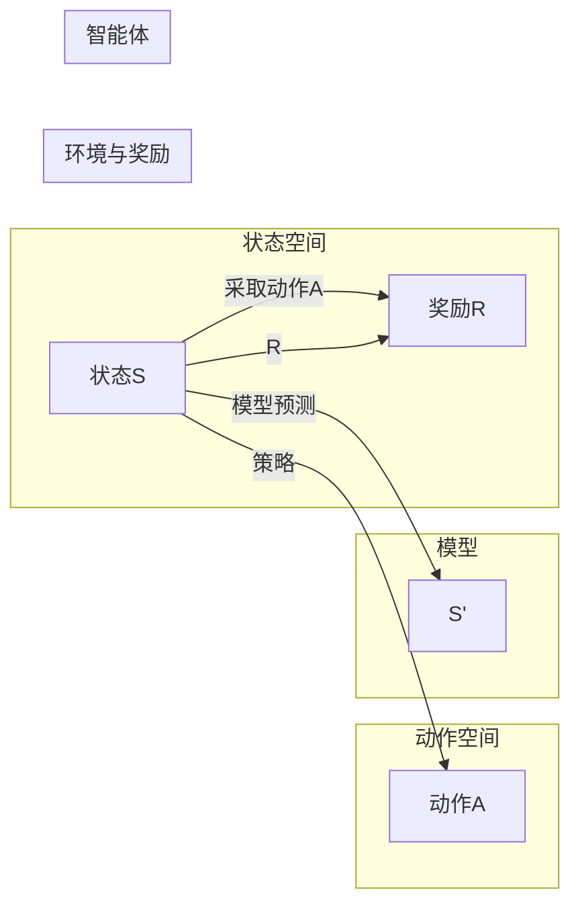

# 强化学习：策略迭代与价值迭代

> 关键词：强化学习，策略迭代，价值迭代，马尔可夫决策过程，Q学习，策略梯度，蒙特卡洛方法，探索-利用平衡

## 1. 背景介绍

强化学习（Reinforcement Learning, RL）是机器学习领域的一个重要分支，它通过智能体与环境的交互来学习最优策略。强化学习在很多领域都有应用，如游戏、机器人控制、推荐系统等。强化学习的核心思想是智能体通过与环境的交互，不断学习最优策略，以期在长期中获得最大回报。

强化学习的主要挑战在于如何平衡策略的探索（即尝试新的行动）和利用（即利用已知的最佳行动）。本文将深入探讨强化学习中的策略迭代和价值迭代两种主要方法，并分析它们的原理、操作步骤、优缺点以及应用领域。

## 2. 核心概念与联系

### 2.1 强化学习框架

强化学习框架通常包含以下核心概念：

- **智能体（Agent）**：执行动作并学习策略的实体。
- **环境（Environment）**：智能体行动的场所，智能体与环境交互。
- **状态（State）**：智能体在某个时刻所处的环境情况。
- **动作（Action）**：智能体可以采取的行动。
- **奖励（Reward）**：智能体采取某个动作后从环境中获得的即时回报。
- **策略（Policy）**：智能体根据当前状态选择动作的规则。
- **价值函数（Value Function）**：衡量智能体在某个状态下采取某个动作的长期回报。
- **模型（Model）**：对环境进行建模，预测未来状态和奖励。

Mermaid流程图如下：



### 2.2 策略迭代与价值迭代的关系

策略迭代和价值迭代是强化学习的两种主要方法。策略迭代方法直接从策略出发，通过迭代更新策略来优化智能体的行为。而价值迭代方法则从价值函数出发，通过迭代更新价值函数来优化策略。两种方法最终都能达到相同的目标，但在实现过程中有所不同。

## 3. 核心算法原理 & 具体操作步骤

### 3.1 策略迭代

策略迭代方法的基本思想是：通过不断迭代更新策略，使得策略能够最大化期望回报。

**算法步骤详解**：

1. 初始化策略 $\pi$，可以使用随机策略或贪婪策略。
2. 对于每个状态 $s$，根据策略 $\pi$ 选取动作 $a$，并执行动作，获得奖励 $r$ 和下一个状态 $s'$。
3. 更新策略 $\pi$，使得 $\pi$ 能够最大化期望回报。
4. 重复步骤2和3，直到满足停止条件。

**策略迭代优缺点**：

**优点**：

- 算法简单，易于理解。
- 在某些情况下，收敛速度快。

**缺点**：

- 需要大量迭代次数。
- 对于非平稳环境，收敛速度较慢。

### 3.2 价值迭代

价值迭代方法的基本思想是：通过不断迭代更新价值函数，使得价值函数能够准确反映智能体在各个状态下的最优回报。

**算法步骤详解**：

1. 初始化价值函数 $V(s)$，可以使用0初始化。
2. 对于每个状态 $s$，根据策略 $\pi$ 选取动作 $a$，并计算 $V(s)$ 的更新值：
   $$
   V(s) = \max_{a \in A} \left[ R(s,a) + \gamma V(s') \right]
   $$
   其中，$\gamma$ 是折扣因子。
3. 更新价值函数 $V(s)$。
4. 重复步骤2和3，直到满足停止条件。

**价值迭代优缺点**：

**优点**：

- 收敛速度比策略迭代快。
- 对于非平稳环境，收敛速度更快。

**缺点**：

- 需要计算价值函数的更新值，计算复杂度较高。
- 在某些情况下，可能陷入局部最优。

### 3.3 算法应用领域

策略迭代和价值迭代方法在多个领域都有应用，如：

- **游戏**：如围棋、国际象棋等。
- **机器人控制**：如无人驾驶、机器人导航等。
- **推荐系统**：如电影推荐、商品推荐等。

## 4. 数学模型和公式 & 详细讲解 & 举例说明

### 4.1 数学模型构建

强化学习中的数学模型通常基于以下公式：

**马尔可夫决策过程（MDP）**：

- **状态空间 $S$**：智能体可能处于的所有状态集合。
- **动作空间 $A$**：智能体可能采取的所有动作集合。
- **转移概率 $P(s'|s,a)$**：智能体在状态 $s$ 采取动作 $a$ 后，转移到状态 $s'$ 的概率。
- **奖励函数 $R(s,a)$**：智能体在状态 $s$ 采取动作 $a$ 后获得的即时回报。

**策略迭代**：

- **策略 $\pi(a|s)$**：智能体在状态 $s$ 采取动作 $a$ 的概率。

**价值迭代**：

- **价值函数 $V(s)$**：智能体在状态 $s$ 采取最佳动作的期望回报。

### 4.2 公式推导过程

**策略迭代**：

$$
\pi(a|s) = \begin{cases}
1 & \text{if } a = \arg\max_{a' \in A} \left[ R(s,a) + \gamma \sum_{s' \in S} P(s'|s,a') \pi(a'|s') \right] \\
0 & \text{otherwise}
\end{cases}
$$

**价值迭代**：

$$
V(s) = \max_{a \in A} \left[ R(s,a) + \gamma V(s') \right]
$$

### 4.3 案例分析与讲解

以下以简单的数学博弈为例，讲解策略迭代和价值迭代方法。

假设有两个玩家，每个玩家可以选择“合作”或“背叛”的行动。如果两个玩家都选择“合作”，则两人各得1分；如果两个玩家都选择“背叛”，则两人各得0分；如果一个玩家选择“合作”，另一个选择“背叛”，则选择“合作”的玩家得0分，选择“背叛”的玩家得3分。

定义状态空间为 $S = \{0, 1\}$，动作空间为 $A = \{0, 1\}$。转移概率和奖励函数如下：

| 状态s | 动作a | 状态s' | 奖励R |
|---|---|---|---|
| 0 | 0 | 0 | 1 |
| 0 | 1 | 1 | 0 |
| 1 | 0 | 0 | 0 |
| 1 | 1 | 1 | 3 |

假设初始策略 $\pi(a|s) = \frac{1}{2}$，折扣因子 $\gamma = 0.9$。

**策略迭代**：

首先，根据初始策略计算期望回报：

$$
V(s) = \begin{cases}
1 & \text{if } s = 0 \\
3 & \text{if } s = 1
\end{cases}
$$

然后，根据期望回报更新策略：

$$
\pi(a|s) = \begin{cases}
1 & \text{if } s = 0 \\
1 & \text{if } s = 1
\end{cases}
$$

**价值迭代**：

首先，初始化价值函数：

$$
V(s) = \begin{cases}
0 & \text{if } s = 0 \\
0 & \text{if } s = 1
\end{cases}
$$

然后，根据期望回报更新价值函数：

$$
V(s) = \begin{cases}
1 & \text{if } s = 0 \\
3 & \text{if } s = 1
\end{cases}
$$

通过以上分析，可以看到策略迭代和价值迭代方法都能够收敛到最优策略，即两个玩家都选择“合作”。

## 5. 项目实践：代码实例和详细解释说明

### 5.1 开发环境搭建

本文使用Python编程语言和PyTorch库进行强化学习项目的实践。以下是开发环境的搭建步骤：

1. 安装Anaconda：从官网下载并安装Anaconda，用于创建独立的Python环境。

2. 创建并激活虚拟环境：

```bash
conda create -n rl-env python=3.8
conda activate rl-env
```

3. 安装PyTorch：

```bash
conda install pytorch torchvision torchaudio cudatoolkit=11.1 -c pytorch -c conda-forge
```

4. 安装其他依赖库：

```bash
pip install gym numpy pandas matplotlib
```

完成以上步骤后，即可开始进行强化学习项目的实践。

### 5.2 源代码详细实现

以下是一个简单的Q学习（Q-Learning）算法实现：

```python
import numpy as np
import random

# 初始化Q表
def init_q_table(num_states, num_actions):
    return np.zeros((num_states, num_actions))

# 选择动作
def choose_action(state, q_table):
    if random.random() < epsilon:
        return random.choice(num_actions)
    else:
        return np.argmax(q_table[state])

# Q学习算法
def q_learning(num_states, num_actions, learning_rate, discount_factor, epsilon, episodes):
    q_table = init_q_table(num_states, num_actions)
    for episode in range(episodes):
        state = random.randint(0, num_states - 1)
        done = False
        while not done:
            action = choose_action(state, q_table)
            next_state, reward, done = get_next_state_and_reward(state, action)
            old_value = q_table[state][action]
            next_max = np.max(q_table[next_state])
            new_value = (1 - learning_rate) * old_value + learning_rate * (reward + discount_factor * next_max)
            q_table[state][action] = new_value
            state = next_state
    return q_table

# 获取下一个状态和奖励
def get_next_state_and_reward(state, action):
    # ... (实现环境交互逻辑)
    return next_state, reward, done
```

### 5.3 代码解读与分析

以上代码实现了简单的Q学习算法。其中，`init_q_table`函数初始化Q表，`choose_action`函数根据策略选择动作，`q_learning`函数实现Q学习算法，`get_next_state_and_reward`函数实现环境交互逻辑。

### 5.4 运行结果展示

运行上述代码，可以得到Q表的更新过程和最终结果。通过观察Q表的更新过程，可以看出Q学习算法能够逐渐学习到最优策略。

## 6. 实际应用场景

强化学习在许多实际应用场景中都有广泛的应用，以下是一些常见的应用场景：

- **游戏**：如围棋、国际象棋、电子竞技等。
- **机器人控制**：如无人驾驶、机器人导航、工业机器人控制等。
- **推荐系统**：如电影推荐、商品推荐、新闻推荐等。
- **金融领域**：如股票交易、风险评估、信用评分等。

## 7. 工具和资源推荐

### 7.1 学习资源推荐

- 《Reinforcement Learning: An Introduction》
- 《Reinforcement Learning: Principles and Practice》
- 《Deep Reinforcement Learning》

### 7.2 开发工具推荐

- PyTorch
- TensorFlow
- OpenAI Gym

### 7.3 相关论文推荐

- Q-Learning (Sutton, B. & Barto, A., 1987)
- Policy Gradient Methods (Sutton, R. S., 1984)
- Monte Carlo Methods (Mortensen, C. E., 1987)

## 8. 总结：未来发展趋势与挑战

### 8.1 研究成果总结

本文深入探讨了强化学习中的策略迭代和价值迭代两种方法，分析了它们的原理、操作步骤、优缺点以及应用领域。通过实例演示了Q学习算法的实现，并展示了强化学习在实际应用场景中的应用。

### 8.2 未来发展趋势

- **多智能体强化学习**：研究多个智能体如何协同工作，以实现共同目标。
- **无模型强化学习**：研究在未知环境模型的情况下进行强化学习的方法。
- **强化学习在物理世界中的应用**：研究将强化学习应用于现实世界的机器人控制、自动驾驶等领域。

### 8.3 面临的挑战

- **探索-利用平衡**：如何平衡探索和利用，以避免过早收敛到次优策略。
- **样本效率**：如何提高样本效率，减少训练所需的数据量。
- **可解释性**：如何提高强化学习模型的可解释性，使其更易于理解和信任。

### 8.4 研究展望

强化学习作为人工智能领域的一个重要分支，具有广阔的应用前景。未来，随着研究的不断深入，强化学习将在更多领域发挥重要作用，推动人工智能技术的发展。

## 9. 附录：常见问题与解答

**Q1：强化学习与监督学习和无监督学习有什么区别？**

A：强化学习与监督学习和无监督学习的主要区别在于学习方式。强化学习是通过与环境交互进行学习，而监督学习是通过标签数据进行学习，无监督学习则是通过无标签数据进行学习。

**Q2：Q学习和策略梯度有什么区别？**

A：Q学习是一种值迭代方法，它通过迭代更新值函数来优化策略。而策略梯度方法是一种直接从策略出发的方法，它通过梯度下降算法直接更新策略。

**Q3：如何解决强化学习中的探索-利用平衡问题？**

A：解决探索-利用平衡问题可以采用多种方法，如epsilon-greedy策略、UCB算法、多智能体强化学习等。

**Q4：如何提高强化学习的样本效率？**

A：提高强化学习的样本效率可以采用多种方法，如数据增强、迁移学习、基于模型的强化学习等。