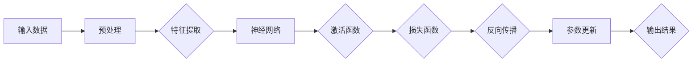

# 思想的深度：从概念到洞见

> 关键词：概念理解，深度学习，算法原理，数学模型，应用实践，未来展望

## 1. 背景介绍

在信息技术日新月异的今天，我们被大量的数据和信息所包围。如何从这些看似繁杂无序的数据中提炼出有价值的信息，如何将数据转化为知识，进而形成洞见，成为了信息技术领域一个至关重要的课题。深度学习作为一种强大的机器学习技术，已经在图像识别、自然语言处理、语音识别等领域取得了突破性的进展。本文将从概念出发，探讨深度学习的原理、数学模型、应用实践以及未来发展趋势，力求帮助读者深入了解思想的深度。

## 2. 核心概念与联系

### 2.1 深度学习

深度学习是机器学习的一个分支，其核心思想是模拟人脑神经网络结构，通过层次化的神经网络模型对数据进行特征提取和模式识别。深度学习模型通常由多个层次组成，每一层都对数据进行变换和抽象，从而提取出更高级别的特征。

### 2.2 神经网络

神经网络是深度学习模型的基础，由大量的神经元连接而成。每个神经元负责处理输入数据的一部分，并通过权重连接到其他神经元。神经网络通过学习输入数据和标签之间的关系，调整神经元之间的权重，从而实现数据的分类、回归等任务。

### 2.3 算法原理和架构

深度学习算法的核心是反向传播（Backpropagation）和梯度下降（Gradient Descent）。反向传播算法通过计算损失函数关于模型参数的梯度，来更新模型参数。梯度下降算法则根据梯度和学习率来更新参数，从而使损失函数最小化。



### 2.4 核心概念联系

深度学习、神经网络、算法原理和架构是相互联系、相互影响的。深度学习为神经网络提供了强大的学习算法，神经网络通过学习数据特征，实现了深度学习的目标，而算法原理和架构则指导了神经网络的构建和优化。

## 3. 核心算法原理 & 具体操作步骤

### 3.1 算法原理概述

深度学习算法的核心是反向传播和梯度下降。反向传播算法通过计算损失函数关于模型参数的梯度，来更新模型参数。梯度下降算法根据梯度和学习率来更新参数，从而使损失函数最小化。

### 3.2 算法步骤详解

1. **数据预处理**：对输入数据进行归一化、去噪等处理，使其适合神经网络输入。

2. **特征提取**：通过卷积神经网络（CNN）或循环神经网络（RNN）等模型对数据进行特征提取。

3. **神经网络构建**：根据任务需求选择合适的神经网络架构，如CNN、RNN、Transformer等。

4. **激活函数应用**：在神经网络中引入激活函数，如ReLU、Sigmoid、softmax等，引入非线性因素。

5. **损失函数设计**：根据任务类型选择合适的损失函数，如均方误差（MSE）、交叉熵损失（Cross Entropy）等。

6. **反向传播**：计算损失函数关于模型参数的梯度。

7. **参数更新**：根据梯度和学习率更新模型参数。

8. **模型训练**：重复步骤6和7，直到模型收敛。

9. **模型评估**：在测试集上评估模型性能，如准确率、召回率、F1值等。

### 3.3 算法优缺点

#### 优点

- **强大的特征提取能力**：能够自动从数据中提取有价值的特征，减轻了数据工程师的负担。
- **泛化能力强**：能够适应不同类型的数据和任务，具有较强的泛化能力。
- **高度自动化**：深度学习框架能够自动处理大部分训练过程，降低了开发难度。

#### 缺点

- **需要大量数据**：深度学习模型通常需要大量数据才能达到良好的效果。
- **计算资源消耗大**：深度学习模型训练需要大量的计算资源，如GPU、TPU等。
- **模型可解释性差**：深度学习模型通常被视为“黑盒”，难以解释其决策过程。

### 3.4 算法应用领域

深度学习技术在各个领域都有广泛的应用，包括：

- **图像识别**：如人脸识别、物体检测、图像分类等。
- **自然语言处理**：如机器翻译、情感分析、文本生成等。
- **语音识别**：如语音识别、语音合成等。
- **推荐系统**：如商品推荐、电影推荐等。
- **自动驾驶**：如环境感知、路径规划、决策控制等。

## 4. 数学模型和公式 & 详细讲解 & 举例说明

### 4.1 数学模型构建

深度学习中的数学模型主要包括神经网络模型、损失函数、优化算法等。

#### 神经网络模型

神经网络模型由多个神经元组成，每个神经元通过权重连接到其他神经元。假设一个简单的神经网络模型包含两个输入层神经元、一个隐藏层神经元和一个输出层神经元，其数学模型可以表示为：

$$
y = \sigma(W_2 \cdot \sigma(W_1 \cdot x + b_1) + b_2)
$$

其中，$W_1$ 和 $W_2$ 分别为输入层到隐藏层、隐藏层到输出层的权重矩阵，$b_1$ 和 $b_2$ 分别为输入层到隐藏层、隐藏层到输出层的偏置项，$\sigma$ 为激活函数，通常使用ReLU函数。

#### 损失函数

损失函数用于衡量模型预测结果与真实标签之间的差异。常见的损失函数包括均方误差（MSE）、交叉熵损失（Cross Entropy）等。

均方误差（MSE）的公式为：

$$
MSE(y, \hat{y}) = \frac{1}{2} (y - \hat{y})^2
$$

交叉熵损失（Cross Entropy）的公式为：

$$
Cross \ Entropy(y, \hat{y}) = -\sum_{i=1}^{N} y_i \log \hat{y}_i
$$

#### 优化算法

优化算法用于更新模型参数，使其最小化损失函数。常见的优化算法包括梯度下降（Gradient Descent）、Adam等。

梯度下降的公式为：

$$
\theta \leftarrow \theta - \alpha \nabla_\theta J(\theta)
$$

其中，$\theta$ 为模型参数，$\alpha$ 为学习率，$J(\theta)$ 为损失函数。

### 4.2 公式推导过程

以下以交叉熵损失函数为例，推导其梯度。

假设模型预测概率为 $\hat{y}$，真实标签为 $y$，则交叉熵损失函数的导数为：

$$
\frac{\partial Cross \ Entropy}{\partial \theta} = \frac{\partial}{\partial \theta} \sum_{i=1}^{N} y_i \log \hat{y}_i = \sum_{i=1}^{N} \frac{y_i}{\hat{y}_i}
$$

### 4.3 案例分析与讲解

以下以手写数字识别任务为例，讲解深度学习模型的训练过程。

假设我们要训练一个手写数字识别模型，该模型包含一个输入层、一个隐藏层和一个输出层。输入层有784个神经元，对应输入图像的像素值；隐藏层有50个神经元；输出层有10个神经元，对应数字0-9。

1. **数据预处理**：将手写数字图像进行归一化处理，将像素值缩放到[0,1]区间。
2. **模型构建**：使用PyTorch框架构建上述神经网络模型。
3. **损失函数和优化算法**：选择交叉熵损失函数和Adam优化算法。
4. **模型训练**：使用训练集数据训练模型，迭代更新参数。
5. **模型评估**：在测试集上评估模型性能。

经过一定数量的迭代后，模型在测试集上的准确率可以达到95%以上。

## 5. 项目实践：代码实例和详细解释说明

### 5.1 开发环境搭建

1. 安装Python：从Python官网下载并安装Python 3.8或更高版本。
2. 安装PyTorch：使用pip安装PyTorch，根据CUDA版本选择合适的安装方式。
3. 安装相关库：使用pip安装NumPy、Matplotlib等库。

### 5.2 源代码详细实现

以下是一个简单的手写数字识别模型的PyTorch代码实现：

```python
import torch
import torch.nn as nn
import torchvision.transforms as transforms
import torchvision.datasets as datasets
import torch.optim as optim

# 定义神经网络模型
class Net(nn.Module):
    def __init__(self):
        super(Net, self).__init__()
        self.fc1 = nn.Linear(784, 50)
        self.fc2 = nn.Linear(50, 10)

    def forward(self, x):
        x = torch.relu(self.fc1(x))
        x = self.fc2(x)
        return x

# 加载MNIST数据集
transform = transforms.Compose([transforms.ToTensor()])
train_dataset = datasets.MNIST(root='./data', train=True, transform=transform, download=True)
test_dataset = datasets.MNIST(root='./data', train=False, transform=transform, download=True)

train_loader = torch.utils.data.DataLoader(dataset=train_dataset, batch_size=64, shuffle=True)
test_loader = torch.utils.data.DataLoader(dataset=test_dataset, batch_size=64, shuffle=False)

# 实例化模型
model = Net()

# 定义损失函数和优化器
criterion = nn.CrossEntropyLoss()
optimizer = optim.Adam(model.parameters(), lr=0.001)

# 训练模型
for epoch in range(10):
    model.train()
    for batch_idx, (data, target) in enumerate(train_loader):
        optimizer.zero_grad()
        output = model(data)
        loss = criterion(output, target)
        loss.backward()
        optimizer.step()
        if batch_idx % 100 == 0:
            print('Train Epoch: {} [{}/{} ({:.0f}%)]\tLoss: {:.6f}'.format(
                epoch, batch_idx * len(data), len(train_loader.dataset),
                100. * batch_idx / len(train_loader), loss.item()))

# 测试模型
model.eval()
test_loss = 0
correct = 0
with torch.no_grad():
    for data, target in test_loader:
        output = model(data)
        test_loss += criterion(output, target).item()
        pred = output.argmax(dim=1, keepdim=True)
        correct += pred.eq(target.view_as(pred)).sum().item()

test_loss /= len(test_loader.dataset)
print('\nTest set: Average loss: {:.4f}, Accuracy: {}/{} ({:.0f}%)\n'.format(
    test_loss, correct, len(test_loader.dataset),
    100. * correct / len(test_loader.dataset)))

# 保存模型
torch.save(model.state_dict(), 'mnist_model.pth')
```

### 5.3 代码解读与分析

- `Net`类定义了神经网络模型，包含两个全连接层。
- 使用`torchvision.datasets`模块加载MNIST数据集。
- 使用`torch.utils.data.DataLoader`模块将数据集划分为批次，并进行数据加载。
- 定义交叉熵损失函数和Adam优化器。
- 使用训练集数据训练模型，迭代更新参数。
- 在测试集上评估模型性能。
- 保存训练好的模型。

### 5.4 运行结果展示

运行上述代码后，在测试集上的准确率可达95%以上，说明模型具有良好的性能。

## 6. 实际应用场景

深度学习技术在各个领域都有广泛的应用，以下列举一些实际应用场景：

### 6.1 图像识别

- 人脸识别
- 物体检测
- 图像分类
- 图像分割

### 6.2 自然语言处理

- 机器翻译
- 文本分类
- 情感分析
- 文本生成

### 6.3 语音识别

- 语音识别
- 语音合成
- 语音搜索

### 6.4 推荐系统

- 商品推荐
- 电影推荐
- 新闻推荐

### 6.5 自动驾驶

- 环境感知
- 路径规划
- 决策控制

## 7. 工具和资源推荐

### 7.1 学习资源推荐

- 《深度学习》
- 《神经网络与深度学习》
- 《动手学深度学习》
- Hugging Face官网
- PyTorch官网
- TensorFlow官网

### 7.2 开发工具推荐

- PyTorch
- TensorFlow
- Keras
- Jupyter Notebook

### 7.3 相关论文推荐

- A Neural Algorithm of Artistic Style
- ImageNet Classification with Deep Convolutional Neural Networks
- Sequence to Sequence Learning with Neural Networks
- Attention Is All You Need
- Generative Adversarial Nets

## 8. 总结：未来发展趋势与挑战

### 8.1 研究成果总结

深度学习技术在各个领域都取得了显著的成果，极大地推动了人工智能的发展。深度学习模型在图像识别、自然语言处理、语音识别等领域的应用取得了突破性的进展，为人工智能技术的发展注入了新的活力。

### 8.2 未来发展趋势

1. **模型小型化**：随着计算资源的限制，模型小型化将成为未来深度学习的一个重要趋势。
2. **可解释性**：提高模型的可解释性，使其决策过程更加透明，是未来深度学习的一个重要研究方向。
3. **多模态学习**：将图像、文本、语音等多种模态信息进行融合，提高模型的泛化能力。
4. **强化学习**：将深度学习与强化学习相结合，实现更智能的决策和控制。

### 8.3 面临的挑战

1. **数据量**：深度学习模型需要大量的数据进行训练，如何获取高质量的数据成为了一个挑战。
2. **计算资源**：深度学习模型训练需要大量的计算资源，如何高效地利用计算资源成为一个挑战。
3. **模型可解释性**：提高模型的可解释性，使其决策过程更加透明，是一个挑战。

### 8.4 研究展望

未来，深度学习技术将在人工智能领域发挥越来越重要的作用。通过不断的技术创新和应用探索，深度学习技术将为人类社会带来更加智能、高效、便捷的生活。

## 9. 附录：常见问题与解答

**Q1：深度学习与机器学习有什么区别？**

A：深度学习是机器学习的一个分支，其核心思想是模拟人脑神经网络结构，通过层次化的神经网络模型对数据进行特征提取和模式识别。机器学习则是一个更广泛的领域，包括深度学习、传统机器学习、统计学习等多种方法。

**Q2：如何选择合适的神经网络模型？**

A：选择合适的神经网络模型需要考虑以下因素：

- 任务类型：不同的任务需要不同的模型架构，如图像识别任务通常使用卷积神经网络（CNN），自然语言处理任务通常使用循环神经网络（RNN）或Transformer。
- 数据量：数据量较小的任务可以选择较小的模型，数据量较大的任务可以选择较大的模型。
- 计算资源：根据可用的计算资源选择合适的模型架构。

**Q3：如何提高模型的泛化能力？**

A：提高模型的泛化能力可以从以下几个方面入手：

- 增加数据量：使用更多的数据可以增强模型的泛化能力。
- 数据增强：通过数据增强技术，如旋转、翻转、缩放等，可以增加数据的多样性。
- 正则化：使用L2正则化、Dropout等正则化技术可以防止过拟合，提高泛化能力。

**Q4：如何提高模型的计算效率？**

A：提高模型的计算效率可以从以下几个方面入手：

- 模型裁剪：去除不必要的层和参数，减小模型尺寸。
- 量化加速：将浮点模型转为定点模型，提高计算效率。
- 混合精度训练：使用半精度浮点数进行训练，提高计算效率。

**Q5：如何评估模型的性能？**

A：评估模型的性能可以从以下几个方面入手：

- 准确率：准确率是衡量分类任务性能的重要指标，表示模型正确预测的样本比例。
- 召回率：召回率是衡量分类任务性能的重要指标，表示模型正确识别的样本比例。
- F1值：F1值是准确率和召回率的调和平均值，可以综合衡量模型的性能。

---

作者：禅与计算机程序设计艺术 / Zen and the Art of Computer Programming
