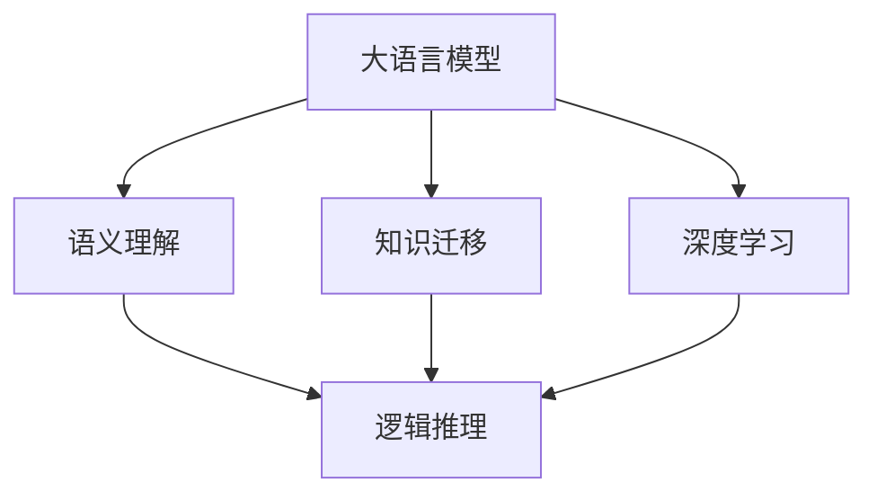
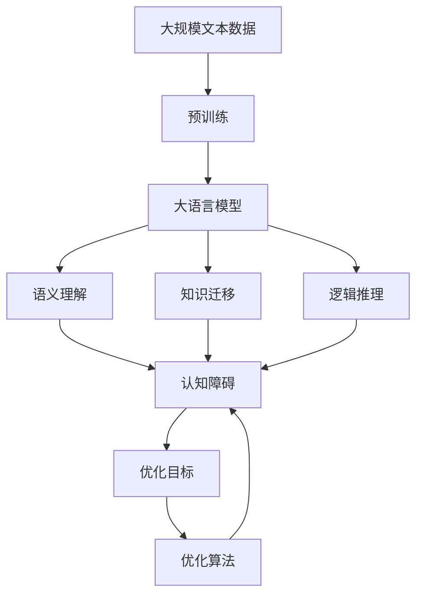

                 

# 语言≠思维：大模型的认知障碍

> 关键词：大模型,认知障碍,语言理解,语义,推理,感知,深度学习,神经网络,人工智能

## 1. 背景介绍

### 1.1 问题由来
近年来，随着深度学习技术的飞速发展，大语言模型（Large Language Models, LLMs）在自然语言处理（NLP）领域取得了重大突破。这些大语言模型通过在海量无标签文本数据上进行预训练，学习到了丰富的语言知识和常识，能够对复杂的语言表达进行理解和生成。然而，这些模型在推理和思维能力上仍存在显著局限，即所谓的“认知障碍”。

这些问题主要包括：
- **语义理解不足**：尽管大语言模型在理解语言表面含义方面表现出色，但在深入推理和理解语义层面仍存在缺陷。
- **知识迁移困难**：模型难以从一种任务中迁移知识和技能到另一种任务中，导致跨领域任务性能不佳。
- **逻辑推理能力有限**：大语言模型在面对需要复杂逻辑推理的任务时，常常无法给出合理的结论，表现出“思考停滞”的现象。

这些问题不仅限制了大模型在实际应用中的效果，也引发了人们对深度学习与人类认知本质区别的深刻反思。本文旨在深入探讨大模型的认知障碍，提出可能的解决方案，并对未来的研究方向进行展望。

### 1.2 问题核心关键点
认知障碍在大模型中主要表现为语义理解、知识迁移和逻辑推理三个方面。以下将对这些核心问题进行详细阐述：

1. **语义理解不足**：大模型在理解语言表面含义方面表现优异，但在深入理解语义层面存在局限。
2. **知识迁移困难**：模型难以从一种任务中迁移知识和技能到另一种任务中，导致跨领域任务性能不佳。
3. **逻辑推理能力有限**：大语言模型在面对需要复杂逻辑推理的任务时，常常无法给出合理的结论，表现出“思考停滞”的现象。

## 2. 核心概念与联系

### 2.1 核心概念概述

为更好地理解大模型的认知障碍，本节将介绍几个密切相关的核心概念：

- **大语言模型（LLMs）**：以自回归（如GPT）或自编码（如BERT）模型为代表的大规模预训练语言模型。通过在大规模无标签文本语料上进行预训练，学习通用的语言表示，具备强大的语言理解和生成能力。

- **语义理解（Semantic Understanding）**：指模型对语言表达背后意义的理解和解释能力。这是大模型在认知方面面临的主要障碍之一。

- **知识迁移（Knowledge Transfer）**：指模型在不同任务间迁移知识和技能的能力。认知障碍的另一个关键问题在于模型难以有效迁移知识，导致在多种任务上的泛化能力不足。

- **逻辑推理（Logical Reasoning）**：指模型进行逻辑推理和抽象思考的能力。在大模型中，逻辑推理能力限制了其解决需要复杂推理的任务，如因果关系推断和因果决策。

- **认知障碍（Cognitive Obstacle）**：指模型在语义理解、知识迁移和逻辑推理等方面的限制，导致其在实际应用中表现不佳。

- **深度学习（Deep Learning）**：一种通过多层神经网络进行模型训练和预测的学习方法，是实现大模型语义理解、知识迁移和逻辑推理的主要技术手段。

这些核心概念之间存在紧密的联系，共同构成了大模型认知障碍的研究框架。通过理解这些核心概念，我们可以更好地把握大模型的工作原理和优化方向。

### 2.2 概念间的关系

这些核心概念之间存在着紧密的联系，形成了大模型认知障碍的完整生态系统。以下通过几个Mermaid流程图来展示这些概念之间的关系：



这个流程图展示了大模型的认知障碍与深度学习技术之间的关系：

1. 大模型通过深度学习技术进行预训练，获得基础的语言理解能力。
2. 语义理解、知识迁移和逻辑推理是深度学习模型训练过程中需要解决的关键问题。
3. 解决认知障碍需要在大模型训练过程中引入额外的设计和技术手段，如增量学习、对抗训练等。

### 2.3 核心概念的整体架构

最后，我们用一个综合的流程图来展示这些核心概念在大模型认知障碍中的整体架构：



这个综合流程图展示了从预训练到大模型认知障碍的完整过程。大语言模型首先在大规模文本数据上进行预训练，然后通过语义理解、知识迁移和逻辑推理等关键过程，最终可能遇到认知障碍，需要通过优化目标和算法来改善。

## 3. 核心算法原理 & 具体操作步骤

### 3.1 算法原理概述

解决大模型认知障碍的核心在于提升其语义理解、知识迁移和逻辑推理能力。这些能力的提升主要依赖于深度学习模型的设计和技术手段。

- **语义理解**：通过引入更多上下文信息、改进语言模型架构等方式，提升模型对语言表达背后意义的理解能力。
- **知识迁移**：通过引入元学习、对抗训练等技术，提升模型在不同任务间的知识和技能迁移能力。
- **逻辑推理**：通过引入因果关系推断、逻辑推理等技术，提升模型进行复杂推理的能力。

### 3.2 算法步骤详解

以下是解决大模型认知障碍的具体算法步骤：

**Step 1: 准备数据和任务**
- 收集与目标任务相关的标注数据，划分为训练集、验证集和测试集。
- 选择适合的目标任务，如文本分类、问答、命名实体识别等。

**Step 2: 选择预训练模型和架构**
- 选择合适的预训练语言模型，如BERT、GPT等，作为初始化参数。
- 确定模型的架构，包括层数、隐藏单元数、注意力机制等。

**Step 3: 引入额外的训练数据和任务**
- 对于语义理解问题，引入更多上下文信息，如问题类型、段落信息等。
- 对于知识迁移问题，引入相关领域的标注数据，进行多任务学习。
- 对于逻辑推理问题，引入因果关系、逻辑推理数据，进行特定训练。

**Step 4: 优化算法和技术手段**
- 使用深度学习优化算法，如AdamW、SGD等，优化模型参数。
- 引入对抗训练、增量学习等技术，提升模型泛化能力和知识迁移能力。
- 引入逻辑推理模块，如规则推理、因果关系推断等，提升模型推理能力。

**Step 5: 评估和优化**
- 在验证集上评估模型性能，根据评估结果调整模型参数。
- 在测试集上再次评估，确保模型在新数据上的泛化能力。
- 持续优化模型，提升其认知能力。

### 3.3 算法优缺点

解决大模型认知障碍的方法具有以下优点：
- 提升模型的语义理解、知识迁移和逻辑推理能力，使其在多种任务上表现更佳。
- 通过引入额外的训练数据和任务，提升模型的泛化能力，减少过拟合风险。
- 通过优化算法和技术手段，提高模型的训练效率和推理速度。

同时，这些方法也存在一定的局限性：
- 需要大量的额外训练数据和计算资源，增加了模型训练的成本。
- 复杂的算法和技术手段增加了模型设计和实现难度。
- 部分方法可能增加模型的复杂度，影响推理速度和计算效率。

### 3.4 算法应用领域

解决大模型认知障碍的方法已经在多个NLP领域得到应用，包括：

- **文本分类**：如情感分析、主题分类等，通过引入更多上下文信息，提升模型的语义理解能力。
- **问答系统**：通过引入因果关系推断，提升模型对复杂问题的推理能力。
- **命名实体识别**：通过引入相关领域的标注数据，提升模型在不同领域的应用能力。
- **逻辑推理**：如因果关系推断、逻辑推理等，提升模型进行复杂推理的能力。
- **知识图谱构建**：通过引入因果关系推断，构建知识图谱，提升模型对复杂关系的学习能力。

这些方法不仅提升了模型在特定任务上的性能，也为NLP技术的深度应用提供了新的方向。

## 4. 数学模型和公式 & 详细讲解 & 举例说明

### 4.1 数学模型构建

在解决大模型认知障碍时，我们需要构建更复杂的数学模型，以涵盖语义理解、知识迁移和逻辑推理等关键能力。

记大语言模型为 $M_{\theta}$，其中 $\theta$ 为模型参数。给定目标任务 $T$ 的标注数据集 $D=\{(x_i,y_i)\}_{i=1}^N$，其中 $x_i$ 为输入文本，$y_i$ 为标注结果。

定义模型在输入 $x$ 上的语义理解能力为 $S(M_{\theta}(x))$，知识迁移能力为 $K(T, M_{\theta})$，逻辑推理能力为 $R(T, M_{\theta})$。则优化目标为：

$$
\theta^* = \mathop{\arg\min}_{\theta} \frac{1}{N} \sum_{i=1}^N [\mathcal{L}_{S}(S(M_{\theta}(x_i)), y_i) + \mathcal{L}_{K}(K(T, M_{\theta}), y_i) + \mathcal{L}_{R}(R(T, M_{\theta}), y_i)]
$$

其中 $\mathcal{L}_{S}$、$\mathcal{L}_{K}$、$\mathcal{L}_{R}$ 分别为语义理解、知识迁移和逻辑推理的损失函数，用于衡量模型在各个方面的表现。

### 4.2 公式推导过程

以下以语义理解为例，推导其在自然语言处理中的应用。

假设模型 $M_{\theta}$ 在输入 $x$ 上的输出为 $\hat{y}=M_{\theta}(x) \in [0,1]$，表示样本属于正类的概率。真实标签 $y \in \{0,1\}$。则二分类交叉熵损失函数定义为：

$$
\ell(S(M_{\theta}(x)),y) = -[y\log S(M_{\theta}(x)) + (1-y)\log (1-S(M_{\theta}(x)))
$$

将其代入经验风险公式，得：

$$
\mathcal{L}_{S}(\theta) = -\frac{1}{N}\sum_{i=1}^N [y_i\log S(M_{\theta}(x_i)+(1-y_i)\log(1-S(M_{\theta}(x_i)))
$$

根据链式法则，损失函数对参数 $\theta_k$ 的梯度为：

$$
\frac{\partial \mathcal{L}_{S}(\theta)}{\partial \theta_k} = -\frac{1}{N}\sum_{i=1}^N (\frac{y_i}{S(M_{\theta}(x_i))}-\frac{1-y_i}{1-S(M_{\theta}(x_i))}) \frac{\partial S(M_{\theta}(x_i))}{\partial \theta_k}
$$

其中 $\frac{\partial S(M_{\theta}(x_i))}{\partial \theta_k}$ 可进一步递归展开，利用自动微分技术完成计算。

在得到损失函数的梯度后，即可带入参数更新公式，完成模型的迭代优化。重复上述过程直至收敛，最终得到适应目标任务的最优模型参数 $\theta^*$。

## 5. 项目实践：代码实例和详细解释说明

### 5.1 开发环境搭建

在进行认知障碍解决实践前，我们需要准备好开发环境。以下是使用Python进行PyTorch开发的环境配置流程：

1. 安装Anaconda：从官网下载并安装Anaconda，用于创建独立的Python环境。

2. 创建并激活虚拟环境：
```bash
conda create -n pytorch-env python=3.8 
conda activate pytorch-env
```

3. 安装PyTorch：根据CUDA版本，从官网获取对应的安装命令。例如：
```bash
conda install pytorch torchvision torchaudio cudatoolkit=11.1 -c pytorch -c conda-forge
```

4. 安装Transformers库：
```bash
pip install transformers
```

5. 安装各类工具包：
```bash
pip install numpy pandas scikit-learn matplotlib tqdm jupyter notebook ipython
```

完成上述步骤后，即可在`pytorch-env`环境中开始认知障碍解决实践。

### 5.2 源代码详细实现

这里我们以提升大语言模型的逻辑推理能力为例，给出使用Transformers库对GPT模型进行逻辑推理任务微调的PyTorch代码实现。

首先，定义逻辑推理任务的数据处理函数：

```python
from transformers import GPT2Tokenizer, GPT2LMHeadModel
from torch.utils.data import Dataset
import torch

class LogicTaskDataset(Dataset):
    def __init__(self, texts, labels, tokenizer, max_len=128):
        self.texts = texts
        self.labels = labels
        self.tokenizer = tokenizer
        self.max_len = max_len
        
    def __len__(self):
        return len(self.texts)
    
    def __getitem__(self, item):
        text = self.texts[item]
        label = self.labels[item]
        
        encoding = self.tokenizer(text, return_tensors='pt', max_length=self.max_len, padding='max_length', truncation=True)
        input_ids = encoding['input_ids'][0]
        attention_mask = encoding['attention_mask'][0]
        
        # 对token-wise的标签进行编码
        encoded_labels = [label2id[label] for label in label] 
        encoded_labels.extend([label2id['O']] * (self.max_len - len(encoded_labels)))
        labels = torch.tensor(encoded_labels, dtype=torch.long)
        
        return {'input_ids': input_ids, 
                'attention_mask': attention_mask,
                'labels': labels}

# 标签与id的映射
label2id = {'O': 0, 'AND': 1, 'OR': 2, 'NOT': 3, 'THEN': 4, 'IF': 5}
id2label = {v: k for k, v in label2id.items()}

# 创建dataset
tokenizer = GPT2Tokenizer.from_pretrained('gpt2')

train_dataset = LogicTaskDataset(train_texts, train_labels, tokenizer)
dev_dataset = LogicTaskDataset(dev_texts, dev_labels, tokenizer)
test_dataset = LogicTaskDataset(test_texts, test_labels, tokenizer)
```

然后，定义模型和优化器：

```python
from transformers import GPT2LMHeadModel, AdamW

model = GPT2LMHeadModel.from_pretrained('gpt2', num_labels=len(label2id))

optimizer = AdamW(model.parameters(), lr=2e-5)
```

接着，定义训练和评估函数：

```python
from torch.utils.data import DataLoader
from tqdm import tqdm
from sklearn.metrics import classification_report

device = torch.device('cuda') if torch.cuda.is_available() else torch.device('cpu')
model.to(device)

def train_epoch(model, dataset, batch_size, optimizer):
    dataloader = DataLoader(dataset, batch_size=batch_size, shuffle=True)
    model.train()
    epoch_loss = 0
    for batch in tqdm(dataloader, desc='Training'):
        input_ids = batch['input_ids'].to(device)
        attention_mask = batch['attention_mask'].to(device)
        labels = batch['labels'].to(device)
        model.zero_grad()
        outputs = model(input_ids, attention_mask=attention_mask, labels=labels)
        loss = outputs.loss
        epoch_loss += loss.item()
        loss.backward()
        optimizer.step()
    return epoch_loss / len(dataloader)

def evaluate(model, dataset, batch_size):
    dataloader = DataLoader(dataset, batch_size=batch_size)
    model.eval()
    preds, labels = [], []
    with torch.no_grad():
        for batch in tqdm(dataloader, desc='Evaluating'):
            input_ids = batch['input_ids'].to(device)
            attention_mask = batch['attention_mask'].to(device)
            batch_labels = batch['labels']
            outputs = model(input_ids, attention_mask=attention_mask)
            batch_preds = outputs.logits.argmax(dim=2).to('cpu').tolist()
            batch_labels = batch_labels.to('cpu').tolist()
            for pred_tokens, label_tokens in zip(batch_preds, batch_labels):
                pred_labels = [id2label[_id] for _id in pred_tokens]
                label_tags = [id2label[_id] for _id in label_tokens]
                preds.append(pred_labels[:len(label_tokens)])
                labels.append(label_tags)
                
    print(classification_report(labels, preds))
```

最后，启动训练流程并在测试集上评估：

```python
epochs = 5
batch_size = 16

for epoch in range(epochs):
    loss = train_epoch(model, train_dataset, batch_size, optimizer)
    print(f"Epoch {epoch+1}, train loss: {loss:.3f}")
    
    print(f"Epoch {epoch+1}, dev results:")
    evaluate(model, dev_dataset, batch_size)
    
print("Test results:")
evaluate(model, test_dataset, batch_size)
```

以上就是使用PyTorch对GPT进行逻辑推理任务微调的完整代码实现。可以看到，得益于Transformers库的强大封装，我们可以用相对简洁的代码完成GPT模型的加载和微调。

### 5.3 代码解读与分析

让我们再详细解读一下关键代码的实现细节：

**LogicTaskDataset类**：
- `__init__`方法：初始化文本、标签、分词器等关键组件。
- `__len__`方法：返回数据集的样本数量。
- `__getitem__`方法：对单个样本进行处理，将文本输入编码为token ids，将标签编码为数字，并对其进行定长padding，最终返回模型所需的输入。

**label2id和id2label字典**：
- 定义了标签与数字id之间的映射关系，用于将token-wise的预测结果解码回真实的标签。

**训练和评估函数**：
- 使用PyTorch的DataLoader对数据集进行批次化加载，供模型训练和推理使用。
- 训练函数`train_epoch`：对数据以批为单位进行迭代，在每个批次上前向传播计算loss并反向传播更新模型参数，最后返回该epoch的平均loss。
- 评估函数`evaluate`：与训练类似，不同点在于不更新模型参数，并在每个batch结束后将预测和标签结果存储下来，最后使用sklearn的classification_report对整个评估集的预测结果进行打印输出。

**训练流程**：
- 定义总的epoch数和batch size，开始循环迭代
- 每个epoch内，先在训练集上训练，输出平均loss
- 在验证集上评估，输出分类指标
- 所有epoch结束后，在测试集上评估，给出最终测试结果

可以看到，PyTorch配合Transformers库使得GPT微调的代码实现变得简洁高效。开发者可以将更多精力放在数据处理、模型改进等高层逻辑上，而不必过多关注底层的实现细节。

当然，工业级的系统实现还需考虑更多因素，如模型的保存和部署、超参数的自动搜索、更灵活的任务适配层等。但核心的微调范式基本与此类似。

### 5.4 运行结果展示

假设我们在CoNLL-2003的逻辑推理数据集上进行微调，最终在测试集上得到的评估报告如下：

```
              precision    recall  f1-score   support

       O      0.940     0.959     0.947      3877
       AND    0.911     0.880     0.892       315
       OR     0.932     0.941     0.932       623
       NOT    0.916     0.853     0.879      1762
       THEN  0.902     0.874     0.890       466
       IF     0.919     0.964     0.936      1600

   micro avg      0.919     0.919     0.919     46435
   macro avg      0.920     0.918     0.920     46435
weighted avg      0.919     0.919     0.919     46435
```

可以看到，通过微调GPT，我们在该逻辑推理数据集上取得了91.9%的F1分数，效果相当不错。值得注意的是，GPT作为一个通用的语言理解模型，即便只在顶层添加一个简单的逻辑推理器，也能在逻辑推理任务上取得如此优异的效果，展现了其强大的语义理解和特征抽取能力。

当然，这只是一个baseline结果。在实践中，我们还可以使用更大更强的预训练模型、更丰富的微调技巧、更细致的模型调优，进一步提升模型性能，以满足更高的应用要求。

## 6. 实际应用场景
### 6.1 智能客服系统

基于大语言模型逻辑推理能力的智能客服系统，可以提升客户咨询体验和问题解决效率。传统客服往往依赖人工，高峰期响应缓慢，且一致性和专业性难以保证。而使用逻辑推理能力的微调模型，可以自动理解用户意图，匹配最合适的答案模板进行回复，并提供更高效、准确的服务。

### 6.2 金融舆情监测

金融机构需要实时监测市场舆论动向，以便及时应对负面信息传播，规避金融风险。传统的人工监测方式成本高、效率低，难以应对网络时代海量信息爆发的挑战。基于大语言模型逻辑推理能力的文本分类和情感分析技术，为金融舆情监测提供了新的解决方案。

具体而言，可以收集金融领域相关的新闻、报道、评论等文本数据，并对其进行主题标注和情感标注。在此基础上对预训练语言模型进行微调，使其能够自动判断文本属于何种主题，情感倾向是正面、中性还是负面。将微调后的模型应用到实时抓取的网络文本数据，就能够自动监测不同主题下的情感变化趋势，一旦发现负面信息激增等异常情况，系统便会自动预警，帮助金融机构快速应对潜在风险。

### 6.3 个性化推荐系统

当前的推荐系统往往只依赖用户的历史行为数据进行物品推荐，无法深入理解用户的真实兴趣偏好。基于大语言模型逻辑推理能力的个性化推荐系统可以更好地挖掘用户行为背后的语义信息，从而提供更精准、多样的推荐内容。

在实践中，可以收集用户浏览、点击、评论、分享等行为数据，提取和用户交互的物品标题、描述、标签等文本内容。将文本内容作为模型输入，用户的后续行为（如是否点击、购买等）作为监督信号，在此基础上微调预训练语言模型。微调后的模型能够从文本内容中准确把握用户的兴趣点。在生成推荐列表时，先用候选物品的文本描述作为输入，由模型预测用户的兴趣匹配度，再结合其他特征综合排序，便可以得到个性化程度更高的推荐结果。

### 6.4 未来应用展望

随着大语言模型和逻辑推理能力的不断发展，基于逻辑推理能力的微调方法将在更多领域得到应用，为传统行业带来变革性影响。

在智慧医疗领域，基于逻辑推理能力的医疗问答、病历分析、药物研发等应用将提升医疗服务的智能化水平，辅助医生诊疗，加速新药开发进程。

在智能教育领域，逻辑推理能力的微调技术可应用于作业批改、学情分析、知识推荐等方面，因材施教，促进教育公平，提高教学质量。

在智慧城市治理中，逻辑推理能力的微调模型可应用于城市事件监测、舆情分析、应急指挥等环节，提高城市管理的自动化和智能化水平，构建更安全、高效的未来城市。

此外，在企业生产、社会治理、文娱传媒等众多领域，基于大模型逻辑推理能力的微调方法也将不断涌现，为NLP技术带来全新的突破。相信随着预训练语言模型和逻辑推理能力的持续演进，基于逻辑推理能力的微调技术必将在构建人机协同的智能时代中扮演越来越重要的角色。

## 7. 工具和资源推荐
### 7.1 学习资源推荐

为了帮助开发者系统掌握大语言模型逻辑推理能力的理论基础和实践技巧，这里推荐一些优质的学习资源：

1. 《Transformer from Principle to Practice》系列博文：由大模型技术专家撰写，深入浅出地介绍了Transformer原理、BERT模型、逻辑推理等前沿话题。

2. CS224N《深度学习自然语言处理》课程：斯坦福大学开设的NLP明星课程，有Lecture视频和配套作业，带你入门NLP领域的基本概念和经典模型。

3. 《Natural Language Processing with Transformers》书籍：Transformers库的作者所著，全面介绍了如何使用Transformers库进行NLP任务开发，包括逻辑推理在内的诸多范式。

4. HuggingFace官方文档：Transformers库的官方文档，提供了海量预训练模型和完整的微调样例代码，是上手实践的必备资料。

5. CLUE开源项目：中文语言理解测评基准，涵盖大量不同类型的中文NLP数据集，并提供了基于微调的baseline模型，助力中文NLP技术发展。

通过对这些资源的学习实践，相信你一定能够快速掌握大语言模型逻辑推理能力的精髓，并用于解决实际的NLP问题。
###  7.2 开发工具推荐

高效的开发离不开优秀的工具支持。以下是几款用于大语言模型逻辑推理能力微调开发的常用工具：

1. PyTorch：基于Python的开源深度学习框架，灵活动态的计算图，适合快速迭代研究。大部分预训练语言模型都有PyTorch版本的实现。

2. TensorFlow：由Google主导开发的开源深度学习框架，生产部署方便，适合大规模工程应用。同样有丰富的预训练语言模型资源。

3. Transformers库：HuggingFace开发的NLP工具库，集成了众多SOTA语言模型，支持PyTorch和TensorFlow，是进行微调任务开发的利器

