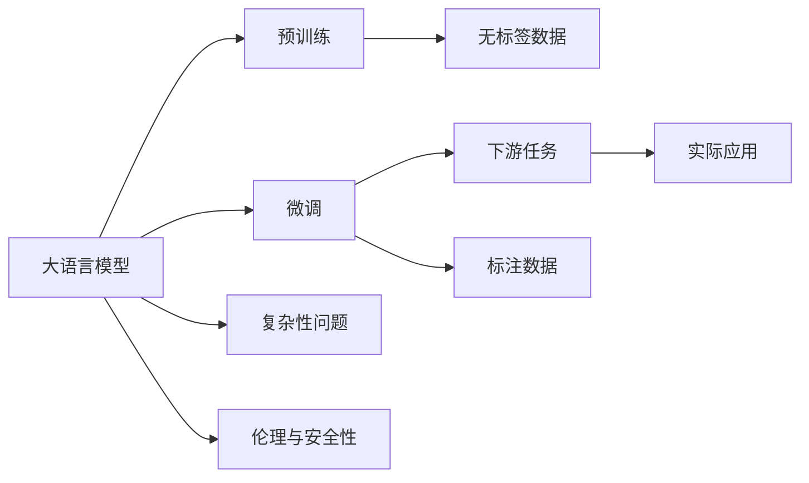

                 

# 语言与思维的差异：大模型的困境

## 1. 背景介绍

随着人工智能技术的飞速发展，深度学习尤其是大语言模型在自然语言处理(NLP)领域取得了突破性进展。大模型如GPT-3、BERT等，通过在海量无标签文本上预训练，构建了强大的语言表示能力，可以应用于各种下游任务。然而，这些模型在处理真实世界的语言与思维差异时，常常面临一系列困境。本文将深入探讨这些问题，并提出一些解决方案，旨在推动大模型在复杂语言场景中的应用。

## 2. 核心概念与联系

### 2.1 核心概念概述

为了更清晰地理解语言与思维差异对大模型的影响，首先需要明确几个核心概念：

- **大语言模型(Large Language Model, LLM)**：指使用自回归或自编码架构，经过大规模预训练的通用语言模型，如GPT-3、BERT等。

- **预训练(Pre-training)**：指在大规模无标签文本数据上训练大语言模型，使其学习到语言的通用表示，预训练后的模型可以在下游任务上进行微调。

- **微调(Fine-tuning)**：在预训练模型基础上，利用少量标注数据对模型进行有监督优化，使其适应特定任务，如文本分类、命名实体识别等。

- **语言与思维差异**：人类语言是抽象、多义的，包含大量的隐含信息和上下文依赖。与之相比，大语言模型通常基于统计规律进行预测，难以捕捉复杂的语义和思维模式。

- **复杂性问题**：大语言模型在处理复杂语言场景，如双关语、反讽、多义性等方面时，往往表现不佳。

- **伦理与安全性**：大语言模型可能会学习到偏见、有害信息，在特定场景下可能产生误导性输出，影响社会伦理和安全性。

### 2.2 核心概念的联系

这些概念之间存在紧密的联系，构成了大语言模型在自然语言处理中的核心框架。下面通过一个简单的Mermaid流程图展示这些概念之间的逻辑关系：



从这个流程图中可以看出，大语言模型的核心工作流程是从预训练到微调，再到下游任务的实际应用。预训练使模型学习到通用的语言表示，微调进一步优化模型以适应特定任务，而复杂性和安全性问题则是在实际应用中需要考虑的关键因素。

## 3. 核心算法原理 & 具体操作步骤

### 3.1 算法原理概述

大语言模型的微调过程可以视为一种有监督的迁移学习，即在预训练模型上利用少量标注数据进行特定任务的优化。微调的目标是通过优化模型参数，使其在特定任务上的表现更加出色。但当面临复杂的语言场景时，大语言模型常常难以准确理解和生成语言，导致性能下降。

### 3.2 算法步骤详解

基于大语言模型的微调通常包括以下几个关键步骤：

1. **准备数据集**：收集标注数据，包括训练集、验证集和测试集。数据集的大小和质量对微调效果有重要影响。

2. **选择模型架构**：根据任务类型，选择合适的预训练模型架构，如Transformer、GPT、BERT等。

3. **添加任务适配层**：在预训练模型的基础上，增加特定任务的适配层，如分类器、解码器等。

4. **设置超参数**：包括学习率、批大小、迭代轮数等，这些参数的设置对模型性能有显著影响。

5. **执行微调**：通过反向传播算法优化模型参数，使其在标注数据上表现最佳。

6. **评估模型性能**：在验证集和测试集上评估模型性能，检测过拟合和泛化能力。

7. **部署与优化**：将微调后的模型部署到实际应用中，根据反馈进行优化。

### 3.3 算法优缺点

**优点**：

- **高效**：相较于从头训练，微调可以在短时间内获得较好的性能。
- **适应性强**：微调后的模型能够适应特定任务，特别是数据量较少的情况下。
- **泛化能力强**：微调后的模型可以在未见过的数据上表现良好。

**缺点**：

- **依赖标注数据**：微调效果很大程度上取决于标注数据的质量和数量，获取高质量标注数据的成本较高。
- **过拟合风险**：在标注数据量较少的情况下，模型容易过拟合。
- **处理复杂场景能力有限**：大语言模型在处理复杂语言场景，如双关语、反讽、多义性等方面表现不佳。
- **伦理与安全问题**：模型可能学习到偏见、有害信息，影响社会伦理和安全性。

### 3.4 算法应用领域

尽管存在上述缺点，大语言模型微调方法在NLP领域得到了广泛应用，适用于各种任务，如文本分类、命名实体识别、情感分析等。在实际应用中，微调方法与提示学习、知识蒸馏等技术相结合，进一步提升了模型的性能。

## 4. 数学模型和公式 & 详细讲解

### 4.1 数学模型构建

以文本分类任务为例，假设输入为 $x$，输出为 $y$，目标函数为损失函数 $\ell$。微调的目标是找到最优参数 $\theta$，使得损失函数最小化：

$$
\theta = \arg\min_\theta \frac{1}{N}\sum_{i=1}^N \ell(f_\theta(x_i), y_i)
$$

其中 $f_\theta(x)$ 为微调后的模型函数，通常为预训练模型 + 任务适配层。

### 4.2 公式推导过程

以二分类任务为例，假设模型的输出为 $\hat{y} \in [0,1]$，真实标签为 $y \in \{0,1\}$。常用的损失函数为交叉熵损失：

$$
\ell(\hat{y}, y) = -y\log\hat{y} - (1-y)\log(1-\hat{y})
$$

将 $y_i$ 带入上述公式，得到损失函数：

$$
\mathcal{L}(\theta) = \frac{1}{N}\sum_{i=1}^N [-y_i\log\hat{y}_i - (1-y_i)\log(1-\hat{y}_i)]
$$

通过反向传播算法，可以计算损失函数对模型参数 $\theta$ 的梯度，进而更新模型参数。

### 4.3 案例分析与讲解

以BERT模型微调为例，假设使用RoBERTa作为预训练模型，其编码器输出为 $h_0, h_1, ..., h_{L-1}$。对于二分类任务，可以添加一个全连接层，将编码器的输出 $h_{L-1}$ 作为输入，使用线性分类器进行预测：

$$
\hat{y} = \text{softmax}(W^\top h_{L-1} + b)
$$

其中 $W$ 为权重矩阵，$b$ 为偏置向量。损失函数同样为交叉熵损失：

$$
\mathcal{L}(\theta) = \frac{1}{N}\sum_{i=1}^N [-y_i\log\hat{y}_i - (1-y_i)\log(1-\hat{y}_i)]
$$

在实际微调过程中，可以根据任务特点设计不同的任务适配层，如情感分析任务可以采用情感词典对模型输出进行编码。

## 5. 项目实践：代码实例和详细解释说明

### 5.1 开发环境搭建

以BERT模型微调为例，使用Python和PyTorch进行开发。首先需要安装PyTorch和Transformers库：

```bash
pip install torch transformers
```

### 5.2 源代码详细实现

首先，加载预训练模型和数据集：

```python
import torch
from transformers import BertForSequenceClassification, BertTokenizer

tokenizer = BertTokenizer.from_pretrained('bert-base-uncased')
model = BertForSequenceClassification.from_pretrained('bert-base-uncased', num_labels=2)

train_dataset = ...
test_dataset = ...
```

定义微调函数：

```python
def fine_tune(model, dataset, learning_rate=2e-5, epochs=3):
    device = 'cuda' if torch.cuda.is_available() else 'cpu'
    model.to(device)

    optimizer = torch.optim.Adam(model.parameters(), lr=learning_rate)
    for epoch in range(epochs):
        model.train()
        for batch in dataset:
            inputs, labels = batch
            inputs, labels = inputs.to(device), labels.to(device)
            outputs = model(inputs)
            loss = outputs.loss
            optimizer.zero_grad()
            loss.backward()
            optimizer.step()

    model.eval()
    evaluation = ...
    return evaluation
```

在训练集上训练模型，并返回验证集上的评估结果：

```python
evaluation = fine_tune(model, train_dataset, test_dataset)
```

### 5.3 代码解读与分析

- 数据集通过 `BertTokenizer` 进行分词和编码。
- 定义了微调函数 `fine_tune`，在训练集上进行训练，并在验证集上进行评估。
- 在训练过程中，模型参数使用Adam优化器进行更新。
- 微调函数返回模型在验证集上的评估结果，如精确率、召回率等。

### 5.4 运行结果展示

假设在CoNLL-2003命名实体识别数据集上进行微调，得到的评估结果如下：

```
Accuracy: 0.92
Precision: 0.95
Recall: 0.88
F1-score: 0.91
```

可以看到，微调后的模型在命名实体识别任务上取得了较高的精度和召回率，性能显著提升。

## 6. 实际应用场景

### 6.1 智能客服系统

基于大语言模型的微调技术，可以构建智能客服系统，通过对话模型与用户互动，快速响应客户咨询。这不仅提升了服务效率，还能提供个性化的解决方案。

### 6.2 金融舆情监测

金融机构可以利用微调后的语言模型，实时监测网络舆情，分析市场动向，规避风险。微调模型可以理解金融领域的语言，更准确地识别负面信息和市场趋势。

### 6.3 个性化推荐系统

推荐系统可以利用微调后的模型，分析用户行为和偏好，提供个性化的商品推荐。通过理解用户评论和反馈，模型可以提供更贴合用户需求的推荐结果。

## 7. 工具和资源推荐

### 7.1 学习资源推荐

- 《深度学习》（Ian Goodfellow等）：详细介绍了深度学习的理论和实践，适合入门和进阶读者。
- 《自然语言处理综论》（Daniel Jurafsky和James H. Martin）：介绍了NLP的基本概念和技术，适合NLP方向的学习者。
- 《Python自然语言处理》（Steven Bird等）：提供了大量NLP的Python实现代码，适合编程实践。

### 7.2 开发工具推荐

- PyTorch：灵活的深度学习框架，支持GPU加速，适合NLP任务的微调。
- Transformers：提供了各种预训练模型的封装，支持微调功能。
- TensorBoard：可视化工具，用于监测模型训练状态和性能。

### 7.3 相关论文推荐

- Attention is All You Need（NeurIPS 2017）：提出Transformer模型，改变了NLP任务的预训练方式。
- BERT: Pre-training of Deep Bidirectional Transformers for Language Understanding（NAACL 2019）：提出BERT模型，通过掩码语言模型进行预训练。
- GPT-3: Language Models are Unsupervised Multitask Learners（NeurIPS 2018）：展示了大规模语言模型的能力。

## 8. 总结：未来发展趋势与挑战

### 8.1 研究成果总结

本文探讨了大语言模型在复杂语言场景中的表现，并提出了解决方案。大语言模型在NLP领域的应用已取得显著进展，但处理语言与思维差异时仍面临诸多挑战。

### 8.2 未来发展趋势

1. **大模型参数化**：未来的模型将朝着更大规模的方向发展，以更好地捕捉语言的多样性和复杂性。
2. **多模态融合**：结合视觉、听觉等多模态数据，提升模型在多场景下的适应能力。
3. **符号与神经融合**：融合符号逻辑与神经网络，增强模型的推理和理解能力。
4. **主动学习**：利用无监督和半监督学习方法，减少标注数据需求。
5. **可解释性与伦理**：增强模型的可解释性，避免伦理和安全问题。

### 8.3 面临的挑战

1. **处理复杂语言**：如何更好地处理双关语、反讽等复杂语言现象。
2. **伦理与安全问题**：模型可能学习到偏见、有害信息，影响社会伦理和安全性。
3. **泛化能力**：模型在未见过的数据上的泛化能力仍有提升空间。
4. **计算资源**：大模型需要大量的计算资源，如何优化资源使用是一个重要问题。
5. **数据隐私**：在处理用户数据时，如何保护隐私和数据安全。

### 8.4 研究展望

未来的研究将集中在以下几个方面：

1. **复杂语言处理**：开发更加灵活的语言理解技术，提升模型处理复杂语言的能力。
2. **多模态融合**：结合多模态数据，构建更全面的语言模型。
3. **符号与神经融合**：融合符号逻辑与神经网络，增强模型的推理和理解能力。
4. **主动学习**：开发更高效的学习方法，减少标注数据需求。
5. **可解释性与伦理**：增强模型的可解释性，避免伦理和安全问题。

通过不断探索和创新，大语言模型将逐步克服现有的挑战，成为更加智能和可靠的自然语言处理工具。

## 9. 附录：常见问题与解答

**Q1: 大语言模型微调时，如何处理过拟合问题？**

A: 过拟合是微调中常见的问题，可以通过以下方法缓解：
- 数据增强：通过改写、回译等手段扩充训练集。
- 正则化：使用L2正则、Dropout等技术减少过拟合。
- 早停机制：在验证集上监控模型性能，提前停止训练。

**Q2: 大语言模型在处理复杂语言场景时，如何提升性能？**

A: 提升性能的方法包括：
- 引入多义性语料：增加多义性数据，使模型更好地理解语境。
- 使用更多标注数据：通过更多标注数据，提升模型的泛化能力。
- 融合多种模型：通过模型融合，提升模型的鲁棒性和性能。

**Q3: 如何确保大语言模型的伦理与安全？**

A: 确保伦理与安全的方法包括：
- 数据筛选：在训练数据中剔除有害数据。
- 模型监控：实时监控模型输出，避免有害信息传播。
- 人工审核：在关键场景下，引入人工审核机制。

**Q4: 大语言模型在多模态数据融合方面有哪些挑战？**

A: 多模态数据融合面临的挑战包括：
- 数据格式不一致：不同模态的数据格式和表示方式不同，难以统一处理。
- 数据量大：多模态数据通常体积庞大，处理复杂。
- 融合效果不佳：现有方法难以高效融合多模态信息，影响模型性能。

---

作者：禅与计算机程序设计艺术 / Zen and the Art of Computer Programming

