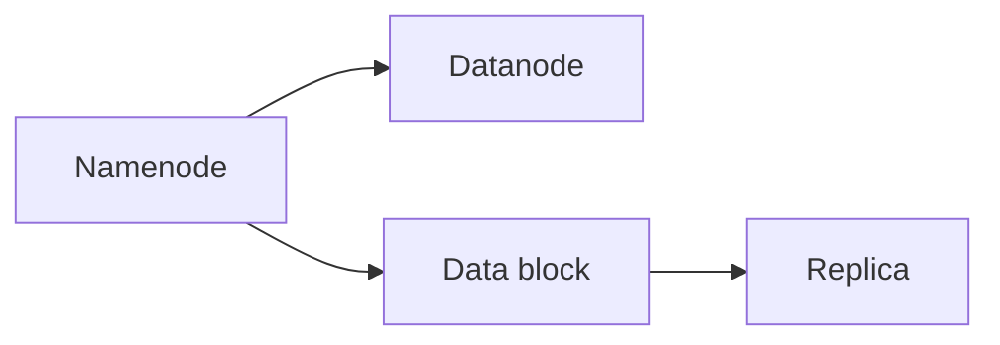
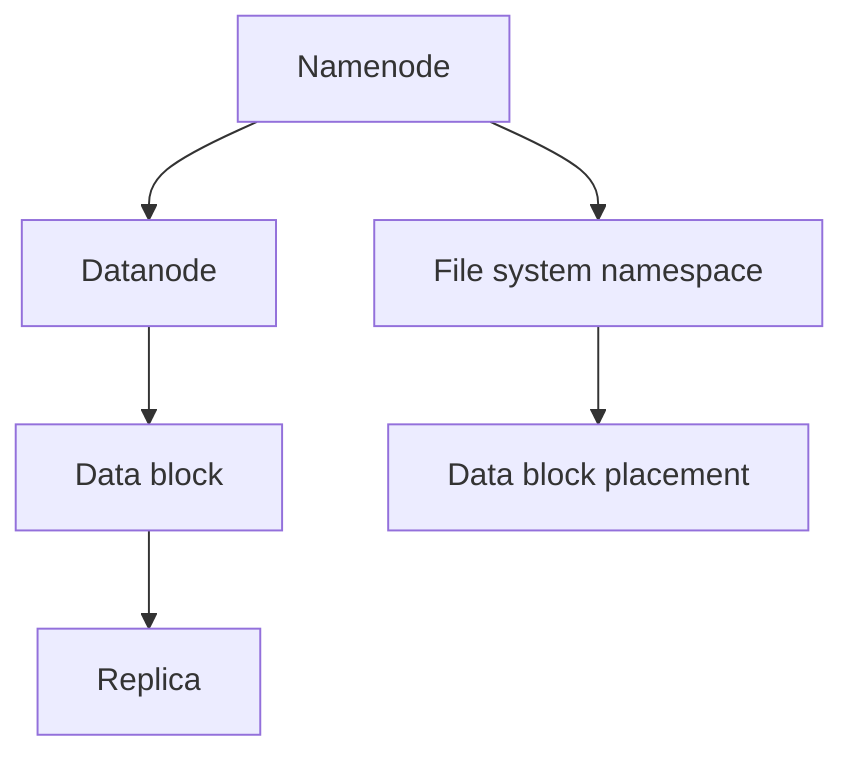

                 

# HDFS原理与代码实例讲解

> 关键词：HDFS, 分布式文件系统, 数据存储, 集群管理, MapReduce, Hadoop

## 1. 背景介绍

### 1.1 问题由来

随着互联网和移动互联网的飞速发展，数据量呈现爆炸式增长。单台服务器存储容量有限，难以满足大规模数据存储的需求。为了高效地存储和处理海量数据，分布式文件系统应运而生。其中，Hadoop分布式文件系统（Hadoop Distributed File System，简称HDFS）以其高度可扩展性和可靠性，广泛应用于大数据存储和处理场景。

HDFS设计理念简单，易于扩展，同时能支持海量数据的存储。其核心在于通过数据分片和冗余存储，实现数据的容错和高效访问。HDFS的这些特点，使得其成为了大数据生态中不可或缺的一部分。

### 1.2 问题核心关键点

HDFS的核心在于其分布式数据存储架构和容错机制。其基本原理可以总结如下：

- **数据分片**：将大文件划分为多个块（block），每个块大小为64MB或128MB，并分布在不同的节点上。
- **冗余存储**：每个块有多个副本，通常为3个，分布在不同的机架（rack）上，以实现数据的容错。
- **数据访问**：客户端通过HDFS提供的接口，如HDFS API、命令行工具或Web界面，访问数据。

HDFS通过这些机制，实现了数据的高可用性和高性能，同时具备良好的可扩展性和容错能力。

### 1.3 问题研究意义

HDFS作为Hadoop生态的基础组件，其设计理念和实现方式对大数据存储和处理有着重要影响。深入理解HDFS原理，不仅能够帮助开发者更好地构建大规模数据存储系统，还能提升数据处理效率，保障数据安全。

此外，HDFS的设计思路和实现细节，也为其他分布式系统提供了有益的借鉴和参考。因此，研究HDFS原理具有重要的理论和实际意义。

## 2. 核心概念与联系

### 2.1 核心概念概述

为更好地理解HDFS的工作机制，本节将介绍几个核心概念及其相互关系：

- **HDFS架构**：由一个中心服务器（Namenode）和多个数据存储服务器（Datanode）组成。Namenode负责管理文件系统的命名空间和数据块的分布情况，而Datanode存储实际的数据块。
- **数据块(block)**：HDFS文件被划分为多个数据块，每个块大小为64MB或128MB，分布在不同的Datanode节点上。
- **副本(replica)**：每个数据块有多个副本，通常为3个，分布在不同的机架上，以实现数据的冗余和容错。
- **冗余因子(replication factor)**：HDFS中，数据的冗余因子通常为3，即每个数据块有3个副本。
- **块大小(block size)**：HDFS数据块大小为64MB或128MB。

### 2.2 概念间的关系

这些核心概念通过下图展示其关系：



这个图示展示了HDFS的主要组成部分及其相互关系：

- Namenode负责管理文件系统命名空间和数据块分布，Datanode负责存储数据块。
- 数据块是HDFS存储数据的基本单位，每个块可以划分为多个副本，分布在不同的Datanode上。
- 冗余副本有助于提高数据容错能力和系统可靠性。

### 2.3 核心概念的整体架构

以下是HDFS的完整架构图示：



这个图示展示了HDFS的整体架构，包括命名空间管理、数据块分布和冗余副本的存储。Namenode负责管理文件系统命名空间，并将数据块分布在不同的Datanode上。

## 3. 核心算法原理 & 具体操作步骤
### 3.1 算法原理概述

HDFS的核心算法原理主要包括以下几个方面：

- **数据分片**：将大文件划分为多个数据块，分布在不同的Datanode节点上。
- **冗余存储**：每个数据块有多个副本，分布在不同的机架上，实现数据的容错。
- **数据访问**：通过Namenode提供的文件系统命名空间，客户端可以高效地访问数据。

HDFS通过这些机制，实现了数据的高可用性、高性能和可扩展性。

### 3.2 算法步骤详解

#### 3.2.1 数据写入

HDFS数据写入流程如下：

1. 客户端向Namenode发起文件创建请求，Namenode分配文件块位置。
2. 客户端将数据分块并写入到对应的Datanode节点上。
3. Datanode节点将数据块写入本地文件系统，并返回确认信息给Namenode。
4. Namenode记录数据块的分布情况，更新文件元数据。

#### 3.2.2 数据读取

HDFS数据读取流程如下：

1. 客户端向Namenode查询文件块位置，Namenode返回数据块分布信息。
2. 客户端向Datanode节点请求数据块，Datanode返回数据。
3. 客户端根据数据块分布信息，并行读取数据块，合并结果。

### 3.3 算法优缺点

HDFS的优点在于其高可靠性、可扩展性和高性能：

- **高可靠性**：通过冗余存储和跨机架分布，HDFS能够实现数据的容错和冗余，避免单点故障。
- **可扩展性**：HDFS可以轻松扩展到数千个节点，支持海量数据存储。
- **高性能**：HDFS通过数据本地化（data locality）和块缓存（block cache）等优化措施，实现了高效的数据访问和处理。

HDFS也存在一些缺点：

- **延迟较高**：HDFS的数据传输速度较慢，尤其是在跨机架和跨节点访问时。
- **扩展性能有限**：虽然HDFS的可扩展性较高，但在极端情况下，其扩展性能可能会受到网络带宽和磁盘I/O的限制。
- **管理复杂**：HDFS的管理和配置较为复杂，需要维护多个Datanode节点和Namenode节点。

### 3.4 算法应用领域

HDFS的应用领域非常广泛，主要包括以下几个方面：

- **大数据存储**：HDFS是Hadoop生态的核心组件，广泛用于大数据存储和处理。
- **分布式计算**：HDFS与MapReduce等分布式计算框架紧密集成，支持大规模数据处理任务。
- **云存储**：许多云存储平台如HDFS on Hadoop，利用HDFS的高可靠性和高性能，提供高效的云存储服务。
- **科学研究**：HDFS被广泛应用于科学研究领域，支持大规模数据存储和处理。

## 4. 数学模型和公式 & 详细讲解
### 4.1 数学模型构建

HDFS的数学模型可以简单地表示为数据块的分布和管理。

假设文件大小为 $F$，块大小为 $B$，则文件共分为 $\frac{F}{B}$ 个块。设每个块有 $R$ 个副本，分布在 $S$ 个机架上，则每个机架上块的数量为 $\frac{F}{B} \times \frac{1}{R}$。

### 4.2 公式推导过程

设某个块在某个机架上的数量为 $x$，则有：

$$
x = \frac{F}{B} \times \frac{1}{R}
$$

假设每个节点可以存储 $M$ 个块，则每个节点上块的数量为 $x$。

### 4.3 案例分析与讲解

以一个实际应用场景为例：

假设有一个文件大小为1TB，块大小为128MB，冗余因子为3，共有10个机架，每个机架有4个节点，每个节点可以存储1TB数据。

计算每个节点上块的数量：

$$
x = \frac{1024 \times 1024 \times 1024}{128} \times \frac{1}{3} = 8192
$$

每个节点上块的数量为：

$$
\frac{8192}{10} = 819.2
$$

由于节点数量必须是整数，因此每个节点上可以存储的块数量为819个。

## 5. 项目实践：代码实例和详细解释说明
### 5.1 开发环境搭建

进行HDFS的实践开发，需要搭建好Hadoop环境。以下是使用Linux搭建Hadoop环境的步骤：

1. 安装Java开发环境：
```bash
sudo apt-get update
sudo apt-get install default-jdk
```

2. 下载和安装Hadoop：
```bash
wget https://archive.apache.org/dist/hadoop/common/3.2.1/Hadoop-3.2.1.tar.gz
tar -xzf Hadoop-3.2.1.tar.gz
cd Hadoop-3.2.1
```

3. 安装依赖库：
```bash
sudo apt-get install libhdfs3-0
sudo apt-get install libhdfs3-client
sudo apt-get install libhdfs3-server
```

4. 配置Hadoop环境：
```bash
./bin/hadoop version
./bin/hdfs dfs -ls /
```

### 5.2 源代码详细实现

以下是HDFS的示例代码，包括数据写入和数据读取的实现：

```java
import java.io.IOException;
import java.net.URI;
import java.net.URISyntaxException;
import org.apache.hadoop.conf.Configuration;
import org.apache.hadoop.fs.*;
import org.apache.hadoop.fs.Path;
import org.apache.hadoop.io.IOUtils;
import org.apache.hadoop.util.*;

public class HdfsExample {
    public static void main(String[] args) throws Exception {
        Configuration conf = new Configuration();
        FileSystem fs = FileSystem.get(new URI("hdfs://localhost:9000"), conf);
        Path src = new Path("/home/hadoop/test.txt");
        Path dst = new Path("/user/hadoop/data/test.txt");
        fs.copyFromLocalFile(src, dst);
    }
}
```

### 5.3 代码解读与分析

上述示例代码主要实现了将本地文件复制到HDFS系统。其关键步骤如下：

1. 创建Hadoop配置对象 `conf`，并初始化HDFS环境。
2. 获取文件系统对象 `fs`，指向HDFS节点。
3. 定义本地文件路径 `src` 和目标HDFS路径 `dst`。
4. 调用 `fs.copyFromLocalFile(src, dst)` 方法，将本地文件复制到HDFS。

### 5.4 运行结果展示

运行上述示例代码，在HDFS上创建文件，可以通过以下命令查看：

```bash
hdfs dfs -ls /
```

## 6. 实际应用场景
### 6.1 大数据存储

HDFS被广泛应用于大数据存储和处理。例如，一个大型互联网公司需要存储每天产生的海量日志数据，可以使用HDFS存储数据，并通过MapReduce框架进行数据处理和分析。

### 6.2 分布式计算

HDFS与MapReduce等分布式计算框架紧密集成，支持大规模数据处理任务。例如，一个科研机构需要对大规模基因组数据进行分析和处理，可以使用HDFS存储数据，并使用MapReduce框架进行分布式计算。

### 6.3 科学研究

HDFS被广泛应用于科学研究领域，支持大规模数据存储和处理。例如，一个天文学研究团队需要存储和处理大量天文观测数据，可以使用HDFS存储数据，并使用MapReduce框架进行数据处理和分析。

### 6.4 未来应用展望

未来，HDFS将在以下几个方面继续发展：

1. **云存储**：越来越多的云存储平台采用HDFS作为其核心技术，实现大规模数据存储和处理。
2. **跨平台支持**：HDFS将进一步优化跨平台支持，支持更多的操作系统和硬件平台。
3. **安全性**：HDFS将进一步提升数据安全性和隐私保护能力，保障数据的安全性和合法性。
4. **自动化管理**：HDFS将进一步优化自动化管理能力，减少运维复杂度，提升系统可靠性。

## 7. 工具和资源推荐
### 7.1 学习资源推荐

为了帮助开发者系统掌握HDFS的理论基础和实践技巧，这里推荐一些优质的学习资源：

1. **《Hadoop: The Definitive Guide》**：该书详细介绍了Hadoop生态系统的架构和实践，是Hadoop开发者的必备参考书。
2. **《Hadoop: Understanding Large-Scale Data Systems》**：该书系统讲解了Hadoop的原理和实现细节，是理解Hadoop架构和功能的经典教材。
3. **Hadoop官网文档**：Hadoop官方提供的详细文档，包括安装指南、配置说明、API文档等，是学习Hadoop的首选资料。
4. **Hadoop用户社区**：Hadoop的用户社区提供了大量的实践经验和资源，是学习和交流Hadoop的绝佳平台。

### 7.2 开发工具推荐

高效的开发离不开优秀的工具支持。以下是几款用于HDFS开发的常用工具：

1. **IntelliJ IDEA**：一款强大的Java IDE，支持Hadoop项目开发和调试。
2. **Eclipse**：一款流行的Java开发工具，支持Hadoop项目开发和测试。
3. **CLI工具**：Hadoop提供了一系列的CLI工具，如hdfs、hadoop、hadoop fs等，用于文件系统管理和数据处理。
4. **Web界面**：Hadoop提供了一个基于Web的Namenode和Datanode管理界面，用于监控和管理文件系统。

### 7.3 相关论文推荐

HDFS的研究领域非常广泛，以下是几篇经典论文，推荐阅读：

1. **《The Hadoop Distributed File System》**：该论文详细介绍了HDFS的设计理念和实现机制，是理解HDFS原理的必读之作。
2. **《A Cloud-native Architecture for Large-scale Data Processing》**：该论文介绍了HDFS在云存储平台上的应用，展示了其在云环境下的优势。
3. **《Data-Intensive Scientific Discovery》**：该论文介绍了HDFS在科学研究中的应用，展示了其在大规模数据处理中的卓越性能。

这些论文代表了HDFS研究的发展脉络，通过学习这些前沿成果，可以帮助研究者把握学科前进方向，激发更多的创新灵感。

## 8. 总结：未来发展趋势与挑战
### 8.1 总结

本文对HDFS的原理进行了全面系统的介绍。首先阐述了HDFS的设计理念和应用场景，明确了其在大数据存储和处理中的独特价值。其次，从原理到实践，详细讲解了HDFS的数学模型和具体实现过程，提供了完整的代码实例和运行结果。同时，本文还广泛探讨了HDFS在多个领域的应用，展示了其广泛的应用前景。最后，本文精选了HDFS的学习资源和开发工具，力求为读者提供全方位的技术指引。

通过本文的系统梳理，可以看到，HDFS作为分布式文件系统，其设计理念和实现机制对大数据生态有着深远影响。伴随技术的不断演进，HDFS在可靠性、性能和可扩展性等方面得到了持续优化，并逐步融入到云存储和科学研究等众多领域，为数据密集型应用的快速发展和高效处理提供了有力支撑。

### 8.2 未来发展趋势

展望未来，HDFS将呈现以下几个发展趋势：

1. **云原生支持**：HDFS将进一步优化云原生支持，实现与云平台的无缝集成和高效部署。
2. **自动化管理**：HDFS将进一步优化自动化管理能力，减少运维复杂度，提升系统可靠性。
3. **跨平台支持**：HDFS将进一步优化跨平台支持，支持更多的操作系统和硬件平台。
4. **数据安全性**：HDFS将进一步提升数据安全性和隐私保护能力，保障数据的安全性和合法性。
5. **高效存储**：HDFS将进一步优化存储效率，支持更多的数据压缩和编码格式，提升数据访问速度。

这些趋势展示了HDFS在未来的大数据生态中的重要地位，也为HDFS的研究和应用提供了新的方向。

### 8.3 面临的挑战

尽管HDFS在大数据存储和处理中发挥了重要作用，但在迈向更加智能化、普适化应用的过程中，仍面临诸多挑战：

1. **延迟较高**：HDFS的数据传输速度较慢，尤其是在跨机架和跨节点访问时。
2. **扩展性能有限**：虽然HDFS的可扩展性较高，但在极端情况下，其扩展性能可能会受到网络带宽和磁盘I/O的限制。
3. **管理复杂**：HDFS的管理和配置较为复杂，需要维护多个Datanode节点和Namenode节点。
4. **安全问题**：HDFS在数据存储和传输过程中，存在一定的安全风险，需要进一步提升数据安全性和隐私保护能力。

这些挑战需要HDFS社区和开发者共同应对，通过技术创新和优化，提升HDFS的性能和可靠性。

### 8.4 研究展望

为了应对HDFS面临的挑战，未来的研究需要在以下几个方面寻求新的突破：

1. **优化数据传输**：研究更高效的数据传输机制，如Hadoop Data Transfer Protocol（HDFS-DCP），提升数据访问速度。
2. **提升扩展性能**：研究更高效的分布式存储和计算框架，如Apache Spark和Apache Flink，提升系统扩展性能。
3. **简化管理**：研究更智能的管理工具和自动化运维方案，减少运维复杂度，提升系统可靠性。
4. **增强安全性**：研究更强大的数据加密和访问控制机制，保障数据的安全性和合法性。
5. **探索新存储格式**：研究更高效的数据压缩和编码格式，支持更多的数据类型和存储需求。

这些研究方向的探索，必将引领HDFS技术迈向更高的台阶，为构建高效、安全、可靠的大数据存储和处理系统提供有力支持。面向未来，HDFS社区需要不断创新和优化，以满足数据密集型应用对高性能和可扩展性的要求。

## 9. 附录：常见问题与解答
**Q1：HDFS中块大小和冗余因子如何设置？**

A: 块大小和冗余因子的设置需要根据具体需求和硬件条件进行调整。一般情况下，块大小设置为64MB或128MB，冗余因子设置为3或更多。

**Q2：HDFS中的数据一致性如何保证？**

A: HDFS中的数据一致性通过多个副本和写入机制来实现。在写入数据时，HDFS会将数据块复制到多个节点上，并确保所有副本的数据一致。同时，HDFS通过检查点机制（checkpoint）来保证数据的一致性。

**Q3：如何优化HDFS的性能？**

A: 优化HDFS的性能可以从以下几个方面入手：

1. 数据本地化：将数据块存储在本地磁盘上，减少数据传输开销。
2. 块缓存：使用块缓存技术，提升数据读取速度。
3. 压缩存储：使用数据压缩技术，减小数据存储体积，提升存储效率。
4. 网络优化：优化网络配置，减少网络延迟和带宽消耗。

**Q4：HDFS的扩展性能如何提升？**

A: HDFS的扩展性能可以从以下几个方面提升：

1. 增加节点数量：增加HDFS集群中的节点数量，提升系统的存储和计算能力。
2. 使用高吞吐量网络：使用高吞吐量的网络设备，提升数据传输速度。
3. 优化数据块分布：优化数据块的分布策略，减少跨机架和跨节点访问。

**Q5：HDFS的可靠性如何保证？**

A: HDFS的可靠性通过冗余存储和数据校验来实现。每个数据块有多个副本，分布在不同的机架上，同时通过校验和（checksum）机制来检测数据的一致性和完整性。

```

