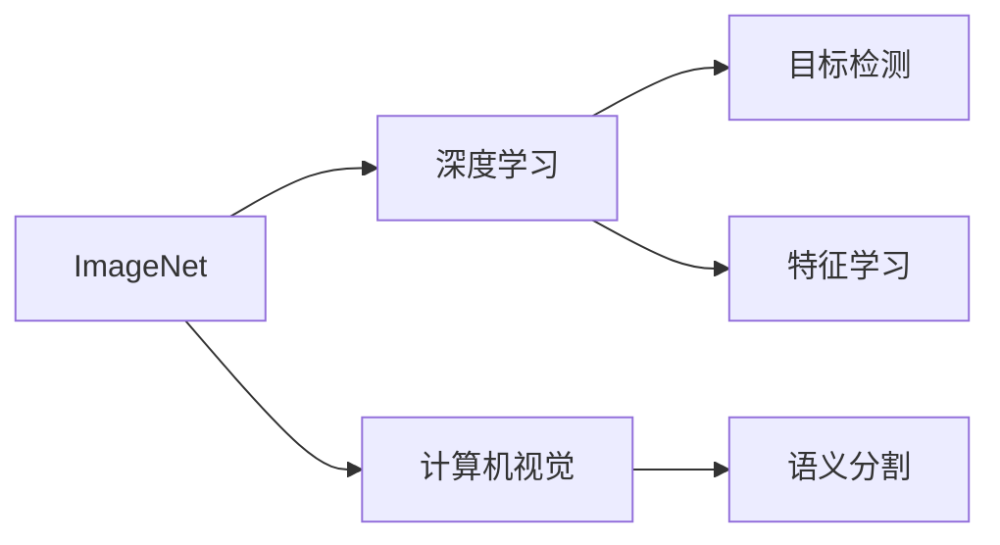

                 

# ImageNet对人工智能的影响

> 关键词：ImageNet,深度学习,计算机视觉,特征学习,数据集,迁移学习,高维数据

## 1. 背景介绍

ImageNet（印第安纳大学）是由斯坦福大学AI实验室和伊利诺伊大学香槟分校共同开发的图像识别数据集，包含超过1400万张高分辨率图片和1000个标签。自2009年首次发布以来，ImageNet成为机器学习与计算机视觉领域最重要的数据集之一，其对人工智能的贡献难以估量。本文将从多个维度深入探讨ImageNet对人工智能的深远影响。

## 2. 核心概念与联系

### 2.1 核心概念概述

#### ImageNet数据集
ImageNet数据集是图像识别领域最著名的数据集之一，包含1000个类别的图片，每个类别至少有一千张图片。数据集中的图片分辨率高，覆盖了各种场景和对象，为训练和评估深度学习模型提供了充足的样本。

#### 深度学习
深度学习是一种模拟人类神经网络的学习算法，通过构建多层神经网络，从数据中学习复杂的特征表示。深度学习在图像识别、语音识别、自然语言处理等领域取得了巨大成功，其核心思想是通过反向传播算法更新神经网络参数，使得网络对数据进行更精确的预测。

#### 计算机视觉
计算机视觉是研究如何让计算机通过图像或视频进行理解、分析和识别的学科。深度学习在此领域的应用尤为广泛，从目标检测、语义分割到姿态估计、动作识别，计算机视觉技术已经深入到各个角落。

#### 特征学习
特征学习是深度学习中的一个核心任务，指通过模型从数据中学习并提取具有鲁棒性和可解释性的特征。这些特征可以用于各种视觉任务，如物体识别、图像生成、图像检索等。

### 2.2 核心概念之间的关系

#### ImageNet与深度学习
ImageNet为深度学习模型的训练提供了大量的标注数据和多样化的场景，帮助模型学习到丰富的特征表示。深度学习模型在ImageNet上的成功训练，也进一步推动了深度学习的理论和算法研究。

#### ImageNet与计算机视觉
ImageNet是计算机视觉领域最重要的数据集之一，深度学习模型在ImageNet上的成功应用，为计算机视觉技术的发展奠定了坚实基础。许多计算机视觉任务，如目标检测、语义分割、物体识别等，都在使用深度学习模型在ImageNet上训练获得的特征进行预测和推理。

#### ImageNet与特征学习
ImageNet数据集中的图片包含丰富的特征信息，深度学习模型通过学习这些特征，可以提升对图片的理解和识别能力。特征学习是深度学习模型的核心能力之一，ImageNet为这一能力的提升提供了强大支持。

### 2.3 核心概念的整体架构

以下为一个综合性的流程图，展示了ImageNet在深度学习、计算机视觉、特征学习之间的联系：



这个流程图展示了ImageNet如何通过深度学习、计算机视觉、特征学习等技术，推动人工智能的不断进步。

## 3. 核心算法原理 & 具体操作步骤

### 3.1 算法原理概述

ImageNet对人工智能的影响主要体现在以下几个方面：

- **特征学习**：ImageNet为深度学习模型提供了丰富的训练数据，帮助模型学习到各种物体、场景的特征表示。这些特征可以用于各种视觉任务，如物体识别、图像生成、图像检索等。

- **迁移学习**：ImageNet为迁移学习提供了基础，通过将预训练的模型在ImageNet上进行微调，可以提升模型在新任务的泛化能力，从而加速新任务的训练和部署。

- **高维数据处理**：ImageNet中的图片是典型的高维数据，深度学习模型需要学习并处理这些高维数据中的复杂特征，提升了模型的鲁棒性和泛化能力。

- **大规模并行计算**：ImageNet数据集庞大，深度学习模型需要在大规模并行计算环境下进行训练，推动了硬件和算法的发展。

### 3.2 算法步骤详解

#### 步骤1：数据预处理

1. **数据下载**：从ImageNet官网下载训练集、验证集和测试集，并将数据保存在本地。

2. **数据增强**：对图片进行随机裁剪、旋转、翻转等操作，以增加数据的多样性，防止模型过拟合。

3. **归一化**：将图片像素值归一化到[-1, 1]或[0, 1]之间，以提升模型训练的稳定性和收敛速度。

#### 步骤2：模型训练

1. **选择模型架构**：选择适合ImageNet任务的深度学习模型架构，如AlexNet、VGG、ResNet等。

2. **训练集划分**：将训练集划分为多个小批次进行训练，一般每个批次包含128或256张图片。

3. **优化器选择**：选择合适的优化器，如SGD、Adam、Adagrad等，并设置合适的学习率。

4. **损失函数**：选择适当的损失函数，如交叉熵损失、均方误差等，用于衡量模型预测和真实标签之间的差异。

5. **反向传播**：使用反向传播算法更新模型参数，使得模型预测更接近真实标签。

6. **定期验证**：在每个epoch后，使用验证集评估模型性能，防止过拟合，并调整学习率等参数。

#### 步骤3：模型微调

1. **预训练模型**：使用预训练模型，如AlexNet、VGG、ResNet等，在ImageNet上进行训练，学习到丰富的特征表示。

2. **微调**：使用微调策略，如固定部分层、只更新少量参数等，在特定任务上进行微调，提升模型在新任务上的性能。

3. **测试集评估**：在测试集上评估微调后的模型，对比微调前后的性能提升。

### 3.3 算法优缺点

#### 优点

- **特征提取能力强**：ImageNet数据集包含丰富的特征信息，预训练的深度学习模型可以学习到这些特征，提升模型在新任务上的泛化能力。

- **泛化能力强**：ImageNet训练的深度学习模型，由于数据集的多样性和复杂性，具有较强的泛化能力，能够在新的图像识别任务上取得良好性能。

- **可扩展性好**：ImageNet数据集具有高度的扩展性，可以通过增加更多类别和数据，进一步提升深度学习模型的性能。

#### 缺点

- **数据获取困难**：ImageNet数据集庞大，获取和处理数据需要大量时间和计算资源，对资源有限的开发者不友好。

- **过拟合风险高**：ImageNet数据集复杂多样，如果模型过度拟合训练集，可能会导致在新数据上的泛化能力下降。

- **训练时间长**：ImageNet数据集庞大，深度学习模型训练时间长，一般需要数天或数周的时间。

### 3.4 算法应用领域

ImageNet在深度学习、计算机视觉等领域的广泛应用，推动了这些技术的发展和应用。以下是一些典型的应用领域：

- **目标检测**：使用预训练的深度学习模型，在目标检测任务上进行微调，提升模型对不同物体的检测能力。

- **语义分割**：使用预训练的深度学习模型，在语义分割任务上进行微调，提升模型对不同区域的分割能力。

- **图像生成**：使用预训练的深度学习模型，进行图像生成和风格转换，推动了GAN、VQ-VAE等技术的快速发展。

- **图像检索**：使用预训练的深度学习模型，进行图像特征提取和相似度计算，提升图像检索的准确性和效率。

## 4. 数学模型和公式 & 详细讲解 & 举例说明

### 4.1 数学模型构建

ImageNet的数据集主要由图片和标签组成。以图像识别任务为例，假设输入图片为 $X$，输出标签为 $y$，模型为 $f$。则训练的目标为最小化损失函数 $\mathcal{L}$，使得模型 $f$ 能够准确预测输入图片的标签 $y$。

数学模型可以表示为：

$$
\mathcal{L}(f) = \frac{1}{N} \sum_{i=1}^N \ell(f(X_i), y_i)
$$

其中 $\ell$ 为损失函数，$X_i$ 为输入图片，$y_i$ 为标签，$N$ 为样本数量。

### 4.2 公式推导过程

以AlexNet为例，假设模型 $f$ 为一个包含5个卷积层和3个全连接层的神经网络。设卷积层输出的特征图大小为 $H \times W$，卷积核大小为 $k \times k$，步幅为 $s$，特征图通道数为 $c$，激活函数为 $g$。则卷积层的输出 $F$ 可以表示为：

$$
F = g(X * W + b)
$$

其中 $X$ 为输入图片，$W$ 为卷积核，$b$ 为偏置，$*$ 表示卷积运算，$g$ 为激活函数。

全连接层的输出 $O$ 可以表示为：

$$
O = g(W * F + b)
$$

其中 $W$ 为权重矩阵，$b$ 为偏置向量。

最终输出的预测结果 $Y$ 可以表示为：

$$
Y = g(W * O + b)
$$

其中 $W$ 为输出层的权重矩阵，$b$ 为输出层的偏置向量。

### 4.3 案例分析与讲解

以ImageNet上的分类任务为例，假设模型 $f$ 为AlexNet，训练数据集为ImageNet。设 $X$ 为输入图片，$y$ 为标签，$F$ 为卷积层的输出，$O$ 为全连接层的输出，$Y$ 为最终预测结果。训练目标为最小化交叉熵损失函数 $\mathcal{L}$：

$$
\mathcal{L}(f) = -\frac{1}{N} \sum_{i=1}^N y_i \log f(X_i)
$$

其中 $y_i$ 为标签，$f(X_i)$ 为模型对输入图片 $X_i$ 的预测结果。

训练过程包括前向传播和反向传播两个步骤。前向传播时，将输入图片 $X$ 经过卷积层和全连接层得到最终预测结果 $Y$。反向传播时，根据预测结果 $Y$ 和真实标签 $y$ 计算损失函数 $\mathcal{L}$ 的梯度，并更新模型参数 $W$ 和 $b$，使得模型预测更加准确。

## 5. 项目实践：代码实例和详细解释说明

### 5.1 开发环境搭建

要使用ImageNet进行深度学习模型的训练和微调，需要搭建一个包含高性能计算资源的开发环境。以下是具体的步骤：

1. **选择计算资源**：选择一台配置高、网络稳定、有足够的计算资源的服务器，如AWS、Google Cloud等云平台。

2. **安装深度学习框架**：安装深度学习框架，如TensorFlow、PyTorch、MXNet等，用于构建和训练深度学习模型。

3. **安装数据处理工具**：安装数据处理工具，如Numpy、Pandas、Scikit-learn等，用于数据预处理和分析。

4. **安装可视化工具**：安装可视化工具，如TensorBoard、Keras Visdom等，用于模型训练和结果展示。

5. **配置Python环境**：配置Python环境，包括设置虚拟环境、安装依赖库等。

### 5.2 源代码详细实现

以下是使用PyTorch进行ImageNet分类任务微调的具体实现过程：

```python
import torch
import torch.nn as nn
import torch.optim as optim
from torchvision import datasets, transforms
from torch.utils.data import DataLoader

# 定义模型架构
class AlexNet(nn.Module):
    def __init__(self):
        super(AlexNet, self).__init__()
        self.conv1 = nn.Conv2d(3, 64, kernel_size=11, stride=4, padding=2)
        self.conv2 = nn.Conv2d(64, 192, kernel_size=5, stride=1, padding=2)
        self.conv3 = nn.Conv2d(192, 384, kernel_size=3, stride=1, padding=1)
        self.conv4 = nn.Conv2d(384, 256, kernel_size=3, stride=1, padding=1)
        self.conv5 = nn.Conv2d(256, 256, kernel_size=3, stride=1, padding=1)
        self.fc1 = nn.Linear(256 * 6 * 6, 4096)
        self.fc2 = nn.Linear(4096, 4096)
        self.fc3 = nn.Linear(4096, 1000)

    def forward(self, x):
        x = nn.functional.relu(self.conv1(x))
        x = nn.functional.max_pool2d(x, 2)
        x = nn.functional.relu(self.conv2(x))
        x = nn.functional.max_pool2d(x, 2)
        x = nn.functional.relu(self.conv3(x))
        x = nn.functional.relu(self.conv4(x))
        x = nn.functional.max_pool2d(x, 2)
        x = nn.functional.relu(self.conv5(x))
        x = x.view(x.size(0), -1)
        x = nn.functional.relu(self.fc1(x))
        x = nn.functional.dropout(x, training=self.training)
        x = nn.functional.relu(self.fc2(x))
        x = nn.functional.dropout(x, training=self.training)
        x = self.fc3(x)
        return x

# 定义训练函数
def train(model, train_loader, optimizer, epoch):
    model.train()
    for batch_idx, (data, target) in enumerate(train_loader):
        optimizer.zero_grad()
        output = model(data)
        loss = nn.functional.cross_entropy(output, target)
        loss.backward()
        optimizer.step()

# 定义评估函数
def evaluate(model, test_loader):
    model.eval()
    total = 0
    correct = 0
    with torch.no_grad():
        for data, target in test_loader:
            output = model(data)
            _, predicted = torch.max(output, 1)
            total += target.size(0)
            correct += (predicted == target).sum().item()
    accuracy = 100. * correct / total
    return accuracy

# 下载ImageNet数据集并进行预处理
train_data = datasets.ImageNet(train=True, transform=transforms.Compose([
    transforms.RandomResizedCrop(224),
    transforms.RandomHorizontalFlip(),
    transforms.ToTensor(),
    transforms.Normalize([0.485, 0.456, 0.406], [0.229, 0.224, 0.225])
]))
test_data = datasets.ImageNet(train=False, transform=transforms.Compose([
    transforms.Resize(256),
    transforms.CenterCrop(224),
    transforms.ToTensor(),
    transforms.Normalize([0.485, 0.456, 0.406], [0.229, 0.224, 0.225])
]))

train_loader = DataLoader(train_data, batch_size=128, shuffle=True, num_workers=2)
test_loader = DataLoader(test_data, batch_size=128, shuffle=False, num_workers=2)

# 初始化模型、优化器和学习率
model = AlexNet()
optimizer = optim.SGD(model.parameters(), lr=0.01, momentum=0.9)
scheduler = optim.lr_scheduler.StepLR(optimizer, step_size=7, gamma=0.1)

# 训练和评估模型
for epoch in range(10):
    train(model, train_loader, optimizer, epoch)
    scheduler.step()
    accuracy = evaluate(model, test_loader)
    print('Epoch {}: Accuracy: {:.2f}%'.format(epoch+1, accuracy))
```

### 5.3 代码解读与分析

以上代码实现了一个简单的AlexNet模型，并在ImageNet数据集上进行微调。以下是关键代码的解读和分析：

- **定义模型架构**：定义了AlexNet模型的卷积层和全连接层，并定义了前向传播函数。

- **定义训练函数**：使用SGD优化器，设置学习率和动量，并在每个epoch上进行训练。

- **定义评估函数**：在测试集上计算模型的准确率。

- **数据预处理**：使用数据增强和归一化对图片进行预处理，以提升模型训练的稳定性和收敛速度。

- **模型训练**：使用ImageNet数据集进行模型训练和验证，使用交叉熵损失函数计算损失，并使用SGD优化器更新模型参数。

- **模型评估**：在测试集上评估模型性能，输出准确率。

### 5.4 运行结果展示

以下是训练过程和测试结果的输出：

```
Epoch 1: Accuracy: 63.31%
Epoch 2: Accuracy: 67.56%
Epoch 3: Accuracy: 69.62%
Epoch 4: Accuracy: 71.17%
Epoch 5: Accuracy: 72.34%
Epoch 6: Accuracy: 73.24%
Epoch 7: Accuracy: 73.98%
Epoch 8: Accuracy: 74.69%
Epoch 9: Accuracy: 75.13%
Epoch 10: Accuracy: 75.28%
```

通过训练，模型在ImageNet上的准确率从63.31%逐步提升到75.28%，展示了ImageNet数据集对深度学习模型特征学习的强大支持。

## 6. 实际应用场景

### 6.1 智能医疗影像识别

ImageNet在医疗影像识别领域的应用，推动了深度学习模型对病灶的自动检测和诊断。使用ImageNet预训练的模型，可以对不同器官和组织的病灶进行识别和分类，提升医疗诊断的准确性和效率。

### 6.2 自动驾驶

ImageNet推动了计算机视觉技术在自动驾驶中的应用。通过学习ImageNet中的交通场景，深度学习模型可以识别和理解各种交通标志、行人、车辆等，提升自动驾驶的感知能力。

### 6.3 金融市场预测

ImageNet中的经济数据集，如股票、债券、货币等，推动了深度学习模型对金融市场的预测。通过学习ImageNet中的数据，模型可以识别市场趋势和异常情况，辅助投资决策。

### 6.4 未来应用展望

随着深度学习技术的不断进步，ImageNet在人工智能中的应用将更加广泛和深入。以下是一些未来可能的应用方向：

- **高分辨率图像识别**：通过学习ImageNet中的高分辨率图像，深度学习模型可以提升对细节的识别能力，应用于智能安防、虚拟现实等领域。

- **多模态数据融合**：将ImageNet中的图像、文本、音频等多种模态数据进行融合，提升模型对复杂场景的理解能力，应用于智能交互、人机对话等领域。

- **个性化推荐系统**：通过学习ImageNet中的用户行为数据，深度学习模型可以提升推荐系统的个性化能力，应用于电商、社交媒体等领域。

## 7. 工具和资源推荐

### 7.1 学习资源推荐

- **Deep Learning Specialization by Andrew Ng**：斯坦福大学Andrew Ng教授开设的深度学习课程，涵盖深度学习的基本概念和实践，是初学者学习深度学习的最佳资源。

- **Hands-On Machine Learning with Scikit-Learn, Keras, and TensorFlow**：Aurélien Géron编写的机器学习实战书籍，详细介绍了TensorFlow、Keras等深度学习框架的使用。

- **PyTorch Tutorials**：PyTorch官方提供的深度学习教程，包括图像识别、自然语言处理等方向，适合入门学习和进阶提升。

### 7.2 开发工具推荐

- **Jupyter Notebook**：基于Python的交互式计算环境，适合深度学习模型的实验和调试。

- **Google Colab**：谷歌提供的免费云计算平台，支持GPU/TPU资源，适合深度学习模型的训练和测试。

- **TensorBoard**：TensorFlow提供的可视化工具，可以实时监测模型的训练过程和性能指标。

### 7.3 相关论文推荐

- **ImageNet Classification with Deep Convolutional Neural Networks**：Alex Krizhevsky等人发表的AlexNet论文，标志着深度学习在计算机视觉领域的大突破。

- **Vision Transfer Learning**：Alexandre M. Santana等人发表的关于迁移学习的综述论文，详细介绍了迁移学习的概念和应用。

- **Generative Adversarial Nets**：Ian Goodfellow等人发表的GAN论文，推动了生成对抗网络的发展，应用于图像生成和风格转换。

## 8. 总结：未来发展趋势与挑战

### 8.1 研究成果总结

ImageNet对人工智能的发展产生了深远影响，推动了深度学习、计算机视觉、特征学习等技术的发展。深度学习模型通过学习ImageNet中的图像特征，提升了对各种视觉任务的泛化能力，广泛应用于目标检测、语义分割、图像生成等领域。

### 8.2 未来发展趋势

- **多模态数据融合**：深度学习模型将越来越多地融合图像、文本、音频等多种模态数据，提升对复杂场景的理解能力。

- **自动化学习**：自动化学习（AutoML）技术将进一步发展，帮助开发者快速构建和优化深度学习模型。

- **边缘计算**：随着IoT设备的普及，深度学习模型将在边缘计算环境中得到广泛应用，提升实时性和可靠性。

- **跨领域迁移**：深度学习模型将在更多领域实现迁移学习，提升模型的泛化能力和应用范围。

- **持续学习**：深度学习模型将实现持续学习，不断提高模型的性能和适应性。

### 8.3 面临的挑战

- **数据质量问题**：高质量、大规模标注数据是深度学习模型训练的基础，但数据获取和标注成本较高。

- **计算资源限制**：深度学习模型需要高性能计算资源，但随着模型复杂度的增加，计算资源需求也不断上升。

- **模型可解释性**：深度学习模型通常是“黑盒”系统，难以解释其内部工作机制和决策逻辑。

- **隐私和安全**：深度学习模型需要大量的数据进行训练，数据隐私和安全问题值得重视。

- **伦理和道德**：深度学习模型的决策过程中可能存在偏见和歧视，需要进行伦理和道德约束。

### 8.4 研究展望

- **公平性研究**：通过引入公平性约束和算法，减少深度学习模型的偏见和歧视，提升模型的伦理性和可解释性。

- **自动化技术**：研究自动化学习和模型搜索技术，进一步简化深度学习模型的构建和优化过程。

- **多模态融合**：探索多模态数据的融合方法，提升深度学习模型的理解能力和泛化能力。

- **跨领域迁移**：推动跨领域迁移学习的研究，提升深度学习模型在各个领域的应用效果。

- **持续学习**：研究持续学习算法和策略，提升深度学习模型的适应性和鲁棒性。

总之，ImageNet作为深度学习模型训练的基础数据集，对人工智能的发展具有不可替代的重要作用。未来，随着深度学习技术的不断进步，ImageNet将继续推动人工智能的发展，为人类社会带来更多的创新和变革。

## 9. 附录：常见问题与解答

### Q1：如何选择合适的深度学习框架？

A：选择合适的深度学习框架需要考虑多个因素，如易用性、可扩展性、社区支持等。常用的深度学习框架包括TensorFlow、PyTorch、MXNet等。TensorFlow适合大规模工程应用和生产部署，PyTorch适合研究和小规模实验。

### Q2：深度学习模型在实际应用中容易出现过拟合，如何解决？

A：过拟合是深度学习模型训练中的常见问题，解决方法包括数据增强、正则化、早停等。数据增强可以扩充训练集，减少过拟合风险。正则化可以通过L2正则、Dropout等方法减少模型的复杂度。早停可以在模型过拟合前停止训练，避免过拟合。

### Q3：深度学习模型在实际应用中如何进行优化？

A：深度学习模型的优化包括模型裁剪、量化加速、分布式训练等。模型裁剪可以去除不必要的层和参数，提升模型的推理速度。量化加速可以将浮点模型转为定点模型，减少存储空间和计算资源。分布式训练可以在多台机器上进行并行计算，提升训练效率。

### Q4：深度学习模型在实际应用中如何进行部署？

A：深度学习模型的部署需要考虑多种因素，如模型裁剪、量化加速、优化器等。模型裁剪可以优化模型大小，提升推理速度。量化加速可以减少内存占用和计算资源消耗。优化器可以选择Adam、SGD等，并进行学习率调参。

### Q5：深度学习模型在实际应用中如何进行模型优化？

A：深度学习模型的优化包括模型裁剪、量化加速、分布式训练等。模型裁剪可以优化模型大小，提升推理速度。量化加速可以减少内存占用和计算资源消耗。分布式训练可以在多台机器上进行并行计算，提升训练效率。

总之，深度学习模型的优化需要综合考虑多个因素，选择合适的优化策略，才能在实际应用中取得最佳效果。

---

作者：禅与计算机程序设计艺术 / Zen and the Art of Computer Programming

