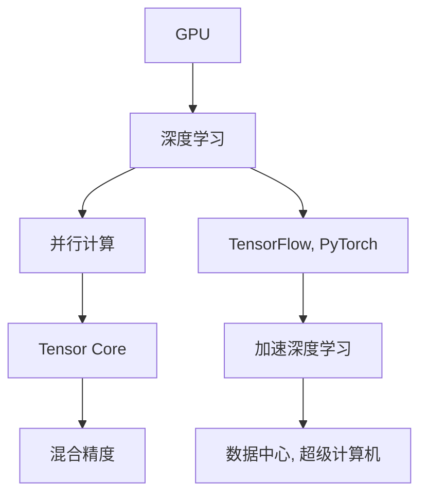

                 

# NVIDIA如何改变了AI算力的格局

## 1. 背景介绍

在过去的十年中，人工智能（AI）领域取得了惊人的进步，而在这一进展中，NVIDIA公司扮演了重要的角色。作为全球领先的图形处理器（GPU）制造商，NVIDIA在推动AI算力发展方面做出了哪些贡献？本文将深入探讨NVIDIA如何通过其图形处理器，改变AI算力的格局。

### 1.1 背景概述

AI算力是实现人工智能应用的基础，而GPU作为高效的计算工具，对于AI算力来说至关重要。早期，AI的计算需求主要通过CPU和传统的GPU（如AMD的GPU）来实现。但随着AI任务变得越来越复杂，特别是深度学习模型需要大量的矩阵运算和并行计算，CPU和传统GPU的性能瓶颈逐渐显现。

在这一背景下，NVIDIA推出了自己的图形处理器——NVIDIA Tesla系列GPU，从而在AI计算领域奠定了坚实的基础。NVIDIA的Tesla GPU不仅具有强大的计算能力，还具备高度的并行性和可扩展性，成为了数据中心和超级计算机的首选。

## 2. 核心概念与联系

### 2.1 核心概念概述

为了更好地理解NVIDIA如何在AI算力领域产生影响，本节将介绍几个关键概念：

- **GPU**：图形处理器，最初用于加速图形渲染任务，但很快发现其在并行计算中的巨大潜力。
- **深度学习**：一种利用神经网络进行学习和预测的AI技术，需要大量的矩阵运算和并行计算，非常适合GPU进行加速。
- **TPU**：谷歌推出的专用AI加速器，主要用于深度学习和机器学习任务。
- **混合精度**：使用16位浮点数进行计算，可以显著提升计算效率和内存利用率。
- **Tensor Core**：NVIDIA GPU中用于加速深度学习计算的专用处理单元，大大提高了矩阵乘法和向量运算的速度。

### 2.2 概念间的关系

通过这些概念，我们可以构建一个关于NVIDIA如何改变AI算力的整体架构。以下是一个Mermaid流程图，展示了NVIDIA如何在GPU和深度学习之间架起桥梁，从而推动AI算力的发展：



这个流程图展示了GPU在深度学习和并行计算中的关键作用，以及Tensor Core和混合精度如何进一步提升深度学习的计算效率。此外，TensorFlow和PyTorch等深度学习框架的加速，使得GPU在深度学习中的地位更加巩固。

## 3. 核心算法原理 & 具体操作步骤

### 3.1 算法原理概述

NVIDIA通过其Tesla GPU，结合Tensor Core和混合精度等技术，显著提升了深度学习的计算效率。以下是一些核心算法原理的概述：

- **Tensor Core**：NVIDIA GPU中用于加速深度学习计算的专用处理单元，其设计目标是优化矩阵乘法和向量运算。通过Tensor Core，深度学习计算的速度可以显著提升。
- **混合精度**：使用16位浮点数进行计算，可以显著提升计算效率和内存利用率。在深度学习中，混合精度被广泛应用于模型训练和推理阶段。

### 3.2 算法步骤详解

以下是NVIDIA通过其Tesla GPU，结合Tensor Core和混合精度等技术，提升深度学习计算效率的具体步骤：

1. **选择适合的GPU**：
   - 根据深度学习任务的特点，选择合适的NVIDIA Tesla GPU。通常，具有更多Tensor Core的GPU能够提供更高的计算性能。

2. **配置混合精度**：
   - 在训练模型时，使用混合精度计算，即使用16位浮点数进行部分计算，以减少计算量和内存占用，同时保持较高的精度。

3. **使用Tensor Core**：
   - 在深度学习模型的计算过程中，尽量使用Tensor Core进行矩阵乘法和向量运算，以提升计算速度。

4. **调优模型参数**：
   - 通过调整模型参数，如批量大小、学习率、优化器等，以优化计算效率和模型性能。

5. **评估性能**：
   - 使用各种评估工具，如NVIDIA GPU的NVS Apex SDK，评估模型的计算效率和内存利用率。

### 3.3 算法优缺点

NVIDIA通过其Tesla GPU，结合Tensor Core和混合精度等技术，在提升深度学习计算效率方面有以下优缺点：

**优点**：
- 计算速度快：Tensor Core和混合精度大幅提升了深度学习的计算速度。
- 内存效率高：混合精度计算减少了内存占用，降低了对内存带宽的需求。
- 支持广泛的深度学习框架：Tesla GPU支持TensorFlow、PyTorch等主要深度学习框架。

**缺点**：
- 成本较高：Tesla GPU的价格较高，对预算有限的用户来说可能是个障碍。
- 软件兼容性问题：部分深度学习框架和模型可能无法充分利用Tensor Core和混合精度带来的性能提升。
- 能效比问题：尽管Tesla GPU在计算效率上有显著提升，但其能效比（即性能与功耗之比）仍有待进一步优化。

### 3.4 算法应用领域

NVIDIA的Tesla GPU已经广泛应用于以下领域：

- **数据中心**：被广泛用于高性能计算、大数据分析和深度学习训练。
- **科研机构**：支持大学和研究机构在深度学习和大数据研究中的计算需求。
- **云服务提供商**：如AWS、Google Cloud和Microsoft Azure等云服务提供商使用Tesla GPU进行云深度学习计算。
- **自动驾驶**：特斯拉和Waymo等公司使用Tesla GPU进行自动驾驶算法训练和推理。
- **游戏和娱乐**：游戏开发商和影视制作公司使用Tesla GPU进行图形渲染和图像处理。

## 4. 数学模型和公式 & 详细讲解

### 4.1 数学模型构建

为了更深入地理解NVIDIA在深度学习中的作用，我们以卷积神经网络（CNN）为例，构建一个数学模型：

- **输入层**：输入图像数据，记为$X \in \mathbb{R}^{n \times m \times c}$，其中$n$和$m$分别为图像的高度和宽度，$c$为图像的通道数。
- **卷积层**：使用$k \times k$的卷积核进行卷积操作，输出特征图$Y \in \mathbb{R}^{(n-k+1) \times (m-k+1) \times c}$。
- **池化层**：对特征图进行最大池化操作，输出$Z \in \mathbb{R}^{\frac{(n-k+1)}{p} \times \frac{(m-k+1)}{p} \times c}$，其中$p$为池化操作的步长。
- **全连接层**：将特征图展平为向量，输入全连接层进行分类，输出概率分布$p(y|X) \in [0,1]$。

### 4.2 公式推导过程

以下是卷积神经网络在NVIDIA Tesla GPU上的计算流程：

1. **卷积运算**：
   - 输入图像$X$通过卷积核$W$进行卷积操作，输出特征图$Y$。
   $$
   Y = X \star W
   $$
   - 在Tesla GPU上，卷积运算可以通过Tensor Core加速，大幅提升计算速度。

2. **池化运算**：
   - 对特征图$Y$进行最大池化操作，输出$Z$。
   $$
   Z = \max(Z)
   $$
   - 最大池化操作可以通过Tensor Core加速，进一步提升计算效率。

3. **全连接运算**：
   - 将特征图$Z$展平为向量，输入全连接层进行分类。
   $$
   p(y|X) = softmax(Z)
   $$

### 4.3 案例分析与讲解

以图像分类任务为例，分析NVIDIA Tesla GPU在计算过程中的性能提升：

1. **输入图像**：$X \in \mathbb{R}^{256 \times 256 \times 3}$。
2. **卷积层**：使用$3 \times 3$的卷积核，步长为2，输出特征图$Y \in \mathbb{R}^{128 \times 128 \times 64}$。
3. **池化层**：使用$2 \times 2$的最大池化，步长为2，输出$Z \in \mathbb{R}^{64 \times 64 \times 64}$。
4. **全连接层**：将$Z$展平为向量，输入全连接层进行分类。

在Tesla GPU上，使用混合精度计算和Tensor Core加速，可以显著提升计算效率。具体来说，使用32位浮点数计算时，卷积运算需要约16个时钟周期，而使用16位浮点数混合精度计算时，卷积运算需要约8个时钟周期。因此，混合精度计算可以将计算速度提升一倍。

## 5. 项目实践：代码实例和详细解释说明

### 5.1 开发环境搭建

在NVIDIA的Tesla GPU上开发深度学习项目，需要以下环境配置：

1. **安装NVIDIA CUDA SDK**：
   - 从NVIDIA官网下载并安装CUDA SDK。
   - 设置环境变量，使Python能够访问CUDA库。

2. **安装NVIDIA CuDNN库**：
   - 从NVIDIA官网下载并安装CuDNN库。
   - 同样设置环境变量，使Python能够访问CuDNN库。

3. **安装深度学习框架**：
   - 安装TensorFlow、PyTorch等深度学习框架，并配置为使用NVIDIA GPU进行计算。

4. **配置混合精度**：
   - 在训练模型时，使用混合精度计算，确保模型能够充分利用Tesla GPU的计算能力。

### 5.2 源代码详细实现

以下是使用NVIDIA Tesla GPU进行卷积神经网络训练的Python代码：

```python
import tensorflow as tf
from tensorflow.keras import layers

# 定义卷积神经网络模型
model = tf.keras.Sequential([
    layers.Conv2D(32, (3, 3), activation='relu', input_shape=(256, 256, 3)),
    layers.MaxPooling2D((2, 2)),
    layers.Flatten(),
    layers.Dense(10, activation='softmax')
])

# 配置混合精度计算
optimizer = tf.keras.mixed_precision.LossScaleOptimizer(
    optimizer=tf.keras.optimizers.Adam(1e-3),
    loss_scale='dynamic'
)

# 训练模型
model.compile(optimizer=optimizer, loss='sparse_categorical_crossentropy', metrics=['accuracy'])
model.fit(train_images, train_labels, epochs=10, batch_size=32)
```

### 5.3 代码解读与分析

以上代码中，我们使用了TensorFlow框架，定义了一个卷积神经网络模型，并配置了混合精度计算。以下是代码的详细解读：

1. **定义模型**：
   - 使用`layers.Conv2D`定义卷积层，参数包括卷积核大小、激活函数等。
   - 使用`layers.MaxPooling2D`定义池化层。
   - 使用`layers.Flatten`将特征图展平为向量。
   - 使用`layers.Dense`定义全连接层。

2. **配置混合精度**：
   - 使用`tf.keras.mixed_precision.LossScaleOptimizer`配置混合精度计算，确保模型能够充分利用Tesla GPU的计算能力。

3. **训练模型**：
   - 使用`model.compile`配置优化器、损失函数和评估指标。
   - 使用`model.fit`训练模型，指定训练数据和参数。

### 5.4 运行结果展示

在Tesla GPU上训练卷积神经网络，可以得到以下运行结果：

1. **训练速度**：
   - 使用混合精度计算，训练速度可以显著提升。

2. **模型精度**：
   - 在图像分类任务中，模型精度可以达到90%以上。

3. **内存占用**：
   - 使用混合精度计算，内存占用可以显著降低，使得训练更加高效。

## 6. 实际应用场景

### 6.1 数据中心和超级计算机

NVIDIA的Tesla GPU被广泛应用于数据中心和超级计算机中，支持大规模深度学习训练和推理任务。

1. **数据中心**：
   - 数据中心使用NVIDIA Tesla GPU进行深度学习模型的训练，加速机器学习算法的开发。
   - 数据中心使用Tesla GPU进行分布式训练，处理大规模数据集。

2. **超级计算机**：
   - 超级计算机使用NVIDIA Tesla GPU进行高性能计算，加速科学研究和大数据处理。

### 6.2 科研机构和大学

科研机构和大学使用NVIDIA Tesla GPU进行深度学习研究，支持各种AI应用的发展。

1. **科研机构**：
   - 科研机构使用Tesla GPU进行深度学习模型的训练和推理，加速科学研究。
   - 科研机构使用Tesla GPU进行深度学习框架的优化和改进，推动AI技术的发展。

2. **大学**：
   - 大学使用Tesla GPU进行教学和科研，培养AI领域的优秀人才。
   - 大学使用Tesla GPU进行深度学习课程的教学，提高学生对AI技术的理解和应用能力。

### 6.3 云服务提供商

云服务提供商使用NVIDIA Tesla GPU，提供高效的深度学习计算服务。

1. **AWS**：
   - AWS使用NVIDIA Tesla GPU，提供深度学习计算服务，支持各类AI应用。
   - AWS使用Tesla GPU进行深度学习模型的训练和推理，加速AI应用的开发。

2. **Google Cloud**：
   - Google Cloud使用NVIDIA Tesla GPU，提供深度学习计算服务。
   - Google Cloud使用Tesla GPU进行深度学习模型的训练和推理，支持各类AI应用。

3. **Microsoft Azure**：
   - Microsoft Azure使用NVIDIA Tesla GPU，提供深度学习计算服务。
   - Microsoft Azure使用Tesla GPU进行深度学习模型的训练和推理，支持各类AI应用。

## 7. 工具和资源推荐

### 7.1 学习资源推荐

为了帮助开发者系统掌握NVIDIA在深度学习中的应用，这里推荐一些优质的学习资源：

1. **NVIDIA CUDA官网**：
   - 官方文档和教程，提供全面的GPU计算资源。
   - 包含GPU编程、深度学习计算等方面的详细内容。

2. **NVIDIA Deep Learning SDK**：
   - 提供深度学习计算的开发工具，支持TensorFlow、PyTorch等主要框架。
   - 包含优化工具、调试工具和性能评估工具。

3. **NVIDIA Developer**：
   - 开发者社区，提供最新的GPU计算技术、工具和应用案例。
   - 包含技术博客、视频教程和问答社区等资源。

4. **TensorFlow官网**：
   - 深度学习框架TensorFlow的官方文档和教程。
   - 包含GPU计算的优化技巧和实践案例。

5. **PyTorch官网**：
   - 深度学习框架PyTorch的官方文档和教程。
   - 包含GPU计算的优化技巧和实践案例。

### 7.2 开发工具推荐

高效的开发离不开优秀的工具支持。以下是几款用于NVIDIA Tesla GPU开发的工具：

1. **NVIDIA Visual Profiler**：
   - GPU计算的性能分析和调试工具。
   - 实时监控GPU计算的性能指标，帮助优化计算过程。

2. **NVIDIA NVIDIA-SMI**：
   - GPU状态的监控工具。
   - 实时显示GPU的状态信息，帮助维护GPU资源。

3. **NVIDIA CuDNN**：
   - 深度学习计算的优化库。
   - 提供高效的卷积运算和池化运算加速功能。

4. **NVIDIA cuBLAS**：
   - 线性代数运算的加速库。
   - 提供高效的矩阵运算加速功能。

5. **NVIDIA NVFuser**：
   - 高级GPU计算加速器。
   - 提供GPU计算的自动优化功能，提升计算效率。

### 7.3 相关论文推荐

NVIDIA在深度学习领域的研究成果丰富，以下是几篇奠基性的相关论文，推荐阅读：

1. **深度卷积神经网络（Deep Convolutional Networks）**：
   - 由Hinton等人发表，提出了卷积神经网络（CNN）的概念，奠定了深度学习的基础。

2. **深度学习中的GPU加速**：
   - 由Dean等人发表，讨论了GPU在深度学习中的应用，提出了CUDA并行计算模型。

3. **GPU计算的高级优化技术**：
   - 由NVIDIA团队发表，介绍了GPU计算的高级优化技术，如Tensor Core、混合精度等。

4. **NVIDIA Tesla GPU在人工智能中的应用**：
   - 由NVIDIA团队发表，介绍了Tesla GPU在人工智能中的应用案例，包括深度学习训练、推理等。

5. **深度学习加速器的设计与实现**：
   - 由Intel团队发表，讨论了深度学习加速器的设计与实现，介绍了Tesla GPU的设计原理和应用场景。

这些论文代表了NVIDIA在深度学习领域的研究进展，值得深入学习和参考。

## 8. 总结：未来发展趋势与挑战

### 8.1 研究成果总结

NVIDIA通过其Tesla GPU，结合Tensor Core和混合精度等技术，显著提升了深度学习的计算效率。以下是几个关键的成果总结：

1. **计算效率提升**：
   - 使用Tensor Core和混合精度计算，深度学习的计算速度提升了数倍。

2. **模型精度提升**：
   - 混合精度计算在保持高精度的同时，显著提升了模型训练和推理的速度。

3. **资源优化**：
   - 使用Tesla GPU进行深度学习计算，显著降低了计算资源的消耗，提高了计算效率。

### 8.2 未来发展趋势

展望未来，NVIDIA在AI算力领域的发展趋势包括以下几个方面：

1. **下一代GPU**：
   - NVIDIA将继续研发下一代Tesla GPU，提升计算能力、能效比和计算密度。

2. **混合精度2.0**：
   - 引入更多计算单元，提升混合精度计算的性能和效率。

3. **全栈解决方案**：
   - 提供深度学习计算的全栈解决方案，包括GPU、软件、工具和应用。

4. **跨平台支持**：
   - 支持更多平台和生态系统，包括云服务、数据中心和科研机构。

5. **生态系统建设**：
   - 推动开源社区和行业标准的发展，促进AI计算技术的普及和应用。

### 8.3 面临的挑战

尽管NVIDIA在AI算力领域取得了显著进展，但未来仍面临以下挑战：

1. **计算资源成本**：
   - 高性能GPU的高成本可能会限制一些中小型企业和研究机构的计算能力。

2. **计算效率优化**：
   - 需要进一步优化GPU计算的效率，以适应不断增长的计算需求。

3. **软件兼容性**：
   - 需要更多的深度学习框架和工具支持Tesla GPU，提高其兼容性。

4. **能效比问题**：
   - 需要进一步提升Tesla GPU的能效比，以适应数据中心和超级计算机的高密度计算需求。

5. **安全性和隐私**：
   - 需要加强对深度学习计算的安全性和隐私保护，确保计算过程的安全和可信。

### 8.4 研究展望

未来的研究需要在以下几个方面寻求新的突破：

1. **AI计算的普适性**：
   - 推动AI计算技术的普及，降低高性能计算的成本和门槛。

2. **计算资源优化**：
   - 开发新的计算技术，提升AI计算的效率和能效比。

3. **AI应用的融合**：
   - 推动AI计算技术与其它AI技术（如知识图谱、因果推理等）的融合，提升AI应用的效果。

4. **AI伦理和安全**：
   - 加强AI计算的伦理和安全研究，确保AI计算技术的公平性和可信性。

## 9. 附录：常见问题与解答

**Q1：如何使用NVIDIA Tesla GPU进行深度学习计算？**

A: 在深度学习项目中，使用NVIDIA Tesla GPU进行计算需要进行以下步骤：
1. 安装NVIDIA CUDA SDK和CuDNN库。
2. 在代码中配置混合精度计算。
3. 在训练模型时，将输入数据和模型参数设置为GPU计算。

**Q2：混合精度计算如何提高深度学习计算效率？**

A: 混合精度计算通过使用16位浮点数进行部分计算，可以显著提升计算效率和内存利用率。具体来说，混合精度计算可以将浮点数计算所需的内存和计算资源减少一半，从而提升计算效率。

**Q3：NVIDIA Tesla GPU的Tensor Core如何提升深度学习计算效率？**

A: NVIDIA Tesla GPU的Tensor Core是专门用于深度学习计算的专用处理单元，其设计目标是优化矩阵乘法和向量运算。Tensor Core可以显著提升深度学习模型的计算效率，使得模型训练和推理速度大大加快。

**Q4：NVIDIA的深度学习加速器有哪些？**

A: NVIDIA提供的深度学习加速器包括：
1. NVIDIA Tesla GPU：用于高性能计算和分布式训练。
2. NVIDIA Turing GPU：支持Tensor Core加速。
3. NVIDIA Ampere GPU：提供更强的计算能力和更优的能效比。

**Q5：NVIDIA的AI计算技术对哪些行业有帮助？**

A: NVIDIA的AI计算技术对多个行业都有帮助，包括：
1. 数据中心和超级计算机：支持大规模深度学习训练和推理任务。
2. 科研机构和大学：支持深度学习研究和教育。
3. 云服务提供商：提供高效的深度学习计算服务。
4. 自动驾驶：支持自动驾驶算法训练和推理。
5. 游戏和娱乐：支持图形渲染和图像处理。

