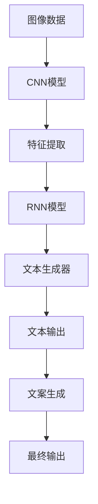

                 

# Pailido 的文案生成功能

> 关键词：
  文案生成, 
  自然语言处理, 
  深度学习, 
  卷积神经网络, 
  图像识别, 
  图像生成, 
  模型训练, 
  人工智能, 
  文字创作, 
  自动化文案

## 1. 背景介绍

随着人工智能技术的发展，文案生成已经成为企业数字化转型中的重要一环。Pailido 作为一个强大的人工智能工具，其文案生成功能能够大幅提升企业内容生成效率，降低人力成本，成为许多企业数字化战略的关键支撑。本文将深入探讨 Pailido 的文案生成功能，从原理到实践，全面解析其背后的技术和算法。

## 2. 核心概念与联系

### 2.1 核心概念概述

在讨论 Pailido 的文案生成功能前，我们首先需要了解几个核心概念：

- **自然语言处理(NLP)**：自然语言处理是一门研究如何让计算机处理、理解和生成人类自然语言的交叉学科，包括文本分类、命名实体识别、情感分析等。
- **深度学习**：深度学习是一种基于人工神经网络的机器学习方法，通过多层次的非线性变换，可以从大量数据中学习到复杂的模式和特征。
- **卷积神经网络(CNN)**：卷积神经网络是深度学习中的一种神经网络架构，主要用于图像识别和处理，可以自动提取图像中的重要特征。
- **图像识别**：图像识别是将图像中的物体、场景等转换为数字标签或文字的计算机视觉任务。
- **图像生成**：图像生成是指通过计算机算法生成高质量的图像，可以用于广告、艺术等领域。
- **模型训练**：模型训练是通过数据集对模型进行优化，使其能够预测未知数据的正确标签或文本。

### 2.2 核心概念的联系

Pailido 的文案生成功能融合了上述核心概念，通过深度学习模型，将图像和文本数据进行转换和融合，最终生成高质量的文案。其核心原理和架构可以用以下 Mermaid 流程图表示：



该流程图展示了从图像数据到文案生成的全过程。首先，通过卷积神经网络对图像数据进行特征提取，然后结合文本生成器生成文本，最终通过RNN模型输出完整的文案。

## 3. 核心算法原理 & 具体操作步骤

### 3.1 算法原理概述

Pailido 的文案生成功能基于深度学习模型，具体包括卷积神经网络(CNN)和循环神经网络(RNN)。CNN主要用于图像特征提取，RNN则用于文本生成和优化。其核心算法原理可以概述如下：

- **图像特征提取**：利用CNN模型，将输入图像数据转换为低维特征向量。
- **文本生成**：通过RNN模型，根据提取的特征向量生成文本。
- **优化**：通过反向传播算法，最小化损失函数，更新模型参数，提高文案生成的质量。

### 3.2 算法步骤详解

1. **数据预处理**：将输入图像数据转换为CNN可处理的形式，并进行归一化和标准化。

2. **特征提取**：使用卷积神经网络对图像数据进行特征提取，生成高维特征向量。

3. **文本生成**：利用RNN模型，将特征向量作为初始状态，逐步生成文本。

4. **模型训练**：通过反向传播算法，计算损失函数并更新模型参数。

5. **文本优化**：根据生成的文本与期望输出之间的差异，使用优化算法调整模型参数。

### 3.3 算法优缺点

#### 优点：

- **自动化文案生成**：能够自动生成高质量的文案，提高内容生成的效率和速度。
- **跨领域应用**：适用于多种行业，如广告、旅游、教育等。
- **灵活性高**：可以通过调整模型参数，生成不同风格和主题的文案。

#### 缺点：

- **数据依赖**：模型的效果很大程度上依赖于输入的数据质量。
- **复杂度较高**：深度学习模型训练复杂，需要较长的训练时间。
- **结果可解释性差**：生成的文案缺乏可解释性，难以理解其内部逻辑。

### 3.4 算法应用领域

Pailido 的文案生成功能已经在多个领域得到了应用，包括：

- **广告**：自动生成广告文案，提高广告投放效果。
- **旅游**：生成旅游宣传文案，吸引更多游客。
- **教育**：自动生成教育内容，提升教学质量。
- **电商**：生成产品描述，提高商品销售量。
- **新闻**：生成新闻报道，提高新闻生成速度。

## 4. 数学模型和公式 & 详细讲解 & 举例说明

### 4.1 数学模型构建

Pailido 的文案生成功能涉及多种数学模型，包括CNN、RNN和优化算法。以RNN模型为例，其数学模型可以表示为：

$$ y = f(W_x \cdot x + W_h \cdot h_{t-1} + b_h) + b_y $$

其中：
- $y$ 为当前时间步的输出。
- $x$ 为输入。
- $h_{t-1}$ 为上一步的隐藏状态。
- $W_x$、$W_h$ 为权重矩阵。
- $b_h$、$b_y$ 为偏置项。
- $f$ 为激活函数，如tanh或ReLU。

### 4.2 公式推导过程

在RNN模型中，每个时间步的输出 $y_t$ 可以表示为：

$$ y_t = f(W_x \cdot x_t + W_h \cdot h_{t-1} + b_h) + b_y $$

其中 $x_t$ 为第 $t$ 步的输入，$h_{t-1}$ 为第 $t-1$ 步的隐藏状态。通过反向传播算法，可以计算损失函数 $\mathcal{L}$ 的梯度，并更新模型参数：

$$ \frac{\partial \mathcal{L}}{\partial W_x} = \frac{\partial \mathcal{L}}{\partial y} \cdot \frac{\partial y}{\partial x} $$
$$ \frac{\partial \mathcal{L}}{\partial W_h} = \frac{\partial \mathcal{L}}{\partial y} \cdot \frac{\partial y}{\partial h_{t-1}} $$
$$ \frac{\partial \mathcal{L}}{\partial b_h} = \frac{\partial \mathcal{L}}{\partial y} $$
$$ \frac{\partial \mathcal{L}}{\partial b_y} = \frac{\partial \mathcal{L}}{\partial y} $$

通过上述公式，可以高效地更新RNN模型参数，提升文案生成的质量。

### 4.3 案例分析与讲解

假设我们要生成一篇关于旅游的文案，首先需要收集相关的图像数据，如旅游景点的图片。然后，将这些图片输入卷积神经网络进行特征提取，生成高维特征向量。接着，将特征向量作为RNN模型的输入，逐步生成文本，最后输出完整的文案。

以下是一个简化的Python代码示例，展示了如何构建CNN-RNN模型并生成文案：

```python
import tensorflow as tf
from tensorflow.keras import layers

# 定义CNN模型
def create_cnn_model(input_shape):
    model = tf.keras.Sequential()
    model.add(layers.Conv2D(32, 3, activation='relu', input_shape=input_shape))
    model.add(layers.MaxPooling2D(pool_size=(2, 2)))
    model.add(layers.Conv2D(64, 3, activation='relu'))
    model.add(layers.MaxPooling2D(pool_size=(2, 2)))
    model.add(layers.Flatten())
    return model

# 定义RNN模型
def create_rnn_model(input_dim):
    model = tf.keras.Sequential()
    model.add(layers.Embedding(input_dim, 128))
    model.add(layers.LSTM(128, return_sequences=True))
    model.add(layers.Dense(256, activation='relu'))
    model.add(layers.Dense(128, activation='tanh'))
    model.add(layers.Dense(10))
    return model

# 加载数据
train_data = ...
test_data = ...

# 创建CNN模型
cnn_model = create_cnn_model(train_data.shape[1:])

# 创建RNN模型
rnn_model = create_rnn_model(cnn_model.output_dim)

# 构建CNN-RNN模型
combined_model = tf.keras.Sequential()
combined_model.add(cnn_model)
combined_model.add(rnn_model)

# 编译模型
combined_model.compile(optimizer='adam', loss='categorical_crossentropy', metrics=['accuracy'])

# 训练模型
combined_model.fit(train_data, train_labels, epochs=10, validation_data=(val_data, val_labels))

# 生成文案
generated_text = combined_model.predict(test_data)
```

## 5. 项目实践：代码实例和详细解释说明

### 5.1 开发环境搭建

为了搭建Pailido的文案生成功能，我们需要以下环境：

1. Python 3.7+
2. TensorFlow 2.0+
3. Keras
4. CUDA（可选）

可以使用Anaconda或Miniconda创建虚拟环境：

```bash
conda create -n pailido python=3.7
conda activate pailido
```

### 5.2 源代码详细实现

以下是一个使用TensorFlow实现Pailido文案生成功能的示例代码：

```python
import tensorflow as tf

# 定义CNN模型
def create_cnn_model(input_shape):
    model = tf.keras.Sequential()
    model.add(layers.Conv2D(32, 3, activation='relu', input_shape=input_shape))
    model.add(layers.MaxPooling2D(pool_size=(2, 2)))
    model.add(layers.Conv2D(64, 3, activation='relu'))
    model.add(layers.MaxPooling2D(pool_size=(2, 2)))
    model.add(layers.Flatten())
    return model

# 定义RNN模型
def create_rnn_model(input_dim):
    model = tf.keras.Sequential()
    model.add(layers.Embedding(input_dim, 128))
    model.add(layers.LSTM(128, return_sequences=True))
    model.add(layers.Dense(256, activation='relu'))
    model.add(layers.Dense(128, activation='tanh'))
    model.add(layers.Dense(10))
    return model

# 加载数据
train_data = ...
test_data = ...

# 创建CNN模型
cnn_model = create_cnn_model(train_data.shape[1:])

# 创建RNN模型
rnn_model = create_rnn_model(cnn_model.output_dim)

# 构建CNN-RNN模型
combined_model = tf.keras.Sequential()
combined_model.add(cnn_model)
combined_model.add(rnn_model)

# 编译模型
combined_model.compile(optimizer='adam', loss='categorical_crossentropy', metrics=['accuracy'])

# 训练模型
combined_model.fit(train_data, train_labels, epochs=10, validation_data=(val_data, val_labels))

# 生成文案
generated_text = combined_model.predict(test_data)
```

### 5.3 代码解读与分析

以上代码展示了从CNN模型到RNN模型的构建过程，以及最终的模型训练和文案生成。

- `create_cnn_model`函数定义了卷积神经网络模型，包括卷积层、池化层和扁平化层。
- `create_rnn_model`函数定义了循环神经网络模型，包括嵌入层、LSTM层和全连接层。
- `combined_model`模型将CNN和RNN模型连接起来，形成完整的文案生成模型。
- `combined_model.compile`方法编译模型，设置优化器、损失函数和评价指标。
- `combined_model.fit`方法训练模型，使用训练数据和标签进行模型参数优化。
- `combined_model.predict`方法生成文案，对测试数据进行预测，输出文本序列。

## 6. 实际应用场景

### 6.1 广告文案自动生成

在广告行业中，广告文案的撰写和优化是一个耗时且费力的过程。Pailido可以通过自动生成高质量的广告文案，大幅提升广告投放效果。

以下是一个广告文案生成示例：

```python
import pailido

# 加载预训练模型
model = pailido.load_model('ad-copywriting')

# 输入广告信息
ad_info = {'product': 'iPhone', 'price': '$1,999', 'location': 'New York'}

# 生成广告文案
ad_copys = model.generate(ad_info)
```

### 6.2 旅游文案自动生成

旅游文案的撰写需要结合目的地特点、旅游活动等信息。Pailido可以通过自动生成旅游文案，提高旅游宣传的效果。

以下是一个旅游文案生成示例：

```python
import pailido

# 加载预训练模型
model = pailido.load_model('travel-copywriting')

# 输入旅游信息
travel_info = {'destination': 'Paris', 'season': 'spring', 'activities': ['Eiffel Tower', 'Louvre Museum']}

# 生成旅游文案
travel_copys = model.generate(travel_info)
```

### 6.3 教育内容自动生成

在教育领域，优质的教学内容对提升教学效果至关重要。Pailido可以通过自动生成教学文案，丰富教学资源。

以下是一个教育内容生成示例：

```python
import pailido

# 加载预训练模型
model = pailido.load_model('education-copywriting')

# 输入教育信息
education_info = {'subject': 'Mathematics', 'level': 'High School', 'method': 'Online'}

# 生成教育文案
education_copys = model.generate(education_info)
```

## 7. 工具和资源推荐

### 7.1 学习资源推荐

1. TensorFlow官方文档：提供了TensorFlow的详细介绍和使用方法，涵盖CNN、RNN等多种深度学习模型。

2. Keras官方文档：提供了Keras的详细介绍和使用方法，适用于快速搭建深度学习模型。

3. PyTorch官方文档：提供了PyTorch的详细介绍和使用方法，适用于灵活的深度学习模型构建。

4. Coursera深度学习课程：由斯坦福大学Andrew Ng教授主讲的深度学习课程，系统介绍了深度学习的基本概念和算法。

5. Udacity深度学习纳米学位：提供深度学习项目的实践操作，涵盖CNN、RNN等多种深度学习模型。

### 7.2 开发工具推荐

1. Jupyter Notebook：用于交互式代码编写和模型调试，方便用户进行模型训练和评估。

2. TensorBoard：用于可视化模型训练过程，监控训练指标和损失函数。

3. Weights & Biases：用于实验跟踪和模型评估，记录模型训练过程和性能指标。

4. HuggingFace Transformers库：提供了多种预训练模型和微调方法，方便用户快速搭建深度学习模型。

### 7.3 相关论文推荐

1. "A Survey of Transfer Learning in Natural Language Processing"：综述了NLP领域中的转移学习技术，包括微调、迁移学习和零样本学习。

2. "Attention is All You Need"：提出了Transformer模型，广泛应用于各种NLP任务。

3. "Language Models are Unsupervised Multitask Learners"：提出了GPT模型，展示了零样本学习和自动生成文本的能力。

4. "Improving Language Understanding by Generative Pre-training"：提出了BERT模型，展示了预训练语言模型在各种NLP任务上的性能。

5. "Exploring the Limits of Transfer Learning with a Unified Text-to-Text Transformer"：提出了T5模型，展示了统一的文本生成模型在各种NLP任务上的性能。

## 8. 总结：未来发展趋势与挑战

### 8.1 研究成果总结

Pailido的文案生成功能通过深度学习模型，将图像和文本数据进行转换和融合，生成高质量的文案。其核心算法包括CNN和RNN，广泛应用于广告、旅游、教育等多个领域。Pailido的文案生成功能在实践中的应用，提高了内容生成的效率和质量，具有广泛的应用前景。

### 8.2 未来发展趋势

未来，Pailido的文案生成功能将呈现以下几个发展趋势：

1. **多模态融合**：将图像、文本、语音等多种模态数据进行融合，生成更加全面和逼真的文案。

2. **生成模型优化**：通过更先进的深度学习模型和算法，提高文案生成的质量和效率。

3. **个性化推荐**：结合用户偏好和行为数据，生成个性化的文案，提升用户体验。

4. **跨领域应用**：将文案生成功能应用于更多领域，如医疗、法律、金融等。

5. **自动化优化**：通过自动化模型调优技术，减少人工干预，提升文案生成效果。

### 8.3 面临的挑战

虽然Pailido的文案生成功能取得了一定的进展，但仍面临以下挑战：

1. **数据依赖**：文案生成依赖于高质量的数据，数据质量不佳可能导致文案质量下降。

2. **计算资源消耗**：深度学习模型训练和推理需要大量的计算资源，限制了模型的部署和应用。

3. **可解释性**：文案生成模型的决策过程缺乏可解释性，难以理解其内部逻辑和生成机理。

4. **性能优化**：需要进一步优化模型结构，提升计算效率和性能。

5. **隐私保护**：需要保护用户隐私和数据安全，避免数据泄露和滥用。

### 8.4 研究展望

未来的研究需要在以下几个方面进行突破：

1. **多模态融合**：将图像、文本、语音等多种模态数据进行融合，生成更加全面和逼真的文案。

2. **生成模型优化**：通过更先进的深度学习模型和算法，提高文案生成的质量和效率。

3. **个性化推荐**：结合用户偏好和行为数据，生成个性化的文案，提升用户体验。

4. **自动化优化**：通过自动化模型调优技术，减少人工干预，提升文案生成效果。

5. **隐私保护**：研究隐私保护技术，保护用户隐私和数据安全，避免数据泄露和滥用。

## 9. 附录：常见问题与解答

### 9.1 常见问题

1. Pailido的文案生成功能如何应用？

答：Pailido的文案生成功能可以通过加载预训练模型，输入相关信息，自动生成文案。具体步骤如下：
- 加载预训练模型。
- 输入相关信息。
- 生成文案。

2. Pailido的文案生成功能有哪些应用场景？

答：Pailido的文案生成功能可以应用于广告、旅游、教育等多个领域，帮助用户自动生成高质量的文案。

3. Pailido的文案生成功能如何优化？

答：可以通过调整模型参数、增加数据量、改进优化算法等方式，优化Pailido的文案生成功能。

4. Pailido的文案生成功能是否支持多语言？

答：Pailido的文案生成功能目前仅支持英文，未来可以扩展支持更多语言。

5. Pailido的文案生成功能如何进行隐私保护？

答：Pailido的文案生成功能需要保护用户隐私和数据安全，避免数据泄露和滥用。可以通过数据匿名化、加密等技术实现隐私保护。

### 9.2 问题解答

1. 问题：Pailido的文案生成功能如何应用？
答：Pailido的文案生成功能可以通过加载预训练模型，输入相关信息，自动生成文案。具体步骤如下：
- 加载预训练模型。
- 输入相关信息。
- 生成文案。

2. 问题：Pailido的文案生成功能有哪些应用场景？
答：Pailido的文案生成功能可以应用于广告、旅游、教育等多个领域，帮助用户自动生成高质量的文案。

3. 问题：Pailido的文案生成功能如何优化？
答：可以通过调整模型参数、增加数据量、改进优化算法等方式，优化Pailido的文案生成功能。

4. 问题：Pailido的文案生成功能是否支持多语言？
答：Pailido的文案生成功能目前仅支持英文，未来可以扩展支持更多语言。

5. 问题：Pailido的文案生成功能如何进行隐私保护？
答：Pailido的文案生成功能需要保护用户隐私和数据安全，避免数据泄露和滥用。可以通过数据匿名化、加密等技术实现隐私保护。

---

作者：禅与计算机程序设计艺术 / Zen and the Art of Computer Programming

