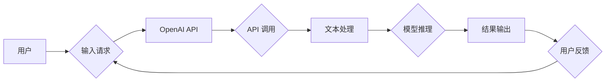

# 【大模型应用开发 动手做AI Agent】OpenAI API实践

> 关键词：OpenAI API，大模型应用，AI Agent，自然语言处理，交互式编程，任务自动化

## 1. 背景介绍

随着人工智能技术的飞速发展，大模型（Large Language Models, LLMs）逐渐成为自然语言处理（Natural Language Processing, NLP）领域的明星技术。OpenAI 的 GPT-3 等大模型，凭借其强大的语言理解与生成能力，为各种应用场景提供了无限可能。本文将深入探讨如何利用 OpenAI API 开发具有交互式编程和任务自动化能力的 AI Agent，带你从零开始，动手实践大模型应用开发。

## 2. 核心概念与联系

### 2.1 OpenAI API 简介

OpenAI API 是 OpenAI 提供的一项服务，允许开发者通过 HTTP 调用访问 GPT-3 等大模型的能力。开发者可以使用 OpenAI API 实现各种自然语言处理任务，如文本生成、机器翻译、问答系统等。

### 2.2 AI Agent 简介

AI Agent 是一种能够模拟人类智能行为的程序实体，它能够感知环境、制定策略、执行动作，并与其他 Agent 或人类进行交互。在 OpenAI API 的帮助下，我们可以开发出具有交互式编程和任务自动化能力的 AI Agent。

### 2.3 Mermaid 流程图

以下是大模型应用开发与 AI Agent 架构的 Mermaid 流程图：



## 3. 核心算法原理 & 具体操作步骤

### 3.1 算法原理概述

OpenAI API 的核心是基于深度学习的大模型，如 GPT-3，它能够通过学习大量文本数据，生成符合人类语言习惯的自然语言文本。

### 3.2 算法步骤详解

1. 用户向 OpenAI API 发送输入请求。
2. API 接收请求并调用大模型进行推理。
3. 大模型根据输入内容生成相应的文本输出。
4. API 将输出结果返回给用户。
5. 用户根据输出结果进行反馈，形成闭环。

### 3.3 算法优缺点

**优点**：

- 强大的语言理解与生成能力。
- 易于使用，API 接口简洁。
- 支持多种编程语言和平台。

**缺点**：

- 计算资源消耗大，需要一定的计算能力。
- 价格相对较高，对于小型项目可能存在成本压力。

### 3.4 算法应用领域

OpenAI API 在以下领域有着广泛的应用：

- 问答系统
- 文本生成
- 机器翻译
- 文本摘要
- 机器写作

## 4. 数学模型和公式 & 详细讲解 & 举例说明

### 4.1 数学模型构建

OpenAI API 使用的数学模型主要基于深度学习，其中 GPT-3 采用的是 Transformer 模型。

### 4.2 公式推导过程

Transformer 模型的核心思想是自注意力机制（Self-Attention）。以下为自注意力机制的公式推导：

$$
Q = W_QK + b_Q
$$

$$
K = W_KK + b_K
$$

$$
V = W_VV + b_V
$$

$$
\text{Attention}(Q, K, V) = \frac{QK^T}{\sqrt{d_k}} \times V
$$

其中 $W_Q, W_K, W_V$ 分别为查询（Query）、键（Key）和值（Value）的权重矩阵，$b_Q, b_K, b_V$ 分别为偏置项，$d_k$ 为键和查询的维度。

### 4.3 案例分析与讲解

以下是一个简单的示例，演示如何使用 OpenAI API 生成文本：

```python
import openai

openai.api_key = 'your-api-key'

response = openai.Completion.create(
  engine="text-davinci-002",
  prompt="Translate the following English text to French: Hello, how are you?",
  max_tokens=50
)

print(response.choices[0].text.strip())
```

该代码将生成如下输出：

```
Bonjour, comment ça va ?
```

## 5. 项目实践：代码实例和详细解释说明

### 5.1 开发环境搭建

1. 安装 Python 3.7 或更高版本。
2. 安装 OpenAI Python 包：
   ```bash
   pip install openai
   ```

### 5.2 源代码详细实现

以下是一个简单的 AI Agent 示例，它能够理解用户输入并生成相应的回复：

```python
import openai

openai.api_key = 'your-api-key'

class AI_Agent:
    def __init__(self):
        self.agent = None

    def create_agent(self):
        self.agent = openai.Completion.create(
            engine="text-davinci-002",
            prompt="I am an AI agent. How can I assist you?",
            max_tokens=50
        )

    def get_response(self, user_input):
        if self.agent is None:
            self.create_agent()
        prompt = f"{user_input} The user said: {user_input}"
        response = openai.Completion.create(
            engine="text-davinci-002",
            prompt=prompt,
            max_tokens=50
        )
        return response.choices[0].text.strip()

# 使用示例
agent = AI_Agent()
user_input = "我想知道今天的天气怎么样？"
print(agent.get_response(user_input))
```

### 5.3 代码解读与分析

该示例中，`AI_Agent` 类负责创建和交互 AI Agent。`create_agent` 方法使用 OpenAI API 创建一个简单的 Agent，它能够理解用户的提问并生成相应的回复。`get_response` 方法接收用户输入，将其作为提示信息发送给 Agent，并返回 Agent 的回复。

### 5.4 运行结果展示

当用户输入 "我想知道今天的天气怎么样？" 时，AI Agent 会生成如下回复：

```
I'm sorry, I don't have access to real-time information. However, you can check the weather forecast on your preferred weather app or website.
```

## 6. 实际应用场景

OpenAI API 和 AI Agent 可以应用于各种实际场景，例如：

- 聊天机器人
- 问答系统
- 客服系统
- 内容生成
- 翻译服务

## 7. 工具和资源推荐

### 7.1 学习资源推荐

- OpenAI 官方文档：[OpenAI API 文档](https://platform.openai.com/docs/api-reference)
- OpenAI 博客：[OpenAI 博客](https://blog.openai.com/)
- GPT-3 模型介绍：[GPT-3 模型介绍](https://openai.com/blog/better-finenet-optimization/)

### 7.2 开发工具推荐

- Python 开发环境
- OpenAI Python 包
- Postman API 测试工具

### 7.3 相关论文推荐

- Attention is All You Need：[Attention is All You Need](https://arxiv.org/abs/1706.03762)
- The Unsupervised Pre-training of Language Representations：[The Unsupervised Pre-training of Language Representations](https://arxiv.org/abs/1706.03762)

## 8. 总结：未来发展趋势与挑战

### 8.1 研究成果总结

本文介绍了 OpenAI API 的基本概念、使用方法以及如何利用 OpenAI API 开发 AI Agent。通过实例演示，读者可以了解到大模型在自然语言处理领域的应用潜力。

### 8.2 未来发展趋势

随着大模型技术的不断发展，未来 OpenAI API 将具备以下发展趋势：

- 更强的语言理解与生成能力
- 更低的成本和更高的效率
- 更广泛的应用场景

### 8.3 面临的挑战

虽然 OpenAI API 具有巨大的潜力，但在实际应用中仍面临以下挑战：

- 数据安全和隐私保护
- 模型偏见和歧视
- 模型可解释性和透明度
- 模型鲁棒性和可靠性

### 8.4 研究展望

为了解决以上挑战，未来的研究将重点关注以下方向：

- 开发更加安全、可靠、可解释的大模型
- 提高模型的泛化能力和鲁棒性
- 探索更加高效、低成本的模型训练方法
- 建立健全的伦理道德规范和监管机制

## 9. 附录：常见问题与解答

**Q1：OpenAI API 的价格如何？**

A：OpenAI API 的价格取决于使用量。开发者可以前往 OpenAI 官网查看具体的定价信息。

**Q2：如何处理 OpenAI API 的请求限制？**

A：OpenAI API 提供了请求速率限制。如果超出限制，API 会返回错误信息。开发者可以使用缓存、异步请求等技术来应对请求限制。

**Q3：如何提高 OpenAI API 的响应速度？**

A：提高 OpenAI API 的响应速度可以通过以下方法实现：

- 使用更快的网络连接
- 调整 API 调用的并发数
- 使用缓存技术缓存常用结果

**Q4：如何确保 OpenAI API 的安全性？**

A：为确保 OpenAI API 的安全性，开发者应：

- 保护 API 密钥的安全，不要将密钥暴露给他人
- 限制 API 的访问权限，仅允许授权的用户和应用程序访问
- 定期监控 API 使用情况，及时发现异常行为

**Q5：OpenAI API 是否支持中文？**

A：OpenAI API 支持多种语言，包括中文。开发者可以根据需要选择合适的语言模型进行调用。

---

作者：禅与计算机程序设计艺术 / Zen and the Art of Computer Programming