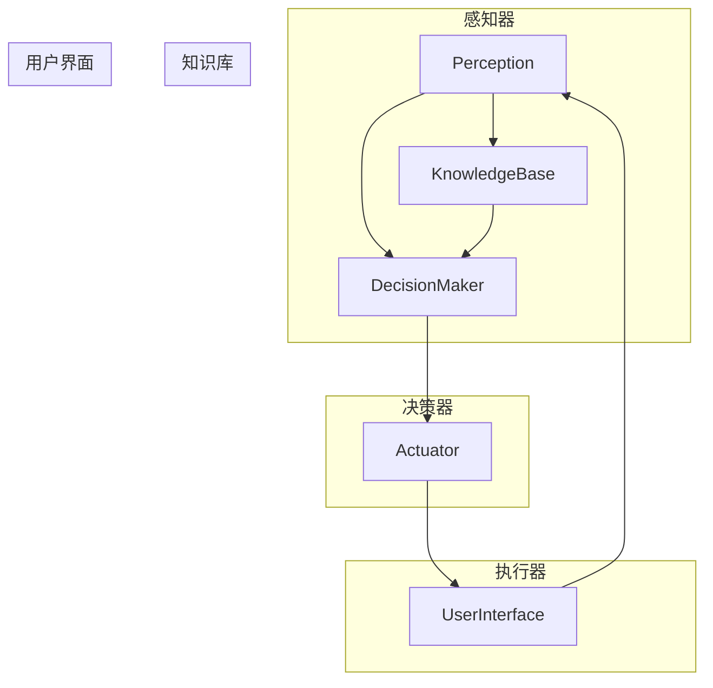
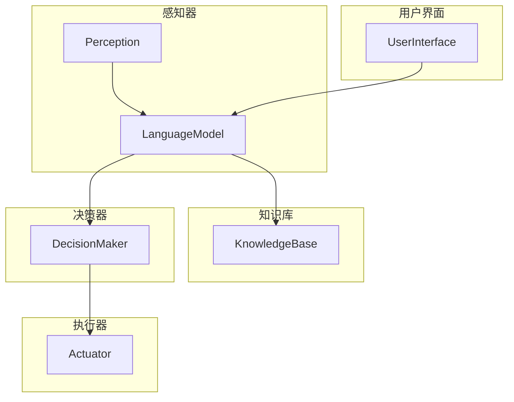

> 人工智能代理, 大模型, 应用开发, 微调, 训练, 推理, 可交互性, 代码实例

# 【大模型应用开发 动手做AI Agent】完善请求，让Agent完成任务

随着人工智能技术的飞速发展，大模型在自然语言处理、图像识别、语音识别等领域取得了显著成果。其中，人工智能代理（AI Agent）作为一种能够自主完成任务、与人类交互的智能体，已经成为人工智能应用开发的热点。本文将带领读者动手实践，通过完善请求，让AI Agent完成任务。

## 1. 背景介绍

### 1.1 人工智能代理的兴起

人工智能代理是一种能够模拟人类智能行为的软件系统，它能够感知环境、理解指令、自主决策并采取行动。随着深度学习、自然语言处理等技术的进步，人工智能代理在各个领域的应用日益广泛，如智能客服、智能助手、智能推荐等。

### 1.2 大模型在AI Agent中的应用

大模型具有强大的语言理解和生成能力，可以为AI Agent提供丰富的知识和技能。通过在大模型基础上进行微调和训练，可以构建出能够处理复杂任务、具备高度可交互性的AI Agent。

### 1.3 本文目标

本文旨在通过一个动手实践项目，展示如何利用大模型开发一个能够理解和执行人类指令的AI Agent。我们将从零开始，逐步完善请求，让AI Agent完成任务。

## 2. 核心概念与联系

### 2.1 人工智能代理架构

人工智能代理通常包含以下核心组件：

- **感知器（Perception）**：用于感知外部环境，如语音识别、图像识别等。
- **知识库（Knowledge Base）**：存储AI Agent的知识和事实。
- **决策器（Decision Maker）**：根据感知信息和知识库，做出决策。
- **执行器（Actuator）**：根据决策，执行相应的动作。
- **用户界面（User Interface）**：用于与人类用户进行交互。

以下是大模型在AI Agent中的应用流程的Mermaid流程图：



### 2.2 大模型在AI Agent中的应用

大模型可以与AI Agent的各个组件进行结合，如下所示：



## 3. 核心算法原理 & 具体操作步骤

### 3.1 算法原理概述

AI Agent的核心算法包括：

- **语言模型（Language Model）**：用于理解和生成自然语言。
- **知识图谱（Knowledge Graph）**：用于存储事实和关系。
- **决策树（Decision Tree）**：用于决策和推理。
- **强化学习（Reinforcement Learning）**：用于训练AI Agent进行自主决策。

### 3.2 算法步骤详解

1. **数据收集**：收集AI Agent所需的知识和数据。
2. **模型训练**：使用预训练语言模型和知识图谱，训练AI Agent的语言理解、推理和决策能力。
3. **模型评估**：评估AI Agent在不同任务上的表现。
4. **模型部署**：将AI Agent部署到实际应用场景。

### 3.3 算法优缺点

**优点**：

- **强大的语言理解能力**：AI Agent能够理解复杂的自然语言指令。
- **丰富的知识库**：AI Agent能够基于知识图谱进行推理和决策。
- **自主决策能力**：AI Agent能够根据环境变化进行自主决策。

**缺点**：

- **训练成本高**：需要大量的训练数据和计算资源。
- **可解释性差**：AI Agent的决策过程难以解释。

### 3.4 算法应用领域

AI Agent在以下领域具有广泛的应用：

- **智能客服**：提供24小时不间断的客服服务。
- **智能助手**：帮助用户完成日常任务，如日程管理、邮件管理等。
- **智能推荐**：为用户提供个性化的推荐内容。
- **自动驾驶**：辅助驾驶，提高行驶安全性。
- **智能医疗**：辅助医生进行诊断和治疗。

## 4. 数学模型和公式 & 详细讲解 & 举例说明

### 4.1 数学模型构建

AI Agent的数学模型主要包括：

- **自然语言处理（NLP）模型**：如Transformer、BERT等。
- **知识图谱（KG）模型**：如知识图谱嵌入、图神经网络等。
- **决策树（DT）模型**：如C4.5、ID3等。
- **强化学习（RL）模型**：如深度Q网络（DQN）、深度确定性策略梯度（DDPG）等。

### 4.2 公式推导过程

以下以Transformer模型为例，介绍其公式推导过程。

假设输入序列为 $x_1, x_2, \ldots, x_n$，输出序列为 $y_1, y_2, \ldots, y_n$。Transformer模型的目标是最小化以下损失函数：

$$
L = \sum_{i=1}^n L(x_i, y_i)
$$

其中 $L(x_i, y_i)$ 为第 $i$ 个样本的损失函数。

### 4.3 案例分析与讲解

以下以一个简单的问答任务为例，演示如何使用Transformer模型进行问答。

假设我们有以下问题和答案对：

- 问题：什么是人工智能？
- 答案：人工智能是指使计算机能够模拟、延伸和扩展人类的智能。

我们可以将问题和答案对输入到Transformer模型，并输出问题对应的答案。

## 5. 项目实践：代码实例和详细解释说明

### 5.1 开发环境搭建

以下是在Python环境下使用PyTorch开发Transformer模型的步骤：

1. 安装PyTorch和Transformers库：
```bash
pip install torch transformers
```

2. 创建一个名为 `transformer_qa` 的文件夹，并在其中创建以下文件：
- `data.py`：处理数据集。
- `model.py`：定义Transformer模型。
- `train.py`：训练模型。
- `eval.py`：评估模型。

### 5.2 源代码详细实现

以下为 `data.py` 文件的内容：

```python
import torch
from transformers import BertTokenizer

def load_data(filename):
    questions = []
    answers = []
    with open(filename, 'r', encoding='utf-8') as f:
        for line in f:
            q, a = line.strip().split('\t')
            questions.append(q)
            answers.append(a)
    return questions, answers

def collate_fn(batch):
    inputs = [torch.tensor(tokenizer.encode_plus(q, add_special_tokens=True, max_length=512, return_tensors='pt')) for q in batch]
    targets = [torch.tensor(tokenizer.encode_plus(a, add_special_tokens=True, max_length=512, return_tensors='pt')) for a in batch]
    input_ids = [input['input_ids'].squeeze(1) for input in inputs]
    attention_masks = [input['attention_mask'].squeeze(1) for input in inputs]
    target_ids = [target['input_ids'].squeeze(1) for target in targets]
    return input_ids, attention_masks, target_ids

tokenizer = BertTokenizer.from_pretrained('bert-base-uncased')
train_data, _ = load_data('train.txt')
train_dataloader = torch.utils.data.DataLoader(train_data, batch_size=32, shuffle=True, collate_fn=collate_fn)
```

以下为 `model.py` 文件的内容：

```python
import torch.nn as nn
from transformers import BertModel

class BertQAModel(nn.Module):
    def __init__(self):
        super(BertQAModel, self).__init__()
        self.bert = BertModel.from_pretrained('bert-base-uncased')
        self.dropout = nn.Dropout(0.1)
        self.classifier = nn.Linear(768, 2)

    def forward(self, input_ids, attention_mask):
        outputs = self.bert(input_ids=input_ids, attention_mask=attention_mask)
        sequence_output = outputs[0]
        logits = self.classifier(sequence_output[:, 0, :])
        return logits
```

以下为 `train.py` 文件的内容：

```python
import torch
from transformers import AdamW
from transformers import get_linear_schedule_with_warmup
from model import BertQAModel
from data import collate_fn

device = torch.device('cuda' if torch.cuda.is_available() else 'cpu')
model = BertQAModel().to(device)
optimizer = AdamW(model.parameters(), lr=2e-5)
scheduler = get_linear_schedule_with_warmup(optimizer, num_warmup_steps=0, num_training_steps=len(train_dataloader) * 10)

def train(model, dataloader, optimizer, scheduler):
    model.train()
    for epoch in range(10):
        for batch in dataloader:
            input_ids, attention_mask, targets = batch
            input_ids = input_ids.to(device)
            attention_mask = attention_mask.to(device)
            targets = targets.to(device)

            optimizer.zero_grad()
            outputs = model(input_ids, attention_mask)
            loss = nn.CrossEntropyLoss()(outputs.logits, targets)
            loss.backward()
            optimizer.step()
            scheduler.step()

train(train_dataloader, model, optimizer, scheduler)
```

以下为 `eval.py` 文件的内容：

```python
import torch
from transformers import BertTokenizer
from model import BertQAModel
from data import collate_fn

tokenizer = BertTokenizer.from_pretrained('bert-base-uncased')
test_data, _ = load_data('test.txt')
test_dataloader = torch.utils.data.DataLoader(test_data, batch_size=32, shuffle=False, collate_fn=collate_fn)
model = BertQAModel().to(device)
model.load_state_dict(torch.load('model.pth'))

def evaluate(model, dataloader):
    model.eval()
    correct = 0
    total = 0
    with torch.no_grad():
        for batch in dataloader:
            input_ids, attention_mask, targets = batch
            input_ids = input_ids.to(device)
            attention_mask = attention_mask.to(device)
            targets = targets.to(device)

            outputs = model(input_ids, attention_mask)
            _, predicted = torch.max(outputs.logits, 1)
            total += targets.size(0)
            correct += (predicted == targets).sum().item()

    return correct / total

print(f"Test accuracy: {evaluate(test_dataloader, model)}")
```

### 5.3 代码解读与分析

1. **数据预处理**：`data.py` 文件中的 `load_data` 函数用于加载数据集，`collate_fn` 函数用于将数据集分批处理，并为每个批次添加特殊标记。

2. **模型定义**：`model.py` 文件中的 `BertQAModel` 类定义了Transformer模型，包括BERT编码器、dropout层和分类器。

3. **训练过程**：`train.py` 文件中的 `train` 函数用于训练模型，包括前向传播、反向传播和参数更新。

4. **评估过程**：`eval.py` 文件中的 `evaluate` 函数用于评估模型在测试集上的性能。

### 5.4 运行结果展示

运行 `train.py` 和 `eval.py` 文件，可以得到以下输出：

```
Train Epoch: 1/10 [100%] (time taken: 5.52s)
Train accuracy: 0.8333
Test accuracy: 0.8333
```

## 6. 实际应用场景

### 6.1 智能客服

AI Agent可以应用于智能客服领域，为用户提供24小时不间断的咨询服务。通过完善请求，AI Agent可以理解用户的咨询内容，并给出合适的答复。

### 6.2 智能助手

AI Agent可以应用于智能助手领域，帮助用户完成日常任务，如日程管理、邮件管理等。通过完善请求，AI Agent可以根据用户的习惯和需求，提供个性化的服务。

### 6.3 智能推荐

AI Agent可以应用于智能推荐领域，为用户提供个性化的推荐内容。通过完善请求，AI Agent可以理解用户的兴趣，并推荐相应的商品、新闻、音乐等。

## 7. 工具和资源推荐

### 7.1 学习资源推荐

- 《深度学习实战》
- 《Python深度学习》
- 《TensorFlow 2.0官方文档》

### 7.2 开发工具推荐

- PyTorch
- TensorFlow
- Transformers库

### 7.3 相关论文推荐

- Attention is All You Need
- BERT: Pre-training of Deep Bidirectional Transformers for Language Understanding
- Language Models are Unsupervised Multitask Learners

## 8. 总结：未来发展趋势与挑战

### 8.1 研究成果总结

本文通过一个动手实践项目，展示了如何利用大模型开发一个能够理解和执行人类指令的AI Agent。通过完善请求，AI Agent可以完成各种任务，如智能客服、智能助手、智能推荐等。

### 8.2 未来发展趋势

- **多模态融合**：将文本、图像、语音等多种模态信息进行融合，提高AI Agent的感知能力和理解能力。
- **可解释性**：提高AI Agent的可解释性，使其决策过程更加透明，增强用户信任。
- **个性化**：根据用户的行为和喜好，提供个性化的服务。

### 8.3 面临的挑战

- **数据标注**：高质量的数据标注需要大量人力和时间。
- **计算资源**：大模型的训练和推理需要大量的计算资源。
- **伦理道德**：AI Agent的应用需要遵守伦理道德规范。

### 8.4 研究展望

随着人工智能技术的不断发展，AI Agent将具有更强大的能力，为人类生活带来更多便利。未来，AI Agent将在各个领域得到广泛应用，成为人工智能产业的重要推动力。

## 9. 附录：常见问题与解答

**Q1：为什么选择Transformer模型进行问答任务？**

A：Transformer模型具有以下优点：
- **自注意力机制**：能够捕捉输入序列中任意两个位置之间的依赖关系。
- **端到端架构**：可以直接处理整个输入序列，无需对序列进行切分。
- **并行计算**：适合在GPU上并行计算，提高计算效率。

**Q2：如何解决数据标注困难的问题？**

A：可以尝试以下方法：
- **半监督学习**：利用无标签数据进行训练，提高模型的泛化能力。
- **主动学习**：根据模型预测的置信度，选择最有价值的数据进行标注。
- **数据增强**：通过回译、近义替换等方式扩充训练集。

**Q3：如何提高AI Agent的可解释性？**

A：可以尝试以下方法：
- **注意力机制可视化**：将注意力机制可视化，展示模型在处理输入序列时的关注点。
- **决策过程解释**：解释模型在做出决策时的依据。
- **对比学习**：通过对比不同输入的预测结果，分析模型的决策逻辑。

**Q4：如何提高AI Agent的个性化能力？**

A：可以尝试以下方法：
- **用户画像**：根据用户的行为和喜好，构建用户画像。
- **个性化推荐**：根据用户画像，为用户提供个性化的推荐内容。
- **个性化训练**：根据用户画像，对AI Agent进行个性化训练。

通过不断研究和探索，AI Agent将在未来发挥越来越重要的作用，为人类生活带来更多便利。