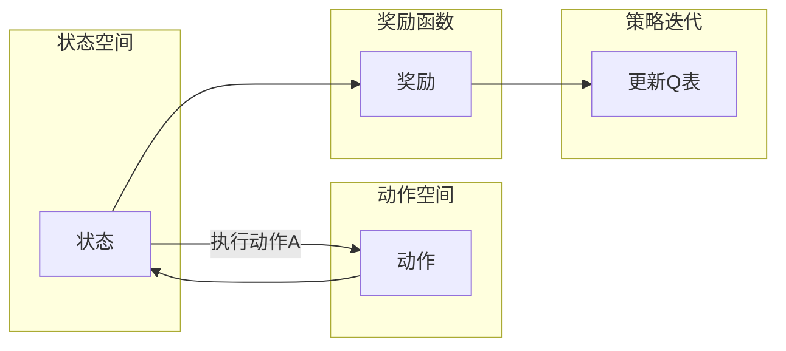

> Q-learning, 强化学习, 策略迭代, 奖励函数, 状态空间, 动作空间, 动态规划, 人工智能, 资源管理, 决策系统

# 一切皆是映射：AI Q-learning探索-利用平衡实践

强化学习（Reinforcement Learning, RL）是人工智能领域的一个重要分支，它通过智能体在环境中学习如何做出决策，以实现最大化累积奖励。Q-learning作为强化学习的一种核心算法，因其简单易用和强大的学习能力而被广泛应用。本文将深入探讨Q-learning的原理、操作步骤、优缺点、应用领域，并结合实际项目实践，全面解析Q-learning在人工智能中的应用。

## 1. 背景介绍

强化学习起源于心理学领域，旨在研究智能体在动态环境中如何通过学习来做出最优决策。与监督学习和无监督学习不同，强化学习中的智能体需要通过与环境的交互来学习，其目标是在一系列决策过程中最大化累积奖励。

Q-learning是强化学习中最著名的算法之一，由Richard S. Sutton和Andrew G. Barto在1983年提出。Q-learning通过构建Q表（Q-table）来存储状态-动作价值函数，指导智能体选择最优动作。

## 2. 核心概念与联系

### 2.1 核心概念

**强化学习**：一种机器学习方法，智能体通过与环境交互，学习在特定环境中做出最优决策以实现目标。

**智能体（Agent）**：强化学习中的主体，负责执行动作并观察环境状态。

**环境（Environment）**：智能体执行动作的对象，智能体的动作会改变环境状态。

**状态（State）**：描述环境状态的属性集合。

**动作（Action）**：智能体可以执行的行为。

**奖励函数（Reward Function）**：定义智能体在环境中采取行动后获得的奖励值。

**策略（Policy）**：智能体在给定状态下采取动作的决策规则。

**价值函数（Value Function）**：评估智能体在特定状态下采取特定动作的期望奖励。

**Q表（Q-table）**：存储状态-动作价值函数的表格，指导智能体选择最优动作。

### 2.2 Mermaid 流程图



### 2.3 核心概念联系

智能体在状态空间中选择动作，通过奖励函数获取奖励，并根据奖励更新Q表。这个过程不断迭代，最终形成最优策略。

## 3. 核心算法原理 & 具体操作步骤

### 3.1 算法原理概述

Q-learning通过迭代更新Q表来学习状态-动作价值函数。具体来说，对于每个状态-动作对，Q-learning使用如下公式来更新Q值：

$$
Q(s,a) \leftarrow Q(s,a) + \alpha [R + \gamma \max_{a'} Q(s',a') - Q(s,a)]
$$

其中，$Q(s,a)$ 表示在状态 $s$ 下执行动作 $a$ 的价值，$R$ 表示执行动作 $a$ 后获得的奖励，$\alpha$ 表示学习率，$\gamma$ 表示折扣因子。

### 3.2 算法步骤详解

1. 初始化Q表，将所有Q值设置为0。
2. 选择一个初始状态 $s_0$。
3. 在状态 $s$ 下，根据策略选择动作 $a$。
4. 执行动作 $a$，观察新的状态 $s'$ 和奖励 $R$。
5. 使用Q学习公式更新Q表：$Q(s,a) \leftarrow Q(s,a) + \alpha [R + \gamma \max_{a'} Q(s',a') - Q(s,a)]$。
6. 将智能体转移到状态 $s'$，重复步骤3-5，直到达到终止条件。

### 3.3 算法优缺点

**优点**：

- 算法简单，易于实现。
- 能够处理离散状态空间和动作空间。
- 无需预先定义策略或价值函数。
- 能够通过迭代学习到最优策略。

**缺点**：

- 对于连续状态空间和动作空间，Q学习可能会变得非常复杂。
- 学习过程可能非常缓慢，尤其是在高维空间中。
- 需要大量的样本数据进行学习。

### 3.4 算法应用领域

Q-learning在许多领域都有广泛的应用，包括：

- 机器人路径规划
- 游戏AI
- 资源管理
- 供应链优化
- 电力系统优化

## 4. 数学模型和公式 & 详细讲解 & 举例说明

### 4.1 数学模型构建

Q-learning的数学模型基于马尔可夫决策过程（MDP）。在MDP中，智能体在一个状态空间中移动，每个状态对应一组可能的动作和相应的奖励。智能体的目标是找到一条策略，使得累积奖励最大化。

### 4.2 公式推导过程

Q-learning的目标是学习状态-动作价值函数 $Q(s,a)$。假设智能体处于状态 $s$，执行动作 $a$ 后转移到状态 $s'$，并获得奖励 $R$，那么Q-learning的更新公式可以表示为：

$$
Q(s,a) \leftarrow Q(s,a) + \alpha [R + \gamma \max_{a'} Q(s',a') - Q(s,a)]
$$

其中，$\alpha$ 是学习率，$\gamma$ 是折扣因子，表示未来奖励的现值。

### 4.3 案例分析与讲解

假设一个简单的环境，智能体在一个4x4的网格中移动。智能体可以向上、下、左、右移动，每个方向对应一个动作。智能体每移动一步，如果到达边界，则获得奖励-1；如果移动到中心位置，则获得奖励+10。

我们可以构建一个Q表，如下所示：

| 状态 | 上   | 下   | 左   | 右   |
| ---- | ---- | ---- | ---- | ---- |
| 1    | 0.0  | 0.0  | 0.0  | 0.0  |
| 2    | 0.0  | 0.0  | 0.0  | 0.0  |
| 3    | 0.0  | 0.0  | 0.0  | 0.0  |
| 4    | 0.0  | 0.0  | 0.0  | 10.0 |

初始时，所有Q值都设置为0。智能体从状态1开始，选择向上移动。然后，智能体到达状态2，获得奖励-1。根据Q学习公式，我们更新Q表：

$$
Q(1,上) \leftarrow Q(1,上) + 0.1 [-1 + 0.9 \times 10] = 0.9
$$

智能体继续向上移动，到达状态3，获得奖励-1。我们再次更新Q表：

$$
Q(2,上) \leftarrow Q(2,上) + 0.1 [-1 + 0.9 \times 9] = 0.8
$$

以此类推，直到智能体到达中心位置，获得奖励+10。此时，Q表的更新过程结束，智能体将学会选择最优动作到达中心位置。

## 5. 项目实践：代码实例和详细解释说明

### 5.1 开发环境搭建

为了演示Q-learning的应用，我们将使用Python编程语言和OpenAI Gym库来构建一个简单的网格世界环境。以下是搭建开发环境的步骤：

1. 安装Python 3.7或更高版本。
2. 安装OpenAI Gym库：`pip install gym`。
3. 安装NumPy库：`pip install numpy`。

### 5.2 源代码详细实现

以下是一个简单的Q-learning示例代码：

```python
import gym
import numpy as np

# 定义环境
env = gym.make('GridWorld-v0')

# 初始化Q表
Q_table = np.zeros((env.observation_space.n, env.action_space.n))

# 设置学习率和折扣因子
alpha = 0.1
gamma = 0.9

# Q-learning算法
for episode in range(1000):
    state = env.reset()
    done = False
    
    while not done:
        action = np.argmax(Q_table[state])
        next_state, reward, done, _ = env.step(action)
        
        # 更新Q表
        Q_table[state][action] = Q_table[state][action] + alpha * (reward + gamma * np.max(Q_table[next_state]) - Q_table[state][action])
        
        state = next_state

# 打印Q表
print(Q_table)
```

### 5.3 代码解读与分析

- 首先，我们导入必要的库。
- 然后，创建一个GridWorld环境。
- 初始化Q表，其中所有元素都设置为0。
- 设置学习率和折扣因子。
- 使用一个for循环来模拟1000个游戏回合。
- 在每个回合中，智能体从初始状态开始，根据Q表选择动作。
- 执行动作后，智能体观察新的状态和奖励。
- 根据Q学习公式更新Q表。
- 当游戏结束时，退出while循环。
- 最后，打印Q表。

### 5.4 运行结果展示

运行上述代码后，我们将得到一个Q表，其中包含了智能体在每个状态下采取每个动作的预期奖励。这个Q表可以用来指导智能体在GridWorld环境中做出最优决策。

## 6. 实际应用场景

Q-learning在许多实际应用场景中都有广泛的应用，以下是一些例子：

- 机器人路径规划：使用Q-learning来指导机器人选择最优路径，避免碰撞并快速到达目标位置。
- 游戏AI：使用Q-learning来训练游戏AI，使其能够自动玩游戏并取得优异成绩。
- 资源管理：使用Q-learning来优化资源分配，提高资源利用效率。
- 供应链优化：使用Q-learning来优化供应链管理，降低成本并提高服务水平。

## 7. 工具和资源推荐

### 7.1 学习资源推荐

- 《Reinforcement Learning: An Introduction》: 这本书是强化学习领域的经典教材，详细介绍了强化学习的理论和实践。
- 《Artificial Intelligence: A Modern Approach》：这本书介绍了人工智能领域的广泛主题，包括强化学习。
- OpenAI Gym: OpenAI Gym是一个开源的强化学习环境库，提供了各种预定义的环境，可以用来测试和训练强化学习算法。

### 7.2 开发工具推荐

- OpenAI Gym：用于构建和测试强化学习环境的库。
- PyTorch：用于机器学习的开源库，可以用来实现和训练强化学习算法。
- TensorFlow：用于机器学习的开源库，也可以用来实现和训练强化学习算法。

### 7.3 相关论文推荐

- Q-Learning: http://incompleteideas.net/rl/qlearning.html
- Deep Reinforcement Learning: http://www.deeplearningbook.org/
- Human-level control through deep reinforcement learning: http://arxiv.org/abs/1602.01783

## 8. 总结：未来发展趋势与挑战

### 8.1 研究成果总结

本文深入探讨了Q-learning算法的原理、操作步骤、优缺点、应用领域，并结合实际项目实践，全面解析了Q-learning在人工智能中的应用。通过本文的学习，读者可以了解到Q-learning的基本概念、核心原理以及在实际应用中的优势。

### 8.2 未来发展趋势

随着深度学习、强化学习的不断发展，Q-learning在未来可能会有以下发展趋势：

- 与深度学习结合，实现更强大的智能体。
- 在更复杂的动态环境中应用，如多智能体强化学习。
- 在更广泛的领域应用，如机器人、自动驾驶、金融等。

### 8.3 面临的挑战

尽管Q-learning在许多领域都有广泛应用，但仍然面临着以下挑战：

- 对于高维状态空间和动作空间，Q-learning的计算复杂度很高。
- Q-table的学习速度较慢，需要大量的样本数据。
- Q-table的学习过程容易陷入局部最优。

### 8.4 研究展望

为了应对上述挑战，未来的研究可以从以下几个方面进行：

- 研究更高效的Q-table学习算法，如优先级顺序策略（Priority Sampling）。
- 研究更有效的样本数据采集方法，如UCB算法。
- 研究更强大的智能体模型，如基于深度学习的智能体模型。

通过不断的研究和创新，Q-learning将在人工智能领域发挥更大的作用，为构建更智能的系统和应用提供有力支持。

## 9. 附录：常见问题与解答

**Q1：Q-learning与深度学习的关系是什么？**

A：Q-learning和深度学习都是机器学习的重要分支。Q-learning是一种基于值函数的强化学习算法，而深度学习是一种基于神经网络的机器学习方法。虽然两者在原理和实现上有所不同，但它们可以相互结合，例如将深度神经网络作为Q-value的近似。

**Q2：如何选择合适的学习率和折扣因子？**

A：学习率和折扣因子对Q-learning的性能有很大影响。选择合适的学习率和折扣因子通常需要通过实验来确定。一般建议从较小的值开始，如学习率0.1，折扣因子0.9，然后根据实验结果进行调整。

**Q3：Q-learning如何处理连续状态空间和动作空间？**

A：对于连续状态空间和动作空间，Q-learning需要使用采样方法来处理。例如，可以使用均匀采样或高斯采样来生成状态和动作。

**Q4：Q-learning在哪些领域有应用？**

A：Q-learning在许多领域都有应用，如机器人路径规划、游戏AI、资源管理、供应链优化等。

**Q5：如何评估Q-learning的性能？**

A：评估Q-learning的性能可以通过以下指标进行：

- 平均奖励：在多次实验中，智能体获得的平均奖励。
- 收敛速度：Q-table的学习速度。
- 稳定性：智能体在不同环境下的性能稳定性。

作者：禅与计算机程序设计艺术 / Zen and the Art of Computer Programming