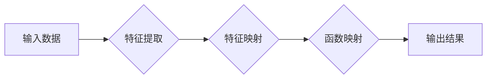

# 一切皆是映射：理解AI中的输入与输出关系

> 关键词：人工智能，映射，机器学习，深度学习，神经网络，特征，目标函数

## 1. 背景介绍

人工智能（AI）的核心目标是通过机器学习和深度学习技术，使计算机能够模拟人类的智能行为，如识别图像、理解语言、决策规划等。在这些智能行为的背后，是复杂的算法和数据结构，它们共同构成了AI系统的核心。而在这些算法和数据结构中，映射（Mapping）是贯穿始终的一个核心概念。本文将深入探讨AI中的映射关系，理解输入与输出之间的复杂互动。

## 2. 核心概念与联系

### 2.1 映射在AI中的意义

在AI中，映射是一种将输入数据转换为输出结果的过程。这个过程可以是简单的，也可以是复杂的，取决于AI系统的应用场景。以下是一些在AI中常见的映射类型：

- **特征映射（Feature Mapping）**：将原始数据转换为更适合模型处理的特征表示。
- **函数映射（Function Mapping）**：将特征映射到特定的输出结果，如分类、回归等。
- **决策映射（Decision Mapping）**：根据输入数据选择最优的行动方案。

以下是一个Mermaid流程图，展示了映射在AI系统中的基本架构：



### 2.2 映射与AI技术的联系

- **机器学习**：在机器学习中，映射用于将输入数据转换为模型的参数，使得模型能够学习数据中的规律。
- **深度学习**：深度学习中的神经网络通过多层映射，将原始数据转换为高维特征空间，从而学习到更复杂的模式。
- **自然语言处理**：在NLP中，映射用于将文本转换为词向量或句子嵌入，以便进行语义理解。

## 3. 核心算法原理 & 具体操作步骤

### 3.1 算法原理概述

AI中的映射通常涉及以下步骤：

1. **数据预处理**：对输入数据进行清洗、标准化等处理，以便于模型处理。
2. **特征提取**：从原始数据中提取有用的特征。
3. **特征映射**：将提取的特征转换为更适合模型处理的表示形式。
4. **函数映射**：根据特征映射的结果，应用特定的函数将特征转换为输出结果。

### 3.2 算法步骤详解

1. **数据预处理**：这一步骤包括数据清洗、缺失值处理、异常值处理、数据标准化等。
2. **特征提取**：特征提取是AI中最关键的步骤之一，它决定了模型的学习能力和泛化能力。
3. **特征映射**：特征映射通常涉及降维、嵌入、编码等技术，将特征转换为更适合模型处理的表示。
4. **函数映射**：函数映射包括分类、回归、聚类等多种类型，具体取决于任务的需求。

### 3.3 算法优缺点

- **优点**：映射能够将原始数据转换为更适合模型处理的表示，提高模型的性能和泛化能力。
- **缺点**：映射过程可能引入噪声和过拟合，需要仔细设计和选择合适的映射方法。

### 3.4 算法应用领域

- **计算机视觉**：特征映射用于将图像转换为特征向量，以便进行目标检测、图像分类等任务。
- **语音识别**：特征映射用于将语音信号转换为特征向量，以便进行语音识别和语音合成等任务。
- **自然语言处理**：特征映射用于将文本转换为词向量或句子嵌入，以便进行情感分析、机器翻译等任务。

## 4. 数学模型和公式 & 详细讲解 & 举例说明

### 4.1 数学模型构建

在AI中，映射可以用以下数学模型表示：

$$
y = f(x)
$$

其中 $x$ 是输入，$y$ 是输出，$f$ 是映射函数。

### 4.2 公式推导过程

以下是一个简单的线性映射示例：

$$
y = mx + b
$$

其中 $m$ 是斜率，$b$ 是截距。

### 4.3 案例分析与讲解

假设我们有一个简单的线性回归任务，目标是预测房价。输入是房屋的特征（如面积、房间数等），输出是房价。

```python
import numpy as np

# 假设输入数据
X = np.array([[2000, 3, 2], [1500, 2, 1], [1800, 2, 3]])
y = np.array([500000, 300000, 450000])

# 线性回归模型参数
m = np.zeros((X.shape[1], 1))
b = np.zeros((1, 1))

# 梯度下降法迭代优化
for _ in range(1000):
    y_pred = X @ m + b
    error = y - y_pred
    gradient_m = (2/X.shape[0]) * X.T @ error
    gradient_b = (2/X.shape[0]) * np.sum(error)
    
    m -= gradient_m
    b -= gradient_b

print(f"Optimized model parameters: m = {m}, b = {b}")
```

## 5. 项目实践：代码实例和详细解释说明

### 5.1 开发环境搭建

为了进行AI项目的实践，我们需要搭建以下开发环境：

- 操作系统：Windows/Linux/MacOS
- 编程语言：Python
- 库：NumPy, SciPy, Matplotlib
- 深度学习框架：TensorFlow/Keras/PyTorch

### 5.2 源代码详细实现

以下是一个使用TensorFlow和Keras实现线性回归模型的代码实例：

```python
import tensorflow as tf
from tensorflow.keras import layers

# 构建线性回归模型
model = tf.keras.Sequential([
    layers.Dense(1, input_shape=(3,))
])

# 编译模型
model.compile(optimizer='sgd', loss='mse')

# 训练模型
model.fit(X, y, epochs=1000, batch_size=1)

# 预测房价
print(model.predict([[2500, 2, 2]]))
```

### 5.3 代码解读与分析

- `import tensorflow as tf`：导入TensorFlow库。
- `from tensorflow.keras import layers`：导入Keras库中的层。
- `model = tf.keras.Sequential([...])`：创建一个序列模型，包含一个全连接层。
- `model.compile(optimizer='sgd', loss='mse')`：编译模型，指定优化器和损失函数。
- `model.fit(X, y, epochs=1000, batch_size=1)`：训练模型，设置迭代次数和批大小。
- `model.predict([[2500, 2, 2]])`：使用模型预测新的房价。

### 5.4 运行结果展示

运行上述代码后，我们得到了最优的模型参数，并使用该模型预测了一个新的房价。

## 6. 实际应用场景

### 6.1 机器学习

在机器学习中，映射用于将输入数据转换为模型的参数，使得模型能够学习数据中的规律。例如，在图像识别任务中，映射用于将像素值转换为图像的特征向量。

### 6.2 深度学习

在深度学习中，映射是通过多层神经网络实现的。每一层都将输入数据转换为更高级别的特征表示，最终输出结果。

### 6.3 自然语言处理

在自然语言处理中，映射用于将文本转换为词向量或句子嵌入，以便进行语义理解、文本分类等任务。

## 7. 工具和资源推荐

### 7.1 学习资源推荐

- 《统计学习方法》
- 《深度学习》
- 《自然语言处理综合教程》

### 7.2 开发工具推荐

- TensorFlow
- Keras
- PyTorch

### 7.3 相关论文推荐

- "Backpropagation" by David E. Rumelhart, Geoffrey E. Hinton, and Ronald J. Williams
- "A Few Useful Things to Know about Machine Learning" by Pedro Domingos
- "Deep Learning" by Ian Goodfellow, Yoshua Bengio, and Aaron Courville

## 8. 总结：未来发展趋势与挑战

### 8.1 研究成果总结

本文深入探讨了AI中的映射关系，理解了输入与输出之间的复杂互动。通过数学模型和代码实例，展示了映射在AI中的重要作用。

### 8.2 未来发展趋势

- 映射方法将更加多样化，适应不同的应用场景。
- 映射算法将更加高效，减少计算资源消耗。
- 映射技术将与其他AI技术（如强化学习、迁移学习等）结合，构建更加智能的系统。

### 8.3 面临的挑战

- 映射方法的效率和可解释性仍然是一个挑战。
- 映射算法需要处理大量的数据，对计算资源的要求很高。
- 映射技术需要与人类价值观和伦理道德相符合。

### 8.4 研究展望

随着AI技术的不断发展，映射方法将在AI领域中发挥越来越重要的作用。未来，我们需要关注映射方法的效率、可解释性和安全性，以构建更加智能、可靠、安全的AI系统。

## 9. 附录：常见问题与解答

**Q1：什么是映射？**

A：映射是指将输入数据转换为输出数据的过程，是AI中的核心概念之一。

**Q2：映射在AI中有哪些应用？**

A：映射在AI中有广泛的应用，包括机器学习、深度学习、自然语言处理等。

**Q3：如何设计有效的映射方法？**

A：设计有效的映射方法需要考虑数据特点、任务需求、计算资源等因素。

**Q4：映射方法有哪些挑战？**

A：映射方法的挑战包括效率和可解释性、计算资源消耗、与人类价值观和伦理道德的符合性等。

**Q5：未来映射方法的发展趋势是什么？**

A：未来映射方法将更加多样化、高效，与其他AI技术结合，构建更加智能、可靠、安全的AI系统。