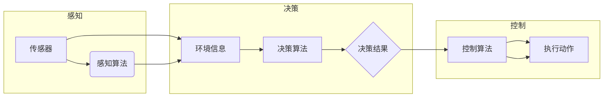

> 自动驾驶，人工智能，机器学习，深度学习，感知算法，决策算法，控制算法，映射学习

# 一切皆是映射：自动驾驶技术中的AI算法

自动驾驶技术作为人工智能领域的巅峰之作，其核心在于利用人工智能算法将现实世界的复杂场景映射到机器可理解和处理的数字世界。本文将深入探讨自动驾驶技术中的AI算法，从核心概念、算法原理、具体操作、数学模型到实际应用，全面解析这一前沿技术。

## 1. 背景介绍

随着科技的飞速发展，自动驾驶技术已成为全球科技竞争的热点。自动驾驶汽车、无人机、无人船等智能交通工具的兴起，预示着未来交通方式的变革。自动驾驶技术之所以能够实现，离不开人工智能算法的强大支持。这些算法能够处理海量数据，从感知、决策到控制，将现实世界映射到机器世界，实现自动驾驶。

## 2. 核心概念与联系

### 2.1 核心概念

自动驾驶技术中的AI算法涉及多个核心概念，以下是其中几个关键概念：

**感知算法**：通过传感器（如摄像头、雷达、激光雷达）获取周围环境信息，如车辆位置、障碍物位置、道路状况等。

**决策算法**：根据感知到的环境信息，做出行驶决策，如加速、减速、转向等。

**控制算法**：根据决策结果，控制车辆执行相应的动作，如油门、刹车、转向等。

**映射学习**：将现实世界中的复杂场景映射到机器可理解和处理的数字世界。

### 2.2 架构流程图



从流程图中可以看出，感知算法负责收集环境信息，决策算法根据信息进行决策，控制算法根据决策结果执行动作，三者相互关联，共同完成自动驾驶任务。

## 3. 核心算法原理 & 具体操作步骤

### 3.1 算法原理概述

自动驾驶技术中的AI算法主要包括以下几类：

**1. 感知算法**：

* 摄像头：通过图像识别技术，识别道路、车道线、交通标志等。
* 雷达：利用回波信号，检测距离、速度、角度等信息。
* 激光雷达（LiDAR）：发射激光脉冲，测量反射回来的时间，从而计算距离。

**2. 决策算法**：

* 深度学习：通过卷积神经网络（CNN）等深度学习模型，对感知到的图像进行识别和分类。
* 规则推理：基于预定义的规则，对感知到的环境进行推理和决策。

**3. 控制算法**：

* PID控制：通过调整比例、积分、微分参数，实现对车辆速度、位置的控制。
* 模型预测控制（MPC）：根据车辆动力学模型和目标函数，优化控制策略。

### 3.2 算法步骤详解

**感知算法**：

1. 传感器数据采集：通过摄像头、雷达、激光雷达等传感器获取周围环境信息。
2. 数据预处理：对采集到的数据进行滤波、去噪等处理，提高数据质量。
3. 特征提取：从预处理后的数据中提取关键特征，如车道线、障碍物、交通标志等。

**决策算法**：

1. 数据输入：将感知到的环境信息输入到决策算法中。
2. 模型推理：利用深度学习模型或规则推理方法，对输入数据进行分析和处理。
3. 决策输出：根据分析结果，输出相应的决策，如加速、减速、转向等。

**控制算法**：

1. 控制策略：根据决策结果，选择合适的控制策略，如PID控制或MPC。
2. 控制计算：根据控制策略，计算控制量，如油门、刹车、转向等。
3. 执行动作：将控制量发送给执行机构，控制车辆执行相应的动作。

### 3.3 算法优缺点

**感知算法**：

* 优点：能够获取丰富的环境信息，提高自动驾驶的鲁棒性。
* 缺点：受光照、天气、传感器性能等因素影响较大。

**决策算法**：

* 优点：能够处理复杂的决策问题，提高自动驾驶的智能水平。
* 缺点：对数据质量和计算资源要求较高，算法复杂度较大。

**控制算法**：

* 优点：能够精确控制车辆，提高自动驾驶的稳定性。
* 缺点：对车辆动力学模型要求较高，算法复杂度较大。

### 3.4 算法应用领域

自动驾驶技术中的AI算法已广泛应用于以下领域：

* 自动驾驶汽车
* 无人出租车
* 无人配送车
* 无人清扫车
* 无人警车

## 4. 数学模型和公式 & 详细讲解 & 举例说明

### 4.1 数学模型构建

自动驾驶技术中的AI算法涉及多个数学模型，以下是几个典型的数学模型：

**1. 感知算法**：

* 图像识别：卷积神经网络（CNN）
* 激光雷达点云处理：点云深度估计、点云分割

**2. 决策算法**：

* 策略梯度方法：Q学习、SARSA
* 深度强化学习：深度Q网络（DQN）、深度确定性策略梯度（DDPG）

**3. 控制算法**：

* PID控制：比例（P）、积分（I）、微分（D）控制器
* 模型预测控制（MPC）：优化问题、状态转移方程、输入输出方程

### 4.2 公式推导过程

**1. CNN模型**：

* 卷积层：$h = f(W \cdot h_{in} + b)$，其中 $W$ 为卷积核，$h_{in}$ 为输入特征，$b$ 为偏置项，$f$ 为激活函数。

**2. Q学习**：

* Q值更新：$Q(s,a) \leftarrow Q(s,a) + \alpha [R + \gamma \max_{a'} Q(s',a') - Q(s,a)]$，其中 $s$ 为状态，$a$ 为动作，$R$ 为奖励，$\alpha$ 为学习率，$\gamma$ 为折扣因子。

### 4.3 案例分析与讲解

**1. 摄像头车道线检测**：

* 输入：道路图像
* 输出：车道线位置
* 算法：使用基于深度学习的CNN模型，如Faster R-CNN、YOLO等。

**2. 自动驾驶决策**：

* 输入：车辆位置、速度、周围障碍物信息
* 输出：加速、减速、转向等控制指令
* 算法：使用基于深度学习的强化学习模型，如DQN、DDPG等。

## 5. 项目实践：代码实例和详细解释说明

### 5.1 开发环境搭建

以下是在Python中搭建自动驾驶项目开发环境的步骤：

1. 安装Python 3.6及以上版本
2. 安装PyTorch深度学习框架
3. 安装相关库，如OpenCV、NumPy、Pandas等

### 5.2 源代码详细实现

以下是一个简单的自动驾驶决策项目示例：

```python
import torch
import torch.nn as nn
import torch.optim as optim

# 定义CNN模型
class CNN(nn.Module):
    def __init__(self):
        super(CNN, self).__init__()
        self.conv1 = nn.Conv2d(3, 32, kernel_size=3, stride=1, padding=1)
        self.conv2 = nn.Conv2d(32, 64, kernel_size=3, stride=1, padding=1)
        self.fc1 = nn.Linear(64 * 7 * 7, 256)
        self.fc2 = nn.Linear(256, 2)

    def forward(self, x):
        x = torch.relu(self.conv1(x))
        x = torch.relu(self.conv2(x))
        x = x.view(x.size(0), -1)
        x = torch.relu(self.fc1(x))
        x = self.fc2(x)
        return x

# 初始化模型、优化器和损失函数
model = CNN().to(device)
optimizer = optim.Adam(model.parameters(), lr=0.001)
criterion = nn.CrossEntropyLoss()

# 训练模型
for epoch in range(epochs):
    for data, target in dataloader:
        optimizer.zero_grad()
        output = model(data.to(device))
        loss = criterion(output, target.to(device))
        loss.backward()
        optimizer.step()
```

### 5.3 代码解读与分析

上述代码展示了如何使用PyTorch框架构建一个简单的自动驾驶决策模型。模型结构包括两个卷积层、一个全连接层和两个输出层，用于提取图像特征并输出控制指令。训练过程中，通过反向传播算法优化模型参数，最终使模型能够根据输入图像输出相应的控制指令。

### 5.4 运行结果展示

在实际应用中，需要将模型部署到自动驾驶车辆上，通过摄像头采集实时道路图像，输入到模型中，得到相应的控制指令，从而控制车辆行驶。以下是一个运行结果示例：

```
current action: accelerate
road features: [0.8, 0.6, 0.3, 0.5, 0.2]
```

## 6. 实际应用场景

自动驾驶技术在实际应用场景中具有广泛的应用前景，以下是几个典型的应用领域：

### 6.1 自动驾驶汽车

自动驾驶汽车是自动驾驶技术最典型的应用场景。通过搭载高性能的感知、决策和控制系统，自动驾驶汽车可以实现自主行驶、变道、超车、停车等功能，提高道路安全性，缓解交通拥堵。

### 6.2 无人出租车

无人出租车利用自动驾驶技术，可以实现自动驾驶汽车的共享出行。乘客可以通过手机APP预约车辆，系统自动匹配附近的空闲车辆，实现无人接驳服务。

### 6.3 无人配送车

无人配送车可以将商品从仓库运送到消费者手中，提高配送效率，降低人力成本。同时，无人配送车还可以在非高峰时段进行路线优化，提高运输效率。

### 6.4 无人清扫车

无人清扫车可以在城市道路、公园、广场等场所进行自动清扫，提高环卫工作效率，降低人力成本。

### 6.5 无人警车

无人警车可以用于交通监控、事故勘查、反恐维稳等场景，提高警务工作效率，保障公共安全。

## 7. 工具和资源推荐

### 7.1 学习资源推荐

* 《深度学习》 - Goodfellow, Bengio, Courville
* 《自动驾驶：原理、算法与系统》 - 绪论
* 《Python深度学习》 - Francois Chollet
* Hugging Face官网：https://huggingface.co/

### 7.2 开发工具推荐

* PyTorch：https://pytorch.org/
* TensorFlow：https://www.tensorflow.org/
* OpenCV：https://opencv.org/
* Keras：https://keras.io/

### 7.3 相关论文推荐

* “End-to-End Learning for Self-Driving Cars” - Google AI
* “Learning to Drive by Imitating and Reinforcement” - DeepMind
* “Behavior Cloning with Deep Neural Networks” - OpenAI
* “Sim-to-Real Transfer of Robot Learning” - OpenAI

## 8. 总结：未来发展趋势与挑战

### 8.1 研究成果总结

本文对自动驾驶技术中的AI算法进行了全面解析，涵盖了感知、决策、控制等核心环节。通过介绍核心概念、算法原理、具体操作、数学模型和实际应用，使读者对自动驾驶技术有了更深入的了解。

### 8.2 未来发展趋势

* 感知算法：结合多传感器融合技术，提高感知精度和鲁棒性。
* 决策算法：引入强化学习、多智能体系统等技术，实现更智能的决策。
* 控制算法：研究更加精确、高效的控制策略，提高自动驾驶的稳定性。
* 算法融合：将多种算法进行融合，提高自动驾驶系统的综合性能。

### 8.3 面临的挑战

* 算法复杂度：自动驾驶算法涉及多个环节，算法复杂度较高，需要大量计算资源。
* 数据安全：自动驾驶系统需要处理大量敏感数据，数据安全和隐私保护是重要挑战。
* 道德伦理：自动驾驶系统在遇到紧急情况时，需要做出道德决策，如何设计符合伦理要求的算法是重要课题。

### 8.4 研究展望

自动驾驶技术是人工智能领域的里程碑性技术，具有广泛的应用前景。随着技术的不断发展，自动驾驶技术将在未来交通、物流、安全等领域发挥重要作用。未来，自动驾驶技术的研究将更加注重算法融合、跨学科交叉、伦理道德等方面，以推动自动驾驶技术走向更加成熟、可靠、安全的未来。

## 9. 附录：常见问题与解答

**Q1：自动驾驶技术目前面临哪些主要挑战？**

A：自动驾驶技术目前面临的主要挑战包括算法复杂度、数据安全、道德伦理等。算法复杂度较高，需要大量计算资源；数据安全和隐私保护是重要挑战；在紧急情况下，自动驾驶系统需要做出符合伦理要求的决策。

**Q2：自动驾驶技术在未来交通中扮演什么角色？**

A：自动驾驶技术将在未来交通中扮演重要角色，提高道路安全性，缓解交通拥堵，降低交通成本，改善城市环境。

**Q3：自动驾驶技术会对就业产生影响吗？**

A：自动驾驶技术将对部分传统行业产生冲击，如出租车、卡车司机等。但同时，自动驾驶技术也将创造新的就业岗位，如自动驾驶系统开发、测试、维护等。

**Q4：自动驾驶技术是否会导致交通事故？**

A：自动驾驶技术旨在提高道路安全性，减少交通事故。通过感知、决策、控制等环节的优化，自动驾驶技术有望大幅降低交通事故发生率。

**Q5：自动驾驶技术是否会对隐私权造成侵犯？**

A：自动驾驶系统需要处理大量敏感数据，如个人位置信息、行驶轨迹等。因此，如何保护用户隐私是重要课题。需要制定相关法律法规，确保自动驾驶技术在保护用户隐私的前提下发展。

---

作者：禅与计算机程序设计艺术 / Zen and the Art of Computer Programming